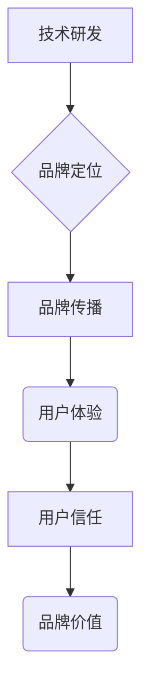

> AI创业公司,品牌塑造,技术领先,用户信任,人工智能,机器学习,深度学习,数据安全,伦理规范

## 1. 背景介绍

人工智能（AI）技术近年来发展迅速，涌现出大量AI创业公司，这些公司致力于将AI技术应用于各个领域，为社会带来创新和价值。然而，在激烈的市场竞争中，仅仅依靠技术领先是不够的，AI创业公司还需要建立良好的品牌形象，赢得用户的信任。

品牌塑造是AI创业公司长期发展的关键，它不仅能提升公司的知名度和美誉度，还能增强用户对产品的粘性和忠诚度。对于AI创业公司来说，品牌塑造需要兼顾技术领先和用户信任两个方面。

## 2. 核心概念与联系

**2.1 技术领先**

技术领先是AI创业公司品牌塑造的基础。AI技术发展迅速，用户对新技术和新产品的需求不断增长。AI创业公司需要不断投入研发，保持技术优势，才能在市场竞争中立于不败之地。

**2.2 用户信任**

用户信任是AI创业公司品牌塑造的关键。AI技术涉及到用户隐私、数据安全等敏感问题，用户对AI技术的应用存在一定的担忧和顾虑。AI创业公司需要通过透明的运营模式、完善的隐私保护机制和良好的用户体验，赢得用户的信任。

**2.3 品牌塑造的联系**

技术领先和用户信任是AI创业公司品牌塑造的两大支柱，两者相互促进，共同构成了AI创业公司的品牌价值。技术领先为品牌塑造提供了坚实的基础，用户信任则是品牌塑造的最终目标。

**2.4 品牌塑造流程图**



## 3. 核心算法原理 & 具体操作步骤

**3.1 算法原理概述**

深度学习算法是AI技术的重要组成部分，它能够从海量数据中学习到复杂的模式和规律。深度学习算法的核心是多层神经网络，通过层层叠加的神经元，能够实现对数据的抽象和特征提取。

**3.2 算法步骤详解**

1. 数据预处理：将原始数据进行清洗、转换和格式化，使其适合深度学习算法的训练。
2. 网络结构设计：根据任务需求设计深度神经网络的结构，包括神经元的数量、连接方式和激活函数等。
3. 训练模型：使用训练数据训练深度神经网络，通过调整网络参数，使模型能够准确地预测或分类数据。
4. 模型评估：使用测试数据评估模型的性能，并根据评估结果进行模型调优。
5. 模型部署：将训练好的模型部署到实际应用场景中，用于预测或分类新的数据。

**3.3 算法优缺点**

**优点：**

* 能够学习到复杂的模式和规律。
* 性能优于传统机器学习算法。
* 可应用于多种任务，例如图像识别、自然语言处理等。

**缺点：**

* 训练数据量大，需要大量的计算资源。
* 模型解释性差，难以理解模型的决策过程。
* 容易受到数据偏差的影响。

**3.4 算法应用领域**

深度学习算法广泛应用于各个领域，例如：

* **计算机视觉：**图像识别、目标检测、图像分割等。
* **自然语言处理：**文本分类、机器翻译、语音识别等。
* **推荐系统：**商品推荐、内容推荐等。
* **医疗诊断：**疾病诊断、影像分析等。

## 4. 数学模型和公式 & 详细讲解 & 举例说明

**4.1 数学模型构建**

深度学习算法的核心是多层神经网络，每个神经元接收多个输入信号，并通过激活函数进行处理，输出一个信号。神经网络的结构可以表示为一个 directed acyclic graph (DAG)，其中每个节点代表一个神经元，每个边代表一个连接。

**4.2 公式推导过程**

深度学习算法的训练过程是通过反向传播算法来实现的。反向传播算法的核心是计算每个神经元的梯度，并根据梯度更新神经元的权重和偏置。

**梯度下降公式：**

$$
\theta = \theta - \alpha \nabla J(\theta)
$$

其中：

* $\theta$ 是神经网络的参数。
* $\alpha$ 是学习率。
* $\nabla J(\theta)$ 是损失函数 $J(\theta)$ 对参数 $\theta$ 的梯度。

**4.3 案例分析与讲解**

假设我们有一个简单的深度神经网络，用于分类手写数字。网络结构包括两层神经元，第一层有 10 个神经元，第二层有 10 个神经元。每个神经元使用 sigmoid 激活函数。

训练数据包含 1000 个手写数字图像，每个图像对应一个数字标签。

通过反向传播算法，我们可以计算每个神经元的梯度，并根据梯度更新神经元的权重和偏置。

经过多次迭代训练，神经网络能够准确地识别手写数字。

## 5. 项目实践：代码实例和详细解释说明

**5.1 开发环境搭建**

* 操作系统：Ubuntu 20.04
* Python 版本：3.8
* 深度学习框架：TensorFlow 2.0

**5.2 源代码详细实现**

```python
import tensorflow as tf

# 定义神经网络模型
model = tf.keras.models.Sequential([
    tf.keras.layers.Dense(10, activation='relu', input_shape=(784,)),
    tf.keras.layers.Dense(10, activation='softmax')
])

# 编译模型
model.compile(optimizer='adam',
              loss='sparse_categorical_crossentropy',
              metrics=['accuracy'])

# 加载手写数字数据集
(x_train, y_train), (x_test, y_test) = tf.keras.datasets.mnist.load_data()

# 数据预处理
x_train = x_train.reshape(-1, 784).astype('float32') / 255
x_test = x_test.reshape(-1, 784).astype('float32') / 255

# 训练模型
model.fit(x_train, y_train, epochs=5)

# 评估模型
loss, accuracy = model.evaluate(x_test, y_test)
print('Test loss:', loss)
print('Test accuracy:', accuracy)
```

**5.3 代码解读与分析**

* 代码首先定义了一个简单的深度神经网络模型，包含两层神经元。
* 然后，模型被编译，指定了优化器、损失函数和评估指标。
* 接着，加载了手写数字数据集，并对数据进行了预处理。
* 最后，训练模型并评估模型的性能。

**5.4 运行结果展示**

训练完成后，模型能够准确地识别手写数字。

## 6. 实际应用场景

**6.1 医疗诊断**

深度学习算法可以用于辅助医生进行疾病诊断，例如识别肿瘤、分析影像数据等。

**6.2 金融风险控制**

深度学习算法可以用于识别金融欺诈、评估信用风险等。

**6.3 自动驾驶**

深度学习算法可以用于训练自动驾驶汽车，识别道路场景、预测车辆运动等。

**6.4 未来应用展望**

随着AI技术的不断发展，深度学习算法将在更多领域得到应用，例如个性化教育、智能家居、机器人等。

## 7. 工具和资源推荐

**7.1 学习资源推荐**

* **书籍：**
    * 深度学习
    * 构建深度学习模型
* **在线课程：**
    * Coursera 深度学习课程
    * Udacity 深度学习工程师 Nanodegree

**7.2 开发工具推荐**

* **深度学习框架：**
    * TensorFlow
    * PyTorch
* **数据处理工具：**
    * Pandas
    * NumPy

**7.3 相关论文推荐**

* **AlexNet：** ImageNet Classification with Deep Convolutional Neural Networks
* **VGGNet：** Very Deep Convolutional Networks for Large-Scale Image Recognition
* **ResNet：** Deep Residual Learning for Image Recognition

## 8. 总结：未来发展趋势与挑战

**8.1 研究成果总结**

深度学习算法取得了显著的成果，在图像识别、自然语言处理等领域取得了突破性进展。

**8.2 未来发展趋势**

* 模型规模和复杂度将进一步提高。
* 算法效率和鲁棒性将得到提升。
* 深度学习将与其他技术融合，例如强化学习、迁移学习等。

**8.3 面临的挑战**

* 数据获取和隐私保护。
* 模型解释性和可解释性。
* 算法公平性和伦理问题。

**8.4 研究展望**

未来，深度学习研究将继续朝着更智能、更安全、更可解释的方向发展。

## 9. 附录：常见问题与解答

**9.1 如何选择合适的深度学习框架？**

选择深度学习框架需要根据具体项目需求和个人偏好。TensorFlow 和 PyTorch 是目前最流行的深度学习框架，各有优缺点。

**9.2 如何处理深度学习模型的过拟合问题？**

过拟合是指模型在训练数据上表现良好，但在测试数据上表现差。

处理过拟合的方法包括：

* 增加训练数据量。
* 使用正则化技术，例如 L1 正则化和 L2 正则化。
* 使用 dropout 技术，随机丢弃部分神经元。
* 使用早停策略，在模型性能开始下降时停止训练。

**9.3 如何评估深度学习模型的性能？**

深度学习模型的性能可以使用多种指标来评估，例如准确率、召回率、F1-score 等。

选择合适的评估指标需要根据具体任务需求。


作者：禅与计算机程序设计艺术 / Zen and the Art of Computer Programming 
<end_of_turn>