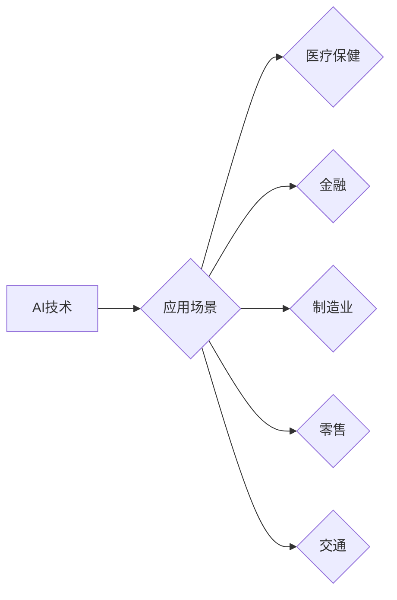

> 人工智能 (AI)
> 深度学习 (Deep Learning)
> 自然语言处理 (NLP)
> 计算机视觉 (Computer Vision)
> 机器学习 (Machine Learning)
> 应用场景
> 趋势

## 1. 背景介绍

人工智能 (AI) 正以惊人的速度发展，从最初的局限性应用，逐渐渗透到各个领域，深刻地改变着我们的生活方式和工作模式。深度学习 (Deep Learning) 作为 AI 的重要分支，凭借其强大的学习能力和泛化能力，在图像识别、语音识别、自然语言处理等领域取得了突破性的进展。然而，技术的进步离不开应用场景的驱动。

本篇文章将探讨 AI 技术的最新趋势，并分析其在不同领域的应用场景，旨在为读者提供对 AI 技术发展方向的深入理解，以及在实际应用中如何有效利用 AI 技术的洞察。

## 2. 核心概念与联系

**2.1  人工智能 (AI)**

人工智能是指模拟人类智能行为的计算机系统。它涵盖了广泛的领域，包括：

* **机器学习 (Machine Learning)**：使计算机能够从数据中学习，并根据学习到的知识进行预测或决策。
* **深度学习 (Deep Learning)**：一种基于多层神经网络的机器学习方法，能够学习更复杂的特征表示。
* **自然语言处理 (NLP)**：使计算机能够理解和处理人类语言。
* **计算机视觉 (Computer Vision)**：使计算机能够“看”图像和视频，并从中提取信息。

**2.2  AI 技术与应用场景的联系**

AI 技术的应用场景非常广泛，几乎涵盖了所有领域。

* **医疗保健**: AI 可以用于疾病诊断、药物研发、个性化治疗等。
* **金融**: AI 可以用于欺诈检测、风险管理、投资决策等。
* **制造业**: AI 可以用于智能制造、质量控制、预测维护等。
* **零售**: AI 可以用于个性化推荐、库存管理、客户服务等。
* **交通**: AI 可以用于自动驾驶、交通流量管理、智能交通信号灯等。

**2.3  AI 应用场景的未来发展趋势**

* **更广泛的应用**: AI 将应用于更多领域，例如教育、娱乐、农业等。
* **更智能的应用**: AI 系统将更加智能，能够更好地理解和响应人类需求。
* **更个性化的应用**: AI 将提供更加个性化的服务，例如个性化教育、个性化医疗等。

**Mermaid 流程图**



## 3. 核心算法原理 & 具体操作步骤

**3.1  算法原理概述**

深度学习算法的核心是多层神经网络。神经网络由多个层组成，每层包含多个神经元。每个神经元接收来自上一层的输入，并通过权重进行加权求和，然后经过激活函数处理，输出到下一层。通过训练神经网络，可以调整每个神经元的权重，使网络能够学习到数据的特征表示。

**3.2  算法步骤详解**

1. **数据预处理**: 将原始数据转换为深度学习算法可以处理的格式，例如归一化、编码等。
2. **网络结构设计**: 根据任务需求设计神经网络的结构，包括层数、神经元数量、激活函数等。
3. **模型训练**: 使用训练数据训练神经网络，通过反向传播算法调整神经元的权重，使网络的预测结果越来越准确。
4. **模型评估**: 使用测试数据评估模型的性能，例如准确率、召回率、F1-score等。
5. **模型部署**: 将训练好的模型部署到实际应用场景中，用于进行预测或决策。

**3.3  算法优缺点**

**优点**:

* 强大的学习能力，能够学习到复杂的数据特征。
* 泛化能力强，能够应用于不同的数据和任务。

**缺点**:

* 需要大量的训练数据。
* 训练时间长，计算资源消耗大。
* 模型解释性差，难以理解模型的决策过程。

**3.4  算法应用领域**

* **图像识别**: 人脸识别、物体检测、图像分类等。
* **语音识别**: 语音转文本、语音助手等。
* **自然语言处理**: 机器翻译、文本摘要、情感分析等。

## 4. 数学模型和公式 & 详细讲解 & 举例说明

**4.1  数学模型构建**

深度学习算法的核心是神经网络，其数学模型可以表示为：

$$
y = f(W^L x^L + b^L)
$$

其中：

* $y$ 是网络的输出。
* $x^L$ 是第 $L$ 层的输入。
* $W^L$ 是第 $L$ 层的权重矩阵。
* $b^L$ 是第 $L$ 层的偏置向量。
* $f$ 是激活函数。

**4.2  公式推导过程**

神经网络的训练过程是通过反向传播算法来进行的。反向传播算法的核心思想是：

1. 计算网络的输出与真实值的误差。
2. 根据误差反向传播，计算每个神经元的梯度。
3. 使用梯度下降算法更新神经元的权重和偏置。

**4.3  案例分析与讲解**

例如，在图像分类任务中，我们可以使用卷积神经网络 (CNN) 来进行训练。CNN 的结构包含多个卷积层、池化层和全连接层。卷积层用于提取图像的特征，池化层用于降低特征的维度，全连接层用于分类。

## 5. 项目实践：代码实例和详细解释说明

**5.1  开发环境搭建**

* Python 3.x
* TensorFlow 或 PyTorch

**5.2  源代码详细实现**

```python
import tensorflow as tf

# 定义模型结构
model = tf.keras.models.Sequential([
    tf.keras.layers.Conv2D(32, (3, 3), activation='relu', input_shape=(28, 28, 1)),
    tf.keras.layers.MaxPooling2D((2, 2)),
    tf.keras.layers.Conv2D(64, (3, 3), activation='relu'),
    tf.keras.layers.MaxPooling2D((2, 2)),
    tf.keras.layers.Flatten(),
    tf.keras.layers.Dense(10, activation='softmax')
])

# 编译模型
model.compile(optimizer='adam',
              loss='sparse_categorical_crossentropy',
              metrics=['accuracy'])

# 训练模型
model.fit(x_train, y_train, epochs=5)

# 评估模型
loss, accuracy = model.evaluate(x_test, y_test)
print('Test loss:', loss)
print('Test accuracy:', accuracy)
```

**5.3  代码解读与分析**

这段代码定义了一个简单的卷积神经网络模型，用于手写数字识别任务。

* `tf.keras.models.Sequential` 创建了一个顺序模型，即层级结构。
* `tf.keras.layers.Conv2D` 定义了一个卷积层，用于提取图像特征。
* `tf.keras.layers.MaxPooling2D` 定义了一个池化层，用于降低特征的维度。
* `tf.keras.layers.Flatten` 将多维特征转换为一维向量。
* `tf.keras.layers.Dense` 定义了一个全连接层，用于分类。
* `model.compile` 编译模型，指定优化器、损失函数和评价指标。
* `model.fit` 训练模型，使用训练数据进行训练。
* `model.evaluate` 评估模型，使用测试数据进行评估。

**5.4  运行结果展示**

训练完成后，模型的准确率会随着训练轮数的增加而提高。

## 6. 实际应用场景

**6.1  医疗保健**

* **疾病诊断**: AI 可以分析患者的影像数据，例如 X 光片、CT 扫描、MRI 扫描等，辅助医生诊断疾病。
* **药物研发**: AI 可以加速药物研发过程，例如预测药物的活性、筛选潜在的药物靶点等。
* **个性化治疗**: AI 可以根据患者的基因信息、生活方式等因素，制定个性化的治疗方案。

**6.2  金融**

* **欺诈检测**: AI 可以分析交易数据，识别异常交易，防止欺诈行为。
* **风险管理**: AI 可以评估投资风险，帮助金融机构做出更明智的决策。
* **投资决策**: AI 可以分析市场数据，预测股票价格走势，辅助投资者进行投资决策。

**6.3  制造业**

* **智能制造**: AI 可以控制生产设备，实现自动化生产，提高生产效率。
* **质量控制**: AI 可以识别产品缺陷，提高产品质量。
* **预测维护**: AI 可以分析设备运行数据，预测设备故障，及时进行维护。

**6.4  未来应用展望**

AI 技术的应用场景将更加广泛，例如：

* **教育**: AI 可以提供个性化的学习方案，辅助教师教学。
* **娱乐**: AI 可以生成更逼真的游戏场景，提供更沉浸式的游戏体验。
* **农业**: AI 可以优化农业生产，提高粮食产量。

## 7. 工具和资源推荐

**7.1  学习资源推荐**

* **在线课程**: Coursera, edX, Udacity
* **书籍**: 深度学习，机器学习实战
* **博客**: Towards Data Science, Machine Learning Mastery

**7.2  开发工具推荐**

* **TensorFlow**: 开源深度学习框架
* **PyTorch**: 开源深度学习框架
* **Keras**: 高级深度学习API

**7.3  相关论文推荐**

* **ImageNet Classification with Deep Convolutional Neural Networks**
* **Attention Is All You Need**
* **BERT: Pre-training of Deep Bidirectional Transformers for Language Understanding**

## 8. 总结：未来发展趋势与挑战

**8.1  研究成果总结**

近年来，AI 技术取得了长足的进步，在图像识别、语音识别、自然语言处理等领域取得了突破性的进展。

**8.2  未来发展趋势**

* **更强大的计算能力**: 随着计算能力的提升，AI 模型将更加复杂，能够学习到更复杂的特征表示。
* **更丰富的训练数据**: 随着数据量的增加，AI 模型的训练效果将更加显著。
* **更广泛的应用场景**: AI 将应用于更多领域，例如医疗保健、金融、制造业等。

**8.3  面临的挑战**

* **数据隐私和安全**: AI 模型的训练需要大量数据，如何保护数据隐私和安全是一个重要的挑战。
* **算法可解释性**: 许多 AI 模型的决策过程难以理解，如何提高算法的可解释性是一个重要的研究方向。
* **伦理问题**: AI 技术的应用可能带来一些伦理问题，例如算法偏见、工作岗位替代等，需要引起社会广泛关注。

**8.4  研究展望**

未来，AI 研究将继续朝着更智能、更安全、更可解释的方向发展。


## 9. 附录：常见问题与解答

**9.1  什么是深度学习？**

深度学习是一种机器学习方法，它使用多层神经网络来学习数据特征。

**9.2  深度学习有哪些应用场景？**

深度学习的应用场景非常广泛，例如图像识别、语音识别、自然语言处理等。

**9.3  如何学习深度学习？**

可以通过在线课程、书籍、博客等方式学习深度学习。

**9.4  有哪些深度学习框架？**

常见的深度学习框架包括 TensorFlow、PyTorch、Keras 等。


作者：禅与计算机程序设计艺术 / Zen and the Art of Computer Programming 
<end_of_turn>