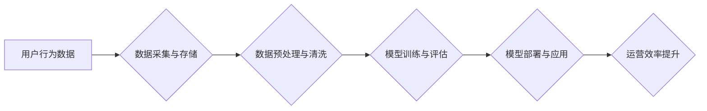

>  电商平台、人工智能、运营效率、推荐系统、个性化服务、机器学习、深度学习、自然语言处理

## 1. 背景介绍

随着电子商务行业的蓬勃发展，电商平台面临着日益激烈的市场竞争。为了提升运营效率、增强用户体验，电商平台需要不断探索新的技术手段。人工智能（AI）作为一门新兴技术，凭借其强大的数据处理能力和智能决策能力，为电商平台的运营效率提升提供了新的思路和解决方案。

传统的电商平台运营模式主要依赖于人工干预，例如商品推荐、用户画像分析、营销活动策划等。然而，随着用户数量和商品种类不断增加，人工操作效率低下，难以满足平台快速发展的需求。而AI技术能够自动学习和分析海量数据，识别用户需求和市场趋势，从而实现自动化运营、智能决策，有效提升电商平台的运营效率。

## 2. 核心概念与联系

### 2.1  电商平台运营效率

电商平台运营效率是指平台在有限的资源条件下，完成各项运营任务的效率水平。它包括商品上架、订单处理、物流配送、客户服务等多个环节的效率。提升运营效率可以降低运营成本，提高平台盈利能力，增强用户体验。

### 2.2  人工智能技术

人工智能技术是指模拟人类智能行为的计算机科学领域。它涵盖了机器学习、深度学习、自然语言处理、计算机视觉等多个分支。

### 2.3  AI在电商平台运营中的应用

AI技术在电商平台运营中的应用主要集中在以下几个方面：

* **商品推荐:** 基于用户浏览历史、购买记录、兴趣偏好等数据，推荐个性化商品，提高用户转化率。
* **用户画像分析:** 通过分析用户行为数据，构建用户画像，精准定位用户需求，提供个性化服务。
* **营销活动策划:** 利用AI算法分析市场趋势和用户行为，制定精准的营销策略，提高营销效果。
* **智能客服:** 利用自然语言处理技术，构建智能客服系统，自动解答用户疑问，提高客户服务效率。
* **物流配送优化:** 利用机器学习算法优化物流配送路线，提高配送效率和降低成本。

**AI在电商平台运营中的应用架构**



## 3. 核心算法原理 & 具体操作步骤

### 3.1  算法原理概述

在电商平台运营中，常用的AI算法包括：

* **协同过滤算法:** 基于用户或商品之间的相似性，推荐相关商品。
* **内容过滤算法:** 基于商品的特征信息，推荐符合用户兴趣的商品。
* **深度学习算法:** 利用多层神经网络，学习更复杂的特征，提高推荐准确率。
* **自然语言处理算法:** 用于分析用户评论、聊天记录等文本数据，了解用户需求和反馈。

### 3.2  算法步骤详解

以协同过滤算法为例，其具体操作步骤如下：

1. **数据收集:** 收集用户行为数据，例如用户对商品的评分、购买记录、浏览历史等。
2. **数据预处理:** 对数据进行清洗、去噪、格式转换等处理，确保数据质量。
3. **相似度计算:** 计算用户或商品之间的相似度，例如使用余弦相似度、皮尔逊相关系数等。
4. **推荐生成:** 根据用户或商品的相似度，推荐相关商品。

### 3.3  算法优缺点

**协同过滤算法的优缺点:**

* **优点:** 能够发现隐含的用户偏好，推荐个性化商品。
* **缺点:** 数据稀疏性问题，新用户或新商品难以推荐。

### 3.4  算法应用领域

协同过滤算法广泛应用于电商平台的商品推荐系统、音乐推荐系统、电影推荐系统等领域。

## 4. 数学模型和公式 & 详细讲解 & 举例说明

### 4.1  数学模型构建

协同过滤算法的数学模型可以表示为用户-商品评分矩阵，其中每个元素代表用户对商品的评分。

**用户-商品评分矩阵:**

```
| 用户 | 商品1 | 商品2 | 商品3 |
|---|---|---|---|
| 用户1 | 5 | 3 | 4 |
| 用户2 | 4 | 5 | 2 |
| 用户3 | 3 | 4 | 5 |
```

### 4.2  公式推导过程

协同过滤算法的核心是计算用户或商品之间的相似度。常用的相似度度量方法包括余弦相似度和皮尔逊相关系数。

**余弦相似度:**

$$
\text{相似度} = \frac{\mathbf{u} \cdot \mathbf{v}}{\|\mathbf{u}\| \|\mathbf{v}\|}
$$

其中，$\mathbf{u}$ 和 $\mathbf{v}$ 分别代表两个用户的评分向量，$\cdot$ 表示点积，$\|\mathbf{u}\|$ 和 $\|\mathbf{v}\|$ 分别代表两个向量的模长。

**皮尔逊相关系数:**

$$
\text{相似度} = \frac{\sum_{i=1}^{n}(u_i - \bar{u})(v_i - \bar{v})}{\sqrt{\sum_{i=1}^{n}(u_i - \bar{u})^2} \sqrt{\sum_{i=1}^{n}(v_i - \bar{v})^2}}
$$

其中，$u_i$ 和 $v_i$ 分别代表两个用户对第 $i$ 个商品的评分，$\bar{u}$ 和 $\bar{v}$ 分别代表两个用户的平均评分。

### 4.3  案例分析与讲解

假设有两个用户，用户1对商品A评分为5，对商品B评分为3，对商品C评分为4；用户2对商品A评分为4，对商品B评分为5，对商品C评分为2。

使用余弦相似度计算用户1和用户2的相似度：

```
u1 = [5, 3, 4]
v2 = [4, 5, 2]
```

计算结果为：

$$
\text{相似度} = \frac{(5*4) + (3*5) + (4*2)}{\sqrt{5^2 + 3^2 + 4^2} \sqrt{4^2 + 5^2 + 2^2}} = 0.75
$$

结果表明，用户1和用户2的相似度为0.75，说明他们对商品的偏好有一定的相似性。

## 5. 项目实践：代码实例和详细解释说明

### 5.1  开发环境搭建

* 操作系统：Windows/Linux/macOS
* Python版本：3.6+
* 必要的库：pandas, numpy, scikit-learn

### 5.2  源代码详细实现

```python
import pandas as pd
from sklearn.metrics.pairwise import cosine_similarity

# 加载用户-商品评分数据
data = pd.read_csv('ratings.csv')

# 构建用户-商品评分矩阵
user_item_matrix = data.pivot_table(index='user_id', columns='item_id', values='rating')

# 计算用户之间的余弦相似度
user_similarity = cosine_similarity(user_item_matrix)

# 获取用户1与其他用户的相似度
user1_similarity = user_similarity[0]

# 打印用户1与其他用户的相似度
print(user1_similarity)
```

### 5.3  代码解读与分析

* 首先，加载用户-商品评分数据，并构建用户-商品评分矩阵。
* 然后，使用scikit-learn库中的cosine_similarity函数计算用户之间的余弦相似度。
* 最后，获取用户1与其他用户的相似度，并打印出来。

### 5.4  运行结果展示

运行代码后，会输出一个包含用户1与其他用户相似度的数组。

## 6. 实际应用场景

### 6.1  商品推荐系统

AI技术可以帮助电商平台构建个性化商品推荐系统，根据用户的浏览历史、购买记录、兴趣偏好等数据，推荐符合用户需求的商品，提高用户转化率。

### 6.2  用户画像分析

AI技术可以帮助电商平台分析用户行为数据，构建用户画像，了解用户的兴趣爱好、消费习惯、购买偏好等信息，为精准营销提供数据支持。

### 6.3  营销活动策划

AI技术可以帮助电商平台分析市场趋势和用户行为，制定精准的营销策略，例如精准推送优惠券、个性化广告投放等，提高营销效果。

### 6.4  未来应用展望

随着AI技术的不断发展，其在电商平台运营中的应用场景将更加广泛，例如：

* **智能客服:** 利用自然语言处理技术，构建智能客服系统，自动解答用户疑问，提高客户服务效率。
* **物流配送优化:** 利用机器学习算法优化物流配送路线，提高配送效率和降低成本。
* **个性化商品设计:** 利用AI技术分析用户需求，设计个性化商品，满足用户多样化需求。

## 7. 工具和资源推荐

### 7.1  学习资源推荐

* **在线课程:** Coursera, edX, Udemy等平台提供丰富的AI课程。
* **书籍:** 《深度学习》、《机器学习实战》等书籍。
* **博客:** Towards Data Science, Machine Learning Mastery等博客。

### 7.2  开发工具推荐

* **Python:** 作为AI开发的常用语言，Python拥有丰富的库和框架，例如TensorFlow, PyTorch, scikit-learn等。
* **Jupyter Notebook:** 用于编写和运行Python代码的交互式环境。
* **云计算平台:** AWS, Azure, GCP等云计算平台提供AI开发所需的计算资源和服务。

### 7.3  相关论文推荐

* **Attention Is All You Need:** https://arxiv.org/abs/1706.03762
* **BERT: Pre-training of Deep Bidirectional Transformers for Language Understanding:** https://arxiv.org/abs/1810.04805

## 8. 总结：未来发展趋势与挑战

### 8.1  研究成果总结

AI技术在电商平台运营中的应用取得了显著成果，例如商品推荐准确率提升、用户转化率提高、运营效率提升等。

### 8.2  未来发展趋势

* **更精准的个性化推荐:** 利用更先进的AI算法，例如深度学习、强化学习等，实现更精准的个性化商品推荐。
* **更智能的客户服务:** 利用自然语言处理技术，构建更智能的客服系统，能够理解用户需求，提供更精准的帮助。
* **更有效的营销活动:** 利用AI技术分析用户行为数据，制定更有效的营销策略，提高营销效果。

### 8.3  面临的挑战

* **数据安全和隐私保护:** AI算法需要大量数据进行训练，如何保证数据安全和用户隐私保护是一个重要的挑战。
* **算法解释性和可解释性:** 许多AI算法是黑箱模型，难以解释其决策过程，如何提高算法的解释性和可解释性是一个重要的研究方向。
* **算法公平性和偏见:** AI算法可能存在公平性和偏见问题，如何确保算法公平公正是一个重要的挑战。

### 8.4  研究展望

未来，AI技术在电商平台运营中的应用将更加广泛和深入，需要不断探索新的算法、新的应用场景，并解决数据安全、算法解释性、算法公平性等挑战。


## 9. 附录：常见问题与解答

**Q1: AI技术是否会取代人类工作？**

A1: AI技术可以自动化一些重复性工作，但不会完全取代人类工作。AI技术更像是人类的助手，可以帮助人类提高效率，解放人力，专注于更需要创造力和决策能力的工作。

**Q2: 如何学习AI技术？**

A2: 可以通过在线课程、书籍、博客等方式学习AI技术。建议从基础知识开始学习，逐步深入到更高级的算法和应用。

**Q3: 如何应用AI技术到电商平台运营