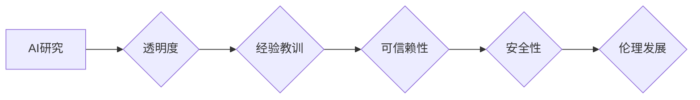

> AI透明度，经验教训，模型解释，可解释AI，AI伦理，AI安全，AI可信赖性

## 1. 背景介绍

人工智能（AI）技术近年来取得了飞速发展，在各个领域都展现出巨大的潜力。从自动驾驶到医疗诊断，从金融预测到个性化推荐，AI正在深刻地改变着我们的生活。然而，随着AI技术的不断发展，其黑箱属性也日益凸显，引发了人们对AI透明度的担忧。

AI模型的复杂性使得其决策过程难以理解，这导致了对AI系统决策的信任度下降，也增加了AI系统潜在风险的隐患。例如，在医疗诊断领域，如果AI模型的决策过程无法被解释，医生可能难以接受其诊断结果，从而影响患者的治疗方案。

因此，提高AI研究的透明度，分享经验教训，对于促进AI技术的可信赖性、安全性以及伦理发展至关重要。

## 2. 核心概念与联系

**2.1 透明度**

在AI研究中，透明度是指AI模型的决策过程能够被人类理解和解释的能力。透明度越高，人类就越能理解AI模型是如何做出决策的，从而更容易信任其结果。

**2.2 经验教训**

经验教训是指在AI研究过程中积累的知识、经验和教训，包括成功案例、失败案例以及从中获得的启示。分享经验教训可以帮助其他研究者避免重复犯错，更快地取得进展。

**2.3 联系**

透明度和经验教训是相互关联的。通过提高AI研究的透明度，可以更好地分享经验教训，反过来，分享经验教训也可以促进AI研究的透明度。

**2.4 流程图**



## 3. 核心算法原理 & 具体操作步骤

**3.1 算法原理概述**

**可解释机器学习 (XAI)** 是一种旨在提高机器学习模型透明度的技术。XAI 的目标是使人类能够理解机器学习模型的决策过程，并解释其预测结果。

**3.2 算法步骤详解**

1. **选择合适的解释方法:** 不同的解释方法适用于不同的机器学习模型和任务。常见的解释方法包括：
    * **局部解释:** 例如 LIME 和 SHAP，可以解释单个预测结果背后的重要特征。
    * **全局解释:** 例如特征重要性分析，可以解释模型中所有特征的重要性。
2. **应用解释方法:** 将选择的解释方法应用于机器学习模型，并生成解释结果。
3. **可视化解释结果:** 将解释结果以易于理解的方式可视化，例如使用图表、热力图或交互式可视化工具。

**3.3 算法优缺点**

**优点:**

* 提高模型透明度，帮助人类理解模型决策过程。
* 增强模型信任度，促进模型的应用。
* 帮助发现模型的偏差和错误，从而改进模型性能。

**缺点:**

* 解释结果可能难以理解，需要专业知识进行解读。
* 解释方法可能存在局限性，无法完全解释模型的决策过程。
* 解释过程可能增加计算成本。

**3.4 算法应用领域**

* 医疗诊断
* 金融风险评估
* 刑事司法
* 自动驾驶

## 4. 数学模型和公式 & 详细讲解 & 举例说明

**4.1 数学模型构建**

假设我们有一个分类模型，其目标是预测一个样本属于某个类别的概率。我们可以使用逻辑回归模型来实现这个目标。逻辑回归模型的输出是一个概率值，该值介于0和1之间，表示样本属于某个类别的概率。

**4.2 公式推导过程**

逻辑回归模型的输出可以使用以下公式计算：

$$
p(y=1|x) = \frac{1}{1 + e^{-(w^T x + b)}}
$$

其中：

* $p(y=1|x)$ 是样本 $x$ 属于类别 1 的概率。
* $w$ 是模型的参数向量。
* $x$ 是样本的特征向量。
* $b$ 是模型的偏置项。
* $e$ 是自然对数的底数。

**4.3 案例分析与讲解**

假设我们有一个二分类问题，目标是预测一个样本是否属于某个疾病类别。我们可以使用逻辑回归模型来实现这个目标。

我们收集了大量样本数据，每个样本包含多个特征，例如年龄、性别、症状等。我们使用这些数据训练逻辑回归模型，并得到模型参数 $w$ 和 $b$。

当我们遇到一个新的样本时，我们可以使用模型参数 $w$ 和 $b$ 计算该样本属于疾病类别的概率。如果该概率大于某个阈值，则我们认为该样本属于疾病类别。

## 5. 项目实践：代码实例和详细解释说明

**5.1 开发环境搭建**

* Python 3.6+
* TensorFlow 2.0+
* Jupyter Notebook

**5.2 源代码详细实现**

```python
import tensorflow as tf

# 定义逻辑回归模型
model = tf.keras.models.Sequential([
    tf.keras.layers.Dense(units=1, activation='sigmoid')
])

# 编译模型
model.compile(optimizer='adam',
              loss='binary_crossentropy',
              metrics=['accuracy'])

# 训练模型
model.fit(x_train, y_train, epochs=10)

# 评估模型
loss, accuracy = model.evaluate(x_test, y_test)
print('Loss:', loss)
print('Accuracy:', accuracy)
```

**5.3 代码解读与分析**

* 我们使用 TensorFlow 库构建了一个简单的逻辑回归模型。
* 模型只有一个全连接层，输出层使用 sigmoid 激活函数，用于生成概率值。
* 我们使用 Adam 优化器、二元交叉熵损失函数和准确率作为评估指标。
* 我们使用训练数据训练模型，并使用测试数据评估模型性能。

**5.4 运行结果展示**

运行代码后，会输出模型的损失值和准确率。

## 6. 实际应用场景

**6.1 医疗诊断**

AI模型可以帮助医生诊断疾病，例如癌症、心血管疾病等。通过分析患者的病历、影像数据等信息，AI模型可以识别疾病的特征，并给出诊断建议。

**6.2 金融风险评估**

AI模型可以帮助金融机构评估客户的信用风险，例如贷款风险、欺诈风险等。通过分析客户的财务数据、行为数据等信息，AI模型可以预测客户是否会违约或进行欺诈行为。

**6.3 刑事司法**

AI模型可以帮助司法系统进行犯罪预测和风险评估。通过分析犯罪者的个人信息、犯罪记录等信息，AI模型可以预测犯罪者的再次犯罪风险。

**6.4 未来应用展望**

随着AI技术的不断发展，其应用场景将更加广泛。例如，AI可以用于自动驾驶、个性化教育、智能家居等领域。

## 7. 工具和资源推荐

**7.1 学习资源推荐**

* **书籍:**
    * "Interpretable Machine Learning" by Christoph Molnar
    * "The Hundred-Page Machine Learning Book" by Andriy Burkov
* **在线课程:**
    * Coursera: "Machine Learning" by Andrew Ng
    * edX: "Artificial Intelligence" by Columbia University

**7.2 开发工具推荐**

* **TensorFlow:** https://www.tensorflow.org/
* **PyTorch:** https://pytorch.org/
* **Scikit-learn:** https://scikit-learn.org/

**7.3 相关论文推荐**

* "Towards a Rigorous Science of Interpretable Machine Learning" by Christoph Molnar
* "SHAP: A Unified Approach to Interpreting Model Predictions" by Scott Lundberg and Su-In Lee

## 8. 总结：未来发展趋势与挑战

**8.1 研究成果总结**

近年来，AI研究取得了显著进展，特别是可解释AI领域。各种解释方法和工具被开发出来，帮助人类理解AI模型的决策过程。

**8.2 未来发展趋势**

* **更强大的解释方法:** 未来将开发出更强大的解释方法，能够解释更复杂的模型，并提供更深入的洞察。
* **自动化解释:** 将自动化解释纳入AI开发流程，使解释成为AI开发的标准步骤。
* **跨领域应用:** 将可解释AI应用于更多领域，例如医疗、金融、教育等。

**8.3 面临的挑战**

* **解释结果的可理解性:** 解释结果需要以易于理解的方式呈现，以便人类能够理解。
* **解释方法的通用性:** 不同的解释方法适用于不同的模型和任务，需要开发出更通用的解释方法。
* **解释的成本:** 解释过程可能增加计算成本，需要找到更有效的解释方法。

**8.4 研究展望**

未来，AI研究需要更加注重透明度和可解释性。通过提高AI研究的透明度，我们可以更好地理解AI模型的决策过程，从而促进AI技术的可信赖性、安全性以及伦理发展。

## 9. 附录：常见问题与解答

**9.1 Q: 为什么需要提高AI研究的透明度？**

**A:** 提高AI研究的透明度可以帮助我们更好地理解AI模型的决策过程，从而增强模型的信任度，并降低模型的风险。

**9.2 Q: 如何提高AI研究的透明度？**

**A:** 可以通过使用可解释AI方法、分享经验教训、开源模型代码等方式提高AI研究的透明度。

**9.3 Q: AI研究的透明度与安全性有什么关系？**

**A:** AI研究的透明度可以帮助我们发现模型的潜在风险，从而提高模型的安全性。

**9.4 Q: AI研究的透明度与伦理有什么关系？**

**A:** AI研究的透明度可以帮助我们更好地理解AI模型的决策过程，从而确保AI技术的伦理发展。


作者：禅与计算机程序设计艺术 / Zen and the Art of Computer Programming 
<end_of_turn>