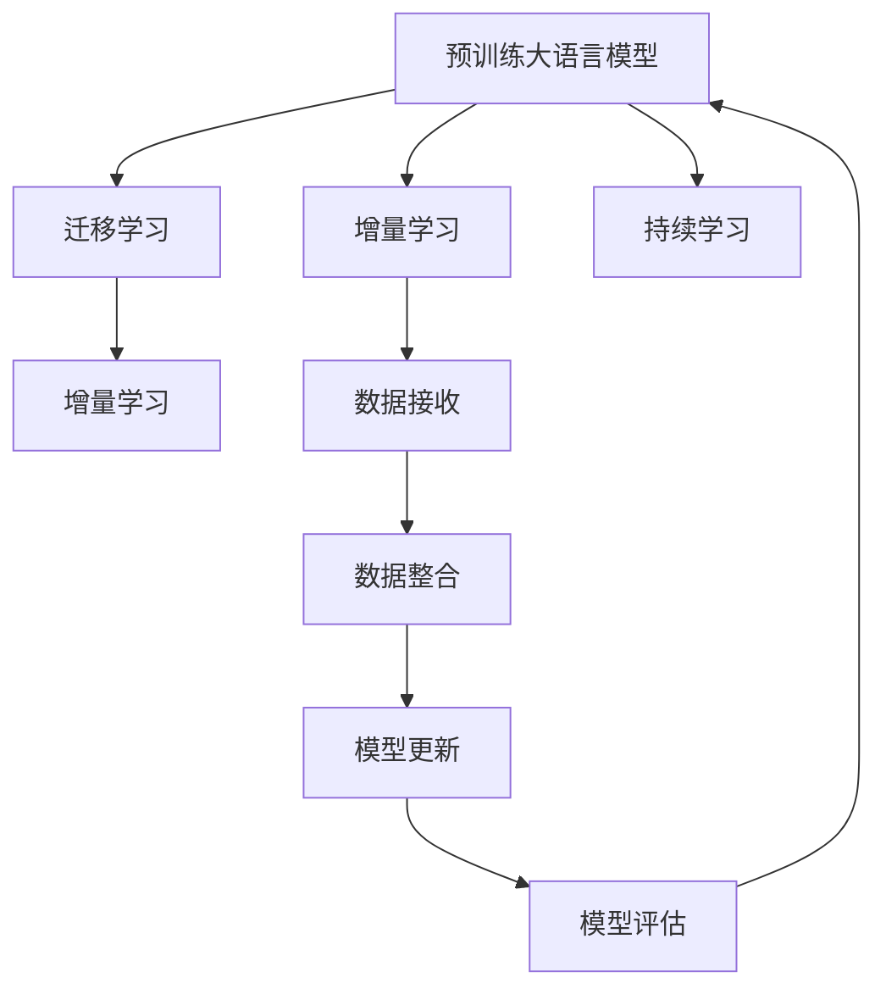

                 

# LLM的增量学习能力探索

在人工智能领域，增量学习（Incremental Learning）是一种持续从新数据中学习以增强模型能力的技术。特别是在自然语言处理（NLP）领域，增量学习可以帮助语言模型在新的数据到来时，及时更新自己的知识，保持对语言现象的敏锐感知。近年来，随着深度学习技术的发展，基于预训练的大语言模型（LLM）在增量学习方面也展现了巨大潜力。本文将详细探讨LLM的增量学习能力，包括其原理、步骤、优缺点、应用领域、数学模型、实践案例及未来发展趋势，为相关领域的开发者和研究者提供参考。

## 1. 背景介绍

### 1.1 问题由来
随着深度学习技术的快速发展，预训练大语言模型（LLM）在自然语言处理（NLP）领域取得了显著的进展。这些模型通常在大规模无标签文本语料上进行预训练，学习到丰富的语言知识和常识，具备强大的语言理解和生成能力。然而，由于预训练数据的有限性，LLM在特定领域的应用效果仍存在一定局限性。

增量学习作为一种持续更新模型能力的技术，可以让模型从新数据中学习并适应，弥补预训练数据的局限性。通过增量学习，LLM可以在特定领域或新出现的语言现象上不断提升自己的能力，扩展其应用范围。

### 1.2 问题核心关键点
增量学习的核心在于利用新数据持续更新模型参数，使其在不断变化的数据分布中保持高效和准确。对于LLM而言，增量学习主要面临以下挑战：

1. **模型更新策略**：如何在不丢失已有知识的情况下，有效利用新数据进行参数更新。
2. **数据整合**：如何将新数据与预训练数据进行整合，平衡已有知识和新知识。
3. **模型鲁棒性**：增量学习过程中如何避免模型过拟合，保持模型的鲁棒性。

## 2. 核心概念与联系

### 2.1 核心概念概述

为更好地理解LLM的增量学习能力，本节将介绍几个关键概念：

- **预训练大语言模型（LLM）**：以自回归（如GPT）或自编码（如BERT）模型为代表的大规模预训练语言模型。通过在大规模无标签文本语料上进行预训练，学习通用的语言表示。

- **增量学习（Incremental Learning）**：指模型在初始预训练后，通过不断接收新数据进行参数更新，持续提升模型的能力和泛化能力。

- **迁移学习（Transfer Learning）**：指将一个领域学习到的知识，迁移应用到另一个相关领域的知识学习范式。增量学习可以看作是一种特殊的迁移学习方式。

- **超参数调整**：增量学习过程中，需要调整学习率、批大小等超参数，以优化模型更新效果。

- **模型自适应性**：指模型在面对新数据时，能够快速适应并更新自己的知识，以适应数据分布的变化。

### 2.2 核心概念原理和架构的 Mermaid 流程图



这个流程图展示了LLM增量学习的基本流程：

1. 预训练大语言模型通过大规模无标签数据进行预训练，学习通用的语言表示。
2. 增量学习通过接收新数据，不断更新模型参数，增强模型的能力。
3. 迁移学习将预训练知识迁移到增量学习过程中，加速模型的更新。
4. 数据接收、整合、更新、评估等过程循环进行，使模型持续适应新的数据分布。

这些核心概念构成了LLM增量学习的基本框架，为理解增量学习技术提供了重要参考。

## 3. 核心算法原理 & 具体操作步骤

### 3.1 算法原理概述

LLM的增量学习是一种基于监督学习的微调（Fine-tuning）过程，其核心思想是利用新数据持续更新模型参数，使其适应新的数据分布。增量学习可以分为在线增量学习（Online Incremental Learning）和离线增量学习（Offline Incremental Learning）两种类型，具体选择哪种类型取决于数据可用性和计算资源。

在线增量学习：每次接收一个数据点进行模型更新，适用于数据流环境。
离线增量学习：批量接收数据进行模型更新，适用于数据存储容量较大的环境。

增量学习的关键在于：

1. **模型更新策略**：确定每次更新的数据量和模型参数更新方式。
2. **数据整合**：如何有效地将新数据与已有数据进行整合。
3. **模型鲁棒性**：如何在增量学习过程中避免过拟合，保持模型的泛化能力。

### 3.2 算法步骤详解

增量学习的基本步骤如下：

**Step 1: 准备数据集**
- 准备新数据的标注数据集 $D_{new}$，并将其划分为训练集和验证集。
- 准备现有数据集 $D_{old}$，并将其划分为训练集和验证集。

**Step 2: 选择增量学习算法**
- 根据数据类型和模型特点，选择合适的增量学习算法，如贝叶斯在线学习、加权平均法等。
- 确定每次更新的数据量 $N_{batch}$ 和模型参数更新频率。

**Step 3: 更新模型参数**
- 使用新数据集 $D_{new}$ 进行模型更新，通过反向传播计算梯度，更新模型参数 $\theta$。
- 选择适当的损失函数，如交叉熵损失或均方误差损失，衡量模型在新数据上的性能。

**Step 4: 评估模型性能**
- 在新数据集 $D_{new}$ 的验证集上评估模型性能。
- 根据验证集的表现，调整学习率等超参数，优化模型更新效果。

**Step 5: 重复执行**
- 不断接收新数据集 $D_{new}$，进行模型更新和评估。
- 保持模型自适应性，不断从新数据中学习，更新知识。

### 3.3 算法优缺点

增量学习有以下优点：

1. **高效性**：通过不断接收新数据进行模型更新，可以高效地提升模型性能。
2. **适应性**：适用于动态变化的数据分布，能快速适应新数据。
3. **低成本**：不需要重新训练模型，节省计算资源。

同时，增量学习也存在一些局限性：

1. **更新策略复杂**：需要选择合适的更新策略，以避免丢失已有知识。
2. **数据整合难度**：新数据和已有数据进行有效整合，需要解决数据分布和特征不一致等问题。
3. **过拟合风险**：增量学习过程中容易过拟合，需要采取措施进行缓解。

### 3.4 算法应用领域

增量学习在多个领域中展现了强大的应用潜力：

- **在线推荐系统**：通过增量学习，在线推荐系统可以持续接收用户反馈和新物品信息，更新推荐模型，提供个性化的推荐服务。
- **自然语言处理（NLP）**：增量学习使得NLP模型可以持续接收新数据，如对话数据、文本数据等，增强模型在特定任务上的性能。
- **金融预测**：金融市场数据具有高度动态性和随机性，增量学习可以实时接收新数据，更新模型，提升预测精度。
- **健康监测**：医疗数据不断生成，增量学习可以实时更新模型，预测病情发展趋势，提供个性化的健康建议。

以上领域展示了增量学习在实际应用中的广泛前景，未来在更多场景下将发挥重要作用。

## 4. 数学模型和公式 & 详细讲解 & 举例说明

### 4.1 数学模型构建

增量学习的基本数学模型可以表示为：

$$
\theta_{t+1} = \theta_t + \alpha_t \nabla_{\theta} \mathcal{L}(\theta_t, x_t, y_t)
$$

其中，$\theta_{t+1}$ 为更新后的模型参数，$\theta_t$ 为当前模型参数，$\alpha_t$ 为学习率，$x_t$ 为当前数据点的输入，$y_t$ 为输出标签，$\mathcal{L}(\theta_t, x_t, y_t)$ 为损失函数。

增量学习的目标是最小化模型在新数据上的损失函数 $\mathcal{L}(\theta_t, x_t, y_t)$，从而提升模型在新数据上的性能。

### 4.2 公式推导过程

以交叉熵损失函数为例，增量学习的推导过程如下：

假设当前模型的输出为 $\hat{y}_t = M_{\theta_t}(x_t)$，真实标签为 $y_t$。则交叉熵损失函数为：

$$
\mathcal{L}(\theta_t, x_t, y_t) = -y_t \log \hat{y}_t - (1-y_t) \log (1-\hat{y}_t)
$$

在增量学习过程中，每次接收一个数据点 $(x_t, y_t)$，计算其损失函数，并使用梯度下降更新模型参数：

$$
\theta_{t+1} = \theta_t - \alpha_t \nabla_{\theta} \mathcal{L}(\theta_t, x_t, y_t)
$$

其中，梯度 $\nabla_{\theta} \mathcal{L}(\theta_t, x_t, y_t)$ 可以通过反向传播算法高效计算。

### 4.3 案例分析与讲解

以在线推荐系统为例，分析增量学习的过程：

假设推荐系统已经训练好了一个推荐模型 $M_{\theta_t}$，并部署在线提供服务。随着用户对推荐结果的反馈不断增加，系统接收新的反馈数据 $(x_t, y_t)$，如用户对推荐物品的评分。通过增量学习，系统可以实时更新推荐模型，提升推荐精度。

**Step 1: 准备数据集**
- 准备用户反馈数据集 $D_{new}$，包含用户对推荐物品的评分。
- 准备已有数据集 $D_{old}$，包含用户历史行为数据。

**Step 2: 选择增量学习算法**
- 选择在线增量学习算法，如贝叶斯在线学习。
- 确定每次更新的数据量 $N_{batch}$ 和模型参数更新频率。

**Step 3: 更新模型参数**
- 使用新数据集 $D_{new}$ 进行模型更新，计算梯度并更新参数。
- 使用交叉熵损失函数衡量推荐效果。

**Step 4: 评估模型性能**
- 在新数据集 $D_{new}$ 的验证集上评估模型性能。
- 根据验证集表现调整学习率等超参数。

**Step 5: 重复执行**
- 持续接收新反馈数据，进行模型更新和评估。
- 保持推荐模型自适应性，不断从新数据中学习，更新推荐策略。

## 5. 项目实践：代码实例和详细解释说明

### 5.1 开发环境搭建

在进行增量学习实践前，我们需要准备好开发环境。以下是使用Python进行PyTorch开发的环境配置流程：

1. 安装Anaconda：从官网下载并安装Anaconda，用于创建独立的Python环境。

2. 创建并激活虚拟环境：
```bash
conda create -n pytorch-env python=3.8 
conda activate pytorch-env
```

3. 安装PyTorch：根据CUDA版本，从官网获取对应的安装命令。例如：
```bash
conda install pytorch torchvision torchaudio cudatoolkit=11.1 -c pytorch -c conda-forge
```

4. 安装TensorFlow：
```bash
pip install tensorflow
```

5. 安装各类工具包：
```bash
pip install numpy pandas scikit-learn matplotlib tqdm jupyter notebook ipython
```

完成上述步骤后，即可在`pytorch-env`环境中开始增量学习实践。

### 5.2 源代码详细实现

下面以在线推荐系统为例，给出使用PyTorch进行增量学习模型的PyTorch代码实现。

首先，定义推荐模型的损失函数和优化器：

```python
import torch
from torch.nn import Linear, ReLU, Softmax
from torch.nn import CrossEntropyLoss
from torch.optim import Adam

class RecommendationModel(torch.nn.Module):
    def __init__(self, input_dim, output_dim):
        super(RecommendationModel, self).__init__()
        self.fc1 = Linear(input_dim, 128)
        self.fc2 = Linear(128, 64)
        self.fc3 = Linear(64, output_dim)
    
    def forward(self, x):
        x = torch.relu(self.fc1(x))
        x = torch.relu(self.fc2(x))
        x = self.fc3(x)
        return x

model = RecommendationModel(input_dim=100, output_dim=5)
criterion = CrossEntropyLoss()
optimizer = Adam(model.parameters(), lr=0.001)
```

然后，定义增量学习函数：

```python
def incremental_learning(model, data_loader, batch_size):
    for batch_idx, (inputs, targets) in enumerate(data_loader):
        inputs = inputs.to(device)
        targets = targets.to(device)
        optimizer.zero_grad()
        outputs = model(inputs)
        loss = criterion(outputs, targets)
        loss.backward()
        optimizer.step()
```

最后，启动增量学习流程：

```python
data_loader = torch.utils.data.DataLoader(train_data, batch_size=batch_size, shuffle=True)

for epoch in range(num_epochs):
    for batch_idx, (inputs, targets) in enumerate(data_loader):
        incremental_learning(model, data_loader, batch_size)
```

以上就是使用PyTorch进行在线推荐系统增量学习模型的完整代码实现。可以看到，通过定义模型和损失函数，以及调用优化器和增量学习函数，可以方便地实现增量学习过程。

### 5.3 代码解读与分析

让我们再详细解读一下关键代码的实现细节：

**RecommendationModel类**：
- `__init__`方法：初始化模型参数，包括两个隐藏层的线性变换。
- `forward`方法：定义模型前向传播过程，经过两层线性变换和ReLU激活，输出预测结果。

**数据加载器（data_loader）**：
- 使用PyTorch的DataLoader，从训练数据集中生成批数据，供模型训练使用。

**优化器和增量学习函数**：
- 使用Adam优化器，设置适当的学习率。
- 定义增量学习函数，对每个批次的数据进行模型更新，计算梯度并更新参数。

**训练流程**：
- 在每个epoch内，对所有批次数据进行增量学习。
- 通过反向传播更新模型参数，不断提升推荐模型的性能。

## 6. 实际应用场景

### 6.1 推荐系统

增量学习在推荐系统中的应用最为广泛。推荐系统通常需要不断接收用户反馈和市场变化，及时更新推荐模型，提升推荐精度。通过增量学习，推荐系统可以持续接收新数据，更新模型参数，增强推荐效果。

在实际应用中，推荐系统需要处理海量数据，包括用户行为数据、商品描述数据等。通过增量学习，系统可以实时更新模型，快速响应用户需求和市场变化，提供个性化的推荐服务。

### 6.2 自然语言处理（NLP）

增量学习在NLP领域也有广泛应用。例如，基于预训练语言模型的增量学习可以在特定领域或新出现的语言现象上，不断提升模型能力。

具体而言，NLP任务如命名实体识别（NER）、情感分析（Sentiment Analysis）、机器翻译（MT）等，都可以通过增量学习不断更新模型，提升模型在特定任务上的性能。增量学习使得NLP模型可以持续接收新数据，如对话数据、文本数据等，增强模型在特定领域或新任务上的能力。

### 6.3 金融预测

金融市场数据具有高度动态性和随机性，增量学习可以帮助金融预测模型实时更新，提升预测精度。通过增量学习，模型可以不断接收新数据，如股票价格、市场指数、经济指标等，更新模型参数，增强预测能力。

在实际应用中，金融预测系统需要处理大量实时数据，增量学习可以帮助系统快速响应市场变化，提供更准确的预测结果，支持投资决策和风险控制。

### 6.4 未来应用展望

随着预训练语言模型和增量学习技术的不断进步，未来在更多领域将展现更广泛的应用前景：

1. **智慧城市治理**：增量学习可以帮助智慧城市治理系统实时接收各种传感器数据，更新模型，提升城市管理效率。
2. **医疗健康**：增量学习可以帮助医疗健康系统实时接收患者数据，更新诊断模型，提高诊疗精度。
3. **智能客服**：增量学习可以帮助智能客服系统持续接收客户对话数据，更新模型，提升客服体验。
4. **自动驾驶**：增量学习可以帮助自动驾驶系统实时接收传感器数据，更新模型，增强驾驶安全性。

未来，增量学习将带来更多智能化、自动化应用场景，为人类生产生活方式带来深刻变革。

## 7. 工具和资源推荐

### 7.1 学习资源推荐

为了帮助开发者系统掌握增量学习的理论基础和实践技巧，这里推荐一些优质的学习资源：

1. 《深度学习增量学习》系列博文：由深度学习专家撰写，详细介绍了增量学习的基本原理、算法和实践技巧。

2. Coursera《深度学习》课程：由斯坦福大学开设的深度学习课程，涵盖增量学习等内容，适合系统学习深度学习知识。

3. 《Incremental Learning》书籍：增量学习的经典书籍，系统介绍了增量学习的基本理论和算法，适合深入学习。

4. HuggingFace官方文档：Transformer库的官方文档，提供了丰富的增量学习样例代码，适合快速上手实践。

5. OpenAI的《GPT-3》白皮书：详细介绍了GPT-3模型的增量学习机制，展示了增量学习在实际应用中的效果。

通过对这些资源的学习实践，相信你一定能够快速掌握增量学习的精髓，并用于解决实际的NLP问题。

### 7.2 开发工具推荐

高效的开发离不开优秀的工具支持。以下是几款用于增量学习开发的常用工具：

1. PyTorch：基于Python的开源深度学习框架，支持动态计算图，适合增量学习模型的快速迭代研究。

2. TensorFlow：由Google主导开发的开源深度学习框架，支持多种计算图模式，适合大规模工程应用。

3. HuggingFace的Transformers库：提供了丰富的预训练模型和增量学习样例代码，适合快速实践增量学习。

4. Weights & Biases：模型训练的实验跟踪工具，可以记录和可视化模型训练过程中的各项指标，方便对比和调优。

5. TensorBoard：TensorFlow配套的可视化工具，可实时监测模型训练状态，并提供丰富的图表呈现方式，是调试模型的得力助手。

合理利用这些工具，可以显著提升增量学习任务的开发效率，加快创新迭代的步伐。

### 7.3 相关论文推荐

增量学习在学界和产业界得到了广泛研究，以下是几篇奠基性的相关论文，推荐阅读：

1. The Power of Incremental Knowledge Transfer: A Generalization Framework for Sequential Learning（incremental learning综述论文）
2. Online Learning: A Survey of Theory and Algorithms for Incremental Data Provisioning（增量学习综述论文）
3. Active Learning with Incremental Data Streams（增量学习与主动学习结合的论文）
4. Online Incremental Transfer Learning（增量学习和迁移学习结合的论文）
5. Continual Learning with Neural Networks: A Review（增量学习综述论文）

这些论文代表了大语言模型增量学习的发展脉络。通过学习这些前沿成果，可以帮助研究者把握学科前进方向，激发更多的创新灵感。

## 8. 总结：未来发展趋势与挑战

### 8.1 总结

本文对基于预训练大语言模型的增量学习技术进行了全面系统的介绍。首先阐述了增量学习的基本原理和背景，明确了其在提升模型适应性、增强模型能力方面的独特价值。其次，从原理到实践，详细讲解了增量学习的数学模型和操作步骤，给出了增量学习任务开发的完整代码实例。同时，本文还广泛探讨了增量学习在推荐系统、NLP、金融预测等多个领域的应用前景，展示了增量学习技术的广阔前景。

通过本文的系统梳理，可以看到，增量学习在智能系统中的应用前景广阔，未来将在更多场景下发挥重要作用。

### 8.2 未来发展趋势

展望未来，增量学习技术将呈现以下几个发展趋势：

1. **高效性提升**：通过优化增量学习算法和数据处理技术，进一步提升增量学习的效率，使系统能够实时接收新数据并更新模型。

2. **模型自适应性增强**：增量学习模型将更加注重自适应性和泛化能力，能够在面对新数据时，快速更新并提升性能。

3. **多模态增量学习**：增量学习将不再局限于单一数据模态，而是融合视觉、音频等多模态数据，提升模型的综合性能力。

4. **自动化增量学习**：增量学习将结合自动化算法和模型优化技术，自动选择最优的更新策略和参数，提升增量学习的稳定性和可扩展性。

5. **跨领域增量学习**：增量学习将跨越不同领域，实现跨领域知识的迁移和融合，提升模型的通用性和鲁棒性。

以上趋势凸显了增量学习技术的广泛应用前景，这些方向的探索发展，必将进一步提升增量学习系统的性能和应用范围，为人工智能技术带来新的突破。

### 8.3 面临的挑战

尽管增量学习技术已经取得了显著成果，但在向更广泛应用场景推广的过程中，仍面临一些挑战：

1. **数据质量和分布**：增量学习需要高质量的标注数据和新数据的分布与预训练数据一致，这对于小样本学习任务尤其困难。

2. **模型更新策略**：如何选择最优的增量学习策略，避免丢失已有知识，同时有效利用新数据，是一个重要问题。

3. **计算资源限制**：增量学习需要在实时或近实时完成模型更新，对计算资源的要求较高，如何平衡性能和资源消耗，是一个挑战。

4. **模型复杂度**：增量学习通常需要在原有模型基础上进行更新，模型复杂度增加可能导致过拟合和推理速度减慢。

5. **知识整合难度**：如何将新知识与已有知识进行整合，实现知识的累积和更新，是一个复杂的任务。

这些挑战需要通过算法优化、数据预处理、模型设计等多方面的努力来解决。只有不断突破这些瓶颈，增量学习技术才能真正落地应用，发挥其强大的潜力和价值。

### 8.4 研究展望

面对增量学习所面临的挑战，未来的研究需要在以下几个方面寻求新的突破：

1. **自适应增量学习算法**：开发更加自适应、高效的增量学习算法，使模型能够自动选择最优更新策略，并平衡新旧数据的融合。

2. **模型压缩与优化**：通过模型压缩、稀疏化等技术，优化增量学习模型的计算效率，使其能够在有限的计算资源下高效运行。

3. **知识图谱与增量学习结合**：结合知识图谱等专家知识，增强增量学习模型的知识整合能力，提升模型对复杂任务的处理能力。

4. **跨领域增量学习**：研究跨领域知识迁移和融合的增量学习算法，提升模型的通用性和适应性，使其在多个领域内都能取得良好效果。

5. **自动化增量学习系统**：开发自动化的增量学习系统，实现自动数据接收、模型更新、性能评估等功能，提升增量学习的可扩展性和实用性。

6. **增量学习伦理和安全**：在增量学习过程中，考虑模型的伦理和安全问题，确保输出的公正性和安全性，保护用户隐私和数据安全。

这些研究方向将推动增量学习技术的进一步发展，使增量学习技术在更多领域得到应用，为人工智能技术的发展带来新的突破。

## 9. 附录：常见问题与解答

**Q1: 增量学习与微调（Fine-tuning）有何区别？**

A: 增量学习与微调都是通过新数据更新模型参数的过程，但两者的目标和方法略有不同。微调通常是在固定预训练模型的基础上，针对特定任务进行有监督的参数更新，目标是在少量数据上优化模型性能。而增量学习则是持续接收新数据，不断更新模型参数，目标是持续提升模型在不断变化的数据分布上的性能。

**Q2: 增量学习是否需要从头训练模型？**

A: 增量学习不需要从头训练模型，而是在预训练模型的基础上进行参数更新。这使得增量学习具有较高的效率和较低的计算成本。

**Q3: 增量学习对数据质量要求高吗？**

A: 增量学习对数据质量要求较高，新数据需要与预训练数据具有相似的数据分布和特征。如果新数据与预训练数据的分布差异较大，增量学习的效果可能不佳。

**Q4: 增量学习适用于哪些场景？**

A: 增量学习适用于数据不断变化、模型需要实时更新的场景，如推荐系统、NLP、金融预测等。在这些领域，增量学习可以持续接收新数据，更新模型参数，提升模型性能。

**Q5: 增量学习如何避免模型过拟合？**

A: 增量学习通常通过正则化、Dropout、Early Stopping等方法避免模型过拟合。同时，选择适当的更新策略和超参数组合，也可以有效缓解过拟合问题。

**Q6: 增量学习在哪些领域有应用案例？**

A: 增量学习在推荐系统、NLP、金融预测、医疗健康、智能客服等领域有广泛应用。例如，在线推荐系统通过增量学习持续接收用户反馈，提升推荐精度；金融预测系统通过增量学习实时接收市场数据，提升预测精度；智能客服系统通过增量学习持续接收客户对话数据，提升客服体验。

通过对这些常见问题的解答，希望能帮助读者更好地理解增量学习的原理和应用，为实际应用中的问题提供参考。

---

作者：禅与计算机程序设计艺术 / Zen and the Art of Computer Programming

