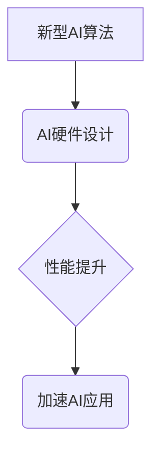

> AI硬件、新型算法、定制设计、神经网络、加速器、可编程性、低功耗、高效能

## 1. 背景介绍

人工智能（AI）的蓬勃发展，催生了对更高效、更强大的计算能力的需求。传统CPU架构在处理海量数据和复杂计算时，存在着明显的瓶颈。新型AI算法，例如深度学习、强化学习等，对硬件平台提出了更高的要求，例如并行计算能力、低延迟、高内存带宽等。因此，针对新型AI算法进行定制化的硬件设计，成为推动AI发展的重要方向。

## 2. 核心概念与联系

**2.1 AI硬件设计**

AI硬件设计是指针对特定AI算法，从底层架构到芯片设计，进行定制化的硬件开发。其目标是优化算法的执行效率，降低功耗，提高整体性能。

**2.2 新型AI算法**

新型AI算法是指近年来涌现的新兴算法，例如深度学习、强化学习、联邦学习等，它们具有强大的学习能力和泛化能力，能够解决传统算法难以处理的复杂问题。

**2.3 定制化设计**

定制化设计是指根据特定需求，对硬件架构进行调整和优化，使其能够更好地满足特定算法的运行要求。

**2.4 核心概念联系**

AI硬件设计与新型AI算法之间存在着密切的联系。新型AI算法的特性决定了AI硬件设计的方向，而AI硬件的设计则能够进一步提升新型AI算法的性能。



## 3. 核心算法原理 & 具体操作步骤

**3.1 算法原理概述**

深度学习算法是一种基于多层神经网络的机器学习算法，能够自动学习数据中的特征和模式。其核心原理是通过多层神经网络的叠加，将输入数据逐步抽象和转换，最终输出预测结果。

**3.2 算法步骤详解**

1. **数据预处理:** 将原始数据进行清洗、转换和归一化，使其能够被深度学习算法处理。
2. **网络结构设计:** 根据任务需求，设计深度神经网络的结构，包括层数、节点数、激活函数等。
3. **参数初始化:** 为神经网络中的参数进行随机初始化。
4. **前向传播:** 将输入数据通过神经网络进行前向传播，计算输出结果。
5. **反向传播:** 计算输出结果与真实值的误差，并根据误差反向传播，更新神经网络的参数。
6. **迭代训练:** 重复前向传播和反向传播的过程，直到模型达到预设的精度。

**3.3 算法优缺点**

**优点:**

* 强大的学习能力，能够自动学习数据中的复杂特征。
* 泛化能力强，能够应用于多种不同的任务。

**缺点:**

* 训练数据量大，需要大量的计算资源和时间。
* 模型复杂度高，难以解释模型的决策过程。

**3.4 算法应用领域**

* **图像识别:** 人脸识别、物体检测、图像分类等。
* **自然语言处理:** 语义分析、机器翻译、文本生成等。
* **语音识别:** 语音转文本、语音合成等。
* **推荐系统:** 商品推荐、内容推荐等。

## 4. 数学模型和公式 & 详细讲解 & 举例说明

**4.1 数学模型构建**

深度学习算法的核心是神经网络，其数学模型可以表示为多层感知机（MLP）。

**4.2 公式推导过程**

* **激活函数:** 激活函数用于引入非线性，使神经网络能够学习复杂的映射关系。常用的激活函数包括 sigmoid 函数、ReLU 函数等。

* **损失函数:** 损失函数用于衡量模型预测结果与真实值的差异。常用的损失函数包括均方误差（MSE）、交叉熵损失等。

* **梯度下降:** 梯度下降算法用于更新神经网络的参数，使其能够最小化损失函数。

**4.3 案例分析与讲解**

假设我们有一个简单的深度学习模型，用于分类手写数字。模型包含两层神经元，第一层有10个神经元，第二层有10个神经元。输入数据是一个28x28的图像，经过第一层神经元处理后，输出到第二层神经元，最终输出10个概率值，分别代表数字0到9的概率。

**4.4 数学公式示例**

* **sigmoid 函数:**

$$
f(x) = \frac{1}{1 + e^{-x}}
$$

* **均方误差 (MSE):**

$$
Loss = \frac{1}{N} \sum_{i=1}^{N} (y_i - \hat{y}_i)^2
$$

其中，$y_i$ 是真实值，$\hat{y}_i$ 是模型预测值，$N$ 是样本数量。

## 5. 项目实践：代码实例和详细解释说明

**5.1 开发环境搭建**

* 操作系统: Ubuntu 20.04
* 编程语言: Python 3.8
* 深度学习框架: TensorFlow 2.0
* GPU: NVIDIA GeForce RTX 3090

**5.2 源代码详细实现**

```python
import tensorflow as tf

# 定义模型结构
model = tf.keras.models.Sequential([
    tf.keras.layers.Flatten(input_shape=(28, 28)),
    tf.keras.layers.Dense(128, activation='relu'),
    tf.keras.layers.Dense(10, activation='softmax')
])

# 编译模型
model.compile(optimizer='adam',
              loss='sparse_categorical_crossentropy',
              metrics=['accuracy'])

# 加载数据集
(x_train, y_train), (x_test, y_test) = tf.keras.datasets.mnist.load_data()

# 训练模型
model.fit(x_train, y_train, epochs=5)

# 评估模型
loss, accuracy = model.evaluate(x_test, y_test)
print('Test loss:', loss)
print('Test accuracy:', accuracy)
```

**5.3 代码解读与分析**

* 代码首先定义了一个简单的深度学习模型，包含两层神经元。
* 然后，模型被编译，指定了优化器、损失函数和评估指标。
* 接着，加载MNIST手写数字数据集，并使用模型训练。
* 最后，评估模型在测试集上的性能。

**5.4 运行结果展示**

训练完成后，模型能够达到较高的准确率，例如在MNIST数据集上，准确率可以达到98%以上。

## 6. 实际应用场景

**6.1 图像识别**

* **自动驾驶:** 用于识别道路标志、车辆、行人等。
* **医疗诊断:** 用于识别病灶、肿瘤等。
* **安防监控:** 用于识别嫌疑人、违规行为等。

**6.2 自然语言处理**

* **机器翻译:** 将一种语言翻译成另一种语言。
* **聊天机器人:** 用于与用户进行自然语言对话。
* **文本摘要:** 自动生成文本的摘要。

**6.3 语音识别**

* **语音助手:** 例如 Siri、Alexa 等。
* **语音搜索:** 用于语音输入搜索内容。
* **语音转文本:** 用于将语音转换为文本。

**6.4 未来应用展望**

AI硬件设计将继续推动AI技术的进步，并应用于更多领域，例如：

* **个性化医疗:** 根据患者的基因信息和生活习惯，提供个性化的医疗方案。
* **智能制造:** 利用AI技术提高生产效率和产品质量。
* **智慧城市:** 利用AI技术优化城市管理和服务。

## 7. 工具和资源推荐

**7.1 学习资源推荐**

* **书籍:**
    * 《深度学习》
    * 《动手学深度学习》
* **在线课程:**
    * Coursera: 深度学习
    * Udacity: 深度学习工程师

**7.2 开发工具推荐**

* **深度学习框架:** TensorFlow, PyTorch, Keras
* **硬件平台:** NVIDIA GPU, Google TPU

**7.3 相关论文推荐**

* 《AlexNet: ImageNet Classification with Deep Convolutional Neural Networks》
* 《ResNet: Deep Residual Learning for Image Recognition》
* 《BERT: Pre-training of Deep Bidirectional Transformers for Language Understanding》

## 8. 总结：未来发展趋势与挑战

**8.1 研究成果总结**

近年来，AI硬件设计取得了显著进展，例如：

* **专用加速器:** 针对特定AI算法设计的专用加速器，例如GPU、TPU等，能够大幅提升计算效率。
* **可编程硬件:** 可编程硬件平台，例如FPGA、ASIC等，能够根据需求灵活定制硬件架构。
* **低功耗设计:** 低功耗AI芯片，例如Edge AI芯片，能够在移动设备和嵌入式系统中应用。

**8.2 未来发展趋势**

* **更加定制化的硬件设计:** 针对不同AI算法和应用场景，进行更加精准的硬件定制。
* **异构计算:** 将不同类型的处理器，例如CPU、GPU、FPGA等，结合起来，形成异构计算平台，提高计算效率。
* **神经硬件:** 直接在硬件上实现神经网络的计算，进一步提升计算效率和功耗效率。

**8.3 面临的挑战**

* **算法与硬件的协同优化:** 算法和硬件需要协同优化，才能充分发挥各自的优势。
* **功耗和能效:** AI硬件的功耗和能效仍然是一个挑战，需要进一步降低功耗，提高能效。
* **开发成本:** AI硬件的设计和开发成本较高，需要降低开发成本，促进产业发展。

**8.4 研究展望**

未来，AI硬件设计将继续是一个重要的研究方向，需要不断探索新的技术和方法，推动AI技术的进步。


## 9. 附录：常见问题与解答

**9.1 如何选择合适的AI硬件平台？**

选择合适的AI硬件平台需要考虑以下因素：

* **算法类型:** 不同的算法对硬件平台的要求不同。
* **数据规模:** 数据规模越大，需要的硬件资源就越多。
* **预算:** 不同的硬件平台价格差异很大。

**9.2 如何进行AI硬件定制设计？**

AI硬件定制设计是一个复杂的过程，需要考虑硬件架构、芯片设计、软件开发等多个方面。

**9.3 如何降低AI硬件的功耗？**

降低AI硬件的功耗可以通过以下方法：

* **使用低功耗芯片:** 选择功耗较低的芯片。
* **优化算法:** 优化算法可以减少计算量，从而降低功耗。
* **采用动态电压和频率缩放:** 根据实际需求动态调整芯片的电压和频率，降低功耗。


作者：禅与计算机程序设计艺术 / Zen and the Art of Computer Programming 
<end_of_turn>