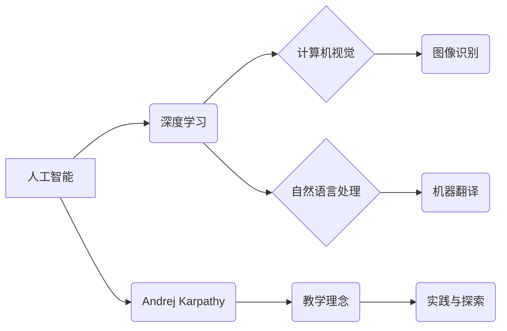

> 人工智能，深度学习，教育，Andrej Karpathy，计算机视觉，自然语言处理

## 1. 背景介绍

人工智能（AI）正以惊人的速度发展，深刻地改变着我们的世界。从自动驾驶汽车到智能语音助手，AI技术已渗透到我们生活的方方面面。在这个充满机遇和挑战的时代，培养AI人才显得尤为重要。

Andrej Karpathy是一位享誉世界的AI专家，他曾在OpenAI、特斯拉和伯克利大学任职，并以其在深度学习和计算机视觉领域的杰出贡献而闻名。他的博客文章、演讲和教学视频对无数AI爱好者和研究者产生了深远的影响。

本文将探讨Andrej Karpathy在AI教育领域所做出的贡献，分析其教学理念和方法，并展望AI教育的未来发展趋势。

## 2. 核心概念与联系

**2.1 深度学习与人工智能**

深度学习是人工智能领域的一个重要分支，它利用多层神经网络来模拟人类大脑的学习过程。通过训练大量的样本数据，深度学习模型能够自动提取特征，并进行复杂的模式识别和预测。

**2.2 计算机视觉与自然语言处理**

计算机视觉和自然语言处理是深度学习的两个重要应用领域。计算机视觉旨在使计算机能够“看”和理解图像和视频，而自然语言处理则旨在使计算机能够理解和生成人类语言。

**2.3 Andrej Karpathy的教学理念**

Andrej Karpathy的教学理念强调实践和探索。他认为，学习AI最好的方法是通过动手实践，亲身体验算法的原理和应用。他的课程和教学视频通常包含大量的代码示例和实验，鼓励学生深入理解AI技术的底层机制。

**2.4  核心概念关系图**



## 3. 核心算法原理 & 具体操作步骤

**3.1 算法原理概述**

深度学习算法的核心是多层神经网络。神经网络由多个层组成，每层包含多个神经元。每个神经元接收来自上一层的输入信号，并对其进行处理，然后将处理后的信号传递给下一层的输入。通过训练大量的样本数据，神经网络能够调整每个神经元的权重，从而学习到数据的特征和模式。

**3.2 算法步骤详解**

1. **数据预处理:** 将原始数据转换为深度学习模型可以理解的格式。
2. **网络结构设计:** 根据任务需求设计神经网络的结构，包括层数、神经元数量和激活函数等。
3. **模型训练:** 使用训练数据训练神经网络模型，通过反向传播算法调整神经元的权重，使模型的预测结果越来越准确。
4. **模型评估:** 使用测试数据评估模型的性能，并根据评估结果进行模型调优。
5. **模型部署:** 将训练好的模型部署到实际应用场景中。

**3.3 算法优缺点**

**优点:**

* 能够自动提取特征，无需人工特征工程。
* 能够处理大规模数据，并学习到复杂的模式。
* 在图像识别、自然语言处理等领域取得了突破性进展。

**缺点:**

* 训练数据量大，需要大量的计算资源。
* 模型解释性差，难以理解模型的决策过程。
* 对数据质量要求高，数据偏差会影响模型性能。

**3.4 算法应用领域**

深度学习算法已广泛应用于各个领域，包括：

* 计算机视觉：图像识别、目标检测、图像分割、人脸识别等。
* 自然语言处理：机器翻译、文本摘要、情感分析、对话系统等。
* 医疗保健：疾病诊断、药物研发、医疗影像分析等。
* 金融科技：欺诈检测、风险评估、投资决策等。

## 4. 数学模型和公式 & 详细讲解 & 举例说明

**4.1 数学模型构建**

深度学习模型通常采用多层感知机（MLP）或卷积神经网络（CNN）等结构。

**4.2 公式推导过程**

深度学习模型的训练过程基于梯度下降算法。目标函数通常是预测结果与真实值的均方误差。梯度下降算法通过计算目标函数的梯度，不断调整神经元的权重，使目标函数值最小化。

**4.3 案例分析与讲解**

例如，在图像识别任务中，CNN模型会学习到图像特征，并将其映射到不同的类别。训练过程中，模型会根据图像标签和预测结果计算损失函数，然后通过反向传播算法更新权重，最终实现图像分类。

**4.4 数学公式示例**

* **激活函数:** sigmoid函数

$$
f(x) = \frac{1}{1 + e^{-x}}
$$

* **损失函数:** 均方误差

$$
L = \frac{1}{n} \sum_{i=1}^{n} (y_i - \hat{y}_i)^2
$$

其中，$y_i$为真实值，$\hat{y}_i$为预测值，$n$为样本数量。

## 5. 项目实践：代码实例和详细解释说明

**5.1 开发环境搭建**

使用Python语言和深度学习框架TensorFlow或PyTorch搭建开发环境。

**5.2 源代码详细实现**

```python
import tensorflow as tf

# 定义模型结构
model = tf.keras.models.Sequential([
    tf.keras.layers.Conv2D(32, (3, 3), activation='relu', input_shape=(28, 28, 1)),
    tf.keras.layers.MaxPooling2D((2, 2)),
    tf.keras.layers.Flatten(),
    tf.keras.layers.Dense(10, activation='softmax')
])

# 编译模型
model.compile(optimizer='adam',
              loss='sparse_categorical_crossentropy',
              metrics=['accuracy'])

# 训练模型
model.fit(x_train, y_train, epochs=5)

# 评估模型
loss, accuracy = model.evaluate(x_test, y_test)
print('Test loss:', loss)
print('Test accuracy:', accuracy)
```

**5.3 代码解读与分析**

这段代码定义了一个简单的卷积神经网络模型，用于手写数字识别任务。模型包含卷积层、池化层、全连接层和softmax输出层。

**5.4 运行结果展示**

训练完成后，模型能够识别手写数字，并输出识别结果的准确率。

## 6. 实际应用场景

**6.1 医疗诊断**

深度学习模型可以用于分析医学影像，辅助医生诊断疾病。例如，可以用于检测肺癌、乳腺癌等疾病。

**6.2 自动驾驶**

深度学习模型可以用于识别道路场景、车辆和行人，帮助自动驾驶汽车安全行驶。

**6.3 个性化推荐**

深度学习模型可以分析用户的行为数据，推荐个性化的商品、服务和内容。

**6.4 未来应用展望**

随着人工智能技术的不断发展，深度学习模型将在更多领域得到应用，例如：

* 人机交互：开发更自然、更智能的人机交互系统。
* 科学研究：加速科学发现，解决复杂科学问题。
* 创造性工作：辅助人类进行创作，例如写作、绘画、音乐创作等。

## 7. 工具和资源推荐

**7.1 学习资源推荐**

* **课程:**
    * Andrew Ng 的机器学习课程
    * DeepLearning.AI 的深度学习专业证书课程
* **书籍:**
    * 深度学习
    * 人工智能：一种现代方法
* **博客:**
    * Andrej Karpathy 的博客
    * OpenAI 的博客

**7.2 开发工具推荐**

* **深度学习框架:** TensorFlow, PyTorch, Keras
* **编程语言:** Python
* **云计算平台:** Google Cloud Platform, Amazon Web Services, Microsoft Azure

**7.3 相关论文推荐**

* ImageNet Classification with Deep Convolutional Neural Networks
* Attention Is All You Need
* BERT: Pre-training of Deep Bidirectional Transformers for Language Understanding

## 8. 总结：未来发展趋势与挑战

**8.1 研究成果总结**

近年来，深度学习取得了令人瞩目的成就，在计算机视觉、自然语言处理等领域取得了突破性进展。

**8.2 未来发展趋势**

* **模型规模和复杂度提升:** 训练更大、更复杂的深度学习模型，以提高模型性能。
* **数据增强和合成:** 开发新的数据增强和合成技术，以解决数据稀缺问题。
* **模型解释性和可解释性:** 研究深度学习模型的决策过程，提高模型的透明度和可解释性。
* **边缘计算和部署:** 将深度学习模型部署到边缘设备，实现实时推理和低延迟应用。

**8.3 面临的挑战**

* **数据隐私和安全:** 深度学习模型的训练和应用需要大量数据，如何保护数据隐私和安全是一个重要挑战。
* **算法偏见和公平性:** 深度学习模型可能存在算法偏见，导致不公平的结果。如何解决算法偏见和确保公平性是一个重要的研究方向。
* **模型可解释性和信任:** 深度学习模型的决策过程往往难以理解，如何提高模型的可解释性和建立用户信任是一个关键问题。

**8.4 研究展望**

未来，人工智能研究将继续朝着更智能、更安全、更可解释的方向发展。


## 9. 附录：常见问题与解答

**9.1 如何选择合适的深度学习框架？**

TensorFlow和PyTorch是目前最流行的深度学习框架，选择哪个框架取决于个人喜好和项目需求。

**9.2 如何处理数据不平衡问题？**

数据不平衡问题可以通过数据增强、权重调整等方法进行解决。

**9.3 如何评估深度学习模型的性能？**

常用的评估指标包括准确率、召回率、F1-score等。

**9.4 如何防止深度学习模型过拟合？**

可以通过正则化、交叉验证等方法防止模型过拟合。


作者：禅与计算机程序设计艺术 / Zen and the Art of Computer Programming 
<end_of_turn>