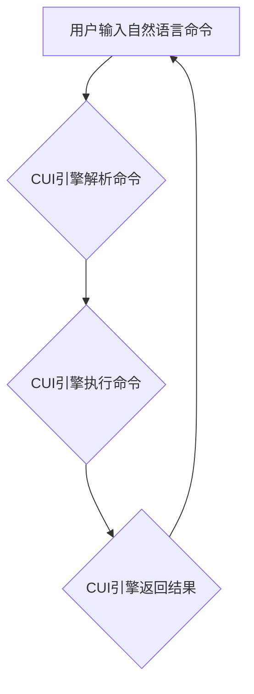

> CUI, 交互方式, 数字产品, 人机交互, 自然语言处理, 图形界面, 用户体验, 未来趋势

## 1. 背景介绍

随着科技的飞速发展，数字产品已经渗透到我们生活的方方面面。从智能手机到智能家居，从虚拟现实到增强现实，数字产品正在以惊人的速度改变着我们的生活方式。然而，传统的图形界面（GUI）已经难以满足用户日益增长的需求。用户渴望更自然、更直观、更智能的交互方式。

CUI（Command-line Interface，命令行界面）作为一种古老的交互方式，近年来正逐渐受到重视。它以文本命令为媒介，允许用户直接与计算机进行交互，具有简洁高效、可定制性强等特点。随着人工智能技术的进步，CUI正在经历一场深刻的变革，并有望彻底改变数字产品的交互方式。

## 2. 核心概念与联系

CUI的核心概念是通过文本命令与计算机进行交互。用户输入特定的命令，计算机根据命令执行相应的操作。传统的CUI界面通常是黑色的命令行窗口，用户需要输入复杂的命令才能完成任务。而现代CUI则更加智能化，能够理解自然语言，并提供更直观的反馈。

**Mermaid 流程图：**



## 3. 核心算法原理 & 具体操作步骤

### 3.1  算法原理概述

现代CUI的核心算法是自然语言处理（NLP）技术。NLP技术能够理解和处理人类语言，包括识别词语、理解语法结构、提取语义信息等。通过NLP技术，CUI引擎能够将用户的自然语言命令转换为计算机能够理解的指令，并执行相应的操作。

### 3.2  算法步骤详解

1. **词语识别:** 将用户的自然语言命令分解成一个个独立的词语。
2. **语法分析:** 分析词语之间的关系，识别命令的结构和语义。
3. **语义理解:** 提取命令中的关键信息，例如操作对象、操作类型、参数等。
4. **命令转换:** 将解析后的语义信息转换为计算机能够理解的指令。
5. **命令执行:** 执行相应的指令，并返回结果给用户。

### 3.3  算法优缺点

**优点:**

* **自然直观:** 用户可以使用自然语言进行交互，更加直观易懂。
* **可定制性强:** 可以根据用户的需求定制命令和功能。
* **效率高:** 对于熟练用户来说，CUI可以比GUI更加高效。

**缺点:**

* **学习成本:** 初学者需要学习CUI的命令语法，有一定的学习成本。
* **错误处理:** 用户输入错误的命令，CUI需要提供有效的错误提示和处理机制。
* **用户体验:** 对于一些需要复杂操作的用户，CUI的体验可能不如GUI。

### 3.4  算法应用领域

CUI的应用领域非常广泛，包括：

* **命令行工具:** 许多系统工具和程序都使用CUI进行交互，例如Linux命令行、Git版本控制系统等。
* **编程语言:** 许多编程语言都使用CUI进行开发，例如Python、Bash等。
* **自动化脚本:** CUI可以用于编写自动化脚本，例如自动执行任务、管理系统等。
* **智能家居:** CUI可以用于控制智能家居设备，例如灯光、空调、音响等。

## 4. 数学模型和公式 & 详细讲解 & 举例说明

### 4.1  数学模型构建

CUI的自然语言处理部分可以利用统计语言模型进行建模。例如，可以使用n-gram模型来预测下一个词语出现的概率。

**n-gram模型:**

$$P(w_1, w_2, ..., w_n) = P(w_1) * P(w_2|w_1) * P(w_3|w_1, w_2) * ... * P(w_n|w_1, w_2, ..., w_{n-1})$$

其中：

* $P(w_i)$ 表示词语 $w_i$ 的概率。
* $P(w_j|w_1, w_2, ..., w_{i-1})$ 表示在词语序列 $w_1, w_2, ..., w_{i-1}$ 的条件下，词语 $w_j$ 出现的概率。

### 4.2  公式推导过程

n-gram模型的推导过程是基于马尔可夫假设的。马尔可夫假设认为，一个词语的出现概率只依赖于其前n-1个词语的出现情况，与更早的词语无关。

### 4.3  案例分析与讲解

例如，如果我们有一个训练语料库，其中包含以下句子：

* "The cat sat on the mat."
* "The dog chased the ball."

我们可以使用n-gram模型来预测句子 "The cat" 之后的词语。

* 如果使用unigram模型（n=1），则预测结果为所有词语出现的概率最高的词语。
* 如果使用bigram模型（n=2），则预测结果为在 "The cat" 之后出现的词语的概率最高的词语。

## 5. 项目实践：代码实例和详细解释说明

### 5.1  开发环境搭建

CUI的开发环境搭建相对简单，主要需要安装一个文本编辑器和一个终端模拟器。

### 5.2  源代码详细实现

```python
import nltk

# 下载nltk的语言模型
nltk.download('punkt')

def process_command(command):
    # 使用nltk进行词语识别和语法分析
    tokens = nltk.word_tokenize(command)
    # ...

    # 根据语法分析结果执行相应的操作
    # ...

    return result

# 用户输入命令
command = input("请输入命令: ")

# 处理命令并返回结果
result = process_command(command)

# 打印结果
print(result)
```

### 5.3  代码解读与分析

这段代码演示了如何使用nltk库进行CUI的自然语言处理。

* `nltk.word_tokenize(command)` 函数将用户的命令分解成一个个独立的词语。
* `process_command(command)` 函数根据词语的语法结构和语义信息，执行相应的操作。
* `input("请输入命令: ")` 函数获取用户的命令输入。
* `print(result)` 函数打印处理后的结果。

### 5.4  运行结果展示

当用户输入命令 "打开浏览器" 时，程序会执行相应的操作，打开浏览器窗口。

## 6. 实际应用场景

### 6.1  智能家居控制

CUI可以用于控制智能家居设备，例如灯光、空调、音响等。用户可以通过自然语言命令来控制这些设备，例如 "打开客厅灯"、"调低空调温度"、"播放音乐" 等。

### 6.2  自动化脚本

CUI可以用于编写自动化脚本，例如自动执行任务、管理系统等。用户可以通过CUI命令来执行脚本，例如 "备份数据"、"重启服务器"、"发送邮件" 等。

### 6.3  数据分析

CUI可以用于数据分析，例如查询数据、生成报表等。用户可以通过CUI命令来查询数据，例如 "查询销售额"、"生成月度报表" 等。

### 6.4  未来应用展望

随着人工智能技术的进步，CUI的应用场景将会更加广泛。例如，CUI可以用于虚拟现实和增强现实应用，提供更加自然、更加沉浸式的交互体验。

## 7. 工具和资源推荐

### 7.1  学习资源推荐

* **自然语言处理入门书籍:**
    * "Speech and Language Processing" by Jurafsky and Martin
    * "Natural Language Processing with Python" by Bird, Klein, and Loper
* **在线课程:**
    * Coursera: Natural Language Processing Specialization
    * edX: Natural Language Processing

### 7.2  开发工具推荐

* **Python:** Python是一种非常适合自然语言处理的编程语言，拥有丰富的库和工具。
* **NLTK:** NLTK是Python的自然语言处理库，提供了许多常用的NLP算法和工具。
* **SpaCy:** SpaCy是另一个流行的Python NLP库，以其速度和效率而闻名。

### 7.3  相关论文推荐

* "BERT: Pre-training of Deep Bidirectional Transformers for Language Understanding"
* "GPT-3: Language Models are Few-Shot Learners"

## 8. 总结：未来发展趋势与挑战

### 8.1  研究成果总结

CUI作为一种古老的交互方式，正在经历一场深刻的变革。人工智能技术的进步使得CUI更加智能化，能够理解自然语言，并提供更直观的反馈。CUI的应用场景将会更加广泛，例如智能家居控制、自动化脚本、数据分析等。

### 8.2  未来发展趋势

* **更智能的自然语言理解:** 未来CUI将能够更加准确地理解用户的自然语言命令，并提供更个性化的服务。
* **更丰富的交互方式:** CUI将不仅仅局限于文本命令，还将支持语音、图像、视频等多种交互方式。
* **更广泛的应用场景:** CUI将应用于更多领域，例如教育、医疗、金融等。

### 8.3  面临的挑战

* **语义理解的复杂性:** 自然语言的语义非常复杂，CUI需要克服语义歧义、上下文理解等挑战。
* **个性化定制的难度:** 每个用户的需求都不同，CUI需要提供个性化的定制服务，这需要大量的用户数据和算法训练。
* **用户体验的提升:** CUI需要提供更加直观、更加友好的用户体验，才能吸引更多用户使用。

### 8.4  研究展望

未来，CUI的研究将更加注重以下几个方面:

* **深度学习技术的应用:** 利用深度学习技术来提高CUI的自然语言理解能力。
* **多模态交互的研究:** 研究CUI与语音、图像、视频等多模态交互的融合。
* **用户体验的设计:** 设计更加直观、更加友好的CUI用户体验。

## 9. 附录：常见问题与解答

### 9.1  CUI与GUI相比，有什么优势？

CUI的优势在于：

* **效率高:** 对于熟练用户来说，CUI可以比GUI更加高效。
* **可定制性强:** 可以根据用户的需求定制命令和功能。
* **简洁直观:** 使用自然语言进行交互，更加直观易懂。

### 9.2  CUI的学习成本高吗？

对于初学者来说，CUI的学习成本确实相对较高，需要学习CUI的命令语法。但是，随着CUI技术的进步，越来越多的CUI工具和平台提供更加友好的用户体验，降低了学习门槛。

### 9.3  CUI的未来发展趋势是什么？

CUI的未来发展趋势是更加智能化、更加多样化、更加人性化。未来CUI将能够更加准确地理解用户的自然语言命令，并提供更加个性化的服务。


作者：禅与计算机程序设计艺术 / Zen and the Art of Computer Programming 


<end_of_turn>