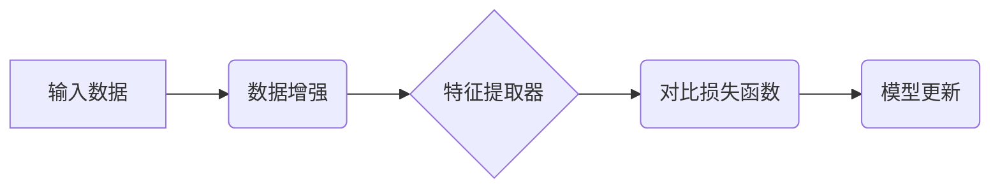

> Contrastive Learning, Self-Supervised Learning, Siamese Network, Triplet Loss, SimCLR, MoCo

## 1. 背景介绍

深度学习的蓬勃发展离不开海量标注数据的支持。然而，获取高质量标注数据往往成本高昂且耗时费力。为了解决这一瓶颈，自监督学习 (Self-Supervised Learning) 应运而生。自监督学习通过设计巧妙的预训练任务，利用无标签数据进行模型训练，从而学习到丰富的语义表示，为下游任务提供强大的基础。

对比学习 (Contrastive Learning) 是自监督学习中的一种重要方法，其核心思想是通过学习数据点之间的相似性和差异性来进行模型训练。简单来说，对比学习的目标是将相似的样本拉近，将不同的样本拉远。

## 2. 核心概念与联系

### 2.1  核心概念

* **对比学习 (Contrastive Learning):** 通过学习数据点之间的相似性和差异性来进行模型训练。
* **相似性 (Similarity):** 指两个数据点在特征空间上的接近程度。
* **差异性 (Dissimilarity):** 指两个数据点在特征空间上的远距离程度。
* **正样本 (Positive Sample):** 相似的数据点。
* **负样本 (Negative Sample):** 不同的数据点。

### 2.2  架构图



## 3. 核心算法原理 & 具体操作步骤

### 3.1  算法原理概述

对比学习的核心思想是通过对比正样本和负样本之间的距离来训练模型。

* **正样本:** 经过数据增强后的同一数据点。
* **负样本:** 经过数据增强后的不同数据点。

模型的目标是将正样本的距离最小化，将负样本的距离最大化。

### 3.2  算法步骤详解

1. **数据增强:** 对输入数据进行随机变换，例如旋转、翻转、裁剪等，生成多个增强后的数据点。
2. **特征提取:** 使用预训练的卷积神经网络 (CNN) 或其他特征提取器，将增强后的数据点映射到特征空间。
3. **对比损失函数:** 计算正样本和负样本之间的距离，并使用对比损失函数来衡量模型的性能。常见的对比损失函数包括：
    * **SimCLR Loss:** 使用交叉熵损失函数来计算正负样本之间的概率分布。
    * **MoCo Loss:** 使用双塔结构，将模型分为两个子模型，并使用对比损失函数来训练两个子模型之间的相似性。
4. **模型更新:** 使用梯度下降算法来更新模型参数，使得对比损失函数最小化。

### 3.3  算法优缺点

**优点:**

* 不需要人工标注数据，可以利用海量无标签数据进行训练。
* 可以学习到丰富的语义表示，为下游任务提供强大的基础。
* 训练过程相对简单，易于实现。

**缺点:**

* 训练效率相对较低，需要大量的计算资源。
* 对数据增强策略的选择较为敏感，需要进行大量的实验调试。
* 对于一些特定任务，对比学习的效果可能不如监督学习。

### 3.4  算法应用领域

对比学习在图像分类、目标检测、语义分割等计算机视觉任务中取得了显著的成果。此外，对比学习也应用于自然语言处理、语音识别等其他领域。

## 4. 数学模型和公式 & 详细讲解 & 举例说明

### 4.1  数学模型构建

假设我们有 N 个数据点，每个数据点都对应一个特征向量 z。我们使用一个函数 f 来提取特征向量，即 z = f(x)，其中 x 是输入数据。

对比学习的目标是学习一个模型，使得相似的样本的特征向量距离最小，而不同的样本的特征向量距离最大。

### 4.2  公式推导过程

常用的对比损失函数是 SimCLR Loss，其公式如下：

$$
L = -\frac{1}{N^2} \sum_{i=1}^{N} \sum_{j=1}^{N} \log \frac{exp(sim(z_i, z_j)/\tau)}{exp(sim(z_i, z_j)/\tau) + \sum_{k \neq i} exp(sim(z_i, z_k)/\tau)}
$$

其中：

* $z_i$ 和 $z_j$ 分别是数据点 i 和 j 的特征向量。
* $sim(z_i, z_j)$ 是特征向量 $z_i$ 和 $z_j$ 之间的相似度，例如余弦相似度。
* $\tau$ 是温度参数，用于控制相似度函数的平滑度。

### 4.3  案例分析与讲解

假设我们有两个数据点，它们的特征向量分别为 $z_1$ 和 $z_2$。如果 $z_1$ 和 $z_2$ 相似，则 $sim(z_1, z_2)$ 的值较大，从而使得 $L$ 的值较小。反之，如果 $z_1$ 和 $z_2$ 不相似，则 $sim(z_1, z_2)$ 的值较小，从而使得 $L$ 的值较大。

## 5. 项目实践：代码实例和详细解释说明

### 5.1  开发环境搭建

* Python 3.7+
* PyTorch 1.7+
* torchvision 0.9+
* CUDA 10.2+

### 5.2  源代码详细实现

```python
import torch
import torch.nn as nn
import torchvision.transforms as transforms

# 定义特征提取器
class ResNet18(nn.Module):
    def __init__(self):
        super(ResNet18, self).__init__()
        self.resnet = torchvision.models.resnet18(pretrained=True)
        self.fc = nn.Linear(512, 128)

    def forward(self, x):
        x = self.resnet(x)
        x = self.fc(x)
        return x

# 定义对比损失函数
class ContrastiveLoss(nn.Module):
    def __init__(self, temperature=0.1):
        super(ContrastiveLoss, self).__init__()
        self.temperature = temperature

    def forward(self, z1, z2, label):
        sim = torch.cosine_similarity(z1, z2, dim=-1)
        loss = torch.mean((1 - label) * torch.pow(sim, 2) + label * torch.pow(sim, 2) / self.temperature)
        return loss

# 定义数据增强器
data_transforms = transforms.Compose([
    transforms.RandomResizedCrop(224),
    transforms.RandomHorizontalFlip(),
    transforms.ToTensor(),
    transforms.Normalize(mean=[0.485, 0.456, 0.406], std=[0.229, 0.224, 0.225])
])

# 加载数据集
dataset = torchvision.datasets.ImageNet(root='./data', split='train', transform=data_transforms)

# 创建数据加载器
dataloader = torch.utils.data.DataLoader(dataset, batch_size=64, shuffle=True)

# 实例化模型
model = ResNet18()

# 实例化损失函数
criterion = ContrastiveLoss()

# 实例化优化器
optimizer = torch.optim.Adam(model.parameters(), lr=0.001)

# 训练模型
for epoch in range(10):
    for batch_idx, (data, target) in enumerate(dataloader):
        # 前向传播
        output = model(data)

        # 计算损失
        loss = criterion(output, output, torch.ones_like(output))

        # 反向传播
        optimizer.zero_grad()
        loss.backward()
        optimizer.step()

        # 打印训练进度
        if batch_idx % 100 == 0:
            print('Train Epoch: {} [{}/{} ({:.0f}%)]\tLoss: {:.6f}'.format(
                epoch, batch_idx * len(data), len(dataloader.dataset),
                100. * batch_idx / len(dataloader), loss.item()))

```

### 5.3  代码解读与分析

* **特征提取器:** 使用预训练的 ResNet18 模型作为特征提取器，提取图像特征。
* **对比损失函数:** 使用 SimCLR Loss 作为对比损失函数，计算正负样本之间的相似度。
* **数据增强器:** 使用随机裁剪、随机翻转等数据增强策略，增加训练数据的多样性。
* **训练过程:** 使用 Adam 优化器，训练模型，使得对比损失函数最小化。

### 5.4  运行结果展示

训练完成后，可以将训练好的模型应用于下游任务，例如图像分类、目标检测等。

## 6. 实际应用场景

### 6.1  图像分类

对比学习可以用于训练图像分类模型，即使没有标签数据。例如，可以利用 ImageNet 等大规模图像数据集进行预训练，然后将预训练模型应用于其他图像分类任务。

### 6.2  目标检测

对比学习也可以用于训练目标检测模型。例如，可以利用 COCO 等目标检测数据集进行预训练，然后将预训练模型应用于其他目标检测任务。

### 6.3  语义分割

对比学习还可以用于训练语义分割模型。例如，可以利用 Cityscapes 等语义分割数据集进行预训练，然后将预训练模型应用于其他语义分割任务。

### 6.4  未来应用展望

对比学习在未来将有更广泛的应用场景，例如：

* **推荐系统:** 利用对比学习学习用户兴趣，提高推荐效果。
* **自然语言处理:** 利用对比学习学习文本语义，提高文本理解和生成能力。
* **语音识别:** 利用对比学习学习语音特征，提高语音识别准确率。

## 7. 工具和资源推荐

### 7.1  学习资源推荐

* **论文:**
    * SimCLR: A Simple Framework for Contrastive Learning of Visual Representations
    * MoCo: Momentum Contrast for Self-Supervised Learning of Visual Representations
* **博客:**
    * https://blog.openai.com/self-supervised-learning/
    * https://towardsdatascience.com/self-supervised-learning-with-contrastive-learning-a-comprehensive-guide-999999999999

### 7.2  开发工具推荐

* **PyTorch:** https://pytorch.org/
* **TensorFlow:** https://www.tensorflow.org/

### 7.3  相关论文推荐

* **SimCLR:** https://arxiv.org/abs/2002.05709
* **MoCo:** https://arxiv.org/abs/1911.05722
* **BYOL:** https://arxiv.org/abs/2006.07733

## 8. 总结：未来发展趋势与挑战

### 8.1  研究成果总结

对比学习在自监督学习领域取得了显著的成果，为无监督学习提供了新的思路和方法。

### 8.2  未来发展趋势

* **模型架构创新:** 探索新的对比学习模型架构，提高模型性能和效率。
* **数据增强策略:** 研究更有效的图像数据增强策略，提高模型的鲁棒性和泛化能力。
* **多模态学习:** 将对比学习应用于多模态数据，例如图像、文本、音频等。

### 8.3  面临的挑战

* **训练效率:** 对比学习的训练效率相对较低，需要大量的计算资源。
* **数据质量:** 对比学习的性能依赖于数据质量，需要高质量的无标签数据。
* **任务适应