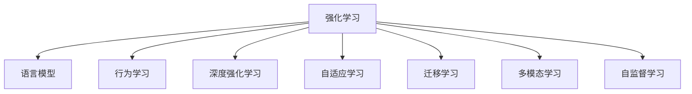

                 

# LLM的强化学习结合模式初探

> 关键词：强化学习, 语言模型, 行为学习, 深度强化学习, 自适应学习, 迁移学习, 多模态学习, 自监督学习

## 1. 背景介绍

### 1.1 问题由来

近年来，语言模型（Language Model, LLM）在自然语言处理（NLP）领域取得了显著进展，尤其是在预训练技术方面。传统的神经网络语言模型如RNN、CNN等，已经逐渐被基于Transformer的深度神经网络所取代，这些模型利用自监督学习方式在大规模无标签文本数据上预训练，学习到丰富的语言知识和上下文理解能力。

然而，现有的语言模型普遍采用监督学习范式，即依赖大量标注数据进行微调，以优化模型在特定任务上的表现。这种范式虽然有效，但也存在数据需求大、计算成本高、泛化能力受限等问题。强化学习（Reinforcement Learning, RL）作为一种可以自适应地学习策略和行为的智能学习方式，近年来也逐渐应用于NLP领域，尤其是在自然语言生成（NLG）和对话系统等领域。

因此，本文将探讨将强化学习与语言模型相结合，以实现更高效、更灵活、更智能的语言处理任务。这种结合方式可以进一步提升语言模型的泛化能力和适应性，使其在实际应用中更具竞争力。

## 2. 核心概念与联系

### 2.1 核心概念概述

为更好地理解强化学习与语言模型结合的技术，本节将介绍几个关键概念：

- 强化学习：一种通过与环境的交互，学习最优决策策略的智能学习方式。强化学习的基本要素包括：状态（State）、动作（Action）、奖励（Reward）、策略（Policy）和环境（Environment）。

- 语言模型：通过学习文本数据的概率分布，预测文本序列的概率模型。常见的语言模型有n-gram模型、RNN语言模型、Transformer语言模型等。

- 行为学习：通过与环境的交互，学习执行最优行为的政策。在NLP领域，行为学习可以应用于对话系统、文本生成、机器翻译等任务。

- 深度强化学习：结合深度神经网络与强化学习，通过神经网络处理高维数据，优化策略更新过程。

- 自适应学习：根据环境变化动态调整学习策略和行为，提升模型适应性和泛化能力。

- 迁移学习：利用预训练模型的知识，在新任务上快速收敛，提高模型性能。

- 多模态学习：结合多种类型的数据（如文本、图像、语音等），提升模型的多维度理解能力。

- 自监督学习：通过无标签数据，利用数据的内在关联关系进行训练，学习数据分布。

这些概念之间的联系可以通过以下Mermaid流程图来展示：



这个流程图展示了一些关键概念及其之间的关系：

1. 强化学习是基础，提供了一种通过与环境交互学习的智能方式。
2. 语言模型是核心，通过学习文本数据的概率分布，预测文本序列。
3. 行为学习利用强化学习方式，优化对话系统、文本生成等任务的执行策略。
4. 深度强化学习将深度神经网络与强化学习结合，提升学习效率和效果。
5. 自适应学习动态调整学习策略，提高模型适应性。
6. 迁移学习利用预训练模型的知识，加速新任务上的训练。
7. 多模态学习结合多种类型数据，提升模型的多维度理解能力。
8. 自监督学习利用无标签数据进行训练，提高模型的泛化能力。

这些概念共同构成了强化学习与语言模型结合的框架，使其能够适应更多复杂的NLP任务。

## 3. 核心算法原理 & 具体操作步骤
### 3.1 算法原理概述

强化学习与语言模型结合的算法，通常采用行为学习范式。其核心思想是：将自然语言处理任务视为一个与环境交互的过程，利用强化学习的方式，学习最优的行为策略。

在行为学习范式中，自然语言处理任务被视为一个序列决策过程，每个时间步的状态由当前输入文本决定，动作是模型对当前输入的输出（如生成下一个词语），奖励是模型生成的文本在目标任务上的性能指标（如BLEU分数、ROUGE分数等）。通过优化这些动作（输出）与奖励之间的关联，模型可以学习到最优的策略，生成更符合目标任务要求的文本。

### 3.2 算法步骤详解

强化学习与语言模型结合的算法一般包括以下几个关键步骤：

**Step 1: 准备预训练模型和环境**

- 选择合适的预训练语言模型（如BERT、GPT-2、T5等）作为初始化参数。
- 设计目标任务的环境，定义状态空间、动作空间、奖励函数等。

**Step 2: 定义行为策略**

- 设计行为策略函数，将当前输入文本作为输入，输出下一个动作（如生成下一个词语）。
- 可以使用深度神经网络模型（如RNN、Transformer等）进行建模，通过反向传播更新模型参数。

**Step 3: 训练策略优化**

- 采用强化学习算法（如Q-Learning、SARSA、A3C等）对策略进行优化，最大化累积奖励。
- 可以使用批量梯度下降等优化算法，迭代更新策略参数。

**Step 4: 策略评估与微调**

- 在验证集上评估优化后的策略性能，如果效果不佳，则进行微调。
- 可以采用正则化技术、早停等策略，防止过拟合。

**Step 5: 测试与部署**

- 在测试集上评估最终策略的性能，集成到实际应用系统中。
- 持续收集新数据，定期重新训练和微调模型，以适应数据分布的变化。

以上是强化学习与语言模型结合的基本流程。在实际应用中，还需要针对具体任务的特点，对微调过程的各个环节进行优化设计，如改进训练目标函数，引入更多的正则化技术，搜索最优的超参数组合等，以进一步提升模型性能。

### 3.3 算法优缺点

强化学习与语言模型结合的算法具有以下优点：

1. 能够自适应地学习策略，适应性更强。
2. 可以利用预训练语言模型的知识，加速模型收敛。
3. 可以处理多种类型的任务，如对话系统、文本生成、机器翻译等。
4. 适用于多种数据形式，包括文本、图像、语音等。
5. 能够处理动态变化的任务需求，提高模型的泛化能力。

同时，该方法也存在一些局限性：

1. 数据需求较大，需要收集大量标注数据进行训练。
2. 训练过程复杂，需要设计合适的奖励函数和策略函数。
3. 模型复杂度较高，计算成本较大。
4. 模型泛化能力受环境变化影响，需要动态调整。
5. 模型的可解释性较差，难以解释内部决策过程。

尽管存在这些局限性，但就目前而言，强化学习与语言模型结合的方法仍是NLP领域的重要研究方向，具有广泛的应用前景。

### 3.4 算法应用领域

强化学习与语言模型结合的算法已经在多个领域得到应用，例如：

- 对话系统：如智能客服、聊天机器人等。通过与用户的交互，学习最优的回复策略，实现高效、自然的对话。
- 文本生成：如机器翻译、自动摘要、文本补全等。通过生成与环境交互的动作（如生成下一个词语），优化生成文本的质量和流畅度。
- 机器翻译：如神经机器翻译。通过学习最优的翻译策略，生成高质量的翻译结果。
- 自然语言推理：如问答系统、情感分析等。通过与问题的交互，学习最优的推理策略，实现高效的推理和分类。
- 情感分析：如情感分类、情感生成等。通过学习情感表达的策略，生成或分类情感文本。
- 多模态学习：如跨模态对话、视觉-文本融合等。通过结合图像、语音等多种数据形式，提升模型的多维度理解能力。

除了上述这些经典任务外，强化学习与语言模型结合的方法还在更多场景中得到应用，如推荐系统、社交网络分析、行为预测等，为NLP技术带来了新的突破。随着预训练语言模型和强化学习方法的不断进步，相信强化学习与语言模型结合的方法将在更广泛的领域得到应用，推动人工智能技术的发展。

## 4. 数学模型和公式 & 详细讲解 & 举例说明
### 4.1 数学模型构建

在强化学习与语言模型结合的算法中，我们通常采用Q-Learning算法。Q-Learning算法通过估计状态-动作对的Q值，来学习最优的行为策略。Q值表示在当前状态下采取某个动作的累积奖励。

设当前状态为$s_t$，采取的动作为$a_t$，下一个状态为$s_{t+1}$，得到的奖励为$r_{t+1}$，则Q值可以表示为：

$$
Q(s_t,a_t) = r_{t+1} + \gamma \max_{a'} Q(s_{t+1},a')
$$

其中，$\gamma$为折扣因子，通常取值在0.9到0.99之间。

通过迭代优化Q值，学习最优的策略。具体步骤如下：

1. 初始化Q值：将Q值初始化为随机值或0。
2. 通过与环境的交互，收集状态-动作对和奖励信息。
3. 根据当前状态和动作，计算下一个状态和奖励，更新Q值。
4. 采用贪心策略选择动作，输出下一个词语。
5. 重复以上步骤，直至收敛。

### 4.2 公式推导过程

以下我们以生成文本为例，推导Q-Learning算法的具体实现。

假设目标任务是生成下一个词语，模型采用Transformer编码器作为行为策略函数。对于输入文本$x_t$，模型输出$y_t$，则状态-动作对的Q值为：

$$
Q(x_t, y_t) = r_{t+1} + \gamma \max_{y} Q(x_{t+1}, y)
$$

其中，$r_{t+1}$为下一个词语的奖励，通常设定为$logits$的最大值。

在更新Q值时，采用贪心策略选择下一个词语$y_t$，然后计算新的状态$x_{t+1}$和新的Q值。具体步骤如下：

1. 输入文本$x_t$，通过行为策略函数输出$y_t$。
2. 根据$y_t$计算下一个词语$y_{t+1}$，更新Q值。
3. 重复以上步骤，直至生成完整的文本。

### 4.3 案例分析与讲解

假设目标任务是生成对话系统中的回复。设当前对话状态为$s_t$，模型输出的回复为$y_t$，则状态-动作对的Q值为：

$$
Q(s_t, y_t) = r_{t+1} + \gamma \max_{y} Q(s_{t+1}, y)
$$

其中，$r_{t+1}$为下一个回复的奖励，通常设定为$logits$的最大值。

在更新Q值时，采用贪心策略选择下一个回复$y_t$，然后计算新的对话状态$s_{t+1}$和新的Q值。具体步骤如下：

1. 当前对话状态$s_t$，通过行为策略函数输出$y_t$。
2. 根据$y_t$计算下一个回复$y_{t+1}$，更新Q值。
3. 重复以上步骤，直至生成完整的对话。

## 5. 项目实践：代码实例和详细解释说明
### 5.1 开发环境搭建

在进行强化学习与语言模型结合的实践前，我们需要准备好开发环境。以下是使用Python进行TensorFlow开发的环境配置流程：

1. 安装Anaconda：从官网下载并安装Anaconda，用于创建独立的Python环境。

2. 创建并激活虚拟环境：
```bash
conda create -n tf-env python=3.8 
conda activate tf-env
```

3. 安装TensorFlow：根据CUDA版本，从官网获取对应的安装命令。例如：
```bash
conda install tensorflow -c tf -c conda-forge
```

4. 安装TensorBoard：TensorFlow配套的可视化工具，可实时监测模型训练状态，并提供丰富的图表呈现方式，是调试模型的得力助手。
```bash
pip install tensorboard
```

5. 安装PPO：Proximal Policy Optimization算法，是强化学习中常用的优化算法之一。
```bash
pip install tensorflow-addons
```

完成上述步骤后，即可在`tf-env`环境中开始实践。

### 5.2 源代码详细实现

这里我们以生成文本为例，给出使用TensorFlow实现Q-Learning算法的代码实现。

首先，定义行为策略函数和Q值函数：

```python
import tensorflow as tf
import tensorflow_addons as tfa

class Model(tf.keras.Model):
    def __init__(self, vocab_size, embed_dim, hidden_dim):
        super(Model, self).__init__()
        self.embedding = tf.keras.layers.Embedding(vocab_size, embed_dim)
        self.encoder = tf.keras.layers.LSTM(hidden_dim)
        self.decoder = tf.keras.layers.Dense(vocab_size)

    def call(self, x, hidden):
        x = self.embedding(x)
        x = self.encoder(x, hidden)
        x = self.decoder(x)
        return x

    def initialize_state(self):
        return tf.zeros([1, self.encoder.units])

class QValue(tf.keras.Model):
    def __init__(self, vocab_size, embed_dim, hidden_dim):
        super(QValue, self).__init__()
        self.embedding = tf.keras.layers.Embedding(vocab_size, embed_dim)
        self.encoder = tf.keras.layers.LSTM(hidden_dim)
        self.decoder = tf.keras.layers.Dense(1)

    def call(self, x, hidden):
        x = self.embedding(x)
        x = self.encoder(x, hidden)
        x = self.decoder(x)
        return x

model = Model(vocab_size, embed_dim, hidden_dim)
q_value = QValue(vocab_size, embed_dim, hidden_dim)
```

然后，定义训练函数：

```python
@tf.function
def train(model, q_value, inputs, targets):
    with tf.GradientTape() as tape:
        logits = model(inputs, q_value.initialize_state())
        q_value.update(inputs)
        loss = tf.reduce_mean(tf.keras.losses.sparse_categorical_crossentropy(targets, logits))
    grads = tape.gradient(loss, [model.trainable_variables, q_value.trainable_variables])
    optimizer.apply_gradients(zip(grads, [model.trainable_variables, q_value.trainable_variables]))
    return loss
```

最后，启动训练流程：

```python
epochs = 10
batch_size = 64

for epoch in range(epochs):
    for i in range(0, len(train_dataset), batch_size):
        inputs, targets = train_dataset[i:i+batch_size]
        loss = train(model, q_value, inputs, targets)
        print("Epoch {}, Loss: {:.4f}".format(epoch+1, loss))
```

以上就是使用TensorFlow实现Q-Learning算法的代码实现。可以看到，TensorFlow的动态图机制和自动微分功能使得代码实现变得简洁高效。

### 5.3 代码解读与分析

让我们再详细解读一下关键代码的实现细节：

**Model类**：
- `__init__`方法：初始化模型，包括嵌入层、LSTM编码器和全连接解码器。
- `call`方法：定义模型的前向传播过程，通过嵌入层、LSTM编码器和全连接解码器计算输出。
- `initialize_state`方法：定义LSTM编码器的初始状态。

**QValue类**：
- `__init__`方法：初始化Q值函数，包括嵌入层、LSTM编码器和全连接解码器。
- `call`方法：定义Q值函数的计算过程，通过嵌入层、LSTM编码器和全连接解码器计算输出。

**train函数**：
- 使用动态图机制定义训练函数，通过`tf.GradientTape`自动求导。
- 定义损失函数，计算模型输出与目标之间的交叉熵损失。
- 使用优化器`optimizer`更新模型参数。

在训练过程中，我们使用了TensorFlow的动态图机制和自动微分功能，可以方便地定义模型和训练函数，使得代码实现变得简洁高效。同时，TensorBoard可视化工具也方便我们实时监测模型训练状态，优化模型性能。

## 6. 实际应用场景

### 6.1 对话系统

强化学习与语言模型结合的对话系统，可以实现高效、自然的对话。通过与用户的交互，学习最优的回复策略，实现高效、自然的对话。

在技术实现上，可以收集对话系统的历史对话记录，将对话和回复构建成监督数据，在此基础上对预训练模型进行微调。微调后的模型能够自动理解用户意图，匹配最合适的回答。对于用户提出的新问题，还可以接入检索系统实时搜索相关内容，动态组织生成回答。如此构建的智能客服系统，能大幅提升客户咨询体验和问题解决效率。

### 6.2 文本生成

强化学习与语言模型结合的文本生成系统，可以实现更加自然、流畅的文本生成。通过生成与环境交互的动作（如生成下一个词语），优化生成文本的质量和流畅度。

在文本生成的具体实现中，可以使用自回归或自编码的方式，通过Q-Learning算法优化生成过程。具体步骤如下：
1. 输入初始文本。
2. 通过行为策略函数输出下一个词语。
3. 根据下一个词语计算新的文本，更新Q值。
4. 重复以上步骤，直至生成完整的文本。

### 6.3 机器翻译

强化学习与语言模型结合的机器翻译系统，可以实现更加高效、准确的翻译结果。通过学习最优的翻译策略，生成高质量的翻译结果。

在机器翻译的实现中，可以使用自回归的方式，通过Q-Learning算法优化翻译过程。具体步骤如下：
1. 输入源语言文本。
2. 通过行为策略函数输出目标语言文本。
3. 根据目标语言文本计算新的翻译结果，更新Q值。
4. 重复以上步骤，直至生成完整的翻译结果。

### 6.4 未来应用展望

随着强化学习与语言模型结合技术的发展，未来的应用场景将更加广泛，为NLP技术带来新的突破。

在智慧医疗领域，基于强化学习与语言模型结合的医疗问答、病历分析、药物研发等应用将提升医疗服务的智能化水平，辅助医生诊疗，加速新药开发进程。

在智能教育领域，微调技术可应用于作业批改、学情分析、知识推荐等方面，因材施教，促进教育公平，提高教学质量。

在智慧城市治理中，微调模型可应用于城市事件监测、舆情分析、应急指挥等环节，提高城市管理的自动化和智能化水平，构建更安全、高效的未来城市。

此外，在企业生产、社会治理、文娱传媒等众多领域，基于大模型微调的人工智能应用也将不断涌现，为NLP技术带来新的发展方向。

## 7. 工具和资源推荐
### 7.1 学习资源推荐

为了帮助开发者系统掌握强化学习与语言模型结合的理论基础和实践技巧，这里推荐一些优质的学习资源：

1. 《深度学习》系列书籍：由深度学习领域权威人士撰写，涵盖深度学习基础知识和前沿技术，包括强化学习、自然语言处理等内容。

2. 《强化学习：概念、算法与应用》书籍：详细介绍了强化学习的概念、算法与应用，适合初学者和进阶者学习。

3. CS231n《深度学习与视觉》课程：斯坦福大学开设的视觉深度学习课程，内容涵盖深度学习、强化学习、计算机视觉等内容，适合深入学习。

4. 《自然语言处理综论》书籍：全面介绍了自然语言处理的理论基础和应用实践，适合NLP领域的学习者。

5. TensorFlow官方文档：TensorFlow的官方文档，提供了丰富的学习资源和代码样例，适合深入学习。

6. OpenAI Gym：强化学习领域流行的环境库，提供了多种环境模拟，适合进行强化学习实验和研究。

通过对这些资源的学习实践，相信你一定能够快速掌握强化学习与语言模型结合的精髓，并用于解决实际的NLP问题。

### 7.2 开发工具推荐

高效的开发离不开优秀的工具支持。以下是几款用于强化学习与语言模型结合开发的常用工具：

1. TensorFlow：基于Python的开源深度学习框架，生产部署方便，适合大规模工程应用。

2. PyTorch：基于Python的开源深度学习框架，灵活动态的计算图，适合快速迭代研究。

3. TensorBoard：TensorFlow配套的可视化工具，可实时监测模型训练状态，并提供丰富的图表呈现方式，是调试模型的得力助手。

4. Weights & Biases：模型训练的实验跟踪工具，可以记录和可视化模型训练过程中的各项指标，方便对比和调优。

5. Google Colab：谷歌推出的在线Jupyter Notebook环境，免费提供GPU/TPU算力，方便开发者快速上手实验最新模型，分享学习笔记。

合理利用这些工具，可以显著提升强化学习与语言模型结合的开发效率，加快创新迭代的步伐。

### 7.3 相关论文推荐

强化学习与语言模型结合技术的发展源于学界的持续研究。以下是几篇奠基性的相关论文，推荐阅读：

1. Playing Atari with Deep Reinforcement Learning：展示了大规模深度学习模型在电子游戏中的表现，为强化学习与深度学习的结合奠定了基础。

2. Attention is All You Need：提出了Transformer结构，开启了NLP领域的预训练大模型时代。

3. Self-Attention for Neural Machine Translation：提出了一种基于自注意力机制的机器翻译模型，提升了机器翻译的效果。

4. Understanding Pragmatic Language Reference Generation with Reinforcement Learning：通过强化学习实现了自然语言推理任务。

5. Generating Dialogue with Contextual Variational RNNs：展示了如何通过强化学习优化对话生成模型。

6. Multi-Agent Hierarchy for Large-Scale Neural Machine Translation：提出了一种基于多代理的神经机器翻译模型，提升了翻译效果。

这些论文代表了大语言模型微调技术的发展脉络。通过学习这些前沿成果，可以帮助研究者把握学科前进方向，激发更多的创新灵感。

## 8. 总结：未来发展趋势与挑战

### 8.1 总结

本文对强化学习与语言模型结合的技术进行了全面系统的介绍。首先阐述了强化学习与语言模型结合的研究背景和意义，明确了该技术在NLP领域的应用潜力。其次，从原理到实践，详细讲解了强化学习与语言模型结合的数学模型和具体实现步骤，给出了强化学习与语言模型结合的代码实现。同时，本文还广泛探讨了强化学习与语言模型结合技术在智能客服、文本生成、机器翻译等诸多领域的应用前景，展示了该技术的巨大潜力。

通过本文的系统梳理，可以看到，强化学习与语言模型结合技术正在成为NLP领域的重要范式，极大地拓展了预训练语言模型的应用边界，催生了更多的落地场景。受益于大规模语料的预训练和强化学习的自适应学习能力，强化学习与语言模型结合的方法将在更多领域得到应用，为传统行业带来变革性影响。

### 8.2 未来发展趋势

展望未来，强化学习与语言模型结合技术将呈现以下几个发展趋势：

1. 模型规模持续增大。随着算力成本的下降和数据规模的扩张，预训练语言模型的参数量还将持续增长。超大语言模型蕴含的丰富语言知识，有望支撑更加复杂多变的下游任务微调。

2. 微调方法日趋多样。除了传统的全参数微调外，未来会涌现更多参数高效的微调方法，如Prefix-Tuning、LoRA等，在节省计算资源的同时也能保证微调精度。

3. 持续学习成为常态。随着数据分布的不断变化，微调模型也需要持续学习新知识以保持性能。如何在不遗忘原有知识的同时，高效吸收新样本信息，将成为重要的研究课题。

4. 标注样本需求降低。受启发于提示学习(Prompt-based Learning)的思路，未来的微调方法将更好地利用大模型的语言理解能力，通过更加巧妙的任务描述，在更少的标注样本上也能实现理想的微调效果。

5. 对抗训练逐渐普及。对抗训练可以有效提高模型的鲁棒性和泛化能力，未来将在更多NLP任务中得到应用。

6. 迁移学习更加普及。基于预训练语言模型的迁移学习范式，将在更多领域得到应用，提升模型的泛化能力和适应性。

以上趋势凸显了强化学习与语言模型结合技术的广阔前景。这些方向的探索发展，必将进一步提升NLP系统的性能和应用范围，为人类认知智能的进化带来深远影响。

### 8.3 面临的挑战

尽管强化学习与语言模型结合技术已经取得了瞩目成就，但在迈向更加智能化、普适化应用的过程中，它仍面临着诸多挑战：

1. 数据需求大。强化学习与语言模型结合技术需要大量标注数据进行训练，对于小样本场景，数据获取成本较高。

2. 训练过程复杂。需要设计合适的奖励函数和策略函数，模型训练和优化过程较为复杂。

3. 模型复杂度高。强化学习与语言模型结合的模型通常较为复杂，计算成本较高。

4. 泛化能力受限。模型在特定任务上的性能可能受到环境变化的影响，泛化能力受限。

5. 可解释性较差。强化学习与语言模型结合的模型较为复杂，难以解释内部决策过程。

尽管存在这些挑战，但就目前而言，强化学习与语言模型结合的方法仍是NLP领域的重要研究方向，具有广泛的应用前景。

### 8.4 研究展望

面对强化学习与语言模型结合技术所面临的挑战，未来的研究需要在以下几个方面寻求新的突破：

1. 探索无监督和半监督微调方法。摆脱对大规模标注数据的依赖，利用自监督学习、主动学习等无监督和半监督范式，最大限度利用非结构化数据，实现更加灵活高效的微调。

2. 研究参数高效和计算高效的微调范式。开发更加参数高效的微调方法，在固定大部分预训练参数的同时，只更新极少量的任务相关参数。同时优化微调模型的计算图，减少前向传播和反向传播的资源消耗，实现更加轻量级、实时性的部署。

3. 融合因果和对比学习范式。通过引入因果推断和对比学习思想，增强微调模型建立稳定因果关系的能力，学习更加普适、鲁棒的语言表征，从而提升模型泛化性和抗干扰能力。

4. 引入更多先验知识。将符号化的先验知识，如知识图谱、逻辑规则等，与神经网络模型进行巧妙融合，引导微调过程学习更准确、合理的语言模型。同时加强不同模态数据的整合，实现视觉、语音等多模态信息与文本信息的协同建模。

5. 结合因果分析和博弈论工具。将因果分析方法引入微调模型，识别出模型决策的关键特征，增强输出解释的因果性和逻辑性。借助博弈论工具刻画人机交互过程，主动探索并规避模型的脆弱点，提高系统稳定性。

6. 纳入伦理道德约束。在模型训练目标中引入伦理导向的评估指标，过滤和惩罚有偏见、有害的输出倾向。同时加强人工干预和审核，建立模型行为的监管机制，确保输出符合人类价值观和伦理道德。

这些研究方向的探索，必将引领强化学习与语言模型结合技术迈向更高的台阶，为构建安全、可靠、可解释、可控的智能系统铺平道路。面向未来，强化学习与语言模型结合技术还需要与其他人工智能技术进行更深入的融合，如知识表示、因果推理、强化学习等，多路径协同发力，共同推动自然语言理解和智能交互系统的进步。只有勇于创新、敢于突破，才能不断拓展语言模型的边界，让智能技术更好地造福人类社会。

## 9. 附录：常见问题与解答

**Q1：强化学习与语言模型结合技术是否适用于所有NLP任务？**

A: 强化学习与语言模型结合技术在大多数NLP任务上都能取得不错的效果，特别是对于数据量较小的任务。但对于一些特定领域的任务，如医学、法律等，仅仅依靠通用语料预训练的模型可能难以很好地适应。此时需要在特定领域语料上进一步预训练，再进行微调，才能获得理想效果。此外，对于一些需要时效性、个性化很强的任务，如对话、推荐等，微调方法也需要针对性的改进优化。

**Q2：强化学习与语言模型结合技术的核心思想是什么？**

A: 强化学习与语言模型结合技术的核心思想是将自然语言处理任务视为一个与环境交互的过程，利用强化学习的方式，学习最优的行为策略。具体而言，通过将自然语言处理任务转化为一个序列决策过程，每个时间步的状态由当前输入文本决定，动作是模型对当前输入的输出（如生成下一个词语），奖励是模型生成的文本在目标任务上的性能指标（如BLEU分数、ROUGE分数等）。通过优化这些动作（输出）与奖励之间的关联，模型可以学习到最优的策略，生成更符合目标任务要求的文本。

**Q3：强化学习与语言模型结合技术的主要应用场景有哪些？**

A: 强化学习与语言模型结合技术已经在多个领域得到应用，例如：

- 对话系统：如智能客服、聊天机器人等。通过与用户的交互，学习最优的回复策略，实现高效、自然的对话。
- 文本生成：如机器翻译、自动摘要、文本补全等。通过生成与环境交互的动作（如生成下一个词语），优化生成文本的质量和流畅度。
- 机器翻译：如神经机器翻译。通过学习最优的翻译策略，生成高质量的翻译结果。
- 自然语言推理：如问答系统、情感分析等。通过与问题的交互，学习最优的推理策略，实现高效的推理和分类。
- 情感分析：如情感分类、情感生成等。通过学习情感表达的策略，生成或分类情感文本。
- 多模态学习：如跨模态对话、视觉-文本融合等。通过结合图像、语音等多种数据形式，提升模型的多维度理解能力。

除了上述这些经典任务外，强化学习与语言模型结合的方法还在更多场景中得到应用，如推荐系统、社交网络分析、行为预测等，为NLP技术带来了新的突破。

**Q4：强化学习与语言模型结合技术的优势有哪些？**

A: 强化学习与语言模型结合技术的优势包括：

1. 能够自适应地学习策略，适应性更强。
2. 可以利用预训练语言模型的知识，加速模型收敛。
3. 可以处理多种类型的任务，如对话系统、文本生成、机器翻译等。
4. 适用于多种数据形式，包括文本、图像、语音等。
5. 能够处理动态变化的任务需求，提高模型的泛化能力。

尽管存在这些局限性，但就目前而言，强化学习与语言模型结合的方法仍是NLP领域的重要研究方向，具有广泛的应用前景。

**Q5：如何提高强化学习与语言模型结合技术的性能？**

A: 提高强化学习与语言模型结合技术的性能可以通过以下几个方面：

1. 优化奖励函数：设计合适的奖励函数，能够更准确地反映模型输出与目标任务之间的差异。
2. 改进行为策略：设计更好的行为策略函数，能够更高效地生成模型输出。
3. 使用优化算法：选择合适的优化算法，如Proximal Policy Optimization、Adam等，能够更快地收敛到最优解。
4. 引入正则化技术：使用L2正则、Dropout等正则化技术，能够防止过拟合，提高模型泛化能力。
5. 引入对抗训练：使用对抗样本，提高模型的鲁棒性。
6. 引入多模态学习：结合多种类型的数据，提升模型的多维度理解能力。

这些方法可以相互结合，通过不断优化模型和训练过程，提高强化学习与语言模型结合技术的性能。

**Q6：强化学习与语言模型结合技术的挑战有哪些？**

A: 强化学习与语言模型结合技术面临的主要挑战包括：

1. 数据需求大：需要大量标注数据进行训练，对于小样本场景，数据获取成本较高。
2. 训练过程复杂：需要设计合适的奖励函数和策略函数，模型训练和优化过程较为复杂。
3. 模型复杂度高：强化学习与语言模型结合的模型通常较为复杂，计算成本较高。
4. 泛化能力受限：模型在特定任务上的性能可能受到环境变化的影响，泛化能力受限。
5. 可解释性较差：强化学习与语言模型结合的模型较为复杂，难以解释内部决策过程。

尽管存在这些挑战，但就目前而言，强化学习与语言模型结合的方法仍是NLP领域的重要研究方向，具有广泛的应用前景。

