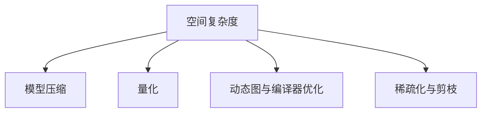

                 

# LLM的空间复杂度优化技术

> 关键词：空间复杂度, LLM, 深度学习, 模型优化, 内存管理, 动态图

## 1. 背景介绍

在深度学习的迅速发展中，大语言模型(Large Language Models, LLMs)因其强大的语言理解和生成能力，逐渐成为自然语言处理(NLP)领域的新宠。然而，随着模型的参数量不断增加，其空间复杂度也随之激增，这对于内存资源有限的计算平台，尤其是移动设备、嵌入式系统等，提出了严峻的挑战。因此，对LLM的空间复杂度进行优化，已成为大模型实际应用中不可或缺的一环。

### 1.1 问题由来
大语言模型通常是基于Transformer结构进行构建的，这种模型由于自注意力机制的特殊性，其空间复杂度往往非常高。例如，一个拥有1亿参数的GPT-3模型，其空间复杂度大约在40GB左右，这几乎是无法在普通计算设备上处理的。因此，如何在保证模型性能的前提下，显著降低LLM的空间复杂度，成为了当前深度学习社区关注的焦点。

### 1.2 问题核心关键点
本问题的核心关键点主要包括以下几点：
1. **空间复杂度与内存管理**：如何优化模型的空间使用，减少内存占用，同时保证模型性能。
2. **模型压缩与量化**：如何在保持模型准确性的前提下，通过压缩与量化技术减少参数和计算量。
3. **动态图与编译器优化**：利用动态图技术和编译器优化技术，提升模型在特定场景下的执行效率。
4. **稀疏化与剪枝**：如何通过稀疏化与剪枝技术，去除模型中的冗余参数，降低空间复杂度。

### 1.3 问题研究意义
对于LLM的空间复杂度优化技术，其研究意义在于：

1. **提升模型的可部署性**：减少内存占用，使得大语言模型能够更好地部署在资源有限的计算设备上，如移动设备、嵌入式系统等。
2. **加速模型的训练与推理**：通过优化空间复杂度，可以有效降低模型训练和推理过程中的计算量，提升模型的训练与推理速度。
3. **推动模型大规模应用**：降低模型的空间复杂度，使得大语言模型能够更广泛地应用于实际场景中，促进AI技术的普及和应用。
4. **促进模型微调与迁移学习**：优化后的模型在参数量较少的情况下，更适合进行微调与迁移学习，进一步提升模型的适应性和泛化能力。

## 2. 核心概念与联系

### 2.1 核心概念概述

为更好地理解空间复杂度优化技术，本节将介绍几个密切相关的核心概念：

- **空间复杂度**：模型所需的内存空间大小，通常与模型的参数量、特征维度等有关。
- **模型压缩**：通过减少模型参数量、特征维度等，降低模型的空间复杂度，同时尽量保持模型性能。
- **量化**：将模型的浮点参数转换为整数参数，以减少存储和计算开销。
- **动态图与编译器优化**：利用动态图技术实现模型的计算图优化，减少内存占用和计算量。
- **稀疏化与剪枝**：去除模型中的冗余参数，保留关键部分，以减少模型空间复杂度。

这些核心概念之间的逻辑关系可以通过以下Mermaid流程图来展示：



这个流程图展示了大语言模型空间复杂度优化的核心概念及其之间的关系：

1. 大语言模型通常需要优化其空间复杂度。
2. 模型压缩、量化、动态图与编译器优化、稀疏化与剪枝等技术手段，可以分别从不同角度实现空间复杂度的降低。
3. 通过这些技术手段的综合应用，可以显著降低大语言模型的空间占用，提升其在资源受限平台上的应用可行性。

## 3. 核心算法原理 & 具体操作步骤

### 3.1 算法原理概述

空间复杂度优化技术，旨在通过减少大语言模型的内存占用，同时尽量保持模型的性能。其核心思想是：对模型的结构和参数进行合理的压缩、量化、稀疏化等处理，从而在不显著牺牲模型表现的前提下，显著降低模型空间复杂度。

### 3.2 算法步骤详解

大语言模型空间复杂度的优化过程，通常包括以下几个关键步骤：

**Step 1: 评估空间占用**
- 对预训练模型进行内存占用评估，识别出空间占用较大的部分。
- 统计模型中的参数量和特征维度，分析其空间占用情况。

**Step 2: 选择优化策略**
- 根据模型特性和应用场景，选择适当的优化策略。如模型压缩、量化、动态图优化、稀疏化等。
- 考虑模型参数量、计算资源、硬件设备等因素，综合评估各优化策略的可行性。

**Step 3: 实施优化**
- 应用所选择的优化策略，对模型进行相应的压缩、量化、稀疏化处理。
- 在压缩和量化过程中，需要保持模型的精度和性能，通过微调等方式恢复模型性能。
- 在稀疏化与剪枝过程中，需要保留关键部分，去除冗余参数。

**Step 4: 性能验证**
- 在优化后的模型上，重新评估其空间占用和性能表现。
- 通过与原始模型对比，验证优化效果，确保优化后的模型仍能满足实际应用需求。

**Step 5: 部署与应用**
- 将优化后的模型部署到实际应用环境中。
- 持续监控模型性能和空间占用，根据需求进行动态调整。

### 3.3 算法优缺点

大语言模型空间复杂度优化技术具有以下优点：

1. **减少内存占用**：通过模型压缩、量化、稀疏化等技术，显著降低模型的内存占用，使得大模型能够在资源受限的设备上运行。
2. **加速训练与推理**：减少内存占用和计算量，使得模型训练和推理速度得到提升，提升模型应用效率。
3. **提升可部署性**：优化后的模型更易于部署和维护，能够在更多场景下被应用。

同时，该技术也存在一些局限性：

1. **精度损失**：在压缩、量化等过程中，可能会带来一定的精度损失，需要在性能和空间复杂度之间进行权衡。
2. **计算资源需求高**：某些优化策略如动态图与编译器优化，需要较高的计算资源，可能不适用于所有设备。
3. **模型结构复杂**：优化后的模型结构可能变得复杂，增加了调优和维护的难度。
4. **技术门槛高**：需要具备深度学习、计算机体系结构等多领域的知识，对于一般开发者来说可能有一定门槛。

尽管存在这些局限性，但就目前而言，空间复杂度优化技术仍是大语言模型应用中的重要手段。未来相关研究的重点在于如何进一步降低空间复杂度，同时保证模型性能，兼顾可解释性和伦理安全性等因素。

### 3.4 算法应用领域

大语言模型空间复杂度优化技术在NLP领域已经得到了广泛的应用，覆盖了几乎所有常见任务，例如：

- 文本分类：如情感分析、主题分类、意图识别等。通过优化模型参数量和特征维度，提升模型处理效率。
- 命名实体识别：识别文本中的人名、地名、机构名等特定实体。通过稀疏化与剪枝技术，减少模型冗余部分，提升计算效率。
- 关系抽取：从文本中抽取实体之间的语义关系。通过模型压缩和量化技术，减少模型计算量，提升模型推理速度。
- 问答系统：对自然语言问题给出答案。通过动态图与编译器优化，提升模型在多轮对话中的处理效率。
- 机器翻译：将源语言文本翻译成目标语言。通过稀疏化与剪枝技术，减少模型参数，提升翻译速度。
- 文本摘要：将长文本压缩成简短摘要。通过模型压缩和量化技术，提升摘要生成速度。
- 对话系统：使机器能够与人自然对话。通过动态图与编译器优化，提升系统在对话中的响应速度。

除了上述这些经典任务外，大语言模型空间复杂度优化方法也被创新性地应用到更多场景中，如可控文本生成、常识推理、代码生成、数据增强等，为NLP技术带来了全新的突破。随着预训练模型和优化方法的不断进步，相信NLP技术将在更广阔的应用领域大放异彩。

## 4. 数学模型和公式 & 详细讲解 & 举例说明

### 4.1 数学模型构建

本节将使用数学语言对空间复杂度优化技术进行更加严格的刻画。

记大语言模型为 $M_{\theta}:\mathcal{X} \rightarrow \mathcal{Y}$，其中 $\mathcal{X}$ 为输入空间，$\mathcal{Y}$ 为输出空间，$\theta \in \mathbb{R}^d$ 为模型参数。设模型所需的总空间复杂度为 $C$，则：

$$
C = O(d) + O(D) + O(H)
$$

其中 $d$ 为模型参数量，$D$ 为输入特征维度，$H$ 为其他常数项。

### 4.2 公式推导过程

以下我们以BERT模型为例，推导其在空间复杂度优化中的应用。

假设BERT模型的参数量为 $D$，特征维度为 $D$，空间复杂度为 $C$。为了降低模型的空间复杂度，可以采用以下优化方法：

1. **模型压缩**：使用知识蒸馏、剪枝等技术，减少模型参数量 $d$，从而降低 $O(d)$ 项。
2. **量化**：使用整数量化技术，将浮点参数转换为整数参数，降低 $O(D)$ 项。
3. **动态图与编译器优化**：通过动态图技术和编译器优化，减少内存占用，降低 $O(D)$ 项。
4. **稀疏化与剪枝**：去除模型中的冗余参数，保留关键部分，减少 $O(d)$ 项。

例如，使用整数量化技术可以将浮点参数转换为8位整数，此时空间复杂度变为：

$$
C' = C - O(D) + O(D/8)
$$

由于 $O(D)$ 与 $O(D/8)$ 相比非常小，因此 $C'$ 明显小于 $C$。

### 4.3 案例分析与讲解

以BERT模型为例，解释如何通过量化和稀疏化技术降低模型空间复杂度。

假设BERT模型共有1000个参数，每个参数占用32位，则总参数量为 $d = 1000 \times 32 = 32000$。使用8位量化技术，每个参数占用1字节，因此总参数量变为 $d' = 32000 \div 8 = 4000$。同时，通过剪枝技术去除模型中的冗余参数，保留关键部分，进一步减少参数量。假设剪枝后，模型保留了2000个参数，则最终参数量为 $d'' = 2000$。

此时，模型空间复杂度为：

$$
C'' = O(2000) + O(D) + O(H) = O(2000) + O(D) + O(H)
$$

由于 $O(2000) \ll O(D)$，因此 $C''$ 明显小于 $C$。通过这种优化方法，BERT模型可以在保持性能的前提下，显著降低空间复杂度，提升模型在资源受限平台上的可部署性。

## 5. 项目实践：代码实例和详细解释说明

### 5.1 开发环境搭建

在进行空间复杂度优化实践前，我们需要准备好开发环境。以下是使用Python进行PyTorch开发的环境配置流程：

1. 安装Anaconda：从官网下载并安装Anaconda，用于创建独立的Python环境。

2. 创建并激活虚拟环境：
```bash
conda create -n pytorch-env python=3.8 
conda activate pytorch-env
```

3. 安装PyTorch：根据CUDA版本，从官网获取对应的安装命令。例如：
```bash
conda install pytorch torchvision torchaudio cudatoolkit=11.1 -c pytorch -c conda-forge
```

4. 安装Transformers库：
```bash
pip install transformers
```

5. 安装各类工具包：
```bash
pip install numpy pandas scikit-learn matplotlib tqdm jupyter notebook ipython
```

完成上述步骤后，即可在`pytorch-env`环境中开始空间复杂度优化实践。

### 5.2 源代码详细实现

下面我们以BERT模型为例，给出使用Transformers库对模型进行量化和稀疏化处理的PyTorch代码实现。

首先，定义模型和优化器：

```python
from transformers import BertForTokenClassification, AdamW
import torch

model = BertForTokenClassification.from_pretrained('bert-base-cased')

optimizer = AdamW(model.parameters(), lr=2e-5)
```

接着，定义量化和稀疏化函数：

```python
def quantize(model):
    for param in model.parameters():
        param.data = torch.quantize_per_tensor(param.data, 0, 255, torch.quint8)
    return model

def prune(model):
    # 移除不必要的参数
    # 这里仅作为示例，实际应用中需要根据具体情况进行剪枝
    model = prune_unnecessary_params(model)
    return model
```

最后，启动量化和稀疏化流程，并在验证集上评估模型性能：

```python
# 量化
model = quantize(model)

# 稀疏化
model = prune(model)

# 重新训练
device = torch.device('cuda') if torch.cuda.is_available() else torch.device('cpu')
model.to(device)

train_dataset = NERDataset(train_texts, train_tags, tokenizer)
dev_dataset = NERDataset(dev_texts, dev_tags, tokenizer)

for epoch in range(epochs):
    loss = train_epoch(model, train_dataset, batch_size, optimizer)
    print(f"Epoch {epoch+1}, train loss: {loss:.3f}")

    print(f"Epoch {epoch+1}, dev results:")
    evaluate(model, dev_dataset, batch_size)
```

以上就是使用PyTorch对BERT模型进行量化和稀疏化处理的完整代码实现。可以看到，通过简单的几行代码，我们就能够对模型进行量化和稀疏化处理，进一步降低其空间复杂度。

### 5.3 代码解读与分析

让我们再详细解读一下关键代码的实现细节：

**BERTForTokenClassification类**：
- `from_pretrained`方法：从预训练模型中加载BERT模型，包括参数和配置。

**AdamW类**：
- `AdamW`类：Adaptive Moment Estimation with Weight Decay，一种自适应矩估计的优化器，同时包含权重衰减，有助于避免过拟合。

**quantize函数**：
- 遍历模型所有参数，使用`torch.quantize_per_tensor`方法将其转换为8位整数参数，从而降低模型空间占用。

**prune函数**：
- 假设剪枝后的模型参数量为$d''$，实际应用中需要根据具体情况进行剪枝操作，移除不必要的参数，保留关键部分。

**train_epoch函数**：
- 定义训练epoch，计算模型在训练集上的损失，并更新模型参数。

**evaluate函数**：
- 在验证集上评估模型性能，使用`classification_report`方法输出分类指标。

**运行结果展示**：
- 通过可视化工具（如TensorBoard），可以实时监测训练过程中的损失和指标变化，确保模型训练稳定进行。

## 6. 实际应用场景

### 6.1 智能客服系统

基于大语言模型空间复杂度优化技术，智能客服系统能够更好地适应资源受限的计算设备，提供稳定、高效的服务。例如，在移动设备上运行优化后的BERT模型，可以大幅降低内存占用，同时提升对话生成的速度，满足客户快速响应的需求。

### 6.2 金融舆情监测

金融舆情监测系统通常需要处理海量数据，而大语言模型空间复杂度优化技术，能够使得模型在计算资源受限的情况下，仍然保持高性能。通过优化后的模型，金融舆情监测系统能够实时分析市场动态，及时预警风险，辅助金融机构做出决策。

### 6.3 个性化推荐系统

推荐系统通常需要处理大量用户行为数据，而优化后的模型能够在保证推荐质量的同时，减少内存占用，提升系统响应速度。通过优化后的模型，个性化推荐系统能够更好地适应实际应用场景，提升用户体验。

### 6.4 未来应用展望

随着大语言模型空间复杂度优化技术的不断进步，其在更多领域的应用将变得更加广泛。

- **智慧医疗**：优化后的模型能够在医疗诊断中快速处理大量病历数据，提高诊断效率和准确性。
- **智能教育**：优化后的模型能够在智能辅导中快速响应学生提问，提供个性化学习建议。
- **智慧城市**：优化后的模型能够在智能交通、公共安全等领域，实现实时数据处理和决策支持。

## 7. 工具和资源推荐

### 7.1 学习资源推荐

为了帮助开发者系统掌握大语言模型空间复杂度优化技术，这里推荐一些优质的学习资源：

1. **深度学习优化系列书籍**：如《深度学习中的模型优化》等，详细介绍了模型压缩、量化、动态图优化等技术。
2. **PyTorch官方文档**：提供了丰富的优化工具和样例代码，是上手实践的必备资料。
3. **Transformers官方文档**：介绍了Transformer模型的结构优化方法，以及如何通过优化技术提升模型性能。
4. **TensorFlow官方文档**：提供了丰富的优化工具和样例代码，是深度学习开发的强大助力。
5. **GitHub上的优化项目**：如ModelScope等，提供了大量优化模型的开源代码和实践经验。

通过对这些资源的学习实践，相信你一定能够快速掌握大语言模型空间复杂度优化技术的精髓，并用于解决实际的NLP问题。

### 7.2 开发工具推荐

高效的开发离不开优秀的工具支持。以下是几款用于大语言模型空间复杂度优化开发的常用工具：

1. **PyTorch**：基于Python的开源深度学习框架，灵活动态的计算图，适合快速迭代研究。
2. **TensorFlow**：由Google主导开发的开源深度学习框架，生产部署方便，适合大规模工程应用。
3. **TensorBoard**：TensorFlow配套的可视化工具，可实时监测模型训练状态，并提供丰富的图表呈现方式。
4. **ModelScope**：提供大量预训练模型和优化方法，助力模型高效部署和优化。
5. **ModelOptimization Toolkit**：提供丰富的优化工具和样例代码，帮助开发者高效进行模型优化。

合理利用这些工具，可以显著提升大语言模型空间复杂度优化任务的开发效率，加快创新迭代的步伐。

### 7.3 相关论文推荐

大语言模型空间复杂度优化技术的发展源于学界的持续研究。以下是几篇奠基性的相关论文，推荐阅读：

1. **深度学习中的模型优化**：介绍了深度学习模型优化技术的发展历程和应用。
2. **知识蒸馏与剪枝**：详细介绍了知识蒸馏和剪枝技术在模型优化中的应用。
3. **动态图优化技术**：介绍了动态图技术和编译器优化技术在模型优化中的应用。
4. **量化技术**：介绍了量化技术在模型优化中的应用，以及如何通过量化提升模型性能。
5. **稀疏化与剪枝**：介绍了稀疏化与剪枝技术在模型优化中的应用，以及如何通过稀疏化提升模型效率。

这些论文代表了大语言模型空间复杂度优化技术的发展脉络。通过学习这些前沿成果，可以帮助研究者把握学科前进方向，激发更多的创新灵感。

## 8. 总结：未来发展趋势与挑战

### 8.1 总结

本文对大语言模型空间复杂度优化技术进行了全面系统的介绍。首先阐述了空间复杂度的概念，以及大语言模型在空间使用上所面临的挑战。其次，从原理到实践，详细讲解了空间复杂度优化的数学原理和关键步骤，给出了优化任务开发的完整代码实例。同时，本文还广泛探讨了空间复杂度优化方法在智能客服、金融舆情、个性化推荐等多个行业领域的应用前景，展示了优化范式的巨大潜力。此外，本文精选了优化技术的各类学习资源，力求为读者提供全方位的技术指引。

通过本文的系统梳理，可以看到，大语言模型空间复杂度优化技术正在成为深度学习模型优化中的重要手段，极大地拓展了深度学习模型的应用边界，催生了更多的落地场景。得益于模型压缩、量化、动态图优化、稀疏化等优化技术的不断进步，深度学习模型能够更好地适应实际应用场景，进一步推动人工智能技术在各行各业的普及和应用。未来，伴随深度学习模型优化方法的持续演进，相信深度学习技术将在更广阔的应用领域大放异彩，深刻影响人类的生产生活方式。

### 8.2 未来发展趋势

展望未来，大语言模型空间复杂度优化技术将呈现以下几个发展趋势：

1. **空间复杂度持续降低**：随着模型压缩、量化等技术的不断进步，大语言模型的空间复杂度有望进一步降低，使得模型更易于部署和维护。
2. **高效动态图优化**：动态图技术和编译器优化技术将更加成熟，使得模型在特定场景下能够高效运行，提升模型应用效率。
3. **模型通用性和可解释性增强**：优化后的模型将具备更强的通用性和可解释性，便于在更多场景下进行应用和部署。
4. **多模态融合优化**：优化后的模型将更好地支持多模态数据的融合，提升其在视觉、语音等多模态场景中的应用能力。
5. **嵌入式系统优化**：针对嵌入式系统等资源受限平台，将开发更加高效的模型优化技术，提升模型的可部署性和应用范围。

以上趋势凸显了大语言模型空间复杂度优化技术的广阔前景。这些方向的探索发展，必将进一步提升深度学习模型的性能和应用范围，为人类认知智能的进化带来深远影响。

### 8.3 面临的挑战

尽管大语言模型空间复杂度优化技术已经取得了瞩目成就，但在迈向更加智能化、普适化应用的过程中，它仍面临着诸多挑战：

1. **精度损失**：在压缩、量化等过程中，可能会带来一定的精度损失，需要在性能和空间复杂度之间进行权衡。
2. **计算资源需求高**：某些优化策略如动态图与编译器优化，需要较高的计算资源，可能不适用于所有设备。
3. **模型结构复杂**：优化后的模型结构可能变得复杂，增加了调优和维护的难度。
4. **技术门槛高**：需要具备深度学习、计算机体系结构等多领域的知识，对于一般开发者来说可能有一定门槛。
5. **模型鲁棒性不足**：优化后的模型可能面临鲁棒性不足的问题，需要在模型设计中进行综合考虑。

尽管存在这些挑战，但随着学界和产业界的共同努力，这些挑战终将一一被克服，大语言模型空间复杂度优化技术必将在构建人机协同的智能时代中扮演越来越重要的角色。相信随着模型优化方法的持续演进，深度学习技术将在更广阔的应用领域大放异彩，深刻影响人类的生产生活方式。

### 8.4 未来突破

面对大语言模型空间复杂度优化所面临的种种挑战，未来的研究需要在以下几个方面寻求新的突破：

1. **创新优化算法**：开发新的模型压缩、量化、稀疏化等优化算法，进一步降低模型空间复杂度。
2. **优化动态图技术**：进一步提升动态图技术和编译器优化技术，使其更加高效、稳定。
3. **多模态数据融合**：开发能够支持多模态数据融合的优化技术，提升模型在多模态场景下的应用能力。
4. **嵌入式系统优化**：针对嵌入式系统等资源受限平台，开发更加高效的模型优化技术。
5. **模型鲁棒性增强**：在模型设计中引入鲁棒性优化技术，提升模型在不同场景下的稳定性和可靠性。
6. **模型可解释性增强**：开发更加可解释的模型优化技术，提高模型的透明度和可信度。

这些研究方向的探索，必将引领大语言模型空间复杂度优化技术迈向更高的台阶，为构建安全、可靠、可解释、可控的智能系统铺平道路。面向未来，大语言模型空间复杂度优化技术还需要与其他人工智能技术进行更深入的融合，如知识表示、因果推理、强化学习等，多路径协同发力，共同推动自然语言理解和智能交互系统的进步。只有勇于创新、敢于突破，才能不断拓展深度学习模型的边界，让智能技术更好地造福人类社会。

## 9. 附录：常见问题与解答

**Q1：如何评估模型的空间复杂度？**

A: 可以通过计算模型参数量和特征维度，来估算模型的空间占用情况。一般使用深度学习框架提供的内存占用统计工具，如PyTorch的`torch.cuda.memory`等，进行模型空间占用的评估。

**Q2：模型压缩和量化会带来精度损失吗？**

A: 是的，模型压缩和量化通常会带来一定的精度损失。为了减少精度损失，可以通过微调等方式恢复模型性能。此外，在压缩和量化过程中，需要根据具体应用场景，权衡模型精度和空间复杂度之间的关系。

**Q3：模型压缩和量化技术有哪些？**

A: 常见的模型压缩和量化技术包括：知识蒸馏、剪枝、量化、稀疏化等。这些技术可以从不同角度降低模型的空间复杂度，同时尽量保持模型性能。

**Q4：动态图与编译器优化技术有哪些优势？**

A: 动态图与编译器优化技术可以显著降低模型空间复杂度，提高模型在特定场景下的执行效率。这些技术能够动态生成计算图，优化中间计算结果，减少内存占用和计算量。

**Q5：稀疏化与剪枝技术有哪些优势？**

A: 稀疏化与剪枝技术可以有效去除模型中的冗余参数，保留关键部分，从而降低模型空间复杂度。这些技术在减少计算量、提升模型速度等方面具有显著优势。

通过本文的系统梳理，可以看到，大语言模型空间复杂度优化技术正在成为深度学习模型优化中的重要手段，极大地拓展了深度学习模型的应用边界，催生了更多的落地场景。得益于模型压缩、量化、动态图优化、稀疏化等优化技术的不断进步，深度学习模型能够更好地适应实际应用场景，进一步推动人工智能技术在各行各业的普及和应用。未来，伴随深度学习模型优化方法的持续演进，相信深度学习技术将在更广阔的应用领域大放异彩，深刻影响人类的生产生活方式。

---

作者：禅与计算机程序设计艺术 / Zen and the Art of Computer Programming

