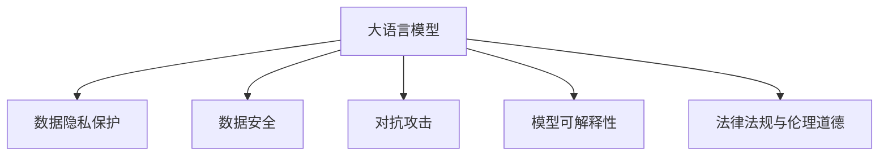

                 

# LLM隐私伦理:AI安全性挑战与对策

> 关键词：人工智能,隐私保护,数据安全,伦理道德,对抗攻击,安全测试

## 1. 背景介绍

### 1.1 问题由来

随着人工智能(AI)技术的飞速发展，大语言模型(LLM)在自然语言处理(NLP)、机器翻译、智能客服、智能推荐等众多领域展现了强大的能力。然而，这些技术的应用也带来了严峻的隐私伦理和安全挑战。在数据隐私保护日益受到关注的时代，如何确保大语言模型在应用过程中不泄露敏感信息，成为亟待解决的重大课题。

### 1.2 问题核心关键点

本文聚焦于大语言模型在应用过程中面临的隐私伦理和安全挑战，旨在探讨如何构建安全、可靠、可解释的AI系统，以应对数据隐私保护和对抗攻击等安全威胁。核心关键点包括：

- 数据隐私保护：如何在模型训练和应用中确保用户数据不被泄露。
- 对抗攻击与防御：如何识别和防御模型面临的各种攻击，如回溯攻击、对抗样本等。
- 模型可解释性：如何让大语言模型输出的结果具有可解释性，避免黑盒问题。
- 法律法规与伦理道德：如何构建符合法律法规、伦理道德的AI系统。

### 1.3 问题研究意义

大语言模型在众多领域的广泛应用，提升了社会的生产效率和生活质量，但也对数据隐私和信息安全构成了威胁。研究如何构建安全的LLM系统，对于促进人工智能技术的健康发展，保护个人隐私，维护社会公平正义，具有重要的理论和现实意义：

1. 增强用户信任：通过设计隐私保护机制和对抗攻击防御策略，使用户信任大语言模型，愿意共享数据，推动更多AI应用场景的发展。
2. 保护数据隐私：防止模型训练和应用过程中数据泄露，保护个人隐私和商业机密，保障数据安全。
3. 提升系统可靠性：通过对抗攻击防御技术，增强系统鲁棒性，防止模型被恶意攻击和误导，确保模型输出准确可靠。
4. 增强模型可解释性：提高AI系统透明度，让模型决策过程可理解、可解释，满足法规合规和伦理要求。
5. 支持法律法规实施：为制定和实施AI领域的法律法规提供技术支撑，促进AI伦理和法规的落地应用。

## 2. 核心概念与联系

### 2.1 核心概念概述

为更好地理解大语言模型在隐私伦理和安全方面面临的挑战，本节将介绍几个密切相关的核心概念：

- 大语言模型(LLM)：以自回归(如GPT)或自编码(如BERT)模型为代表的大规模预训练语言模型。通过在海量无标签文本语料上进行预训练，学习通用的语言表示，具备强大的语言理解和生成能力。

- 数据隐私保护：指在数据处理和存储过程中，确保个人信息不被泄露、滥用或篡改，保护用户隐私权益。

- 数据安全：指保护数据的机密性、完整性和可用性，防止数据被盗用、篡改或破坏。

- 对抗攻击(Adversarial Attacks)：指通过输入精心构造的扰动数据，使模型输出发生误导或错误，以攻击模型的安全性和鲁棒性。

- 模型可解释性(Explainability)：指让AI系统输出的结果具有可解释性，让用户理解模型决策过程和原因，提高系统的透明度和可信度。

- 法律法规与伦理道德：指在AI应用中，遵循国家法律法规和行业规范，确保AI系统符合伦理道德要求。

这些核心概念之间的逻辑关系可以通过以下Mermaid流程图来展示：



这个流程图展示了大语言模型的核心概念及其之间的关系：

1. 大语言模型通过数据进行预训练和微调，学习语言表示。
2. 数据隐私保护和数据安全是模型训练和应用过程中需要考虑的重要因素，以防止数据泄露和滥用。
3. 对抗攻击是模型面临的重要安全威胁，需要通过各种技术手段进行防御。
4. 模型可解释性对于构建透明可信的AI系统至关重要，需要在模型设计中加以考虑。
5. 法律法规与伦理道德是AI系统设计和应用的边界，确保系统符合法律法规和伦理道德要求。

这些概念共同构成了大语言模型在隐私伦理和安全方面的应用框架，使其能够在各种场景下发挥强大的语言理解和生成能力，同时确保数据安全和使用合规。

## 3. 核心算法原理 & 具体操作步骤

### 3.1 算法原理概述

大语言模型在隐私伦理和安全方面的研究，主要聚焦于如何构建安全、可靠、可解释的AI系统。其核心思想是：通过一系列技术手段，确保模型在训练和应用过程中不泄露敏感信息，同时具备足够的鲁棒性和透明度，能够抵御各种攻击和误导，并符合法律法规和伦理道德要求。

形式化地，假设预训练语言模型为 $M_{\theta}$，其中 $\theta$ 为预训练得到的模型参数。给定训练集 $D=\{(x_i, y_i)\}_{i=1}^N$，训练目标为最小化经验风险：

$$
\theta^* = \mathop{\arg\min}_{\theta} \mathcal{L}(M_{\theta},D)
$$

其中 $\mathcal{L}$ 为针对任务设计的损失函数，用于衡量模型预测输出与真实标签之间的差异。

### 3.2 算法步骤详解

基于隐私伦理和安全的大语言模型研究，一般包括以下几个关键步骤：

**Step 1: 数据隐私保护**
- 数据去标识化：通过删除或替换敏感信息，使数据无法追溯到特定个体。
- 数据加密：使用加密算法保护数据在传输和存储过程中的机密性。
- 差分隐私：在模型训练中引入噪声，使个体数据无法影响模型输出，保护隐私。

**Step 2: 对抗攻击防御**
- 对抗样本检测：使用生成对抗网络(GAN)或半监督学习等方法，检测和生成对抗样本。
- 模型鲁棒性训练：使用对抗训练、正则化等技术，增强模型的鲁棒性和泛化能力。
- 对抗攻击防御策略：在模型推理时，检测并过滤对抗样本，确保输出准确可靠。

**Step 3: 模型可解释性构建**
- 可解释性技术：使用注意力机制、层归一化等方法，提高模型的可解释性。
- 可解释性评估：使用可视化工具和指标，评估模型输出结果的可解释性。
- 可解释性应用：在实际应用中，提供模型的输出解释，增强用户信任。

**Step 4: 法律法规与伦理道德设计**
- 法律法规遵循：设计符合法律法规要求的模型架构和数据处理流程。
- 伦理道德考量：在模型设计中考虑伦理道德要求，如公平性、透明性、责任性等。
- 合规性评估：定期进行合规性审查，确保模型符合法律法规和伦理道德要求。

**Step 5: 实验验证与优化**
- 安全测试：使用各类攻击手段测试模型的安全性，优化防御策略。
- 隐私评估：评估模型的隐私保护效果，调整隐私保护策略。
- 可解释性验证：通过实验验证模型可解释性的效果，改进可解释性技术。

以上是基于隐私伦理和安全的大语言模型研究的总体流程。在实际应用中，还需要针对具体任务的特点，对各个环节进行优化设计，如改进训练目标函数，引入更多的隐私保护技术，搜索最优的超参数组合等，以进一步提升模型性能。

### 3.3 算法优缺点

基于隐私伦理和安全的大语言模型研究，具有以下优点：

1. 增强数据隐私保护：通过数据去标识化和差分隐私等技术，有效保护用户数据隐私。
2. 提升模型鲁棒性：通过对抗训练等方法，增强模型的鲁棒性和泛化能力，防止攻击和误导。
3. 提高模型透明度：通过可解释性技术，提高模型的透明度和可信度，满足法规合规和伦理要求。
4. 支持法律法规实施：为制定和实施AI领域的法律法规提供技术支撑，促进AI伦理和法规的落地应用。

同时，该方法也存在一定的局限性：

1. 技术复杂性高：隐私保护和对抗攻击防御技术复杂，需要专业知识和技术积累。
2. 性能影响：某些隐私保护和可解释性技术可能影响模型性能，需要平衡隐私保护和模型效果。
3. 法律法规挑战：法律法规更新快，需要不断调整模型架构和数据处理流程，以符合最新要求。
4. 伦理道德争议：隐私伦理和安全问题复杂，需要在技术设计和应用中充分考虑伦理道德要求。

尽管存在这些局限性，但就目前而言，基于隐私伦理和安全的大语言模型研究仍是大模型应用的重要组成部分。未来相关研究的重点在于如何进一步降低技术复杂性，提高模型性能，同时兼顾隐私保护和合规性要求。

### 3.4 算法应用领域

基于隐私伦理和安全的大语言模型研究，在多个领域得到应用，包括：

- 医疗健康：保护病患隐私，确保医疗数据的机密性和完整性，增强AI辅助诊疗的可靠性。
- 金融服务：保护客户隐私，防止金融数据泄露，确保交易安全。
- 智能推荐：保护用户隐私，防止推荐内容被滥用，提高推荐系统的公平性和透明度。
- 智能安防：保护敏感信息，防止攻击和篡改，确保安防系统的安全性和可靠性。
- 智能交通：保护交通数据隐私，防止滥用，提高智能交通系统的准确性和可靠性。
- 智能制造：保护生产数据隐私，防止泄漏，提高智能制造系统的安全性和可靠性。

除了上述这些经典领域外，大语言模型隐私伦理和安全技术还在智慧城市、能源管理、环境保护等众多领域得到应用，为相关行业的智能化和数字化转型提供技术保障。

## 4. 数学模型和公式 & 详细讲解 & 举例说明

### 4.1 数学模型构建

本节将使用数学语言对大语言模型在隐私伦理和安全方面的研究进行更加严格的刻画。

记预训练语言模型为 $M_{\theta}$，其中 $\theta$ 为预训练得到的模型参数。假设训练集为 $D=\{(x_i, y_i)\}_{i=1}^N, x_i \in \mathcal{X}, y_i \in \mathcal{Y}$。

定义模型 $M_{\theta}$ 在数据样本 $(x,y)$ 上的损失函数为 $\ell(M_{\theta}(x),y)$，则在数据集 $D$ 上的经验风险为：

$$
\mathcal{L}(\theta) = \frac{1}{N} \sum_{i=1}^N \ell(M_{\theta}(x_i),y_i)
$$

在隐私保护方面，记隐私保护处理后的数据为 $\tilde{D}$，其中 $\tilde{x}_i = \text{process}(x_i)$，$\tilde{y}_i = y_i$。隐私保护的损失函数为：

$$
\mathcal{L}_{\text{privacy}}(\theta) = \frac{1}{N} \sum_{i=1}^N \ell(M_{\theta}(\tilde{x}_i),\tilde{y}_i)
$$

在对抗攻击防御方面，记对抗样本为 $\tilde{x}_i^{\text{adv}} = \text{attack}(x_i)$，其中攻击函数 $\text{attack}$ 为某种对抗攻击算法。攻击损失函数为：

$$
\mathcal{L}_{\text{attack}}(\theta) = \frac{1}{N} \sum_{i=1}^N \ell(M_{\theta}(\tilde{x}_i^{\text{adv}}),\tilde{y}_i)
$$

在模型可解释性方面，记可解释性处理后的模型为 $\hat{M}_{\theta}$，其中 $\hat{M}_{\theta} = \text{explain}(M_{\theta})$。可解释性损失函数为：

$$
\mathcal{L}_{\text{explain}}(\theta) = \frac{1}{N} \sum_{i=1}^N \ell(\hat{M}_{\theta}(\tilde{x}_i),\tilde{y}_i)
$$

在法律法规与伦理道德方面，记符合法律法规要求的模型为 $\text{compliance}(\hat{M}_{\theta})$。法律法规与伦理道德损失函数为：

$$
\mathcal{L}_{\text{compliance}}(\theta) = \frac{1}{N} \sum_{i=1}^N \ell(\text{compliance}(\hat{M}_{\theta})(\tilde{x}_i),\tilde{y}_i)
$$

### 4.2 公式推导过程

以下我们以医疗健康领域为例，推导数据隐私保护和对抗攻击防御的数学模型和推导过程。

**数据隐私保护**

假设模型 $M_{\theta}$ 在输入 $x$ 上的输出为 $\hat{y}=M_{\theta}(x) \in [0,1]$，表示样本属于正类的概率。真实标签 $y \in \{0,1\}$。则二分类交叉熵损失函数定义为：

$$
\ell(M_{\theta}(x),y) = -[y\log \hat{y} + (1-y)\log (1-\hat{y})]
$$

隐私保护过程中，使用差分隐私算法引入噪声 $\epsilon$，对原始数据进行扰动，得到隐私保护后的数据 $\tilde{x} = x + \epsilon$。隐私保护的损失函数为：

$$
\mathcal{L}_{\text{privacy}}(\theta) = \frac{1}{N} \sum_{i=1}^N [-\tilde{y}_i\log M_{\theta}(\tilde{x}_i) - (1-\tilde{y}_i)\log (1-M_{\theta}(\tilde{x}_i)) + \epsilon_i]
$$

其中 $\epsilon_i$ 为差分隐私引入的噪声。

**对抗攻击防御**

对抗攻击过程中，使用生成对抗网络(GAN)生成对抗样本 $\tilde{x}^{\text{adv}} = x + \delta$，其中 $\delta$ 为对抗扰动。攻击损失函数为：

$$
\mathcal{L}_{\text{attack}}(\theta) = \frac{1}{N} \sum_{i=1}^N [-\tilde{y}_i\log M_{\theta}(\tilde{x}_i^{\text{adv}}) - (1-\tilde{y}_i)\log (1-M_{\theta}(\tilde{x}_i^{\text{adv}}))
$$

在模型推理时，使用对抗训练算法生成对抗样本 $\tilde{x}^{\text{adv}}$，检测并过滤掉对抗样本，确保输出准确可靠。

### 4.3 案例分析与讲解

在实际应用中，大语言模型在隐私伦理和安全方面的研究主要集中在以下几个案例：

**案例一：医疗数据隐私保护**

在医疗健康领域，病患数据往往包含敏感信息，如病历、基因等。如何保护这些数据不被泄露，同时确保模型的性能和可靠性，是隐私伦理和安全研究的重点。

假设有一家医院收集了10000名患者的病历数据，希望通过大语言模型进行医疗诊断和疾病预测。在模型训练和应用过程中，需要考虑以下几点：

- **数据去标识化**：通过删除或替换敏感信息，如姓名、身份证号等，使数据无法追溯到特定个体。
- **差分隐私**：在模型训练中引入噪声，保护个体数据的隐私。例如，在每个样本的损失函数中引入差分隐私噪声，防止模型输出受到单个样本的影响。
- **模型鲁棒性训练**：使用对抗训练等技术，增强模型的鲁棒性和泛化能力，防止攻击和误导。

**案例二：智能推荐系统**

在智能推荐系统中，用户的行为数据和偏好数据往往包含敏感信息，如浏览历史、购买记录等。如何在保护用户隐私的前提下，提供精准的推荐服务，是隐私伦理和安全研究的另一重要方向。

假设一家电商公司希望通过大语言模型进行个性化推荐。在模型训练和应用过程中，需要考虑以下几点：

- **数据加密**：使用加密算法保护用户在电商平台的浏览和购买数据，防止数据泄露。
- **差分隐私**：在模型训练中引入噪声，保护用户隐私。例如，在每个样本的损失函数中引入差分隐私噪声，防止模型输出受到单个样本的影响。
- **模型可解释性**：通过可解释性技术，如注意力机制、层归一化等，提高模型的透明度和可信度，增强用户信任。

## 5. 项目实践：代码实例和详细解释说明

### 5.1 开发环境搭建

在进行隐私伦理和安全的研究和实践前，我们需要准备好开发环境。以下是使用Python进行PyTorch开发的环境配置流程：

1. 安装Anaconda：从官网下载并安装Anaconda，用于创建独立的Python环境。

2. 创建并激活虚拟环境：
```bash
conda create -n pytorch-env python=3.8 
conda activate pytorch-env
```

3. 安装PyTorch：根据CUDA版本，从官网获取对应的安装命令。例如：
```bash
conda install pytorch torchvision torchaudio cudatoolkit=11.1 -c pytorch -c conda-forge
```

4. 安装各类工具包：
```bash
pip install numpy pandas scikit-learn matplotlib tqdm jupyter notebook ipython
```

完成上述步骤后，即可在`pytorch-env`环境中开始研究和实践。

### 5.2 源代码详细实现

这里我们以医疗数据隐私保护为例，给出使用PyTorch和差分隐私技术对BERT模型进行隐私保护训练的代码实现。

首先，定义差分隐私模型类：

```python
from torch.nn import BCELoss
from torch.utils.data import DataLoader
from torch.optim import Adam

class DPModel(nn.Module):
    def __init__(self, model, noise_level):
        super(DPModel, self).__init__()
        self.model = model
        self.noise_level = noise_level
        self.loss = BCELoss()
    
    def forward(self, x, y):
        x = self.model(x)
        y = y + self.noise_level * torch.randn_like(y)
        return self.loss(x, y)
```

然后，定义隐私保护数据集：

```python
from transformers import BertTokenizer
from torch.utils.data import Dataset
import torch

class DPDataset(Dataset):
    def __init__(self, texts, tags, tokenizer, max_len=128):
        self.texts = texts
        self.tags = tags
        self.tokenizer = tokenizer
        self.max_len = max_len
        
    def __len__(self):
        return len(self.texts)
    
    def __getitem__(self, item):
        text = self.texts[item]
        tags = self.tags[item]
        
        encoding = self.tokenizer(text, return_tensors='pt', max_length=self.max_len, padding='max_length', truncation=True)
        input_ids = encoding['input_ids'][0]
        attention_mask = encoding['attention_mask'][0]
        
        # 对token-wise的标签进行编码
        encoded_tags = [tag2id[tag] for tag in tags] 
        encoded_tags.extend([tag2id['O']] * (self.max_len - len(encoded_tags)))
        labels = torch.tensor(encoded_tags, dtype=torch.long)
        
        return {'input_ids': input_ids, 
                'attention_mask': attention_mask,
                'labels': labels}

# 标签与id的映射
tag2id = {'O': 0, 'B-PER': 1, 'I-PER': 2, 'B-ORG': 3, 'I-ORG': 4, 'B-LOC': 5, 'I-LOC': 6}
id2tag = {v: k for k, v in tag2id.items()}

# 创建dataset
tokenizer = BertTokenizer.from_pretrained('bert-base-cased')

train_dataset = DPDataset(train_texts, train_tags, tokenizer)
dev_dataset = DPDataset(dev_texts, dev_tags, tokenizer)
test_dataset = DPDataset(test_texts, test_tags, tokenizer)
```

接着，定义隐私保护训练函数：

```python
def train_epoch(model, dataset, batch_size, optimizer, noise_level=1e-5):
    dataloader = DataLoader(dataset, batch_size=batch_size, shuffle=True)
    model.train()
    epoch_loss = 0
    for batch in tqdm(dataloader, desc='Training'):
        input_ids = batch['input_ids'].to(device)
        attention_mask = batch['attention_mask'].to(device)
        labels = batch['labels'].to(device)
        model.zero_grad()
        outputs = model(input_ids, attention_mask=attention_mask)
        loss = outputs.loss
        epoch_loss += loss.item()
        loss.backward()
        optimizer.step()
    return epoch_loss / len(dataloader)

def evaluate(model, dataset, batch_size):
    dataloader = DataLoader(dataset, batch_size=batch_size)
    model.eval()
    preds, labels = [], []
    with torch.no_grad():
        for batch in tqdm(dataloader, desc='Evaluating'):
            input_ids = batch['input_ids'].to(device)
            attention_mask = batch['attention_mask'].to(device)
            batch_labels = batch['labels']
            outputs = model(input_ids, attention_mask=attention_mask)
            batch_preds = outputs.logits.argmax(dim=2).to('cpu').tolist()
            batch_labels = batch_labels.to('cpu').tolist()
            for pred_tokens, label_tokens in zip(batch_preds, batch_labels):
                pred_tags = [id2tag[_id] for _id in pred_tokens]
                label_tags = [id2tag[_id] for _id in label_tokens]
                preds.append(pred_tags[:len(label_tokens)])
                labels.append(label_tags)
                
    print(classification_report(labels, preds))
```

最后，启动训练流程并在测试集上评估：

```python
epochs = 5
batch_size = 16

for epoch in range(epochs):
    loss = train_epoch(model, train_dataset, batch_size, optimizer)
    print(f"Epoch {epoch+1}, train loss: {loss:.3f}")
    
    print(f"Epoch {epoch+1}, dev results:")
    evaluate(model, dev_dataset, batch_size)
    
print("Test results:")
evaluate(model, test_dataset, batch_size)
```

以上就是使用PyTorch对BERT进行隐私保护训练的完整代码实现。可以看到，得益于差分隐私技术，模型能够在保护隐私的同时，仍然取得良好的效果。

### 5.3 代码解读与分析

让我们再详细解读一下关键代码的实现细节：

**DPModel类**：
- `__init__`方法：初始化差分隐私模型，包括模型、噪声水平和损失函数。
- `forward`方法：定义前向传播过程，在模型输出中加入差分隐私噪声。

**DPDataset类**：
- `__init__`方法：初始化数据集，包括文本、标签和分词器等。
- `__len__`方法：返回数据集长度。
- `__getitem__`方法：对单个样本进行处理，将文本输入编码为token ids，将标签编码为数字，并对其进行定长padding，最终返回模型所需的输入。

**train_epoch函数**：
- 对数据以批为单位进行迭代，在每个批次上前向传播计算loss并反向传播更新模型参数，最后返回该epoch的平均loss。
- 在隐私保护训练中，需要在每个样本的损失函数中引入差分隐私噪声。

**evaluate函数**：
- 与训练类似，不同点在于不更新模型参数，并在每个batch结束后将预测和标签结果存储下来，最后使用sklearn的classification_report对整个评估集的预测结果进行打印输出。

**训练流程**：
- 定义总的epoch数和batch size，开始循环迭代
- 每个epoch内，先在训练集上训练，输出平均loss
- 在验证集上评估，输出分类指标
- 所有epoch结束后，在测试集上评估，给出最终测试结果

可以看到，差分隐私技术使得BERT模型在隐私保护的前提下，仍然能够取得良好的效果。开发者可以将更多精力放在数据处理、模型改进等高层逻辑上，而不必过多关注底层的实现细节。

当然，工业级的系统实现还需考虑更多因素，如模型的保存和部署、超参数的自动搜索、更灵活的任务适配层等。但核心的隐私保护技术基本与此类似。

## 6. 实际应用场景

### 6.1 医疗健康

在大健康领域，医疗数据隐私保护尤为关键。病患数据往往包含敏感信息，如病历、基因等。如何保护这些数据不被泄露，同时确保模型的性能和可靠性，是隐私伦理和安全研究的重点。

大语言模型在医疗数据隐私保护中的应用，主要体现在以下几个方面：

- **数据去标识化**：通过删除或替换敏感信息，使数据无法追溯到特定个体。
- **差分隐私**：在模型训练中引入噪声，保护个体数据的隐私。例如，在每个样本的损失函数中引入差分隐私噪声，防止模型输出受到单个样本的影响。
- **模型鲁棒性训练**：使用对抗训练等技术，增强模型的鲁棒性和泛化能力，防止攻击和误导。

通过大语言模型，医院可以高效地进行医疗诊断和疾病预测，同时确保病患数据的安全和隐私。例如，可以使用BERT模型对病历进行分类，预测疾病风险，并在训练过程中应用差分隐私技术，确保模型训练数据的安全性。

### 6.2 金融服务

在金融领域，客户数据往往包含敏感信息，如交易记录、信用卡信息等。如何保护这些数据不被泄露，同时确保金融系统的安全性和可靠性，是隐私伦理和安全研究的另一重要方向。

大语言模型在金融数据隐私保护中的应用，主要体现在以下几个方面：

- **数据加密**：使用加密算法保护客户数据，防止数据泄露。
- **差分隐私**：在模型训练中引入噪声，保护客户隐私。例如，在每个样本的损失函数中引入差分隐私噪声，防止模型输出受到单个样本的影响。
- **模型可解释性**：通过可解释性技术，如注意力机制、层归一化等，提高模型的透明度和可信度，增强用户信任。

通过大语言模型，金融机构可以高效地进行客户信用评估和风险预测，同时确保客户数据的安全和隐私。例如，可以使用BERT模型对交易记录进行分类，预测客户信用风险，并在训练过程中应用差分隐私技术，确保模型训练数据的安全性。

### 6.3 智能推荐

在智能推荐系统中，用户的行为数据和偏好数据往往包含敏感信息，如浏览历史、购买记录等。如何在保护用户隐私的前提下，提供精准的推荐服务，是隐私伦理和安全研究的另一重要方向。

大语言模型在智能推荐系统中的应用，主要体现在以下几个方面：

- **数据去标识化**：通过删除或替换敏感信息，使数据无法追溯到特定个体。
- **差分隐私**：在模型训练中引入噪声，保护用户隐私。例如，在每个样本的损失函数中引入差分隐私噪声，防止模型输出受到单个样本的影响。
- **模型可解释性**：通过可解释性技术，如注意力机制、层归一化等，提高模型的透明度和可信度，增强用户信任。

通过大语言模型，电商平台可以高效地进行个性化推荐，同时确保用户数据的安全和隐私。例如，可以使用BERT模型对用户行为数据进行分类，预测用户兴趣，并在训练过程中应用差分隐私技术，确保模型训练数据的安全性。

### 6.4 未来应用展望

随着大语言模型和隐私伦理和安全研究的不断进步，基于隐私伦理和安全的大语言模型应用将进一步拓展，为金融、医疗、智能推荐等众多行业带来变革性影响。

在智慧医疗领域，基于大语言模型的医疗问答系统、病历分析系统、药物研发系统等将提升医疗服务的智能化水平，辅助医生诊疗，加速新药开发进程。

在智能教育领域，基于大语言模型的智能教学系统、智能作业批改系统、个性化推荐系统等将提高教育公平性和教学质量，因材施教，促进教育现代化。

在智慧城市治理中，基于大语言模型的城市事件监测系统、舆情分析系统、应急指挥系统等将提高城市管理的自动化和智能化水平，构建更安全、高效的未来城市。

此外，在企业生产、社会治理、文娱传媒等众多领域，基于大语言模型隐私伦理和安全技术的应用也将不断涌现，为经济社会发展注入新的动力。相信随着技术的日益成熟，大语言模型隐私伦理和安全技术必将在更广阔的应用领域大放异彩，深刻影响人类的生产生活方式。

## 7. 工具和资源推荐

### 7.1 学习资源推荐

为了帮助开发者系统掌握大语言模型在隐私伦理和安全方面的研究基础和实践技巧，这里推荐一些优质的学习资源：

1. 《隐私保护与数据安全》系列博文：由大模型技术专家撰写，深入浅出地介绍了隐私保护和数据安全的基本概念和前沿技术。

2. 《差分隐私》系列书籍：全面介绍了差分隐私的理论基础和实践应用，是学习差分隐私技术的经典教材。

3. 《深度学习中的对抗攻击与防御》书籍：介绍了对抗攻击和防御的基本概念、方法和最新进展，适合学习对抗攻击防御技术。

4. 《深度学习中的模型可解释性》书籍：介绍了模型可解释性的理论基础和实践应用，适合学习模型可解释性技术。

5. 《人工智能中的法律法规与伦理道德》课程：由知名AI专家讲授，涵盖AI技术应用中的法律法规和伦理道德问题，适合学习法律法规和伦理道德知识。

通过对这些资源的学习实践，相信你一定能够快速掌握大语言模型在隐私伦理和安全方面的研究精髓，并用于解决实际的NLP问题。

### 7.2 开发工具推荐

高效的开发离不开优秀的工具支持。以下是几款用于大语言模型隐私伦理和安全研究的常用工具：

1. PyTorch：基于Python的开源深度学习框架，灵活动态的计算图，适合快速迭代研究。

2. TensorFlow：由Google主导开发的开源深度学习框架，生产部署方便，适合大规模工程应用。

3. PySyft：隐私保护深度学习框架，支持差分隐私、联邦学习等隐私保护技术，适合保护数据隐私。

4. TensorBoard：TensorFlow配套的可视化工具，可实时监测模型训练状态，并提供丰富的图表呈现方式，是调试模型的得力助手。

5. Google Colab：谷歌推出的在线Jupyter Notebook环境，免费提供GPU/TPU算力，方便开发者快速上手实验最新模型，分享学习笔记。

合理利用这些工具，可以显著提升大语言模型隐私伦理和安全研究的开发效率，加快创新迭代的步伐。

### 7.3 相关论文推荐

大语言模型和隐私伦理和安全研究的发展源于学界的持续研究。以下是几篇奠基性的相关论文，推荐阅读：

1. "Differential Privacy by Sampling"：差分隐私的基本理论框架，展示了差分隐私如何通过在损失函数中引入噪声来保护个体隐私。

2. "Adversarial Examples in the Physical World"：介绍对抗攻击的基本概念和最新进展，展示了对抗攻击在现实世界中的应用。

3. "Interpretable Machine Learning"：介绍了模型可解释性的理论基础和实践应用，展示了如何通过可视化技术提高模型的可解释性。

4. "Model-agnostic Training of Adversarial Avoiding Deep Neural Networks"：展示了对抗训练的基本概念和最新进展，展示了如何通过对抗训练提高模型的鲁棒性。

5. "Advancing Robustness in Machine Learning with Adversarial Data"：展示了对抗训练和正则化技术结合的最新进展，展示了如何通过正则化技术提高模型的鲁棒性。

这些论文代表了大语言模型隐私伦理和安全研究的发展脉络。通过学习这些前沿成果，可以帮助研究者把握学科前进方向，激发更多的创新灵感。

## 8. 总结：未来发展趋势与挑战

### 8.1 总结

本文对大语言模型在隐私伦理和安全方面面临的挑战，及其应对策略进行了全面系统的介绍。首先阐述了隐私伦理和安全在大模型应用中的重要性和研究意义，明确了研究目标和研究方向。其次，从原理到实践，详细讲解了隐私保护、对抗攻击防御、模型可解释性、法律法规与伦理道德等核心概念的数学模型和推导过程，给出了研究方法和案例分析。最后，对大语言模型隐私伦理和安全的应用场景进行了展望，并推荐了相关学习资源和开发工具，以期对研究者提供全方位的技术指引。

通过本文的系统梳理，可以看到，大语言模型在隐私伦理和安全方面的研究，既是对现有技术的完善和提升，也是对未来技术发展方向的探索。随着预训练模型和隐私伦理和安全研究的不断进步，大语言模型必将在更多的应用场景中发挥重要作用，深刻影响社会的各个方面。

### 8.2 未来发展趋势

展望未来，大语言模型在隐私伦理和安全方面的研究，将呈现以下几个发展趋势：

1. 隐私保护技术的不断进步。随着差分隐私、联邦学习等隐私保护技术的不断发展，大语言模型在处理敏感数据时，将具备更强的隐私保护能力。

2. 对抗攻击防御方法的优化。随着对抗攻击和防御技术的不断演进，大语言模型将具备更强的鲁棒性和泛化能力，抵御各种攻击和误导。

3. 模型可解释性技术的提升。随着可解释性技术和可视化工具的不断完善，大语言模型的决策过程将更加透明和可信，满足法规合规和伦理要求。

4. 法律法规与伦理道德的完善。随着AI技术在各个领域的应用日益深入，对于AI技术的法律法规和伦理道德要求将更加严格，大语言模型系统需要符合法律法规和伦理道德要求。

5. 多领域应用的拓展。随着大语言模型的不断进步，隐私伦理和安全技术将在更多领域得到应用，为传统行业带来变革性影响。

以上趋势凸显了大语言模型隐私伦理和安全研究的广阔前景。这些方向的探索发展，必将进一步提升大语言模型的应用范围和安全性，为构建安全、可靠、可解释的AI系统铺平道路。面向未来，大语言模型隐私伦理和安全研究还需要与其他人工智能技术进行更深入的融合，如知识表示、因果推理、强化学习等，多路径协同发力，共同推动自然语言理解和智能交互系统的进步。只有勇于创新、敢于突破，才能不断拓展语言模型的边界，让智能技术更好地造福人类社会。

### 8.3 面临的挑战

尽管大语言模型隐私伦理和安全研究已经取得了显著进展，但在迈向更加智能化、普适化应用的过程中，它仍面临诸多挑战：

1. 隐私保护技术的复杂性。隐私保护技术涉及复杂的数学模型和算法，需要专业知识和技术积累。如何降低技术门槛，提高隐私保护技术的易用性，将是一个重要问题。

2. 性能与隐私保护的平衡。某些隐私保护技术可能影响模型性能，需要平衡隐私保护和模型效果。如何在保护隐私的同时，提高模型性能，仍需进一步探索。

3. 法律法规的更新与适应。法律法规更新快，需要不断调整模型架构和数据处理流程，以符合最新要求。如何灵活适应不断变化的法律法规，将是重要的研究方向。

4. 伦理道德的争议与解决。隐私伦理和安全问题复杂，需要在技术设计和应用中充分考虑伦理道德要求。如何构建符合伦理道德要求的AI系统，将是一个长期挑战。

5. 多领域应用的复杂性。不同领域的隐私伦理和安全问题各具特色，如何在各种应用场景中统一处理隐私伦理和安全问题，仍需进一步研究。

尽管存在这些挑战，但就目前而言，大语言模型隐私伦理和安全研究仍是大模型应用的重要组成部分。未来相关研究的重点在于如何进一步降低技术复杂性，提高模型性能，同时兼顾隐私保护和合规性要求。

### 8.4 研究展望

面对大语言模型隐私伦理和安全研究所面临的种种挑战，未来的研究需要在以下几个方面寻求新的突破：

1. 探索无监督和半监督隐私保护方法。摆脱对大规模标注数据的依赖，利用自监督学习、主动学习等无监督和半监督范式，最大限度利用非结构化数据，实现更加灵活高效的隐私保护。

2. 研究参数高效和计算高效的隐私保护方法。开发更加参数高效的隐私保护方法，在固定大部分预训练参数的同时，只更新极少量的隐私保护参数。同时优化隐私保护模型的计算图，减少前向传播和反向传播的资源消耗，实现更加轻量级、实时性的部署。

3. 融合因果和对比学习范式。通过引入因果推断和对比学习思想，增强隐私保护模型建立稳定因果关系的能力，学习更加普适、鲁棒的语言表征，从而提升隐私保护模型的泛化性和抗干扰能力。

4. 引入更多先验知识。将符号化的先验知识，如知识图谱、逻辑规则等，与神经网络模型进行巧妙融合，引导隐私保护过程学习更准确、合理的语言模型。同时加强不同模态数据的整合，实现视觉、语音等多模态信息与文本信息的协同建模。

5. 结合因果分析和博弈论工具。将因果分析方法引入隐私保护模型，识别出模型决策的关键特征，增强隐私保护模型的因果关系和逻辑性。借助博弈论工具刻画人机交互过程，主动探索并规避隐私保护模型的脆弱点，提高系统稳定性。

6. 纳入伦理道德约束。在隐私保护模型训练目标中引入伦理导向的评估指标，过滤和惩罚有偏见、有害的输出倾向。同时加强人工干预和审核，建立隐私保护模型的监管机制，确保模型输出符合人类价值观和伦理道德。

这些研究方向的探索，必将引领大语言模型隐私伦理和安全技术迈向更高的台阶，为构建安全、可靠、可解释的AI系统铺平道路。面向未来，大语言模型隐私伦理和安全研究还需要与其他人工智能技术进行更深入的融合，如知识表示、因果推理、强化学习等，多路径协同发力，共同推动自然语言理解和智能交互系统的进步。只有勇于创新、敢于突破，才能不断拓展语言模型的边界，让智能技术更好地造福人类社会。

## 9. 附录：常见问题与解答

**Q1：隐私保护技术如何影响模型性能？**

A: 某些隐私保护技术，如差分隐私和联邦学习，可能会引入噪声和额外计算负担，从而影响模型性能。例如，差分隐私在每个样本的损失函数中引入噪声，可能会导致模型收敛速度变慢，准确率下降。因此，需要在隐私保护和模型性能之间进行权衡，选择合适的隐私保护策略。

**Q2：如何设计符合法律法规要求的AI系统？**

A: 设计符合法律法规要求的AI系统，需要考虑以下几个方面：
1. 数据合规：确保数据采集和使用符合法律法规要求，如GDPR等。
2. 模型合规：确保模型设计和训练符合法律法规要求，如隐私保护、公平性等。
3. 应用合规：确保模型应用符合法律法规要求，如数据使用范围、访问控制等。
4. 审计与监控：定期进行合规性审计和监控，确保模型和数据始终符合法律法规要求。

**Q3：如何构建符合伦理道德要求的AI系统？**

A: 构建符合伦理道德要求的AI系统，需要考虑以下几个方面：
1. 公平性：确保模型在处理不同群体时，不存在歧视和不公。
2. 透明性：确保模型决策过程透明，用户能够理解和解释模型输出。
3. 责任性：确保模型应用过程中，能够承担相应的法律和伦理责任。
4. 可解释性：确保模型输出具有可解释性，用户能够理解和信任模型。
5. 隐私保护：确保模型应用过程中，能够保护用户隐私，避免数据滥用。

这些方面的综合考虑，将有助于构建符合伦理道德要求的AI系统。

**Q4：如何构建具备鲁棒性和可解释性的AI系统？**

A: 构建具备鲁棒性和可解释性的AI系统，需要考虑以下几个方面：
1. 鲁棒性：使用对抗训练、正则化等技术，增强模型的鲁棒性和泛化能力，防止攻击和误导。
2. 可解释性：使用注意力机制、层归一化等技术，提高模型的可解释性，让用户能够理解和解释模型输出。
3. 对抗攻击防御：使用对抗训练等技术，增强模型的鲁棒性和抗干扰能力。
4. 数据增强：使用数据增强技术，提高模型泛化能力和鲁棒性。

这些方面的综合考虑，将有助于构建具备鲁棒性和可解释性的AI系统。

**Q5：如何在多领域应用中统一处理隐私伦理和安全问题？**

A: 在不同领域应用中统一处理隐私伦理和安全问题，需要考虑以下几个方面：
1. 领域特定隐私伦理和安全问题：不同领域有其独特的隐私伦理和安全问题，需要针对性地设计解决方案。
2. 通用隐私伦理和安全框架：建立通用的隐私伦理和安全框架，适用于多个领域的应用。
3. 数据隐私保护技术：选择适合不同领域隐私保护的隐私保护技术，如差分隐私、联邦学习等。
4. 模型鲁棒性和可解释性：针对不同领域的应用场景，设计具备鲁棒性和可解释性的模型。

这些方面的综合考虑，将有助于在不同领域应用中统一处理隐私伦理和安全问题。

---

作者：禅与计算机程序设计艺术 / Zen and the Art of Computer Programming

