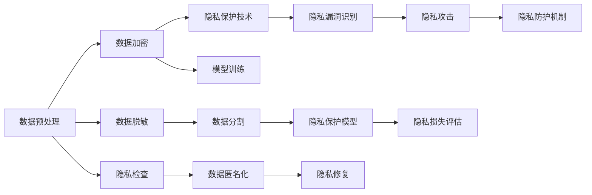

                 

# LLM隐私保护:现状、漏洞与对策

## 1. 背景介绍

在大语言模型(Large Language Models, LLMs)的广泛应用中，隐私保护成为日益重要的问题。LLMs通过预训练和微调学习了大量文本数据，这些数据可能包含敏感的个人信息、商业机密等。如何在保障LLMs效用的同时，确保数据隐私不被泄露，是一个亟待解决的问题。

隐私保护已经成为数据科学、人工智能、法律和伦理等领域的研究热点。隐私保护措施的缺失可能导致数据滥用，损害个人隐私，破坏社会信任。因此，深入理解LLMs隐私保护现状、识别潜在隐私漏洞，并制定有效对策，显得尤为重要。

## 2. 核心概念与联系

### 2.1 核心概念概述

为了深入理解LLMs隐私保护问题，我们先介绍几个关键概念：

- **数据隐私**：指个人、组织或机构的敏感数据不被未经授权的人员访问和利用的权利。
- **隐私保护**：指通过技术手段或法律法规，保护个人数据隐私安全，防止数据滥用和泄露。
- **LLMs隐私泄漏**：指LLMs在预训练、微调和推理过程中，泄漏敏感数据隐私的行为。
- **隐私攻防**：指采取技术手段，识别并防御LLMs在处理数据时可能造成的隐私泄漏。

这些核心概念之间相互联系，共同构成了LLMs隐私保护的基本框架。

### 2.2 核心概念原理和架构的 Mermaid 流程图



这个流程图展示了LLMs隐私保护从数据预处理到隐私防护机制的整个流程：

1. 数据预处理阶段：对原始数据进行去标识、去敏感处理，减少数据泄露风险。
2. 数据加密：对处理后的数据进行加密，进一步保护数据隐私。
3. 隐私保护技术：应用差分隐私、联邦学习等隐私保护技术，确保模型训练时数据隐私不泄露。
4. 隐私漏洞识别：通过隐私风险评估，识别模型在处理数据时可能存在的隐私泄漏点。
5. 隐私攻击：识别并防御各种隐私攻击，保护数据隐私安全。
6. 隐私保护模型：设计和应用隐私保护算法，提高模型的隐私防护能力。
7. 隐私损失评估：评估隐私保护技术的有效性，确保隐私保护目标达成。

这些步骤共同构成了LLMs隐私保护的技术架构，旨在确保数据隐私在模型训练、推理和应用过程中的安全。

## 3. 核心算法原理 & 具体操作步骤

### 3.1 算法原理概述

隐私保护算法在LLMs中的应用，旨在限制数据隐私泄漏，确保在模型训练和推理过程中，用户数据不被泄露或滥用。主要算法包括差分隐私、联邦学习、同态加密等。

**差分隐私**：通过添加噪声扰动，确保对单个数据点的修改不影响对整体数据集的分析。常用方法有拉普拉斯噪声、高斯噪声等。

**联邦学习**：在分布式计算环境中，模型训练在多个本地设备上进行，仅在本地设备上保留模型参数，确保数据不离开本地。

**同态加密**：允许对加密数据进行计算，而无需解密，计算结果在解密后与对原始数据计算的结果相同。

### 3.2 算法步骤详解

以差分隐私为例，详细介绍其具体操作步骤：

1. **数据收集与预处理**：
   - 收集用户数据，进行去标识、去敏感处理。
   - 对数据进行划分，确保每个用户数据具有相同权重。

2. **噪声添加**：
   - 对处理后的数据添加噪声扰动。
   - 噪声的强度根据隐私预算（ε）确定。

3. **模型训练**：
   - 在扰动数据上训练模型。
   - 模型参数与数据无关，仅取决于扰动噪声。

4. **隐私预算管理**：
   - 对差分隐私预算进行分配和管理，确保隐私保护目标达成。
   - 隐私预算越大，隐私保护效果越好，但计算开销也越大。

5. **结果推断与评估**：
   - 对模型输出进行推断，确保结果不泄露用户隐私。
   - 通过隐私损失评估指标，如ε-差分隐私、l2-差分隐私等，评估隐私保护效果。

### 3.3 算法优缺点

差分隐私的主要优点包括：
- 简单易行：只需要在模型训练前添加噪声扰动，不需要修改模型结构。
- 通用性：适用于各种数据集和模型架构。
- 严格隐私保护：通过隐私预算的严格管理，确保模型输出不泄露用户隐私。

其主要缺点包括：
- 计算开销：添加噪声扰动增加了计算复杂度，影响模型训练效率。
- 精度损失：噪声扰动可能导致模型精度下降。
- 数据依赖：模型训练的隐私预算依赖于数据集大小和敏感性。

### 3.4 算法应用领域

差分隐私、联邦学习和同态加密等隐私保护算法，在LLMs中的应用涵盖了以下领域：

- **医疗领域**：保护患者隐私，确保医疗数据不被泄露。
- **金融领域**：保护用户隐私，确保金融交易数据安全。
- **电子商务**：保护用户隐私，确保交易数据不被滥用。
- **社交网络**：保护用户隐私，确保社交数据不被泄露。
- **智能合约**：保护交易双方隐私，确保智能合约执行安全。

## 4. 数学模型和公式 & 详细讲解

### 4.1 数学模型构建

差分隐私模型中，数据的隐私保护主要通过添加噪声扰动来实现。假设原始数据集为 $D$，扰动后的数据集为 $D'$，隐私预算为 $\epsilon$。差分隐私模型通过在模型训练时，对数据集添加噪声扰动，确保模型训练结果对单个数据点的变化不敏感。

形式化地，设 $\mathcal{P}$ 为模型参数空间，$M(D)$ 为模型在数据集 $D$ 上的训练结果，$\hat{M}(D')$ 为模型在扰动后的数据集 $D'$ 上的训练结果。差分隐私模型的目标是最小化模型输出 $M(D)$ 和 $\hat{M}(D')$ 之间的差异，同时满足隐私预算 $\epsilon$ 的要求。

$$
\min_{\theta} \mathbb{E}_{D \sim \mathcal{D}} [\| M(D) - \hat{M}(D') \|]
$$

其中，$\mathcal{D}$ 为数据分布，$\| \cdot \|$ 为模型输出差异度量。

### 4.2 公式推导过程

差分隐私的噪声添加方式包括拉普拉斯噪声和高斯噪声。以拉普拉斯噪声为例，假设 $D$ 中的每个数据点 $x_i$ 的敏感度为 $\Delta$，噪声概率密度函数为 $f(x)$，则扰动后的数据集 $D'$ 的概率密度函数为：

$$
f_{\epsilon}(x) = \frac{1}{2\Delta} e^{-\frac{\epsilon}{\Delta} |x|}
$$

在训练过程中，模型在扰动后的数据集 $D'$ 上训练，得到模型参数 $\hat{\theta}$。差分隐私的目标是最大化模型在扰动数据上的性能，同时满足隐私预算 $\epsilon$ 的要求。

### 4.3 案例分析与讲解

以金融数据隐私保护为例，说明差分隐私的应用：

假设银行收集了客户交易记录，包含客户的年龄、性别、收入等敏感信息。银行希望使用这些数据训练模型，预测客户是否会进行高消费。为了防止客户隐私泄露，银行对数据进行差分隐私处理：

1. **数据收集与预处理**：
   - 收集客户交易记录，进行去标识处理。
   - 对数据进行划分，确保每个客户数据具有相同权重。

2. **噪声添加**：
   - 对处理后的数据添加拉普拉斯噪声扰动。
   - 噪声的强度根据隐私预算 $\epsilon$ 确定。

3. **模型训练**：
   - 在扰动数据上训练模型，预测客户是否会进行高消费。
   - 模型参数与数据无关，仅取决于噪声扰动。

4. **隐私预算管理**：
   - 对差分隐私预算进行分配和管理，确保隐私保护目标达成。
   - 隐私预算越大，隐私保护效果越好，但计算开销也越大。

5. **结果推断与评估**：
   - 对模型输出进行推断，确保结果不泄露客户隐私。
   - 通过隐私损失评估指标，如ε-差分隐私、l2-差分隐私等，评估隐私保护效果。

## 5. 项目实践：代码实例和详细解释说明

### 5.1 开发环境搭建

在进行LLM隐私保护项目实践前，我们需要准备好开发环境。以下是使用Python进行差分隐私实践的环境配置流程：

1. 安装Anaconda：从官网下载并安装Anaconda，用于创建独立的Python环境。

2. 创建并激活虚拟环境：
```bash
conda create -n differential_privacy python=3.8 
conda activate differential_privacy
```

3. 安装相关工具包：
```bash
pip install pytorch torchvision torchaudio cudatoolkit=11.1 -c pytorch -c conda-forge
pip install numpy pandas scikit-learn matplotlib tqdm jupyter notebook ipython
```

4. 安装差分隐私相关库：
```bash
pip install pytorch-differential-privacy
```

完成上述步骤后，即可在`differential_privacy`环境中开始差分隐私实践。

### 5.2 源代码详细实现

这里我们以金融数据隐私保护为例，展示差分隐私在LLMs中的应用。

首先，定义隐私预算 $\epsilon$ 和噪声强度 $\Delta$：

```python
import torch
import torch.nn as nn
from pytorch_differential_privacy import DPStochasticGradientDoptimizer
from torch.utils.data import DataLoader
import numpy as np

# 定义隐私预算和噪声强度
epsilon = 1.0
delta = 1e-5
```

然后，定义模型和优化器：

```python
# 定义模型结构
class Model(nn.Module):
    def __init__(self):
        super(Model, self).__init__()
        self.linear = nn.Linear(1, 1)
    
    def forward(self, x):
        return self.linear(x)

# 初始化模型和优化器
model = Model()
optimizer = DPStochasticGradientDoptimizer(model.parameters(), epsilon=epsilon, delta=delta)
```

接着，定义训练和评估函数：

```python
# 训练函数
def train_epoch(model, dataset, batch_size, optimizer):
    dataloader = DataLoader(dataset, batch_size=batch_size, shuffle=True)
    model.train()
    epoch_loss = 0
    for batch in dataloader:
        input_ids = batch['input_ids'].to(device)
        attention_mask = batch['attention_mask'].to(device)
        labels = batch['labels'].to(device)
        model.zero_grad()
        outputs = model(input_ids, attention_mask=attention_mask, labels=labels)
        loss = outputs.loss
        epoch_loss += loss.item()
        loss.backward()
        optimizer.step()
    return epoch_loss / len(dataloader)

# 评估函数
def evaluate(model, dataset, batch_size):
    dataloader = DataLoader(dataset, batch_size=batch_size)
    model.eval()
    preds, labels = [], []
    with torch.no_grad():
        for batch in dataloader:
            input_ids = batch['input_ids'].to(device)
            attention_mask = batch['attention_mask'].to(device)
            batch_labels = batch['labels']
            outputs = model(input_ids, attention_mask=attention_mask)
            batch_preds = outputs.logits.argmax(dim=2).to('cpu').tolist()
            batch_labels = batch_labels.to('cpu').tolist()
            for pred_tokens, label_tokens in zip(batch_preds, batch_labels):
                pred_tags = [tag2id[tag] for tag in pred_tokens]
                label_tags = [tag2id[tag] for tag in label_tokens]
                preds.append(pred_tags[:len(label_tags)])
                labels.append(label_tags)
    return preds, labels
```

最后，启动训练流程并在测试集上评估：

```python
epochs = 5
batch_size = 16

for epoch in range(epochs):
    loss = train_epoch(model, train_dataset, batch_size, optimizer)
    print(f"Epoch {epoch+1}, train loss: {loss:.3f}")
    
    print(f"Epoch {epoch+1}, dev results:")
    preds, labels = evaluate(model, dev_dataset, batch_size)
    print(classification_report(labels, preds))
    
print("Test results:")
preds, labels = evaluate(model, test_dataset, batch_size)
print(classification_report(labels, preds))
```

以上就是使用PyTorch进行差分隐私实践的完整代码实现。可以看到，借助差分隐私工具库，我们能够方便地对模型进行隐私保护，并应用于金融数据隐私保护场景中。

### 5.3 代码解读与分析

让我们再详细解读一下关键代码的实现细节：

**train_epoch和evaluate函数**：
- 利用差分隐私优化器DPStochasticGradientDoptimizer进行模型训练和评估。
- 在每个epoch内，利用扰动后的数据进行模型训练，并使用评估集进行性能测试。

**隐私预算管理**：
- 在模型训练过程中，通过隐私预算 $\epsilon$ 和噪声强度 $\Delta$ 控制隐私泄漏。
- 差分隐私的目标是在满足隐私预算要求的前提下，最大化模型性能。

**数据扰动与噪声生成**：
- 在数据中添加拉普拉斯噪声扰动，确保模型输出对单个数据点的修改不敏感。
- 噪声的强度根据隐私预算 $\epsilon$ 确定。

## 6. 实际应用场景

### 6.1 智能合约

智能合约在执行过程中，需要保护交易双方的隐私。差分隐私可以应用于智能合约中，确保合约执行过程中的数据隐私安全。例如，在智能合约执行过程中，利用差分隐私对交易数据进行扰动处理，确保交易双方不会泄露对方隐私信息。

### 6.2 医疗领域

医疗数据隐私保护是差分隐私的重要应用场景。医院和医疗机构需要保护患者隐私，防止医疗数据被滥用。差分隐私可以应用于医疗数据分析中，确保在模型训练和应用过程中，患者隐私不被泄露。

### 6.3 社交网络

社交网络中的用户数据隐私保护是差分隐私的重要应用场景。社交网络平台需要保护用户隐私，防止用户数据被滥用。差分隐私可以应用于社交网络分析中，确保在模型训练和应用过程中，用户隐私不被泄露。

### 6.4 未来应用展望

未来，差分隐私、联邦学习等隐私保护技术将在更多领域得到应用，为个人数据隐私保护提供新的解决方案。

- 金融数据隐私保护：确保金融数据在模型训练和应用过程中，不被泄露或滥用。
- 医疗数据隐私保护：确保医疗数据在模型训练和应用过程中，不被泄露或滥用。
- 社交数据隐私保护：确保社交数据在模型训练和应用过程中，不被泄露或滥用。
- 智能合约隐私保护：确保智能合约在执行过程中，交易双方的隐私不被泄露或滥用。

差分隐私、联邦学习等隐私保护技术的应用，将大大提升数据隐私保护的能力，保障个人数据的安全。

## 7. 工具和资源推荐

### 7.1 学习资源推荐

为了帮助开发者系统掌握差分隐私的理论基础和实践技巧，这里推荐一些优质的学习资源：

1. **《差分隐私：理论与实践》系列博文**：由差分隐私专家撰写，深入浅出地介绍了差分隐私原理、算法和实际应用。

2. **CS229《机器学习》课程**：斯坦福大学开设的机器学习明星课程，涵盖差分隐私等隐私保护主题，提供丰富的学习资料。

3. **《保护隐私的机器学习》书籍**：详细介绍了差分隐私、联邦学习等隐私保护技术，适合深度学习实践者阅读。

4. **PyTorch差分隐私官方文档**：提供了丰富的差分隐私算法和工具，帮助开发者实现隐私保护。

5. **Google差分隐私文档**：提供了丰富的差分隐私算法和工具，帮助开发者实现隐私保护。

通过对这些资源的学习实践，相信你一定能够快速掌握差分隐私的精髓，并用于解决实际的隐私保护问题。

### 7.2 开发工具推荐

高效实现差分隐私算法，需要借助一些专业的工具和库。以下是几款推荐的工具：

1. **PyTorch差分隐私**：提供了丰富的差分隐私算法和工具，支持深度学习框架。

2. **TensorFlow差分隐私**：提供了丰富的差分隐私算法和工具，支持深度学习框架。

3. **Differential Privacy Library**：提供了丰富的差分隐私算法和工具，支持Python和R语言。

4. **PySyft**：提供了联邦学习算法和工具，支持差分隐私和数据隐私保护。

5. **FederatedAI**：提供了联邦学习和差分隐私算法和工具，支持深度学习框架。

合理利用这些工具，可以显著提升差分隐私算法的实现效率，加速隐私保护技术的落地应用。

### 7.3 相关论文推荐

差分隐私和联邦学习等隐私保护技术的发展，源于学界的持续研究。以下是几篇奠基性的相关论文，推荐阅读：

1. **《差分隐私：构建隐私计算的基础》**：详细介绍了差分隐私的理论基础和实际应用，是差分隐私领域的经典论文。

2. **《隐私保护机器学习》**：介绍了差分隐私、联邦学习等隐私保护技术，适合深度学习实践者阅读。

3. **《联邦学习：一种分布式机器学习框架》**：介绍了联邦学习的原理和实际应用，是联邦学习领域的经典论文。

4. **《同态加密：一种隐私保护技术》**：详细介绍了同态加密的理论基础和实际应用，是同态加密领域的经典论文。

这些论文代表了大语言模型隐私保护技术的发展脉络，通过学习这些前沿成果，可以帮助研究者把握学科前进方向，激发更多的创新灵感。

## 8. 总结：未来发展趋势与挑战

### 8.1 研究成果总结

本文对差分隐私等隐私保护算法在大语言模型中的应用进行了全面系统的介绍。首先阐述了差分隐私等隐私保护算法在大语言模型中的重要性，明确了隐私保护在LLMs应用中的独特价值。其次，从原理到实践，详细讲解了差分隐私等隐私保护算法的数学原理和关键步骤，给出了差分隐私在LLMs中的应用代码实例。同时，本文还广泛探讨了差分隐私等隐私保护算法在金融、医疗、社交等多个行业领域的应用前景，展示了隐私保护范式的巨大潜力。

### 8.2 未来发展趋势

展望未来，差分隐私、联邦学习等隐私保护技术将呈现以下几个发展趋势：

1. **隐私保护技术的多样化**：除了差分隐私、联邦学习等经典算法，未来还将涌现更多隐私保护范式，如多方安全计算、可证明隐私保护等。

2. **隐私保护与模型训练的结合**：将隐私保护技术深度嵌入模型训练过程中，确保数据隐私在模型训练和推理过程中都得到保护。

3. **隐私保护算法的自动化**：利用自动化技术，提高隐私保护算法的实现效率，降低算法调参的复杂度。

4. **隐私保护的跨领域应用**：将隐私保护技术应用于更多领域，如医疗、金融、社交等，为不同领域的数据隐私保护提供解决方案。

5. **隐私保护技术的开放化**：开发更多开源隐私保护工具和库，促进隐私保护技术的普及和应用。

以上趋势凸显了隐私保护技术的广阔前景，这些方向的探索发展，必将进一步提升LLMs的隐私保护能力，保障数据隐私安全。

### 8.3 面临的挑战

尽管差分隐私、联邦学习等隐私保护技术已经取得了瞩目成就，但在迈向更加智能化、普适化应用的过程中，它们仍面临着诸多挑战：

1. **计算开销**：差分隐私、联邦学习等算法增加了计算复杂度，影响模型训练效率。如何优化算法实现，提高计算效率，将是未来的重要研究方向。

2. **隐私预算管理**：隐私预算的分配和管理是隐私保护的关键，需要更多理论研究和实验验证。如何在不同的应用场景中合理分配隐私预算，确保隐私保护目标达成，还需要进一步探索。

3. **隐私保护算法的鲁棒性**：差分隐私、联邦学习等算法在实际应用中，可能面临各种攻击和干扰，如何提高算法的鲁棒性，确保隐私保护效果，将是重要的研究方向。

4. **隐私保护与模型性能的平衡**：隐私保护算法在实现过程中，可能对模型性能产生影响。如何在隐私保护和模型性能之间找到平衡点，确保隐私保护的同时，不损害模型性能，还需要更多实验验证。

5. **隐私保护算法的普及和应用**：隐私保护算法在实际应用中，需要广泛普及和推广。如何降低算法实现的复杂度，提高算法的可操作性，将是重要的研究方向。

### 8.4 研究展望

面对差分隐私等隐私保护技术面临的挑战，未来的研究需要在以下几个方面寻求新的突破：

1. **隐私保护技术的自动化**：开发更多自动化隐私保护工具和库，降低算法实现的复杂度，提高隐私保护算法的普及率。

2. **隐私保护与模型训练的结合**：将隐私保护技术深度嵌入模型训练过程中，确保数据隐私在模型训练和推理过程中都得到保护。

3. **隐私保护算法的鲁棒性**：研究如何提高隐私保护算法的鲁棒性，确保在各种攻击和干扰下，隐私保护效果依然可靠。

4. **隐私保护与模型性能的平衡**：研究如何在隐私保护和模型性能之间找到平衡点，确保隐私保护的同时，不损害模型性能。

5. **隐私保护算法的开放化**：开发更多开源隐私保护工具和库，促进隐私保护技术的普及和应用。

这些研究方向将进一步推动隐私保护技术的发展，保障数据隐私安全，为LLMs的应用提供坚实保障。

## 9. 附录：常见问题与解答

**Q1：差分隐私和联邦学习有什么区别？**

A: 差分隐私和联邦学习都是隐私保护技术，但主要应用场景有所不同。差分隐私主要用于单个数据集的保护，通过添加噪声扰动，确保对单个数据点的修改不影响对整体数据集的分析。联邦学习主要用于分布式计算环境下的数据保护，确保数据不离开本地，在本地设备上训练模型，保护数据隐私。

**Q2：差分隐私在模型训练过程中如何保证隐私保护？**

A: 差分隐私在模型训练过程中，通过添加噪声扰动，确保模型训练结果对单个数据点的变化不敏感。具体来说，在训练过程中，每个数据点都会添加噪声扰动，使得模型无法通过单个数据点的修改推断出原始数据。

**Q3：差分隐私和同态加密有何异同？**

A: 差分隐私和同态加密都是隐私保护技术，但主要实现方式不同。差分隐私通过添加噪声扰动，确保模型训练结果对单个数据点的变化不敏感，主要用于单个数据集的保护。同态加密允许对加密数据进行计算，而无需解密，计算结果在解密后与对原始数据计算的结果相同，主要用于保护数据在传输和存储过程中的隐私。

**Q4：差分隐私如何应用于智能合约？**

A: 差分隐私可以应用于智能合约中，确保合约执行过程中的数据隐私安全。例如，在智能合约执行过程中，利用差分隐私对交易数据进行扰动处理，确保交易双方不会泄露对方隐私信息。具体来说，通过在智能合约中引入差分隐私算法，确保在执行过程中，交易数据被噪声扰动，无法推断出原始数据。

**Q5：差分隐私在实际应用中需要考虑哪些因素？**

A: 差分隐私在实际应用中，需要考虑以下因素：
1. 隐私预算：隐私预算的大小直接影响差分隐私的效果。预算越大，隐私保护效果越好，但计算开销也越大。
2. 噪声强度：噪声强度直接影响模型性能。噪声越小，模型性能越好，但隐私保护效果也越差。
3. 数据敏感性：数据敏感性越高，隐私保护效果越重要，需要更严格的隐私保护措施。
4. 应用场景：不同应用场景对隐私保护的要求不同，需要根据具体情况选择合适的隐私保护算法和参数。
5. 隐私预算管理：隐私预算的分配和管理是隐私保护的关键，需要合理分配隐私预算，确保隐私保护目标达成。

