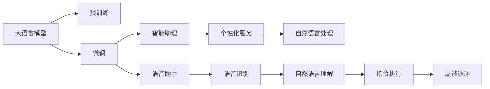

                 

# LLM驱动的个人助理：超越Siri和Alexa

> 关键词：大语言模型,微调,智能助理,语音助手,个性化服务,自然语言处理,人机交互,自然语言理解

## 1. 背景介绍

### 1.1 问题由来

在智能设备日益普及的今天，个人助理（Personal Assistant）作为提升用户生活便捷性和智能化水平的利器，越来越受到人们的青睐。从最初的简单指令交互，到如今集成了语音识别、图像识别、信息检索等多种智能功能的语音助手，个人助理的发展历程展现了人工智能技术不断进步的魅力。

然而，目前市面上流行的语音助手如苹果的Siri、亚马逊的Alexa，仍存在一些不足：

- 功能有限：多以指令式交互为主，对于复杂的自然语言处理能力相对薄弱。
- 依赖环境：通常需要联网环境，数据获取和处理能力受限。
- 服务单一：多数功能是预先定义好的，难以根据用户个性化需求进行动态调整。

为解决这些问题，研究人员和工程师正在探索新的技术路径，以期打造更加智能、灵活、个性化的个人助理。本文章将重点介绍基于大语言模型（LLM, Large Language Model）的个人助理开发方法，探讨其如何通过微调技术，超越传统语音助手的性能界限。

## 2. 核心概念与联系

### 2.1 核心概念概述

本节将介绍几个核心概念，并阐述它们之间的联系：

- **大语言模型（LLM）**：一种深度学习模型，通过在大规模文本数据上预训练，获得强大的自然语言处理能力。常用的LLM模型包括GPT-3、BERT、T5等。
- **微调（Fine-tuning）**：在预训练模型的基础上，使用下游任务的标注数据进行有监督训练，以适应特定任务。微调是实现LLM在特定领域优化的重要手段。
- **智能助理（Smart Assistant）**：一种能够理解和执行自然语言指令，提供个性化服务的智能软件系统。智能助理通常集成在智能手机、智能音箱、智能家居等设备中。
- **语音助手（Voice Assistant）**：基于语音识别和自然语言处理技术，提供语音交互功能的智能助理。如Siri、Alexa等。
- **个性化服务（Personalization）**：智能助理通过分析用户行为和偏好，提供定制化的内容和服务，提升用户体验。
- **自然语言处理（Natural Language Processing, NLP）**：一种使计算机能够理解、处理和生成人类自然语言的技术。包括语音识别、文本分析、机器翻译、情感分析等多种应用。
- **人机交互（Human-Computer Interaction, HCI）**：研究如何让计算机和人类更自然、高效地进行互动。个人助理的开发需要结合HCI技术，提升用户体验和系统可用性。

这些概念通过预训练和微调技术紧密联系起来。大语言模型提供了一种通用的自然语言处理能力，微调则用于将这一能力适应特定的个人助理应用场景，实现更加智能、个性化的服务。

### 2.2 核心概念原理和架构的 Mermaid 流程图



这个流程图展示了各个概念之间的逻辑关系：

1. 大语言模型通过大规模数据预训练，获得通用的语言理解能力。
2. 微调将这一通用能力适配到特定任务（如智能助理、语音助手），提升模型的性能。
3. 智能助理通过微调后的模型，实现自然语言理解与指令执行。
4. 语音助手基于语音识别和自然语言处理技术，与用户进行交互。
5. 个性化服务通过分析用户行为，提供定制化的内容。
6. 自然语言处理和语音识别技术使得计算机能够理解人类语言。
7. 指令执行和反馈循环确保系统能够响应用户需求并不断优化服务质量。

## 3. 核心算法原理 & 具体操作步骤

### 3.1 算法原理概述

基于大语言模型（LLM）的个人助理，其核心原理是利用预训练语言模型在特定下游任务上的微调。通常，LLM在通用语料库上进行大规模无监督预训练，形成广泛的语言知识。然后，针对特定任务（如语音识别、信息检索、智能问答等），通过微调更新部分参数，使得模型能够处理该任务，并实现个性化的服务。

微调的数学原理基于有监督学习，目标是最小化损失函数：

$$
\min_{\theta} \mathcal{L}(\theta; D^{\text{task}})
$$

其中，$\theta$ 是模型的参数，$D^{\text{task}}$ 是任务数据集，$\mathcal{L}$ 是任务损失函数。常见的损失函数包括交叉熵损失、均方误差损失等。

### 3.2 算法步骤详解

基于LLM的个人助理开发包括以下几个关键步骤：

**Step 1: 准备预训练模型和数据集**
- 选择合适的预训练语言模型 $M_{\theta}$ 作为初始化参数，如 BERT、GPT-3等。
- 准备下游任务 $T$ 的标注数据集 $D=\{(x_i, y_i)\}_{i=1}^N$，划分为训练集、验证集和测试集。一般要求标注数据与预训练数据的分布不要差异过大。

**Step 2: 添加任务适配层**
- 根据任务类型，在预训练模型顶层设计合适的输出层和损失函数。
- 对于分类任务，通常在顶层添加线性分类器和交叉熵损失函数。
- 对于生成任务，通常使用语言模型的解码器输出概率分布，并以负对数似然为损失函数。

**Step 3: 设置微调超参数**
- 选择合适的优化算法及其参数，如 AdamW、SGD 等，设置学习率、批大小、迭代轮数等。
- 设置正则化技术及强度，包括权重衰减、Dropout、Early Stopping等。
- 确定冻结预训练参数的策略，如仅微调顶层，或全部参数都参与微调。

**Step 4: 执行梯度训练**
- 将训练集数据分批次输入模型，前向传播计算损失函数。
- 反向传播计算参数梯度，根据设定的优化算法和学习率更新模型参数。
- 周期性在验证集上评估模型性能，根据性能指标决定是否触发 Early Stopping。
- 重复上述步骤直到满足预设的迭代轮数或 Early Stopping 条件。

**Step 5: 测试和部署**
- 在测试集上评估微调后模型 $M_{\hat{\theta}}$ 的性能，对比微调前后的精度提升。
- 使用微调后的模型对新样本进行推理预测，集成到实际的应用系统中。
- 持续收集新的数据，定期重新微调模型，以适应数据分布的变化。

### 3.3 算法优缺点

基于LLM的个人助理具有以下优点：

- **广泛的语言理解能力**：预训练语言模型通过大规模数据学习到丰富的语言知识，使其能够理解多种语言和语境。
- **灵活的适应性**：微调过程可以根据不同的任务需求，灵活调整模型参数，提升服务性能。
- **高效的个性化服务**：结合自然语言处理和机器学习技术，可以实现个性化的推荐和内容生成。
- **自然流畅的交互体验**：通过语音识别和自然语言理解技术，提升人机交互的自然性和实时性。

同时，该方法也存在一定的局限性：

- **依赖标注数据**：微调效果很大程度上取决于标注数据的质量和数量，获取高质量标注数据的成本较高。
- **计算资源消耗大**：预训练语言模型参数量巨大，微调过程需要大量计算资源。
- **鲁棒性不足**：模型可能对输入的微小变化敏感，对特定噪声和干扰的鲁棒性有待提升。
- **可解释性差**：微调后的模型往往是一个"黑盒"，其决策过程缺乏可解释性。
- **隐私和伦理问题**：在处理个人数据时，必须注意隐私保护和伦理道德问题。

尽管存在这些局限性，但就目前而言，基于LLM的个人助理仍是大语言模型应用的重要范式。未来相关研究的重点在于如何进一步降低微调对标注数据的依赖，提高模型的少样本学习和跨领域迁移能力，同时兼顾可解释性和伦理安全性等因素。

### 3.4 算法应用领域

基于大语言模型（LLM）的个人助理已经在多个领域得到应用，例如：

- **智能家居管理**：实现对家中的各种设备进行控制，如灯光、温度、安全等。通过语音交互和自然语言处理，提升家居智能化水平。
- **个性化信息推荐**：根据用户的浏览历史和兴趣偏好，推荐新闻、音乐、视频等内容。结合自然语言处理技术，进行内容生成和匹配。
- **医疗健康咨询**：提供医学知识查询、症状分析、健康管理等服务。结合自然语言处理和机器学习技术，提供个性化的健康建议。
- **金融理财顾问**：提供投资建议、财务规划、市场分析等服务。结合自然语言处理技术，生成个性化的理财方案。
- **教育培训辅导**：根据学生的学习进度和理解能力，提供个性化的学习资源和辅导建议。结合自然语言处理技术，进行智能批改和知识点推荐。
- **车载导航系统**：提供路线规划、语音导航、实时路况等服务。结合自然语言处理技术，提升用户体验和系统智能化。

除了上述这些应用领域外，LLM驱动的个人助理还被创新性地应用于更多场景中，如可控文本生成、情感分析、对话系统等，为人们的日常生活和工作带来了新的便利和高效。

## 4. 数学模型和公式 & 详细讲解  
### 4.1 数学模型构建

本节将使用数学语言对基于大语言模型（LLM）的个人助理开发过程进行更加严格的刻画。

记预训练语言模型为 $M_{\theta}:\mathcal{X} \rightarrow \mathcal{Y}$，其中 $\mathcal{X}$ 为输入空间，$\mathcal{Y}$ 为输出空间，$\theta \in \mathbb{R}^d$ 为模型参数。假设微调任务的训练集为 $D=\{(x_i,y_i)\}_{i=1}^N, x_i \in \mathcal{X}, y_i \in \mathcal{Y}$。

定义模型 $M_{\theta}$ 在数据样本 $(x,y)$ 上的损失函数为 $\ell(M_{\theta}(x),y)$，则在数据集 $D$ 上的经验风险为：

$$
\mathcal{L}(\theta) = \frac{1}{N} \sum_{i=1}^N \ell(M_{\theta}(x_i),y_i)
$$

微调的优化目标是最小化经验风险，即找到最优参数：

$$
\theta^* = \mathop{\arg\min}_{\theta} \mathcal{L}(\theta)
$$

在实践中，我们通常使用基于梯度的优化算法（如SGD、Adam等）来近似求解上述最优化问题。设 $\eta$ 为学习率，$\lambda$ 为正则化系数，则参数的更新公式为：

$$
\theta \leftarrow \theta - \eta \nabla_{\theta}\mathcal{L}(\theta) - \eta\lambda\theta
$$

其中 $\nabla_{\theta}\mathcal{L}(\theta)$ 为损失函数对参数 $\theta$ 的梯度，可通过反向传播算法高效计算。

### 4.2 公式推导过程

以下我们以分类任务为例，推导交叉熵损失函数及其梯度的计算公式。

假设模型 $M_{\theta}$ 在输入 $x$ 上的输出为 $\hat{y}=M_{\theta}(x) \in [0,1]$，表示样本属于正类的概率。真实标签 $y \in \{0,1\}$。则二分类交叉熵损失函数定义为：

$$
\ell(M_{\theta}(x),y) = -[y\log \hat{y} + (1-y)\log (1-\hat{y})]
$$

将其代入经验风险公式，得：

$$
\mathcal{L}(\theta) = -\frac{1}{N}\sum_{i=1}^N [y_i\log M_{\theta}(x_i)+(1-y_i)\log(1-M_{\theta}(x_i))]
$$

根据链式法则，损失函数对参数 $\theta_k$ 的梯度为：

$$
\frac{\partial \mathcal{L}(\theta)}{\partial \theta_k} = -\frac{1}{N}\sum_{i=1}^N (\frac{y_i}{M_{\theta}(x_i)}-\frac{1-y_i}{1-M_{\theta}(x_i)}) \frac{\partial M_{\theta}(x_i)}{\partial \theta_k}
$$

其中 $\frac{\partial M_{\theta}(x_i)}{\partial \theta_k}$ 可进一步递归展开，利用自动微分技术完成计算。

在得到损失函数的梯度后，即可带入参数更新公式，完成模型的迭代优化。重复上述过程直至收敛，最终得到适应下游任务的最优模型参数 $\theta^*$。

## 5. 项目实践：代码实例和详细解释说明
### 5.1 开发环境搭建

在进行LLM个人助理的微调实践前，我们需要准备好开发环境。以下是使用Python进行PyTorch开发的环境配置流程：

1. 安装Anaconda：从官网下载并安装Anaconda，用于创建独立的Python环境。

2. 创建并激活虚拟环境：
```bash
conda create -n pytorch-env python=3.8 
conda activate pytorch-env
```

3. 安装PyTorch：根据CUDA版本，从官网获取对应的安装命令。例如：
```bash
conda install pytorch torchvision torchaudio cudatoolkit=11.1 -c pytorch -c conda-forge
```

4. 安装Transformers库：
```bash
pip install transformers
```

5. 安装各类工具包：
```bash
pip install numpy pandas scikit-learn matplotlib tqdm jupyter notebook ipython
```

完成上述步骤后，即可在`pytorch-env`环境中开始微调实践。

### 5.2 源代码详细实现

下面我们以命名实体识别(NER)任务为例，给出使用Transformers库对BERT模型进行微调的PyTorch代码实现。

首先，定义NER任务的数据处理函数：

```python
from transformers import BertTokenizer
from torch.utils.data import Dataset
import torch

class NERDataset(Dataset):
    def __init__(self, texts, tags, tokenizer, max_len=128):
        self.texts = texts
        self.tags = tags
        self.tokenizer = tokenizer
        self.max_len = max_len
        
    def __len__(self):
        return len(self.texts)
    
    def __getitem__(self, item):
        text = self.texts[item]
        tags = self.tags[item]
        
        encoding = self.tokenizer(text, return_tensors='pt', max_length=self.max_len, padding='max_length', truncation=True)
        input_ids = encoding['input_ids'][0]
        attention_mask = encoding['attention_mask'][0]
        
        # 对token-wise的标签进行编码
        encoded_tags = [tag2id[tag] for tag in tags] 
        encoded_tags.extend([tag2id['O']] * (self.max_len - len(encoded_tags)))
        labels = torch.tensor(encoded_tags, dtype=torch.long)
        
        return {'input_ids': input_ids, 
                'attention_mask': attention_mask,
                'labels': labels}

# 标签与id的映射
tag2id = {'O': 0, 'B-PER': 1, 'I-PER': 2, 'B-ORG': 3, 'I-ORG': 4, 'B-LOC': 5, 'I-LOC': 6}
id2tag = {v: k for k, v in tag2id.items()}

# 创建dataset
tokenizer = BertTokenizer.from_pretrained('bert-base-cased')

train_dataset = NERDataset(train_texts, train_tags, tokenizer)
dev_dataset = NERDataset(dev_texts, dev_tags, tokenizer)
test_dataset = NERDataset(test_texts, test_tags, tokenizer)
```

然后，定义模型和优化器：

```python
from transformers import BertForTokenClassification, AdamW

model = BertForTokenClassification.from_pretrained('bert-base-cased', num_labels=len(tag2id))

optimizer = AdamW(model.parameters(), lr=2e-5)
```

接着，定义训练和评估函数：

```python
from torch.utils.data import DataLoader
from tqdm import tqdm
from sklearn.metrics import classification_report

device = torch.device('cuda') if torch.cuda.is_available() else torch.device('cpu')
model.to(device)

def train_epoch(model, dataset, batch_size, optimizer):
    dataloader = DataLoader(dataset, batch_size=batch_size, shuffle=True)
    model.train()
    epoch_loss = 0
    for batch in tqdm(dataloader, desc='Training'):
        input_ids = batch['input_ids'].to(device)
        attention_mask = batch['attention_mask'].to(device)
        labels = batch['labels'].to(device)
        model.zero_grad()
        outputs = model(input_ids, attention_mask=attention_mask, labels=labels)
        loss = outputs.loss
        epoch_loss += loss.item()
        loss.backward()
        optimizer.step()
    return epoch_loss / len(dataloader)

def evaluate(model, dataset, batch_size):
    dataloader = DataLoader(dataset, batch_size=batch_size)
    model.eval()
    preds, labels = [], []
    with torch.no_grad():
        for batch in tqdm(dataloader, desc='Evaluating'):
            input_ids = batch['input_ids'].to(device)
            attention_mask = batch['attention_mask'].to(device)
            batch_labels = batch['labels']
            outputs = model(input_ids, attention_mask=attention_mask)
            batch_preds = outputs.logits.argmax(dim=2).to('cpu').tolist()
            batch_labels = batch_labels.to('cpu').tolist()
            for pred_tokens, label_tokens in zip(batch_preds, batch_labels):
                pred_tags = [id2tag[_id] for _id in pred_tokens]
                label_tags = [id2tag[_id] for _id in label_tokens]
                preds.append(pred_tags[:len(label_tags)])
                labels.append(label_tags)
                
    print(classification_report(labels, preds))
```

最后，启动训练流程并在测试集上评估：

```python
epochs = 5
batch_size = 16

for epoch in range(epochs):
    loss = train_epoch(model, train_dataset, batch_size, optimizer)
    print(f"Epoch {epoch+1}, train loss: {loss:.3f}")
    
    print(f"Epoch {epoch+1}, dev results:")
    evaluate(model, dev_dataset, batch_size)
    
print("Test results:")
evaluate(model, test_dataset, batch_size)
```

以上就是使用PyTorch对BERT进行命名实体识别任务微调的完整代码实现。可以看到，得益于Transformers库的强大封装，我们可以用相对简洁的代码完成BERT模型的加载和微调。

### 5.3 代码解读与分析

让我们再详细解读一下关键代码的实现细节：

**NERDataset类**：
- `__init__`方法：初始化文本、标签、分词器等关键组件。
- `__len__`方法：返回数据集的样本数量。
- `__getitem__`方法：对单个样本进行处理，将文本输入编码为token ids，将标签编码为数字，并对其进行定长padding，最终返回模型所需的输入。

**tag2id和id2tag字典**：
- 定义了标签与数字id之间的映射关系，用于将token-wise的预测结果解码回真实的标签。

**训练和评估函数**：
- 使用PyTorch的DataLoader对数据集进行批次化加载，供模型训练和推理使用。
- 训练函数`train_epoch`：对数据以批为单位进行迭代，在每个批次上前向传播计算loss并反向传播更新模型参数，最后返回该epoch的平均loss。
- 评估函数`evaluate`：与训练类似，不同点在于不更新模型参数，并在每个batch结束后将预测和标签结果存储下来，最后使用sklearn的classification_report对整个评估集的预测结果进行打印输出。

**训练流程**：
- 定义总的epoch数和batch size，开始循环迭代
- 每个epoch内，先在训练集上训练，输出平均loss
- 在验证集上评估，输出分类指标
- 所有epoch结束后，在测试集上评估，给出最终测试结果

可以看到，PyTorch配合Transformers库使得BERT微调的代码实现变得简洁高效。开发者可以将更多精力放在数据处理、模型改进等高层逻辑上，而不必过多关注底层的实现细节。

当然，工业级的系统实现还需考虑更多因素，如模型的保存和部署、超参数的自动搜索、更灵活的任务适配层等。但核心的微调范式基本与此类似。

## 6. 实际应用场景
### 6.1 智能家居管理

基于大语言模型的个人助理，可以实现对家中的各种设备进行控制，如灯光、温度、安全等。通过语音交互和自然语言处理，提升家居智能化水平。

例如，用户可以通过语音指令控制家中的智能设备，如“打开客厅的灯”、“调高卧室的温度”、“开启安防系统”等。基于微调的智能助理能够理解并执行这些复杂的自然语言指令，通过与设备厂商的API接口，控制相应的设备。此外，智能助理还可以通过学习用户的行为和偏好，自动推荐最优的调节方案，如根据天气预报推荐窗帘开合角度，根据光线强度调节灯光亮度等。

### 6.2 个性化信息推荐

基于大语言模型的个人助理，能够根据用户的浏览历史和兴趣偏好，推荐新闻、音乐、视频等内容。结合自然语言处理技术，进行内容生成和匹配。

例如，用户浏览过某些新闻、观看过某些视频、听过某些音乐，智能助理能够识别出用户的兴趣点，并推荐类似内容。如果用户对某个内容感兴趣，智能助理还可以生成类似的推荐，如推荐同一作者的其他文章，推荐相似主题的视频等。通过持续学习和反馈，智能助理能够不断优化推荐算法，提升用户体验。

### 6.3 医疗健康咨询

基于大语言模型的个人助理，提供医学知识查询、症状分析、健康管理等服务。结合自然语言处理和机器学习技术，提供个性化的健康建议。

例如，用户可以咨询“如何预防新冠病毒”、“感冒症状如何治疗”等健康问题，智能助理能够根据用户输入的描述，进行症状分析，提供相应的健康建议。智能助理还可以通过与医疗知识库的接口，获取最新的医学研究信息和疾病预警。通过与用户的持续互动，智能助理能够更好地理解用户的需求，提供更加个性化的健康咨询服务。

### 6.4 金融理财顾问

基于大语言模型的个人助理，提供投资建议、财务规划、市场分析等服务。结合自然语言处理技术，生成个性化的理财方案。

例如，用户可以咨询“如何制定投资组合”、“如何优化财务预算”等理财问题，智能助理能够根据用户的财务状况和风险偏好，提供个性化的理财建议。智能助理还可以通过分析市场趋势和经济指标，提供实时的投资分析报告。通过与用户的持续互动，智能助理能够更好地理解用户的理财需求，提供更加个性化的理财咨询服务。

### 6.5 教育培训辅导

基于大语言模型的个人助理，根据学生的学习进度和理解能力，提供个性化的学习资源和辅导建议。结合自然语言处理技术，进行智能批改和知识点推荐。

例如，学生在完成作业后，可以上传作业内容，智能助理能够自动进行批改，并根据学生的错误情况，提供针对性的知识点讲解和习题推荐。智能助理还可以通过分析学生的学习进度和表现，提供个性化的学习计划和建议。通过与学生的持续互动，智能助理能够更好地理解学生的学习需求，提供更加个性化的教育咨询服务。

## 7. 工具和资源推荐
### 7.1 学习资源推荐

为了帮助开发者系统掌握大语言模型（LLM）微调的理论基础和实践技巧，这里推荐一些优质的学习资源：

1. 《Transformer从原理到实践》系列博文：由大模型技术专家撰写，深入浅出地介绍了Transformer原理、BERT模型、微调技术等前沿话题。

2. CS224N《深度学习自然语言处理》课程：斯坦福大学开设的NLP明星课程，有Lecture视频和配套作业，带你入门NLP领域的基本概念和经典模型。

3. 《Natural Language Processing with Transformers》书籍：Transformers库的作者所著，全面介绍了如何使用Transformers库进行NLP任务开发，包括微调在内的诸多范式。

4. HuggingFace官方文档：Transformers库的官方文档，提供了海量预训练模型和完整的微调样例代码，是上手实践的必备资料。

5. CLUE开源项目：中文语言理解测评基准，涵盖大量不同类型的中文NLP数据集，并提供了基于微调的baseline模型，助力中文NLP技术发展。

通过对这些资源的学习实践，相信你一定能够快速掌握大语言模型微调的精髓，并用于解决实际的NLP问题。
###  7.2 开发工具推荐

高效的开发离不开优秀的工具支持。以下是几款用于大语言模型微调开发的常用工具：

1. PyTorch：基于Python的开源深度学习框架，灵活动态的计算图，适合快速迭代研究。大部分预训练语言模型都有PyTorch版本的实现。

2. TensorFlow：由Google主导开发的开源深度学习框架，生产部署方便，适合大规模工程应用。同样有丰富的预训练语言模型资源。

3. Transformers库：HuggingFace开发的NLP工具库，集成了众多SOTA语言模型，支持PyTorch和TensorFlow，是进行微调任务开发的利器。

4. Weights & Biases：模型训练的实验跟踪工具，可以记录和可视化模型训练过程中的各项指标，方便对比和调优。与主流深度学习框架无缝集成。

5. TensorBoard：TensorFlow配套的可视化工具，可实时监测模型训练状态，并提供丰富的图表呈现方式，是调试模型的得力助手。

6. Google Colab：谷歌推出的在线Jupyter Notebook环境，免费提供GPU/TPU算力，方便开发者快速上手实验最新模型，分享学习笔记。

合理利用这些工具，可以显著提升大语言模型微调任务的开发效率，加快创新迭代的步伐。

### 7.3 相关论文推荐

大语言模型和微调技术的发展源于学界的持续研究。以下是几篇奠基性的相关论文，推荐阅读：

1. Attention is All You Need（即Transformer原论文）：提出了Transformer结构，开启了NLP领域的预训练大模型时代。

2. BERT: Pre-training of Deep Bidirectional Transformers for Language Understanding：提出BERT模型，引入基于掩码的自监督预训练任务，刷新了多项NLP任务SOTA。

3. Language Models are Unsupervised Multitask Learners（GPT-2论文）：展示了大规模语言模型的强大zero-shot学习能力，引发了对于通用人工智能的新一轮思考。

4. Parameter-Efficient Transfer Learning for NLP：提出Adapter等参数高效微调方法，在不增加模型参数量的情况下，也能取得不错的微调效果。

5. Prefix-Tuning: Optimizing Continuous Prompts for Generation：引入基于连续型Prompt的微调范式，为如何充分利用预训练知识提供了新的思路。

6. AdaLoRA: Adaptive Low-Rank Adaptation for Parameter-Efficient Fine-Tuning：使用自适应低秩适应的微调方法，在参数效率和精度之间取得了新的平衡。

这些论文代表了大语言模型微调技术的发展脉络。通过学习这些前沿成果，可以帮助研究者把握学科前进方向，激发更多的创新灵感。

## 8. 总结：未来发展趋势与挑战

### 8.1 总结

本文对基于大语言模型（LLM）的个人助理开发方法进行了全面系统的介绍。首先阐述了LLM和微调技术的研究背景和意义，明确了LLM在智能助理应用场景中的重要性。其次，从原理到实践，详细讲解了LLM在微调过程中的数学原理和关键步骤，给出了微调任务开发的完整代码实例。同时，本文还广泛探讨了LLM在智能家居、信息推荐、健康咨询、理财顾问、教育辅导等多个领域的应用前景，展示了LLM驱动的个人助理的强大潜力。此外，本文精选了微调技术的各类学习资源，力求为读者提供全方位的技术指引。

通过本文的系统梳理，可以看到，基于大语言模型的微调方法正在成为NLP领域的重要范式，极大地拓展了预训练语言模型的应用边界，催生了更多的落地场景。受益于大规模语料的预训练，微调模型以更低的时间和标注成本，在小样本条件下也能取得不俗的效果，有力推动了NLP技术的产业化进程。未来，伴随预训练语言模型和微调方法的持续演进，相信NLP技术将在更广阔的应用领域大放异彩，深刻影响人类的生产生活方式。

### 8.2 未来发展趋势

展望未来，大语言模型微调技术将呈现以下几个发展趋势：

1. **模型规模持续增大**。随着算力成本的下降和数据规模的扩张，预训练语言模型参数量还将持续增长。超大规模语言模型蕴含的丰富语言知识，有望支撑更加复杂多变的下游任务微调。

2. **微调方法日趋多样**。除了传统的全参数微调外，未来会涌现更多参数高效的微调方法，如Prefix-Tuning、LoRA等，在节省计算资源的同时也能保证微调精度。

3. **持续学习成为常态**。随着数据分布的不断变化，微调模型也需要持续学习新知识以保持性能。如何在不遗忘原有知识的同时，高效吸收新样本信息，将成为重要的研究课题。

4. **标注样本需求降低**。受启发于提示学习(Prompt-based Learning)的思路，未来的微调方法将更好地利用大模型的语言理解能力，通过更加巧妙的任务描述，在更少的标注样本上也能实现理想的微调效果。

5. **多模态微调崛起**。当前的微调主要聚焦于纯文本数据，未来会进一步拓展到图像、视频、语音等多模态数据微调。多模态信息的融合，将显著提升语言模型对现实世界的理解和建模能力。

6. **模型通用性增强**。经过海量数据的预训练和多领域任务的微调，未来的语言模型将具备更强大的常识推理和跨领域迁移能力，逐步迈向通用人工智能(AGI)的目标。

以上趋势凸显了大语言模型微调技术的广阔前景。这些方向的探索发展，必将进一步提升NLP系统的性能和应用范围，为人类认知智能的进化带来深远影响。

### 8.3 面临的挑战

尽管大语言模型微调技术已经取得了瞩目成就，但在迈向更加智能化、普适化应用的过程中，它仍面临着诸多挑战：

1. **标注成本瓶颈**。虽然微调大大降低了标注数据的需求，但对于长尾应用场景，难以获得充足的高质量标注数据，成为制约微调性能的瓶颈。如何进一步降低微调对标注样本的依赖，将是一大难题。

2. **模型鲁棒性不足**。当前微调模型面对域外数据时，泛化性能往往大打折扣。对于测试样本的微小扰动，微调模型的预测也容易发生波动。如何提高微调模型的鲁棒性，避免灾难性遗忘，还需要更多理论和实践的积累。

3. **推理效率有待提高**。大规模语言模型虽然精度高，但在实际部署时往往面临推理速度慢、内存占用大等效率问题。如何在保证性能的同时，简化模型结构，提升推理速度，优化资源占用，将是重要的优化方向。

4. **可解释性亟需加强**。当前微调模型更像是"黑盒"系统，难以解释其内部工作机制和决策逻辑。对于医疗、金融等高风险应用，算法的可解释性和可审计性尤为重要。如何赋予微调模型更强的可解释性，将是亟待攻克的难题。

5. **安全性有待保障**。预训练语言模型难免会学习到有偏见、有害的信息，通过微调传递到下游任务，产生误导性、歧视性的输出，给实际应用带来安全隐患。如何从数据和算法层面消除模型偏见，避免恶意用途，确保输出的安全性，也将是重要的研究课题。

6. **知识整合能力不足**。现有的微调模型往往局限于任务内数据，难以灵活吸收和运用更广泛的先验知识。如何让微调过程更好地与外部知识库、规则库等专家知识结合，形成更加全面、准确的信息整合能力，还有很大的想象空间。

正视微调面临的这些挑战，积极应对并寻求突破，将是大语言模型微调走向成熟的必由之路。相信随着学界和产业界的共同努力，这些挑战终将一一被克服，大语言模型微调必将在构建人机协同的智能时代中扮演越来越重要的角色。

### 8.4 研究展望

面对大语言模型微调所面临的种种挑战，未来的研究需要在以下几个方面寻求新的突破：

1. **探索无监督和半监督微调方法**。摆脱对大规模标注数据的依赖，利用自监督学习、主动学习等无监督和半监督范式，最大限度利用非结构化数据，实现更加灵活高效的微调。

2. **研究参数高效和计算高效的微调范式**。开发更加参数高效的微调方法，在固定大部分预训练参数的同时，只更新极少量的任务相关参数。同时优化微调模型的计算图，减少前向传播和反向传播的资源消耗，实现更加轻量级、实时性的部署。

3. **融合因果和对比学习范式**。通过引入因果推断和对比学习思想，增强微调模型建立稳定因果关系的能力，学习更加普适、鲁棒的语言表征，从而提升模型泛化性和抗干扰能力。

4. **引入更多先验知识**。将符号化的先验知识，如知识图谱、逻辑规则等，与神经网络模型进行巧妙融合，引导微调过程学习更准确、合理的语言模型。同时加强不同模态数据的整合，实现视觉、语音等多模态信息与文本信息的协同建模。

5. **结合因果分析和博弈论工具**。将因果分析方法引入微调模型，识别出模型决策的关键特征，增强输出解释的因果性和逻辑性。借助博弈论工具刻画人机交互过程，主动探索并规避模型的脆弱点，提高系统稳定性。

6. **纳入伦理道德约束**。在模型训练目标中引入伦理导向的评估指标，过滤和惩罚有偏见、有害的输出倾向。同时加强人工干预和审核，建立模型行为的监管机制，确保输出符合人类价值观和伦理道德。

这些研究方向的探索，必将引领大语言模型微调技术迈向更高的台阶，为构建安全、可靠、可解释、可控的智能系统铺平道路。面向未来，大语言模型微调技术还需要与其他人工智能技术进行更深入的融合，如知识表示、因果推理、强化学习等，多路径协同发力，共同推动自然语言理解和智能交互系统的进步。只有勇于创新、敢于突破，才能不断拓展语言模型的边界，让智能技术更好地造福人类社会。

## 9. 附录：常见问题与解答

**Q1：大语言模型微调是否适用于所有NLP任务？**

A: 大语言模型微调在大多数NLP任务上都能取得不错的效果，特别是对于数据量较小的任务。但对于一些特定领域的任务，如医学、法律等，仅仅依靠通用语料预训练的模型可能难以很好地适应。此时需要在特定领域语料上进一步预训练，再进行微调，才能获得理想效果。此外，对于一些需要时效性、个性化很强的任务，如对话、推荐等，微调方法也需要针对性的改进优化。

**Q2：微调过程中如何选择合适的学习率？**

A: 微调的学习率一般要比预训练时小1-2个数量级，如果使用过大的学习率，容易破坏预训练权重，导致过拟合。一般建议从1e-5开始调参，逐步减小学习率，直至收敛。也可以使用warmup策略，在开始阶段使用较小的学习率，再逐渐过渡到预设值。需要注意的是，不同的优化器(如AdamW、Adafactor等)以及不同的学习率调度策略，可能需要设置不同的学习率阈值。

**Q3：采用大语言模型微调时会面临哪些资源瓶颈？**

A: 目前主流的预训练大模型动辄以亿计的参数规模，对算力、内存、存储都提出了很高的要求。GPU/TPU等高性能设备是必不可少的，但即便如此，超大批次的训练和推理也可能遇到显存不足的问题。因此需要采用一些资源优化技术，如梯度积累、混合精度训练、模型并行等，来突破硬件瓶颈。同时，模型的存储和读取也可能占用大量时间和空间，需要采用模型压缩、稀疏化存储等方法进行优化。

**Q4：如何缓解微调过程中的过拟合问题？**

A: 过拟合是微调面临的主要挑战，尤其是在标注数据不足的情况下。常见的缓解策略包括：
1. 数据增强：通过回译、近义替换等方式扩充训练集
2. 正则化：使用L2正则、Dropout、Early Stopping等避免过拟合
3. 对抗训练：引入对抗样本，提高模型鲁棒性
4. 参数高效微调：只调整少量参数(如Adapter、Prefix等)，减小过拟合风险
5. 多模型集成：训练多个微调模型，取平均输出，抑制过拟合

这些策略往往需要根据具体任务和数据特点进行灵活组合。只有在数据、模型、训练、推理等各环节进行全面优化，才能最大限度地发挥大语言模型微调的威力。

**Q5：微调模型在落地部署时需要注意哪些问题？**

A: 将微调模型转化为实际应用，还需要考虑以下因素：
1. 模型裁剪：去除不必要的层和参数，减小模型尺寸，加快推理速度
2. 量化加速：将浮点模型转为定点模型，压缩存储空间，提高计算效率
3. 服务化封装：将模型封装为标准化服务接口，便于集成调用
4. 弹性伸缩：根据请求流量动态调整资源配置，平衡服务质量和成本
5. 监控告警：实时采集系统指标，设置异常告警阈值，确保服务稳定性
6. 安全防护：采用访问鉴权、数据脱敏等措施，保障数据和模型安全

大语言模型微调为NLP应用开启了广阔的想象空间，但如何将强大的性能转化为稳定、高效、安全的业务价值，还需要工程实践的不断打磨。唯有从数据、算法、工程、业务等多个维度协同发力，才能真正实现人工智能技术在垂直行业的规模化落地。总之，微调需要开发者根据具体任务，不断迭代和优化模型、数据和算法，方能得到理想的效果。

