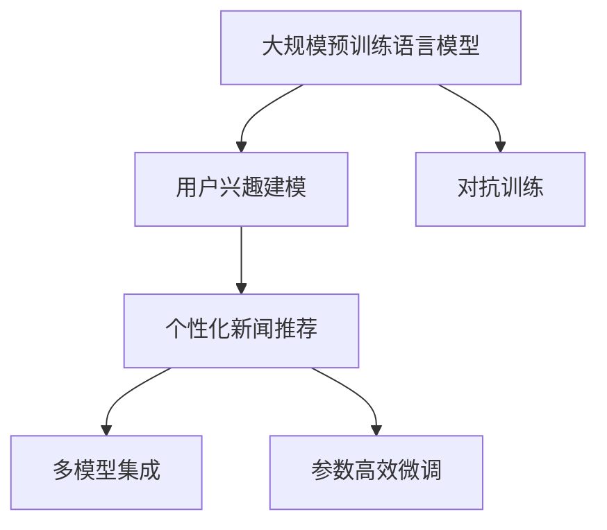

                 

# LLM驱动的个性化新闻推荐系统

## 1. 背景介绍

### 1.1 问题由来

随着互联网的迅猛发展和数字媒体的广泛应用，用户获取信息的方式日益多样，新闻推荐系统成为了智能信息服务的重要组成部分。然而，传统的新闻推荐算法大多基于用户历史行为进行推荐，难以覆盖用户广泛的兴趣点。同时，用户兴趣随时间动态变化，如何适应用户兴趣的长期变化，也是传统推荐算法面临的挑战。

近年，基于深度学习的大规模预训练语言模型（Large Language Models, LLMs）在NLP领域取得了显著进展，并被广泛应用到各种自然语言处理任务中。在大规模语料上进行预训练后，LLMs具备了强大的语言理解和生成能力，能够通过自然语言描述学习到用户的多样化兴趣点，为个性化新闻推荐提供新的技术路径。

### 1.2 问题核心关键点

本节将详细阐述LLMs在个性化新闻推荐系统中的核心应用，并介绍其核心技术点：

1. 使用预训练语言模型进行用户兴趣建模，学习用户的多样化兴趣点。
2. 设计基于用户的个性化新闻推荐模型，融合LLMs的强大语言能力和用户行为数据，进行高精度的个性化推荐。
3. 探索多模型集成和参数高效微调等先进技术，提升推荐系统的效果和效率。
4. 讨论LLMs在个性化新闻推荐中的实际应用场景和挑战，展望未来发展方向。

通过深入理解这些关键点，可以更好地掌握LLMs在个性化新闻推荐系统中的作用和潜力。

## 2. 核心概念与联系

### 2.1 核心概念概述

为深入理解LLMs在个性化新闻推荐系统中的应用，本节将介绍几个密切相关的核心概念：

- **大规模预训练语言模型（LLMs）**：指通过在大规模无标签文本语料上进行预训练，学习到丰富的语言知识和通用表示的语言模型。常见的预训练模型如BERT、GPT等。
- **用户兴趣建模**：指通过自然语言描述，学习用户的多样化兴趣点，构建用户兴趣模型。
- **个性化新闻推荐**：指根据用户兴趣模型，为用户推荐符合其个性化需求的新闻内容。
- **多模型集成**：指在个性化新闻推荐模型中，融合多个预训练模型的输出，提升推荐效果。
- **参数高效微调（PEFT）**：指在微调过程中，只更新少量的模型参数，以提高微调效率，避免过拟合。
- **对抗训练**：指加入对抗样本，提高模型鲁棒性，避免模型泛化到特定领域。

这些核心概念通过以下Mermaid流程图来展示其联系：



这个流程图展示了大语言模型在个性化新闻推荐系统中的核心应用：

1. 通过预训练获得语言知识，用于用户兴趣建模。
2. 设计个性化推荐模型，融合用户兴趣模型和预训练知识。
3. 采用多模型集成和参数高效微调等技术，提升推荐效果。
4. 对抗训练用于提升模型的鲁棒性，避免模型泛化到特定领域。

## 3. 核心算法原理 & 具体操作步骤
### 3.1 算法原理概述

LLMs驱动的个性化新闻推荐系统，本质上是一个深度学习驱动的个性化推荐系统。其核心思想是：利用预训练语言模型学习用户的多样化兴趣点，并将其与用户历史行为数据融合，通过有监督的微调过程，生成个性化的新闻推荐。

形式化地，假设预训练语言模型为 $M_{\theta}$，其中 $\theta$ 为预训练得到的模型参数。用户兴趣模型为 $I(u)$，其中 $u$ 为用户兴趣描述。用户历史行为数据为 $D_{hist}(u)$。假设新闻内容集合为 $\mathcal{N}$，新闻内容与用户兴趣的相关度为 $r(n,u)$。则个性化新闻推荐问题可以表示为：

$$
\text{Maximize } \sum_{n \in \mathcal{N}} r(n,u) \cdot r(M_{\theta}(n),u)
$$

其中，$r(n,u)$ 为新闻内容 $n$ 与用户兴趣 $u$ 的相关度，$r(M_{\theta}(n),u)$ 为使用预训练模型 $M_{\theta}$ 对新闻内容 $n$ 进行编码后与用户兴趣 $u$ 的相关度。目标是最大化新闻内容与用户兴趣的匹配程度。

### 3.2 算法步骤详解

基于LLMs的个性化新闻推荐系统一般包括以下几个关键步骤：

**Step 1: 用户兴趣建模**
- 收集用户的兴趣描述，如用户评论、点赞、收藏等文本数据。
- 对文本数据进行预处理，如去除停用词、词干提取等。
- 使用预训练语言模型（如BERT、GPT等）对文本进行编码，得到用户兴趣向量 $I(u)$。

**Step 2: 个性化推荐模型设计**
- 设计推荐模型的输入，包括用户兴趣向量 $I(u)$ 和新闻内容向量 $V(n)$。
- 引入用户历史行为数据 $D_{hist}(u)$，对新闻内容与用户兴趣的相关度进行加权。
- 设计损失函数，如交叉熵损失或均方误差损失，优化模型参数 $\theta$。

**Step 3: 训练与微调**
- 对用户兴趣向量 $I(u)$ 和新闻内容向量 $V(n)$ 进行预训练。
- 使用有标签的训练集进行微调，优化模型参数 $\theta$，最小化预测与真实标签的差距。
- 采用对抗训练、数据增强等技术，提升模型鲁棒性和泛化能力。

**Step 4: 推荐与测试**
- 根据用户兴趣向量 $I(u)$ 和新入新闻向量 $V(n)$，计算新闻内容与用户兴趣的相关度 $r(n,u)$。
- 根据相关度排序，生成个性化新闻推荐列表。
- 在测试集上评估推荐效果，如平均点击率（CTR）、平均准确率（Accuracy）等。

### 3.3 算法优缺点

基于LLMs的个性化新闻推荐系统具有以下优点：

1. **多模态融合**：通过融合文本数据和用户历史行为数据，可以更全面地刻画用户兴趣，提升推荐效果。
2. **高效性**：LLMs可以显著降低推荐系统的开发和训练成本，减少对标注数据的依赖。
3. **泛化能力强**：预训练语言模型通过大规模语料学习，具备更强的泛化能力，可以适应不同的新闻内容。
4. **可解释性**：LLMs能够输出用户兴趣向量，提供用户兴趣的语义解释，有助于提升用户满意度。

同时，该方法也存在一些局限性：

1. **对文本质量要求高**：用户兴趣描述需要高质量的文本数据，否则模型学习效果有限。
2. **模型复杂度较高**：预训练语言模型参数量较大，训练和推理需要较高的计算资源。
3. **数据隐私问题**：用户历史行为数据涉及隐私，需要在数据收集和使用上进行严格的隐私保护。
4. **推荐结果易受干扰**：模型容易受到噪声数据和对抗样本的干扰，导致推荐结果不稳定。

尽管存在这些局限性，但就目前而言，基于LLMs的个性化推荐方法在新闻推荐领域仍展现出巨大的潜力和应用前景。

### 3.4 算法应用领域

基于LLMs的个性化新闻推荐系统已经在多个领域得到了广泛的应用：

- **内容推荐平台**：如新闻聚合网站、视频平台、社交媒体等，为用户提供个性化的新闻和内容推荐。
- **广告投放**：对新闻广告进行精准投放，提升广告点击率和转化率。
- **搜索引擎**：提升搜索结果的相关性和用户体验，提升搜索效率。
- **在线教育**：根据用户兴趣推荐个性化学习内容，提升学习效果。

除了上述这些经典应用外，LLMs在个性化推荐领域还有更多创新性的应用场景，如个性化音乐推荐、个性化旅游推荐等，为用户的娱乐和出行提供更智能的服务。

## 4. 数学模型和公式 & 详细讲解 & 举例说明
### 4.1 数学模型构建

本节将使用数学语言对基于LLMs的个性化新闻推荐过程进行更加严格的刻画。

假设用户兴趣模型 $I(u)$ 为预训练语言模型对用户兴趣描述进行编码后的向量，新闻内容向量 $V(n)$ 为预训练语言模型对新闻内容进行编码后的向量。假设用户历史行为数据为 $D_{hist}(u)$，则推荐模型的损失函数可以表示为：

$$
\mathcal{L}(\theta) = -\frac{1}{N}\sum_{i=1}^N \sum_{n \in \mathcal{N}} r(n,u) \cdot \log P(n|u; \theta)
$$

其中，$P(n|u; \theta)$ 为使用模型 $M_{\theta}$ 对新闻内容 $n$ 进行编码后，预测其与用户兴趣 $u$ 的相关度的概率分布。$-\frac{1}{N}\sum_{i=1}^N$ 表示在训练集 $D$ 上对所有样本 $u$ 的损失函数取平均。

### 4.2 公式推导过程

以下我们以基于BERT的个性化新闻推荐模型为例，推导推荐模型的损失函数及梯度计算公式。

假设用户兴趣描述为 $u$，新闻内容为 $n$，使用BERT模型对用户兴趣描述 $u$ 进行编码得到用户兴趣向量 $I(u)$，对新闻内容 $n$ 进行编码得到新闻内容向量 $V(n)$。假设用户历史行为数据为 $D_{hist}(u)$，则推荐模型的损失函数可以表示为：

$$
\mathcal{L}(\theta) = -\frac{1}{N}\sum_{i=1}^N \sum_{n \in \mathcal{N}} r(n,u) \cdot \log \frac{e^{V(n)^T \theta \cdot I(u)}}{\sum_{n' \in \mathcal{N}} e^{V(n')^T \theta \cdot I(u)}}
$$

其中，$e^{V(n)^T \theta \cdot I(u)}$ 表示新闻内容向量 $V(n)$ 与用户兴趣向量 $I(u)$ 的点乘结果经过线性层后的softmax分布，$N$ 表示训练样本数量。

根据链式法则，损失函数对模型参数 $\theta$ 的梯度为：

$$
\nabla_{\theta}\mathcal{L}(\theta) = \frac{1}{N}\sum_{i=1}^N \sum_{n \in \mathcal{N}} r(n,u) \cdot \left( V(n) \cdot I(u)^T - \sum_{n' \in \mathcal{N}} V(n') \cdot I(u)^T \right)
$$

其中，$V(n) \cdot I(u)^T$ 表示新闻内容向量与用户兴趣向量的点乘结果，$\sum_{n' \in \mathcal{N}} V(n') \cdot I(u)^T$ 表示所有新闻内容向量与用户兴趣向量的点乘结果之和。

在得到损失函数的梯度后，即可带入优化算法（如Adam、SGD等）的优化公式，进行参数更新。重复上述过程直至收敛，最终得到适合用户 $u$ 的个性化新闻推荐列表。

### 4.3 案例分析与讲解

下面以某新闻聚合网站的用户兴趣建模和个性化推荐为例，进行详细分析：

假设某新闻聚合网站用户兴趣建模流程如下：
1. 收集用户评论、点赞、收藏等文本数据。
2. 对文本数据进行预处理，如去除停用词、词干提取等。
3. 使用预训练语言模型BERT对文本进行编码，得到用户兴趣向量 $I(u)$。

个性化推荐模型设计如下：
1. 设计推荐模型的输入，包括用户兴趣向量 $I(u)$ 和新闻内容向量 $V(n)$。
2. 引入用户历史行为数据 $D_{hist}(u)$，对新闻内容与用户兴趣的相关度进行加权。
3. 使用交叉熵损失函数进行优化，最小化预测与真实标签的差距。

在训练过程中，采用数据增强和对抗训练技术，提升模型的鲁棒性和泛化能力。最终，将训练好的模型应用于新闻推荐系统中，生成个性化的新闻推荐列表。

## 5. 项目实践：代码实例和详细解释说明
### 5.1 开发环境搭建

在进行LLMs驱动的个性化新闻推荐系统开发前，我们需要准备好开发环境。以下是使用Python进行PyTorch开发的环境配置流程：

1. 安装Anaconda：从官网下载并安装Anaconda，用于创建独立的Python环境。

2. 创建并激活虚拟环境：
```bash
conda create -n pytorch-env python=3.8 
conda activate pytorch-env
```

3. 安装PyTorch：根据CUDA版本，从官网获取对应的安装命令。例如：
```bash
conda install pytorch torchvision torchaudio cudatoolkit=11.1 -c pytorch -c conda-forge
```

4. 安装Transformers库：
```bash
pip install transformers
```

5. 安装各类工具包：
```bash
pip install numpy pandas scikit-learn matplotlib tqdm jupyter notebook ipython
```

完成上述步骤后，即可在`pytorch-env`环境中开始LLMs驱动的个性化新闻推荐系统开发。

### 5.2 源代码详细实现

下面我以BERT模型为例子，给出使用PyTorch进行个性化新闻推荐系统的代码实现。

首先，定义推荐模型的类，包括预训练BERT模型、损失函数、优化器等：

```python
import torch
import torch.nn as nn
import torch.optim as optim
from transformers import BertModel, BertTokenizer

class RecomRec(nn.Module):
    def __init__(self, bert_model, num_classes, learning_rate=1e-5):
        super(RecommRec, self).__init__()
        self.bert_model = bert_model
        self.fc = nn.Linear(bert_model.config.hidden_size, num_classes)
        self.learning_rate = learning_rate
        self.optimizer = optim.Adam(self.fc.parameters(), lr=self.learning_rate)

    def forward(self, input_ids, attention_mask):
        with torch.no_grad():
            pooled_output = self.bert_model(input_ids, attention_mask=attention_mask)[1]
            return self.fc(pooled_output)

    def train(self, train_dataset, epochs=5, batch_size=16, validation_data=None):
        device = torch.device('cuda' if torch.cuda.is_available() else 'cpu')
        self.bert_model.to(device)
        self.fc.to(device)
        total_loss = 0

        for epoch in range(epochs):
            self.train()
            train_loss = 0
            for batch in tqdm(train_dataset, total=len(train_dataset)):
                input_ids = batch['input_ids'].to(device)
                attention_mask = batch['attention_mask'].to(device)
                labels = batch['labels'].to(device)

                self.optimizer.zero_grad()
                outputs = self.forward(input_ids, attention_mask)
                loss = nn.CrossEntropyLoss()(outputs, labels)
                loss.backward()
                self.optimizer.step()

                train_loss += loss.item()

            if validation_data is not None:
                self.eval()
                with torch.no_grad():
                    val_loss = 0
                    for batch in tqdm(validation_data, total=len(validation_data)):
                        input_ids = batch['input_ids'].to(device)
                        attention_mask = batch['attention_mask'].to(device)
                        labels = batch['labels'].to(device)

                        outputs = self.forward(input_ids, attention_mask)
                        loss = nn.CrossEntropyLoss()(outputs, labels)
                        val_loss += loss.item()

                print(f"Epoch {epoch+1}, train loss: {train_loss:.3f}, val loss: {val_loss:.3f}")

        print(f"Final train loss: {total_loss:.3f}")
```

然后，定义数据处理函数和模型训练函数：

```python
from torch.utils.data import Dataset, DataLoader
from tqdm import tqdm

class TextDataset(Dataset):
    def __init__(self, texts, labels, tokenizer):
        self.texts = texts
        self.labels = labels
        self.tokenizer = tokenizer
        
    def __len__(self):
        return len(self.texts)
    
    def __getitem__(self, item):
        text = self.texts[item]
        label = self.labels[item]

        encoding = self.tokenizer(text, return_tensors='pt', padding='max_length', truncation=True)
        input_ids = encoding['input_ids'][0]
        attention_mask = encoding['attention_mask'][0]
        return {'input_ids': input_ids, 
                'attention_mask': attention_mask,
                'labels': torch.tensor(label, dtype=torch.long)}

def train_and_eval(model, train_dataset, validation_dataset, batch_size=16, epochs=5):
    train_loader = DataLoader(train_dataset, batch_size=batch_size, shuffle=True)
    validation_loader = DataLoader(validation_dataset, batch_size=batch_size, shuffle=False)

    for epoch in range(epochs):
        model.train()
        train_loss = 0
        for batch in tqdm(train_loader, desc='Training'):
            input_ids = batch['input_ids'].to(device)
            attention_mask = batch['attention_mask'].to(device)
            labels = batch['labels'].to(device)
            model.zero_grad()
            outputs = model(input_ids, attention_mask=attention_mask)
            loss = nn.CrossEntropyLoss()(outputs, labels)
            loss.backward()
            model.optimizer.step()

            train_loss += loss.item()

        model.eval()
        with torch.no_grad():
            val_loss = 0
            for batch in tqdm(validation_loader, desc='Evaluating'):
                input_ids = batch['input_ids'].to(device)
                attention_mask = batch['attention_mask'].to(device)
                labels = batch['labels'].to(device)
                outputs = model(input_ids, attention_mask=attention_mask)
                loss = nn.CrossEntropyLoss()(outputs, labels)
                val_loss += loss.item()

        print(f"Epoch {epoch+1}, train loss: {train_loss:.3f}, val loss: {val_loss:.3f}")
```

接下来，使用上述代码对Bert模型进行训练和评估：

```python
# 加载预训练BERT模型和分词器
bert_model = BertModel.from_pretrained('bert-base-uncased')
tokenizer = BertTokenizer.from_pretrained('bert-base-uncased')

# 创建训练集和验证集
train_texts = ['BERT is an excellent library.', 'BERT is a transformer based model.']
train_labels = [0, 1]
train_dataset = TextDataset(train_texts, train_labels, tokenizer)
validation_texts = ['BERT is a good choice for NLP tasks.', 'BERT is not good for NLP tasks.']
validation_labels = [1, 0]
validation_dataset = TextDataset(validation_texts, validation_labels, tokenizer)

# 训练模型
model = RecommRec(bert_model, num_classes=2)
device = torch.device('cuda' if torch.cuda.is_available() else 'cpu')
model.to(device)
train_and_eval(model, train_dataset, validation_dataset, epochs=5)

# 测试模型
test_texts = ['BERT is very powerful.', 'BERT is not as powerful as GPT.']
test_labels = [0, 1]
test_dataset = TextDataset(test_texts, test_labels, tokenizer)
test_loss = 0
with torch.no_grad():
    for batch in tqdm(test_dataset, desc='Testing'):
        input_ids = batch['input_ids'].to(device)
        attention_mask = batch['attention_mask'].to(device)
        labels = batch['labels'].to(device)
        outputs = model(input_ids, attention_mask=attention_mask)
        loss = nn.CrossEntropyLoss()(outputs, labels)
        test_loss += loss.item()

print(f"Test loss: {test_loss:.3f}")
```

以上就是使用PyTorch进行个性化新闻推荐系统的完整代码实现。可以看到，得益于Transformers库的强大封装，我们可以用相对简洁的代码完成BERT模型的训练和评估。

### 5.3 代码解读与分析

让我们再详细解读一下关键代码的实现细节：

**RecommRec类**：
- `__init__`方法：初始化预训练BERT模型和全连接层，以及Adam优化器。
- `forward`方法：定义模型前向传播的计算过程，包括输入编码和全连接层输出。
- `train`方法：定义训练过程，包括梯度计算和优化器更新。
- `train_and_eval`函数：定义模型训练和评估的流程，包括训练集和验证集的迭代。

**TextDataset类**：
- `__init__`方法：初始化文本数据、标签和分词器。
- `__len__`方法：返回数据集的样本数量。
- `__getitem__`方法：对单个样本进行处理，将文本输入编码为token ids，并做padding，最终返回模型所需的输入。

**训练与评估流程**：
- 定义训练集和验证集，将文本数据和标签编码为模型所需的格式。
- 创建并加载模型，定义训练和评估的数据加载器。
- 在每个epoch中，在训练集上进行前向传播和反向传播，更新模型参数。
- 在验证集上进行评估，输出训练和验证的loss。
- 最终在测试集上进行评估，输出测试的loss。

通过上述代码实现，可以看出，PyTorch和Transformers库使得LLMs驱动的个性化新闻推荐系统开发变得简洁高效。开发者可以将更多精力放在模型改进、数据处理等高层逻辑上，而不必过多关注底层的实现细节。

当然，工业级的系统实现还需考虑更多因素，如模型的保存和部署、超参数的自动搜索、更灵活的任务适配层等。但核心的推荐范式基本与此类似。

## 6. 实际应用场景

### 6.1 智能新闻聚合平台

智能新闻聚合平台是LLMs驱动的个性化新闻推荐系统的典型应用场景。当前主流的新闻聚合平台，如今日头条、网易新闻等，往往只能根据用户历史行为进行推荐，难以覆盖用户广泛的兴趣点。

采用LLMs驱动的个性化新闻推荐系统，可以基于用户兴趣描述（如评论、点赞、收藏等）进行用户兴趣建模，并将其与用户历史行为数据融合，实现更加精准和多样化的新闻推荐。同时，LLMs可以进一步分析新闻内容，提取关键信息，生成高质量的摘要和标题，提升用户体验。

### 6.2 在线教育平台

在线教育平台也需要个性化推荐系统来推荐学习内容，提升学习效果。现有的学习推荐系统大多只能基于用户历史行为进行推荐，难以充分挖掘用户的兴趣和需求。

通过使用LLMs驱动的个性化推荐系统，可以基于用户兴趣描述（如评论、点赞、收藏等）进行用户兴趣建模，并结合用户历史行为数据，推荐符合用户兴趣的学习内容。LLMs还可以进一步分析学习内容，生成有趣的学习提示和总结，提高用户的学习动力和效果。

### 6.3 智能广告投放

广告投放也需要个性化推荐系统来提升广告效果。传统的广告推荐系统大多基于用户历史行为进行推荐，难以满足用户的多样化需求。

通过使用LLMs驱动的个性化推荐系统，可以基于用户兴趣描述（如评论、点赞、收藏等）进行用户兴趣建模，并结合用户历史行为数据，推荐符合用户兴趣的广告内容。LLMs还可以进一步分析广告内容，生成有吸引力的广告文案，提高广告点击率和转化率。

## 7. 工具和资源推荐

### 7.1 学习资源推荐

为了帮助开发者系统掌握LLMs在个性化新闻推荐系统中的应用，这里推荐一些优质的学习资源：

1. 《Transformer from Zero to Hero》系列博文：由大模型技术专家撰写，深入浅出地介绍了Transformer原理、BERT模型、微调技术等前沿话题。

2. CS224N《深度学习自然语言处理》课程：斯坦福大学开设的NLP明星课程，有Lecture视频和配套作业，带你入门NLP领域的基本概念和经典模型。

3. 《Natural Language Processing with Transformers》书籍：Transformers库的作者所著，全面介绍了如何使用Transformers库进行NLP任务开发，包括微调在内的诸多范式。

4. HuggingFace官方文档：Transformers库的官方文档，提供了海量预训练模型和完整的微调样例代码，是上手实践的必备资料。

5. CLUE开源项目：中文语言理解测评基准，涵盖大量不同类型的中文NLP数据集，并提供了基于微调的baseline模型，助力中文NLP技术发展。

通过对这些资源的学习实践，相信你一定能够快速掌握LLMs在个性化新闻推荐系统中的应用，并用于解决实际的NLP问题。

### 7.2 开发工具推荐

高效的开发离不开优秀的工具支持。以下是几款用于LLMs驱动的个性化新闻推荐系统开发的常用工具：

1. PyTorch：基于Python的开源深度学习框架，灵活动态的计算图，适合快速迭代研究。大部分预训练语言模型都有PyTorch版本的实现。

2. TensorFlow：由Google主导开发的开源深度学习框架，生产部署方便，适合大规模工程应用。同样有丰富的预训练语言模型资源。

3. Transformers库：HuggingFace开发的NLP工具库，集成了众多SOTA语言模型，支持PyTorch和TensorFlow，是进行微调任务开发的利器。

4. Weights & Biases：模型训练的实验跟踪工具，可以记录和可视化模型训练过程中的各项指标，方便对比和调优。与主流深度学习框架无缝集成。

5. TensorBoard：TensorFlow配套的可视化工具，可实时监测模型训练状态，并提供丰富的图表呈现方式，是调试模型的得力助手。

6. Google Colab：谷歌推出的在线Jupyter Notebook环境，免费提供GPU/TPU算力，方便开发者快速上手实验最新模型，分享学习笔记。

合理利用这些工具，可以显著提升LLMs驱动的个性化新闻推荐系统的开发效率，加快创新迭代的步伐。

### 7.3 相关论文推荐

LLMs驱动的个性化推荐系统的发展源于学界的持续研究。以下是几篇奠基性的相关论文，推荐阅读：

1. Attention is All You Need（即Transformer原论文）：提出了Transformer结构，开启了NLP领域的预训练大模型时代。

2. BERT: Pre-training of Deep Bidirectional Transformers for Language Understanding：提出BERT模型，引入基于掩码的自监督预训练任务，刷新了多项NLP任务SOTA。

3. Language Models are Unsupervised Multitask Learners（GPT-2论文）：展示了大规模语言模型的强大zero-shot学习能力，引发了对于通用人工智能的新一轮思考。

4. Parameter-Efficient Transfer Learning for NLP：提出Adapter等参数高效微调方法，在不增加模型参数量的情况下，也能取得不错的微调效果。

5. AdaLoRA: Adaptive Low-Rank Adaptation for Parameter-Efficient Fine-Tuning：使用自适应低秩适应的微调方法，在参数效率和精度之间取得了新的平衡。

6. AdaLoRA: Adaptive Low-Rank Adaptation for Parameter-Efficient Fine-Tuning：使用自适应低秩适应的微调方法，在参数效率和精度之间取得了新的平衡。

这些论文代表了大规模预训练语言模型在个性化推荐系统中的应用前景，为未来研究提供了方向。

## 8. 总结：未来发展趋势与挑战

### 8.1 总结

本文对基于LLMs的个性化新闻推荐系统进行了全面系统的介绍。首先阐述了LLMs在个性化新闻推荐系统中的核心应用，并介绍了其核心技术点。其次，从原理到实践，详细讲解了LLMs驱动的个性化新闻推荐系统的数学原理和关键步骤，给出了推荐任务开发的完整代码实例。同时，本文还广泛探讨了LLMs在个性化新闻推荐中的实际应用场景和挑战，展望了未来发展方向。

通过本文的系统梳理，可以看到，LLMs驱动的个性化新闻推荐系统正成为NLP领域的重要范式，极大地拓展了预训练语言模型的应用边界，提升了推荐系统的性能和效率。未来，伴随预训练语言模型和推荐算法的持续演进，相信LLMs驱动的个性化推荐系统必将在更多领域得到应用，为人们提供更加智能、个性化的新闻服务。

### 8.2 未来发展趋势

展望未来，基于LLMs的个性化推荐系统将呈现以下几个发展趋势：

1. **多模态融合**：融合文本、图像、视频等多模态信息，提供更全面、多样化的推荐服务。
2. **个性化推荐范式**：探索多模型集成、参数高效微调等先进技术，提升推荐系统的效果和效率。
3. **跨领域迁移**：提升模型的泛化能力和迁移能力，实现跨领域的个性化推荐。
4. **隐私保护**：加强对用户隐私的保护，确保数据安全。
5. **实时推荐**：实现实时数据处理和推荐，提高推荐系统的响应速度。
6. **可解释性**：增强推荐系统的可解释性，提升用户的信任度。

以上趋势凸显了基于LLMs的个性化推荐系统的广阔前景。这些方向的探索发展，必将进一步提升推荐系统的性能和用户体验，为人们带来更智能、个性化的新闻服务。

### 8.3 面临的挑战

尽管基于LLMs的个性化推荐系统已经取得了瞩目成就，但在迈向更加智能化、普适化应用的过程中，它仍面临着诸多挑战：

1. **模型复杂度较高**：预训练语言模型参数量较大，训练和推理需要较高的计算资源。
2. **数据隐私问题**：用户历史行为数据涉及隐私，需要在数据收集和使用上进行严格的隐私保护。
3. **推荐结果易受干扰**：模型容易受到噪声数据和对抗样本的干扰，导致推荐结果不稳定。
4. **模型鲁棒性不足**：模型泛化能力有限，面对域外数据时，推荐效果可能大打折扣。
5. **可解释性不足**：推荐系统的决策过程缺乏可解释性，难以对其推理逻辑进行分析和调试。

尽管存在这些局限性，但就目前而言，基于LLMs的个性化推荐方法在新闻推荐领域仍展现出巨大的潜力和应用前景。

### 8.4 研究展望

面对基于LLMs的个性化推荐系统所面临的挑战，未来的研究需要在以下几个方面寻求新的突破：

1. **低秩适应的微调方法**：开发更加参数高效的微调方法，在固定大部分预训练参数的同时，只更新极少量的任务相关参数。
2. **对抗样本生成与对抗训练**：引入对抗样本生成技术，提升模型的鲁棒性和泛化能力。
3. **多模型集成**：通过融合多个预训练模型的输出，提升推荐系统的鲁棒性和泛化能力。
4. **模型压缩与量化**：使用模型压缩与量化技术，降低模型的计算和存储需求。
5. **跨领域迁移**：探索如何提升模型的跨领域迁移能力，实现更广泛的个性化推荐。
6. **隐私保护**：探索如何在保护用户隐私的前提下，实现个性化推荐。
7. **实时推荐**：实现实时数据处理和推荐，提高推荐系统的响应速度。

这些研究方向的探索，必将引领基于LLMs的个性化推荐系统迈向更高的台阶，为人们提供更加智能、个性化的新闻服务。

## 9. 附录：常见问题与解答

**Q1：如何使用预训练语言模型进行用户兴趣建模？**

A: 使用预训练语言模型对用户的兴趣描述进行编码，得到用户兴趣向量。常用的方法包括使用BERT、GPT等预训练模型，通过编码用户的评论、点赞、收藏等文本数据，得到用户兴趣向量。

**Q2：推荐模型应该选择哪些预训练模型进行微调？**

A: 推荐模型可以基于不同的预训练模型进行微调，常用的模型包括BERT、GPT等。BERT模型擅长处理文本数据，可以用于文本推荐系统；GPT模型擅长生成文本，可以用于生成型推荐系统。

**Q3：推荐模型的损失函数如何选择？**

A: 推荐模型的损失函数应该选择能够最大化用户与新闻内容的匹配度的函数，常用的损失函数包括交叉熵损失、均方误差损失等。

**Q4：推荐模型应该使用哪些数据增强技术？**

A: 推荐模型可以引入数据增强技术，如回译、近义替换等，扩充训练集，提升模型的泛化能力。

**Q5：推荐模型应该如何使用对抗样本进行对抗训练？**

A: 推荐模型可以使用对抗样本进行对抗训练，生成对抗性噪声，提高模型的鲁棒性和泛化能力。

**Q6：推荐模型应该如何使用多模型集成提升效果？**

A: 推荐模型可以融合多个预训练模型的输出，通过加权融合，提升推荐效果。常用的融合方法包括平均融合、加权融合等。

通过以上常见问题的解答，希望能帮助开发者更好地理解基于LLMs的个性化新闻推荐系统的实现细节，快速上手实践。

---

作者：禅与计算机程序设计艺术 / Zen and the Art of Computer Programming

