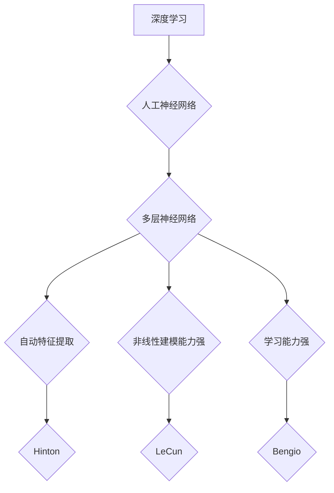

> 深度学习、神经网络、卷积神经网络、循环神经网络、Geoffrey Hinton、Yann LeCun、Yoshua Bengio

## 1. 背景介绍

人工智能（AI）的蓬勃发展，离不开深度学习的革命性突破。深度学习，作为机器学习的一个分支，通过构建多层神经网络来模拟人类大脑的学习机制，取得了令人瞩目的成就。而推动深度学习发展的三位巨匠——Geoffrey Hinton、Yann LeCun 和 Yoshua Bengio，被誉为“AI算法的奠基者”。他们的研究成果和贡献，为现代人工智能的发展奠定了坚实的基础。

## 2. 核心概念与联系

深度学习的核心概念是**人工神经网络（ANN）**。ANN由相互连接的神经元组成，这些神经元按照类似于生物神经元的方式进行信息处理。每个神经元接收来自其他神经元的输入信号，并根据这些信号进行计算，最终输出一个信号。通过多层神经元的叠加，ANN能够学习复杂的非线性关系，从而实现对数据的抽象和理解。

**深度学习**指的是使用具有多层结构的神经网络进行训练。与传统机器学习算法相比，深度学习算法具有以下特点：

* **自动特征提取：**深度学习模型能够自动从原始数据中提取特征，无需人工特征工程。
* **非线性建模能力强：**多层神经网络能够学习复杂的非线性关系，从而更好地拟合真实世界的数据分布。
* **学习能力强：**深度学习模型能够从海量数据中学习，并不断提高其性能。

**Hinton、LeCun 和 Bengio**分别在不同的领域做出了突出贡献：

* **Geoffrey Hinton**：对反向传播算法和玻尔兹曼机等深度学习算法做出了开创性贡献。他被誉为“深度学习之父”。
* **Yann LeCun**：在卷积神经网络（CNN）领域做出了重要贡献，CNN被广泛应用于图像识别、物体检测等领域。
* **Yoshua Bengio**：在循环神经网络（RNN）领域做出了重要贡献，RNN被广泛应用于自然语言处理、语音识别等领域。

**Mermaid 流程图：**



## 3. 核心算法原理 & 具体操作步骤

### 3.1  算法原理概述

深度学习算法的核心是**反向传播算法**。反向传播算法通过计算误差信号，并根据误差信号调整神经网络的权重，从而使模型的预测结果越来越准确。

### 3.2  算法步骤详解

1. **前向传播：**将输入数据通过神经网络传递，计算每个神经元的输出值。
2. **误差计算：**比较神经网络的输出值与实际目标值之间的误差。
3. **反向传播：**根据误差信号，反向传播到神经网络的每一层，计算每个神经元的梯度。
4. **权重更新：**使用梯度下降算法，更新神经网络的权重，使模型的预测结果越来越准确。

### 3.3  算法优缺点

**优点：**

* **学习能力强：**能够从海量数据中学习，并不断提高其性能。
* **自动特征提取：**无需人工特征工程，能够自动从数据中提取特征。
* **非线性建模能力强：**能够学习复杂的非线性关系。

**缺点：**

* **训练时间长：**深度学习模型的训练时间通常较长。
* **数据需求量大：**深度学习模型需要大量的训练数据才能达到较好的性能。
* **可解释性差：**深度学习模型的决策过程难以解释。

### 3.4  算法应用领域

深度学习算法被广泛应用于以下领域：

* **图像识别：**人脸识别、物体检测、图像分类等。
* **自然语言处理：**机器翻译、文本摘要、情感分析等。
* **语音识别：**语音转文本、语音助手等。
* **推荐系统：**商品推荐、内容推荐等。
* **医疗诊断：**疾病诊断、影像分析等。

## 4. 数学模型和公式 & 详细讲解 & 举例说明

### 4.1  数学模型构建

深度学习模型通常由多个**全连接层**和**激活函数**组成。

* **全连接层：**每个神经元都与上一层的所有神经元连接。
* **激活函数：**用于引入非线性，使模型能够学习复杂的非线性关系。常见的激活函数包括ReLU、Sigmoid 和 Tanh。

### 4.2  公式推导过程

**损失函数：**用于衡量模型预测结果与实际目标值之间的误差。常见的损失函数包括均方误差（MSE）和交叉熵损失（Cross-Entropy Loss）。

**梯度下降算法：**用于更新神经网络的权重，使模型的损失函数最小化。梯度下降算法的基本公式如下：

$$
\theta = \theta - \alpha \nabla L(\theta)
$$

其中：

* $\theta$：神经网络的权重
* $\alpha$：学习率
* $\nabla L(\theta)$：损失函数对权重的梯度

### 4.3  案例分析与讲解

**举例说明：**

假设我们有一个简单的深度学习模型，用于预测房价。模型的输入特征包括房屋面积、房间数量和地理位置。模型的输出是房价。

我们可以使用MSE作为损失函数，并使用梯度下降算法来更新模型的权重。通过训练模型，我们可以学习到房屋面积、房间数量和地理位置与房价之间的关系。

## 5. 项目实践：代码实例和详细解释说明

### 5.1  开发环境搭建

* **操作系统：**Linux、macOS 或 Windows
* **编程语言：**Python
* **深度学习框架：**TensorFlow、PyTorch 或 Keras

### 5.2  源代码详细实现

```python
import tensorflow as tf

# 定义模型结构
model = tf.keras.models.Sequential([
    tf.keras.layers.Dense(64, activation='relu', input_shape=(3,)),
    tf.keras.layers.Dense(1)
])

# 编译模型
model.compile(optimizer='adam', loss='mse')

# 训练模型
model.fit(X_train, y_train, epochs=10)

# 评估模型
loss = model.evaluate(X_test, y_test)
```

### 5.3  代码解读与分析

* **定义模型结构：**使用`tf.keras.models.Sequential`创建模型，并添加两个全连接层。
* **编译模型：**使用`model.compile`方法编译模型，指定优化器、损失函数和指标。
* **训练模型：**使用`model.fit`方法训练模型，传入训练数据和训练轮数。
* **评估模型：**使用`model.evaluate`方法评估模型，传入测试数据。

### 5.4  运行结果展示

训练完成后，我们可以使用测试数据评估模型的性能，并查看模型的预测结果。

## 6. 实际应用场景

深度学习算法在各个领域都有广泛的应用场景：

* **图像识别：**自动驾驶、医疗诊断、安防监控等。
* **自然语言处理：**机器翻译、聊天机器人、文本摘要等。
* **语音识别：**语音助手、语音搜索、语音转文本等。
* **推荐系统：**电商推荐、内容推荐、个性化服务等。

## 7. 工具和资源推荐

### 7.1  学习资源推荐

* **书籍：**
    * Deep Learning by Ian Goodfellow, Yoshua Bengio, and Aaron Courville
    * Hands-On Machine Learning with Scikit-Learn, Keras & TensorFlow by Aurélien Géron
* **在线课程：**
    * Deep Learning Specialization by Andrew Ng (Coursera)
    * Fast.ai Deep Learning Course

### 7.2  开发工具推荐

* **深度学习框架：**TensorFlow、PyTorch、Keras
* **编程语言：**Python
* **数据处理工具：**Pandas、NumPy

### 7.3  相关论文推荐

* **AlexNet：**ImageNet Classification with Deep Convolutional Neural Networks
* **VGGNet：**Very Deep Convolutional Networks for Large-Scale Image Recognition
* **ResNet：**Deep Residual Learning for Image Recognition

## 8. 总结：未来发展趋势与挑战

### 8.1  研究成果总结

Hinton、LeCun 和 Bengio 的研究成果，为深度学习的发展奠定了坚实的基础。深度学习算法取得了令人瞩目的成就，在各个领域都有广泛的应用。

### 8.2  未来发展趋势

* **模型规模的进一步扩大：**更大的模型能够学习更复杂的知识，从而提高模型的性能。
* **模型效率的提升：**研究更有效的训练算法和模型架构，降低模型的训练时间和计算资源需求。
* **模型解释性的增强：**研究更有效的模型解释方法，使模型的决策过程更加透明可解释。
* **跨模态学习：**研究能够处理多种模态数据的模型，例如图像、文本、音频等。

### 8.3  面临的挑战

* **数据获取和隐私问题：**深度学习算法需要大量的训练数据，而获取高质量的训练数据往往面临挑战。此外，数据隐私问题也需要得到重视。
* **模型可解释性问题：**深度学习模型的决策过程难以解释，这可能会导致模型的应用受到限制。
* **模型安全性和鲁棒性问题：**深度学习模型容易受到攻击和干扰，需要提高模型的安全性和鲁棒性。

### 8.4  研究展望

未来，深度学习研究将继续朝着更强大、更智能、更安全的方向发展。


## 9. 附录：常见问题与解答

**常见问题：**

* **什么是深度学习？**
* **深度学习有哪些应用场景？**
* **如何学习深度学习？**
* **深度学习有哪些挑战？**

**解答：**

* **什么是深度学习？** 深度学习是一种机器学习的子领域，它使用多层神经网络来模拟人类大脑的学习机制。
* **深度学习有哪些应用场景？** 深度学习被广泛应用于图像识别、自然语言处理、语音识别、推荐系统等领域。
* **如何学习深度学习？** 可以通过阅读书籍、参加在线课程、参与开源项目等方式学习深度学习。
* **深度学习有哪些挑战？** 深度学习面临着数据获取、模型解释性、模型安全性和鲁棒性等挑战。


作者：禅与计算机程序设计艺术 / Zen and the Art of Computer Programming 
<end_of_turn>