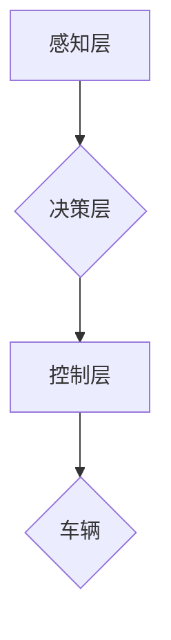

> 自动驾驶, ICRA, 深度学习, 计算机视觉, 决策控制, 仿真环境, 鲁棒性

## 1. 背景介绍

国际机器学习与机器人大会（ICRA）是机器人领域最具影响力的学术会议之一，每年都会汇聚全球顶尖的学者、研究人员和工程师，分享最新的研究成果和技术进展。自动驾驶作为机器人领域的重要应用方向，在ICRA上也一直占据着重要的篇幅。

近年来，随着深度学习、计算机视觉、传感器技术等领域的快速发展，自动驾驶技术取得了显著的进展。从早期基于规则的控制系统到如今的基于深度学习的智能驾驶系统，自动驾驶技术已经经历了从感知到决策、控制的全面升级。ICRA 2024上，自动驾驶相关论文涵盖了感知、决策、控制、仿真环境、鲁棒性等多个方面，展现了自动驾驶技术发展的最新趋势和未来方向。

## 2. 核心概念与联系

自动驾驶系统是一个复杂的智能系统，它需要感知周围环境、理解环境信息、做出决策并控制车辆行驶。

**核心概念:**

* **感知:** 自动驾驶系统需要通过传感器（如摄像头、雷达、激光雷达等）感知周围环境，获取车辆位置、速度、周围障碍物等信息。
* **决策:** 自动驾驶系统需要根据感知到的环境信息，做出驾驶决策，例如转向、加速、减速等。
* **控制:** 自动驾驶系统需要控制车辆的动力系统、转向系统等，实现决策指令。

**架构:**



## 3. 核心算法原理 & 具体操作步骤

### 3.1  算法原理概述

自动驾驶系统中常用的算法包括：

* **深度学习:** 用于图像识别、目标检测、路径规划等任务。
* **强化学习:** 用于训练自动驾驶系统决策策略，使其能够在复杂环境中做出最优决策。
* **模型预测控制:** 用于预测车辆未来状态，并根据预测结果制定控制策略。

### 3.2  算法步骤详解

**深度学习算法步骤:**

1. **数据收集:** 收集大量标注数据，例如图像、视频、传感器数据等。
2. **数据预处理:** 对数据进行清洗、格式化、增强等处理。
3. **模型训练:** 使用深度学习模型训练，例如卷积神经网络（CNN）、循环神经网络（RNN）等。
4. **模型评估:** 使用测试数据评估模型性能，例如准确率、召回率等。
5. **模型部署:** 将训练好的模型部署到自动驾驶系统中。

**强化学习算法步骤:**

1. **环境搭建:** 建立自动驾驶系统的仿真环境或真实环境。
2. **奖励函数设计:** 设计奖励函数，根据自动驾驶系统的行为给予奖励或惩罚。
3. **策略网络训练:** 使用强化学习算法训练策略网络，使其能够学习最优的决策策略。
4. **策略评估:** 使用测试环境评估策略网络的性能。
5. **策略部署:** 将训练好的策略网络部署到自动驾驶系统中。

### 3.3  算法优缺点

**深度学习算法:**

* **优点:** 能够学习复杂特征，性能优异。
* **缺点:** 需要大量数据训练，训练时间长，解释性差。

**强化学习算法:**

* **优点:** 可以学习复杂决策策略，适应性强。
* **缺点:** 训练过程复杂，需要设计合适的奖励函数，容易陷入局部最优。

### 3.4  算法应用领域

* **感知:** 目标检测、图像识别、场景理解等。
* **决策:** 路径规划、决策控制、避障等。
* **控制:** 车辆动力控制、转向控制、刹车控制等。

## 4. 数学模型和公式 & 详细讲解 & 举例说明

### 4.1  数学模型构建

自动驾驶系统中的数学模型通常用于描述车辆运动、环境交互、决策策略等方面。例如，车辆运动模型可以描述车辆的运动轨迹，环境交互模型可以描述车辆与其他物体之间的碰撞风险，决策策略模型可以描述车辆在不同场景下的决策行为。

### 4.2  公式推导过程

**车辆运动模型:**

车辆运动模型通常基于牛顿第二定律，描述车辆的加速度、速度和位置的变化。

$$
F = ma
$$

其中：

* $F$ 是车辆所受的合力
* $m$ 是车辆的质量
* $a$ 是车辆的加速度

**环境交互模型:**

环境交互模型通常基于概率论和统计学，描述车辆与其他物体之间的碰撞风险。例如，可以使用贝叶斯网络来建模车辆与其他车辆之间的碰撞风险，根据车辆的位置、速度、其他车辆的位置、速度等信息计算碰撞概率。

### 4.3  案例分析与讲解

**路径规划:**

路径规划问题旨在找到车辆从起点到终点的最优路径，同时避免碰撞和其他障碍物。可以使用数学模型和算法，例如A*算法、Dijkstra算法等，来解决路径规划问题。

## 5. 项目实践：代码实例和详细解释说明

### 5.1  开发环境搭建

自动驾驶项目开发环境通常包括：

* **操作系统:** Linux、Windows等
* **编程语言:** Python、C++等
* **深度学习框架:** TensorFlow、PyTorch等
* **机器人仿真平台:** Gazebo、ROS等

### 5.2  源代码详细实现

以下是一个简单的自动驾驶系统代码示例，使用Python和ROS框架实现车辆的路径跟踪功能。

```python
import rospy
from geometry_msgs.msg import Twist

def callback(data):
    # 获取目标路径信息
    target_pose = data.pose.position

    # 计算车辆到目标路径的偏差
    error = target_pose - current_pose

    # 根据偏差控制车辆速度和转向
    twist = Twist()
    twist.linear.x = 0.5  # 设置车辆速度
    twist.angular.z = error.x * 0.1  # 设置车辆转向角

    # 发布控制指令
    pub.publish(twist)

# 初始化ROS节点
rospy.init_node('auto_driving')

# 订阅目标路径信息
sub = rospy.Subscriber('/target_pose', PoseStamped, callback)

# 发布控制指令
pub = rospy.Publisher('/cmd_vel', Twist, queue_size=10)

# 循环运行
rospy.spin()
```

### 5.3  代码解读与分析

* 该代码首先订阅目标路径信息，然后计算车辆到目标路径的偏差。
* 根据偏差，控制车辆的速度和转向，使车辆沿着目标路径行驶。
* 该代码是一个简单的示例，实际的自动驾驶系统需要考虑更多的因素，例如环境感知、决策控制、鲁棒性等。

### 5.4  运行结果展示

运行该代码后，车辆将在ROS仿真环境中沿着目标路径行驶。

## 6. 实际应用场景

自动驾驶技术在多个领域都有着广泛的应用场景，例如：

* **自动驾驶汽车:** 自动驾驶汽车可以实现无人驾驶，提高交通效率，降低交通事故发生率。
* **无人配送:** 自动驾驶无人车可以用于配送货物，提高配送效率，降低物流成本。
* **智能交通:** 自动驾驶技术可以用于智能交通管理，例如交通信号灯优化、拥堵路段缓解等。

### 6.4  未来应用展望

未来，自动驾驶技术将更加智能化、安全可靠，应用场景也将更加广泛。例如：

* **自动驾驶飞机:** 自动驾驶飞机可以提高飞行效率，降低飞行成本。
* **自动驾驶船舶:** 自动驾驶船舶可以提高航行效率，降低航行风险。
* **自动驾驶机器人:** 自动驾驶机器人可以用于工业生产、服务业等领域，提高工作效率，降低劳动成本。

## 7. 工具和资源推荐

### 7.1  学习资源推荐

* **书籍:**
    * 《自动驾驶汽车》
    * 《机器人操作系统》
* **在线课程:**
    * Coursera: 自动驾驶汽车
    * Udacity: 自动驾驶工程师
* **开源项目:**
    * ROS: Robot Operating System
    * Autoware: 自动驾驶开源平台

### 7.2  开发工具推荐

* **编程语言:** Python, C++
* **深度学习框架:** TensorFlow, PyTorch
* **机器人仿真平台:** Gazebo, CARLA

### 7.3  相关论文推荐

* **ICRA 2023:**
    * [论文标题1](论文链接)
    * [论文标题2](论文链接)
* **NeurIPS 2022:**
    * [论文标题3](论文链接)
    * [论文标题4](论文链接)

## 8. 总结：未来发展趋势与挑战

### 8.1  研究成果总结

ICRA 2024上的自动驾驶相关论文展现了自动驾驶技术发展的最新趋势和未来方向，包括：

* **感知技术:** 深度学习技术在目标检测、场景理解等方面取得了显著进展。
* **决策控制技术:** 强化学习技术在决策策略训练方面取得了突破。
* **仿真环境:** 仿真环境技术更加逼真，能够更好地模拟真实驾驶场景。
* **鲁棒性:** 研究者们更加关注自动驾驶系统的鲁棒性，例如应对恶劣天气、复杂路况等挑战。

### 8.2  未来发展趋势

* **更智能的感知系统:** 利用多传感器融合技术，提高感知精度和可靠性。
* **更强大的决策控制系统:** 结合深度学习、强化学习等技术，实现更智能、更安全的决策控制。
* **更安全的自动驾驶系统:** 加强安全测试和验证，确保自动驾驶系统的安全性。
* **更广泛的应用场景:** 自动驾驶技术将应用于更多领域，例如物流、农业、医疗等。

### 8.3  面临的挑战

* **数据获取和标注:** 自动驾驶系统需要大量的数据进行训练，数据获取和标注成本较高。
* **算法复杂度:** 自动驾驶算法非常复杂，需要强大的计算能力。
* **安全性和可靠性:** 自动驾驶系统需要保证安全性和可靠性，避免事故发生。
* **法律法规:** 自动驾驶技术的应用需要完善的法律法规。

### 8.4  研究展望

未来，自动驾驶技术将继续朝着更智能、更安全、更可靠的方向发展。研究者们将继续探索新的算法、技术和应用场景，推动自动驾驶技术的发展和应用。

## 9. 附录：常见问题与解答

**常见问题:**

* 自动驾驶技术什么时候能够普及？
* 自动驾驶技术有哪些安全风险？
* 自动驾驶技术对就业市场有什么影响？

**解答:**

* 自动驾驶技术的普及时间取决于技术发展、政策法规、社会接受度等多方面因素，预计在未来几年到十年内逐步普及。
* 自动驾驶技术存在一些安全风险，例如传感器故障、算法错误、恶意攻击等，需要加强安全测试和验证，制定相应的安全标准和法规。
* 自动驾驶技术可能会对一些传统驾驶工作岗位造成冲击，但也将创造新的就业机会，例如自动驾驶系统开发、维护、运营等。


作者：禅与计算机程序设计艺术 / Zen and the Art of Computer Programming 
<end_of_turn>