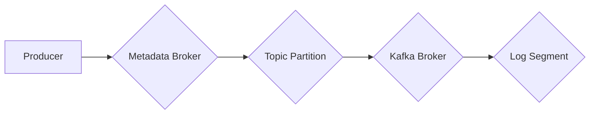

> Kafka, Producer, 消息队列, 分布式系统, 异步发送, 序列化, 负载均衡

## 1. 背景介绍

在现代软件架构中，消息队列扮演着越来越重要的角色。它们提供了一种可靠、高效、可扩展的方式来处理应用程序之间的通信。Apache Kafka 作为一款开源的分布式流处理平台，凭借其高吞吐量、低延迟和强大的容错能力，成为了消息队列领域的一颗明星。

Kafka Producer 是 Kafka 生态系统中负责向 Kafka 集群发送消息的关键组件。它提供了灵活的配置选项，可以根据不同的应用场景进行定制化。本文将深入探讨 Kafka Producer 的原理、工作机制以及代码实例，帮助读者更好地理解和使用 Kafka。

## 2. 核心概念与联系

Kafka 的核心概念包括：

* **主题 (Topic):**  消息的分类容器，类似于邮件的收件箱。
* **分区 (Partition):** 主题被划分为多个分区，每个分区是一个有序的日志，负责存储消息。
* **消费者 (Consumer):** 从主题中读取消息的应用程序。
* **生产者 (Producer):** 向主题发送消息的应用程序。

Kafka Producer 将消息发送到特定的主题分区，消费者可以订阅主题并从相应的分区中读取消息。

**Kafka Producer 与 Kafka 集群的交互流程:**



## 3. 核心算法原理 & 具体操作步骤

### 3.1  算法原理概述

Kafka Producer 的核心算法是基于 **异步发送** 和 **消息序列化** 的。

* **异步发送:** Producer 将消息发送到 Kafka Broker 后，不会等待 Broker 的确认，而是继续发送下一个消息。这样可以提高发送效率，避免阻塞。
* **消息序列化:**  Producer 将消息转换为字节数组，以便 Kafka Broker 可以存储和传输。

### 3.2  算法步骤详解

1. **连接 Kafka 集群:** Producer 需要连接到 Kafka 集群的 Metadata Broker，获取主题和分区的信息。
2. **选择分区:** Producer 根据消息内容或其他策略选择要发送消息的主题分区。
3. **序列化消息:** Producer 将消息转换为字节数组，并添加必要的元数据，例如消息键、时间戳等。
4. **发送消息:** Producer 将序列化后的消息发送到 Kafka Broker。
5. **确认消息发送:** Producer 可以选择等待 Broker 的确认，确保消息被成功写入磁盘。

### 3.3  算法优缺点

**优点:**

* 高吞吐量: 异步发送机制可以提高消息发送效率。
* 低延迟:  Producer 不需要等待 Broker 的确认，可以快速发送消息。
* 可扩展性: Kafka 集群可以水平扩展，以满足不断增长的消息流量需求。

**缺点:**

* 可能会丢失消息: 如果 Producer 没有等待 Broker 的确认，消息可能会丢失。
* 需要处理重试机制:  如果消息发送失败，Producer 需要处理重试机制。

### 3.4  算法应用领域

Kafka Producer 的应用场景非常广泛，例如：

* **日志收集:** 将应用程序的日志消息发送到 Kafka 集群进行存储和分析。
* **事件驱动架构:**  使用 Kafka 作为事件总线，实现不同服务之间的异步通信。
* **实时数据处理:**  将实时数据流发送到 Kafka 集群，进行实时分析和处理。

## 4. 数学模型和公式 & 详细讲解 & 举例说明

### 4.1  数学模型构建

Kafka Producer 的吞吐量可以表示为：

$$
Throughput = \frac{Messages}{Time}
$$

其中：

* Messages:  发送的消息数量
* Time:  发送消息的时间

### 4.2  公式推导过程

Kafka Producer 的吞吐量受以下因素影响：

* **消息大小:**  消息大小越大，发送时间越长。
* **网络带宽:**  网络带宽越宽，发送速度越快。
* **Kafka Broker 的性能:**  Kafka Broker 的处理能力越强，吞吐量越高。
* **分区数量:**  分区数量越多，消息可以并行发送，吞吐量越高。

### 4.3  案例分析与讲解

假设一个 Kafka Producer 发送 1000 条消息，每条消息大小为 1KB，发送时间为 10 秒，则吞吐量为：

$$
Throughput = \frac{1000}{10} = 100 \ messages/second
$$

## 5. 项目实践：代码实例和详细解释说明

### 5.1  开发环境搭建

* Java Development Kit (JDK) 8 或更高版本
* Apache Kafka 集群
* Maven 或 Gradle 构建工具

### 5.2  源代码详细实现

```java
import org.apache.kafka.clients.producer.KafkaProducer;
import org.apache.kafka.clients.producer.ProducerConfig;
import org.apache.kafka.clients.producer.ProducerRecord;
import org.apache.kafka.common.serialization.StringSerializer;

import java.util.Properties;

public class KafkaProducerExample {

    public static void main(String[] args) {

        // Kafka 集群配置
        Properties props = new Properties();
        props.put(ProducerConfig.BOOTSTRAP_SERVERS_CONFIG, "localhost:9092");
        props.put(ProducerConfig.KEY_SERIALIZER_CLASS_CONFIG, StringSerializer.class.getName());
        props.put(ProducerConfig.VALUE_SERIALIZER_CLASS_CONFIG, StringSerializer.class.getName());

        // 创建 Kafka Producer
        KafkaProducer<String, String> producer = new KafkaProducer<>(props);

        // 发送消息
        for (int i = 0; i < 10; i++) {
            String message = "Hello Kafka " + i;
            ProducerRecord<String, String> record = new ProducerRecord<>("my-topic", message);
            producer.send(record);
        }

        // 关闭 Kafka Producer
        producer.close();
    }
}
```

### 5.3  代码解读与分析

* **配置 Kafka 集群:**  `props` 对象用于配置 Kafka 集群的地址等信息。
* **创建 Kafka Producer:**  使用 `KafkaProducer` 类创建 Producer 实例。
* **发送消息:**  使用 `send()` 方法发送消息到指定的主题。
* **关闭 Kafka Producer:**  使用 `close()` 方法关闭 Producer 实例。

### 5.4  运行结果展示

运行代码后，消息将被发送到名为 "my-topic" 的主题中。

## 6. 实际应用场景

Kafka Producer 在各种实际应用场景中发挥着重要作用，例如：

* **电商平台:**  记录用户行为、商品浏览记录等数据，用于分析用户偏好和优化营销策略。
* **金融系统:**  处理交易记录、风险监控数据等敏感信息，确保数据安全和可靠性。
* **社交媒体:**  实时处理用户发布的帖子、评论等信息，实现实时更新和推送。

### 6.4  未来应用展望

随着大数据和云计算技术的不断发展，Kafka Producer 的应用场景将更加广泛。例如：

* **物联网:**  处理海量物联网设备产生的数据，实现智能家居、智慧城市等应用。
* **人工智能:**  提供实时数据流，用于训练机器学习模型和实现人工智能应用。

## 7. 工具和资源推荐

### 7.1  学习资源推荐

* **Apache Kafka 官方文档:** https://kafka.apache.org/documentation/
* **Kafka 入门教程:** https://www.tutorialspoint.com/kafka/index.htm
* **Kafka 中文社区:** https://www.cnblogs.com/kafka/

### 7.2  开发工具推荐

* **Kafka Tools:** https://kafka.apache.org/downloads
* **Confluent Platform:** https://www.confluent.io/

### 7.3  相关论文推荐

* **Kafka: A Distributed Streaming Platform:** https://static.confluent.io/downloads/white-papers/confluent-white-paper-kafka.pdf

## 8. 总结：未来发展趋势与挑战

### 8.1  研究成果总结

Kafka Producer 作为 Kafka 生态系统的重要组成部分，已经取得了显著的成果。其高吞吐量、低延迟、可扩展性等特点使其成为消息队列领域的一颗明星。

### 8.2  未来发展趋势

未来，Kafka Producer 将朝着以下方向发展：

* **更强大的功能:**  例如支持更复杂的消息格式、更精细的权限控制等。
* **更优的性能:**  例如降低延迟、提高吞吐量等。
* **更易于使用:**  例如提供更友好的API、更完善的文档等。

### 8.3  面临的挑战

Kafka Producer 也面临着一些挑战，例如：

* **数据安全:**  如何确保消息在传输和存储过程中安全可靠。
* **数据一致性:**  如何保证消息在不同分区和消费者之间的一致性。
* **系统复杂性:**  随着 Kafka 集群规模的扩大，系统管理和维护的复杂性也会增加。

### 8.4  研究展望

未来，我们将继续研究和改进 Kafka Producer，使其更加强大、可靠和易于使用，为用户提供更好的消息队列服务。

## 9. 附录：常见问题与解答

* **如何配置 Kafka Producer?**

   Kafka Producer 的配置可以通过 `Properties` 对象进行设置。

* **如何发送消息到 Kafka?**

   使用 `send()` 方法发送消息到指定的主题。

* **如何处理消息发送失败?**

   可以使用重试机制处理消息发送失败。

* **如何监控 Kafka Producer 的性能?**

   可以使用 Kafka 的监控工具，例如 Kafka Tools，监控 Producer 的吞吐量、延迟等指标。


作者：禅与计算机程序设计艺术 / Zen and the Art of Computer Programming 
<end_of_turn>