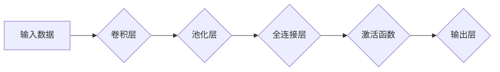

> Keras, 深度学习, 神经网络, 构建模型, 代码实战, TensorFlow

## 1. 背景介绍

深度学习近年来取得了令人瞩目的成就，在图像识别、自然语言处理、语音识别等领域展现出强大的应用潜力。Keras作为一款轻量级、易于使用的深度学习框架，凭借其简洁的API和强大的功能，迅速成为深度学习领域最受欢迎的工具之一。

Keras最初由François Chollet于2015年开发，并于2017年被谷歌收购并整合到TensorFlow生态系统中。Keras的优势在于其模块化设计和高层抽象，使得用户可以快速构建和训练复杂的深度学习模型，而无需深入了解底层的计算图和优化算法。

## 2. 核心概念与联系

Keras的核心概念包括模型、层、激活函数、损失函数和优化器。

**模型**是深度学习网络的整体结构，由多个**层**组成。

**层**是模型的基本构建单元，负责对输入数据进行处理，并输出新的数据。常见的层类型包括卷积层、池化层、全连接层等。

**激活函数**用于引入非线性，使得神经网络能够学习复杂的模式。常见的激活函数包括ReLU、Sigmoid、Tanh等。

**损失函数**用于衡量模型预测结果与真实值的差异，指导模型的训练过程。常见的损失函数包括均方误差、交叉熵等。

**优化器**用于更新模型参数，以最小化损失函数的值。常见的优化器包括梯度下降、Adam、RMSprop等。

**Mermaid 流程图:**



## 3. 核心算法原理 & 具体操作步骤

### 3.1  算法原理概述

Keras的核心算法原理是基于反向传播算法（Backpropagation）进行模型训练。反向传播算法通过计算损失函数对模型参数的梯度，并利用梯度下降法更新模型参数，从而最小化损失函数的值。

### 3.2  算法步骤详解

1. **前向传播:** 将输入数据通过神经网络层级传递，计算每个层的输出值。
2. **损失函数计算:** 计算模型预测结果与真实值的差异，即损失函数的值。
3. **反向传播:** 计算损失函数对每个参数的梯度。
4. **参数更新:** 利用梯度下降法更新模型参数，以最小化损失函数的值。
5. **重复步骤1-4:** 迭代训练模型，直到损失函数收敛或达到预设的训练次数。

### 3.3  算法优缺点

**优点:**

* 易于理解和实现。
* 能够有效地训练复杂的深度学习模型。
* 广泛应用于各种深度学习任务。

**缺点:**

* 训练速度相对较慢。
* 容易陷入局部最优解。

### 3.4  算法应用领域

反向传播算法广泛应用于各种深度学习领域，例如：

* **图像识别:** 识别物体、场景、人脸等。
* **自然语言处理:** 机器翻译、文本摘要、情感分析等。
* **语音识别:** 将语音转换为文本。
* **推荐系统:** 推荐用户感兴趣的内容。

## 4. 数学模型和公式 & 详细讲解 & 举例说明

### 4.1  数学模型构建

深度学习模型本质上是一个复杂的函数映射，将输入数据映射到输出结果。

假设输入数据为**x**，输出结果为**y**，则模型可以表示为：

$$y = f(W x + b)$$

其中：

* **W**为权重矩阵，决定了输入特征之间的关系。
* **b**为偏置向量，用于调整模型的输出。
* **f()**为激活函数，引入非线性，使得模型能够学习复杂的模式。

### 4.2  公式推导过程

反向传播算法的核心是计算损失函数对模型参数的梯度。

假设损失函数为**L(y, y')**，其中**y**为模型预测结果，**y'**为真实值。

则损失函数对权重**W**的梯度为：

$$\frac{\partial L}{\partial W} = \frac{\partial L}{\partial y} \cdot \frac{\partial y}{\partial W}$$

其中：

* **∂L/∂y**为损失函数对模型预测结果的梯度。
* **∂y/∂W**为模型预测结果对权重的梯度。

### 4.3  案例分析与讲解

以图像分类为例，假设模型预测结果为类别概率分布，损失函数为交叉熵损失函数。

则损失函数对权重的梯度可以通过反向传播算法计算，并利用梯度下降法更新权重值，从而提高模型的分类准确率。

## 5. 项目实践：代码实例和详细解释说明

### 5.1  开发环境搭建

1. 安装Python3.6+版本。
2. 安装TensorFlow和Keras库。

```bash
pip install tensorflow keras
```

### 5.2  源代码详细实现

```python
from keras.models import Sequential
from keras.layers import Dense, Flatten
from keras.datasets import mnist

# 加载MNIST数据集
(x_train, y_train), (x_test, y_test) = mnist.load_data()

# 数据预处理
x_train = x_train.reshape(60000, 784).astype('float32') / 255
x_test = x_test.reshape(10000, 784).astype('float32') / 255

# 定义模型
model = Sequential()
model.add(Dense(128, activation='relu', input_shape=(784,)))
model.add(Dense(10, activation='softmax'))

# 编译模型
model.compile(optimizer='adam', loss='sparse_categorical_crossentropy', metrics=['accuracy'])

# 训练模型
model.fit(x_train, y_train, epochs=5, batch_size=32)

# 评估模型
loss, accuracy = model.evaluate(x_test, y_test)
print('Test loss:', loss)
print('Test accuracy:', accuracy)
```

### 5.3  代码解读与分析

1. **数据加载和预处理:** 使用MNIST数据集，并将数据转换为适合模型输入的格式。
2. **模型定义:** 使用Sequential模型，添加两层全连接层，第一层使用ReLU激活函数，第二层使用softmax激活函数。
3. **模型编译:** 使用Adam优化器，交叉熵损失函数，并设置评估指标为准确率。
4. **模型训练:** 使用训练数据训练模型，设置训练轮数和批处理大小。
5. **模型评估:** 使用测试数据评估模型的性能，输出测试损失和准确率。

### 5.4  运行结果展示

运行代码后，会输出模型的训练过程和测试结果，包括训练损失、训练准确率、测试损失和测试准确率。

## 6. 实际应用场景

Keras在各种实际应用场景中发挥着重要作用，例如：

### 6.1  图像识别

* **物体检测:** 识别图像中存在的物体，例如人、车、猫等。
* **图像分类:** 将图像分类到不同的类别，例如风景、人物、动物等。
* **图像分割:** 将图像分割成不同的区域，例如人体的不同部位、道路和人行道等。

### 6.2  自然语言处理

* **机器翻译:** 将文本从一种语言翻译成另一种语言。
* **文本摘要:** 将长文本总结成短文本。
* **情感分析:** 分析文本的情感倾向，例如正面、负面或中性。

### 6.3  语音识别

* **语音转文本:** 将语音转换为文本。
* **语音助手:** 开发语音助手，例如Siri、Alexa等。

### 6.4  未来应用展望

随着深度学习技术的不断发展，Keras在未来将有更广泛的应用场景，例如：

* **医疗诊断:** 辅助医生诊断疾病。
* **金融预测:** 预测股票价格、风险评估等。
* **自动驾驶:** 训练自动驾驶汽车的感知和决策系统。

## 7. 工具和资源推荐

### 7.1  学习资源推荐

* **Keras官方文档:** https://keras.io/
* **深度学习书籍:**
    * 深度学习
    * 深度学习实践
    * 深度学习入门

### 7.2  开发工具推荐

* **Jupyter Notebook:** 用于编写和运行Python代码，并可视化数据。
* **TensorBoard:** 用于可视化训练过程和模型结构。

### 7.3  相关论文推荐

* **Keras: The Python Deep Learning Library:** https://arxiv.org/abs/1503.00080

## 8. 总结：未来发展趋势与挑战

### 8.1  研究成果总结

Keras作为一款轻量级、易于使用的深度学习框架，在深度学习领域取得了显著的成果，为深度学习的普及和应用做出了重要贡献。

### 8.2  未来发展趋势

* **模型效率提升:** 研究更轻量级、更高效的深度学习模型，降低模型训练和推理的成本。
* **自动化机器学习:** 研究自动化模型选择、超参数调优等流程，降低深度学习应用的门槛。
* **边缘计算:** 将深度学习模型部署到边缘设备，实现更快速的推理和更低的延迟。

### 8.3  面临的挑战

* **数据获取和标注:** 深度学习模型的训练需要大量的标注数据，数据获取和标注成本较高。
* **模型解释性:** 深度学习模型的决策过程难以解释，缺乏透明度。
* **公平性和偏见:** 深度学习模型可能存在公平性和偏见问题，需要进行更深入的研究和解决。

### 8.4  研究展望

未来，Keras将继续朝着更轻量级、更高效、更易用、更安全的方向发展，并与其他深度学习框架和技术紧密结合，推动深度学习技术的进一步发展和应用。

## 9. 附录：常见问题与解答

**Q1: Keras和TensorFlow的关系是什么？**

A1: Keras最初是一个独立的深度学习框架，后来被谷歌收购并整合到TensorFlow生态系统中。现在，Keras可以作为TensorFlow的高级API使用，简化了TensorFlow的开发流程。

**Q2: Keras有哪些优点？**

A2: Keras的优点包括：

* **易于使用:** Keras的API简洁易懂，方便初学者快速上手。
* **模块化设计:** Keras的模型结构是模块化的，可以方便地添加和修改层。
* **可扩展性:** Keras可以与其他深度学习框架和工具集成，例如TensorBoard、TensorFlow Lite等。

**Q3: Keras有哪些缺点？**

A3: Keras的缺点包括：

* **灵活性较低:** Keras的模型结构相对固定，难以实现一些复杂的模型架构。
* **性能较低:** Keras的底层实现依赖于TensorFlow，因此在性能方面可能不如其他深度学习框架。


作者：禅与计算机程序设计艺术 / Zen and the Art of Computer Programming 
<end_of_turn>