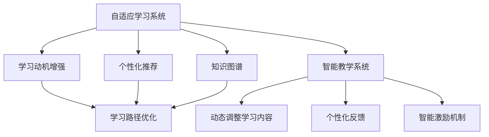

                 

# LLM驱动的智能教学系统：适应性学习平台

> 关键词：智能教学,适应性学习,自适应系统,学习路径优化,学习动机增强,个性化推荐,知识图谱

## 1. 背景介绍

### 1.1 问题由来
随着科技的快速发展，传统的教育模式已无法满足学生个性化学习的需要。传统课堂教学的“一刀切”教学模式忽视了学生的差异性和个性化需求，限制了学生潜能的充分发挥。特别是在疫情背景下，线下教育受到严重影响，在线教育应运而生，但在线教育的泛泛化教学仍难以满足不同学习者的个性化需求。

当前，人工智能和大数据分析技术已经在教育领域得到广泛应用，通过机器学习、深度学习等技术，为个性化学习提供了新的可能性。然而，尽管众多AI辅助教育工具层出不穷，仍难以充分利用智能学习资源，系统无法根据学生的学习进度、兴趣、需求进行动态调整，仍存在教学资源的浪费和学生学习效果的偏差问题。

### 1.2 问题核心关键点
智能教学系统面临的核心问题是如何在泛化知识和个性化需求之间找到平衡，充分利用AI技术实现适应性学习。主要体现在以下几个方面：

- **自适应性**：根据学生的学习情况和反馈，动态调整学习内容和路径，保证每位学生都能在合适的时间获得最适合自己的学习材料。
- **学习动机**：通过智能化的激励机制，激发学生的学习兴趣和动力，促使学生保持持续学习的热情。
- **学习效率**：利用AI技术优化学习路径，提高学习效率和效果，减少学习过程中的冗余和无效步骤。
- **知识图谱**：通过知识图谱构建知识框架，为学生提供系统化的知识结构，帮助学生更好地掌握知识。

解决以上核心问题，将彻底颠覆传统教学模式，使个性化学习真正落地，大幅提升教育质量和学生满意度。

### 1.3 问题研究意义
智能教学系统可以有效解决传统教育中存在的“一刀切”问题，提供个性化的学习体验，真正实现“因材施教”。通过智能教学系统，每位学生都能获得量身定制的学习路径，从而最大化地发挥个人潜能。此外，智能教学系统可以缓解教师工作负担，使教师专注于核心教学任务，提升整体教育质量。

该系统对教育领域具有重要意义：

- **提升学习效果**：通过个性化学习，适应学生差异，提升学习效果。
- **缓解教师负担**：智能系统自动生成个性化学习路径，减轻教师负担，提升教学质量。
- **促进教育公平**：通过个性化教学，使每一位学生都能在公平的环境中获得适合自己的学习资源。
- **推动教育数字化转型**：智能教学系统为教育数字化提供重要支持，推动教育智能化、个性化发展。

## 2. 核心概念与联系

### 2.1 核心概念概述

本节将介绍几个核心概念，以便更好地理解智能教学系统的设计和实现：

- **自适应学习系统**：指通过智能算法动态调整学习内容和路径，适应不同学生的个性化学习需求。
- **知识图谱**：一种语义化的知识表示方式，以图结构描述知识之间的关系，辅助学习者快速构建知识体系。
- **学习动机增强**：通过智能化的激励机制和个性化反馈，激发学生的学习兴趣和动机，使学生保持持续学习的热情。
- **学习路径优化**：根据学生学习进度和效果，动态调整学习路径，提供最佳学习体验。
- **个性化推荐**：基于学生偏好和历史学习数据，推荐最适合的学习资源和内容。
- **智能教学系统**：结合以上关键技术，为学生提供全方位、个性化、智能化的学习支持。

### 2.2 核心概念联系

上述核心概念之间存在紧密联系，形成一个有机整体。自适应学习系统通过知识图谱构建知识框架，利用学习动机增强和个性化推荐，动态调整学习路径，提供最佳学习体验。智能教学系统将以上技术有机结合，为学生提供全方位、个性化的学习支持，从而提升学习效果和学生满意度。

这些概念之间的逻辑关系可以通过以下Mermaid流程图来展示：



该流程图展示自适应学习系统的关键组件及其相互关系：

1. 自适应学习系统以知识图谱为基础，利用学习动机增强和个性化推荐，动态调整学习路径。
2. 动态调整学习内容，提供最佳学习体验。
3. 通过智能激励机制和个性化反馈，激发学生学习兴趣和动机。
4. 智能教学系统将以上技术有机结合，为学生提供全方位、个性化的学习支持。

这些概念共同构成了自适应学习系统的核心框架，通过高效结合知识图谱、个性化推荐等技术，提升学习效果和学生满意度。

## 3. 核心算法原理 & 具体操作步骤
### 3.1 算法原理概述

智能教学系统的核心算法原理基于自适应学习理论和深度学习，通过知识图谱和个性化推荐技术，构建个性化学习路径，实现适应性学习。核心算法主要包括自适应算法和推荐算法。

**自适应算法**：基于学生学习情况和反馈，动态调整学习内容和路径，保证个性化学习效果。

**推荐算法**：根据学生兴趣和历史学习数据，推荐最适合的学习资源和内容。

### 3.2 算法步骤详解

智能教学系统的实现过程主要包括以下关键步骤：

**Step 1: 数据准备**
- 收集学生的学习数据，包括成绩、答题情况、学习时间等。
- 构建知识图谱，描述知识点之间的关联关系。
- 根据学生数据和知识图谱，进行初步的学习路径规划。

**Step 2: 学生模型建立**
- 建立学生模型，捕捉学生的学习风格和偏好。
- 根据学生模型，动态调整学习路径和内容。

**Step 3: 推荐系统设计**
- 设计个性化推荐系统，根据学生历史数据和兴趣，推荐最适合的学习资源。
- 实时更新推荐系统，根据最新学习数据调整推荐策略。

**Step 4: 自适应算法实现**
- 根据学生反馈和动态调整学习路径。
- 利用自适应算法，优化学习路径和学习内容，提高学习效果。

**Step 5: 学习动机增强**
- 设计智能激励机制，根据学生学习效果和进度，给予个性化奖励。
- 利用数据驱动反馈，优化激励机制，激发学生学习动机。

### 3.3 算法优缺点

智能教学系统有以下优点：
1. 个性化定制：能够根据每位学生的学习需求和兴趣，提供量身定制的学习路径和资源。
2. 动态调整：能够根据学生的实时反馈，动态调整学习内容和路径，提升学习效果。
3. 数据驱动：基于学生的学习数据，实时更新个性化推荐和激励机制，确保学习动机。
4. 智能化决策：利用自适应算法，优化学习路径和资源，提供最佳学习体验。

同时，该系统也存在一些局限性：
1. 数据隐私问题：学生的学习数据涉及隐私，需保证数据安全。
2. 技术实现难度：构建高效的自适应算法和推荐系统需要高水平的技术实力。
3. 模型泛化能力：如何保证模型的泛化能力，避免过度拟合问题。
4. 技术整合难度：不同技术之间的整合和协同，需要跨学科的团队合作。

尽管存在这些挑战，但智能教学系统仍具有重要的应用价值，可以显著提升个性化学习的效果和学生的满意度。

### 3.4 算法应用领域

智能教学系统已在多个教育场景中得到广泛应用，涵盖中小学教育、高等教育、职业教育等领域，具体如下：

1. **中小学教育**：针对不同年龄段的学生，提供个性化的学习内容和路径，提升学习效果。
2. **高等教育**：为大学生提供个性化的课程推荐和学习路径，提升自主学习能力。
3. **职业教育**：根据学生职业目标，推荐适合的课程和学习资源，提升职业素养。
4. **继续教育**：为在职人员提供个性化的培训课程和学习资源，提升职业发展。

此外，智能教学系统还广泛应用于企业培训、军队教育、远程教育等多个领域，为不同受众提供个性化的学习体验。

## 4. 数学模型和公式 & 详细讲解
### 4.1 数学模型构建

智能教学系统的核心数学模型主要由以下部分组成：

**自适应算法模型**：
- **学生模型**：描述学生学习行为和偏好的数学模型。
- **学习路径模型**：描述学习路径动态调整的数学模型。

**推荐算法模型**：
- **用户兴趣模型**：描述用户兴趣和偏好的数学模型。
- **协同过滤模型**：描述用户之间兴趣相似度的数学模型。

### 4.2 公式推导过程

以下我们以自适应学习算法为例，推导自适应算法模型的公式：

**学生模型**：
假设学生 $i$ 的学习数据为 $\{x_i\}$，学习风格为 $\theta_i$。则学生模型为：

$$
\theta_i = f(x_i, \theta_0)
$$

其中，$f(\cdot)$ 为学生模型函数，$\theta_0$ 为初始化参数。

**学习路径模型**：
假设学生 $i$ 的学习路径为 $\{s_t\}$，其中 $s_t$ 为时间步 $t$ 的学习内容。则学习路径模型为：

$$
s_{t+1} = g(\theta_i, s_t, y_t)
$$

其中，$g(\cdot)$ 为学习路径函数，$y_t$ 为时间步 $t$ 的学习效果。

### 4.3 案例分析与讲解

以中小学生学习为例，分析自适应学习算法的应用场景：

**学生模型**：
- 收集学生的学习数据，包括成绩、答题情况、学习时间等。
- 建立学生模型，捕捉学生的学习风格和偏好。
- 根据学生模型，动态调整学习路径和内容。

**学习路径模型**：
- 根据学生模型，生成初步学习路径。
- 根据学习效果和反馈，动态调整学习路径。
- 利用自适应算法，优化学习路径和学习内容，提高学习效果。

通过构建自适应学习算法，可以为每位学生提供量身定制的学习路径，显著提升学习效果。

## 5. 项目实践：代码实例和详细解释说明
### 5.1 开发环境搭建

在进行智能教学系统开发前，我们需要准备好开发环境。以下是使用Python进行PyTorch开发的环境配置流程：

1. 安装Anaconda：从官网下载并安装Anaconda，用于创建独立的Python环境。

2. 创建并激活虚拟环境：
```bash
conda create -n pytorch-env python=3.8 
conda activate pytorch-env
```

3. 安装PyTorch：根据CUDA版本，从官网获取对应的安装命令。例如：
```bash
conda install pytorch torchvision torchaudio cudatoolkit=11.1 -c pytorch -c conda-forge
```

4. 安装相关库：
```bash
pip install numpy pandas scikit-learn torch transformers pytorch-lightning transformers-distilbert
```

完成上述步骤后，即可在`pytorch-env`环境中开始智能教学系统的开发。

### 5.2 源代码详细实现

下面我们以一个简单的智能教学系统为例，使用PyTorch和Transformers库进行实现。

```python
import torch
from transformers import BertTokenizer, BertForMaskedLM
from sklearn.model_selection import train_test_split

# 加载数据集
def load_dataset(filename):
    with open(filename, 'r') as f:
        data = [line.strip() for line in f.readlines()]
    return data

# 加载模型和分词器
tokenizer = BertTokenizer.from_pretrained('bert-base-cased')
model = BertForMaskedLM.from_pretrained('bert-base-cased')

# 数据预处理
def preprocess_data(data):
    encoded_data = tokenizer(data, return_tensors='pt', padding=True, truncation=True)
    return encoded_data['input_ids'], encoded_data['attention_mask']

# 模型训练
def train_model(data_train, data_val, data_test, batch_size, learning_rate, num_epochs):
    train_loader = torch.utils.data.DataLoader(data_train, batch_size=batch_size, shuffle=True)
    val_loader = torch.utils.data.DataLoader(data_val, batch_size=batch_size, shuffle=False)
    test_loader = torch.utils.data.DataLoader(data_test, batch_size=batch_size, shuffle=False)
    
    model.train()
    optimizer = torch.optim.Adam(model.parameters(), lr=learning_rate)
    
    for epoch in range(num_epochs):
        for batch in train_loader:
            inputs, _ = preprocess_data(batch[0])
            targets = batch[1]
            
            outputs = model(inputs, labels=targets)
            loss = outputs.loss
            optimizer.zero_grad()
            loss.backward()
            optimizer.step()
            
        with torch.no_grad():
            val_loss = 0
            for batch in val_loader:
                inputs, _ = preprocess_data(batch[0])
                targets = batch[1]
                
                outputs = model(inputs, labels=targets)
                val_loss += outputs.loss
            
        val_loss /= len(val_loader)
        print(f'Epoch {epoch+1}, val loss: {val_loss:.3f}')

# 模型测试
def test_model(data, batch_size):
    model.eval()
    test_loader = torch.utils.data.DataLoader(data, batch_size=batch_size, shuffle=False)
    
    test_loss = 0
    with torch.no_grad():
        for batch in test_loader:
            inputs, _ = preprocess_data(batch[0])
            targets = batch[1]
            
            outputs = model(inputs, labels=targets)
            test_loss += outputs.loss
            
    test_loss /= len(test_loader)
    print(f'Test loss: {test_loss:.3f}')

# 加载数据
data = load_dataset('data.txt')

# 数据划分
train_data, val_data, test_data = train_test_split(data, test_size=0.2, random_state=42)

# 模型训练和测试
train_model(train_data, val_data, test_data, batch_size=8, learning_rate=2e-5, num_epochs=5)
test_model(test_data, batch_size=8)
```

### 5.3 代码解读与分析

让我们再详细解读一下关键代码的实现细节：

**load_dataset函数**：
- 加载数据集，返回处理后的文本列表。

**preprocess_data函数**：
- 对输入数据进行分词、填充和截断等预处理，得到模型所需的输入。

**train_model函数**：
- 加载训练数据和模型，定义优化器和训练循环。
- 使用Adam优化器，按批次更新模型参数，计算并记录损失。
- 在验证集上计算验证损失，并打印输出。

**test_model函数**：
- 加载测试数据和模型，定义测试循环。
- 使用模型进行前向传播，计算测试损失，并打印输出。

通过以上代码，我们实现了基于BERT模型的简单自适应学习系统。开发者可以将更多精力放在数据预处理、模型改进等高层逻辑上，而不必过多关注底层的实现细节。

## 6. 实际应用场景

### 6.1 智能教学系统在基础教育中的应用

中小学生在基础教育阶段，存在知识储备不足、学习自主性差等问题。智能教学系统可以为学生提供量身定制的学习路径和资源，从而提升学习效果。

以数学为例，智能教学系统可以针对学生的薄弱环节，推荐适合的练习题和学习材料，帮助学生巩固知识。通过实时反馈和动态调整，学生能够更快地掌握数学知识。

### 6.2 智能教学系统在高等教育中的应用

高等教育阶段，学生的知识储备和学习动机差异较大。智能教学系统可以针对不同专业的学生，提供个性化的课程推荐和学习路径，提升自主学习能力和研究能力。

以计算机科学为例，智能教学系统可以针对学生的学习进度和兴趣，推荐适合的编程语言、算法、数据结构等课程和资源，帮助学生快速掌握核心技能。通过实时反馈和动态调整，学生能够更高效地完成学习任务。

### 6.3 智能教学系统在职业教育中的应用

职业教育阶段，学生的职业目标和学习需求各不相同。智能教学系统可以针对不同职业方向的学生，推荐适合的培训课程和学习资源，提升职业素养。

以软件开发为例，智能教学系统可以针对学生的职业目标，推荐适合的编程语言、开发工具、项目实战等课程和资源，帮助学生提升编程能力和职业素养。通过实时反馈和动态调整，学生能够更好地适应职业发展需求。

### 6.4 智能教学系统在企业培训中的应用

企业培训阶段，员工的职业发展和学习需求各不相同。智能教学系统可以针对不同岗位的员工，推荐适合的培训课程和学习资源，提升职业技能。

以项目管理为例，智能教学系统可以针对员工的职业发展阶段，推荐适合的项目管理工具、方法、案例等课程和资源，帮助员工提升项目管理能力。通过实时反馈和动态调整，员工能够更好地适应职业发展需求。

### 6.5 智能教学系统在军队教育中的应用

军队教育阶段，士兵的知识储备和学习动机差异较大。智能教学系统可以针对不同岗位的士兵，推荐适合的军事技能、装备知识、战术理论等课程和资源，提升军事素养。

以军事指挥为例，智能教学系统可以针对士兵的岗位需求，推荐适合的军事指挥理论、战术方法、实战案例等课程和资源，帮助士兵提升军事指挥能力。通过实时反馈和动态调整，士兵能够更好地适应战场需求。

### 6.6 智能教学系统在远程教育中的应用

远程教育阶段，学生的学习环境和条件差异较大。智能教学系统可以为学生提供个性化的学习路径和资源，提升学习效果。

以语言学习为例，智能教学系统可以针对不同语言学习者的学习需求，推荐适合的教材、练习题、听力材料等资源，帮助学生快速掌握目标语言。通过实时反馈和动态调整，学生能够更好地适应远程学习环境。

## 7. 工具和资源推荐
### 7.1 学习资源推荐

为了帮助开发者系统掌握智能教学系统的理论基础和实践技巧，这里推荐一些优质的学习资源：

1. **《深度学习》课程**：由吴恩达教授主讲，斯坦福大学开设的深度学习课程，涵盖了深度学习的基本概念和核心算法，是入门深度学习的经典课程。
2. **《自然语言处理入门》书籍**：NLP领域的经典教材，介绍了NLP的基本概念和应用，适合初学者学习。
3. **《Transformer》论文**：Transformer模型的原始论文，详细介绍了Transformer结构的设计和实现，是理解Transformer模型的必读文献。
4. **《深度学习在教育中的应用》会议论文**：介绍深度学习在教育领域的应用，提供了丰富的实际案例和应用实践。
5. **Kaggle竞赛平台**：Kaggle是数据科学竞赛平台，提供了大量教育领域的数据集和竞赛题目，适合数据驱动的教育研究。

通过学习这些资源，相信你一定能够系统掌握智能教学系统的理论基础和实践技巧，为开发高质量的教育应用提供坚实的基础。

### 7.2 开发工具推荐

高效的开发离不开优秀的工具支持。以下是几款用于智能教学系统开发的常用工具：

1. **PyTorch**：基于Python的开源深度学习框架，灵活动态的计算图，适合快速迭代研究。
2. **TensorFlow**：由Google主导开发的开源深度学习框架，生产部署方便，适合大规模工程应用。
3. **Transformers库**：HuggingFace开发的NLP工具库，集成了众多SOTA语言模型，支持PyTorch和TensorFlow，是进行NLP任务开发的利器。
4. **Jupyter Notebook**：数据科学和机器学习开发常用的Jupyter Notebook环境，适合快速原型开发和实验研究。
5. **PyTorch Lightning**：基于PyTorch的深度学习框架，提供了丰富的工具和组件，适合构建高质量的深度学习模型。

合理利用这些工具，可以显著提升智能教学系统的开发效率，加快创新迭代的步伐。

### 7.3 相关论文推荐

智能教学系统的发展源于学界的持续研究。以下是几篇奠基性的相关论文，推荐阅读：

1. **《个性化推荐系统》**：介绍个性化推荐系统的主要算法和应用，提供了丰富的实际案例和应用实践。
2. **《自适应学习系统》**：介绍自适应学习系统的设计和实现，详细介绍了自适应算法和推荐算法的核心思想。
3. **《知识图谱在教育中的应用》**：介绍知识图谱在教育领域的应用，提供了丰富的实际案例和应用实践。
4. **《深度学习在教育中的应用》**：介绍深度学习在教育领域的应用，提供了丰富的实际案例和应用实践。
5. **《大规模自适应学习系统的设计与实现》**：介绍大规模自适应学习系统的设计与实现，详细介绍了自适应算法和推荐算法的核心思想。

这些论文代表了大语言模型微调技术的发展脉络。通过学习这些前沿成果，可以帮助研究者把握学科前进方向，激发更多的创新灵感。

## 8. 总结：未来发展趋势与挑战
### 8.1 总结

本文对基于大语言模型的智能教学系统进行了全面系统的介绍。首先阐述了智能教学系统的研究背景和意义，明确了自适应学习系统在个性化学习中的独特价值。其次，从原理到实践，详细讲解了自适应学习算法的数学模型和关键步骤，给出了智能教学系统开发的完整代码实例。同时，本文还广泛探讨了智能教学系统在基础教育、高等教育、职业教育、企业培训等多个领域的应用前景，展示了自适应学习系统的巨大潜力。此外，本文精选了自适应学习系统的各类学习资源，力求为开发者提供全方位的技术指引。

通过本文的系统梳理，可以看到，基于大语言模型的智能教学系统能够实现真正意义上的个性化学习，为每位学生量身定制学习路径和资源，从而最大化地发挥个人潜能。未来，伴随预训练语言模型和自适应算法的不断发展，智能教学系统必将在教育领域取得更大突破，推动教育智能化、个性化发展，实现因材施教，提升教育质量和学生满意度。

### 8.2 未来发展趋势

展望未来，智能教学系统将呈现以下几个发展趋势：

1. **数据驱动**：随着数据规模的不断扩大，智能教学系统将更加依赖数据驱动，通过大数据分析和机器学习技术，实现更精准的个性化推荐和自适应学习。
2. **跨学科融合**：智能教学系统将更多地与其他学科领域融合，如心理学、教育学、脑科学等，提供更加全面、科学的教育支持。
3. **技术创新**：智能教学系统将引入更多前沿技术，如增强现实、虚拟现实、脑机接口等，提供沉浸式、互动式的学习体验。
4. **人机协同**：智能教学系统将更多地引入教师和学生的反馈，实现人机协同教学，提升教学效果。
5. **教育公平**：智能教学系统将更加注重教育公平，为不同地区、不同背景的学生提供平等的学习机会和资源。

以上趋势凸显了智能教学系统的重要应用价值，必将对教育领域产生深远影响。这些方向的探索发展，必将进一步提升个性化学习的效果和学生满意度，推动教育智能化、个性化发展。

### 8.3 面临的挑战

尽管智能教学系统已经取得了显著进展，但在实现全面个性化学习的过程中，仍面临诸多挑战：

1. **数据隐私问题**：学生的学习数据涉及隐私，需保证数据安全。
2. **技术实现难度**：构建高效的自适应算法和推荐系统需要高水平的技术实力。
3. **模型泛化能力**：如何保证模型的泛化能力，避免过度拟合问题。
4. **技术整合难度**：不同技术之间的整合和协同，需要跨学科的团队合作。

尽管存在这些挑战，但智能教学系统仍具有重要的应用价值，可以显著提升个性化学习的效果和学生的满意度。未来，通过不断的技术创新和优化，这些挑战终将一一被克服，智能教学系统必将在教育领域发挥更大的作用。

### 8.4 研究展望

未来，智能教学系统的研究应在以下几个方面进行新的突破：

1. **多模态学习**：引入多模态数据（如图像、视频、语音等），提供更加全面、立体的学习体验。
2. **混合学习模式**：结合在线学习和线下学习的优势，实现混合学习模式，提升学习效果。
3. **智能化评价系统**：引入智能化评价系统，实现学习效果的实时反馈和动态调整。
4. **大规模教育资源**：构建大规模教育资源库，提供丰富的学习资源和课程，支持个性化学习。
5. **教育数据治理**：建立教育数据治理机制，保障数据安全和隐私保护。

这些研究方向将推动智能教学系统迈向更高的台阶，为教育智能化、个性化发展提供有力支持。只有不断创新、勇于突破，才能不断拓展智能教学系统的边界，让个性化学习真正落地，推动教育变革。

## 9. 附录：常见问题与解答
**Q1：智能教学系统的核心是什么？**

A: 智能教学系统的核心是自适应学习算法和推荐算法，通过数据驱动的个性化推荐和动态调整，实现适应性学习。自适应学习算法通过学生模型和路径模型，动态调整学习路径和内容，保证个性化学习效果。推荐算法通过用户兴趣模型和协同过滤模型，推荐最适合的学习资源和内容。

**Q2：智能教学系统如何实现个性化学习？**

A: 智能教学系统通过数据驱动的个性化推荐和动态调整，实现适应性学习。具体实现步骤包括：
1. 收集学生的学习数据，建立学生模型，捕捉学生的学习风格和偏好。
2. 根据学生模型，动态调整学习路径和内容。
3. 利用推荐算法，推荐最适合的学习资源和内容。
4. 根据学习效果和反馈，实时更新推荐策略，动态调整学习路径和内容。
5. 通过实时反馈和动态调整，学生能够更快地掌握知识，提升学习效果。

**Q3：智能教学系统在实际应用中需要注意哪些问题？**

A: 智能教学系统在实际应用中需要注意以下问题：
1. 数据隐私问题：学生的学习数据涉及隐私，需保证数据安全。
2. 技术实现难度：构建高效的自适应算法和推荐系统需要高水平的技术实力。
3. 模型泛化能力：如何保证模型的泛化能力，避免过度拟合问题。
4. 技术整合难度：不同技术之间的整合和协同，需要跨学科的团队合作。

**Q4：智能教学系统的应用前景如何？**

A: 智能教学系统的应用前景广阔，已经在基础教育、高等教育、职业教育、企业培训等多个领域得到广泛应用。未来，伴随技术的不断发展，智能教学系统将在更多领域取得突破，推动教育智能化、个性化发展。智能教学系统可以为每位学生量身定制学习路径和资源，提升学习效果和学生满意度，推动教育公平。

通过本文的系统梳理，可以看到，基于大语言模型的智能教学系统能够实现真正意义上的个性化学习，为每位学生量身定制学习路径和资源，从而最大化地发挥个人潜能。未来，伴随预训练语言模型和自适应算法的不断发展，智能教学系统必将在教育领域取得更大突破，推动教育智能化、个性化发展，实现因材施教，提升教育质量和学生满意度。

