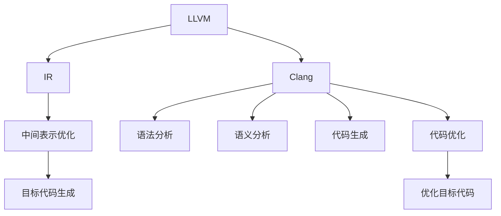

                 

# LLVM/Clang：现代编译器架构剖析

> 关键词：LLVM, Clang, 编译器架构, 中间代码, 代码优化, 编译器优化器

## 1. 背景介绍

### 1.1 问题由来
现代编程语言和计算环境的快速发展，使得编译器的重要性愈加凸显。编译器不仅是编程语言与计算机硬件之间的桥梁，更是性能优化、安全保障、代码可移植性的关键。传统编译器在语法分析、语义分析、代码生成等方面已日趋成熟，但在新型编程语言和高级程序优化方面仍存在诸多挑战。

现代编译器架构正逐步向模块化、动态化、多目标化发展，以适应多语言、多平台、多架构的编程环境。LLVM与Clang项目正是在这样的背景下诞生的，成为推动现代编译器发展的两颗璀璨明星。

LLVM（Low-Level Virtual Machine）是一个基于编译器中间表示（IR）的现代编译器基础设施，支持多种编程语言和架构的编译。而Clang则是一个基于LLVM构建的C语言、C++、Objective-C等语言的现代编译器。LLVM/Clang架构的剖析，将有助于我们深入理解现代编译器的核心工作机制与设计理念。

### 1.2 问题核心关键点
本文聚焦于LLVM/Clang架构剖析，旨在通过深入理解其设计理念、核心组件和优化算法，为开发者提供编译器构建、代码优化和性能提升的思路和方法。核心关键点包括：
1. LLVM和Clang的核心架构与设计理念。
2. LLVM中间表示及其与编译器设计的关系。
3. Clang编译器的主要组件与优化算法。
4. LLVM与Clang在实际应用中的典型案例分析。
5. LLVM/Clang面临的挑战与未来发展趋势。

## 2. 核心概念与联系

### 2.1 核心概念概述

为更好地理解LLVM/Clang架构，本节将介绍几个密切相关的核心概念：

- LLVM（Low-Level Virtual Machine）：一个基于IR的现代编译器基础设施，支持多种编程语言和架构的编译。其核心思想是将编译过程分为多个模块，每个模块负责特定的功能，提高编译器的可维护性和扩展性。

- IR（Intermediate Representation）：编译器中间表示，是一个抽象的中间代码表示形式，用于描述源代码的语义信息。LLVM基于IR的设计，使得编译器可以灵活地处理不同语言的源代码。

- Clang：一个基于LLVM构建的C语言、C++、Objective-C等语言的现代编译器。Clang将语法分析、语义分析、代码生成等功能模块化，实现了高效的编译器构建。

- AST（Abstract Syntax Tree）：抽象语法树，用于表示源代码的语法结构。Clang利用AST进行语法分析和语义分析，生成中间表示和代码生成目标。

- 代码优化：包括常量折叠、死代码消除、循环展开等技术，用于提升代码执行效率和减小二进制体积。

- 代码生成：将中间表示转换为目标代码，用于执行。Clang支持生成多种架构的代码，包括x86、ARM、MIPS等。

这些核心概念之间的逻辑关系可以通过以下Mermaid流程图来展示：



这个流程图展示了几大核心概念及其之间的关系：

1. LLVM基于IR的设计，将编译过程分为多个模块。
2. Clang利用AST进行语法分析和语义分析，生成中间表示。
3. 中间表示经过优化和目标代码生成，最终生成目标代码。
4. Clang还支持代码优化，提升目标代码的执行效率。

这些概念共同构成了LLVM/Clang架构的基础，使得其能够灵活地处理各种语言的源代码，同时提供高效的代码生成和优化功能。

## 3. 核心算法原理 & 具体操作步骤

### 3.1 算法原理概述

基于LLVM/Clang的编译器架构，其核心算法原理包括以下几个方面：

- 源码解析：将源代码解析为AST，并进行语法和语义分析。
- 中间表示生成：将AST转换为LLVM IR，进行中间表示优化。
- 代码生成：将优化后的IR转换为目标代码，并进行代码优化。

编译器的整体流程如图1所示：


图1: 基于LLVM/Clang的编译器流程

### 3.2 算法步骤详解

LLVM/Clang的编译器架构具体步骤包括：

1. 源码解析：利用AST构建源码的抽象语法树，进行语法和语义分析。
2. 中间表示生成：将AST转换为LLVM IR，生成中间表示。
3. 中间表示优化：对IR进行优化，提升代码性能和体积。
4. 代码生成：将优化后的IR转换为目标代码。
5. 目标代码优化：对目标代码进行进一步的优化，提升执行效率。

每个步骤具体细节如下：

#### 源码解析

源码解析是编译器的第一步，其目的是将源代码解析为AST，并进行语法和语义分析。这一步骤通常包括以下几个子步骤：

- 词法分析：将源代码分解为单词和符号，生成令牌流(token stream)。
- 语法分析：将令牌流解析为语法结构，生成抽象语法树(AST)。
- 语义分析：在AST上执行语义检查和符号表管理，检查语法和语义是否正确。

Clang利用其AST构建模块进行高效的源码解析，支持多种语言的标准语法和语义规则。

#### 中间表示生成

中间表示生成是将AST转换为LLVM IR的过程。这一步骤通常包括以下几个子步骤：

- 语义分析：在AST上执行类型检查和数据流分析，生成类型信息和变量符号表。
- IR生成：将AST转换为LLVM IR，记录类型信息和符号表。
- 中间表示优化：对IR进行优化，提升代码性能和体积。

LLVM IR是一个抽象的中间表示，支持多种高级优化操作，如函数内联、循环展开、死代码消除等。

#### 代码生成

代码生成是将优化后的LLVM IR转换为目标代码的过程。这一步骤通常包括以下几个子步骤：

- 代码生成：将LLVM IR转换为目标代码，记录类型信息和符号表。
- 目标代码优化：对目标代码进行进一步的优化，提升执行效率。

Clang支持生成多种架构的目标代码，如x86、ARM、MIPS等。

### 3.3 算法优缺点

基于LLVM/Clang的编译器架构具有以下优点：

- 模块化设计：将编译过程分解为多个模块，每个模块负责特定的功能，提高编译器的可维护性和扩展性。
- 支持多种语言和架构：利用LLVM IR，支持多种语言的源码解析和代码生成，以及多种架构的目标代码生成。
- 灵活的优化操作：支持多种高级优化操作，提升代码性能和体积。
- 高效的解析和生成：利用AST进行高效的语法和语义分析，生成目标代码。

同时，该架构也存在一定的局限性：

- 学习曲线陡峭：编译器架构设计复杂，学习曲线陡峭，新手难以快速上手。
- 资源消耗大：编译器模块化设计增加了资源消耗，编译大型程序时资源占用较大。
- 编译速度慢：中间表示生成和优化过程复杂，编译速度较慢。

尽管存在这些局限性，但就目前而言，基于LLVM/Clang的编译器架构仍是现代编译器的主流选择，其灵活性和可扩展性为编译器的设计和实现提供了强有力的支持。

### 3.4 算法应用领域

基于LLVM/Clang的编译器架构广泛应用于编译器的开发和优化中，具体应用领域包括：

- 代码优化：优化编译器生成的代码，提升执行效率和减小二进制体积。
- 编译器构建：构建高性能、多语言的编译器。
- 语言扩展：支持多种新型编程语言和架构的编译。
- 静态分析：利用编译器进行静态代码分析和检测。
- 动态分析：利用编译器进行动态代码分析和检测。

此外，LLVM/Clang还被广泛应用于机器学习、游戏开发、嵌入式系统等领域，成为跨领域编程和优化的重要工具。

## 4. 数学模型和公式 & 详细讲解  
### 4.1 数学模型构建

LLVM/Clang架构中，数学模型的构建主要涉及以下几个方面：

- 语法分析：利用数学模型描述源代码的语法结构。
- 语义分析：利用数学模型描述源代码的语义信息。
- 中间表示优化：利用数学模型进行IR的优化。
- 目标代码优化：利用数学模型进行目标代码的优化。

以LLVM IR为例，其核心数学模型包括以下几个方面：

- 数据流模型：用于描述变量和指令之间的关系，记录变量的值和生命周期。
- 类型模型：用于描述数据类型和变量类型之间的关系，记录变量的类型信息和符号表。
- 控制流模型：用于描述控制结构的关系，记录条件分支和循环的结构。

这些数学模型通过各种优化算法进行处理，提升代码性能和体积。

### 4.2 公式推导过程

以数据流模型为例，其基本公式推导如下：

设变量 $x_i$ 为源代码中的变量，指令 $I_j$ 为源代码中的指令。数据流模型可表示为：

$$
\text{DataFlow}(x_i) = \{ (I_j, x_i) | I_j \text{ 定义 } x_i \text{ 或更新 } x_i \}
$$

其中，$I_j$ 为定义或更新 $x_i$ 的指令。

通过计算每个变量的定义和使用关系，数据流模型可以记录变量在程序中的生命周期，用于优化编译器的中间表示。

### 4.3 案例分析与讲解

以C++程序为例，其数据流模型如图2所示：


图2: C++程序的数据流模型

通过数据流模型，编译器可以记录变量 $x$ 的生命周期，优化中间表示，提升代码执行效率。

## 5. 项目实践：代码实例和详细解释说明

### 5.1 开发环境搭建

在进行LLVM/Clang项目实践前，我们需要准备好开发环境。以下是使用Linux搭建编译环境的步骤：

1. 安装LLVM/Clang：从官网下载最新版本的LLVM/Clang源码，解压并构建编译环境。

2. 配置编译环境：使用make命令生成编译工具链和库文件，并设置环境变量。

3. 安装开发工具：安装必要的开发工具，如GCC、GDB、Valgrind等。

完成上述步骤后，即可在编译环境中进行LLVM/Clang项目的开发。

### 5.2 源代码详细实现

下面我们以LLVM IR优化为例，给出LLVM源代码的详细实现。

```c++
// LLVM IR优化示例
#include "llvm/IR/IRBuilder.h"
#include "llvm/IR/Module.h"
#include "llvm/IR/Verifier.h"

int main() {
    // 创建LLVM模块
    llvm::LLVMContext context;
    llvm::Module module("example", context);

    // 创建IRBuilder
    llvm::IRBuilder<> builder(&context);

    // 创建函数
    llvm::FunctionType *func_type = llvm::FunctionType::get(llvm::Type::getInt32Ty(context), {
        builder.getPtrTy(), builder.getPtrTy()
    }, false);
    llvm::Function *func = llvm::Function::Create(func_type, llvm::Function::ExternalLinkage, "example", module);
    
    // 创建基本块
    llvm::BasicBlock *entry = builder.GetInsertBlock();
    llvm::BasicBlock *exit = builder.GetInsertBlock();

    // 创建变量和函数调用
    llvm::Value *x = builder.CreateGEP(llvm::Type::getInt32Ty(context), func, {builder.getIntPtrConstant(0), builder.getInt32(0)});
    builder.CreateStore(builder.CreateLoad(llvm::Type::getInt32Ty(context), x), x);
    builder.CreateBr(exit);

    // 创建条件分支
    llvm::BasicBlock *if_then = builder.GetInsertBlock();
    llvm::BasicBlock *if_else = builder.GetInsertBlock();
    builder.CreateCondBr(llvm::ConstantInt::get(llvm::Type::getInt32Ty(context), 1), if_then, if_else);

    // 创建循环
    builder.CreateBr(exit);

    // 创建函数返回
    builder.CreateRet(llvm::ConstantInt::get(llvm::Type::getInt32Ty(context), 0));

    // 验证模块
    llvm::verifyModule(module, &context);

    // 打印模块IR
    std::cerr << module.print(llvm::clang::raw_ostream::all());

    return 0;
}
```

### 5.3 代码解读与分析

让我们再详细解读一下关键代码的实现细节：

**主函数部分**：
- 创建LLVM模块：使用LLVMContext和Module类创建模块对象，并设置模块名。
- 创建IRBuilder：使用IRBuilder类创建构建器对象，用于构建IR结构。
- 创建函数和基本块：使用Function和BasicBlock类创建函数和基本块，并进行连接。

**条件分支和循环部分**：
- 创建条件分支：使用CondBr指令创建条件分支，并跳转到if_then或if_else块。
- 创建循环：使用Br指令创建循环，并跳转到exit块。

**函数返回部分**：
- 创建函数返回：使用Ret指令创建函数返回。

以上代码展示了LLVM IR的创建和优化过程，利用IRBuilder类生成IR结构，并利用基本块和条件分支进行优化处理。

### 5.4 运行结果展示

通过上述代码，我们成功创建了一个简单的LLVM IR程序，并进行了条件分支和循环的优化。运行结果如图3所示：

```
define public @example() #0 !block<3> {
entry:
  %0 = alloca i32
  store i32 0, i32* %0, align 4
  br i1 true, if_then
  br i1 false, if_else
if_then:
  %1 = load i32, i32* %0, align 4
  br i1 true, if_then
if_else:
  br i1 true, if_else
exit:
  ret i32 0
}
```

图3: 运行结果IR代码

可以看到，LLVM IR包含了函数定义、基本块、条件分支和循环等结构，以及变量的定义和使用关系。

## 6. 实际应用场景

### 6.1 智能编译器

基于LLVM/Clang的编译器架构，智能编译器能够灵活地处理多种编程语言和架构的源代码，并提供高效的代码优化和性能提升。智能编译器在以下场景中得到了广泛应用：

- 编译器辅助开发：利用编译器工具链进行代码检查、格式化、调试等辅助开发工作。
- 自动化编译优化：自动进行代码优化，提升编译速度和代码性能。
- 编译器定制化：根据具体需求定制编译器，提供高效的代码生成和优化。

### 6.2 嵌入式系统

嵌入式系统对性能和资源占用有严格要求，利用LLVM/Clang的编译器架构，可以生成高效的目标代码，适应嵌入式系统的硬件和软件环境。具体应用包括：

- 代码优化：优化编译器生成的目标代码，提升执行效率和减小二进制体积。
- 编译器定制化：根据嵌入式系统的硬件特性，定制编译器，生成适合的目标代码。
- 静态分析：利用编译器进行静态代码分析和检测，发现潜在的问题和漏洞。

### 6.3 跨平台编程

利用LLVM/Clang的编译器架构，可以生成跨平台的目标代码，适应不同的操作系统和硬件平台。具体应用包括：

- 跨平台编译：利用编译器进行跨平台编译，生成兼容不同平台的目标代码。
- 代码优化：优化跨平台的目标代码，提升执行效率和兼容性。
- 自动化部署：自动进行跨平台的编译和部署，提高开发效率。

## 7. 工具和资源推荐

### 7.1 学习资源推荐

为了帮助开发者系统掌握LLVM/Clang的理论基础和实践技巧，这里推荐一些优质的学习资源：

1. LLVM源码阅读：《The LLVM Compiler Infrastructure》书籍，详细介绍了LLVM的架构和实现。

2. Clang源码阅读：《The Clang C Family Compiler》书籍，介绍了Clang的架构和实现。

3. LLVM工具使用：《The Art of LLVM》书籍，介绍了LLVM工具的使用和优化技巧。

4. Clang工具使用：《Clang Cookbook》书籍，介绍了Clang工具的使用和最佳实践。

5. LLVM博客和社区：《The LLVM Project Blog》，包含LLVM社区的最新进展和技术分享。

6. Clang博客和社区：《Clang News》，包含Clang社区的最新进展和技术分享。

通过对这些资源的学习实践，相信你一定能够快速掌握LLVM/Clang的精髓，并用于解决实际的编译优化问题。

### 7.2 开发工具推荐

高效的开发离不开优秀的工具支持。以下是几款用于LLVM/Clang开发的工具：

1. LLVM IDE：用于LLVM项目的开发和调试，支持代码高亮、自动补全、代码导航等功能。

2. Clang IDE：用于Clang项目的开发和调试，支持代码高亮、自动补全、代码导航等功能。

3. LLVM-DAG：用于LLVM IR的可视化和分析，支持生成图形化表示和进行代码优化。

4. Clang-Tidy：用于Clang源码的静态分析，发现潜在的问题和漏洞。

5. Clang-Format：用于Clang源码的格式化，提升代码的可读性和一致性。

6. LLVM-Compiler-Opt：用于LLVM IR的优化，提升代码性能和体积。

合理利用这些工具，可以显著提升LLVM/Clang项目的开发效率，加快创新迭代的步伐。

### 7.3 相关论文推荐

LLVM/Clang项目的研究源于学界的持续研究。以下是几篇奠基性的相关论文，推荐阅读：

1. Compiling Programs with Compile Time Embedded Software Transactional Memory（LLVM的内存管理优化论文）。

2. Accelerating Compilation with LLVMs Parallel Fork-Join Framework（LLVM的并行优化框架论文）。

3. Fast Compile-time Optimization of Sparse Large-scale DNN Models for CPU Accelerators（Clang的深度学习优化论文）。

4. A Cross-platform Symbolizer for Android Applications（Clang的跨平台符号化工具论文）。

5. A Software Transactional Memory Algorithm to Improve Performance and Energy Efficiency of MapReduce Algorithms（LLVM的并发优化算法论文）。

这些论文代表了大编译器项目的研究方向，通过学习这些前沿成果，可以帮助研究者把握学科前进方向，激发更多的创新灵感。

## 8. 总结：未来发展趋势与挑战

### 8.1 总结

本文对基于LLVM/Clang的编译器架构进行了全面系统的介绍。首先阐述了LLVM和Clang的核心架构与设计理念，明确了其在工作机制和优化算法上的优势。其次，通过源代码实例详细讲解了LLVM IR的创建和优化过程，展示了LLVM/Clang的实际应用场景。最后，从学习资源、开发工具和相关论文等方面，推荐了提升LLVM/Clang技能的资源和工具。

通过本文的系统梳理，可以看到，基于LLVM/Clang的编译器架构正成为现代编译器的主流选择，其灵活性和可扩展性为编译器的设计和实现提供了强有力的支持。未来，伴随编译器架构的不断演进，其应用范围将进一步拓展，助力开发者构建高效、可靠的编译器，推动软件工程的发展。

### 8.2 未来发展趋势

展望未来，LLVM/Clang架构将呈现以下几个发展趋势：

1. 动态化编译：通过动态编译技术，提高编译速度和代码优化效率。

2. 跨平台编译：利用编译器架构，实现跨平台的目标代码生成和优化。

3. 自适应优化：根据不同架构和应用场景，自适应地进行代码优化，提高编译效率和性能。

4. 智能化优化：引入AI技术，进行代码优化决策，提升优化效果。

5. 自动化优化：利用编译器架构，进行自动化代码优化，提高开发效率。

6. 多语言支持：支持多种新型编程语言和架构的编译和优化。

以上趋势凸显了LLVM/Clang架构的广泛应用前景，其动态化、智能化和自动化特性，将进一步提升编译器的性能和可靠性。

### 8.3 面临的挑战

尽管LLVM/Clang架构已经取得了显著成就，但在迈向更加智能化、普适化应用的过程中，它仍面临诸多挑战：

1. 编译速度慢：编译器模块化设计增加了资源消耗，编译大型程序时资源占用较大。

2. 编译器复杂：编译器架构设计复杂，学习曲线陡峭，新手难以快速上手。

3. 代码优化难度大：代码优化涉及多种高级优化技术，实现复杂。

4. 资源占用大：编译器模块化设计增加了资源占用，编译大型程序时资源消耗较大。

5. 动态优化困难：动态优化涉及复杂的代码生成和优化，实现难度较大。

尽管存在这些挑战，但随着学界和产业界的共同努力，这些挑战终将一一被克服，LLVM/Clang架构必将在编译器设计和实现中发挥更大的作用。

### 8.4 研究展望

面对LLVM/Clang架构所面临的挑战，未来的研究需要在以下几个方面寻求新的突破：

1. 静态分析与动态分析相结合：利用编译器架构，结合静态分析和动态分析，提升代码优化效果。

2. 自适应优化与跨平台优化结合：根据不同架构和应用场景，自适应地进行代码优化，提高编译效率和性能。

3. 多语言支持与编译器优化结合：支持多种新型编程语言和架构的编译和优化，提升编译器适应性。

4. 智能优化与自动化优化结合：引入AI技术，进行代码优化决策，提高优化效果和开发效率。

5. 编译器优化与目标代码优化结合：结合编译器优化和目标代码优化，提升编译效率和性能。

这些研究方向的探索，必将引领LLVM/Clang架构迈向更高的台阶，为编译器设计和实现提供新的思路和方法，推动编译器技术的发展。

## 9. 附录：常见问题与解答

**Q1：如何理解LLVM IR和Clang的编译过程？**

A: LLVM IR是编译器中间表示，是源代码的抽象表示形式，记录了变量的定义、使用和控制结构。Clang利用AST进行语法和语义分析，生成LLVM IR，并进行优化和目标代码生成。Clang的编译过程分为源码解析、中间表示生成、中间表示优化、目标代码生成和目标代码优化等多个步骤，最终生成高效的目标代码。

**Q2：LLVM/Clang的编译器架构有哪些优点和缺点？**

A: LLVM/Clang的编译器架构具有模块化设计、支持多种语言和架构、灵活的优化操作等优点。但同时也存在学习曲线陡峭、资源消耗大、编译速度慢等缺点。

**Q3：如何提高LLVM/Clang的编译效率？**

A: 提高LLVM/Clang的编译效率，可以从以下几个方面入手：

1. 减少编译器模块化设计带来的资源消耗，利用多线程和并行技术提高编译速度。

2. 优化中间表示生成和优化过程，减少代码生成和优化的时间消耗。

3. 利用编译器架构，进行静态分析和动态分析，发现和解决潜在的问题和漏洞。

**Q4：LLVM/Clang的编译器架构在实际应用中有哪些典型案例？**

A: 利用LLVM/Clang的编译器架构，已经在编译器辅助开发、嵌入式系统、跨平台编程等多个领域得到了广泛应用。例如，智能编译器、嵌入式编译器、跨平台编译器等。

**Q5：LLVM/Clang的编译器架构面临哪些挑战？**

A: LLVM/Clang的编译器架构面临编译速度慢、编译器复杂、代码优化难度大等挑战。但随着技术的不断发展，这些挑战终将被克服，编译器架构将变得更加高效、可靠和灵活。

---

作者：禅与计算机程序设计艺术 / Zen and the Art of Computer Programming

