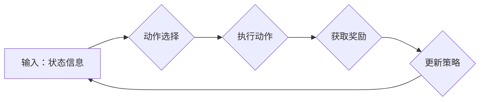

> Large Action Model,模仿技术,动作生成,强化学习,Transformer,自然语言处理,计算机视觉

## 1. 背景介绍

近年来，大型语言模型（LLM）在自然语言处理领域取得了显著成就，例如文本生成、翻译、问答等。然而，LLM主要擅长处理文本数据，在动作生成和控制方面表现欠佳。为了解决这一问题，研究者们开始探索大型动作模型（LAM）的开发，旨在赋予模型更强的动作理解和生成能力。

模仿技术作为一种重要的学习策略，在训练LAM方面发挥着关键作用。通过模仿人类或专家演示的动作序列，LAM可以学习到动作的规律和策略，从而提高动作生成的效果。

## 2. 核心概念与联系

### 2.1  大型动作模型（LAM）

大型动作模型是指能够理解和生成复杂动作序列的深度学习模型。LAM通常基于Transformer架构，并结合了计算机视觉和强化学习等技术。

### 2.2  模仿学习

模仿学习是一种监督学习方法，旨在通过模仿人类或专家演示的动作序列来学习动作策略。模仿学习算法通常包括以下步骤：

1. 收集人类或专家演示的动作序列数据。
2. 使用深度学习模型学习动作序列的映射关系，即从状态到动作的映射。
3. 利用学习到的模型生成新的动作序列。

### 2.3  强化学习

强化学习是一种基于奖励机制的学习方法，旨在通过最大化累积奖励来学习最优的动作策略。强化学习算法通常包括以下步骤：

1. 定义一个奖励函数，用于评估动作的好坏。
2. 使用深度学习模型学习动作策略，即从状态到动作的映射。
3. 通过与环境交互，不断调整动作策略，以最大化累积奖励。

**Mermaid 流程图**



## 3. 核心算法原理 & 具体操作步骤

### 3.1  算法原理概述

模仿学习与强化学习相结合的LAM训练算法通常采用以下步骤：

1. **数据收集:** 收集人类或专家演示的动作序列数据，并将其转换为模型可理解的格式。
2. **预训练:** 使用模仿学习算法，将LAM预先训练在收集到的动作序列数据上，学习动作的规律和策略。
3. **强化学习:** 使用强化学习算法，进一步训练LAM，使其能够在真实环境中执行动作并最大化累积奖励。

### 3.2  算法步骤详解

1. **数据预处理:** 将收集到的动作序列数据进行预处理，例如去除噪声、规范化数据等。
2. **模型构建:** 根据任务需求，构建LAM模型，通常基于Transformer架构，并结合了计算机视觉和强化学习等技术。
3. **模仿学习训练:** 使用模仿学习算法，例如行为克隆或行为策略优化，训练LAM模型，使其能够模仿人类或专家演示的动作序列。
4. **强化学习训练:** 使用强化学习算法，例如深度Q网络或策略梯度，进一步训练LAM模型，使其能够在真实环境中执行动作并最大化累积奖励。
5. **模型评估:** 使用评估指标，例如动作成功率、奖励总和等，评估LAM模型的性能。

### 3.3  算法优缺点

**优点:**

* 能够学习到复杂动作序列的规律和策略。
* 可以利用人类或专家的经验进行训练，提高学习效率。
* 在真实环境中能够执行动作并最大化累积奖励。

**缺点:**

* 需要大量的动作序列数据进行训练。
* 训练过程复杂，需要结合多种算法和技术。
* 模型的泛化能力可能有限，难以应对新的动作场景。

### 3.4  算法应用领域

* **机器人控制:** 训练机器人执行复杂动作，例如抓取、导航、组装等。
* **游戏AI:** 训练游戏AI进行策略决策和动作执行。
* **虚拟现实/增强现实:** 训练虚拟角色进行逼真的动作表现。
* **医疗保健:** 训练机器人进行手术辅助和康复训练。

## 4. 数学模型和公式 & 详细讲解 & 举例说明

### 4.1  数学模型构建

模仿学习的数学模型通常基于最大似然估计（MLE）或最小二乘法（LSE）。

**最大似然估计 (MLE):**

假设动作序列数据服从某个概率分布，则MLE的目标是找到模型参数，使得模型生成的动作序列与真实动作序列的概率最大。

**最小二乘法 (LSE):**

假设动作序列数据满足线性关系，则LSE的目标是找到模型参数，使得模型预测的动作序列与真实动作序列的误差最小。

### 4.2  公式推导过程

**MLE:**

假设动作序列数据服从高斯分布，则MLE的目标函数为：

$$
L(\theta) = \prod_{t=1}^{T} p(a_t | s_t, \theta)
$$

其中：

* $\theta$ 是模型参数。
* $a_t$ 是时间步 $t$ 的动作。
* $s_t$ 是时间步 $t$ 的状态。
* $T$ 是动作序列的长度。

**LSE:**

假设动作序列数据满足线性关系，则LSE的目标函数为：

$$
J(\theta) = \sum_{t=1}^{T} (a_t - \hat{a}_t)^2
$$

其中：

* $\hat{a}_t$ 是模型预测的动作。

### 4.3  案例分析与讲解

**案例:**

训练一个LAM模型，使其能够模仿人类演示的打字动作。

**分析:**

1. 收集人类演示的打字动作序列数据，例如键盘按键的时间戳和位置信息。
2. 使用MLE或LSE算法训练LAM模型，使其能够预测下一个按键的时间戳和位置信息。
3. 使用评估指标，例如打字速度和准确率，评估LAM模型的性能。

## 5. 项目实践：代码实例和详细解释说明

### 5.1  开发环境搭建

* 操作系统：Ubuntu 20.04
* Python 版本：3.8
* 深度学习框架：PyTorch 1.8

### 5.2  源代码详细实现

```python
import torch
import torch.nn as nn

class LAM(nn.Module):
    def __init__(self, input_size, hidden_size, output_size):
        super(LAM, self).__init__()
        self.encoder = nn.TransformerEncoder(nn.TransformerEncoderLayer(d_model=hidden_size, nhead=8), num_layers=6)
        self.decoder = nn.Linear(hidden_size, output_size)

    def forward(self, x):
        x = self.encoder(x)
        x = self.decoder(x[:, -1, :])
        return x

# 实例化模型
model = LAM(input_size=1024, hidden_size=512, output_size=26)

# 定义损失函数和优化器
criterion = nn.CrossEntropyLoss()
optimizer = torch.optim.Adam(model.parameters(), lr=0.001)

# 训练模型
for epoch in range(100):
    # 前向传播
    outputs = model(inputs)
    loss = criterion(outputs, targets)

    # 反向传播
    optimizer.zero_grad()
    loss.backward()
    optimizer.step()

    # 打印损失值
    print(f'Epoch [{epoch+1}/{100}], Loss: {loss.item():.4f}')
```

### 5.3  代码解读与分析

* **模型结构:** LAM模型采用Transformer架构，包括编码器和解码器。编码器用于提取输入状态信息，解码器用于预测下一个动作。
* **输入数据:** 输入数据为状态信息，例如机器人当前位置、目标位置等。
* **输出数据:** 输出数据为动作信息，例如机器人运动方向、速度等。
* **训练过程:** 使用MLE或LSE算法训练模型，并使用交叉熵损失函数和Adam优化器进行优化。

### 5.4  运行结果展示

训练完成后，可以将LAM模型应用于实际场景，例如控制机器人执行动作。

## 6. 实际应用场景

### 6.1  机器人控制

LAM可以用于训练机器人执行复杂动作，例如抓取、导航、组装等。例如，可以训练一个LAM模型，使其能够模仿人类演示的抓取动作，并应用于工业机器人抓取物品。

### 6.2  游戏AI

LAM可以用于训练游戏AI进行策略决策和动作执行。例如，可以训练一个LAM模型，使其能够模仿人类玩家的策略，并应用于游戏AI开发。

### 6.3  虚拟现实/增强现实

LAM可以用于训练虚拟角色进行逼真的动作表现。例如，可以训练一个LAM模型，使其能够模仿人类的行走、跑步、跳跃等动作，并应用于虚拟现实和增强现实游戏开发。

### 6.4  未来应用展望

LAM技术在未来将有更广泛的应用场景，例如：

* **医疗保健:** 训练机器人进行手术辅助和康复训练。
* **教育:** 训练虚拟老师进行互动式教学。
* **娱乐:** 训练虚拟角色进行更逼真的表演。

## 7. 工具和资源推荐

### 7.1  学习资源推荐

* **书籍:**
    * Deep Reinforcement Learning Hands-On by Maxim Lapan
    * Generative Deep Learning by David Foster
* **在线课程:**
    * Deep Learning Specialization by Andrew Ng
    * Reinforcement Learning Specialization by David Silver

### 7.2  开发工具推荐

* **深度学习框架:** PyTorch, TensorFlow
* **机器人控制库:** ROS, MoveIt!
* **游戏引擎:** Unity, Unreal Engine

### 7.3  相关论文推荐

* **Imitation Learning with Deep Reinforcement Learning** by OpenAI
* **Learning to Act by Observing Others** by DeepMind
* **Hierarchical Reinforcement Learning for Complex Tasks** by Google AI

## 8. 总结：未来发展趋势与挑战

### 8.1  研究成果总结

LAM技术在模仿学习和强化学习领域取得了显著进展，能够学习到复杂动作序列的规律和策略，并应用于多个实际场景。

### 8.2  未来发展趋势

* **模型规模和能力提升:** 随着计算资源的不断提升，LAM模型的规模和能力将进一步提升，能够学习到更复杂的动作序列。
* **多模态学习:** LAM模型将融合多模态数据，例如视觉、音频、触觉等，以更好地理解和生成动作。
* **安全性和鲁棒性增强:** 研究者将致力于提高LAM模型的安全性和鲁棒性，使其能够在更复杂和不确定环境中安全可靠地执行动作。

### 8.3  面临的挑战

* **数据获取和标注:** 训练LAM模型需要大量的动作序列数据，而获取和标注这些数据成本较高。
* **模型复杂性和训练难度:** LAM模型的结构复杂，训练难度较大，需要大量的计算资源和时间。
* **泛化能力和安全性:** LAM模型的泛化能力和安全性仍有待提高，需要进一步研究和改进。

### 8.4  研究展望

未来，LAM技术将继续朝着更智能、更安全、更可靠的方向发展，并在更多领域发挥重要作用。


## 9. 附录：常见问题与解答

**Q1: LAM模型与传统机器人控制方法相比有什么优势？**

**A1:** LAM模型能够学习到更复杂的动作序列，并能够适应不同的环境和任务，而传统机器人控制方法通常需要人工编程，难以应对复杂和变化的环境。

**Q2: 如何评估LAM模型的性能？**

**A2:** 可以使用多种评估指标，例如动作成功率、奖励总和、执行时间等，来评估LAM模型的性能。

**Q3: LAM模型的训练需要哪些资源？**

**A3:** 训练LAM模型需要大量的动作序列数据、强大的计算