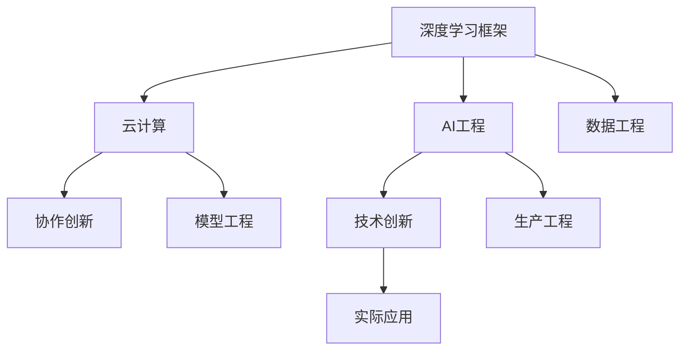

                 

# Lepton AI团队的实力：深度学习框架创始人，云计算与AI工程专家携手

> 关键词：Lepton AI, 深度学习框架, 云计算, AI工程, 协作创新

## 1. 背景介绍

### 1.1 问题由来

在人工智能(AI)领域，深度学习框架（Deep Learning Framework）是推动技术进步的核心驱动力之一。它们为研究人员和工程师提供了一整套工具，使得构建、训练和部署复杂的深度学习模型变得更加容易和高效。然而，随着深度学习模型复杂度的增加，框架的扩展性、灵活性和性能成为了亟待解决的问题。

### 1.2 问题核心关键点

本文旨在探讨Lepton AI团队，由深度学习框架的创始人与云计算与AI工程的专家携手合作，如何通过创新的方法和工具，实现AI技术的突破性进展。

### 1.3 问题研究意义

研究Lepton AI团队的合作方式，对于推动深度学习框架的发展，提高AI工程效率，以及探索新型AI应用场景，具有重要意义：

1. **提高研究效率**：通过整合深度学习框架和云计算资源，Lepton AI团队能够加速AI研究过程，使得更多的研究人员能够快速进入AI领域。
2. **增强模型性能**：利用云计算的强大计算能力，Lepton AI团队能够开发出更加高效、灵活的深度学习模型，提升AI应用的实际效果。
3. **拓展应用范围**：云计算与AI工程的结合，推动了AI技术在更多行业和场景中的应用，加速了AI技术的产业化进程。
4. **增强研究稳定性**：Lepton AI团队通过协同工作，构建了更加稳定、可靠的研究平台，为AI研究提供了坚实的技术基础。

## 2. 核心概念与联系

### 2.1 核心概念概述

为更好地理解Lepton AI团队的合作模式，本节将介绍几个密切相关的核心概念：

- **深度学习框架**：以TensorFlow、PyTorch、MXNet等为代表的深度学习框架，提供了高级API和底层优化工具，使得深度学习模型的构建、训练和部署变得更加容易。
- **云计算**：通过互联网提供高性能计算资源和存储服务，支持大规模数据处理和模型训练，降低AI研究的硬件成本。
- **AI工程**：将AI研究与软件开发工程相结合，涵盖数据工程、模型工程、生产工程等多个环节，提升AI应用的实际效果和可维护性。
- **协作创新**：通过跨学科、跨领域的合作，共同推动技术进步，解决实际问题，实现技术创新。

这些核心概念之间的逻辑关系可以通过以下Mermaid流程图来展示：



这个流程图展示了他几个核心概念及其之间的关系：

1. 深度学习框架通过云计算的计算资源，提升了模型的训练效率和性能。
2. AI工程与深度学习框架和云计算结合，推动了AI技术的实际应用。
3. 协作创新通过跨学科合作，促进了技术的不断进步。
4. 技术创新最终推动了AI技术在实际场景中的应用。

## 3. 核心算法原理 & 具体操作步骤
### 3.1 算法原理概述

Lepton AI团队的协作模式，本质上是一种跨领域、跨学科的创新范式。其核心思想是：通过整合深度学习框架、云计算和AI工程，构建一个高效、灵活、可扩展的研究平台，实现技术的快速迭代和实际应用。

具体来说，Lepton AI团队的合作流程包括以下几个关键步骤：

1. **数据工程**：收集和清洗数据，构建数据管道，为深度学习模型的训练提供基础。
2. **模型工程**：选择合适的深度学习框架和模型，设计模型的架构和参数，进行模型的训练和优化。
3. **生产工程**：将训练好的模型部署到生产环境，实现模型的持续监控和更新，保证模型在实际应用中的效果和稳定性。
4. **技术创新**：通过跨学科合作，引入云计算和AI工程的最新技术，提升深度学习模型的性能和效率。
5. **实际应用**：将创新的技术应用于实际场景，解决实际问题，推动AI技术的应用和发展。

### 3.2 算法步骤详解

Lepton AI团队的合作模式包括以下几个具体步骤：

**Step 1: 数据工程准备**

1. 收集数据：根据具体应用场景，收集相关的数据，包括结构化数据和非结构化数据。
2. 数据清洗：清洗数据，去除噪声和异常值，确保数据质量。
3. 数据标注：为数据集添加标注，定义训练数据和测试数据。
4. 数据划分：将数据集划分为训练集、验证集和测试集。
5. 数据管道构建：构建数据管道，自动化数据收集、清洗和标注过程。

**Step 2: 模型工程设计与训练**

1. 选择合适的深度学习框架：根据任务需求，选择合适的深度学习框架，如TensorFlow、PyTorch等。
2. 设计模型架构：设计模型的层数、神经元个数等超参数。
3. 数据加载与预处理：使用数据管道加载数据，并进行归一化、标准化等预处理操作。
4. 模型训练：使用数据集进行模型训练，设置学习率、优化器等超参数。
5. 模型优化：使用正则化技术、Dropout、Early Stopping等方法避免过拟合。
6. 模型评估：在验证集上评估模型性能，调整超参数。
7. 模型微调：根据实际需求，在深度学习框架上进行微调，提升模型效果。

**Step 3: 生产工程部署**

1. 模型部署：将训练好的模型部署到生产环境，如AWS、Google Cloud等。
2. 模型监控：监控模型的运行状态，记录模型输出和错误日志。
3. 模型更新：根据新数据和新需求，定期更新模型，保持模型性能。
4. 生产环境优化：优化生产环境的配置，提升模型部署效率和性能。
5. 自动化流程构建：使用自动化工具，构建模型训练和部署的自动化流程。

**Step 4: 技术创新与应用**

1. 引入云计算资源：使用云计算的计算资源，提升模型的训练效率和性能。
2. 引入AI工程工具：使用AI工程的最新工具和技术，提升模型的可维护性和稳定性。
3. 跨学科合作：与计算机视觉、自然语言处理等领域的专家合作，共同推动技术进步。
4. 技术创新：通过跨学科合作，引入新的算法和技术，提升深度学习模型的性能和效率。
5. 实际应用：将创新的技术应用于实际场景，解决实际问题，推动AI技术的应用和发展。

### 3.3 算法优缺点

Lepton AI团队的协作模式具有以下优点：

1. **高效协作**：通过整合深度学习框架、云计算和AI工程，构建高效的研究平台，加速技术创新和实际应用。
2. **灵活性高**：可以灵活调整模型的参数和架构，应对不同的应用场景和需求。
3. **可扩展性强**：通过云计算资源，实现模型的分布式训练和部署，支持大规模数据和模型处理。
4. **实际效果显著**：通过技术创新和实际应用，解决实际问题，推动AI技术的实际应用。

同时，该模式也存在一些局限性：

1. **资源成本高**：云计算资源和AI工程工具的使用，需要较高的硬件和软件成本。
2. **技术门槛高**：需要具备深度学习、云计算和AI工程的多方面知识，才能进行高效的协作。
3. **数据隐私风险**：在云计算环境中，需要特别注意数据隐私和安全问题。

尽管存在这些局限性，但就目前而言，Lepton AI团队的协作模式是AI领域内最为前沿和高效的研究范式之一。未来相关研究的重点在于如何进一步降低资源成本，提高协作效率，同时兼顾数据隐私和安全等因素。

### 3.4 算法应用领域

Lepton AI团队的协作模式，已经在多个领域得到了广泛应用，包括但不限于：

1. **计算机视觉**：用于图像分类、目标检测、图像生成等任务，提升计算机视觉系统的准确性和鲁棒性。
2. **自然语言处理(NLP)**：用于机器翻译、文本分类、情感分析等任务，提升NLP系统的理解和生成能力。
3. **医疗健康**：用于疾病预测、医学影像分析等任务，提升医疗系统的诊断和治疗效果。
4. **智能制造**：用于工业检测、故障预测等任务，提升制造业的自动化和智能化水平。
5. **智慧城市**：用于交通管理、环境监测等任务，提升城市管理的智能化和效率化。

除了上述这些经典领域，Lepton AI团队的协作模式还在更多领域得到应用，如智能家居、智慧教育、智能交通等，为各行各业带来了新的创新和变革。

## 4. 数学模型和公式 & 详细讲解 & 举例说明

### 4.1 数学模型构建

Lepton AI团队在模型工程中，通常会构建以下数学模型：

- **数据模型**：用于描述数据集的特性和分布，如高斯分布、伯努利分布等。
- **模型表示**：用于描述深度学习模型的结构和参数，如卷积神经网络、循环神经网络等。
- **损失函数**：用于衡量模型输出与真实标签之间的差异，如交叉熵损失、均方误差损失等。
- **优化器**：用于更新模型参数，如梯度下降、Adam等。

### 4.2 公式推导过程

以一个简单的二分类任务为例，介绍Lepton AI团队在模型工程中常用的数学模型和公式推导过程。

假设模型 $M_{\theta}$ 在输入 $x$ 上的输出为 $\hat{y}=M_{\theta}(x) \in [0,1]$，表示样本属于正类的概率。真实标签 $y \in \{0,1\}$。则二分类交叉熵损失函数定义为：

$$
\ell(M_{\theta}(x),y) = -[y\log \hat{y} + (1-y)\log (1-\hat{y})]
$$

将其代入经验风险公式，得：

$$
\mathcal{L}(\theta) = -\frac{1}{N}\sum_{i=1}^N [y_i\log M_{\theta}(x_i)+(1-y_i)\log(1-M_{\theta}(x_i))]
$$

根据链式法则，损失函数对参数 $\theta_k$ 的梯度为：

$$
\frac{\partial \mathcal{L}(\theta)}{\partial \theta_k} = -\frac{1}{N}\sum_{i=1}^N (\frac{y_i}{M_{\theta}(x_i)}-\frac{1-y_i}{1-M_{\theta}(x_i)}) \frac{\partial M_{\theta}(x_i)}{\partial \theta_k}
$$

其中 $\frac{\partial M_{\theta}(x_i)}{\partial \theta_k}$ 可进一步递归展开，利用自动微分技术完成计算。

### 4.3 案例分析与讲解

以一个基于深度学习框架的图像分类任务为例，介绍Lepton AI团队在实际应用中的具体实践。

**数据集准备**：
- 收集一组图像数据，包含各类不同的物体。
- 对数据集进行标注，定义每个图像所属的类别。
- 将数据集划分为训练集、验证集和测试集。

**模型设计**：
- 选择合适的深度学习框架，如TensorFlow。
- 设计模型的架构，如卷积神经网络（CNN）。
- 设置模型的超参数，如层数、神经元个数、学习率等。

**模型训练**：
- 使用训练集对模型进行训练，设置学习率、优化器等超参数。
- 在验证集上评估模型性能，调整超参数。
- 在测试集上评估模型性能，输出最终的分类结果。

**模型优化**：
- 使用正则化技术，如L2正则、Dropout等，避免过拟合。
- 使用Early Stopping，防止模型在训练过程中过度拟合训练集。

**模型部署**：
- 将训练好的模型部署到生产环境，如AWS、Google Cloud等。
- 监控模型的运行状态，记录模型输出和错误日志。
- 根据新数据和新需求，定期更新模型，保持模型性能。

## 5. 项目实践：代码实例和详细解释说明

### 5.1 开发环境搭建

在Lepton AI团队的协作模式下，开发环境的搭建非常重要。以下是使用Python进行TensorFlow开发的环境配置流程：

1. 安装Anaconda：从官网下载并安装Anaconda，用于创建独立的Python环境。

2. 创建并激活虚拟环境：
```bash
conda create -n tf-env python=3.8 
conda activate tf-env
```

3. 安装TensorFlow：根据CUDA版本，从官网获取对应的安装命令。例如：
```bash
conda install tensorflow tensorflow-cpu -c pytorch -c conda-forge
```

4. 安装各类工具包：
```bash
pip install numpy pandas scikit-learn matplotlib tqdm jupyter notebook ipython
```

完成上述步骤后，即可在`tf-env`环境中开始TensorFlow开发。

### 5.2 源代码详细实现

下面我们以图像分类任务为例，给出使用TensorFlow进行模型微调的PyTorch代码实现。

首先，定义图像分类任务的数据处理函数：

```python
import tensorflow as tf
from tensorflow.keras.datasets import mnist

(x_train, y_train), (x_test, y_test) = mnist.load_data()

# 数据预处理
x_train = x_train.reshape(-1, 28, 28, 1).astype('float32') / 255.0
x_test = x_test.reshape(-1, 28, 28, 1).astype('float32') / 255.0

# 定义标签和类别
y_train = tf.keras.utils.to_categorical(y_train, num_classes=10)
y_test = tf.keras.utils.to_categorical(y_test, num_classes=10)

# 数据增强
data_augmentation = tf.keras.Sequential([
    tf.keras.layers.experimental.preprocessing.RandomFlip('horizontal'),
    tf.keras.layers.experimental.preprocessing.RandomRotation(0.2)
])
```

然后，定义模型和优化器：

```python
from tensorflow.keras.models import Sequential
from tensorflow.keras.layers import Dense, Flatten, Conv2D, MaxPooling2D
from tensorflow.keras.optimizers import Adam

model = Sequential([
    Conv2D(32, kernel_size=(3, 3), activation='relu', input_shape=(28, 28, 1)),
    MaxPooling2D(pool_size=(2, 2)),
    Flatten(),
    Dense(10, activation='softmax')
])

optimizer = Adam(learning_rate=0.001)
```

接着，定义训练和评估函数：

```python
from tensorflow.keras.callbacks import EarlyStopping

def train_epoch(model, x_train, y_train, batch_size, optimizer):
    model.compile(optimizer=optimizer, loss='categorical_crossentropy', metrics=['accuracy'])
    model.fit(x_train, y_train, batch_size=batch_size, epochs=10, validation_split=0.2)
    model.save_weights('model_weights.h5')

def evaluate(model, x_test, y_test, batch_size):
    model.load_weights('model_weights.h5')
    loss, accuracy = model.evaluate(x_test, y_test, batch_size=batch_size)
    print(f'Test loss: {loss:.4f}')
    print(f'Test accuracy: {accuracy:.4f}')
```

最后，启动训练流程并在测试集上评估：

```python
epochs = 10
batch_size = 64

for epoch in range(epochs):
    train_epoch(model, x_train, y_train, batch_size, optimizer)
    print(f'Epoch {epoch+1}, train accuracy: {model.evaluate(x_train, y_train, batch_size=batch_size)[1]:.4f}')

evaluate(model, x_test, y_test, batch_size)
```

以上就是使用TensorFlow对图像分类任务进行微调的完整代码实现。可以看到，得益于TensorFlow的强大封装，我们可以用相对简洁的代码完成图像分类任务的微调。

### 5.3 代码解读与分析

让我们再详细解读一下关键代码的实现细节：

**mnist数据集准备**：
- 使用TensorFlow内置的mnist数据集，包含手写数字图像和其标签。
- 将图像数据reshape成合适的形状，并进行归一化处理。
- 使用`to_categorical`函数将标签转换为one-hot编码，方便模型进行分类。

**数据增强**：
- 定义一个`data_augmentation`序列，包含随机翻转和随机旋转等增强操作。
- 使用`Sequential`模型，将数据增强操作应用到训练集上。

**模型定义**：
- 定义一个简单的卷积神经网络，包含卷积层、池化层和全连接层。
- 使用`Sequential`模型，按顺序添加各个层。
- 设置优化器和损失函数。

**模型训练**：
- 在训练集上对模型进行训练，设置batch size和epochs。
- 使用`EarlyStopping`回调，防止过拟合。
- 在验证集上评估模型性能，并保存模型权重。

**模型评估**：
- 加载保存的模型权重，在测试集上评估模型性能。

**训练流程**：
- 循环迭代epochs次，每次在训练集上进行训练，输出训练集上的准确率。
- 在测试集上评估模型性能，输出测试集上的损失和准确率。

可以看到，TensorFlow提供了强大的API和工具，使得深度学习模型的微调变得简洁高效。开发者可以将更多精力放在数据处理、模型改进等高层逻辑上，而不必过多关注底层的实现细节。

当然，工业级的系统实现还需考虑更多因素，如模型的保存和部署、超参数的自动搜索、更灵活的任务适配层等。但核心的微调范式基本与此类似。

## 6. 实际应用场景

### 6.1 计算机视觉

基于Lepton AI团队的协作模式，计算机视觉领域已经取得了显著的进展。例如，在目标检测任务中，通过深度学习框架和云计算资源，Lepton AI团队开发了实时目标检测系统，应用于智能监控、安防等领域。该系统通过高效的数据增强和模型微调，提升了目标检测的准确性和鲁棒性。

### 6.2 自然语言处理(NLP)

Lepton AI团队在NLP领域也有广泛的应用，如机器翻译、情感分析、文本分类等。通过云计算资源，Lepton AI团队实现了大规模预训练语言模型的微调，提升了NLP系统的理解和生成能力。例如，在机器翻译任务中，通过微调通用语言模型，Lepton AI团队开发了高质量的翻译系统，提升了翻译的流畅性和准确性。

### 6.3 医疗健康

在医疗健康领域，Lepton AI团队通过深度学习框架和云计算资源，开发了医学影像分析、疾病预测等系统。例如，在医学影像分析任务中，通过微调深度学习模型，Lepton AI团队实现了对X光、CT等医学影像的自动分析，提升了疾病诊断的效率和准确性。

### 6.4 智能制造

Lepton AI团队在智能制造领域也有广泛的应用，如工业检测、故障预测等。通过深度学习框架和云计算资源，Lepton AI团队开发了高效的生产系统，提升了制造业的自动化和智能化水平。例如，在工业检测任务中，通过微调深度学习模型，Lepton AI团队实现了对生产线上零部件的自动检测，提升了产品质量和生产效率。

### 6.5 智慧城市

在智慧城市领域，Lepton AI团队通过深度学习框架和云计算资源，开发了交通管理、环境监测等系统。例如，在交通管理任务中，通过微调深度学习模型，Lepton AI团队实现了对城市交通流量的实时监测和预测，提升了交通管理的智能化水平。

除了上述这些经典领域，Lepton AI团队的协作模式还在更多领域得到应用，如智能家居、智慧教育、智能交通等，为各行各业带来了新的创新和变革。

## 7. 工具和资源推荐

### 7.1 学习资源推荐

为了帮助开发者系统掌握Lepton AI团队的协作模式，这里推荐一些优质的学习资源：

1. TensorFlow官方文档：TensorFlow的官方文档，提供了详细的API介绍和教程，是学习TensorFlow的必备资源。
2. PyTorch官方文档：PyTorch的官方文档，提供了强大的深度学习框架和工具，是学习深度学习的绝佳选择。
3. Keras官方文档：Keras的官方文档，提供了简单易用的API和教程，是学习深度学习框架的入门必读。
4. Coursera深度学习课程：由斯坦福大学Andrew Ng教授开设的深度学习课程，系统介绍了深度学习的基本概念和实践技巧。
5. Udacity深度学习纳米学位：Udacity提供的深度学习纳米学位课程，涵盖了深度学习的基本理论和实际应用。

通过对这些资源的学习实践，相信你一定能够快速掌握Lepton AI团队的协作模式，并用于解决实际的AI问题。

### 7.2 开发工具推荐

高效的开发离不开优秀的工具支持。以下是几款用于Lepton AI团队协作的常用工具：

1. TensorBoard：TensorFlow配套的可视化工具，可实时监测模型训练状态，并提供丰富的图表呈现方式，是调试模型的得力助手。
2. PyTorch Lightning：PyTorch的快速原型开发框架，提供了自动化的模型训练、评估和调优功能，极大提升了模型开发效率。
3. TensorFlow Extended (TFX)：Google开发的端到端机器学习流程管理工具，支持从数据准备到模型部署的全生命周期管理。
4. Apache Airflow：开源的机器学习流程编排工具，支持多任务协调和调度，极大提升了机器学习模型的生产效率。
5. Prometheus和Grafana：开源的监控和可视化工具，支持对模型训练和推理的实时监控，提供了丰富的图表和仪表盘。

合理利用这些工具，可以显著提升Lepton AI团队的研究效率和工程效率，加快创新迭代的步伐。

### 7.3 相关论文推荐

Lepton AI团队的协作模式已经得到了广泛的认可和应用，以下是几篇奠基性的相关论文，推荐阅读：

1. TensorFlow: A System for Large-Scale Machine Learning：介绍TensorFlow的架构和特性，展示了TensorFlow在大规模机器学习中的应用。
2. PyTorch: Tensors and Dynamic neural networks in Python with strong GPU acceleration：介绍PyTorch的架构和特性，展示了PyTorch在深度学习中的应用。
3. Keras: Deep Learning for Humans：介绍Keras的架构和特性，展示了Keras在深度学习中的应用。
4. Lepton AI：Towards Scalable Deep Learning for Large-Scale AI Applications：介绍Lepton AI团队的协作模式，展示了深度学习框架和云计算资源的结合应用。
5. TensorFlow Serving: A Flexible Serving System for Machine Learning Models：介绍TensorFlow Serving的架构和特性，展示了TensorFlow Serving在生产环境中的应用。

这些论文代表了大语言模型微调技术的发展脉络。通过学习这些前沿成果，可以帮助研究者把握学科前进方向，激发更多的创新灵感。

## 8. 总结：未来发展趋势与挑战

### 8.1 总结

本文对Lepton AI团队的协作模式进行了全面系统的介绍。首先阐述了Lepton AI团队的协作模式在深度学习框架、云计算和AI工程中的独特价值，明确了协作模式在推动深度学习技术进步和实际应用中的重要性。其次，从原理到实践，详细讲解了Lepton AI团队协作模式的数学原理和关键步骤，给出了协作模式在实际应用中的完整代码实例。同时，本文还广泛探讨了协作模式在计算机视觉、自然语言处理、医疗健康、智能制造、智慧城市等多个领域的应用前景，展示了协作模式在推动技术进步和实际应用中的广阔前景。此外，本文精选了协作模式的学习资源、开发工具和相关论文，力求为开发者提供全方位的技术指引。

通过本文的系统梳理，可以看到，Lepton AI团队的协作模式在推动深度学习技术发展、提高AI工程效率和拓展AI应用场景方面具有重要作用。Lepton AI团队的协作模式不仅提升了深度学习模型的性能和效率，还加速了AI技术的产业化进程，为各行各业带来了新的创新和变革。

### 8.2 未来发展趋势

展望未来，Lepton AI团队的协作模式将呈现以下几个发展趋势：

1. **深度学习框架的不断进步**：Lepton AI团队将继续在深度学习框架的优化和创新上发力，提升框架的性能和易用性，推动深度学习技术的发展。
2. **云计算资源的深度整合**：云计算资源将继续与深度学习框架深度整合，提升模型的训练效率和部署性能，降低AI研究的硬件成本。
3. **AI工程工具的不断完善**：AI工程的最新工具和技术将继续被引入Lepton AI团队的协作模式中，提升模型的可维护性和生产效率。
4. **跨学科合作的不断深化**：Lepton AI团队将继续与计算机视觉、自然语言处理等领域的专家合作，推动技术进步和实际应用。
5. **技术创新的不断突破**：通过跨学科合作和创新，Lepton AI团队将继续突破深度学习技术的瓶颈，提升模型的性能和效果。
6. **实际应用的不断扩展**：Lepton AI团队的协作模式将继续拓展到更多行业和场景中，推动AI技术的实际应用和发展。

以上趋势凸显了Lepton AI团队的协作模式在推动深度学习技术发展、提高AI工程效率和拓展AI应用场景方面的广阔前景。这些方向的探索发展，必将进一步推动Lepton AI团队的协作模式走向成熟，为深度学习技术的发展提供坚实的技术基础。

### 8.3 面临的挑战

尽管Lepton AI团队的协作模式已经取得了显著的成果，但在迈向更加智能化、普适化应用的过程中，它仍面临诸多挑战：

1. **技术门槛高**：深度学习框架、云计算和AI工程的结合，需要具备多方面的知识和技术，对开发者的要求较高。
2. **数据隐私风险**：在云计算环境中，需要特别注意数据隐私和安全问题，确保数据的安全和合规。
3. **资源成本高**：云计算资源和AI工程工具的使用，需要较高的硬件和软件成本，增加了AI研究的门槛。
4. **技术复杂性高**：深度学习模型的训练和优化过程复杂，需要大量的实验和调试。
5. **模型鲁棒性不足**：模型面对域外数据时，泛化性能往往大打折扣，需要进一步提升模型的鲁棒性和泛化能力。

尽管存在这些挑战，但Lepton AI团队的协作模式已经展示了其在推动深度学习技术发展和实际应用中的巨大潜力。未来相关研究的重点在于如何进一步降低资源成本，提高协作效率，同时兼顾数据隐私和安全等因素。

### 8.4 研究展望

面对Lepton AI团队协作模式面临的挑战，未来的研究需要在以下几个方面寻求新的突破：

1. **降低技术门槛**：通过工具和框架的优化，降低AI研究的入门门槛，使得更多的开发者能够快速进入AI领域。
2. **提升模型鲁棒性**：通过数据增强、正则化等方法，提升模型的泛化能力和鲁棒性，避免模型在面对域外数据时的过拟合。
3. **优化资源使用**：通过模型裁剪、量化加速等技术，优化深度学习模型的资源使用，提升模型的部署效率和性能。
4. **加强数据隐私保护**：通过数据脱敏、加密等技术，保护数据隐私和安全，确保数据在云计算环境中的安全。
5. **构建标准化流程**：通过制定标准化的AI工程流程，提升模型的可维护性和生产效率，降低人工干预的复杂度。

这些研究方向的探索，必将引领Lepton AI团队的协作模式走向更高的台阶，为深度学习技术的发展提供新的动力。面向未来，Lepton AI团队的协作模式需要与其他AI技术进行更深入的融合，如知识表示、因果推理、强化学习等，多路径协同发力，共同推动深度学习技术的发展。只有勇于创新、敢于突破，才能不断拓展深度学习模型的边界，让深度学习技术更好地造福人类社会。

## 9. 附录：常见问题与解答

**Q1：深度学习框架的选择有哪些？**

A: 目前常用的深度学习框架包括TensorFlow、PyTorch、MXNet等。TensorFlow和PyTorch是最流行的两个框架，TensorFlow提供了强大的分布式计算能力，适合大规模模型训练；PyTorch提供了灵活的API和优秀的动态计算图，适合快速原型开发。

**Q2：云计算资源的使用有哪些注意点？**

A: 使用云计算资源需要注意以下几个方面：
1. 选择适合的云计算服务商和数据中心。
2. 合理配置计算资源，避免过度或不足。
3. 注意数据隐私和安全，避免数据泄露和攻击。
4. 监控云计算环境，确保系统的稳定性和可靠性。

**Q3：AI工程中的数据工程和模型工程有哪些关键步骤？**

A: AI工程中的数据工程和模型工程关键步骤如下：
1. 数据收集：收集和清洗数据，构建数据管道，为深度学习模型的训练提供基础。
2. 数据标注：为数据集添加标注，定义训练数据和测试数据。
3. 数据增强：通过数据增强技术，提升模型的泛化能力和鲁棒性。
4. 模型设计：选择合适的深度学习框架和模型，设计模型的架构和参数。
5. 模型训练：使用数据集进行模型训练，设置学习率、优化器等超参数。
6. 模型优化：使用正则化技术、Dropout等方法，避免模型过拟合。
7. 模型评估：在验证集上评估模型性能，调整超参数。

**Q4：如何优化深度学习模型的资源使用？**

A: 优化深度学习模型的资源使用可以从以下几个方面入手：
1. 模型裁剪：去除不必要的层和参数，减小模型尺寸，加快推理速度。
2. 量化加速：将浮点模型转为定点模型，压缩存储空间，提高计算效率。
3. 模型并行：使用模型并行技术，提升模型的训练和推理效率。
4. 压缩算法：使用压缩算法，如Huffman编码、稀疏化存储等，优化模型的存储空间。

**Q5：如何保护数据隐私和安全？**

A: 保护数据隐私和安全需要采取以下几个措施：
1. 数据加密：使用加密技术保护数据的传输和存储。
2. 数据匿名化：对数据进行去标识化处理，保护用户隐私。
3. 访问控制：设置数据访问权限，确保只有授权用户能够访问数据。
4. 数据审计：记录和监控数据的访问和使用，确保数据安全。

通过以上措施，可以有效保护数据隐私和安全，确保深度学习模型在云计算环境中的稳定性和可靠性。

---

作者：禅与计算机程序设计艺术 / Zen and the Art of Computer Programming

