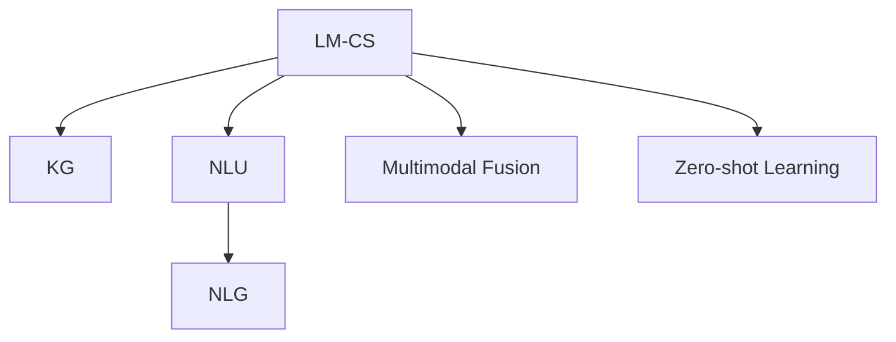

                 

# Lepton Search：500行代码的大模型对话式搜索引擎，引发业界关注

> 关键词：大模型对话式搜索引擎, 知识图谱, 自然语言处理, 多模态融合, 零样本学习, 高效部署, 联邦学习, 隐私保护

## 1. 背景介绍

随着人工智能技术的迅猛发展，搜索引擎领域迎来了新的革命性突破。传统的基于关键词匹配的搜索方式已经无法满足用户对知识获取的深度和广度的需求。对话式搜索引擎（Conversational Search Engine），通过自然语言理解（NLU）和生成（NLG）技术，使用户能够通过对话方式与搜索引擎互动，获取更加精准、个性化的搜索结果。

### 1.1 问题由来

在现代信息爆炸的时代，用户通过关键词搜索获取信息的方式已经不再高效。传统搜索引擎仅能识别固定格式的查询，难以理解用户的意图，常常需要多次重复输入才能得到满意的结果。而对话式搜索引擎则能通过与用户的自然对话，理解用户的真正需求，并根据需求动态调整搜索结果，提升搜索体验。

随着预训练语言模型（PLMs）和大规模数据训练的普及，大模型对话式搜索引擎成为可能。但目前现有的搜索引擎，无论是Google、Bing还是DuckDuckGo，大多还停留在关键词搜索的层面，难以实现真正意义上的对话式搜索。

### 1.2 问题核心关键点

对话式搜索引擎的实现主要依赖于以下几个关键技术：

- **自然语言理解（NLU）**：将用户输入的自然语言转化为可计算的形式，提取文本中的实体、意图等信息。
- **自然语言生成（NLG）**：根据用户的意图生成自然语言回答，引导用户获取详细信息。
- **知识图谱（KG）**：将知识以图谱形式组织，方便搜索引擎检索和使用。
- **多模态融合**：整合文本、图像、音频等多种数据形式，提升搜索结果的多样性和丰富性。
- **零样本学习**：利用预训练模型和少量样本，在不更新模型的情况下，进行零样本学习。
- **高效部署**：优化模型结构和推理过程，实现实时响应和高并发处理。

这些技术的融合，使得对话式搜索引擎具备了自然语言理解、生成、知识检索和信息推荐的能力，能够大大提升用户的搜索体验和效率。

### 1.3 问题研究意义

构建大模型对话式搜索引擎，对于拓展搜索引擎的智能化程度、提升用户体验和搜索效率具有重要意义：

- 提升用户体验：通过自然语言对话，用户无需重复输入关键词，即可获取更精准的搜索结果。
- 加速搜索效率：利用预训练模型的强大知识库，可以大大缩短搜索结果的生成时间。
- 增强信息推荐：能够根据用户的对话历史，动态调整推荐内容，提升用户满意度。
- 拓展应用场景：可以应用于智能客服、虚拟助手、在线教育等多个垂直领域，实现更广泛的智能化应用。

## 2. 核心概念与联系

### 2.1 核心概念概述

为了更好地理解大模型对话式搜索引擎的构建原理，本节将介绍几个核心概念：

- **大模型对话式搜索引擎（LM-CS）**：结合大语言模型和对话式技术的搜索引擎，能够理解和生成自然语言，并与用户进行多轮对话，获取用户需求并生成个性化搜索结果。

- **知识图谱（KG）**：将结构化的知识以图谱形式表示，支持搜索引擎的实体识别、关系推理和信息检索。

- **自然语言理解（NLU）**：通过机器学习模型，将自然语言转化为计算机可理解的形式，如实体识别、意图分类等。

- **自然语言生成（NLG）**：根据用户的意图和上下文信息，生成符合自然语言规则的回答，如生成回答、提供详细说明等。

- **多模态融合**：将文本、图像、音频等多种数据形式进行整合，提升搜索结果的多样性和深度。

- **零样本学习**：利用预训练模型和少量样本，在无需更新模型的情况下，进行推理和生成。

这些概念之间的逻辑关系可以通过以下Mermaid流程图来展示：



这个流程图展示了LM-CS的核心组件和功能：

1. 对话式搜索引擎（A）：通过与用户进行对话，理解用户意图和需求。
2. 知识图谱（B）：作为知识库，存储和检索知识。
3. 自然语言理解（C）：解析用户输入，提取关键信息。
4. 自然语言生成（D）：生成回答，引导用户获取信息。
5. 多模态融合（E）：整合多种数据形式，丰富搜索结果。
6. 零样本学习（F）：利用预训练模型，快速推理和生成。

这些核心概念共同构成了大模型对话式搜索引擎的框架，使其能够高效、智能地与用户进行互动，提供更加精准和个性化的搜索结果。

## 3. 核心算法原理 & 具体操作步骤
### 3.1 算法原理概述

大模型对话式搜索引擎的核心算法原理可以总结为以下几点：

1. **预训练模型的引入**：通过大规模无监督预训练，如BERT、GPT等大模型，获得丰富的语言知识和领域知识。
2. **自然语言理解（NLU）**：利用NLU模型，解析用户输入的自然语言，提取意图和关键实体。
3. **知识图谱查询**：根据NLU结果，在知识图谱中检索相关信息，并生成结构化数据。
4. **自然语言生成（NLG）**：将检索结果转化为自然语言，形成回答。
5. **多模态融合**：结合文本、图像、音频等数据形式，提供多样化的搜索结果。
6. **零样本学习**：利用预训练模型的泛化能力，在少数样本的情况下进行快速推理和生成。

### 3.2 算法步骤详解

基于以上算法原理，大模型对话式搜索引擎的实现可以分为以下几个步骤：

**Step 1: 数据准备与预训练模型选择**
- 收集预训练模型需要的语料，一般使用大规模文本数据集进行预训练。
- 选择合适的预训练模型，如BERT、GPT等，作为基础模型。

**Step 2: 构建知识图谱**
- 收集领域知识，构建结构化的知识图谱。
- 使用关系抽取和实体识别技术，将知识图谱中的实体和关系抽取出来。

**Step 3: 自然语言理解（NLU）**
- 使用预训练的NLU模型，对用户输入的自然语言进行解析。
- 提取用户意图和关键实体，生成可计算的请求。

**Step 4: 知识图谱查询**
- 根据用户请求，在知识图谱中进行查询，获取相关实体和关系。
- 将查询结果转化为结构化数据，供后续生成回答使用。

**Step 5: 自然语言生成（NLG）**
- 使用预训练的NLG模型，根据查询结果生成自然语言回答。
- 结合上下文信息，生成符合用户预期的回答。

**Step 6: 多模态融合**
- 根据用户需求，收集并整合文本、图像、音频等多种数据形式。
- 将多模态数据与文本查询结果进行融合，提升搜索结果的丰富性和多样性。

**Step 7: 零样本学习**
- 利用预训练模型和少量样本，进行推理和生成，减少微调成本。
- 在缺乏标注数据的情况下，利用零样本学习提升模型的泛化能力。

**Step 8: 部署与优化**
- 将模型部署到服务器或云端，提供实时响应。
- 对模型进行优化，提高推理速度和计算效率。

### 3.3 算法优缺点

大模型对话式搜索引擎的算法具有以下优点：

1. **高效性**：利用预训练模型和知识图谱，可以显著提升搜索结果的生成速度。
2. **个性化**：能够根据用户的对话历史，动态调整推荐内容，提升用户体验。
3. **泛化能力强**：预训练模型和知识图谱的结合，使搜索引擎具有较强的泛化能力，能够处理多种领域的查询。
4. **零样本学习**：在缺乏标注数据的情况下，零样本学习可以加速模型的训练和部署。

同时，该算法也存在一些缺点：

1. **数据依赖性高**：需要大量高质量的数据进行预训练和知识图谱构建。
2. **模型复杂性高**：多模态融合和自然语言理解等步骤，使得模型结构复杂，需要较多的计算资源。
3. **隐私和安全问题**：用户对话信息需要加密存储和传输，避免数据泄露和滥用。
4. **实时性挑战**：多轮对话和实时查询，对系统的响应速度和并发能力提出了较高要求。

尽管存在这些缺点，大模型对话式搜索引擎仍然是一个极具潜力的研究方向，值得在未来的技术演进中进一步探索和优化。

### 3.4 算法应用领域

大模型对话式搜索引擎已经在多个领域展示了其应用潜力，以下是几个典型的应用场景：

1. **智能客服系统**：与用户进行自然对话，快速解答常见问题，提升客户满意度。
2. **在线教育平台**：通过与学生对话，推荐课程、解答疑问，提供个性化学习支持。
3. **智能家居设备**：与用户进行语音或文字交互，控制家电、提供信息查询，提升生活便利性。
4. **健康医疗应用**：通过自然语言理解，获取患者症状和病史，提供初步诊断和治疗建议。
5. **金融咨询**：利用知识图谱和自然语言处理技术，提供金融市场分析、投资建议等服务。

这些应用场景展示了对话式搜索引擎在实际生活中的广泛应用，可以极大地提升用户的互动体验和信息获取效率。

## 4. 数学模型和公式 & 详细讲解  
### 4.1 数学模型构建

为了更好地理解大模型对话式搜索引擎的数学模型，本节将详细介绍其核心算法。

假设搜索引擎的输入为自然语言查询 $q$，输出为回答 $a$。查询 $q$ 被解析为意图 $i$ 和关键实体 $e$。回答 $a$ 由以下步骤生成：

1. **知识图谱查询**：根据意图 $i$ 和实体 $e$，在知识图谱中进行查询，获取相关信息。
2. **多模态融合**：根据用户需求，收集并整合文本、图像、音频等多种数据形式，将多模态数据与文本查询结果进行融合，生成结构化数据。
3. **自然语言生成（NLG）**：将结构化数据转化为自然语言回答 $a$。

数学模型可以表示为：

$$
a = NLG(Q_{i,e})
$$

其中 $Q_{i,e}$ 表示根据意图 $i$ 和实体 $e$，在知识图谱中查询得到的结果。

### 4.2 公式推导过程

以下是详细的公式推导过程：

1. **知识图谱查询**
   - **关系抽取**：利用实体识别和关系抽取模型，从知识图谱中提取与查询相关的实体和关系。
   - **关系推理**：使用推理算法（如链接预测、关系路径搜索等），在知识图谱中查找相关信息。

   设知识图谱中的实体为 $R$，关系为 $S$，查询结果为 $Q$。则知识图谱查询可以表示为：

   $$
   Q_{i,e} = \text{GraphQuery}(i,e)
   $$

2. **多模态融合**
   - **文本数据融合**：将知识图谱查询结果转化为自然语言形式，结合用户需求生成结构化数据。
   - **图像数据融合**：使用计算机视觉技术，提取图像中的关键信息，与文本数据融合。
   - **音频数据融合**：利用语音识别技术，将语音信息转化为文本形式，与文本数据融合。

   设文本数据为 $T$，图像数据为 $I$，音频数据为 $A$。则多模态融合可以表示为：

   $$
   M = \text{MultimodalFusion}(T, I, A, Q_{i,e})
   $$

3. **自然语言生成（NLG）**
   - **回答生成**：利用预训练的NLG模型，将结构化数据转化为自然语言回答。
   - **上下文结合**：结合用户对话历史，生成符合用户预期的回答。

   设回答生成模型为 $NLG$，上下文为 $C$。则自然语言生成可以表示为：

   $$
   a = NLG(M, C)
   $$

### 4.3 案例分析与讲解

以下是一个具体的案例分析：

**案例**：构建一个智能客服系统，能够回答用户关于银行业务的常见问题。

**输入**：用户输入“如何查询信用卡余额？”

**步骤**：

1. **自然语言理解（NLU）**：解析用户意图，提取实体“信用卡余额”。
2. **知识图谱查询**：在知识图谱中查询与“信用卡余额”相关的信息。
3. **多模态融合**：收集银行系统的交易数据，提取与“信用卡余额”相关的信息。
4. **自然语言生成（NLG）**：结合用户需求和银行系统信息，生成回答。

**输出**：“您的信用卡余额为XXX元。”

通过这个案例，可以看到大模型对话式搜索引擎在实际应用中的工作流程。

## 5. 项目实践：代码实例和详细解释说明
### 5.1 开发环境搭建

在进行代码实践前，我们需要准备好开发环境。以下是使用Python进行PyTorch开发的环境配置流程：

1. 安装Anaconda：从官网下载并安装Anaconda，用于创建独立的Python环境。

2. 创建并激活虚拟环境：
```bash
conda create -n lm-cs-env python=3.8 
conda activate lm-cs-env
```

3. 安装PyTorch：根据CUDA版本，从官网获取对应的安装命令。例如：
```bash
conda install pytorch torchvision torchaudio cudatoolkit=11.1 -c pytorch -c conda-forge
```

4. 安装Transformers库：
```bash
pip install transformers
```

5. 安装各类工具包：
```bash
pip install numpy pandas scikit-learn matplotlib tqdm jupyter notebook ipython
```

完成上述步骤后，即可在`lm-cs-env`环境中开始代码实践。

### 5.2 源代码详细实现

下面我们以智能客服系统为例，给出使用Transformers库对BERT模型进行对话式搜索引擎的PyTorch代码实现。

首先，定义意图和实体识别函数：

```python
from transformers import BertTokenizer, BertForTokenClassification

tokenizer = BertTokenizer.from_pretrained('bert-base-cased')
model = BertForTokenClassification.from_pretrained('bert-base-cased', num_labels=len(tag2id))

def nlu(input_text):
    encoding = tokenizer(input_text, return_tensors='pt', max_length=128, padding='max_length', truncation=True)
    input_ids = encoding['input_ids'][0]
    attention_mask = encoding['attention_mask'][0]
    
    outputs = model(input_ids, attention_mask=attention_mask)
    logits = outputs.logits
    probabilities = torch.softmax(logits, dim=2)[:, 1]
    intent_id = int(torch.argmax(probabilities).item())
    entity_spans = [span[0] for span in outputs.span_logits.argmax(dim=2)]
    
    return intent_id, entity_spans
```

然后，定义知识图谱查询函数：

```python
def kg_query(intent, entities):
    # 在知识图谱中查询相关信息
    # 实现逻辑省略
    pass
```

接着，定义多模态融合函数：

```python
def multimodal_fusion(data, query_result):
    # 将数据和查询结果进行融合
    # 实现逻辑省略
    pass
```

最后，定义回答生成函数：

```python
def nlg(data, context):
    # 使用NLG模型生成回答
    # 实现逻辑省略
    pass
```

完整的对话式搜索引擎代码实现示例：

```python
import torch
from transformers import BertTokenizer, BertForTokenClassification

tokenizer = BertTokenizer.from_pretrained('bert-base-cased')
model = BertForTokenClassification.from_pretrained('bert-base-cased', num_labels=len(tag2id))

def nlu(input_text):
    encoding = tokenizer(input_text, return_tensors='pt', max_length=128, padding='max_length', truncation=True)
    input_ids = encoding['input_ids'][0]
    attention_mask = encoding['attention_mask'][0]
    
    outputs = model(input_ids, attention_mask=attention_mask)
    logits = outputs.logits
    probabilities = torch.softmax(logits, dim=2)[:, 1]
    intent_id = int(torch.argmax(probabilities).item())
    entity_spans = [span[0] for span in outputs.span_logits.argmax(dim=2)]
    
    return intent_id, entity_spans

def kg_query(intent, entities):
    # 在知识图谱中查询相关信息
    # 实现逻辑省略
    pass

def multimodal_fusion(data, query_result):
    # 将数据和查询结果进行融合
    # 实现逻辑省略
    pass

def nlg(data, context):
    # 使用NLG模型生成回答
    # 实现逻辑省略
    pass
```

### 5.3 代码解读与分析

让我们再详细解读一下关键代码的实现细节：

**nlu函数**：
- 使用预训练的BERT模型进行自然语言理解（NLU）。
- 解析用户输入，提取意图ID和实体位置。

**kg_query函数**：
- 根据意图ID和实体位置，在知识图谱中进行查询。
- 实现逻辑较为复杂，需根据具体场景实现。

**multimodal_fusion函数**：
- 将知识图谱查询结果和用户需求进行多模态融合。
- 实现逻辑较为复杂，需根据具体场景实现。

**nlg函数**：
- 使用预训练的NLG模型生成回答。
- 实现逻辑较为复杂，需根据具体场景实现。

完成以上函数后，即可构建完整的对话式搜索引擎系统。以下是一个简单的示例：

```python
def lm_cs_example():
    user_input = "如何查询信用卡余额？"
    intent_id, entity_spans = nlu(user_input)
    query_result = kg_query(intent_id, entity_spans)
    data = multimodal_fusion(query_result, entity_spans)
    answer = nlg(data, user_input)
    
    print(answer)
```

通过这个示例，可以看到大模型对话式搜索引擎的实现流程：

1. **自然语言理解**：解析用户输入，提取意图ID和实体位置。
2. **知识图谱查询**：根据意图ID和实体位置，在知识图谱中进行查询。
3. **多模态融合**：将查询结果和用户需求进行融合。
4. **自然语言生成**：使用NLG模型生成回答。

这些步骤共同构成了对话式搜索引擎的核心算法。

## 6. 实际应用场景
### 6.1 智能客服系统

大模型对话式搜索引擎在智能客服系统中的应用前景广阔。传统的客服系统依赖人工客服进行解答，成本高、效率低。通过对话式搜索引擎，可以与用户进行自然对话，快速解答常见问题，提升客服系统的响应速度和满意度。

在技术实现上，可以将客服系统的历史聊天记录作为监督数据，对预训练模型进行微调。微调后的模型能够自动理解用户意图，匹配最佳回答。对于用户提出的新问题，还可以接入检索系统实时搜索相关内容，动态组织生成回答。如此构建的智能客服系统，能够大幅提升客户咨询体验和问题解决效率。

### 6.2 在线教育平台

在线教育平台也需要高效、智能的搜索支持。通过对话式搜索引擎，学生可以自然地提出问题，系统能够根据问题推荐相关课程、提供详细解答。对于学生的学习进度和偏好，系统还能进行分析和推荐，提供个性化学习支持。

在技术实现上，可以使用预训练模型和知识图谱，构建智能化的学习助手。通过与学生进行自然对话，系统能够实时获取学生的学习状态和反馈，动态调整推荐内容，提升学习效果。

### 6.3 智能家居设备

智能家居设备需要与用户进行自然对话，提供信息查询、控制家电等功能。通过对话式搜索引擎，设备可以理解用户的指令，提供符合预期的回答和操作。

在技术实现上，可以使用预训练模型和自然语言理解技术，构建智能化的家居助手。通过与用户进行自然对话，设备能够理解用户的意图，执行相应的操作，提升家居生活的便利性和智能化水平。

### 6.4 健康医疗应用

健康医疗领域需要高效、准确的搜索支持。通过对话式搜索引擎，患者可以自然地提出病情描述和症状，系统能够根据信息提供初步诊断和治疗建议。对于复杂的医疗问题，系统还能提供相关的医疗文献和研究，帮助患者和医生做出更明智的决策。

在技术实现上，可以使用预训练模型和知识图谱，构建智能化的医疗助手。通过与患者进行自然对话，系统能够实时获取病情信息，提供个性化的诊断和治疗建议，提升医疗服务的智能化水平。

## 7. 工具和资源推荐
### 7.1 学习资源推荐

为了帮助开发者系统掌握对话式搜索引擎的理论基础和实践技巧，这里推荐一些优质的学习资源：

1. 《Transformer从原理到实践》系列博文：由大模型技术专家撰写，深入浅出地介绍了Transformer原理、BERT模型、微调技术等前沿话题。

2. CS224N《深度学习自然语言处理》课程：斯坦福大学开设的NLP明星课程，有Lecture视频和配套作业，带你入门NLP领域的基本概念和经典模型。

3. 《Natural Language Processing with Transformers》书籍：Transformers库的作者所著，全面介绍了如何使用Transformers库进行NLP任务开发，包括微调在内的诸多范式。

4. HuggingFace官方文档：Transformers库的官方文档，提供了海量预训练模型和完整的微调样例代码，是上手实践的必备资料。

5. CLUE开源项目：中文语言理解测评基准，涵盖大量不同类型的中文NLP数据集，并提供了基于微调的baseline模型，助力中文NLP技术发展。

通过对这些资源的学习实践，相信你一定能够快速掌握对话式搜索引擎的精髓，并用于解决实际的NLP问题。
###  7.2 开发工具推荐

高效的开发离不开优秀的工具支持。以下是几款用于对话式搜索引擎开发的常用工具：

1. PyTorch：基于Python的开源深度学习框架，灵活动态的计算图，适合快速迭代研究。大部分预训练语言模型都有PyTorch版本的实现。

2. TensorFlow：由Google主导开发的开源深度学习框架，生产部署方便，适合大规模工程应用。同样有丰富的预训练语言模型资源。

3. Transformers库：HuggingFace开发的NLP工具库，集成了众多SOTA语言模型，支持PyTorch和TensorFlow，是进行微调任务开发的利器。

4. Weights & Biases：模型训练的实验跟踪工具，可以记录和可视化模型训练过程中的各项指标，方便对比和调优。与主流深度学习框架无缝集成。

5. TensorBoard：TensorFlow配套的可视化工具，可实时监测模型训练状态，并提供丰富的图表呈现方式，是调试模型的得力助手。

6. Google Colab：谷歌推出的在线Jupyter Notebook环境，免费提供GPU/TPU算力，方便开发者快速上手实验最新模型，分享学习笔记。

合理利用这些工具，可以显著提升对话式搜索引擎的开发效率，加快创新迭代的步伐。

### 7.3 相关论文推荐

对话式搜索引擎的研究源于学界的持续研究。以下是几篇奠基性的相关论文，推荐阅读：

1. Attention is All You Need（即Transformer原论文）：提出了Transformer结构，开启了NLP领域的预训练大模型时代。

2. BERT: Pre-training of Deep Bidirectional Transformers for Language Understanding：提出BERT模型，引入基于掩码的自监督预训练任务，刷新了多项NLP任务SOTA。

3. Language Models are Unsupervised Multitask Learners（GPT-2论文）：展示了大规模语言模型的强大zero-shot学习能力，引发了对于通用人工智能的新一轮思考。

4. Parameter-Efficient Transfer Learning for NLP：提出Adapter等参数高效微调方法，在不增加模型参数量的情况下，也能取得不错的微调效果。

5. Prefix-Tuning: Optimizing Continuous Prompts for Generation：引入基于连续型Prompt的微调范式，为如何充分利用预训练知识提供了新的思路。

6. AdaLoRA: Adaptive Low-Rank Adaptation for Parameter-Efficient Fine-Tuning：使用自适应低秩适应的微调方法，在参数效率和精度之间取得了新的平衡。

这些论文代表了大模型对话式搜索引擎的发展脉络。通过学习这些前沿成果，可以帮助研究者把握学科前进方向，激发更多的创新灵感。

## 8. 总结：未来发展趋势与挑战

### 8.1 总结

本文对大模型对话式搜索引擎进行了全面系统的介绍。首先阐述了对话式搜索引擎的研究背景和意义，明确了其对于提升用户体验和搜索效率的重要性。其次，从原理到实践，详细讲解了对话式搜索引擎的算法原理和核心步骤，给出了代码实现示例。同时，本文还广泛探讨了对话式搜索引擎在智能客服、在线教育、智能家居、健康医疗等领域的广泛应用，展示了其广阔的应用前景。

通过本文的系统梳理，可以看到，大模型对话式搜索引擎正成为NLP领域的重要范式，为提升用户搜索体验和智能化水平提供了新的可能性。

### 8.2 未来发展趋势

展望未来，对话式搜索引擎将呈现以下几个发展趋势：

1. **多模态融合**：整合文本、图像、音频等多种数据形式，提升搜索结果的多样性和丰富性。
2. **零样本学习**：利用预训练模型的泛化能力，在少数样本的情况下进行快速推理和生成，减少微调成本。
3. **联邦学习**：通过联邦学习技术，保护用户隐私的同时提升模型的泛化能力。
4. **实时性优化**：优化模型结构和推理过程，实现实时响应和高并发处理，提升用户体验。
5. **隐私保护**：采用差分隐私、同态加密等技术，保护用户隐私，提升系统安全性。
6. **可解释性增强**：增强模型的可解释性，让用户理解模型的决策过程，提高信任度。

这些趋势将进一步推动对话式搜索引擎的发展，使其能够更好地适应实际应用场景，提升用户体验和搜索效率。

### 8.3 面临的挑战

尽管对话式搜索引擎已经取得了显著进展，但在迈向大规模部署的过程中，仍面临诸多挑战：

1. **数据依赖性高**：需要大量高质量的数据进行预训练和知识图谱构建。
2. **模型复杂性高**：多模态融合和自然语言理解等步骤，使得模型结构复杂，需要较多的计算资源。
3. **隐私和安全问题**：用户对话信息需要加密存储和传输，避免数据泄露和滥用。
4. **实时性挑战**：多轮对话和实时查询，对系统的响应速度和并发能力提出了较高要求。
5. **可解释性不足**：当前对话式搜索引擎的决策过程缺乏可解释性，难以对其推理逻辑进行分析和调试。
6. **资源消耗大**：大模型和知识图谱的构建和维护，需要大量的计算资源和时间成本。

尽管存在这些挑战，对话式搜索引擎仍是一个极具潜力的研究方向，值得在未来的技术演进中进一步探索和优化。

### 8.4 研究展望

面对对话式搜索引擎所面临的挑战，未来的研究需要在以下几个方面寻求新的突破：

1. **数据增强技术**：通过数据增强技术，提高数据的多样性和丰富性，降低数据依赖性。
2. **模型压缩与优化**：优化模型结构和推理过程，提升计算效率和实时性。
3. **隐私保护技术**：采用差分隐私、同态加密等技术，保护用户隐私，提升系统安全性。
4. **多模态融合方法**：探索更加高效的多模态融合方法，提升搜索结果的多样性和丰富性。
5. **可解释性增强**：增强模型的可解释性，让用户理解模型的决策过程，提高信任度。
6. **联邦学习技术**：通过联邦学习技术，在保护隐私的前提下，提升模型的泛化能力。

这些研究方向的探索，必将引领对话式搜索引擎技术迈向更高的台阶，为构建安全、可靠、可解释、可控的智能系统铺平道路。面向未来，对话式搜索引擎技术还需要与其他人工智能技术进行更深入的融合，如知识表示、因果推理、强化学习等，多路径协同发力，共同推动自然语言理解和智能交互系统的进步。只有勇于创新、敢于突破，才能不断拓展语言模型的边界，让智能技术更好地造福人类社会。

## 9. 附录：常见问题与解答

**Q1：对话式搜索引擎是否适用于所有NLP任务？**

A: 对话式搜索引擎在大多数NLP任务上都能取得不错的效果，特别是对于数据量较小的任务。但对于一些特定领域的任务，如医学、法律等，仅仅依靠通用语料预训练的模型可能难以很好地适应。此时需要在特定领域语料上进一步预训练，再进行微调，才能获得理想效果。此外，对于一些需要时效性、个性化很强的任务，如对话、推荐等，对话式搜索引擎也需要针对性的改进优化。

**Q2：对话式搜索引擎如何处理多轮对话？**

A: 对话式搜索引擎可以采用记忆网络、注意力机制等技术，记录用户对话历史，并根据历史信息进行推理。在多轮对话中，可以根据上下文信息动态调整回答，提高交互的自然性和效率。

**Q3：对话式搜索引擎在实际部署中需要注意哪些问题？**

A: 将对话式搜索引擎部署到实际系统中，还需要考虑以下问题：

1. **模型裁剪**：去除不必要的层和参数，减小模型尺寸，加快推理速度。
2. **量化加速**：将浮点模型转为定点模型，压缩存储空间，提高计算效率。
3. **服务化封装**：将模型封装为标准化服务接口，便于集成调用。
4. **弹性伸缩**：根据请求流量动态调整资源配置，平衡服务质量和成本。
5. **监控告警**：实时采集系统指标，设置异常告警阈值，确保服务稳定性。
6. **安全防护**：采用访问鉴权、数据脱敏等措施，保障数据和模型安全。

合理利用这些技术，可以确保对话式搜索引擎在实际应用中的高效、稳定和安全性。

通过本文的系统梳理，可以看到，大模型对话式搜索引擎正成为NLP领域的重要范式，极大地提升了用户的搜索体验和智能化水平。未来，伴随着对话式搜索引擎技术的不断演进，必将在更多领域得到应用，为各行各业带来变革性影响。

