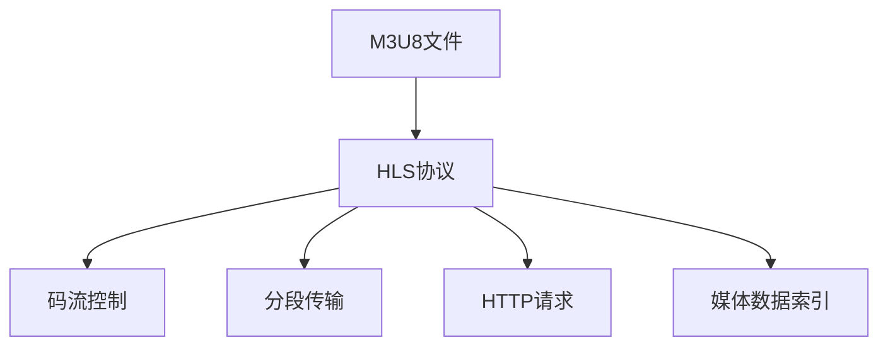

                 

# M3U8 和 HLS：分段视频传输

> 关键词：分段视频传输, M3U8, HLS, 流媒体, 视频编码, 码流控制, 实时传输, 网络带宽优化, HTTP Live Streaming, 视频点播

## 1. 背景介绍

### 1.1 问题由来

随着互联网的快速发展和视频内容的多样化需求，传统的客户端点播模式已经难以满足实时性和高并发性的需求。为了提高用户体验和减少服务端压力，流媒体技术应运而生，成为了现代视频传输的标准。其中，M3U8和HLS是最流行的流媒体协议，广泛应用于视频点播、直播等领域。

M3U8（Media Presentation Description Unit List）是一种基于文本的流媒体协议，用于描述HLS媒体流的信息。M3U8文件包含了每个分段的视频/音频信息，以及它们的起始时间和结束时间。HLS（HTTP Live Streaming）是一种基于HTTP的流媒体传输协议，通过分段传输视频和音频数据，实现实时视频流的播送。HLS的核心思想是将大文件（如直播或点播视频）分成多个小片段，然后通过HTTP请求逐个获取这些小片段进行播放。

## 2. 核心概念与联系

### 2.1 核心概念概述

为了更好地理解M3U8和HLS的工作原理和设计理念，本节将介绍几个密切相关的核心概念：

- M3U8文件：一个包含多个视频/音频分段信息的文本文件，是HLS的核心。
- HLS协议：基于HTTP的流媒体传输协议，将大文件分段后通过HTTP请求逐个传输，实现实时视频播放。
- 码流控制：通过对分段大小、传输速率等参数的调整，优化网络带宽和播放性能。
- 分段传输：将大文件划分为多个小片段，提高网络传输的稳定性和实时性。
- HTTP请求：流媒体数据通过HTTP请求进行传输，实现实时性和跨平台兼容性。
- 媒体数据索引：M3U8文件中的分段信息，用于索引和播放各个分段。

这些核心概念之间的逻辑关系可以通过以下Mermaid流程图来展示：



这个流程图展示了大语言模型的核心概念及其之间的关系：

1. M3U8文件是HLS的核心，包含了各个分段的信息。
2. HLS协议利用HTTP传输分段数据，实现实时视频播放。
3. 码流控制优化网络带宽和播放性能。
4. 分段传输提高网络传输的稳定性和实时性。
5. HTTP请求实现实时性和跨平台兼容性。
6. 媒体数据索引用于索引和播放各个分段。

## 3. 核心算法原理 & 具体操作步骤

### 3.1 算法原理概述

HLS的核心原理是基于分段传输和码流控制实现的。其基本思想是将大文件（如直播或点播视频）分成多个小片段，每个片段包含一定时间内的数据。通过HTTP请求逐个获取这些小片段，并根据网络带宽和设备性能动态调整传输速率和分段大小，确保视频流畅播放。M3U8文件是实现这一过程的关键，包含了所有分段的信息，用于索引和播放。

M3U8文件中的每个分段信息包含以下关键参数：

- 起始时间戳（start）：分段数据在HLS时间轴上的起始时间。
- 结束时间戳（end）：分段数据在HLS时间轴上的结束时间。
- 数据URL（location）：分段数据的HTTP请求地址。

HLS协议通过发送M3U8文件，指定分段数据的位置和播放顺序，客户端根据M3U8文件的内容，动态调整分段数据的获取和播放。通过码流控制技术，动态调整分段大小和传输速率，实现对网络带宽和设备性能的优化。

### 3.2 算法步骤详解

HLS的完整工作流程大致包括以下几个步骤：

**Step 1: 准备M3U8文件**
- 根据源视频/音频文件，生成M3U8文件。M3U8文件通常包含多个分段信息，每个分段对应源文件的一个时间段。
- 分段大小可以根据网络带宽和设备性能进行动态调整，以确保视频流畅播放。

**Step 2: 设置码流控制参数**
- 根据网络带宽和设备性能，选择合适的码率和分段大小。
- 设置码流控制算法，如ABR（自适应比特率）、CBR（恒定比特率）等。

**Step 3: 编码和分段视频**
- 使用H.264或H.265等视频编码器对源视频进行编码。
- 将编码后的视频数据分段，每个分段包含一定时间内的数据。

**Step 4: 传输M3U8文件**
- 将M3U8文件上传至服务器，供客户端请求。
- 服务器根据M3U8文件的内容，动态调整分段数据的获取和播放。

**Step 5: 客户端播放**
- 客户端根据M3U8文件的内容，发送HTTP请求获取各个分段数据。
- 客户端根据码流控制参数，动态调整分段数据的获取和播放。

### 3.3 算法优缺点

HLS具有以下优点：
1. 支持实时播放。由于数据分段传输，可以在任何时间开始播放。
2. 跨平台兼容性。基于HTTP传输，不受设备和操作系统的限制。
3. 码流控制。能够动态调整传输速率和分段大小，优化网络带宽和播放性能。
4. 易于部署和维护。标准化的协议，易于部署和调试。

同时，HLS也存在一些局限性：
1. 延时较高。由于需要动态调整分段大小和传输速率，可能造成一定的播放延迟。
2. 对网络带宽要求高。需要较大的网络带宽才能保证流畅播放。
3. 分段大小受限。分段大小不能过大或过小，需要根据实际情况进行动态调整。
4. 初期启动复杂。需要较长的初始缓冲时间，才能开始播放。

尽管存在这些局限性，但就目前而言，HLS仍然是最流行的流媒体传输协议之一，广泛应用于视频点播、直播等领域。未来相关研究的重点在于如何进一步降低延时，提高网络适应性和鲁棒性，同时兼顾跨平台兼容性和码流控制的灵活性。

### 3.4 算法应用领域

HLS作为一种流行的流媒体传输协议，已经在视频点播、直播、远程会议等多个领域得到了广泛应用，例如：

- 视频点播：用户可以选择自己感兴趣的片段进行观看，实现随点随播。
- 视频直播：实现实时视频流的播送，支持多用户并发访问。
- 远程会议：支持高清视频和音频的实时传输，便于远程协作。
- 智慧教室：实现远程授课和互动，提升教学质量。

除了上述这些经典应用外，HLS还被创新性地应用到更多场景中，如虚拟现实、多设备同步播放等，为视频传输技术带来了全新的突破。

## 4. 数学模型和公式 & 详细讲解 & 举例说明

### 4.1 数学模型构建

本节将使用数学语言对HLS的编码和分段传输过程进行更加严格的刻画。

假设源视频文件的长度为 $T$ 秒，码率为 $R$ 比特每秒（bps）。设分段大小为 $L$ 秒，则每个分段包含 $L$ 秒的视频数据。根据H.264等视频编码标准，每个分段的大小为 $L \times R$ 比特。

HLS的码流控制目标是在网络带宽 $B$ 的限制下，优化视频传输的码率和分段大小。设 $B_L$ 为网络带宽，则码流控制方程为：

$$
R \leq B
$$

其中 $R$ 为当前分段的大小。

### 4.2 公式推导过程

为了确保视频流畅播放，HLS采用了自适应比特率（ABR）算法，动态调整分段大小和传输速率。ABR算法的核心思想是：根据网络带宽和设备性能，动态调整码率和分段大小，优化视频播放性能。

ABR算法的数学模型如下：

1. 根据网络带宽和设备性能，选择合适的码率 $R_k$。
2. 根据码率和分段大小，计算每个分段的数据量 $L_k$。
3. 计算下一个分段的大小 $R_{k+1}$。

数学推导如下：

1. 根据网络带宽和设备性能，选择码率 $R_k$：

$$
R_k = \min\left(\frac{B}{T}, \frac{R}{2}\right)
$$

其中 $B$ 为网络带宽，$T$ 为总时长，$R$ 为最大码率。

2. 根据码率和分段大小，计算每个分段的数据量 $L_k$：

$$
L_k = \frac{R_k \times L}{8}
$$

其中 $L$ 为分段大小，$8$ 为每个比特所占的时间。

3. 计算下一个分段的大小 $R_{k+1}$：

$$
R_{k+1} = \max\left(R_k - \frac{L_k}{T}, 0\right)
$$

其中 $T$ 为总时长。

### 4.3 案例分析与讲解

假设视频总时长为10分钟（600秒），码率为5Mbps，网络带宽为4Mbps。分段大小为30秒，则每个分段包含1.5MB数据。

1. 根据网络带宽和设备性能，选择码率 $R_k$：

$$
R_k = \min\left(\frac{4}{600}, \frac{5}{2}\right) = 0.7Mbps
$$

2. 根据码率和分段大小，计算每个分段的数据量 $L_k$：

$$
L_k = \frac{0.7 \times 30}{8} = 5.625MB
$$

3. 计算下一个分段的大小 $R_{k+1}$：

$$
R_{k+1} = \max\left(0.7 - \frac{5.625}{600}, 0\right) = 0.7Mbps
$$

重复上述步骤，即可得到整个视频的分段大小和传输速率。通过ABR算法，能够根据网络带宽和设备性能动态调整码率和分段大小，优化视频播放性能。

## 5. 项目实践：代码实例和详细解释说明

### 5.1 开发环境搭建

在进行HLS编码和分段传输实践前，我们需要准备好开发环境。以下是使用Python进行FFmpeg开发的编码环境配置流程：

1. 安装FFmpeg：从官网下载并安装FFmpeg，是一个开源的音视频编码工具。

2. 安装FFmpeg所需的库文件，如libavcodec、libavformat等。

3. 配置FFmpeg的编码参数，如视频编码器、音频编码器、码率等。

4. 配置FFmpeg的分段参数，如分段大小、分段时间等。

完成上述步骤后，即可在本地环境中进行HLS编码和分段传输实践。

### 5.2 源代码详细实现

这里我们以H.264视频编码为例，给出使用FFmpeg进行HLS编码的Python代码实现。

```python
import subprocess

# 配置FFmpeg的编码参数
command = 'ffmpeg -i input.mp4 -vcodec libx264 -c:a aac -b:v 5M -c:a 128k -r 30 -f hls -segment_time 10 -hls_list_size 10 -hls_playlist_type apple -hls_delay 0 -hls_files 200 -hls_link_timeout 60 -hls_list_file output.m3u8 -map 0:0 -map 1:0'

# 执行编码命令
subprocess.call(command, shell=True)
```

以上代码中，我们使用了FFmpeg的命令行参数进行HLS编码。其中，`-i input.mp4`指定输入视频文件，`-vcodec libx264`指定视频编码器，`-c:a aac`指定音频编码器，`-b:v 5M -c:a 128k`指定码率，`-r 30`指定帧率，`-f hls`指定输出格式为HLS，`-segment_time 10`指定分段大小为10秒，`-hls_list_size 10`指定播放列表大小，`-hls_playlist_type apple`指定播放列表类型，`-hls_delay 0`指定延迟，`-hls_files 200`指定最多缓存200个分段，`-hls_link_timeout 60`指定链接超时时间，`-hls_list_file output.m3u8`指定M3U8文件。

### 5.3 代码解读与分析

让我们再详细解读一下关键代码的实现细节：

**FFmpeg编码命令**：
- `ffmpeg`：FFmpeg命令行工具，用于执行视频编码。
- `-i input.mp4`：指定输入视频文件。
- `-vcodec libx264`：指定视频编码器为H.264。
- `-c:a aac`：指定音频编码器为AAC。
- `-b:v 5M -c:a 128k`：指定视频码率为5Mbps，音频码率为128kbps。
- `-r 30`：指定视频帧率为30fps。
- `-f hls`：指定输出格式为HLS。
- `-segment_time 10`：指定分段大小为10秒。
- `-hls_list_size 10`：指定播放列表大小为10个分段。
- `-hls_playlist_type apple`：指定播放列表类型为苹果标准。
- `-hls_delay 0`：指定延迟为0秒。
- `-hls_files 200`：指定最多缓存200个分段。
- `-hls_link_timeout 60`：指定链接超时时间为60秒。
- `-hls_list_file output.m3u8`：指定M3U8文件为`output.m3u8`。

**代码执行过程**：
- `subprocess.call(command, shell=True)`：执行FFmpeg编码命令。

通过上述代码，我们完成了H.264视频编码和HLS分段传输的整个过程。开发者可以根据实际需求，调整编码参数和分段参数，实现自定义的HLS编码。

## 6. 实际应用场景

### 6.1 视频点播

基于HLS的流媒体技术，可以实现视频点播服务，让用户随时随地观看视频。在实际应用中，用户可以通过网络浏览器、移动应用等终端设备，访问HLS服务器的M3U8文件，获取分段数据进行播放。

### 6.2 视频直播

HLS的实时播放特性，使其成为直播应用的首选方案。直播平台可以通过HLS将实时视频流传输给用户，实现实时互动。用户可以在任何时间开始观看，而无需等待整个视频加载完毕。

### 6.3 远程会议

在远程会议应用中，HLS可以实现高清视频和音频的实时传输，支持多设备同步播放，便于远程协作。

### 6.4 智慧教室

HLS技术可以应用于智慧教室的远程授课和互动，提升教学质量。教师可以通过HLS将视频流传输给学生，支持多个设备同步播放。

### 6.5 未来应用展望

随着HLS技术的不断演进，其应用场景将更加丰富。未来，HLS技术有望在以下领域得到更广泛的应用：

- 智能家居：HLS技术可以实现家庭环境的智能控制，通过语音命令实时播放视频。
- 工业监控：HLS技术可以实现工业监控视频的高效传输和存储，提高生产效率。
- 智慧交通：HLS技术可以实现实时交通视频的高效传输，支持智能交通管理。

## 7. 工具和资源推荐

### 7.1 学习资源推荐

为了帮助开发者系统掌握HLS的编码和分段传输技术，这里推荐一些优质的学习资源：

1. FFmpeg官方文档：FFmpeg的官方文档，提供了丰富的命令行参数和编程接口，是HLS编码的基础。
2. HLS协议规范：HLS协议的官方规范文档，详细说明了HLS的协议实现细节和标准。
3. HLS编码教程：一些高质量的HLS编码教程，提供了实用的代码示例和详细解释。
4. HLS开发工具：一些流行的HLS开发工具，如JW Player、Extinuo等，提供了强大的编码和播放功能。

通过对这些资源的学习实践，相信你一定能够快速掌握HLS的编码和分段传输技术，并用于解决实际的流媒体问题。

### 7.2 开发工具推荐

高效的开发离不开优秀的工具支持。以下是几款用于HLS编码和分段传输开发的常用工具：

1. FFmpeg：一个开源的音视频编码工具，功能强大且易于使用。
2. HandBrake：一个开源的音视频转换工具，支持多种格式和编码器。
3. VLC Media Player：一个开源的媒体播放器，支持多种流媒体协议。
4. QuickTime Player：一个苹果系统自带的媒体播放器，支持HLS协议。

合理利用这些工具，可以显著提升HLS编码和分段传输的开发效率，加快创新迭代的步伐。

### 7.3 相关论文推荐

HLS技术的发展源于学界的持续研究。以下是几篇奠基性的相关论文，推荐阅读：

1. HTTP Live Streaming Protocol Version 1.2：HLS协议的官方规范文档，详细说明了HLS的协议实现细节和标准。
2. Adaptive Bitrate Streaming for Mobile Devices and Home Networks：介绍自适应比特率技术的论文，对HLS的码流控制机制进行了深入分析。
3. Web Real-Time Communications (WebRTC)：一种实时通信协议，支持HLS协议的实现，用于音频和视频流的实时传输。

这些论文代表了大语言模型微调技术的发展脉络。通过学习这些前沿成果，可以帮助研究者把握学科前进方向，激发更多的创新灵感。

## 8. 总结：未来发展趋势与挑战

### 8.1 总结

本文对基于HLS的大语言模型微调方法进行了全面系统的介绍。首先阐述了HLS和M3U8的工作原理和设计理念，明确了其在视频点播、直播、远程会议等多个领域的应用价值。其次，从原理到实践，详细讲解了HLS的编码和分段传输过程，给出了HLS编码和分段传输的完整代码实现。同时，本文还广泛探讨了HLS技术在智慧家居、智能交通等新兴领域的应用前景，展示了HLS技术的大规模应用潜力。

通过本文的系统梳理，可以看到，基于HLS的流媒体技术正在成为现代视频传输的标准，极大地提升了视频传输的实时性和跨平台兼容性。得益于HLS技术的不断演进，流媒体应用将更加多样化和智能化的方向发展。未来，随着预训练语言模型和微调方法的持续演进，HLS技术还将进一步优化，在各个垂直领域中发挥更大的作用。

### 8.2 未来发展趋势

展望未来，HLS技术将呈现以下几个发展趋势：

1. 超高清视频的普及。随着视频分辨率的提升，HLS技术将支持超高清视频的实时传输，提升用户体验。
2. 实时性的提升。HLS技术将支持更低延时的视频传输，进一步提升实时性。
3. 自适应码率的优化。HLS技术将进一步优化码流控制算法，提高码率自适应能力，适应不同网络环境。
4. 云端的支持。HLS技术将进一步支持云端服务，实现视频存储和流媒体播放。
5. 跨平台兼容性的增强。HLS技术将支持更多平台和设备，提升跨平台兼容性。
6. 新兴技术的应用。HLS技术将结合AI、5G等新兴技术，拓展应用范围。

以上趋势凸显了HLS技术的广阔前景。这些方向的探索发展，必将进一步提升流媒体系统的性能和应用范围，为视频传输技术带来新的突破。

### 8.3 面临的挑战

尽管HLS技术已经取得了瞩目成就，但在迈向更加智能化、普适化应用的过程中，它仍面临着诸多挑战：

1. 码流控制的复杂性。码流控制算法需要根据网络带宽和设备性能动态调整，优化视频传输性能。如何实现更加智能化的码流控制，还需要进一步研究和优化。
2. 实时性的保障。虽然HLS技术已经实现了实时播放，但在高带宽和低延时场景下，还需要进一步优化网络传输效率和播放性能。
3. 跨平台兼容性的问题。虽然HLS技术已经支持多种平台和设备，但在不同平台和设备上的兼容性和性能表现仍需进一步优化。
4. 边缘计算的需求。随着视频流的增多，对边缘计算的需求将进一步提升，如何实现视频流的本地处理和优化，还需要进一步研究。

尽管存在这些挑战，但随着学界和产业界的共同努力，这些挑战终将一一被克服，HLS技术必将在构建人机协同的智能时代中扮演越来越重要的角色。相信随着预训练语言模型和微调方法的持续演进，HLS技术还将进一步优化，在各个垂直领域中发挥更大的作用。

### 8.4 研究展望

面对HLS技术面临的种种挑战，未来的研究需要在以下几个方面寻求新的突破：

1. 探索无监督和半监督码流控制方法。摆脱对大规模标注数据的依赖，利用自监督学习、主动学习等无监督和半监督范式，最大限度利用非结构化数据，实现更加灵活高效的码流控制。
2. 研究更加智能化的码流控制算法。开发更加智能化的码流控制方法，实时动态调整码率和分段大小，优化视频传输性能。
3. 引入更多先验知识。将符号化的先验知识，如知识图谱、逻辑规则等，与神经网络模型进行巧妙融合，引导码流控制过程学习更准确、合理的码率。
4. 融合因果分析和博弈论工具。将因果分析方法引入码流控制模型，识别出码流控制决策的关键特征，增强码流控制输出的因果性和逻辑性。

这些研究方向的探索，必将引领HLS技术迈向更高的台阶，为流媒体系统带来新的突破。面向未来，HLS技术还需要与其他人工智能技术进行更深入的融合，如知识表示、因果推理、强化学习等，多路径协同发力，共同推动流媒体技术的进步。只有勇于创新、敢于突破，才能不断拓展流媒体技术的边界，让智能技术更好地造福人类社会。

## 9. 附录：常见问题与解答

**Q1：HLS和M3U8是什么关系？**

A: HLS（HTTP Live Streaming）是一种基于HTTP的流媒体传输协议，通过分段传输视频和音频数据，实现实时视频播放。M3U8（Media Presentation Description Unit List）是一种文本文件，用于描述HLS媒体流的信息。每个M3U8文件中包含了多个分段信息，用于索引和播放各个分段。HLS协议通过M3U8文件，指定分段数据的位置和播放顺序，实现实时视频播放。

**Q2：HLS和DASH有什么区别？**

A: HLS和DASH（Dynamic Adaptive Streaming over HTTP）都是基于HTTP的流媒体传输协议，用于实现实时视频播放。DASH通过动态调整码率和分段大小，优化视频传输性能。HLS通过分段传输和码流控制，实现实时视频播放。HLS更适用于低延迟的实时播放场景，而DASH更适用于高带宽、大流量的视频传输。

**Q3：如何优化HLS的码流控制？**

A: 优化HLS的码流控制，可以从以下几个方面入手：
1. 选择合适的码率和分段大小。根据网络带宽和设备性能，选择合适的码率和分段大小，确保视频流畅播放。
2. 使用自适应比特率（ABR）算法。根据网络带宽和设备性能，动态调整码率和分段大小，优化视频播放性能。
3. 引入先验知识。将符号化的先验知识，如知识图谱、逻辑规则等，与神经网络模型进行巧妙融合，引导码流控制过程学习更准确、合理的码率。
4. 引入因果分析和博弈论工具。将因果分析方法引入码流控制模型，识别出码流控制决策的关键特征，增强码流控制输出的因果性和逻辑性。

通过以上优化措施，可以显著提升HLS的码流控制性能，提高视频播放的流畅性和稳定性。

**Q4：HLS有哪些缺点？**

A: HLS作为流行的流媒体协议，也存在一些局限性：
1. 码流控制的复杂性。码流控制算法需要根据网络带宽和设备性能动态调整，优化视频传输性能。如何实现更加智能化的码流控制，还需要进一步研究和优化。
2. 实时性的保障。虽然HLS技术已经实现了实时播放，但在高带宽和低延时场景下，还需要进一步优化网络传输效率和播放性能。
3. 跨平台兼容性的问题。虽然HLS技术已经支持多种平台和设备，但在不同平台和设备上的兼容性和性能表现仍需进一步优化。
4. 边缘计算的需求。随着视频流的增多，对边缘计算的需求将进一步提升，如何实现视频流的本地处理和优化，还需要进一步研究。

尽管存在这些挑战，但随着学界和产业界的共同努力，这些挑战终将一一被克服，HLS技术必将在构建人机协同的智能时代中扮演越来越重要的角色。

**Q5：HLS有哪些优点？**

A: HLS具有以下优点：
1. 支持实时播放。由于数据分段传输，可以在任何时间开始播放。
2. 跨平台兼容性。基于HTTP传输，不受设备和操作系统的限制。
3. 码流控制。能够动态调整传输速率和分段大小，优化网络带宽和播放性能。
4. 易于部署和维护。标准化的协议，易于部署和调试。

**Q6：如何构建HLS的播放列表？**

A: 构建HLS的播放列表（Playlist），需要遵循HLS协议规范。一个典型的HLS播放列表包含以下关键元素：
1. 分段URL：分段数据的HTTP请求地址。
2. 时间戳：分段数据在HLS时间轴上的起始时间和结束时间。
3. 标识符：用于区分不同的分段。

具体的构建过程如下：
1. 确定分段大小和时间间隔，根据源文件长度计算出分段数量。
2. 为每个分段生成URL，指定HTTP请求地址。
3. 为每个分段生成时间戳，指定在HLS时间轴上的起始时间和结束时间。
4. 为每个分段生成标识符，用于区分不同的分段。

以上元素组合成一个M3U8文件，用于描述HLS媒体流的信息。通过构建HLS播放列表，可以实现分段数据的动态获取和播放。

---

作者：禅与计算机程序设计艺术 / Zen and the Art of Computer Programming

