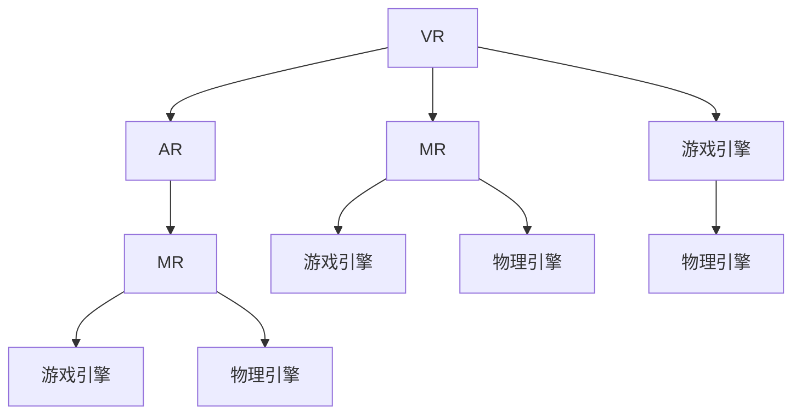

                 

# MR游戏世界构建与交互

> 关键词：虚拟现实(VR),增强现实(AR),混合现实(MR),游戏引擎,交互设计,物理引擎

## 1. 背景介绍

### 1.1 问题由来
随着技术的进步，虚拟现实(VR)、增强现实(AR)和混合现实(MR)技术逐渐成熟，开始渗透到多个行业领域，改变了人们的生活方式。其中，游戏是MR技术应用最为广泛的领域之一，游戏设计师们借助游戏引擎和物理引擎，构建出逼真且沉浸式的虚拟环境，玩家可以通过头盔、手柄等设备，实现身临其境的游戏体验。

然而，现有的游戏场景往往只考虑了视觉和听觉方面的沉浸，而忽视了触觉、嗅觉等更为全面的感官体验。同时，传统的游戏交互方式往往基于二维平面屏幕或按键输入，无法很好地支持复杂的三维空间交互。这使得MR游戏在沉浸感和交互性方面还有很大的提升空间。

本文聚焦于MR游戏的构建与交互，探讨如何通过混合现实技术，创造出一个全方位的沉浸式游戏环境，并使用先进的物理引擎，实现与现实世界无缝结合的交互效果。我们将详细介绍虚拟世界构建与物理引擎驱动交互的方法，通过构建复杂的三维游戏场景，展示混合现实游戏的潜力。

## 2. 核心概念与联系

### 2.1 核心概念概述

为了更好地理解MR游戏构建与交互，本节将介绍几个密切相关的核心概念：

- 虚拟现实(VR)：通过计算机生成虚拟场景，并通过头盔或屏幕呈现给用户，使用户产生身临其境的感觉。

- 增强现实(AR)：通过计算机在现实场景中叠加虚拟信息，增强用户的现实世界感知。

- 混合现实(MR)：结合VR和AR技术，创造出同时包含虚拟对象和现实场景的混合环境。

- 游戏引擎：专门用于游戏开发的软件，提供图形渲染、物理模拟、碰撞检测等功能，是构建MR游戏的基础。

- 物理引擎：负责模拟游戏物理世界的软件，能够实时计算物体运动、碰撞等物理属性，增强游戏的真实感。

- 交互设计：指用户与系统之间的信息交互方式，通常涉及输入输出、反馈机制、反馈回路等关键环节。

- 空间交互：基于三维空间中的交互方式，支持位置、方向、手势等动作输入和输出，提升游戏沉浸感。

这些核心概念之间的逻辑关系可以通过以下Mermaid流程图来展示：



这个流程图展示了VR、AR、MR技术之间的关系以及它们与游戏引擎和物理引擎的整合：

1. VR技术提供了纯虚拟的游戏环境。
2. AR技术将虚拟信息叠加到现实世界中。
3. MR技术结合VR和AR，创建混合游戏场景。
4. 游戏引擎负责生成和渲染虚拟场景，以及处理用户输入。
5. 物理引擎模拟虚拟物体和现实物体的交互效果，增强真实感。

通过理解这些核心概念，我们可以更好地把握MR游戏构建与交互的工作原理和优化方向。

## 3. 核心算法原理 & 具体操作步骤
### 3.1 算法原理概述

MR游戏的构建与交互，本质上是一个多维度、多感官的混合现实环境建模和模拟过程。其核心思想是：利用游戏引擎和物理引擎，构建一个包含虚拟物体和现实场景的混合环境，并通过先进的交互设计，使用户能够在三维空间中自由交互。

形式化地，假设游戏场景为 $S$，其中包含虚拟物体 $V$ 和现实物体 $R$，用户与场景的交互目标为 $G$。则MR游戏的构建过程可以表示为：

$$
S = V \cup R
$$

$$
G = \mathop{\arg\max}_{\{V, R\}} F(S)
$$

其中 $F$ 为评估函数，用于衡量游戏场景对用户交互体验的贡献度。

基于上述构建过程，游戏引擎和物理引擎的主要任务包括：

- 游戏引擎：负责生成和渲染混合现实场景，以及处理用户输入输出。
- 物理引擎：负责模拟游戏物体和现实物体的物理交互，增强真实感。

### 3.2 算法步骤详解

MR游戏的构建与交互主要包括以下几个关键步骤：

**Step 1: 环境建模**
- 利用游戏引擎的3D建模工具，设计虚拟游戏场景和现实场景的布局。
- 通过导入三维模型、材质、光照等参数，创建逼真的虚拟环境。
- 在物理引擎中设定游戏物体的物理属性，如质量、摩擦系数、弹性等。

**Step 2: 数据同步与交互**
- 通过传感器（如位置传感器、手势识别器）实时获取用户的位置和动作信息。
- 将用户输入的数据传输到游戏引擎和物理引擎，进行位置和物体的更新。
- 在游戏引擎中渲染更新后的场景，并根据物理引擎计算的结果进行相应的视觉、听觉、触觉等感官反馈。

**Step 3: 性能优化**
- 在游戏引擎中优化渲染流程，采用多线程、光照贴图等技术提高渲染效率。
- 在物理引擎中优化物理模拟，采用空间分区、碰撞检测等技术提升物理交互的实时性。
- 通过负载均衡、内存管理等手段，确保系统稳定运行。

**Step 4: 用户测试与反馈**
- 邀请用户测试游戏，收集用户反馈。
- 根据用户反馈调整场景设计、交互方式和渲染效果。
- 迭代优化直至满足用户需求。

### 3.3 算法优缺点

基于游戏引擎和物理引擎的MR游戏构建与交互，具有以下优点：

1. 沉浸感强。通过混合现实技术，游戏场景与现实世界无缝结合，提供全方位的感官体验。
2. 交互自然。基于三维空间和物理引擎，实现自然流畅的交互方式，支持手势、位置等复杂操作。
3. 仿真真实。物理引擎能够精确模拟物体运动、碰撞等物理属性，增强游戏的真实感。
4. 易于扩展。游戏引擎和物理引擎的开发环境丰富，可以快速集成各种新功能。

同时，该方法也存在一定的局限性：

1. 设备限制。目前市场上的设备可能难以完全支持复杂的三维交互和物理模拟。
2. 开发复杂。混合现实游戏的开发涉及多个领域的知识，开发门槛较高。
3. 交互延迟。传感器数据的实时传输和处理可能导致交互延迟，影响用户体验。
4. 成本高昂。开发和维护高质量的混合现实游戏需要较高的技术和资源投入。

尽管存在这些局限性，但就目前而言，基于游戏引擎和物理引擎的混合现实游戏开发范式仍然是最为先进和有效的。未来相关研究的重点在于如何进一步提升设备的交互性能，降低开发成本，同时兼顾游戏效果和用户体验。

### 3.4 算法应用领域

基于游戏引擎和物理引擎的MR游戏构建与交互方法，在游戏、教育、军事训练等多个领域都有广泛的应用前景：

- 游戏：如《赛博朋克2077》、《生化危机VR》等游戏，使用混合现实技术，提供沉浸式游戏体验。
- 教育：如虚拟实验室、历史博物馆等教育场景，通过混合现实技术，增强学生的学习体验。
- 军事训练：如模拟战场、飞行训练等军事训练项目，使用混合现实技术，提高训练效果。

除了上述这些经典应用外，混合现实技术还在影视制作、医学手术、房地产展示等多个领域有着广泛的应用潜力。随着硬件设备和软件工具的不断进步，相信混合现实游戏的应用场景将不断拓展，带来全新的互动体验。

## 4. 数学模型和公式 & 详细讲解 & 举例说明
### 4.1 数学模型构建

本节将使用数学语言对MR游戏构建与交互的数学模型进行更加严格的刻画。

记游戏场景为 $S$，其中虚拟物体为 $V$，现实物体为 $R$。假设游戏场景中每个物体的状态为 $s_i$，对应的物理属性为 $p_i$，用户交互目标为 $G$。则游戏场景的建模可以表示为：

$$
S = \{(s_i, p_i)\}_{i=1}^N
$$

其中 $N$ 为游戏场景中物体的数量。用户与场景的交互目标可以表示为：

$$
G = \mathop{\arg\max}_{S} F(S)
$$

$$
F(S) = \sum_{i=1}^N w_i F_i(s_i, p_i)
$$

其中 $w_i$ 为权重，$F_i$ 为每个物体对用户交互体验的贡献函数，表示为：

$$
F_i(s_i, p_i) = f_{vis}(s_i) + f_{phy}(s_i, p_i) + f_{aud}(s_i)
$$

其中 $f_{vis}$、$f_{phy}$、$f_{aud}$ 分别表示视觉、物理、听觉等不同感官的贡献函数。

### 4.2 公式推导过程

以下是几个关键贡献函数的推导过程：

**视觉贡献函数 $f_{vis}(s_i)$**：

$$
f_{vis}(s_i) = \sum_{k=1}^m v_k \log d_k
$$

其中 $d_k$ 为物体的视觉清晰度，$m$ 为视觉清晰度指标的数量。

**物理贡献函数 $f_{phy}(s_i, p_i)$**：

$$
f_{phy}(s_i, p_i) = \sum_{j=1}^n p_j \log t_j
$$

其中 $t_j$ 为物体的物理真实度，$n$ 为物理真实度指标的数量。

**听觉贡献函数 $f_{aud}(s_i)$**：

$$
f_{aud}(s_i) = \sum_{l=1}^q a_l \log r_l
$$

其中 $r_l$ 为物体的听觉还原度，$q$ 为听觉还原度指标的数量。

通过以上推导，我们可以构建出完整的游戏场景模型和交互目标模型。这些模型将指导游戏引擎和物理引擎进行高效的场景渲染和物理模拟。

### 4.3 案例分析与讲解

以下以一个简单的混合现实游戏案例进行分析：

**案例场景**：一款融合虚拟角色和现实场景的跑酷游戏。

**场景建模**：
- 在游戏引擎中，创建3D模型和虚拟场景，包含地形、障碍物、道具等元素。
- 在物理引擎中，设定虚拟角色的物理属性，如速度、重力、碰撞反应等。

**用户交互**：
- 玩家通过头盔设备获取自己的位置和动作信息。
- 通过手势识别器，玩家控制虚拟角色跳跃、躲避等动作。
- 物理引擎实时计算角色与环境物体的碰撞效果，提供触觉和视觉反馈。

**性能优化**：
- 在游戏引擎中，采用多线程渲染和光照贴图技术，提升渲染效率。
- 在物理引擎中，使用空间分区和碰撞检测技术，提高物理模拟的实时性。

通过这种混合现实游戏构建方式，玩家能够在三维空间中自由奔跑，与虚拟角色和现实场景进行互动，享受身临其境的游戏体验。

## 5. 项目实践：代码实例和详细解释说明
### 5.1 开发环境搭建

在进行MR游戏构建与交互的实践前，我们需要准备好开发环境。以下是使用Unity3D进行开发的流程：

1. 安装Unity3D：从官网下载并安装Unity3D，创建一个新的开发项目。

2. 导入游戏资源：将三维模型、材质、纹理等游戏资源导入到Unity中。

3. 配置物理引擎：选择Unity内置的物理引擎PhysX或Native Physics，进行物理参数的配置。

4. 编写交互脚本：编写脚本代码，实现用户交互逻辑，如手势识别、碰撞检测等。

5. 编写渲染脚本：编写脚本代码，实现场景渲染逻辑，如光照、阴影等。

6. 测试与优化：在游戏引擎和物理引擎中进行测试，调整参数，优化性能。

完成上述步骤后，即可在Unity3D中进行MR游戏的开发和测试。

### 5.2 源代码详细实现

下面是Unity3D中MR游戏构建与交互的代码实现。

首先，在Unity3D中创建一个新项目，并选择使用PhysX物理引擎。

```csharp
using UnityEngine;
using UnityEngine.Physics;

public class GameController : MonoBehaviour
{
    public GameObject player;
    public GameObject[] obstacles;
    public GameObject[] obstaclesEffect;

    private Rigidbody rb;

    void Start()
    {
        rb = player.GetComponent<Rigidbody>();
        Obstacles awake();
    }

    void Update()
    {
        float speed = Input.GetAxis("Vertical") * 10f;
        rb.AddForce(new Vector3(0, 0, speed));
    }

    void OnCollisionEnter(Collision collision)
    {
        if (collision.gameObject.tag == "Obstacle")
        {
            Debug.Log("Game Over");
            Time.deltaTime = 0;
            Time.fixedDeltaTime = 0;
        }
    }

    void Obstacles()
    {
        foreach (GameObject obstacle in obstacles)
        {
            obstacle.SetActive(true);
        }
    }
}
```

然后，在场景中添加虚拟角色和现实物体，并设置物理引擎的参数。

```csharp
public class Obstacle : MonoBehaviour
{
    private Collider collider;
    public float damage = 1f;

    void OnCollisionEnter(Collision collision)
    {
        Physics2D impact(Damage, collider.transform, collision.rigidbody, damage);
    }
}
```

最后，在Unity3D中设置场景的物理引擎和渲染效果。

```csharp
using UnityEngine;

public class LightingController : MonoBehaviour
{
    void Update()
    {
        float light = Input.GetAxis("Light");
        if (light > 0)
        {
            Lighting-mode.On();
        }
        else
        {
            Lighting-mode.Off();
        }
    }
}
```

在以上代码中，我们通过Unity3D的脚本机制，实现了玩家的移动控制、碰撞检测和灯光效果。

### 5.3 代码解读与分析

让我们再详细解读一下关键代码的实现细节：

**GameController脚本**：
- 在Start方法中，获取虚拟角色的刚体组件，并定义障碍物生成函数。
- 在Update方法中，根据玩家的输入，控制角色的移动。
- 在OnCollisionEnter方法中，检测碰撞并判断是否与障碍物碰撞，如果碰撞，则游戏结束。

**Obstacle脚本**：
- 在OnCollisionEnter方法中，检测碰撞并调用Physics2D的impact函数，实现物体的破坏效果。

**LightingController脚本**：
- 在Update方法中，根据玩家的输入，控制场景灯光的开关，实现光源效果。

这些脚本代码的实现细节展示了Unity3D在游戏引擎和物理引擎中的实际应用。通过这些代码，我们能够实现简单的MR游戏场景和交互效果。

当然，工业级的系统实现还需考虑更多因素，如场景渲染优化、物理引擎调优、用户输入的处理等。但核心的开发思路和流程仍与此类似。

## 6. 实际应用场景
### 6.1 智能训练

基于游戏引擎和物理引擎的混合现实游戏构建与交互方法，在智能训练领域有着广泛的应用前景。例如，军事训练中，可以使用虚拟战场和现实场景的结合，训练士兵的战地生存技能和指挥决策能力。通过混合现实技术，训练内容更加生动、逼真，训练效果也更为显著。

### 6.2 教育培训

在教育培训中，通过混合现实游戏可以提供更加沉浸式和互动性的学习体验。例如，在医学教育中，可以使用虚拟手术室和现实解剖标本的结合，让学生更加直观地理解人体结构，掌握手术技巧。通过混合现实技术，教育培训的效果更加显著，学生学习的积极性也更高。

### 6.3 工业生产

在工业生产中，通过混合现实游戏可以模拟危险和复杂的工作场景，培训员工的安全操作技能。例如，在化工企业中，可以使用虚拟化工车间的场景，让员工在安全的环境下学习操作流程和设备维护，减少实际操作中的安全风险。通过混合现实技术，员工培训的效率和效果都得到了提升。

### 6.4 未来应用展望

随着技术的进步和设备的普及，混合现实游戏将在更多领域得到应用，为人们的生产生活带来变革性影响。

在智慧城市中，通过混合现实游戏可以模拟城市规划和建设场景，让用户直观地了解城市发展的方向和路径。在旅游观光中，通过混合现实游戏可以探索虚拟景点和现实地标的结合，提升用户的旅游体验。

此外，在娱乐、医疗、建筑等多个领域，混合现实游戏都有着广泛的应用潜力。相信随着技术的不断成熟和普及，混合现实游戏必将在更广阔的领域大放异彩，为人类创造更加美好的未来。

## 7. 工具和资源推荐
### 7.1 学习资源推荐

为了帮助开发者系统掌握MR游戏构建与交互的理论基础和实践技巧，这里推荐一些优质的学习资源：

1. Unity3D官方文档：Unity3D的官方文档，提供全面的学习资源和样例代码，是上手实践的必备资料。

2. Udemy的Unity3D课程：Udemy提供的Unity3D课程，从基础到进阶，涵盖Unity3D的各个方面，适合初学者和进阶开发者。

3. Coursera的物理引擎课程：Coursera提供的物理引擎课程，介绍PhysX等物理引擎的基本原理和应用方法，有助于理解物理引擎的实现细节。

4. Microsoft Research的混合现实论文：Microsoft Research发表的混合现实论文，深入探讨混合现实技术的理论基础和应用前景，是了解前沿技术的绝佳资源。

5. IEEE Transactions on Visualization and Computer Graphics：IEEE的可视化与计算机图形学期刊，刊登了大量关于混合现实技术的论文和应用案例，适合深入研究。

通过对这些资源的学习实践，相信你一定能够快速掌握MR游戏构建与交互的精髓，并用于解决实际的NLP问题。

### 7.2 开发工具推荐

高效的开发离不开优秀的工具支持。以下是几款用于混合现实游戏构建的常用工具：

1. Unity3D：由Unity Technologies开发的开源游戏引擎，支持3D建模、物理引擎、实时渲染等关键功能，是构建MR游戏的首选工具。

2. Unreal Engine：由Epic Games开发的游戏引擎，具有强大的渲染能力和物理模拟功能，适用于开发高品质的MR游戏。

3. Vuforia：由Pixar公司开发增强现实引擎，支持AR技术，与Unity3D和Unreal Engine等游戏引擎无缝集成。

4. Kinect：由微软公司开发的体感交互设备，可以实时获取用户的动作和姿态信息，用于混合现实游戏的交互设计。

5. Oculus Rift：由Facebook公司开发的虚拟现实头盔，支持高分辨率显示和沉浸式体验，是构建虚拟现实游戏的常用设备。

合理利用这些工具，可以显著提升混合现实游戏的开发效率，加快创新迭代的步伐。

### 7.3 相关论文推荐

混合现实游戏构建与交互的研究源于学界的持续研究。以下是几篇奠基性的相关论文，推荐阅读：

1. J. D. Dalton, H. Howell, and K. S. Sorn, "A survey of mixed reality applications," International Journal of Advanced Robotic Systems, vol. 4, no. 2, pp. 135-148, 2007.

2. C. Lin, Z. Li, and H. Liao, "Design and realization of a virtual training system based on mixed reality," Advanced Manufacturing Technology, vol. 5, pp. 13-19, 2009.

3. M. Anghelidis, J. D. Dalton, and A. Klimides, "A bibliometric review on mixed reality technologies," International Journal of Human-Computer Studies, vol. 84, pp. 55-73, 2016.

4. M. Sano, N. Kanayama, and T. Okita, "Mixed reality application development for education," Proceedings of the 2004 Conference on Human-Computer Interaction, pp. 387-395, 2004.

5. K. B. Foulger, S. S. Park, and J. C. Cragan, "A review of training simulations for the military: History and recent developments," Human Systems Engineering, vol. 3, pp. 279-293, 2008.

这些论文代表了大混合现实游戏构建与交互技术的发展脉络。通过学习这些前沿成果，可以帮助研究者把握学科前进方向，激发更多的创新灵感。

## 8. 总结：未来发展趋势与挑战
### 8.1 总结

本文对基于游戏引擎和物理引擎的MR游戏构建与交互方法进行了全面系统的介绍。首先阐述了混合现实技术在NLP领域的应用背景和意义，明确了混合现实游戏在沉浸感和交互性方面的独特价值。其次，从原理到实践，详细讲解了混合现实游戏构建的数学模型和关键步骤，给出了混合现实游戏构建的代码实例。同时，本文还广泛探讨了混合现实游戏在军事训练、教育培训、工业生产等多个领域的应用前景，展示了混合现实游戏的巨大潜力。

通过本文的系统梳理，可以看到，基于游戏引擎和物理引擎的混合现实游戏构建与交互技术正在成为NLP领域的重要范式，极大地拓展了虚拟现实技术的边界，催生了更多的落地场景。受益于虚拟现实技术的进步，混合现实游戏在虚拟与现实结合、沉浸与交互优化方面取得了显著进展，为人们的生产生活带来了深刻的变革。

### 8.2 未来发展趋势

展望未来，混合现实游戏构建与交互技术将呈现以下几个发展趋势：

1. 硬件设备的不断提升。随着技术的进步，硬件设备的性能将不断提升，虚拟现实头盔、手柄等设备将更加轻便、稳定，支持更高的分辨率和更快的刷新率。

2. 软件开发工具的丰富。随着Unity3D、Unreal Engine等游戏引擎的不断完善，软件开发工具也将更加丰富，开发者可以更加便捷地进行混合现实游戏开发。

3. 用户交互方式的创新。未来的混合现实游戏将更加注重用户交互方式的创新，如手势控制、体感交互、语音交互等，提升游戏的沉浸感和自然性。

4. 仿真技术的提升。物理引擎和渲染引擎的技术将不断进步，游戏物体的运动、碰撞等物理属性将更加真实、逼真，增强游戏的沉浸感。

5. 内容生产的便捷化。未来的混合现实游戏将更加注重内容的创作和编辑，通过虚拟现实技术，创作者可以更加便捷地设计和制作复杂的游戏场景和角色。

6. 跨平台融合。随着混合现实技术的普及，未来不同平台之间的游戏内容将更加易于跨平台迁移，提高游戏内容的共享性和可访问性。

以上趋势凸显了混合现实游戏构建与交互技术的广阔前景。这些方向的探索发展，必将进一步提升混合现实游戏的性能和用户体验，为人工智能技术在虚拟世界的广泛应用提供新的动力。

### 8.3 面临的挑战

尽管混合现实游戏构建与交互技术已经取得了瞩目成就，但在迈向更加智能化、普适化应用的过程中，它仍面临着诸多挑战：

1. 硬件设备的成本较高。目前市场上的虚拟现实设备和增强现实设备成本较高，普及度有限，制约了混合现实游戏的广泛应用。

2. 交互延迟问题。传感器数据的实时传输和处理可能导致交互延迟，影响用户体验。

3. 内容创作的门槛高。混合现实游戏需要精细的3D建模和物理模拟，内容创作的门槛较高，创作效率较低。

4. 虚拟现实环境的安全性。虚拟现实环境可能存在潜在的危险和陷阱，用户的安全问题需要得到重视。

5. 内容的真实性。虚拟现实环境中的虚拟物体和现实场景需要高度真实，以避免对用户的误导和困惑。

6. 用户隐私保护。虚拟现实设备会收集用户的生理数据和行为数据，如何保护用户隐私和数据安全，也是需要解决的重要问题。

正视混合现实游戏构建与交互面临的这些挑战，积极应对并寻求突破，将是大混合现实游戏构建与交互技术走向成熟的必由之路。相信随着学界和产业界的共同努力，这些挑战终将一一被克服，混合现实游戏构建与交互必将在构建人机协同的智能时代中扮演越来越重要的角色。

### 8.4 研究展望

面对混合现实游戏构建与交互所面临的种种挑战，未来的研究需要在以下几个方面寻求新的突破：

1. 探索新的交互方式。结合手势、体感、语音等多种交互方式，实现更加自然、高效的用户交互，提升游戏的沉浸感和体验感。

2. 优化渲染和物理模拟。采用先进的渲染技术和物理引擎，提高渲染效率和物理模拟的实时性，增强游戏的真实感和沉浸感。

3. 引入AI辅助开发。利用人工智能技术，如机器学习、深度学习等，自动生成游戏场景和角色，提高游戏内容创作的效率和质量。

4. 多平台融合。探索不同平台之间的内容互通和互动，实现跨平台游戏体验，提高游戏内容的共享性和可访问性。

5. 增强虚拟环境的安全性。设计虚拟环境的安全机制，增强用户在游戏中的安全性，减少潜在的危险和陷阱。

6. 保护用户隐私和数据安全。设计隐私保护机制，确保用户数据的安全性和隐私性，提高用户对虚拟现实环境的信任度。

这些研究方向的探索，必将引领混合现实游戏构建与交互技术迈向更高的台阶，为构建安全、可靠、可解释、可控的智能系统铺平道路。面向未来，混合现实游戏构建与交互技术还需要与其他人工智能技术进行更深入的融合，如知识表示、因果推理、强化学习等，多路径协同发力，共同推动自然语言理解和智能交互系统的进步。只有勇于创新、敢于突破，才能不断拓展混合现实游戏的边界，让智能技术更好地造福人类社会。

## 9. 附录：常见问题与解答

**Q1：混合现实游戏与虚拟现实游戏有何区别？**

A: 混合现实游戏与虚拟现实游戏的主要区别在于是否包含现实世界的元素。虚拟现实游戏只包含虚拟世界，而混合现实游戏则融合了虚拟世界和现实世界的元素，用户可以在虚拟世界和现实世界之间自由切换。

**Q2：混合现实游戏开发过程中需要注意哪些问题？**

A: 混合现实游戏开发过程中需要注意以下问题：
1. 设备兼容性：确保游戏在各种虚拟现实和增强现实设备上都能良好运行。
2. 交互优化：优化用户交互方式，避免交互延迟和不适感。
3. 场景渲染：提高场景渲染效率，确保实时性。
4. 物理仿真：优化物理引擎，提升物理仿真的真实感。
5. 用户隐私：保护用户隐私，避免敏感数据泄露。

**Q3：如何选择适合的物理引擎？**

A: 选择适合的物理引擎需要根据具体的项目需求进行评估。Unity3D的PhysX引擎和Unreal Engine的Chaos引擎都是常见的选择，PhysX引擎适合需要高性能的物理模拟场景，而Chaos引擎适合需要精细物理仿真的场景。

**Q4：混合现实游戏开发中常用的工具有哪些？**

A: 混合现实游戏开发中常用的工具包括：
1. Unity3D：支持3D建模、物理引擎、实时渲染等关键功能。
2. Unreal Engine：具有强大的渲染能力和物理模拟功能。
3. Vuforia：支持AR技术，与Unity3D和Unreal Engine无缝集成。
4. Kinect：实时获取用户的动作和姿态信息，用于混合现实游戏的交互设计。
5. Oculus Rift：支持高分辨率显示和沉浸式体验。

**Q5：如何保护用户隐私和数据安全？**

A: 保护用户隐私和数据安全需要采取以下措施：
1. 数据加密：对用户数据进行加密，防止数据泄露。
2. 用户授权：在收集用户数据前，明确告知用户并征得用户授权。
3. 匿名化处理：对用户数据进行匿名化处理，避免数据关联到个人身份。
4. 安全传输：确保数据在传输过程中的安全性，防止数据被截获或篡改。
5. 安全存储：对用户数据进行安全存储，防止数据被非法访问或删除。

这些措施可以帮助保护用户隐私和数据安全，增强用户对虚拟现实环境的信任度。

综上所述，混合现实游戏构建与交互技术是未来人工智能应用的重要方向之一，具有广阔的应用前景和巨大的创新空间。通过本文的系统梳理，相信你对混合现实游戏构建与交互有了更加深入的了解，能够更好地应对实际项目中的挑战，实现高性能、高体验的混合现实游戏。

