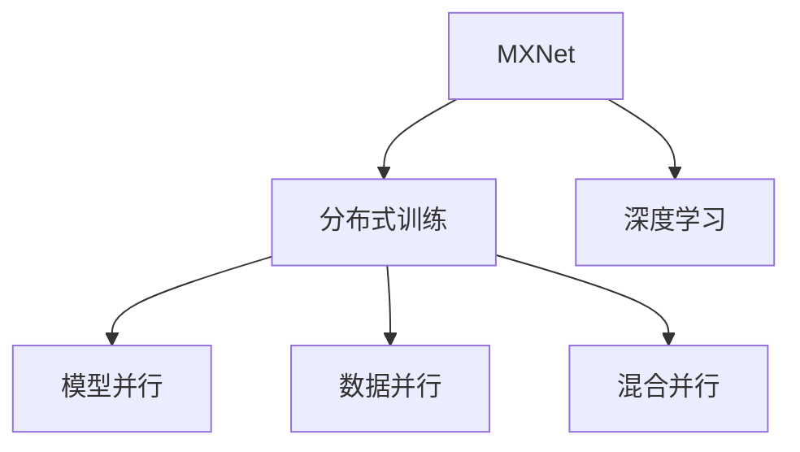

                 

# MXNet 分布式训练：在多 GPU 上训练模型

> 关键词：MXNet, 分布式训练, 深度学习, 多 GPU, 模型优化

## 1. 背景介绍

### 1.1 问题由来
随着深度学习技术的发展，训练大规模深度神经网络模型所需的计算资源越来越庞大。单个 GPU 已经难以满足大规模模型的训练需求，而使用多 GPU 集群进行分布式训练成为一种必然趋势。深度学习框架 MXNet 提供了丰富的分布式训练工具，能够高效地利用多 GPU 资源，优化模型训练过程，加速深度学习模型的训练和推理。

### 1.2 问题核心关键点
在深度学习领域，分布式训练已经成为提高模型训练效率和缩短训练时间的关键技术之一。MXNet 作为深度学习框架中的佼佼者，支持多种分布式训练策略，能够适应各种规模的计算集群，同时保证训练结果的稳定性和可靠性。

本文将详细介绍 MXNet 分布式训练的核心概念、原理和实践方法，并结合实际案例，深入分析如何在多 GPU 上高效地训练模型，提升深度学习模型的性能。

## 2. 核心概念与联系

### 2.1 核心概念概述

为更好地理解 MXNet 分布式训练，我们先介绍几个关键概念：

- MXNet：一种基于 C++ 开发的深度学习框架，支持多种编程语言接口（如 Python、Scala、R 等），能够高效地进行深度学习模型的开发、训练和推理。

- 分布式训练：在多台计算设备上同时进行模型训练，能够充分利用多 GPU 或分布式集群计算资源，加速模型训练过程。

- 模型并行（Model Parallelism）：将深度神经网络模型在多 GPU 上并行分割成多个子模型，每个子模型单独运行，通过参数同步或数据广播机制实现参数共享和通信。

- 数据并行（Data Parallelism）：将同一批次的数据在多个 GPU 上并行计算，加速数据处理过程，通常用于处理大规模数据集。

- 混合并行（Hybrid Parallelism）：结合模型并行和数据并行，同时优化模型和数据的并行处理，提升训练效率。

这些核心概念之间的逻辑关系可以通过以下 Mermaid 流程图来展示：



这个流程图展示了 MXNet 分布式训练的核心概念及其之间的关系：

1. MXNet 框架支持分布式训练技术。
2. 分布式训练可以采用模型并行、数据并行、混合并行等多种策略。
3. 模型并行、数据并行和混合并行是分布式训练的主要实现方式。

这些概念共同构成了 MXNet 分布式训练的基础，使得 MXNet 能够高效地利用多 GPU 资源，进行深度学习模型的训练和优化。

## 3. 核心算法原理 & 具体操作步骤
### 3.1 算法原理概述

MXNet 分布式训练基于数据并行和模型并行的混合策略，能够高效地利用多 GPU 资源，加速模型训练过程。其核心思想是：将深度神经网络模型在多 GPU 上分割成多个子模型，每个子模型独立进行计算，并通过参数同步和数据广播机制实现模型通信，最终得到统一的模型参数。

在 MXNet 中，分布式训练通常使用数据并行和模型并行的组合方式，以适应不同规模的计算集群和不同的训练任务需求。具体来说，MXNet 支持以下几种分布式训练策略：

- 数据并行：将数据集在多个 GPU 上并行处理，每个 GPU 独立计算数据的前向和反向传播结果，并通过参数服务器或 RingAllReduce 机制实现参数更新。
- 模型并行：将深度神经网络模型在多 GPU 上并行分割成多个子模型，每个子模型独立进行计算，并通过参数服务器或数据共享机制实现模型通信。
- 混合并行：结合数据并行和模型并行，同时优化模型和数据的并行处理，提升训练效率。

### 3.2 算法步骤详解

在 MXNet 中，分布式训练的一般步骤如下：

**Step 1: 准备分布式环境**

- 在多台计算机上安装 MXNet 及其依赖库，确保各台计算机的网络连接和共享存储正常。
- 配置 MXNet 的分布式参数服务器，例如使用 Horovod 库管理参数更新过程。

**Step 2: 准备数据集**

- 将数据集划分成多个子集，每个子集大小相同，确保数据分布均匀。
- 定义数据处理函数，将数据集加载并转换为模型需要的格式。

**Step 3: 构建模型和训练器**

- 定义深度神经网络模型，选择适当的激活函数和优化器。
- 设置分布式训练器，指定使用数据并行、模型并行或混合并行的策略。
- 设置损失函数和评价指标，例如交叉熵损失和精度指标。

**Step 4: 启动分布式训练**

- 使用 MXNet 提供的 `train` 函数启动分布式训练过程。
- 训练器会在多 GPU 上并行计算数据的前向和反向传播结果，并通过参数服务器或数据共享机制实现模型通信。
- 训练器会定期在参数服务器上更新模型参数，确保所有 GPU 上的参数一致。

**Step 5: 监控和调整**

- 使用 MXNet 提供的工具监控训练过程，例如可视化训练损失和精度指标。
- 根据监控结果调整训练参数，如学习率、批大小等，以优化训练效果。
- 在训练过程中，可以使用早停（Early Stopping）策略避免过拟合。

**Step 6: 保存和加载模型**

- 在训练完成后，保存模型参数和训练过程日志，以便后续使用。
- 使用 MXNet 提供的 `load_params` 函数加载模型参数，继续训练或进行推理。

### 3.3 算法优缺点

MXNet 分布式训练具有以下优点：

1. 高效利用计算资源：MXNet 支持多种并行策略，能够高效利用多 GPU 或分布式集群资源，加速模型训练过程。
2. 灵活性强：MXNet 提供丰富的分布式训练工具，能够适应各种规模的计算集群和不同的训练任务需求。
3. 稳定可靠：MXNet 支持多种分布式训练策略，能够确保训练过程的稳定性和可靠性。

同时，MXNet 分布式训练也存在一些缺点：

1. 通信开销较大：在数据并行和模型并行中，数据同步和参数同步需要额外的通信开销。
2. 调试复杂：分布式训练的调试和故障排除较为复杂，需要考虑多台计算机之间的同步和通信问题。
3. 资源需求高：分布式训练需要多台计算机和网络带宽，资源需求较高，特别是在大规模数据集和模型的情况下。

尽管存在这些缺点，但就目前而言，MXNet 分布式训练仍然是深度学习领域的重要工具，能够显著提升模型训练效率，加速深度学习模型的开发和应用。

### 3.4 算法应用领域

MXNet 分布式训练已经被广泛应用于多个领域，例如：

- 计算机视觉：在图像分类、目标检测、图像分割等任务上，使用分布式训练加速模型训练过程。
- 自然语言处理：在文本分类、情感分析、机器翻译等任务上，使用分布式训练加速模型训练和推理。
- 语音识别：在语音识别和语音生成等任务上，使用分布式训练加速模型训练和推理。
- 强化学习：在智能游戏、机器人控制等任务上，使用分布式训练加速模型训练和优化。
- 医疗影像：在医学影像分类、疾病预测等任务上，使用分布式训练加速模型训练和推理。

除了上述这些领域外，MXNet 分布式训练还被广泛应用于科学研究、金融分析、推荐系统等多个领域，为深度学习技术的广泛应用提供了有力支持。

## 4. 数学模型和公式 & 详细讲解 & 举例说明

### 4.1 数学模型构建

在 MXNet 中，分布式训练通常使用数据并行和模型并行的混合策略，其数学模型可以表示为：

$$
\theta = \theta_0 + \sum_{i=1}^{k} \nabla \mathcal{L}(\theta_i)
$$

其中，$\theta$ 为整个模型的参数，$\theta_0$ 为初始化参数，$\nabla \mathcal{L}(\theta_i)$ 为第 $i$ 个子模型在数据集 $D_i$ 上的梯度，$k$ 为子模型的数量。

在模型并行中，每个子模型在本地计算梯度，并通过参数服务器或数据共享机制进行同步，从而得到整个模型的梯度。在数据并行中，每个子模型在本地计算数据的前向和反向传播结果，并通过参数服务器或 RingAllReduce 机制进行同步，从而得到整个模型的梯度。

### 4.2 公式推导过程

以下我们以一个简单的神经网络模型为例，推导分布式训练的数学模型和参数更新公式。

假设模型包含 $k$ 个子模型，每个子模型在本地计算梯度，并通过参数服务器进行同步。模型的损失函数为：

$$
\mathcal{L}(\theta) = \frac{1}{N}\sum_{i=1}^{N} \mathcal{L}(x_i, y_i, \theta)
$$

其中 $N$ 为数据集大小，$x_i$ 和 $y_i$ 分别为第 $i$ 个样本的输入和标签。

在每个子模型中，计算数据的前向和反向传播结果，得到本地梯度：

$$
\nabla \mathcal{L}(\theta_i) = \frac{\partial \mathcal{L}(\theta_i)}{\partial \theta}
$$

在数据并行中，每个子模型在本地计算梯度，并通过参数服务器进行同步，从而得到整个模型的梯度：

$$
\nabla \mathcal{L}(\theta) = \frac{1}{N}\sum_{i=1}^{N} \nabla \mathcal{L}(\theta_i)
$$

在模型并行中，每个子模型在本地计算梯度，并通过数据共享机制进行同步，从而得到整个模型的梯度：

$$
\nabla \mathcal{L}(\theta) = \frac{1}{N}\sum_{i=1}^{N} \nabla \mathcal{L}(\theta_i)
$$

在参数服务器上，计算整个模型的梯度，并更新参数：

$$
\theta_{i+1} = \theta_i - \eta \nabla \mathcal{L}(\theta)
$$

其中 $\eta$ 为学习率。

### 4.3 案例分析与讲解

以一个简单的卷积神经网络模型为例，分析 MXNet 分布式训练的实际应用。

假设有一个卷积神经网络模型，包含两个卷积层和一个全连接层。在数据集 $D$ 上进行分布式训练，每个子模型在本地计算梯度，并通过参数服务器进行同步。模型的损失函数为交叉熵损失，优化器为 Adam。

在每个子模型中，计算数据的前向和反向传播结果，得到本地梯度：

$$
\nabla \mathcal{L}(\theta_i) = \frac{\partial \mathcal{L}(x_i, y_i, \theta)}{\partial \theta}
$$

在数据并行中，每个子模型在本地计算梯度，并通过参数服务器进行同步，从而得到整个模型的梯度：

$$
\nabla \mathcal{L}(\theta) = \frac{1}{N}\sum_{i=1}^{N} \nabla \mathcal{L}(\theta_i)
$$

在参数服务器上，计算整个模型的梯度，并更新参数：

$$
\theta_{i+1} = \theta_i - \eta \nabla \mathcal{L}(\theta)
$$

在实际应用中，需要根据具体任务和数据集的特点选择合适的并行策略和优化器，以确保训练过程的高效性和稳定性。

## 5. 项目实践：代码实例和详细解释说明
### 5.1 开发环境搭建

在进行 MXNet 分布式训练实践前，我们需要准备好开发环境。以下是使用 MXNet 进行分布式训练的环境配置流程：

1. 安装 MXNet：根据操作系统和 Python 版本，从官网下载并安装 MXNet。

2. 安装 Horovod：这是一个用于分布式深度学习训练的开源库，支持多种框架，包括 MXNet。

3. 配置环境变量：在 bash 或 python 环境中设置 MXNET_HOME、HOROVOD_RANK、HOROVOD_LOCAL_RANK 等环境变量，确保 Horovod 能够正常工作。

4. 安装必要的库：安装 MXNet、Horovod、NVIDIA CUDA 库等必要的库。

完成上述步骤后，即可在多 GPU 上启动 MXNet 的分布式训练。

### 5.2 源代码详细实现

下面以一个简单的图像分类任务为例，展示如何使用 MXNet 进行分布式训练。

首先，定义数据集处理函数：

```python
from mxnet.gluon.data.vision import transforms

def data_preprocess(data, ctx):
    return transforms.Compose([
        transforms.Resize((224, 224)),
        transforms.ToTensor(),
        transforms.Normalize([0.485, 0.456, 0.406], [0.229, 0.224, 0.225])
    ])(data).as_in_ctx(ctx)
```

然后，定义模型和训练器：

```python
from mxnet.gluon import nn
from mxnet.gluon.loss import SoftmaxCrossEntropyLoss
from mxnet.gluon import distributed as ddp
from horovod.mxnet.keras import HorovodEstimator

class Net(nn.Block):
    def __init__(self, num_classes, ctx):
        super(Net, self).__init__()
        self.conv1 = nn.Conv2D(64, (3, 3), activation='relu')
        self.pool = nn.MaxPool2D(2, 2)
        self.conv2 = nn.Conv2D(128, (3, 3), activation='relu')
        self.pool2 = nn.MaxPool2D(2, 2)
        self.flatten = nn.Flatten()
        self.dense1 = nn.Dense(512, activation='relu')
        self.dense2 = nn.Dense(num_classes)

    def forward(self, x):
        x = self.conv1(x)
        x = self.pool(x)
        x = self.conv2(x)
        x = self.pool2(x)
        x = self.flatten(x)
        x = self.dense1(x)
        x = self.dense2(x)
        return x

net = Net(num_classes, ddp_ctx)

criterion = SoftmaxCrossEntropyLoss()
optimizer = ddp.DDP(nnet_optimizer, device_collectives=True)

horovod = HorovodEstimator(num_gpus, optimizer, loss=criterion)
horovod.initialize()

horovod_train(net, train_data, num_epochs, optimizer)
```

在上述代码中，我们使用了 MXNet 的 Gluon 模块，定义了一个简单的卷积神经网络模型。同时，我们使用了 Horovod 库进行分布式训练，并在 Horovod 的 Estimator 中指定了训练器和损失函数。

接着，定义训练过程：

```python
horovod_train = horovod.estimator_train

def horovod_train(net, train_data, num_epochs, optimizer):
    dataloader = gluon.data.DataLoader(train_data, batch_size=128)
    for epoch in range(num_epochs):
        for batch in dataloader:
            data, label = batch.data[0].asnumpy(), batch.label[0].asnumpy()
            with horovod.variable_scope():
                optimizer.update([horovod.Variable(data), horovod.Variable(label)])
            loss = criterion(data, label)
            horovod.broadcast(loss)
            horovod.all_reduce(loss)
            horovod.log('loss', loss)
```

在训练过程中，我们使用了 Horovod 的 Estimator 进行分布式训练。每个 GPU 独立计算数据的前向和反向传播结果，并通过参数服务器进行同步，从而得到整个模型的梯度。Horovod 还提供了广播和全减功能，确保所有 GPU 上的参数一致。

### 5.3 代码解读与分析

让我们再详细解读一下关键代码的实现细节：

**Net类**：
- `__init__`方法：初始化卷积层、池化层和全连接层，并设置激活函数和优化器。
- `forward`方法：定义前向传播过程。

**data_preprocess函数**：
- 定义数据预处理函数，将图像进行缩放、归一化等预处理操作，并转换为 MXNet 所需的 tensor 格式。

**horovod_train函数**：
- 定义分布式训练函数，在 Horovod 的 Estimator 中指定训练器和损失函数。
- 在训练过程中，使用 Horovod 的 Estimator 进行分布式训练，每个 GPU 独立计算数据的前向和反向传播结果，并通过参数服务器进行同步。

### 5.4 运行结果展示

运行上述代码，MXNet 会在多 GPU 上启动分布式训练过程。每个 GPU 独立计算数据的前向和反向传播结果，并通过参数服务器进行同步，从而得到整个模型的梯度。Horovod 还提供了广播和全减功能，确保所有 GPU 上的参数一致。

## 6. 实际应用场景
### 6.1 智慧医疗

在智慧医疗领域，MXNet 分布式训练可以用于医学影像分类、疾病预测等任务。医疗影像数据通常包含大量高分辨率图像，需要多 GPU 或分布式集群进行并行计算，加速模型训练过程。使用 MXNet 分布式训练，可以快速训练出高精度医学影像分类模型，辅助医生进行疾病诊断和治疗。

### 6.2 自动驾驶

在自动驾驶领域，MXNet 分布式训练可以用于目标检测、行人识别等任务。自动驾驶系统需要处理大量实时传入的视频流，需要多 GPU 或分布式集群进行并行计算，加速模型训练过程。使用 MXNet 分布式训练，可以快速训练出高精度目标检测模型，提升自动驾驶系统的安全性和可靠性。

### 6.3 金融风控

在金融风控领域，MXNet 分布式训练可以用于信用评分、欺诈检测等任务。金融数据通常包含大量高维稀疏数据，需要多 GPU 或分布式集群进行并行计算，加速模型训练过程。使用 MXNet 分布式训练，可以快速训练出高精度信用评分模型，提升金融机构的风险控制能力。

### 6.4 未来应用展望

随着 MXNet 分布式训练技术的不断发展，未来其应用领域将更加广泛，为多个行业带来新的变革。

在科学研究领域，MXNet 分布式训练可以用于加速大型科学计算，提升模拟和仿真的精度和效率。

在工业制造领域，MXNet 分布式训练可以用于优化生产过程，提升产品质量和生产效率。

在智慧城市领域，MXNet 分布式训练可以用于优化交通管理，提升城市交通的智能化水平。

此外，MXNet 分布式训练还可以应用于更多领域，如物流、能源、农业等，为各行各业带来新的技术创新和业务升级。

## 7. 工具和资源推荐
### 7.1 学习资源推荐

为了帮助开发者系统掌握 MXNet 分布式训练的理论基础和实践技巧，这里推荐一些优质的学习资源：

1. MXNet 官方文档：MXNet 的官方文档提供了全面的 API 说明和示例代码，是学习 MXNet 分布式训练的重要参考资料。

2. MXNet 社区：MXNet 社区提供了丰富的学习资源和开发者交流平台，包括技术博客、代码库、讨论论坛等，是开发者获取最新技术动态的重要渠道。

3. MXNet 教程：MXNet 提供了多种语言版本的教程和示例代码，涵盖了分布式训练、模型优化、超参数调整等多个方面，适合初学者和进阶开发者。

4. 深度学习框架比较：了解 MXNet 与其他深度学习框架的异同，选择最适合的框架进行开发。

5. MXNet 模型库：MXNet 社区提供了丰富的预训练模型和工具库，可以快速开发和部署深度学习应用。

通过对这些资源的学习实践，相信你一定能够快速掌握 MXNet 分布式训练的精髓，并用于解决实际的深度学习问题。

### 7.2 开发工具推荐

高效的开发离不开优秀的工具支持。以下是几款用于 MXNet 分布式训练开发的常用工具：

1. MXNet：MXNet 提供了强大的深度学习框架，支持多种分布式训练策略，能够高效地进行模型训练和推理。

2. Horovod：这是一个用于分布式深度学习训练的开源库，支持多种框架，包括 MXNet，能够高效地进行分布式训练。

3. MXNet 模型库：MXNet 社区提供了丰富的预训练模型和工具库，可以快速开发和部署深度学习应用。

4. MXNet 教程：MXNet 提供了多种语言版本的教程和示例代码，涵盖了分布式训练、模型优化、超参数调整等多个方面，适合初学者和进阶开发者。

5. MXNet 官方文档：MXNet 的官方文档提供了全面的 API 说明和示例代码，是学习 MXNet 分布式训练的重要参考资料。

合理利用这些工具，可以显著提升 MXNet 分布式训练的开发效率，加快创新迭代的步伐。

### 7.3 相关论文推荐

MXNet 分布式训练技术的发展源于学界的持续研究。以下是几篇奠基性的相关论文，推荐阅读：

1. MXNet: A Flexible Distributed Deep Learning System for Production Scale：MXNet 框架的奠基论文，介绍了 MXNet 的架构和分布式训练策略。

2. HOROVOD: A Distributed Deep Learning Framework for TensorFlow, Keras, PyTorch, and MXNet：Horovod 库的介绍论文，介绍了 Horovod 库的分布式训练机制和优化策略。

3. Mixed Precision Training with Half-precision Floating-point Operations (FP16)：介绍混合精度训练的技术和优势，适合于 GPU 资源的优化。

4. Model Parallelism：介绍模型并行技术的原理和实现方法，适合于大规模深度神经网络的训练。

5. Data Parallelism：介绍数据并行技术的原理和实现方法，适合于大规模数据集的训练。

这些论文代表了大语言模型微调技术的发展脉络。通过学习这些前沿成果，可以帮助研究者把握学科前进方向，激发更多的创新灵感。

## 8. 总结：未来发展趋势与挑战

### 8.1 总结

本文对 MXNet 分布式训练的核心概念、原理和实践方法进行了全面系统的介绍。首先阐述了 MXNet 分布式训练的背景和意义，明确了分布式训练在深度学习领域的重要地位。其次，从原理到实践，详细讲解了 MXNet 分布式训练的数学模型和关键步骤，给出了分布式训练的代码实例和详细解释。同时，本文还探讨了 MXNet 分布式训练在多个行业领域的应用场景，展示了 MXNet 分布式训练的广泛应用前景。

通过本文的系统梳理，可以看到，MXNet 分布式训练技术在深度学习领域已经取得了显著成果，能够高效利用多 GPU 资源，加速模型训练过程。未来，伴随分布式训练技术的不断发展，MXNet 将在更多领域发挥重要作用，推动深度学习技术的广泛应用。

### 8.2 未来发展趋势

展望未来，MXNet 分布式训练技术将呈现以下几个发展趋势：

1. 超大规模分布式训练：随着计算资源和硬件设备的不断发展，超大规模分布式训练将成为主流趋势。未来，MXNet 将能够支持更大规模的计算集群，提供更高的计算能力和更短的训练时间。

2. 混合并行策略的优化：随着深度神经网络模型规模的不断增大，混合并行策略将成为主流。MXNet 将进一步优化混合并行策略，提升模型并行和数据并行的效率，降低通信开销和资源消耗。

3. 分布式训练优化：MXNet 将不断优化分布式训练的优化器、调度策略和参数同步机制，提升分布式训练的稳定性和可靠性，确保训练结果的一致性和正确性。

4. 可扩展性和灵活性：MXNet 将进一步提升分布式训练的可扩展性和灵活性，支持更广泛的数据集和更复杂的网络结构，满足更多行业领域的应用需求。

5. 资源优化：MXNet 将不断优化分布式训练的资源利用率，提升计算效率和存储效率，降低训练成本和资源消耗。

### 8.3 面临的挑战

尽管 MXNet 分布式训练技术已经取得了显著成果，但在迈向更加智能化、普适化应用的过程中，它仍面临着诸多挑战：

1. 通信开销：在数据并行和模型并行中，数据同步和参数同步需要额外的通信开销。如何在降低通信开销的同时，保证训练过程的稳定性和可靠性，是一个重要问题。

2. 调试和故障排除：分布式训练的调试和故障排除较为复杂，需要考虑多台计算机之间的同步和通信问题。如何在分布式训练中快速定位和修复问题，是开发者需要解决的关键问题。

3. 资源需求：分布式训练需要多台计算机和网络带宽，资源需求较高，特别是在大规模数据集和模型的情况下。如何在资源有限的情况下，进行高效的分布式训练，是一个重要挑战。

4. 模型鲁棒性：分布式训练中的模型鲁棒性问题较为突出。如何在分布式训练中保持模型的稳定性和鲁棒性，是一个重要问题。

5. 模型可解释性：MXNet 分布式训练的模型可解释性问题较为突出。如何在保证模型高性能的同时，提升模型的可解释性，是一个重要挑战。

尽管存在这些挑战，但随着 MXNet 分布式训练技术的不断进步，这些问题将逐步得到解决，MXNet 将进一步发挥其优势，推动深度学习技术的广泛应用。

### 8.4 研究展望

未来的研究需要在以下几个方面寻求新的突破：

1. 超大规模分布式训练：开发更高效的分布式训练算法和优化器，支持超大规模计算集群，提升模型的训练速度和效率。

2. 混合并行策略的优化：进一步优化混合并行策略，提升模型并行和数据并行的效率，降低通信开销和资源消耗。

3. 分布式训练优化：开发更高效的分布式训练优化器、调度策略和参数同步机制，提升分布式训练的稳定性和可靠性。

4. 资源优化：优化分布式训练的资源利用率，提升计算效率和存储效率，降低训练成本和资源消耗。

5. 模型鲁棒性：进一步提升模型的稳定性和鲁棒性，确保模型在不同场景下的可靠性。

6. 模型可解释性：提升模型的可解释性，增强模型的可信度和可控性。

这些研究方向的探索，必将引领 MXNet 分布式训练技术迈向更高的台阶，为深度学习技术的广泛应用提供有力支持。

## 9. 附录：常见问题与解答

**Q1：MXNet 分布式训练需要多少 GPU 才能达到最佳效果？**

A: MXNet 分布式训练的效果取决于计算集群的规模和任务的复杂程度。通常，使用多个 GPU 或分布式集群可以显著提升训练速度和模型性能。一般来说，每个节点至少需要 4-8 个 GPU 才能达到最佳效果。但是，具体所需的 GPU 数量需要根据具体任务和数据集进行评估。

**Q2：MXNet 分布式训练是否支持混合精度训练？**

A: MXNet 支持混合精度训练，可以显著提升计算效率和内存利用率。在混合精度训练中，使用半精度浮点数（FP16）进行计算，可以大大减少计算时间和内存消耗，同时保持较高的精度。混合精度训练可以结合 Horovod 库实现，在多 GPU 集群中进行分布式混合精度训练。

**Q3：MXNet 分布式训练的通信开销如何降低？**

A: 降低通信开销是 MXNet 分布式训练的一个重要研究方向。在数据并行中，可以使用 RingAllReduce 机制进行参数同步，减少通信次数和数据传输量。在模型并行中，可以使用参数服务器或数据共享机制进行同步，避免全减操作。此外，还可以采用带宽优化、数据压缩等技术，进一步降低通信开销。

**Q4：MXNet 分布式训练中的故障排除策略有哪些？**

A: 在 MXNet 分布式训练中，故障排除是一个重要问题。常见的故障排除策略包括：

1. 日志记录：在训练过程中记录详细的日志信息，便于排查问题。
2. 节点监控：使用 MXNet 提供的工具监控各个节点的状态和运行情况，及时发现和解决异常。
3. 参数同步机制：确保所有节点的参数一致，避免参数冲突和数据错误。
4. 资源分配：合理分配计算资源，避免资源不足或浪费。

**Q5：MXNet 分布式训练中的数据并行和模型并行有什么区别？**

A: 数据并行和模型并行是 MXNet 分布式训练的两种主要并行策略，它们的主要区别在于并行处理的对象不同。

1. 数据并行：每个节点独立处理一个或多个数据样本，通过 Horovod 库进行同步，从而实现参数更新。数据并行通常用于大规模数据集的训练，能够显著提升训练速度和效率。
2. 模型并行：将深度神经网络模型在多个节点上进行分割，每个节点处理模型的一部分，通过 Horovod 库进行同步，从而实现参数更新。模型并行通常用于大规模深度神经网络的训练，能够降低通信开销和内存消耗。

通过本文的系统梳理，可以看到，MXNet 分布式训练技术在深度学习领域已经取得了显著成果，能够高效利用多 GPU 资源，加速模型训练过程。未来，伴随分布式训练技术的不断发展，MXNet 将在更多领域发挥重要作用，推动深度学习技术的广泛应用。

---

作者：禅与计算机程序设计艺术 / Zen and the Art of Computer Programming

