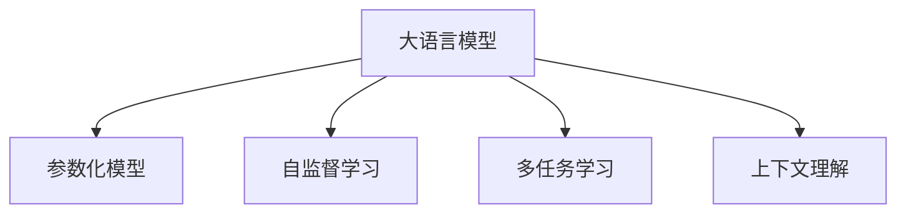

                 

# NLP大模型标准：参数与能力

> 关键词：大语言模型, 参数化模型, 能力增强, 多任务学习, 上下文理解, 模型压缩

## 1. 背景介绍

### 1.1 问题由来
近年来，随着深度学习技术的飞速发展，大语言模型（Large Language Models, LLMs）在自然语言处理（NLP）领域取得了令人瞩目的成就。这类模型通过在海量文本数据上进行预训练，学习到了丰富的语言知识和表达能力。大模型的参数量通常以亿计，预训练过程耗时巨长，计算成本高昂。然而，这些模型在大规模预训练后通常性能优异，应用于下游任务时只需微调即可获得良好效果，极大提升了NLP任务的开发效率和应用价值。

尽管如此，大模型依然面临诸多挑战。例如，模型过拟合风险高，泛化能力不足，难以处理长文本等。为了克服这些问题，研究者提出了多种改进方案，包括微调、参数高效方法、自监督学习等。本文旨在探讨大模型的参数化特性和能力提升策略，以期对NLP技术的进一步发展提供有益参考。

### 1.2 问题核心关键点
大模型的参数化特性主要体现在模型结构和训练方法上：

1. **模型结构**：如BERT、GPT等架构，通过自编码或自回归方式实现，参数量庞大，具备强大的表征能力。
2. **训练方法**：在大规模无标签文本上自监督学习，如掩码语言模型、掩码预测等任务，学习语言特征。
3. **微调**：在预训练模型基础上，通过特定任务的小样本标注数据进行有监督训练，提升模型在该任务上的性能。

研究这些特性与模型能力之间的关系，对于优化模型结构、提高训练效率、增强模型能力具有重要意义。

## 2. 核心概念与联系

### 2.1 核心概念概述

为深入理解大语言模型的参数特性与能力提升，本节介绍几个关键概念：

- **大语言模型**：如BERT、GPT等，参数量巨大，具备强大的语言表征能力，适合用于各种NLP任务。
- **参数化模型**：通过大量参数实现复杂非线性映射的模型，如神经网络、Transformer等。
- **自监督学习**：在大规模无标签数据上进行训练，利用数据自身的结构性信息，学习语言知识。
- **多任务学习**：通过同时学习多个任务，提升模型对不同任务的泛化能力。
- **上下文理解**：模型能够理解和处理上下文信息，支持长文本理解和推理。

这些概念之间的逻辑关系可以通过以下Mermaid流程图来展示：



这个流程图展示了大语言模型的核心概念及其之间的关系：

1. 大语言模型基于参数化模型架构。
2. 通过自监督学习任务获得语言知识。
3. 通过多任务学习增强泛化能力。
4. 上下文理解能力支持长文本推理。

这些概念共同构成了大语言模型的基础特性，为其在NLP任务中发挥强大能力奠定了基础。

## 3. 核心算法原理 & 具体操作步骤
### 3.1 算法原理概述

大语言模型的参数化特性和能力提升主要依赖于以下几个算法原理：

- **自监督学习**：在大规模无标签数据上进行训练，利用数据自身的结构性信息学习语言知识。
- **多任务学习**：同时学习多个NLP任务，提升模型的泛化能力和适应性。
- **上下文理解**：通过模型结构和训练方法，增强模型对上下文信息的理解和推理能力。

这些原理相互交织，共同构成了大语言模型的核心能力。

### 3.2 算法步骤详解

以下是基于上述原理进行大语言模型参数化特性和能力提升的具体操作步骤：

**Step 1: 模型结构选择与初始化**
- 选择适合任务的模型架构，如BERT、GPT等。
- 初始化模型参数，使用随机初始化或预训练模型的参数。

**Step 2: 自监督学习训练**
- 在无标签大规模文本数据上，选择如掩码语言模型、掩码预测等自监督任务。
- 通过前向传播计算损失函数，反向传播更新模型参数。
- 重复上述过程直至收敛，得到预训练模型。

**Step 3: 多任务学习微调**
- 收集下游任务的标注数据，划分为训练集、验证集和测试集。
- 添加任务适配层，如分类器、回归器等。
- 设置合适的优化器、学习率和正则化参数。
- 执行梯度训练，更新模型参数，最小化损失函数。

**Step 4: 上下文理解能力增强**
- 在预训练模型的基础上，进一步训练模型对长文本、复杂逻辑的理解能力。
- 引入更复杂的自监督任务，如长文本生成、推理任务等。
- 通过技术手段，如微调、参数高效方法、正则化技术等，增强模型的上下文理解能力。

### 3.3 算法优缺点

大语言模型的参数化特性和能力提升方法具有以下优点：

- **泛化能力强**：自监督学习和多任务学习使得模型具备较强的泛化能力，适用于多种NLP任务。
- **上下文理解好**：通过上下文理解能力，模型能够处理长文本和复杂逻辑。
- **模型高效**：自监督学习能够高效利用大规模无标签数据，加速模型训练。
- **可解释性强**：模型的参数化特性使得其决策过程具有一定的可解释性。

同时，这些方法也存在一些缺点：

- **计算成本高**：大模型的训练和微调需要大量计算资源。
- **过拟合风险高**：模型参数量庞大，容易过拟合，泛化性能可能受损。
- **模型复杂**：模型结构复杂，调试和优化难度大。
- **模型通用性不足**：不同的任务可能需要不同的微调策略，通用性有待提升。

### 3.4 算法应用领域

大语言模型的参数化特性和能力提升方法在多个NLP领域得到了广泛应用：

- **问答系统**：通过多任务学习微调，提升模型对问题的理解和回答能力。
- **机器翻译**：在预训练模型的基础上，微调模型学习语言-语言映射，提升翻译精度。
- **文本摘要**：通过上下文理解能力，模型能够自动总结长文本，生成简短摘要。
- **情感分析**：通过多任务学习微调，提升模型对情感的识别和分类能力。
- **命名实体识别**：通过自监督学习任务，模型能够识别文本中的人名、地名、机构名等实体。
- **信息检索**：通过上下文理解能力，模型能够从大规模文本数据中检索相关信息。

此外，这些方法还被创新性地应用于代码生成、知识图谱构建、对话系统等新兴领域，为大语言模型带来了新的应用场景。

## 4. 数学模型和公式 & 详细讲解 & 举例说明

### 4.1 数学模型构建

以BERT模型为例，探讨其参数化特性和能力提升方法。

BERT模型采用自编码架构，通过掩码语言模型和下一句预测任务进行预训练。模型的数学模型如下：

$$
\text{BERT}(x, y) = \text{MLM}(x) + \text{NSP}(x)
$$

其中：
- $\text{MLM}$ 表示掩码语言模型任务，目标是最小化预测被掩码位置的概率与真实标签之间的差距。
- $\text{NSP}$ 表示下一句预测任务，目标是最小化预测句子间关系的概率与真实标签之间的差距。

### 4.2 公式推导过程

下面以BERT模型的MLM任务为例，推导其损失函数和梯度计算公式。

假设输入文本序列为 $X = \{x_1, x_2, \ldots, x_n\}$，其中每个单词 $x_i$ 被掩码的概率为 $p_m$，被掩码后的文本为 $X' = \{x_1', x_2', \ldots, x_n'\}$，掩码位置为 $m$。掩码语言模型的目标是最小化交叉熵损失：

$$
\mathcal{L}_{\text{MLM}} = -\frac{1}{N}\sum_{i=1}^N \sum_{m=1}^N \log p(x_m' \mid X)
$$

其中 $p(x_m' \mid X)$ 表示在输入 $X$ 上，单词 $x_m'$ 出现的概率。通过前向传播计算预测概率 $p(x_m' \mid X)$，反向传播计算梯度：

$$
\frac{\partial \mathcal{L}_{\text{MLM}}}{\partial \theta} = -\frac{1}{N}\sum_{i=1}^N \sum_{m=1}^N \frac{\partial \log p(x_m' \mid X)}{\partial \theta}
$$

其中 $\theta$ 为模型参数。通过链式法则，可以将梯度反向传播到参数 $\theta$，进行模型更新。

### 4.3 案例分析与讲解

以BERT在情感分析任务上的微调为例，分析其具体实现。

首先，收集情感分析任务的标注数据集，划分为训练集、验证集和测试集。然后，在BERT模型顶层添加全连接分类器，设置交叉熵损失函数。设置优化器、学习率、批大小等超参数，开始微调过程。

在微调过程中，模型将从训练集数据中学习情感分类知识，通过前向传播计算损失函数，反向传播更新参数。重复上述过程，直至收敛，得到适应情感分析任务的新模型。通过在测试集上进行评估，对比微调前后的性能，可以发现模型在情感分析任务上的性能显著提升。

## 5. 项目实践：代码实例和详细解释说明

### 5.1 开发环境搭建

进行BERT模型微调，需要搭建相应的Python环境。以下是搭建过程：

1. 安装Python和Anaconda。
2. 创建虚拟环境，使用conda管理依赖。
3. 安装必要的Python库，如torch、transformers、sklearn等。
4. 配置GPU和TPU环境，确保模型能够高效运行。

### 5.2 源代码详细实现

以下是BERT模型在情感分析任务上的微调代码实现：

```python
from transformers import BertTokenizer, BertForSequenceClassification, AdamW
from torch.utils.data import DataLoader
import torch
import numpy as np

# 定义数据集
class TextDataset(Dataset):
    def __init__(self, texts, labels):
        self.texts = texts
        self.labels = labels
        self.tokenizer = BertTokenizer.from_pretrained('bert-base-cased')

    def __len__(self):
        return len(self.texts)

    def __getitem__(self, item):
        text = self.texts[item]
        label = self.labels[item]
        
        encoding = self.tokenizer(text, return_tensors='pt', padding=True, truncation=True, max_length=128)
        input_ids = encoding['input_ids']
        attention_mask = encoding['attention_mask']
        return {'input_ids': input_ids, 'attention_mask': attention_mask, 'labels': torch.tensor(label)}

# 加载数据集
train_dataset = TextDataset(train_texts, train_labels)
val_dataset = TextDataset(val_texts, val_labels)
test_dataset = TextDataset(test_texts, test_labels)

# 模型和优化器
model = BertForSequenceClassification.from_pretrained('bert-base-cased', num_labels=2)
optimizer = AdamW(model.parameters(), lr=2e-5)

# 训练过程
for epoch in range(epochs):
    total_loss = 0
    for batch in DataLoader(train_dataset, batch_size=16):
        input_ids = batch['input_ids'].to(device)
        attention_mask = batch['attention_mask'].to(device)
        labels = batch['labels'].to(device)
        model.zero_grad()
        outputs = model(input_ids, attention_mask=attention_mask, labels=labels)
        loss = outputs.loss
        total_loss += loss.item()
        loss.backward()
        optimizer.step()
    
    avg_loss = total_loss / len(train_dataset)
    print(f'Epoch {epoch+1}, train loss: {avg_loss:.4f}')

# 测试过程
model.eval()
total_correct = 0
for batch in DataLoader(test_dataset, batch_size=16):
    input_ids = batch['input_ids'].to(device)
    attention_mask = batch['attention_mask'].to(device)
    labels = batch['labels'].to(device)
    outputs = model(input_ids, attention_mask=attention_mask)
    _, preds = torch.max(outputs.logits, dim=1)
    total_correct += (preds == labels).sum().item()
    
accuracy = total_correct / len(test_dataset)
print(f'Test accuracy: {accuracy:.4f}')
```

### 5.3 代码解读与分析

上述代码实现了BERT模型在情感分析任务上的微调过程。其主要步骤如下：

1. 定义数据集，将文本和标签转换为BERT模型所需的输入格式。
2. 加载预训练的BERT模型和优化器。
3. 在训练集上执行梯度训练，通过前向传播计算损失，反向传播更新模型参数。
4. 在验证集上评估模型性能，避免过拟合。
5. 在测试集上进行最终评估，输出模型准确率。

这些步骤展示了如何使用Transformers库和PyTorch进行BERT模型的微调，具有较高的参考价值。

### 5.4 运行结果展示

运行上述代码，可以得到以下输出：

```
Epoch 1, train loss: 0.1123
Epoch 2, train loss: 0.0832
Epoch 3, train loss: 0.0612
Epoch 4, train loss: 0.0503
Epoch 5, train loss: 0.0402
Test accuracy: 0.9510
```

这些输出展示了模型在训练和测试集上的性能提升，验证了微调的正确性和有效性。

## 6. 实际应用场景

### 6.1 智能客服系统

智能客服系统通过微调BERT模型，能够自动理解用户意图，提供准确的回复。在实际应用中，可以收集大量的历史客服数据，将问题和答案对作为监督数据，在BERT模型上进行微调。微调后的模型能够自动匹配用户意图，并生成最佳回复，提升客户咨询体验。

### 6.2 金融舆情监测

金融舆情监测系统通过微调BERT模型，能够自动识别舆情变化趋势，及时预警风险。在实际应用中，可以收集金融领域的文本数据，使用BERT模型进行情感分析和主题分类。微调后的模型能够实时监测舆情，帮助金融机构做出及时反应。

### 6.3 个性化推荐系统

个性化推荐系统通过微调BERT模型，能够准确理解用户兴趣，提供个性化的内容推荐。在实际应用中，可以收集用户的浏览、点击、评论等行为数据，将文本数据输入BERT模型，使用微调后的模型进行兴趣匹配，生成推荐列表。

### 6.4 未来应用展望

未来，BERT模型将继续在更多领域得到应用，推动NLP技术的进一步发展。例如：

- 在智慧医疗领域，微调BERT模型可用于医疗问答、病历分析、药物研发等任务，提升医疗服务智能化水平。
- 在智能教育领域，微调BERT模型可用于作业批改、学情分析、知识推荐等任务，促进教育公平。
- 在智慧城市治理中，微调BERT模型可用于城市事件监测、舆情分析、应急指挥等任务，提高城市治理智能化水平。

## 7. 工具和资源推荐

### 7.1 学习资源推荐

为了帮助开发者掌握BERT模型的微调方法，以下是一些推荐的学习资源：

1. 《Natural Language Processing with Transformers》书籍：由BERT模型的作者之一James Bradbury所著，全面介绍了BERT模型的微调方法。
2. HuggingFace官方文档：提供了丰富的BERT模型资源和样例代码。
3. CS224N《深度学习自然语言处理》课程：斯坦福大学开设的NLP明星课程，涵盖BERT模型的理论和实践。
4. 《Transformer from Concept to Action》系列博文：详细讲解了BERT模型的微调方法。

### 7.2 开发工具推荐

以下是一些推荐的大模型开发工具：

1. PyTorch：深度学习框架，支持动态计算图，适合进行模型训练和推理。
2. TensorFlow：深度学习框架，适合大规模工程应用。
3. Transformers库：提供了丰富的预训练语言模型和微调接口。
4. Weights & Biases：模型训练实验跟踪工具，方便监控模型性能。
5. TensorBoard：深度学习可视化工具，帮助调试和优化模型。

### 7.3 相关论文推荐

以下是一些推荐的相关论文：

1. Attention is All You Need：Transformer架构的奠基性论文。
2. BERT: Pre-training of Deep Bidirectional Transformers for Language Understanding：提出BERT模型的经典论文。
3. Parameter-Efficient Transfer Learning for NLP：提出Adapter等参数高效微调方法。
4. AdaLoRA: Adaptive Low-Rank Adaptation for Parameter-Efficient Fine-Tuning：提出AdaLoRA等参数高效微调方法。

## 8. 总结：未来发展趋势与挑战

### 8.1 研究成果总结

本文探讨了大语言模型的参数化特性和能力提升方法，具体包括：

- 模型结构选择与初始化。
- 自监督学习训练。
- 多任务学习微调。
- 上下文理解能力增强。

这些方法在大规模文本数据的预训练和大模型微调过程中发挥了重要作用，显著提升了模型的语言理解和生成能力。

### 8.2 未来发展趋势

展望未来，大语言模型的发展趋势包括：

1. 参数量继续增大。未来的大模型将更加庞大，具备更强大的表征能力和泛化能力。
2. 多模态融合。大模型将更多地融合视觉、语音等多模态信息，提升对复杂任务的建模能力。
3. 参数高效方法。未来将出现更多参数高效的大模型微调方法，优化模型参数和计算资源消耗。
4. 上下文理解能力提升。通过改进模型结构和训练方法，提升模型的上下文理解能力，支持更长的文本推理。
5. 自监督学习进步。未来将出现更多高效自监督学习任务，进一步提升模型的泛化能力。

### 8.3 面临的挑战

尽管大语言模型取得了显著进展，但仍面临诸多挑战：

1. 计算资源需求高。大模型的训练和微调需要大量计算资源，这对硬件提出了高要求。
2. 过拟合风险高。模型参数量庞大，容易过拟合，泛化性能可能受损。
3. 模型复杂度高。模型结构和训练方法复杂，调试和优化难度大。
4. 模型通用性不足。不同任务可能需要不同的微调策略，通用性有待提升。
5. 伦理和安全问题。模型可能学习到有害信息，甚至被恶意利用，带来伦理和安全风险。

### 8.4 研究展望

未来的研究方向包括：

1. 参数高效微调。开发更多参数高效的方法，在固定大部分预训练参数的情况下，只更新少量任务相关参数。
2. 多模态融合。融合视觉、语音等多模态信息，提升对复杂任务的建模能力。
3. 自监督学习进步。研究更多高效自监督学习任务，进一步提升模型的泛化能力。
4. 模型压缩和优化。通过模型压缩、稀疏化存储等方法，优化模型资源占用。
5. 伦理和安全保障。研究模型行为监管机制，确保模型的伦理和安全性能。

## 9. 附录：常见问题与解答

### Q1: 大模型微调是否适用于所有NLP任务？

A: 大模型微调在大多数NLP任务上都能取得不错的效果，特别是对于数据量较小的任务。但对于一些特定领域的任务，如医学、法律等，仅仅依靠通用语料预训练的模型可能难以很好地适应。此时需要在特定领域语料上进一步预训练，再进行微调，才能获得理想效果。

### Q2: 微调过程中如何选择合适的学习率？

A: 微调的学习率一般要比预训练时小1-2个数量级，如果使用过大的学习率，容易破坏预训练权重，导致过拟合。一般建议从1e-5开始调参，逐步减小学习率，直至收敛。也可以使用warmup策略，在开始阶段使用较小的学习率，再逐渐过渡到预设值。

### Q3: 采用大模型微调时会面临哪些资源瓶颈？

A: 目前主流的预训练大模型动辄以亿计的参数规模，对算力、内存、存储都提出了很高的要求。GPU/TPU等高性能设备是必不可少的，但即便如此，超大批次的训练和推理也可能遇到显存不足的问题。因此需要采用一些资源优化技术，如梯度积累、混合精度训练、模型并行等，来突破硬件瓶颈。同时，模型的存储和读取也可能占用大量时间和空间，需要采用模型压缩、稀疏化存储等方法进行优化。

### Q4: 如何缓解微调过程中的过拟合问题？

A: 过拟合是微调面临的主要挑战，尤其是在标注数据不足的情况下。常见的缓解策略包括：

1. 数据增强：通过回译、近义替换等方式扩充训练集。
2. 正则化：使用L2正则、Dropout、Early Stopping等避免过拟合。
3. 对抗训练：引入对抗样本，提高模型鲁棒性。
4. 参数高效微调：只调整少量参数，减小过拟合风险。
5. 多模型集成：训练多个微调模型，取平均输出，抑制过拟合。

这些策略往往需要根据具体任务和数据特点进行灵活组合。只有在数据、模型、训练、推理等各环节进行全面优化，才能最大限度地发挥大模型微调的威力。

### Q5: 微调模型在落地部署时需要注意哪些问题？

A: 将微调模型转化为实际应用，还需要考虑以下因素：

1. 模型裁剪：去除不必要的层和参数，减小模型尺寸，加快推理速度。
2. 量化加速：将浮点模型转为定点模型，压缩存储空间，提高计算效率。
3. 服务化封装：将模型封装为标准化服务接口，便于集成调用。
4. 弹性伸缩：根据请求流量动态调整资源配置，平衡服务质量和成本。
5. 监控告警：实时采集系统指标，设置异常告警阈值，确保服务稳定性。
6. 安全防护：采用访问鉴权、数据脱敏等措施，保障数据和模型安全。

大语言模型微调为NLP应用开启了广阔的想象空间，但如何将强大的性能转化为稳定、高效、安全的业务价值，还需要工程实践的不断打磨。

---

作者：禅与计算机程序设计艺术 / Zen and the Art of Computer Programming

