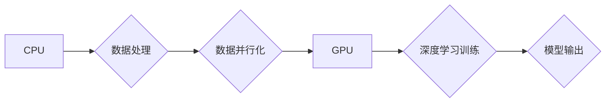

> GPU, CUDA, 深度学习, AI算力, 训练速度, 并行计算, 

## 1. 背景介绍

人工智能（AI）的蓬勃发展，特别是深度学习技术的兴起，对算力提出了前所未有的需求。传统CPU架构在处理海量数据和复杂的模型计算时，面临着瓶颈。而NVIDIA的GPU（图形处理单元）凭借其强大的并行计算能力，成为了AI训练和推理的理想选择。

从20世纪90年代初，NVIDIA开始将GPU应用于科学计算和高性能计算领域。随着GPU架构的不断演进，其并行计算能力得到显著提升，并逐渐成为深度学习训练的最佳平台。

## 2. 核心概念与联系

### 2.1 GPU架构

GPU的核心架构与CPU不同，它拥有大量的并行计算单元，可以同时处理多个任务。每个计算单元负责执行简单的计算操作，通过并行执行，可以大幅提高计算速度。

### 2.2 CUDA架构

NVIDIA开发的CUDA（Compute Unified Device Architecture）是GPU编程的平台和API。CUDA允许开发者将程序移植到GPU上，并利用其强大的并行计算能力。

### 2.3 深度学习

深度学习是一种机器学习的子领域，它利用多层神经网络来模拟人类大脑的学习过程。深度学习模型通常需要大量的训练数据和计算资源，GPU的并行计算能力可以显著加速训练速度。

**Mermaid 流程图**



## 3. 核心算法原理 & 具体操作步骤

### 3.1 算法原理概述

深度学习算法的核心是神经网络，它由多个层级的神经元组成。每个神经元接收输入信号，经过激活函数处理后，输出信号到下一层神经元。通过调整神经网络的权重和偏置，可以使模型学习到数据的特征和规律。

### 3.2 算法步骤详解

1. **数据预处理:** 将原始数据转换为模型可以理解的格式，例如归一化、编码等。
2. **模型构建:** 根据任务需求，选择合适的深度学习模型架构，例如卷积神经网络（CNN）、循环神经网络（RNN）等。
3. **模型训练:** 使用训练数据，通过反向传播算法，调整模型的权重和偏置，使模型的预测结果与真实值尽可能接近。
4. **模型评估:** 使用测试数据，评估模型的性能，例如准确率、召回率等。
5. **模型部署:** 将训练好的模型部署到实际应用场景中，例如图像识别、自然语言处理等。

### 3.3 算法优缺点

**优点:**

* 能够学习复杂的数据模式
* 性能优于传统机器学习算法
* 广泛应用于各种领域

**缺点:**

* 需要大量的训练数据
* 训练时间长
* 模型解释性差

### 3.4 算法应用领域

深度学习算法广泛应用于以下领域：

* **计算机视觉:** 图像识别、物体检测、图像分割等
* **自然语言处理:** 文本分类、机器翻译、语音识别等
* **推荐系统:** 商品推荐、用户画像等
* **医疗诊断:** 病情预测、疾病诊断等

## 4. 数学模型和公式 & 详细讲解 & 举例说明

### 4.1 数学模型构建

深度学习模型的核心是神经网络，它可以看作是一个多层感知机。每个神经元接收多个输入信号，经过加权求和和激活函数处理后，输出一个信号。

**神经元模型:**

$$
y = f(w_1x_1 + w_2x_2 + ... + w_nx_n + b)
$$

其中：

* $y$ 是神经元的输出
* $x_1, x_2, ..., x_n$ 是输入信号
* $w_1, w_2, ..., w_n$ 是权重
* $b$ 是偏置
* $f$ 是激活函数

### 4.2 公式推导过程

反向传播算法是深度学习模型训练的核心算法。它通过计算误差梯度，更新模型的权重和偏置，使模型的预测结果与真实值尽可能接近。

**误差函数:**

$$
E = \frac{1}{2} \sum_{i=1}^{N} (y_i - \hat{y}_i)^2
$$

其中：

* $E$ 是误差
* $N$ 是样本数量
* $y_i$ 是真实值
* $\hat{y}_i$ 是预测值

**梯度下降:**

$$
\theta = \theta - \alpha \frac{\partial E}{\partial \theta}
$$

其中：

* $\theta$ 是权重和偏置
* $\alpha$ 是学习率

### 4.3 案例分析与讲解

**图像分类:**

使用CNN模型进行图像分类，例如识别猫和狗的图片。

* 输入图像数据
* 通过卷积层提取图像特征
* 通过池化层降低特征维度
* 通过全连接层进行分类

## 5. 项目实践：代码实例和详细解释说明

### 5.1 开发环境搭建

* 安装Python和必要的库，例如TensorFlow、PyTorch等。
* 安装CUDA和cuDNN，以便使用GPU进行计算。

### 5.2 源代码详细实现

```python
import tensorflow as tf

# 定义模型
model = tf.keras.models.Sequential([
    tf.keras.layers.Conv2D(32, (3, 3), activation='relu', input_shape=(28, 28, 1)),
    tf.keras.layers.MaxPooling2D((2, 2)),
    tf.keras.layers.Conv2D(64, (3, 3), activation='relu'),
    tf.keras.layers.MaxPooling2D((2, 2)),
    tf.keras.layers.Flatten(),
    tf.keras.layers.Dense(10, activation='softmax')
])

# 编译模型
model.compile(optimizer='adam',
              loss='sparse_categorical_crossentropy',
              metrics=['accuracy'])

# 训练模型
model.fit(x_train, y_train, epochs=5)

# 评估模型
loss, accuracy = model.evaluate(x_test, y_test)
print('Test loss:', loss)
print('Test accuracy:', accuracy)
```

### 5.3 代码解读与分析

* 使用TensorFlow框架构建一个简单的CNN模型。
* 模型包含两层卷积层、两层池化层和一层全连接层。
* 使用Adam优化器、交叉熵损失函数和准确率作为评估指标。
* 使用训练数据训练模型，并使用测试数据评估模型性能。

### 5.4 运行结果展示

训练完成后，可以查看模型的训练和测试准确率，以及训练过程中的损失函数变化趋势。

## 6. 实际应用场景

### 6.1 图像识别

* **人脸识别:** 用于解锁手机、身份验证等。
* **物体检测:** 用于自动驾驶、安防监控等。
* **医学影像分析:** 用于疾病诊断、肿瘤检测等。

### 6.2 自然语言处理

* **机器翻译:** 将一种语言翻译成另一种语言。
* **文本摘要:** 自动生成文本的摘要。
* **聊天机器人:** 用于与用户进行对话。

### 6.3 其他应用

* **推荐系统:** 根据用户的历史行为，推荐相关的商品或内容。
* **语音识别:** 将语音转换为文本。
* **金融风险评估:** 用于识别和评估金融风险。

### 6.4 未来应用展望

随着AI技术的不断发展，GPU在未来将有更广泛的应用场景，例如：

* **增强现实 (AR) 和虚拟现实 (VR):** 提供更逼真的虚拟体验。
* **自动驾驶:** 提高自动驾驶汽车的安全性、可靠性和智能化程度。
* **药物研发:** 加速药物研发过程，降低研发成本。

## 7. 工具和资源推荐

### 7.1 学习资源推荐

* **NVIDIA官网:** https://developer.nvidia.com/
* **CUDA官方文档:** https://docs.nvidia.com/cuda/
* **TensorFlow官方文档:** https://www.tensorflow.org/
* **PyTorch官方文档:** https://pytorch.org/

### 7.2 开发工具推荐

* **CUDA Toolkit:** 用于开发GPU应用程序。
* **cuDNN:** 用于加速深度学习算法的库。
* **TensorFlow:** 深度学习框架。
* **PyTorch:** 深度学习框架。

### 7.3 相关论文推荐

* **ImageNet Classification with Deep Convolutional Neural Networks**
* **Deep Learning**
* **Attention Is All You Need**

## 8. 总结：未来发展趋势与挑战

### 8.1 研究成果总结

NVIDIA的GPU在AI算力提升方面取得了显著成果，加速了深度学习算法的训练和应用。

### 8.2 未来发展趋势

* **GPU架构的进一步优化:** 提升GPU的并行计算能力、内存带宽和能源效率。
* **新一代AI芯片的研发:** 开发专门用于AI计算的芯片，例如TPU、英伟达的Grace Hopper超级芯片等。
* **边缘计算的兴起:** 将AI模型部署到边缘设备上，实现更低延迟和更高效率的计算。

### 8.3 面临的挑战

* **算力需求的持续增长:** AI模型越来越复杂，对算力的需求也越来越高。
* **能源消耗问题:** GPU的计算过程消耗大量的能源，需要寻找更节能的解决方案。
* **人才短缺:** AI领域需要大量的高素质人才，人才短缺是一个制约发展的瓶颈。

### 8.4 研究展望

未来，AI算力将继续提升，新的算法和模型将不断涌现，AI技术将应用于更广泛的领域，为人类社会带来更多福祉。

## 9. 附录：常见问题与解答

**Q1: CUDA是什么？**

A1: CUDA（Compute Unified Device Architecture）是NVIDIA开发的GPU编程平台和API，允许开发者将程序移植到GPU上，并利用其强大的并行计算能力。

**Q2: 如何使用GPU进行深度学习训练？**

A2: 需要安装CUDA和cuDNN，并使用支持GPU的深度学习框架，例如TensorFlow或PyTorch。

**Q3: GPU的优势是什么？**

A3: GPU拥有大量的并行计算单元，可以大幅提高深度学习模型的训练速度。

**作者：禅与计算机程序设计艺术 / Zen and the Art of Computer Programming**


<end_of_turn>