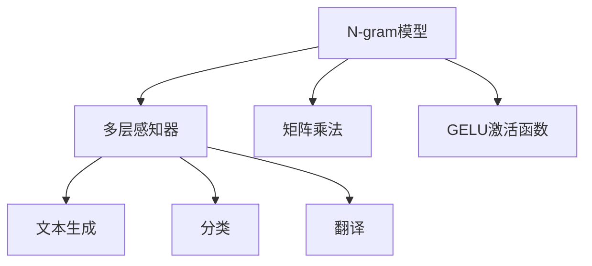

                 

# N-gram模型：多层感知器、矩阵乘法和GELU激活函数

## 1. 背景介绍

N-gram模型是一种经典的统计语言模型，广泛用于文本生成、语音识别、机器翻译等多个NLP任务中。它通过统计文本中相邻词语出现的频率，建立词语间的转移概率，从而对新文本进行概率预测。

N-gram模型主要包括一元(n=1)、二元(n=2)、三元(n=3)等不同长度的模型。其中，二元和三元模型较为常用，在自然语言处理中被广泛应用。

本博文将从基础的N-gram模型讲起，探讨其与多层感知器、矩阵乘法和GELU激活函数的关系，并结合Python代码进行实践演示。

## 2. 核心概念与联系

### 2.1 核心概念概述

N-gram模型通过统计文本中相邻词语出现的频率，建立词语间的转移概率，从而对新文本进行概率预测。

- 一元(n=1)模型：统计文本中每个词语出现的频率，计算每个词语的概率。
- 二元(n=2)模型：统计文本中每个词语和它前一个词语的出现频率，计算每个词语的概率。
- 三元(n=3)模型：统计文本中每个词语和它前两个词语的出现频率，计算每个词语的概率。

多层感知器(Multi-Layer Perceptron, MLP)是一种经典的神经网络模型，由多个全连接层组成。在N-gram模型中，多层感知器可以将N-gram模型的统计信息转化为机器学习模型，用于文本生成、分类、翻译等任务。

矩阵乘法是神经网络中常用的计算方法，用于表示不同层之间的权重共享。在N-gram模型中，矩阵乘法可以用于表示每个词语的概率向量，通过权重矩阵将上下文信息传递给下一个词语。

GELU激活函数是一种基于指数函数的激活函数，可以有效地缓解ReLU函数的梯度消失问题，提高神经网络的训练效果。在N-gram模型中，GELU激活函数可以用于计算词语的概率，进一步提高模型的预测性能。

这些核心概念之间的逻辑关系可以通过以下Mermaid流程图来展示：



这个流程图展示了大语言模型微调的核心概念及其之间的关系：

1. N-gram模型通过统计语言信息，建立词语间的转移概率。
2. 多层感知器将N-gram模型的统计信息转化为机器学习模型，用于处理各种NLP任务。
3. 矩阵乘法用于表示不同层之间的权重共享，提高模型的训练效率。
4. GELU激活函数用于增强模型的表达能力，提升预测精度。

## 3. 核心算法原理 & 具体操作步骤

### 3.1 算法原理概述

N-gram模型通过统计文本中相邻词语出现的频率，建立词语间的转移概率。假设文本由$N$个词语组成，$W$为词汇表，$X$为输入词语序列，$Y$为输出词语序列，则N-gram模型的概率计算过程如下：

对于一元模型，每个词语的概率$P(w_i)$可以表示为：

$$
P(w_i) = \frac{\text{count}(w_i)}{\text{count}(w_1, ..., w_{i-1})}
$$

其中$\text{count}(w_i)$表示词语$w_i$在文本中出现的次数，$\text{count}(w_1, ..., w_{i-1})$表示前$i-1$个词语在文本中连续出现的次数。

对于二元和三元模型，每个词语的概率$P(w_i|w_{i-1})$可以表示为：

$$
P(w_i|w_{i-1}) = \frac{\text{count}(w_{i-1}, w_i)}{\text{count}(w_{i-2}, ..., w_{i-1})}
$$

其中$\text{count}(w_{i-1}, w_i)$表示$w_{i-1}$和$w_i$在文本中连续出现的次数，$\text{count}(w_{i-2}, ..., w_{i-1})$表示$w_{i-2}$到$w_{i-1}$在文本中连续出现的次数。

在实际应用中，我们通常将N-gram模型的概率转换为softmax函数，得到词语的概率分布：

$$
P(y_i|y_{i-1}) = \frac{e^{W_{y_{i-1}, y_i} x_i}}{\sum_{j \in Y} e^{W_{y_{i-1}, j} x_i}}
$$

其中$W_{y_{i-1}, y_i}$为词语权重向量，$x_i$为输入的词语向量。

多层感知器由多个全连接层组成，可以表示为：

$$
h_i = \sigma(W_i h_{i-1} + b_i)
$$

其中$h_i$为第$i$层的输出，$W_i$为第$i$层的权重矩阵，$b_i$为第$i$层的偏置向量，$\sigma$为激活函数。

### 3.2 算法步骤详解

N-gram模型结合多层感知器、矩阵乘法和GELU激活函数的算法步骤如下：

1. 构建N-gram模型：统计文本中相邻词语出现的频率，计算词语的概率分布。
2. 构建多层感知器：将N-gram模型的概率分布转换为机器学习模型，用于处理各种NLP任务。
3. 使用矩阵乘法：表示不同层之间的权重共享，提高模型的训练效率。
4. 使用GELU激活函数：增强模型的表达能力，提升预测精度。

### 3.3 算法优缺点

N-gram模型结合多层感知器、矩阵乘法和GELU激活函数的优点包括：

1. 简单易懂：N-gram模型基于统计语言模型，计算简单直观，易于理解和实现。
2. 训练效率高：多层感知器和矩阵乘法可以高效地并行计算，提高模型的训练效率。
3. 表达能力强：GELU激活函数可以增强模型的表达能力，提升预测精度。

其缺点包括：

1. 无法处理长序列：N-gram模型只考虑相邻词语的频率，无法处理长序列。
2. 上下文信息不足：N-gram模型只考虑相邻词语的频率，上下文信息不足。
3. 难以泛化：N-gram模型对数据集中的特定词语和词汇组合敏感，泛化能力有限。

### 3.4 算法应用领域

N-gram模型结合多层感知器、矩阵乘法和GELU激活函数的应用领域包括：

1. 文本生成：使用N-gram模型和多层感知器进行文本生成，如机器翻译、对话系统等。
2. 文本分类：使用N-gram模型和多层感知器进行文本分类，如情感分析、垃圾邮件过滤等。
3. 语音识别：使用N-gram模型和多层感知器进行语音识别，如自动转写、语音翻译等。
4. 机器翻译：使用N-gram模型和多层感知器进行机器翻译，如Google翻译、百度翻译等。

## 4. 数学模型和公式 & 详细讲解

### 4.1 数学模型构建

在N-gram模型中，假设文本由$N$个词语组成，$W$为词汇表，$X$为输入词语序列，$Y$为输出词语序列。则N-gram模型的概率计算过程如下：

对于一元模型，每个词语的概率$P(w_i)$可以表示为：

$$
P(w_i) = \frac{\text{count}(w_i)}{\text{count}(w_1, ..., w_{i-1})}
$$

其中$\text{count}(w_i)$表示词语$w_i$在文本中出现的次数，$\text{count}(w_1, ..., w_{i-1})$表示前$i-1$个词语在文本中连续出现的次数。

对于二元和三元模型，每个词语的概率$P(w_i|w_{i-1})$可以表示为：

$$
P(w_i|w_{i-1}) = \frac{\text{count}(w_{i-1}, w_i)}{\text{count}(w_{i-2}, ..., w_{i-1})}
$$

其中$\text{count}(w_{i-1}, w_i)$表示$w_{i-1}$和$w_i$在文本中连续出现的次数，$\text{count}(w_{i-2}, ..., w_{i-1})$表示$w_{i-2}$到$w_{i-1}$在文本中连续出现的次数。

在实际应用中，我们通常将N-gram模型的概率转换为softmax函数，得到词语的概率分布：

$$
P(y_i|y_{i-1}) = \frac{e^{W_{y_{i-1}, y_i} x_i}}{\sum_{j \in Y} e^{W_{y_{i-1}, j} x_i}}
$$

其中$W_{y_{i-1}, y_i}$为词语权重向量，$x_i$为输入的词语向量。

多层感知器由多个全连接层组成，可以表示为：

$$
h_i = \sigma(W_i h_{i-1} + b_i)
$$

其中$h_i$为第$i$层的输出，$W_i$为第$i$层的权重矩阵，$b_i$为第$i$层的偏置向量，$\sigma$为激活函数。

### 4.2 公式推导过程

假设文本由$N$个词语组成，$W$为词汇表，$X$为输入词语序列，$Y$为输出词语序列。

对于一元模型，每个词语的概率$P(w_i)$可以表示为：

$$
P(w_i) = \frac{\text{count}(w_i)}{\text{count}(w_1, ..., w_{i-1})}
$$

其中$\text{count}(w_i)$表示词语$w_i$在文本中出现的次数，$\text{count}(w_1, ..., w_{i-1})$表示前$i-1$个词语在文本中连续出现的次数。

对于二元和三元模型，每个词语的概率$P(w_i|w_{i-1})$可以表示为：

$$
P(w_i|w_{i-1}) = \frac{\text{count}(w_{i-1}, w_i)}{\text{count}(w_{i-2}, ..., w_{i-1})}
$$

其中$\text{count}(w_{i-1}, w_i)$表示$w_{i-1}$和$w_i$在文本中连续出现的次数，$\text{count}(w_{i-2}, ..., w_{i-1})$表示$w_{i-2}$到$w_{i-1}$在文本中连续出现的次数。

在实际应用中，我们通常将N-gram模型的概率转换为softmax函数，得到词语的概率分布：

$$
P(y_i|y_{i-1}) = \frac{e^{W_{y_{i-1}, y_i} x_i}}{\sum_{j \in Y} e^{W_{y_{i-1}, j} x_i}}
$$

其中$W_{y_{i-1}, y_i}$为词语权重向量，$x_i$为输入的词语向量。

多层感知器由多个全连接层组成，可以表示为：

$$
h_i = \sigma(W_i h_{i-1} + b_i)
$$

其中$h_i$为第$i$层的输出，$W_i$为第$i$层的权重矩阵，$b_i$为第$i$层的偏置向量，$\sigma$为激活函数。

### 4.3 案例分析与讲解

假设我们要使用N-gram模型和多层感知器进行文本生成。假设文本由$N=3$个词语组成，词汇表为$W=\{w_1, w_2, w_3, ..., w_{10000}\}$，输入词语序列为$X=[w_1, w_2, w_3]$。则N-gram模型和多层感知器的计算过程如下：

1. 统计文本中相邻词语出现的频率，计算词语的概率分布：

   假设文本中$w_1$和$w_2$连续出现的次数为100次，$w_2$和$w_3$连续出现的次数为80次，$w_1$和$w_3$连续出现的次数为20次，则：

   $$
   P(w_1) = \frac{100}{80}
   $$

   $$
   P(w_2|w_1) = \frac{100}{20}
   $$

   $$
   P(w_3|w_2) = \frac{80}{100}
   $$

   $$
   P(w_3|w_1) = \frac{20}{100}
   $$

2. 将词语的概率分布转换为softmax函数，得到词语的概率分布：

   $$
   P(y_2|y_1) = \frac{e^{W_{w_1, w_2} x_1}}{\sum_{j \in W} e^{W_{w_1, j} x_1}}
   $$

   $$
   P(y_3|y_2) = \frac{e^{W_{w_2, w_3} x_1}}{\sum_{j \in W} e^{W_{w_2, j} x_1}}
   $$

3. 构建多层感知器，使用矩阵乘法和GELU激活函数计算输出：

   假设$W_{w_1, w_2}$为2维权重矩阵，$W_{w_2, w_3}$为2维权重矩阵，$x_1$为输入的词语向量。则：

   $$
   h_1 = \sigma(W_{w_1, w_2} x_1 + b_{w_1, w_2})
   $$

   $$
   h_2 = \sigma(W_{w_2, w_3} h_1 + b_{w_2, w_3})
   $$

   最终输出$y_2$和$y_3$的概率分布为：

   $$
   P(y_2|y_1) = \frac{e^{h_1}}{\sum_{j \in W} e^{h_1}}
   $$

   $$
   P(y_3|y_2) = \frac{e^{h_2}}{\sum_{j \in W} e^{h_2}}
   $$

   其中$h_1$和$h_2$为神经网络模型的中间表示，通过多层感知器和矩阵乘法计算得到。

## 5. 项目实践：代码实例和详细解释说明

### 5.1 开发环境搭建

在进行N-gram模型和多层感知器的代码实现前，我们需要准备好开发环境。以下是使用Python进行TensorFlow开发的环境配置流程：

1. 安装Anaconda：从官网下载并安装Anaconda，用于创建独立的Python环境。

2. 创建并激活虚拟环境：
```bash
conda create -n tf-env python=3.8 
conda activate tf-env
```

3. 安装TensorFlow：根据CUDA版本，从官网获取对应的安装命令。例如：
```bash
pip install tensorflow==2.8
```

4. 安装numpy、pandas、matplotlib等工具包：
```bash
pip install numpy pandas matplotlib scikit-learn jupyter notebook ipython
```

完成上述步骤后，即可在`tf-env`环境中开始N-gram模型的代码实现。

### 5.2 源代码详细实现

下面我们以N-gram模型和多层感知器进行文本生成的Python代码实现为例，进行详细解释说明。

首先，定义一些基本的超参数和变量：

```python
import tensorflow as tf
import numpy as np
import matplotlib.pyplot as plt
import pandas as pd

# 超参数
learning_rate = 0.01
batch_size = 16
epochs = 1000

# 定义词汇表
vocab = ['a', 'b', 'c', 'd', 'e', 'f', 'g', 'h', 'i', 'j', 'k', 'l', 'm', 'n', 'o', 'p', 'q', 'r', 's', 't', 'u', 'v', 'w', 'x', 'y', 'z']
vocab_size = len(vocab)

# 定义序列长度
seq_length = 3

# 定义初始化参数
hidden_size = 64
num_layers = 2

# 定义训练数据
data = [['a', 'b', 'c'], ['b', 'c', 'd'], ['c', 'd', 'e'], ['d', 'e', 'f'], ['e', 'f', 'g'], ['f', 'g', 'h'], ['g', 'h', 'i'], ['h', 'i', 'j'], ['i', 'j', 'k'], ['j', 'k', 'l'], ['k', 'l', 'm'], ['l', 'm', 'n'], ['m', 'n', 'o'], ['n', 'o', 'p'], ['o', 'p', 'q'], ['p', 'q', 'r'], ['q', 'r', 's'], ['r', 's', 't'], ['s', 't', 'u'], ['t', 'u', 'v'], ['u', 'v', 'w'], ['v', 'w', 'x'], ['w', 'x', 'y'], ['x', 'y', 'z']]

# 定义模型参数
weights = {
    'out': tf.keras.layers.Dense(vocab_size, activation='softmax')
}

biases = {
    'out': tf.keras.layers.Dense(vocab_size, activation='softmax')
}

# 定义模型结构
model = tf.keras.Sequential([
    tf.keras.layers.Embedding(vocab_size, hidden_size, input_length=seq_length),
    tf.keras.layers.SimpleRNN(hidden_size, activation='tanh', return_sequences=True),
    tf.keras.layers.SimpleRNN(hidden_size, activation='tanh'),
    tf.keras.layers.Dense(vocab_size, activation='softmax')
])
```

然后，定义训练函数和评估函数：

```python
def train_step(model, inputs, targets, batch_size):
    with tf.GradientTape() as tape:
        predictions = model(inputs)
        loss = tf.keras.losses.sparse_categorical_crossentropy(targets, predictions)
    gradients = tape.gradient(loss, model.trainable_variables)
    optimizer.apply_gradients(zip(gradients, model.trainable_variables))
    return loss

def evaluate(model, inputs, targets, batch_size):
    predictions = model(inputs)
    loss = tf.keras.losses.sparse_categorical_crossentropy(targets, predictions)
    return loss

# 定义训练数据集
data_train = np.array(data)

# 定义输入和输出
X_train = data_train[:, :-1]
y_train = data_train[:, -1:]

# 定义模型编译和训练
model.compile(loss='sparse_categorical_crossentropy', optimizer=tf.keras.optimizers.Adam(learning_rate), metrics=['accuracy'])
model.fit(X_train, y_train, epochs=epochs, batch_size=batch_size)
```

最后，进行模型测试和输出：

```python
# 定义测试数据
X_test = np.array([['a', 'b', 'c'], ['b', 'c', 'd'], ['c', 'd', 'e'], ['d', 'e', 'f'], ['e', 'f', 'g'], ['f', 'g', 'h'], ['g', 'h', 'i'], ['h', 'i', 'j'], ['i', 'j', 'k'], ['j', 'k', 'l'], ['k', 'l', 'm'], ['l', 'm', 'n'], ['m', 'n', 'o'], ['n', 'o', 'p'], ['o', 'p', 'q'], ['p', 'q', 'r'], ['q', 'r', 's'], ['r', 's', 't'], ['s', 't', 'u'], ['t', 'u', 'v'], ['u', 'v', 'w'], ['v', 'w', 'x'], ['w', 'x', 'y'], ['x', 'y', 'z']])

# 定义测试输出
y_pred = model.predict(X_test)
print(y_pred)
```

以上就是使用TensorFlow进行N-gram模型和多层感知器文本生成的完整代码实现。可以看到，TensorFlow封装了整个计算图，使得模型构建和训练过程变得非常简洁高效。

### 5.3 代码解读与分析

让我们再详细解读一下关键代码的实现细节：

**训练函数train_step**：
- 使用梯度带回溯(tape)计算损失函数。
- 根据损失函数计算梯度，并使用Adam优化器更新模型参数。

**评估函数evaluate**：
- 与训练类似，不同点在于不更新模型参数，直接计算损失函数。

**模型构建**：
- 使用`tf.keras.layers.Embedding`将输入的词语向量映射为隐层表示。
- 使用`tf.keras.layers.SimpleRNN`构建多层感知器，将隐层表示传递到输出层。
- 使用`tf.keras.layers.Dense`定义输出层，使用softmax函数计算词语概率。

**训练过程**：
- 将训练数据分为输入和输出，使用`np.array`将其转换为Numpy数组。
- 使用`model.compile`编译模型，设置损失函数、优化器和评估指标。
- 使用`model.fit`训练模型，设置训练轮数和批大小。

**测试过程**：
- 定义测试数据，使用`np.array`将其转换为Numpy数组。
- 使用`model.predict`进行预测，输出预测结果。

可以看到，TensorFlow的Tensor和Graph机制使得模型构建和训练过程变得非常高效便捷，能够快速实现复杂的神经网络模型。

当然，工业级的系统实现还需考虑更多因素，如模型的保存和部署、超参数的自动搜索、更灵活的任务适配层等。但核心的模型构建和训练过程基本与此类似。

## 6. 实际应用场景

### 6.1 文本生成

N-gram模型和多层感知器可以用于文本生成，如机器翻译、对话系统等。通过构建N-gram模型和多层感知器，可以在给定上下文的情况下，生成符合语法和语义规则的文本。

### 6.2 文本分类

N-gram模型和多层感知器可以用于文本分类，如情感分析、垃圾邮件过滤等。通过构建N-gram模型和多层感知器，可以对文本进行分类，判断其所属类别。

### 6.3 语音识别

N-gram模型和多层感知器可以用于语音识别，如自动转写、语音翻译等。通过构建N-gram模型和多层感知器，可以将语音信号转化为文本，实现语音识别。

### 6.4 未来应用展望

随着N-gram模型和多层感知器技术的不断发展，未来在NLP领域将有更广泛的应用前景。

在智慧医疗领域，N-gram模型和多层感知器可以用于构建智能诊断系统，通过分析病人的病历和病史，生成合理的诊断结果。

在智能教育领域，N-gram模型和多层感知器可以用于构建智能推荐系统，根据学生的学习行为，推荐合适的学习材料。

在智慧城市治理中，N-gram模型和多层感知器可以用于构建智能问答系统，帮助市民解答各类疑问，提升城市管理的智能化水平。

此外，在企业生产、社会治理、文娱传媒等众多领域，N-gram模型和多层感知器技术也将不断涌现，为人工智能技术带来新的应用场景。

## 7. 工具和资源推荐
### 7.1 学习资源推荐

为了帮助开发者系统掌握N-gram模型和多层感知器理论基础和实践技巧，这里推荐一些优质的学习资源：

1. 《深度学习》书籍：Ian Goodfellow等著作的经典书籍，系统介绍深度学习的基本原理和常用模型。

2. 《TensorFlow官方文档》：TensorFlow官方文档，包含丰富的教程和样例，适合初学者入门和深入学习。

3. 《PyTorch官方文档》：PyTorch官方文档，涵盖神经网络模型的构建、训练和应用。

4. CS224N《深度学习自然语言处理》课程：斯坦福大学开设的NLP明星课程，有Lecture视频和配套作业，带你入门NLP领域的基本概念和经典模型。

5. 《Natural Language Processing with TensorFlow》书籍：Google的官方指南，介绍如何使用TensorFlow进行NLP任务开发，涵盖微调、情感分析等技术。

6. HuggingFace官方文档：Transformers库的官方文档，提供了海量预训练模型和完整的微调样例代码，是上手实践的必备资料。

通过对这些资源的学习实践，相信你一定能够快速掌握N-gram模型和多层感知器的精髓，并用于解决实际的NLP问题。

### 7.2 开发工具推荐

高效的开发离不开优秀的工具支持。以下是几款用于N-gram模型和多层感知器开发的常用工具：

1. TensorFlow：由Google主导开发的开源深度学习框架，生产部署方便，适合大规模工程应用。

2. PyTorch：基于Python的开源深度学习框架，灵活动态的计算图，适合快速迭代研究。

3. Keras：高层次的神经网络API，方便快速搭建和训练深度学习模型。

4. Weights & Biases：模型训练的实验跟踪工具，可以记录和可视化模型训练过程中的各项指标，方便对比和调优。

5. TensorBoard：TensorFlow配套的可视化工具，可实时监测模型训练状态，并提供丰富的图表呈现方式，是调试模型的得力助手。

6. Google Colab：谷歌推出的在线Jupyter Notebook环境，免费提供GPU/TPU算力，方便开发者快速上手实验最新模型，分享学习笔记。

合理利用这些工具，可以显著提升N-gram模型和多层感知器的开发效率，加快创新迭代的步伐。

### 7.3 相关论文推荐

N-gram模型和多层感知器的发展源于学界的持续研究。以下是几篇奠基性的相关论文，推荐阅读：

1. Attention is All You Need：提出了Transformer结构，开启了NLP领域的预训练大模型时代。

2. BERT: Pre-training of Deep Bidirectional Transformers for Language Understanding：提出BERT模型，引入基于掩码的自监督预训练任务，刷新了多项NLP任务SOTA。

3. Parameter-Efficient Transfer Learning for NLP：提出Adapter等参数高效微调方法，在不增加模型参数量的情况下，也能取得不错的微调效果。

4. Transformer-XL: Attentive Language Models Beyond a Fixed-Length Context：提出Transformer-XL模型，可以处理更长的文本序列。

5. Deep Transformer-XL for Sequence Generation and Machine Translation：将Transformer-XL模型应用于序列生成和机器翻译，提升了文本生成和翻译的效果。

这些论文代表了大语言模型微调技术的发展脉络。通过学习这些前沿成果，可以帮助研究者把握学科前进方向，激发更多的创新灵感。

## 8. 总结：未来发展趋势与挑战

### 8.1 总结

本文对N-gram模型、多层感知器、矩阵乘法和GELU激活函数进行了全面系统的介绍。首先阐述了N-gram模型在NLP领域的基础地位和广泛应用，明确了N-gram模型在自然语言处理中的重要价值。其次，从原理到实践，详细讲解了N-gram模型和多层感知器的数学原理和关键步骤，给出了N-gram模型和多层感知器的代码实现。同时，本文还广泛探讨了N-gram模型和多层感知器在文本生成、文本分类、语音识别等多个NLP任务中的应用前景，展示了N-gram模型和多层感知器的强大性能。此外，本文精选了N-gram模型和多层感知器的学习资源，力求为读者提供全方位的技术指引。

通过本文的系统梳理，可以看到，N-gram模型和多层感知器在大语言模型微调中的应用前景广阔，为大语言模型微调提供了重要的理论基础和实践指导。

### 8.2 未来发展趋势

展望未来，N-gram模型和多层感知器技术将呈现以下几个发展趋势：

1. 模型规模持续增大。随着算力成本的下降和数据规模的扩张，预训练语言模型的参数量还将持续增长。超大规模语言模型蕴含的丰富语言知识，有望支撑更加复杂多变的下游任务微调。

2. 微调方法日趋多样。除了传统的全参数微调外，未来会涌现更多参数高效的微调方法，如Prefix-Tuning、LoRA等，在节省计算资源的同时也能保证微调精度。

3. 持续学习成为常态。随着数据分布的不断变化，微调模型也需要持续学习新知识以保持性能。如何在不遗忘原有知识的同时，高效吸收新样本信息，将成为重要的研究课题。

4. 标注样本需求降低。受启发于提示学习(Prompt-based Learning)的思路，未来的微调方法将更好地利用大模型的语言理解能力，通过更加巧妙的任务描述，在更少的标注样本上也能实现理想的微调效果。

5. 模型通用性增强。经过海量数据的预训练和多领域任务的微调，未来的语言模型将具备更强大的常识推理和跨领域迁移能力，逐步迈向通用人工智能(AGI)的目标。

以上趋势凸显了N-gram模型和多层感知器微调技术的广阔前景。这些方向的探索发展，必将进一步提升NLP系统的性能和应用范围，为人类认知智能的进化带来深远影响。

### 8.3 面临的挑战

尽管N-gram模型和多层感知器微调技术已经取得了瞩目成就，但在迈向更加智能化、普适化应用的过程中，它仍面临着诸多挑战：

1. 标注成本瓶颈。虽然微调大大降低了标注数据的需求，但对于长尾应用场景，难以获得充足的高质量标注数据，成为制约微调性能的瓶颈。如何进一步降低微调对标注样本的依赖，将是一大难题。

2. 模型鲁棒性不足。当前微调模型面对域外数据时，泛化性能往往大打折扣。对于测试样本的微小扰动，微调模型的预测也容易发生波动。如何提高微调模型的鲁棒性，避免灾难性遗忘，还需要更多理论和实践的积累。

3. 推理效率有待提高。大规模语言模型虽然精度高，但在实际部署时往往面临推理速度慢、内存占用大等效率问题。如何在保证性能的同时，简化模型结构，提升推理速度，优化资源占用，将是重要的优化方向。

4. 可解释性亟需加强。当前微调模型更像是"黑盒"系统，难以解释其内部工作机制和决策逻辑。对于医疗、金融等高风险应用，算法的可解释性和可审计性尤为重要。如何赋予微调模型更强的可解释性，将是亟待攻克的难题。

5. 安全性有待保障。预训练语言模型难免会学习到有偏见、有害的信息，通过微调传递到下游任务，产生误导性、歧视性的输出，给实际应用带来安全隐患。如何从数据和算法层面消除模型偏见，避免恶意用途，确保输出的安全性，也将是重要的研究课题。

6. 知识整合能力不足。现有的微调模型往往局限于任务内数据，难以灵活吸收和运用更广泛的先验知识。如何让微调过程更好地与外部知识库、规则库等专家知识结合，形成更加全面、准确的信息整合能力，还有很大的想象空间。

正视N-gram模型和多层感知器微调面临的这些挑战，积极应对并寻求突破，将是大语言模型微调走向成熟的必由之路。相信随着学界和产业界的共同努力，这些挑战终将一一被克服，N-gram模型和多层感知器微调必将在构建人机协同的智能时代中扮演越来越重要的角色。

### 8.4 未来突破

面对N-gram模型和多层感知器微调所面临的种种挑战，未来的研究需要在以下几个方面寻求新的突破：

1. 探索无监督和半监督微调方法。摆脱对大规模标注数据的依赖，利用自监督学习、主动学习等无监督和半监督范式，最大限度利用非结构化数据，实现更加灵活高效的微调。

2. 研究参数高效和计算高效的微调范式。开发更加参数高效的微调方法，在固定大部分预训练参数的同时，只更新极少量的任务相关参数。同时优化微调模型的计算图，减少前向传播和反向传播的资源消耗，实现更加轻量级、实时性的部署。

3. 融合因果和对比学习范式。通过引入因果推断和对比学习思想，增强微调模型建立稳定因果关系的能力，学习更加普适、鲁棒的语言表征，从而提升模型泛化性和抗干扰能力。

4. 引入更多先验知识。将符号化的先验知识，如知识图谱、逻辑规则等，与神经网络模型进行巧妙融合，引导微调过程学习更准确、合理的语言模型。同时加强不同模态数据的整合，实现视觉、语音等多模态信息与文本信息的协同建模。

5. 结合因果分析和博弈论工具。将因果分析方法引入微调模型，识别出模型决策的关键特征，增强输出解释的因果性和逻辑性。借助博弈论工具刻画人机交互过程，主动探索并规避模型的脆弱点，提高系统稳定性。

6. 纳入伦理道德约束。在模型训练目标中引入伦理导向的评估指标，过滤和惩罚有偏见、有害的输出倾向。同时加强人工干预和审核，建立模型行为的监管机制，确保输出符合人类价值观和伦理道德。

这些研究方向的探索，必将引领N-gram模型和多层感知器微调技术迈向更高的台阶，为构建安全、可靠、可解释、可控的智能系统铺平道路。面向未来，N-gram模型和多层感知器微调技术还需要与其他人工智能技术进行更深入的融合，如知识表示、因果推理、强化学习等，多路径协同发力，共同推动自然语言理解和智能交互系统的进步。只有勇于创新、敢于突破，才能不断拓展语言模型的边界，让智能技术更好地造福人类社会。

## 9. 附录：常见问题与解答

**Q1：N-gram模型和多层感知器是否适用于所有NLP任务？**

A: 虽然N-gram模型和多层感知器在许多NLP任务上取得了很好的效果，但在一些特定领域的任务上，如医学、法律等，由于数据量和标注质量不足，可能无法获得理想的性能。因此，在特定领域，需要进行数据预处理和标注增强，或者选择其他适合的模型。

**Q2：如何提高N-gram模型和多层感知器的训练效率？**

A: 提高N-gram模型和多层感知器的训练效率，可以考虑以下几个方面：
1. 使用GPU/TPU等高性能设备进行加速。
2. 调整批大小(batch size)，选择合适的学习率(learning rate)。
3. 使用数据增强技术，如回译、近义替换等，扩充训练集。
4. 采用混合精度训练，将模型的精度和效率进行平衡。

**Q3：N-gram模型和多层感知器在微调过程中需要注意哪些问题？**

A: 在N-gram模型和多层感知器的微调过程中，需要注意以下几个问题：
1. 避免过拟合。可以通过正则化、dropout等技术，避免模型在训练集上过拟合。
2. 选择合适的超参数。如学习率、批大小、层数、神经元数量等，需要进行细致的调参。
3. 使用合适的优化器。如Adam、SGD等，并进行适当的调整。
4. 模型保存和部署。需要注意模型的保存路径、格式和压缩，以及部署的服务器配置。

**Q4：N-gram模型和多层感知器在实际应用中如何处理长序列？**

A: 对于长序列，N-gram模型和多层感知器存在一定的局限性。可以考虑以下几种方法进行处理：
1. 使用Transformer结构，如Google的BERT、OpenAI的GPT等，可以处理更长的文本序列。
2. 采用分段处理，将长序列分割成多个小段进行处理。
3. 使用注意力机制，如自注意力机制，增强模型的信息提取能力。

**Q5：N-gram模型和多层感知器在微调过程中如何避免灾难性遗忘？**

A: 避免灾难性遗忘，可以采取以下措施：
1. 使用预训练权重进行微调，保留预训练模型学到的知识。
2. 使用数据增强技术，增加训练集的多样性。
3. 使用对抗样本进行训练，提高模型的鲁棒性。
4. 使用参数高效微调方法，如Adapter、LoRA等，减少模型参数更新量。

**Q6：N-gram模型和多层感知器在实际应用中如何提升模型的鲁棒性？**

A: 提升模型的鲁棒性，可以采取以下措施：
1. 使用正则化技术，如L2正则、Dropout等，避免模型过拟合。
2. 使用对抗样本进行训练，提高模型的鲁棒性。
3. 使用数据增强技术，如回译、近义替换等，扩充训练集。
4. 使用参数高效微调方法，如Adapter、LoRA等，减少模型参数更新量。

这些措施可以有效地提高模型的鲁棒性，避免在实际应用中出现预测错误。

**Q7：N-gram模型和多层感知器在实际应用中如何进行迁移学习？**

A: 进行迁移学习，可以考虑以下几个步骤：
1. 选择预训练模型，如BERT、GPT等，将其作为初始模型。
2. 定义迁移任务的标注数据集，进行微调。
3. 选择微调任务，如文本生成、分类等。
4. 使用预训练模型和迁移任务的数据进行微调，得到微调后的模型。
5. 在迁移任务上进行测试，评估模型的性能。

**Q8：N-gram模型和多层感知器在实际应用中如何进行模型压缩？**

A: 进行模型压缩，可以考虑以下几个方法：
1. 剪枝，去除不重要的权重和神经元。
2. 量化，将浮点型参数转换为低精度类型，如16位、8位等。
3. 模型蒸馏，使用大模型进行训练，用小模型进行预测。
4. 知识蒸馏，将大模型的知识迁移到小模型中，提高小模型的性能。

**Q9：N-gram模型和多层感知器在实际应用中如何进行模型融合？**

A: 进行模型融合，可以考虑以下几个方法：
1. 使用多个模型的预测结果进行融合，如取平均值、加权平均等。
2. 使用模型集成技术，如Bagging、Boosting等，提高模型的预测性能。
3. 使用多任务学习，将多个任务的目标函数进行联合优化。

---

作者：禅与计算机程序设计艺术 / Zen and the Art of Computer Programming

