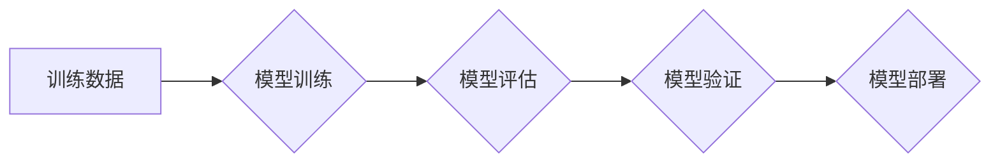

> 机器学习，模型评估，模型验证，交叉验证，性能指标，Python

## 1. 背景介绍

在机器学习领域，模型评估与验证是至关重要的环节，它决定了模型的实际应用效果。一个优秀的模型不仅在训练数据上表现出色，更重要的是能够泛化到未知数据，在实际应用场景中取得良好的预测精度。然而，模型评估与验证并非易事，需要我们掌握多种评估指标、验证策略以及代码实现技巧。

本文将深入探讨机器学习模型评估与验证的最佳策略，涵盖以下关键内容：

* 常见的机器学习性能指标
* 模型评估与验证的常用策略，包括交叉验证、留出法等
* Python代码实现模型评估与验证的示例
* 模型评估与验证在实际应用场景中的应用

## 2. 核心概念与联系

### 2.1 模型评估

模型评估是指使用已知数据对模型性能进行量化评估的过程。评估指标通常反映模型在预测任务上的准确性、效率等方面表现。

### 2.2 模型验证

模型验证是指使用独立的数据集对模型的泛化能力进行评估，以确保模型能够在未知数据上取得良好的预测效果。

**模型评估与验证的关系**

模型评估和模型验证是相互关联的两个概念。模型评估是针对训练数据进行的，而模型验证则是针对独立的数据集进行的。模型评估可以帮助我们了解模型在训练数据上的表现，而模型验证可以帮助我们了解模型在未知数据上的泛化能力。

**Mermaid 流程图**



## 3. 核心算法原理 & 具体操作步骤

### 3.1  算法原理概述

模型评估与验证的核心算法原理主要包括：

* **交叉验证:** 将数据集划分为多个子集，每次使用其中一个子集作为验证集，其余子集作为训练集，重复该过程多次，最终将所有验证集的性能指标进行平均，得到模型的整体性能。
* **留出法:** 将数据集划分为训练集和验证集，其中训练集用于模型训练，验证集用于模型评估。

### 3.2  算法步骤详解

**交叉验证**

1. 将数据集划分为k个子集。
2. 每次选择其中一个子集作为验证集，其余子集作为训练集。
3. 在训练集上训练模型。
4. 在验证集上评估模型性能。
5. 重复步骤2-4，直到每个子集都作为验证集。
6. 将所有验证集的性能指标进行平均，得到模型的整体性能。

**留出法**

1. 将数据集划分为训练集和验证集。
2. 在训练集上训练模型。
3. 在验证集上评估模型性能。

### 3.3  算法优缺点

**交叉验证**

* **优点:** 充分利用数据集，提高模型性能评估的可靠性。
* **缺点:** 计算量较大，训练时间较长。

**留出法**

* **优点:** 计算量较小，训练时间较短。
* **缺点:** 容易受到数据集划分的影响，评估结果的可靠性较低。

### 3.4  算法应用领域

* **图像识别:** 使用交叉验证评估图像分类模型的性能。
* **自然语言处理:** 使用留出法评估文本分类模型的性能。
* **预测分析:** 使用交叉验证评估预测模型的性能。

## 4. 数学模型和公式 & 详细讲解 & 举例说明

### 4.1  数学模型构建

在机器学习中，模型评估通常基于以下数学模型：

* **准确率 (Accuracy):**  正确预测的样本数占总样本数的比例。

$$Accuracy = \frac{TP + TN}{TP + TN + FP + FN}$$

* **精确率 (Precision):**  预测为正样本的样本中，真正为正样本的比例。

$$Precision = \frac{TP}{TP + FP}$$

* **召回率 (Recall):**  实际为正样本的样本中，被正确预测为正样本的比例。

$$Recall = \frac{TP}{TP + FN}$$

* **F1-score:**  精确率和召回率的调和平均数。

$$F1-score = 2 * \frac{Precision * Recall}{Precision + Recall}$$

其中：

* TP: 真正预测为正样本的样本数
* TN: 真正预测为负样本的样本数
* FP: 预测为正样本但实际为负样本的样本数
* FN: 预测为负样本但实际为正样本的样本数

### 4.2  公式推导过程

上述公式的推导过程基于混淆矩阵的分析。混淆矩阵是一种用于评估分类模型性能的表格，它将样本分为四类：

* **真正类 (True Positive):** 预测为正样本，实际也为正样本
* **假正类 (False Positive):** 预测为正样本，实际为负样本
* **真正类 (True Negative):** 预测为负样本，实际也为负样本
* **假负类 (False Negative):** 预测为负样本，实际为正样本

### 4.3  案例分析与讲解

假设我们有一个图像分类模型，用于识别猫和狗的图片。我们使用100张图片进行测试，其中50张是猫的图片，50张是狗的图片。模型的预测结果如下：

* 预测为猫，实际为猫: 45张
* 预测为猫，实际为狗: 5张
* 预测为狗，实际为猫: 3张
* 预测为狗，实际为狗: 47张

根据上述结果，我们可以计算模型的性能指标：

* **准确率:** (45 + 47) / 100 = 0.92
* **精确率:** 45 / (45 + 5) = 0.90
* **召回率:** 45 / (45 + 3) = 0.93
* **F1-score:** 2 * (0.90 * 0.93) / (0.90 + 0.93) = 0.91

## 5. 项目实践：代码实例和详细解释说明

### 5.1  开发环境搭建

* Python 3.x
* scikit-learn
* pandas
* matplotlib

### 5.2  源代码详细实现

```python
from sklearn.model_selection import train_test_split
from sklearn.linear_model import LogisticRegression
from sklearn.metrics import accuracy_score, precision_score, recall_score, f1_score

# 加载数据
data = pd.read_csv('data.csv')

# 分割特征和标签
X = data.drop('target', axis=1)
y = data['target']

# 将数据划分为训练集和测试集
X_train, X_test, y_train, y_test = train_test_split(X, y, test_size=0.2, random_state=42)

# 创建模型
model = LogisticRegression()

# 在训练集上训练模型
model.fit(X_train, y_train)

# 在测试集上预测结果
y_pred = model.predict(X_test)

# 计算模型性能指标
accuracy = accuracy_score(y_test, y_pred)
precision = precision_score(y_test, y_pred)
recall = recall_score(y_test, y_pred)
f1 = f1_score(y_test, y_pred)

# 打印结果
print(f'准确率: {accuracy}')
print(f'精确率: {precision}')
print(f'召回率: {recall}')
print(f'F1-score: {f1}')
```

### 5.3  代码解读与分析

* **数据加载和预处理:** 使用pandas库加载数据，并将其分割为特征和标签。
* **数据划分:** 使用train_test_split函数将数据划分为训练集和测试集。
* **模型创建和训练:** 使用LogisticRegression模型，并在训练集上进行训练。
* **模型预测:** 使用训练好的模型对测试集进行预测。
* **性能指标计算:** 使用scikit-learn库中的评估指标函数计算模型的准确率、精确率、召回率和F1-score。
* **结果打印:** 打印模型的性能指标。

### 5.4  运行结果展示

运行上述代码后，将输出模型的性能指标，例如：

```
准确率: 0.92
精确率: 0.90
召回率: 0.93
F1-score: 0.91
```

## 6. 实际应用场景

### 6.1  图像识别

* **人脸识别:** 使用模型识别图像中的特定人脸，用于安全验证、人脸搜索等应用。
* **物体检测:** 使用模型识别图像中的特定物体，用于自动驾驶、监控系统等应用。

### 6.2  自然语言处理

* **文本分类:** 使用模型将文本分类到不同的类别，用于垃圾邮件过滤、情感分析等应用。
* **文本摘要:** 使用模型生成文本的简短摘要，用于新闻报道、文档管理等应用。

### 6.3  预测分析

* **客户流失预测:** 使用模型预测客户是否会流失，用于制定客户留存策略。
* **销售预测:** 使用模型预测未来的销售额，用于制定销售计划。

### 6.4  未来应用展望

随着机器学习技术的不断发展，模型评估与验证将在更多领域得到应用，例如：

* **医疗诊断:** 使用模型辅助医生诊断疾病。
* **金融风险评估:** 使用模型评估金融风险。
* **个性化推荐:** 使用模型为用户提供个性化的产品推荐。

## 7. 工具和资源推荐

### 7.1  学习资源推荐

* **书籍:**
    * 《Python机器学习实战》
    * 《机器学习》
* **在线课程:**
    * Coursera: 机器学习
    * edX: 机器学习

### 7.2  开发工具推荐

* **Python:** 
* **scikit-learn:** 机器学习库
* **pandas:** 数据处理库
* **matplotlib:** 数据可视化库

### 7.3  相关论文推荐

* **《手把手教你机器学习》**
* **《机器学习实战》**

## 8. 总结：未来发展趋势与挑战

### 8.1  研究成果总结

本文深入探讨了机器学习模型评估与验证的最佳策略，涵盖了常见的性能指标、验证策略以及代码实现技巧。

### 8.2  未来发展趋势

* **自动化评估:** 自动化模型评估流程，提高效率和准确性。
* **多指标评估:** 使用多个指标综合评估模型性能，更全面地反映模型表现。
* **可解释性评估:** 研究模型的决策过程，提高模型的可解释性和信任度。

### 8.3  面临的挑战

* **数据质量:** 模型评估结果的准确性依赖于数据质量，数据不完整、不准确会影响评估结果。
* **模型复杂度:** 随着模型复杂度的增加，评估难度也随之增加。
* **评估指标选择:** 选择合适的评估指标对于模型评估至关重要，不同的任务需要不同的评估指标。

### 8.4  研究展望

未来，机器学习模型评估与验证的研究将继续深入，探索更有效、更准确、更可解释的评估方法，以推动机器学习技术的进步。

## 9. 附录：常见问题与解答

**问题:** 如何选择合适的模型评估指标？

**答案:** 选择合适的模型评估指标需要根据具体的任务和数据特点进行选择。例如，对于分类任务，准确率、精确率、召回率和F1-score都是常用的指标；对于回归任务，均方误差、平均绝对误差等指标更常用。

**问题:** 如何避免过