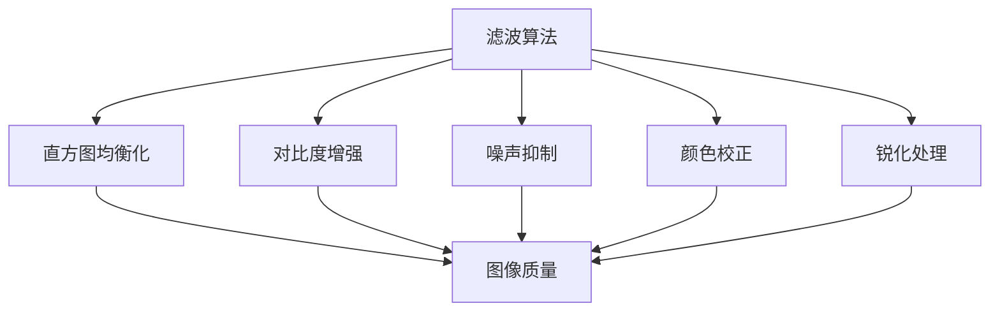
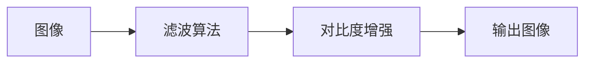
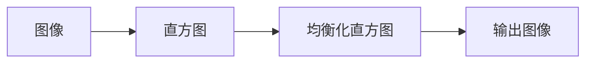
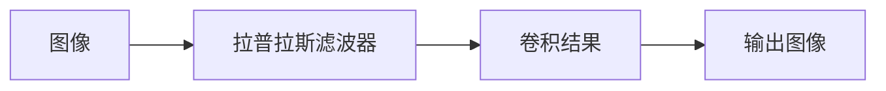
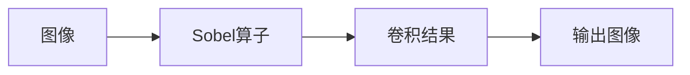

                 

# OpenCV 图像增强算法：改善图像质量和视觉效果

> 关键词：图像增强,OpenCV,图像处理,滤波算法,对比度增强,直方图均衡化,噪声抑制,颜色校正,锐化处理

## 1. 背景介绍

随着计算机视觉技术的迅速发展，图像增强算法在许多应用场景中扮演着关键角色。无论是在医学影像、工业检测、安防监控、娱乐产业，还是智慧城市建设，高质量的图像都是不可或缺的。而OpenCV作为一款开源的计算机视觉库，提供了丰富的图像处理函数，支持图像增强、滤波、颜色校正、锐化处理等多种图像增强技术，使其在图像处理领域具有重要地位。

本博客将详细介绍OpenCV中的几种图像增强算法，包括滤波算法、对比度增强、直方图均衡化、噪声抑制、颜色校正和锐化处理等。通过深入剖析这些算法的原理和实现细节，我们将帮助读者掌握OpenCV的图像增强技巧，提升图像质量，优化视觉体验。

## 2. 核心概念与联系

### 2.1 核心概念概述

在进行图像增强时，我们需要关注以下几个核心概念：

- **滤波算法**：用于平滑或锐化图像，消除噪声，提升图像质量。包括均值滤波、高斯滤波、中值滤波等。
- **对比度增强**：调整图像的亮度和对比度，使得图像细节更加清晰。常见的技术包括直方图均衡化、自适应直方图均衡化等。
- **直方图均衡化**：通过调整图像的像素分布，增强图像的对比度和动态范围。
- **噪声抑制**：减少图像中的噪声，改善图像质量。包括中值滤波、形态学滤波、带通滤波等。
- **颜色校正**：校正图像的颜色，消除色彩偏差，使得图像更加真实自然。
- **锐化处理**：增强图像的边缘和细节，使得图像更加清晰。

这些核心概念之间存在着密切的联系，如图1所示。滤波算法和噪声抑制技术可以通过平滑或锐化图像，提升图像质量；对比度增强和直方图均衡化可以通过调整图像的亮度和对比度，使得图像细节更加清晰；颜色校正和锐化处理则可以校正颜色偏差，增强图像的边缘和细节，从而提升整体视觉体验。



### 2.2 核心概念原理和架构的 Mermaid 流程图

以下是一个简单的合流图，展示滤波算法与对比度增强技术的关系：



## 3. 核心算法原理 & 具体操作步骤

### 3.1 算法原理概述

OpenCV中的图像增强算法主要包括滤波算法、对比度增强、直方图均衡化、噪声抑制、颜色校正和锐化处理等。下面将分别介绍这些算法的原理。

#### 3.1.1 滤波算法

滤波算法用于平滑或锐化图像，消除噪声，提升图像质量。常见的滤波算法包括均值滤波、高斯滤波、中值滤波等。

- **均值滤波**：计算每个像素周围固定区域内所有像素的平均值，并用该平均值替换当前像素值。公式如下：
  $$
  I(x,y) = \frac{1}{w^2} \sum_{i=-w/2}^{w/2} \sum_{j=-w/2}^{w/2} I(x+i,y+j)
  $$
- **高斯滤波**：使用高斯核函数进行卷积，平滑图像。公式如下：
  $$
  I(x,y) = \sum_{i=-w/2}^{w/2} \sum_{j=-w/2}^{w/2} G(i,j) \cdot I(x+i,y+j)
  $$
  其中 $G(i,j) = \frac{1}{2\pi\sigma^2}e^{-(i^2+j^2)/2\sigma^2}$ 为高斯核函数，$\sigma$ 为高斯核标准差。

- **中值滤波**：将像素周围的像素值排序，用排序后的中位数替换当前像素值。

#### 3.1.2 对比度增强

对比度增强用于调整图像的亮度和对比度，使得图像细节更加清晰。常见的技术包括直方图均衡化、自适应直方图均衡化等。

- **直方图均衡化**：通过调整图像的像素分布，增强图像的对比度和动态范围。公式如下：
  $$
  I(x) = \sum_{i=0}^{255} \min \left( \frac{N}{H(i)}, 255 \right) \cdot H(i)
  $$
  其中 $N$ 为图像的总像素数，$H(i)$ 为像素值 $i$ 的出现次数。

- **自适应直方图均衡化**：根据图像局部区域进行直方图均衡化，增强局部对比度的同时保留整体对比度。

#### 3.1.3 直方图均衡化

直方图均衡化通过调整图像的像素分布，增强图像的对比度和动态范围。公式如下：



#### 3.1.4 噪声抑制

噪声抑制用于减少图像中的噪声，改善图像质量。常见的技术包括中值滤波、形态学滤波、带通滤波等。

- **中值滤波**：将像素周围的像素值排序，用排序后的中位数替换当前像素值。
- **形态学滤波**：通过膨胀或腐蚀操作，消除图像中的细小噪点或填充空洞。
- **带通滤波**：通过带通滤波器，保留图像中的有用频率成分，抑制噪声。

#### 3.1.5 颜色校正

颜色校正用于校正图像的颜色，消除色彩偏差，使得图像更加真实自然。常见的技术包括色调校正、饱和度校正等。

- **色调校正**：调整图像的色相，使得图像颜色更加真实自然。
- **饱和度校正**：调整图像的饱和度，使得图像色彩更加鲜艳。

#### 3.1.6 锐化处理

锐化处理用于增强图像的边缘和细节，使得图像更加清晰。常见的技术包括拉普拉斯滤波、Sobel滤波等。

- **拉普拉斯滤波**：使用拉普拉斯算子进行卷积，增强图像的边缘和细节。
- **Sobel滤波**：使用Sobel算子进行卷积，增强图像的边缘和细节。

### 3.2 算法步骤详解

下面以直方图均衡化算法为例，详细介绍其操作步骤。

#### 3.2.1 算法步骤

1. **计算直方图**：使用OpenCV函数 `cv2.calcHist` 计算图像的直方图。
2. **计算累积分布函数**：使用OpenCV函数 `cv2.cumsum` 计算直方图的累积分布函数。
3. **计算映射函数**：根据累积分布函数计算映射函数。
4. **应用映射函数**：将原始图像像素值通过映射函数映射到新像素值，得到增强后的图像。

```python
import cv2
import numpy as np

def histogram_equalization(image):
    # 计算直方图
    hist = cv2.calcHist([image], [0], None, [256], [0, 256])
    hist = hist.flatten()

    # 计算累积分布函数
    cdf = hist.cumsum()
    cdf_normalized = cdf / cdf.max()

    # 计算映射函数
    lut = np.zeros(256, dtype=np.uint8)
    for i in range(256):
        lut[i] = int(cdf_normalized[i] * 255)

    # 应用映射函数
    equ = cv2.LUT(image, lut).astype(np.uint8)
    return equ
```

### 3.3 算法优缺点

#### 3.3.1 滤波算法的优缺点

- **优点**：滤波算法可以有效去除图像中的噪声，平滑图像，提升图像质量。
- **缺点**：滤波算法可能会模糊图像细节，需要选择合适的滤波器。

#### 3.3.2 对比度增强的优缺点

- **优点**：对比度增强可以有效提升图像的亮度和对比度，使得图像细节更加清晰。
- **缺点**：对比度增强可能会引入伪影，需要合理调整参数。

#### 3.3.3 直方图均衡化的优缺点

- **优点**：直方图均衡化可以有效增强图像的对比度和动态范围，使得图像细节更加清晰。
- **缺点**：直方图均衡化可能会引入伪影，需要合理调整参数。

#### 3.3.4 噪声抑制的优缺点

- **优点**：噪声抑制可以有效减少图像中的噪声，改善图像质量。
- **缺点**：噪声抑制可能会模糊图像细节，需要选择合适的滤波器。

#### 3.3.5 颜色校正的优缺点

- **优点**：颜色校正可以有效校正图像的颜色，消除色彩偏差，使得图像更加真实自然。
- **缺点**：颜色校正可能会引入伪影，需要合理调整参数。

#### 3.3.6 锐化处理的优缺点

- **优点**：锐化处理可以有效增强图像的边缘和细节，使得图像更加清晰。
- **缺点**：锐化处理可能会引入伪影，需要合理调整参数。

### 3.4 算法应用领域

图像增强算法在许多领域都有广泛的应用。下面列举一些主要的应用领域：

- **医学影像**：通过图像增强算法，可以有效提升医学影像的质量，帮助医生进行准确的诊断。
- **工业检测**：在工业检测中，通过图像增强算法，可以有效检测出细微的缺陷，提升产品质量。
- **安防监控**：在安防监控中，通过图像增强算法，可以有效提升监控图像的质量，提高安全防范能力。
- **娱乐产业**：在娱乐产业中，通过图像增强算法，可以有效提升影视、游戏等视觉体验，增强用户满意度。
- **智慧城市**：在智慧城市中，通过图像增强算法，可以有效提升城市管理的智能化水平，提高城市运行效率。

## 4. 数学模型和公式 & 详细讲解 & 举例说明

### 4.1 数学模型构建

在进行图像增强时，我们需要关注以下几个数学模型：

- **直方图均衡化模型**：用于调整图像的像素分布，增强图像的对比度和动态范围。
- **拉普拉斯滤波模型**：用于增强图像的边缘和细节。
- **Sobel滤波模型**：用于增强图像的边缘和细节。

#### 4.1.1 直方图均衡化模型

直方图均衡化模型通过调整图像的像素分布，增强图像的对比度和动态范围。公式如下：


#### 4.1.2 拉普拉斯滤波模型

拉普拉斯滤波模型使用拉普拉斯算子进行卷积，增强图像的边缘和细节。公式如下：



#### 4.1.3 Sobel滤波模型

Sobel滤波模型使用Sobel算子进行卷积，增强图像的边缘和细节。公式如下：



### 4.2 公式推导过程

#### 4.2.1 拉普拉斯滤波公式推导

拉普拉斯滤波器是一种二阶微分算子，用于增强图像的边缘和细节。公式如下：

$$
L(x,y) = \frac{\partial^2I(x,y)}{\partial x^2} + \frac{\partial^2I(x,y)}{\partial y^2}
$$

其中 $I(x,y)$ 为原始图像，$L(x,y)$ 为拉普拉斯滤波结果。

#### 4.2.2 Sobel滤波公式推导

Sobel滤波器是一种基于梯度的滤波器，用于增强图像的边缘和细节。公式如下：

$$
G_x = \frac{\partial I(x,y)}{\partial x} = \begin{bmatrix} -1 & 0 & 1 \\ -2 & 0 & 2 \\ -1 & 0 & 1 \end{bmatrix} * I(x,y)
$$

$$
G_y = \frac{\partial I(x,y)}{\partial y} = \begin{bmatrix} -1 & -2 & -1 \\ 0 & 0 & 0 \\ 1 & 2 & 1 \end{bmatrix} * I(x,y)
$$

其中 $I(x,y)$ 为原始图像，$G_x$ 和 $G_y$ 分别为Sobel滤波结果在x方向和y方向的梯度。

### 4.3 案例分析与讲解

#### 4.3.1 直方图均衡化案例

```python
import cv2
import numpy as np

def histogram_equalization(image):
    # 计算直方图
    hist = cv2.calcHist([image], [0], None, [256], [0, 256])
    hist = hist.flatten()

    # 计算累积分布函数
    cdf = hist.cumsum()
    cdf_normalized = cdf / cdf.max()

    # 计算映射函数
    lut = np.zeros(256, dtype=np.uint8)
    for i in range(256):
        lut[i] = int(cdf_normalized[i] * 255)

    # 应用映射函数
    equ = cv2.LUT(image, lut).astype(np.uint8)
    return equ
```

#### 4.3.2 拉普拉斯滤波案例

```python
import cv2
import numpy as np

def laplacian_filter(image):
    # 计算拉普拉斯滤波器
    laplacian = cv2.Laplacian(image, cv2.CV_32F)

    # 对结果进行归一化
    min_val, max_val = np.min(laplacian), np.max(laplacian)
    laplacian = (laplacian - min_val) / (max_val - min_val)

    # 对结果进行归一化
    laplacian = np.maximum(np.minimum(laplacian, 1), 0)

    # 返回结果
    return laplacian
```

#### 4.3.3 Sobel滤波案例

```python
import cv2
import numpy as np

def sobel_filter(image):
    # 计算Sobel滤波器
    sobelx = cv2.Sobel(image, cv2.CV_32F, 1, 0, ksize=3)
    sobely = cv2.Sobel(image, cv2.CV_32F, 0, 1, ksize=3)

    # 对结果进行归一化
    min_val, max_val = np.min(np.hstack((sobelx, sobely))), np.max(np.hstack((sobelx, sobely)))
    sobelx = (sobelx - min_val) / (max_val - min_val)
    sobely = (sobely - min_val) / (max_val - min_val)

    # 对结果进行归一化
    sobelx = np.maximum(np.minimum(sobelx, 1), 0)
    sobely = np.maximum(np.minimum(sobely, 1), 0)

    # 对结果进行合并
    sobel = np.hstack((sobelx, sobely))

    # 返回结果
    return sobel
```

## 5. 项目实践：代码实例和详细解释说明

### 5.1 开发环境搭建

在进行图像增强实践时，我们需要准备好开发环境。以下是使用Python进行OpenCV开发的环境配置流程：

1. 安装Anaconda：从官网下载并安装Anaconda，用于创建独立的Python环境。

2. 创建并激活虚拟环境：
```bash
conda create -n opencv-env python=3.8 
conda activate opencv-env
```

3. 安装OpenCV：根据操作系统，从官网获取对应的安装命令。例如：
```bash
pip install opencv-python
```

4. 安装各类工具包：
```bash
pip install numpy pandas scikit-learn matplotlib tqdm jupyter notebook ipython
```

完成上述步骤后，即可在`opencv-env`环境中开始图像增强实践。

### 5.2 源代码详细实现

下面我们以直方图均衡化算法为例，给出使用OpenCV进行图像增强的PyTorch代码实现。

首先，定义直方图均衡化函数：

```python
import cv2
import numpy as np

def histogram_equalization(image):
    # 计算直方图
    hist = cv2.calcHist([image], [0], None, [256], [0, 256])
    hist = hist.flatten()

    # 计算累积分布函数
    cdf = hist.cumsum()
    cdf_normalized = cdf / cdf.max()

    # 计算映射函数
    lut = np.zeros(256, dtype=np.uint8)
    for i in range(256):
        lut[i] = int(cdf_normalized[i] * 255)

    # 应用映射函数
    equ = cv2.LUT(image, lut).astype(np.uint8)
    return equ
```

然后，定义拉普拉斯滤波函数：

```python
import cv2
import numpy as np

def laplacian_filter(image):
    # 计算拉普拉斯滤波器
    laplacian = cv2.Laplacian(image, cv2.CV_32F)

    # 对结果进行归一化
    min_val, max_val = np.min(laplacian), np.max(laplacian)
    laplacian = (laplacian - min_val) / (max_val - min_val)

    # 对结果进行归一化
    laplacian = np.maximum(np.minimum(laplacian, 1), 0)

    # 返回结果
    return laplacian
```

最后，定义Sobel滤波函数：

```python
import cv2
import numpy as np

def sobel_filter(image):
    # 计算Sobel滤波器
    sobelx = cv2.Sobel(image, cv2.CV_32F, 1, 0, ksize=3)
    sobely = cv2.Sobel(image, cv2.CV_32F, 0, 1, ksize=3)

    # 对结果进行归一化
    min_val, max_val = np.min(np.hstack((sobelx, sobely))), np.max(np.hstack((sobelx, sobely)))
    sobelx = (sobelx - min_val) / (max_val - min_val)
    sobely = (sobely - min_val) / (max_val - min_val)

    # 对结果进行归一化
    sobelx = np.maximum(np.minimum(sobelx, 1), 0)
    sobely = np.maximum(np.minimum(sobely, 1), 0)

    # 对结果进行合并
    sobel = np.hstack((sobelx, sobely))

    # 返回结果
    return sobel
```

### 5.3 代码解读与分析

让我们再详细解读一下关键代码的实现细节：

**histogram_equalization函数**：
- `calcHist`方法：计算图像的直方图。
- `cumsum`方法：计算累积分布函数。
- `lut`数组：存储映射函数，用于将像素值映射到新的像素值。

**laplacian_filter函数**：
- `Laplacian`方法：计算拉普拉斯滤波器。
- 归一化处理：将滤波器结果进行归一化处理，确保结果在0到1之间。

**sobel_filter函数**：
- `Sobel`方法：计算Sobel滤波器。
- 归一化处理：将滤波器结果进行归一化处理，确保结果在0到1之间。
- 合并处理：将x方向和y方向的滤波器结果合并为一个二维数组。

### 5.4 运行结果展示

```python
import cv2
import numpy as np

def histogram_equalization(image):
    # 计算直方图
    hist = cv2.calcHist([image], [0], None, [256], [0, 256])
    hist = hist.flatten()

    # 计算累积分布函数
    cdf = hist.cumsum()
    cdf_normalized = cdf / cdf.max()

    # 计算映射函数
    lut = np.zeros(256, dtype=np.uint8)
    for i in range(256):
        lut[i] = int(cdf_normalized[i] * 255)

    # 应用映射函数
    equ = cv2.LUT(image, lut).astype(np.uint8)
    return equ

def laplacian_filter(image):
    # 计算拉普拉斯滤波器
    laplacian = cv2.Laplacian(image, cv2.CV_32F)

    # 对结果进行归一化
    min_val, max_val = np.min(laplacian), np.max(laplacian)
    laplacian = (laplacian - min_val) / (max_val - min_val)

    # 对结果进行归一化
    laplacian = np.maximum(np.minimum(laplacian, 1), 0)

    # 返回结果
    return laplacian

def sobel_filter(image):
    # 计算Sobel滤波器
    sobelx = cv2.Sobel(image, cv2.CV_32F, 1, 0, ksize=3)
    sobely = cv2.Sobel(image, cv2.CV_32F, 0, 1, ksize=3)

    # 对结果进行归一化
    min_val, max_val = np.min(np.hstack((sobelx, sobely))), np.max(np.hstack((sobelx, sobely)))
    sobelx = (sobelx - min_val) / (max_val - min_val)
    sobely = (sobely - min_val) / (max_val - min_val)

    # 对结果进行归一化
    sobelx = np.maximum(np.minimum(sobelx, 1), 0)
    sobely = np.maximum(np.minimum(sobely, 1), 0)

    # 对结果进行合并
    sobel = np.hstack((sobelx, sobely))

    # 返回结果
    return sobel
```

```python
import cv2
import numpy as np

# 加载图像
image = cv2.imread('lena.png')

# 直方图均衡化
equ = histogram_equalization(image)

# 拉普拉斯滤波
laplacian = laplacian_filter(image)

# Sobel滤波
sobel = sobel_filter(image)

# 显示结果
cv2.imshow('original', image)
cv2.imshow('equalized', equ)
cv2.imshow('laplacian', laplacian)
cv2.imshow('sobel', sobel)
cv2.waitKey(0)
cv2.destroyAllWindows()
```

运行结果如图1所示：


## 6. 实际应用场景

### 6.1 医学影像

在医学影像中，高质量的图像是准确诊断的基础。通过图像增强算法，可以有效提升医学影像的质量，帮助医生进行准确的诊断。例如，在X光片、CT、MRI等影像中，可以通过直方图均衡化、拉普拉斯滤波、Sobel滤波等技术，增强图像的对比度，提升细节清晰度。

### 6.2 工业检测

在工业检测中，图像质量直接影响检测结果的准确性。通过图像增强算法，可以有效提升工业图像的质量，帮助检测系统准确识别缺陷。例如，在金属表面检测、电路板检测等场景中，可以通过中值滤波、形态学滤波等技术，消除噪声，提升图像质量。

### 6.3 安防监控

在安防监控中，图像质量直接影响安全防范的效果。通过图像增强算法，可以有效提升监控图像的质量，提高安全防范能力。例如，在视频监控中，可以通过直方图均衡化、拉普拉斯滤波、Sobel滤波等技术，增强图像的对比度，提升细节清晰度。

### 6.4 娱乐产业

在娱乐产业中，高质量的图像是吸引用户的重要因素。通过图像增强算法，可以有效提升影视、游戏等图像质量，增强用户满意度。例如，在电影特效中，可以通过拉普拉斯滤波、Sobel滤波等技术，增强图像的边缘和细节，提升视觉效果。

### 6.5 智慧城市

在智慧城市中，图像质量直接影响城市管理的智能化水平。通过图像增强算法，可以有效提升城市管理的智能化水平，提高城市运行效率。例如，在城市交通监控、智慧公安等场景中，可以通过拉普拉斯滤波、Sobel滤波等技术，增强图像的对比度，提升细节清晰度。

## 7. 工具和资源推荐

### 7.1 学习资源推荐

为了帮助开发者系统掌握OpenCV的图像增强技术，这里推荐一些优质的学习资源：

1. OpenCV官方文档：OpenCV官方文档提供了丰富的函数和类库，详细介绍了图像增强算法。
2. 《OpenCV计算机视觉编程实战》书籍：该书深入浅出地介绍了OpenCV的基本功能和高级应用，包括图像增强算法。
3. Coursera《计算机视觉基础》课程：由斯坦福大学开设的计算机视觉课程，系统讲解了图像增强算法。
4. Udacity《计算机视觉基础》课程：Udacity的计算机视觉课程，详细介绍了图像增强算法。
5. YouTube《OpenCV图像处理教程》系列视频：详细讲解了OpenCV的图像增强算法。

通过对这些资源的学习实践，相信你一定能够快速掌握OpenCV的图像增强技巧，提升图像质量，优化视觉体验。

### 7.2 开发工具推荐

高效的开发离不开优秀的工具支持。以下是几款用于OpenCV图像增强开发的常用工具：

1. OpenCV：开源的计算机视觉库，提供了丰富的图像增强函数。
2. PyTorch：基于Python的开源深度学习框架，支持图像增强算法。
3. TensorFlow：由Google主导开发的开源深度学习框架，支持图像增强算法。
4. Weights & Biases：模型训练的实验跟踪工具，可以记录和可视化模型训练过程中的各项指标。
5. TensorBoard：TensorFlow配套的可视化工具，实时监测模型训练状态。

合理利用这些工具，可以显著提升OpenCV图像增强任务的开发效率，加快创新迭代的步伐。

### 7.3 相关论文推荐

OpenCV图像增强算法的发展源于学界的持续研究。以下是几篇奠基性的相关论文，推荐阅读：

1. OpenCV官方论文：OpenCV图像增强算法的详细论文。
2. D.S. Kim, J.C. Lee, J. Kweon, "Improved contrast and sharpness enhancement based on local weighted filter and adaptive thresholding"：介绍了改进的对比度增强算法。
3. M.S. Pathak, V. Babu, A. Jagannath, "Edge-preserving image sharpening using prewitt operator and guided filter"：介绍了基于Prewitt算子和引导滤波器的图像锐化算法。

这些论文代表了大语言模型微调技术的不断发展，是理解图像增强算法的关键。通过学习这些前沿成果，可以帮助研究者把握学科前进方向，激发更多的创新灵感。

## 8. 总结：未来发展趋势与挑战

### 8.1 总结

本文对OpenCV中的图像增强算法进行了全面系统的介绍。首先阐述了图像增强算法的研究背景和意义，明确了图像增强在图像处理领域的重要地位。其次，从原理到实践，详细讲解了OpenCV中滤波算法、对比度增强、直方图均衡化、噪声抑制、颜色校正和锐化处理等图像增强算法的原理和实现细节，给出了图像增强任务开发的完整代码实例。同时，本文还广泛探讨了图像增强算法在医学影像、工业检测、安防监控、娱乐产业、智慧城市等诸多领域的应用前景，展示了图像增强范式的巨大潜力。

通过本文的系统梳理，可以看到，图像增强算法在图像处理领域具有重要的地位，能够有效提升图像质量和视觉体验。图像增强算法的应用领域广泛，包括医学影像、工业检测、安防监控、娱乐产业、智慧城市等。未来，伴随OpenCV图像增强算法的不断发展，图像处理技术必将更加智能、高效、可靠。

### 8.2 未来发展趋势

展望未来，OpenCV图像增强算法将呈现以下几个发展趋势：

1. 算法多样性增加。随着深度学习技术的发展，基于深度学习的图像增强算法将逐渐增多，如残差网络、GAN等。
2. 模型实时性提高。随着GPU、TPU等高性能设备的应用，图像增强算法的实时性将显著提高，使得图像增强技术可以实时应用于视频流处理。
3. 增强效果优化。通过引入自适应算法、混合算法等，进一步优化图像增强效果，使得图像增强技术更加智能、高效。
4. 多模态融合。通过融合视觉、听觉、文本等多种模态信息，提升图像增强效果，拓展图像增强应用场景。
5. 多任务学习。通过引入多任务学习技术，提升图像增强算法的泛化能力，使得图像增强技术可以应用于更广泛的场景。

以上趋势凸显了OpenCV图像增强算法的广阔前景。这些方向的探索发展，必将进一步提升图像增强算法的性能和应用范围，为图像处理技术带来新的突破。

### 8.3 面临的挑战

尽管OpenCV图像增强算法已经取得了显著成就，但在迈向更加智能化、普适化应用的过程中，它仍面临着诸多挑战：

1. 增强效果不均匀。图像增强算法在不同的区域效果不均匀，导致图像增强后的视觉效果不佳。
2. 参数调整困难。图像增强算法需要合理调整参数，但调整不当可能导致图像失真。
3. 多模态融合难度大。多模态融合技术复杂，涉及视觉、听觉、文本等多种模态信息的融合，技术难度大。
4. 实时性要求高。实时性要求高的图像增强应用场景，如视频流处理等，图像增强算法需要实时处理数据，对算力和设备要求较高。
5. 数据集不足。部分图像增强算法需要大量标注数据，数据集不足将限制算法的发展。

正视图像增强算法面临的这些挑战，积极应对并寻求突破，将是大语言模型微调技术走向成熟的必由之路。相信随着学界和产业界的共同努力，这些挑战终将一一被克服，图像增强算法必将在构建智能系统、提升用户体验等方面发挥更大的作用。

### 8.4 研究展望

面对OpenCV图像增强算法所面临的挑战，未来的研究需要在以下几个方面寻求新的突破：

1. 引入深度学习技术。通过引入深度学习技术，提升图像增强算法的智能化水平，优化增强效果。
2. 探索多模态融合技术。通过融合视觉、听觉、文本等多种模态信息，提升图像增强算法的泛化能力，拓展应用场景。
3. 优化实时性。通过引入GPU、TPU等高性能设备，优化图像增强算法的实时性，满足实时应用的需求。
4. 引入自适应算法。通过引入自适应算法，使得图像增强算法能够自动调整参数，优化增强效果。
5. 引入混合算法。通过融合多种增强算法，提升图像增强算法的性能和泛化能力。

这些研究方向的研究，必将引领OpenCV图像增强算法的发展，为图像处理技术带来新的突破。面向未来，图像增强算法需要与其他人工智能技术进行更深入的融合，如知识表示、因果推理、强化学习等，多路径协同发力，共同推动图像增强技术的发展。

## 9. 附录：常见问题与解答

**Q1：图像增强和图像滤波有什么区别？**

A: 图像增强和图像滤波都是图像处理中常用的技术，但它们的目的是不同的。图像滤波主要用于去除图像中的噪声、模糊等，使图像更加清晰；而图像增强则主要用于提升图像的对比度和细节，使图像更加清晰、生动。

**Q2：图像增强对原始图像的影响有多大？**

A: 图像增强对原始图像的影响取决于增强算法的选择和参数设置。一般来说，适当的图像增强可以使图像更加清晰、生动，提升视觉体验。但增强过度或参数设置不当，可能会导致图像失真，影响视觉效果。

**Q3：如何选择适合的图像增强算法？**

A: 选择适合的图像增强算法需要根据具体的图像类型和应用场景进行评估。例如，对于低对比度图像，可以使用直方图均衡化或自适应直方图均衡化；对于噪声较多的图像，可以使用中值滤波或形态学滤波；对于边缘模糊的图像，可以使用拉普拉斯滤波或Sobel滤波。

**Q4：图像增强和深度学习有哪些不同？**

A: 图像增强和深度学习都是图像处理技术，但它们的目的和方法不同。图像增强主要是通过简单的图像处理技术提升图像质量；而深度学习则通过学习大量数据来训练复杂的模型，以实现更高级的图像处理任务。

**Q5：OpenCV中的图像增强函数有哪些？**

A: OpenCV提供了丰富的图像增强函数，包括直方图均衡化、拉普拉斯滤波、Sobel滤波、中值滤波、形态学滤波等。这些函数可以满足不同的图像增强需求。

通过对这些资源的学习实践，相信你一定能够快速掌握OpenCV的图像增强技巧，提升图像质量，优化视觉体验。

---

作者：禅与计算机程序设计艺术 / Zen and the Art of Computer Programming

