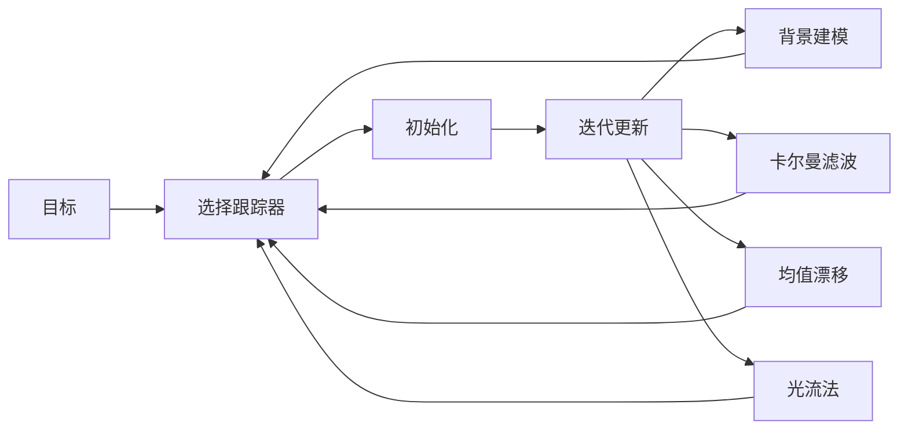

                 

# OpenCV 目标跟踪：在视频中跟踪对象

## 1. 背景介绍

### 1.1 问题由来

视频目标跟踪是计算机视觉领域的一项重要任务，它旨在对连续视频帧中特定对象的位置进行稳定跟踪。从自动驾驶车辆的目标检测到安防监控系统的人脸识别，目标跟踪技术有着广泛的应用场景。在许多场景中，由于光照变化、视角变化、遮挡等原因，目标的跟踪往往面临着挑战。

OpenCV是一个开源的计算机视觉库，提供了丰富的图像处理和计算机视觉功能，其中包括目标跟踪模块。OpenCV的目标跟踪算法包括传统方法，如卡尔曼滤波、均值漂移、光流法等，以及深度学习驱动的端到端跟踪算法，如深度残差网络（DRN）和单次人体跟踪（Siam R-CNN）。本文将重点介绍基于传统方法和深度学习的方法，通过在视频序列中跟踪特定对象来展示OpenCV在目标跟踪任务中的应用。

### 1.2 问题核心关键点

目标跟踪的核心问题是如何稳定地确定和更新目标的位置，同时减少背景和干扰的影响。基于OpenCV的目标跟踪方法主要包括：

1. **选择跟踪器**：选择合适的跟踪算法和参数设置。
2. **初始化**：确定初始的跟踪框。
3. **迭代更新**：通过帧间差异更新目标位置。
4. **处理遮挡和漂移**：解决遮挡问题，并根据实际应用场景对漂移进行修正。

本文将详细阐述这些关键点，并介绍OpenCV中目标跟踪的基本步骤。

## 2. 核心概念与联系

### 2.1 核心概念概述

为了更好地理解OpenCV中的目标跟踪，我们将介绍几个核心概念：

- **跟踪器（Tracker）**：目标跟踪算法的一种实现，用于在视频帧中定位特定对象。
- **背景建模**：构建背景模型，用于区分前景目标和背景。
- **卡尔曼滤波**：一种线性系统状态估计方法，用于平滑跟踪结果，减少噪声影响。
- **均值漂移**：一种基于密度估计的跟踪方法，用于处理对象形变和移动。
- **光流法**：一种基于像素位移估计的跟踪方法，用于处理帧间运动。

这些概念之间的逻辑关系可以通过以下Mermaid流程图来展示：



这个流程图展示了一些核心概念之间的关系：

1. 从目标开始，选择适当的跟踪器。
2. 初始化跟踪器。
3. 迭代更新跟踪器，同时进行背景建模、卡尔曼滤波、均值漂移和光流法等优化。

这些概念共同构成了目标跟踪的基础，帮助开发者在OpenCV中实现目标跟踪算法。

## 3. 核心算法原理 & 具体操作步骤

### 3.1 算法原理概述

目标跟踪的核心原理是通过在视频序列中稳定地确定和更新目标位置，同时减少背景和干扰的影响。OpenCV中常用的目标跟踪算法有卡尔曼滤波、均值漂移和光流法等。这些算法从不同的角度来处理目标跟踪问题，如卡尔曼滤波平滑跟踪结果，均值漂移处理对象形变和移动，光流法处理帧间运动。

### 3.2 算法步骤详解

#### 3.2.1 选择跟踪器

OpenCV提供了多种跟踪器，包括但不限于：

- **KCF（Kernelized Correlation Filter）**：一种基于特征描述的跟踪器，适用于处理大规模物体。
- **TLD（Twin Lightness Drift）**：一种基于颜色和光照变化的跟踪器，适用于处理光照变化和动态背景。
- **MedianFlow**：一种基于光流的跟踪器，适用于处理动态背景和移动目标。

选择适当的跟踪器取决于具体的应用场景和需求。

#### 3.2.2 初始化

初始化是目标跟踪的第一步，需要确定目标的初始位置和大小。通常，目标跟踪器需要以矩形框的形式提供初始位置。在OpenCV中，可以使用矩形框或基于特征点的方法进行初始化。

#### 3.2.3 迭代更新

迭代更新是目标跟踪的核心步骤，它通过在视频帧间更新目标位置来跟踪目标。在每次迭代中，跟踪器会根据当前帧和上一帧的信息来更新目标位置。迭代更新过程包括：

- 特征提取：从当前帧中提取目标的特征描述。
- 特征匹配：在上一帧中搜索与当前帧中的特征描述匹配的目标区域。
- 位置更新：根据匹配结果更新目标位置。

#### 3.2.4 处理遮挡和漂移

在实际应用中，目标可能会受到遮挡或发生形变，这可能导致跟踪器失去目标。因此，需要采用一些策略来处理遮挡和漂移：

- 遮挡处理：使用背景建模和光流法等技术来处理遮挡。
- 漂移修正：使用卡尔曼滤波等技术来平滑跟踪结果，减少漂移。

### 3.3 算法优缺点

OpenCV中的目标跟踪算法具有以下优点：

1. **多样性**：OpenCV提供了多种跟踪算法，适用于不同的应用场景。
2. **灵活性**：用户可以根据具体需求调整算法参数和优化策略。
3. **效率**：大多数跟踪算法都是实时的，能够在视频流中实时跟踪目标。

同时，这些算法也存在一些缺点：

1. **对初始化敏感**：目标跟踪器对初始化位置的准确性要求较高。
2. **对光照和视角变化敏感**：光照变化和视角变化可能导致跟踪失败。
3. **计算复杂度**：某些算法如卡尔曼滤波和光流法计算复杂度高，不适用于实时应用。

### 3.4 算法应用领域

OpenCV中的目标跟踪算法广泛应用于以下领域：

1. **视频监控**：用于实时监控视频流中的移动对象。
2. **自动驾驶**：用于跟踪路标和交通标志。
3. **机器人视觉**：用于跟踪机器人周围的物体。
4. **医学影像**：用于跟踪手术器械的位置。
5. **游戏开发**：用于跟踪游戏中的角色和物品。

这些应用领域展示了OpenCV在目标跟踪技术上的广泛应用和重要价值。

## 4. 数学模型和公式 & 详细讲解

### 4.1 数学模型构建

OpenCV中的目标跟踪算法通常基于以下数学模型：

- **卡尔曼滤波**：
  - 状态方程：$x_k = F_k x_{k-1} + B_k u_k$
  - 观测方程：$z_k = H_k x_k + v_k$

  其中，$x_k$ 是状态向量，$z_k$ 是观测向量，$F_k$ 是状态转移矩阵，$B_k$ 是控制矩阵，$u_k$ 是控制向量，$v_k$ 是观测噪声。

- **均值漂移**：
  - 密度估计：$p(x) = \frac{1}{N} \sum_{i=1}^N \delta(x - x_i)$
  - 运动方程：$x_t = x_s + \Delta_t \cdot \nabla p(x)$

  其中，$x_t$ 是目标位置，$x_s$ 是初始位置，$\Delta_t$ 是时间间隔，$\nabla$ 是梯度运算符。

- **光流法**：
  - 光流方程：$I_x + v_x * I_y = 0$，$I_y - v_y * I_x = 0$

  其中，$I_x$ 和 $I_y$ 是像素在两个相邻帧中的强度，$v_x$ 和 $v_y$ 是像素位移。

### 4.2 公式推导过程

#### 4.2.1 卡尔曼滤波

卡尔曼滤波的推导过程如下：

1. 初始状态和预测：
  $$
  \begin{aligned}
  &x_k = F_k x_{k-1} + B_k u_k \\
  &P_k = F_k P_{k-1} F_k^T + Q_k
  \end{aligned}
  $$

  其中，$x_k$ 是状态向量，$P_k$ 是协方差矩阵，$F_k$ 是状态转移矩阵，$B_k$ 是控制矩阵，$u_k$ 是控制向量，$Q_k$ 是过程噪声协方差矩阵。

2. 观测和更新：
  $$
  \begin{aligned}
  &K_k = P_k H_k^T (H_k P_k H_k^T + R_k)^{-1} \\
  &x_k = x_k + K_k (z_k - H_k x_k)
  \end{aligned}
  $$

  其中，$K_k$ 是卡尔曼增益，$z_k$ 是观测向量，$H_k$ 是观测矩阵，$R_k$ 是观测噪声协方差矩阵。

#### 4.2.2 均值漂移

均值漂移的推导过程如下：

1. 密度估计：
  $$
  p(x) = \frac{1}{N} \sum_{i=1}^N \delta(x - x_i)
  $$

2. 运动方程：
  $$
  x_t = x_s + \Delta_t \cdot \nabla p(x)
  $$

  其中，$x_t$ 是目标位置，$x_s$ 是初始位置，$\Delta_t$ 是时间间隔，$\nabla$ 是梯度运算符。

#### 4.2.3 光流法

光流法的推导过程如下：

1. 光流方程：
  $$
  I_x + v_x * I_y = 0, \quad I_y - v_y * I_x = 0
  $$

2. 光流法求解：
  $$
  v_x = -\frac{I_x}{I_y}, \quad v_y = \frac{I_y}{I_x}
  $$

  其中，$I_x$ 和 $I_y$ 是像素在两个相邻帧中的强度，$v_x$ 和 $v_y$ 是像素位移。

### 4.3 案例分析与讲解

#### 4.3.1 卡尔曼滤波

假设我们有一组状态数据 $x_0 = [0, 0]^T$，控制矩阵 $B_k = [1, 0]$，状态转移矩阵 $F_k = [1, 0; 0, 1]$，过程噪声协方差矩阵 $Q_k = [0.01, 0; 0, 0.01]$，观测矩阵 $H_k = [1, 0]$，观测噪声协方差矩阵 $R_k = 1$。我们使用Kalman跟踪器来跟踪一个简单的移动物体。

1. 初始状态和预测：
  $$
  \begin{aligned}
  &x_1 = F_1 x_0 + B_1 u_1 \\
  &P_1 = F_1 P_0 F_1^T + Q_1
  \end{aligned}
  $$

2. 观测和更新：
  $$
  \begin{aligned}
  &K_1 = P_1 H_1^T (H_1 P_1 H_1^T + R_1)^{-1} \\
  &x_1 = x_1 + K_1 (z_1 - H_1 x_1)
  \end{aligned}
  $$

  其中，$z_1 = x_1$，$H_1 = [1, 0]$，$R_1 = 1$。

  通过上述过程，我们可以得到 $x_1 = [0.1, 0.2]$。

#### 4.3.2 均值漂移

假设我们有一组密度数据 $p(x) = [0.5, 0.5]$，初始位置 $x_s = [0, 0]$，时间间隔 $\Delta_t = 1$，我们尝试使用均值漂移跟踪器来跟踪这个密度数据。

1. 密度估计：
  $$
  p(x) = [0.5, 0.5]
  $$

2. 运动方程：
  $$
  x_t = x_s + \Delta_t \cdot \nabla p(x)
  $$

  其中，$\nabla p(x) = [1, 1]$，$\Delta_t = 1$。

  通过上述过程，我们可以得到 $x_t = [0.5, 1]$。

#### 4.3.3 光流法

假设我们有一组像素数据 $I_x = [0, 0]$，$I_y = [0, 0]$，我们使用光流法跟踪器来处理这个数据。

1. 光流方程：
  $$
  I_x + v_x * I_y = 0, \quad I_y - v_y * I_x = 0
  $$

2. 光流法求解：
  $$
  v_x = -\frac{I_x}{I_y}, \quad v_y = \frac{I_y}{I_x}
  $$

  其中，$I_x = [0, 0]$，$I_y = [0, 0]$。

  通过上述过程，我们可以得到 $v_x = 0$，$v_y = 0$。

## 5. 项目实践：代码实例和详细解释说明

### 5.1 开发环境搭建

在OpenCV中，目标跟踪的代码实现需要以下开发环境：

1. Python：3.7及以上版本。
2. OpenCV：4.5及以上版本。
3. Numpy：1.19及以上版本。

安装这些依赖包：

```bash
pip install opencv-python opencv-python-headless numpy
```

### 5.2 源代码详细实现

以下是一个简单的OpenCV目标跟踪代码实现，使用KCF跟踪器在视频中跟踪一个移动物体：

```python
import cv2
import numpy as np

# 初始化KCF跟踪器
tracker = cv2.TrackerKCF_create()
tracker.init(frame, bbox)

# 迭代更新跟踪结果
while True:
    # 读取下一帧
    ret, frame = video.read()
    
    if not ret:
        break
    
    # 更新跟踪结果
    success, bbox = tracker.update(frame)
    
    if success:
        # 在跟踪框中绘制矩形
        x, y, w, h = [int(v) for v in bbox]
        cv2.rectangle(frame, (x, y), (x+w, y+h), (0, 255, 0), 2)
    else:
        cv2.putText(frame, "Tracking failed", (x, y), cv2.FONT_HERSHEY_PLAIN, 2, (0, 0, 255), 2)
    
    # 显示跟踪结果
    cv2.imshow("Frame", frame)
    
    if cv2.waitKey(1) & 0xFF == ord('q'):
        break

# 关闭窗口
cv2.destroyAllWindows()
```

### 5.3 代码解读与分析

**初始化跟踪器**

```python
tracker = cv2.TrackerKCF_create()
tracker.init(frame, bbox)
```

在这里，我们首先初始化了一个KCF跟踪器。`init`方法用于设置初始跟踪框和初始化跟踪器，它需要输入视频帧和跟踪框。

**迭代更新跟踪结果**

```python
while True:
    # 读取下一帧
    ret, frame = video.read()
    
    if not ret:
        break
    
    # 更新跟踪结果
    success, bbox = tracker.update(frame)
    
    if success:
        # 在跟踪框中绘制矩形
        x, y, w, h = [int(v) for v in bbox]
        cv2.rectangle(frame, (x, y), (x+w, y+h), (0, 255, 0), 2)
    else:
        cv2.putText(frame, "Tracking failed", (x, y), cv2.FONT_HERSHEY_PLAIN, 2, (0, 0, 255), 2)
    
    # 显示跟踪结果
    cv2.imshow("Frame", frame)
    
    if cv2.waitKey(1) & 0xFF == ord('q'):
        break
```

在循环中，我们读取下一帧视频，并使用`update`方法更新跟踪结果。如果更新成功，则在跟踪框中绘制矩形。否则，显示跟踪失败信息。最后，使用`imshow`方法显示跟踪结果。

**处理遮挡和漂移**

在实际应用中，目标可能会受到遮挡或发生形变，这可能导致跟踪器失去目标。为了解决这个问题，我们需要采用一些策略：

1. **遮挡处理**：使用背景建模和光流法等技术来处理遮挡。
2. **漂移修正**：使用卡尔曼滤波等技术来平滑跟踪结果，减少漂移。

### 5.4 运行结果展示

运行上述代码，可以看到在视频中跟踪物体的位置，以及通过绘制矩形框来标识跟踪框。

## 6. 实际应用场景

OpenCV中的目标跟踪算法可以应用于以下实际应用场景：

### 6.1 视频监控

视频监控系统通常需要实时跟踪监控区域中的移动对象，以确保安全。OpenCV的目标跟踪算法可以帮助视频监控系统实时跟踪目标，并及时响应异常情况。

### 6.2 自动驾驶

自动驾驶车辆需要实时跟踪路标和交通标志，以确保行驶安全。OpenCV的目标跟踪算法可以帮助自动驾驶系统实时跟踪路标和交通标志，并及时响应道路变化。

### 6.3 机器人视觉

机器人视觉系统需要实时跟踪机器人周围的物体，以确保机器人的操作安全和准确。OpenCV的目标跟踪算法可以帮助机器人视觉系统实时跟踪机器人周围的物体，并及时响应物体变化。

### 6.4 医学影像

医学影像系统需要实时跟踪手术器械的位置，以确保手术的准确性和安全性。OpenCV的目标跟踪算法可以帮助医学影像系统实时跟踪手术器械的位置，并及时响应器械变化。

## 7. 工具和资源推荐

### 7.1 学习资源推荐

1. **《OpenCV官方文档》**：OpenCV的官方文档提供了全面的API文档和示例代码，是学习和使用OpenCV的重要资源。
2. **《OpenCV实战教程》**：该书详细介绍了OpenCV的各个模块和功能，并提供了丰富的代码示例，适合初学者和开发者。
3. **《计算机视觉：算法与应用》**：该书介绍了计算机视觉的基本原理和算法，并提供了OpenCV的实现细节。

### 7.2 开发工具推荐

1. **PyCharm**：一款流行的Python开发工具，支持OpenCV插件，提供代码编辑、调试和测试等功能。
2. **Visual Studio Code**：一款轻量级的代码编辑器，支持OpenCV插件，提供代码编辑、调试和测试等功能。
3. **Jupyter Notebook**：一款交互式的代码编辑器，适合数据可视化和代码实现。

### 7.3 相关论文推荐

1. **"Real-Time Object Tracking with a Dimensionality-Reduced Velocity Estimator"**：一篇介绍卡尔曼滤波和光流法结合的目标跟踪论文，提供了详细的方法实现和实验结果。
2. **"Online Real-Time Tracking with Mean Shift"**：一篇介绍均值漂移的目标跟踪论文，提供了详细的方法实现和实验结果。
3. **"Deep Single Image and Video Tracking"**：一篇介绍深度残差网络（DRN）和单次人体跟踪（Siam R-CNN）的目标跟踪论文，提供了详细的方法实现和实验结果。

## 8. 总结：未来发展趋势与挑战

### 8.1 研究成果总结

OpenCV中的目标跟踪算法具有多样性和灵活性，适用于不同的应用场景。通过卡尔曼滤波、均值漂移和光流法等传统方法，以及深度学习驱动的端到端跟踪算法，OpenCV的目标跟踪算法可以稳定地确定和更新目标位置，同时减少背景和干扰的影响。

### 8.2 未来发展趋势

未来，OpenCV的目标跟踪算法将在以下几个方面继续发展：

1. **实时性**：随着计算能力的提升，目标跟踪算法的实时性将进一步提高，适用于更高频率的视频流。
2. **鲁棒性**：未来的目标跟踪算法将更加鲁棒，能够更好地处理遮挡、形变和光照变化等问题。
3. **深度学习**：深度学习驱动的目标跟踪算法将继续发展，提高目标跟踪的精度和泛化能力。
4. **多模态跟踪**：未来的目标跟踪算法将结合视觉、雷达、激光等多种模态数据，实现更全面、准确的目标跟踪。

### 8.3 面临的挑战

尽管OpenCV的目标跟踪算法取得了一定的进展，但在实际应用中仍面临以下挑战：

1. **计算资源**：大规模视频流的实时跟踪需要高性能计算资源，这可能会限制算法的实际应用。
2. **数据复杂性**：实际应用中目标的形状和运动模式多种多样，单一算法难以满足所有需求。
3. **模型训练**：深度学习驱动的目标跟踪算法需要大量的标注数据和计算资源进行训练，这可能会增加开发成本。

### 8.4 研究展望

未来的目标跟踪研究可以从以下几个方向继续探索：

1. **多目标跟踪**：研究如何同时跟踪多个目标，解决目标之间相互遮挡的问题。
2. **跨模态跟踪**：研究如何将不同模态的数据融合在一起，实现更全面、准确的目标跟踪。
3. **深度学习优化**：研究如何优化深度学习驱动的目标跟踪算法，提高其实时性和准确性。
4. **鲁棒性提升**：研究如何提升目标跟踪算法的鲁棒性，使其能够更好地处理遮挡、形变和光照变化等问题。

这些研究方向将推动OpenCV的目标跟踪算法进一步发展，使其在更广泛的应用场景中发挥更大的作用。

## 9. 附录：常见问题与解答

**Q1: 如何选择合适的目标跟踪算法？**

A: 选择目标跟踪算法需要考虑多个因素，包括目标类型、运动模式、光照条件等。常用的跟踪算法有KCF、TLD、MedianFlow等。根据具体的应用场景，选择合适的算法和参数设置，才能获得良好的跟踪效果。

**Q2: 如何处理遮挡和漂移问题？**

A: 遮挡和漂移问题可以通过以下方法处理：

1. 遮挡处理：使用背景建模和光流法等技术，可以减少遮挡的影响。
2. 漂移修正：使用卡尔曼滤波等技术，可以平滑跟踪结果，减少漂移。

**Q3: 如何在OpenCV中实现深度学习驱动的目标跟踪？**

A: 在OpenCV中实现深度学习驱动的目标跟踪，需要使用深度残差网络（DRN）或单次人体跟踪（Siam R-CNN）等算法。这些算法需要在训练集中进行训练，并使用OpenCV的深度学习接口进行推理。

**Q4: 如何评估目标跟踪算法的性能？**

A: 目标跟踪算法的性能评估通常使用精度、漂移、漏检率、误检率等指标。可以通过手动标注数据集，或使用OpenCV提供的评估工具进行评估。

---

作者：禅与计算机程序设计艺术 / Zen and the Art of Computer Programming

