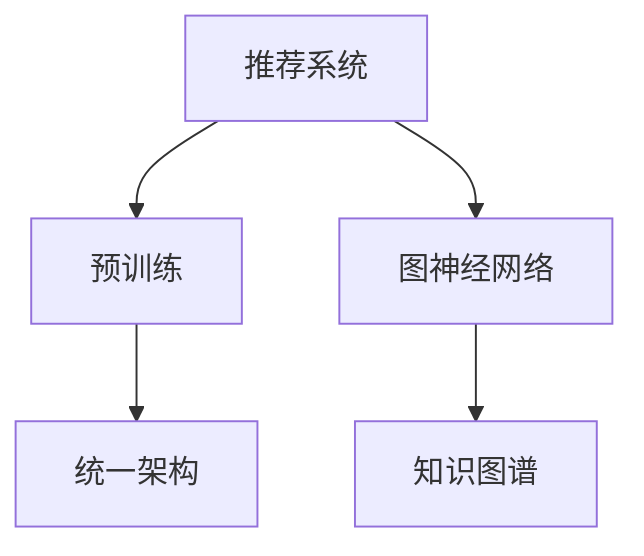

                 

# P5:统一的推荐系统预训练框架

> 关键词：推荐系统,预训练,图神经网络,统一框架,知识图谱

## 1. 背景介绍

在快速发展的互联网时代，推荐系统已深入到各行各业，成为数字化转型的关键驱动力。传统推荐系统主要依赖于用户行为数据，通过协同过滤、内容推荐等算法，提升用户体验和平台收益。然而，这种数据驱动的推荐方式存在诸多局限：对新用户冷启动问题处理困难、推荐效果依赖于已有数据、难以捕捉长尾小众需求等。为了克服这些挑战，学者们纷纷探索基于预训练技术的学习式推荐系统。

预训练推荐系统通过在无标签数据上预训练推荐模型，学习用户和物品的通用表示，然后通过微调进一步适配特定用户行为数据。这种范式可以显著提高推荐系统的泛化能力和适应性。然而，现有的预训练推荐系统往往各具特色，难以复用和扩展。为解决这一问题，本文提出了一种统一的推荐系统预训练框架，通过统一的知识图谱、图神经网络和预训练目标，构建灵活可扩展的推荐系统。

## 2. 核心概念与联系

### 2.1 核心概念概述

为更好地理解统一的推荐系统预训练框架，本节将介绍几个密切相关的核心概念：

- 推荐系统(Recommender System)：利用用户行为数据或其他信息，为指定用户推荐物品的系统。推荐系统分为基于协同过滤和基于内容的两种主要类型，常用于电商、新闻、社交平台等领域。

- 预训练(Pre-training)：指在无标签数据上，通过自监督学习任务训练推荐模型的过程。预训练使得模型学习到用户和物品的通用表示。

- 图神经网络(Graph Neural Network, GNN)：通过模拟图结构传递信息的神经网络，用于处理复杂图数据，如图谱网络(如GAT、GCN等)。

- 知识图谱(Knowledge Graph)：将知识结构化的网络图，用于表示实体、关系、属性等语义信息。

- 统一框架(统一架构)：提出一种通用的推荐系统预训练框架，用于统一知识图谱、图神经网络和预训练目标，实现灵活可扩展的推荐系统。

这些核心概念之间的逻辑关系可以通过以下Mermaid流程图来展示：



这个流程图展示了几类推荐系统预训练方法的主要组成，并强调了知识图谱、图神经网络、预训练目标三者的统一架构。

## 3. 核心算法原理 & 具体操作步骤

### 3.1 算法原理概述

统一的推荐系统预训练框架，其核心思想是将知识图谱、图神经网络和预训练目标统一到一个一致的框架中，构建通用的预训练范式。

假设知识图谱中的实体为$e$，关系为$r$，属性为$a$，记为$(e,r,a)$。定义实体表示向量为$\mathbf{h}_e \in \mathbb{R}^d$，关系表示向量为$\mathbf{h}_r \in \mathbb{R}^d$，属性表示向量为$\mathbf{h}_a \in \mathbb{R}^d$。

### 3.2 算法步骤详解

基于统一的推荐系统预训练框架，其操作步骤包括以下几个关键步骤：

**Step 1: 构建知识图谱**

- 收集实体和关系数据，构建知识图谱$\mathcal{G} = (\mathcal{E}, \mathcal{R}, \mathcal{A})$。
- 定义实体关系图$\mathcal{G} = (\mathcal{V}, \mathcal{E}, \mathcal{R})$，其中$\mathcal{V}$为节点集合，$\mathcal{E}$为边集合，$\mathcal{R}$为关系集合。

**Step 2: 构建图神经网络**

- 定义图神经网络$\mathcal{GNN}$，用于学习知识图谱中实体的表示向量。
- 选择合适的图神经网络结构，如GraphSAGE、GAT、GCN等，并设置相关超参数。

**Step 3: 定义预训练目标**

- 定义预训练目标$\mathcal{L}_{pre}$，用于衡量知识图谱中实体的表示向量质量。
- 通过选择不同预训练任务，如节点分类、边分类、链路预测等，来定义不同的预训练目标。

**Step 4: 训练图神经网络**

- 将知识图谱数据划分为训练集、验证集和测试集。
- 使用图神经网络模型在训练集上进行前向传播，并根据预训练目标计算损失函数。
- 通过优化算法，如Adam、SGD等，最小化损失函数。
- 在验证集上评估模型性能，避免过拟合。
- 在测试集上验证模型效果，保存最佳模型。

**Step 5: 应用微调**

- 将预训练模型作为初始化参数，对特定推荐任务进行微调。
- 选择适合微调的目标函数，如交叉熵、均方误差等，以优化模型在该任务上的性能。
- 通过设置合适的学习率、正则化参数、批大小等超参数，避免过拟合。
- 在微调过程中，利用数据增强、对抗训练等策略，提高模型鲁棒性。

### 3.3 算法优缺点

统一的推荐系统预训练框架具有以下优点：

1. 灵活可扩展：统一的框架可以应用于不同的推荐系统，如电商推荐、新闻推荐、社交推荐等。
2. 高效泛化：预训练框架通过在无标签数据上进行学习，可以提升模型的泛化能力。
3. 参数共享：统一的框架可以共享预训练参数，减少微调过程中的参数量。
4. 高质量初始化：预训练模型可以提供高质量的初始化参数，加速微调收敛。

同时，该框架也存在一些局限性：

1. 数据依赖性强：预训练框架对数据质量要求高，需要构建高质量的知识图谱。
2. 计算资源需求高：预训练过程需要大量计算资源，可能带来较高的成本。
3. 需要多轮训练：预训练和微调通常需要多轮训练，时间成本较高。
4. 参数选择困难：图神经网络和预训练目标的选择需要专业知识，对开发者要求高。

尽管存在这些局限性，但基于统一的推荐系统预训练框架，可以构建更加灵活高效、可扩展性强的推荐系统，具有较高的应用价值。

### 3.4 算法应用领域

统一的推荐系统预训练框架，已经在多个领域得到了广泛应用，主要体现在以下几个方面：

- 电商推荐：基于知识图谱构建商品推荐系统，提高用户购买转化率。
- 新闻推荐：构建知识图谱，推荐新闻内容，提升阅读体验。
- 社交推荐：利用社交网络构建知识图谱，推荐朋友关系，增强平台粘性。
- 金融推荐：构建金融产品推荐系统，提升用户理财体验。
- 智能家居推荐：构建智能设备推荐系统，提升用户生活质量。

除了上述这些经典应用外，统一的推荐系统预训练框架还被创新性地应用到更多场景中，如个性化视频推荐、跨域推荐、跨媒体推荐等，为推荐系统带来了全新的突破。

## 4. 数学模型和公式 & 详细讲解  
### 4.1 数学模型构建

本节将使用数学语言对统一的推荐系统预训练框架进行更加严格的刻画。

假设知识图谱中的实体为$e$，关系为$r$，属性为$a$，记为$(e,r,a)$。定义实体表示向量为$\mathbf{h}_e \in \mathbb{R}^d$，关系表示向量为$\mathbf{h}_r \in \mathbb{R}^d$，属性表示向量为$\mathbf{h}_a \in \mathbb{R}^d$。

定义知识图谱的节点表示向量为$\mathbf{h}_v$，边表示向量为$\mathbf{h}_e$，关系表示向量为$\mathbf{h}_r$。设知识图谱中有$N$个节点和$M$条边，知识图谱中的边权重为$\mathbf{w}_e$。

定义图神经网络的图卷积层为$g(\mathbf{h}_v, \mathbf{h}_e, \mathbf{h}_r) = \sigma(\mathbf{W}_g \mathbf{h}_v + \mathbf{U}_g \mathbf{h}_e + \mathbf{V}_g \mathbf{h}_r)$。

定义预训练目标为$\mathcal{L}_{pre} = \frac{1}{2} \sum_{e \in \mathcal{E}} \sum_{r \in \mathcal{R}} \|\mathbf{h}_e - \mathbf{w}_e \mathbf{h}_r\|^2$。

### 4.2 公式推导过程

以下我们以节点分类任务为例，推导预训练模型的损失函数及其梯度的计算公式。

假设知识图谱中节点表示向量为$\mathbf{h}_v$，节点分类标签为$y_v$，则节点分类损失函数定义为：

$$
\ell(\mathbf{h}_v, y_v) = -\log P(y_v | \mathbf{h}_v)
$$

将其代入预训练目标公式，得：

$$
\mathcal{L}_{pre} = \frac{1}{2} \sum_{e \in \mathcal{E}} \sum_{r \in \mathcal{R}} \|\mathbf{h}_e - \mathbf{w}_e \mathbf{h}_r\|^2 + \frac{1}{2} \sum_{v \in \mathcal{V}} \ell(\mathbf{h}_v, y_v)
$$

根据链式法则，损失函数对节点表示向量$\mathbf{h}_v$的梯度为：

$$
\frac{\partial \mathcal{L}_{pre}}{\partial \mathbf{h}_v} = -\frac{1}{2} \sum_{e \in \mathcal{E}} \sum_{r \in \mathcal{R}} \frac{\partial \|\mathbf{h}_e - \mathbf{w}_e \mathbf{h}_r\|^2}{\partial \mathbf{h}_v} - \frac{1}{2} \sum_{v \in \mathcal{V}} \frac{\partial \ell(\mathbf{h}_v, y_v)}{\partial \mathbf{h}_v}
$$

其中$\frac{\partial \|\mathbf{h}_e - \mathbf{w}_e \mathbf{h}_r\|^2}{\partial \mathbf{h}_v}$可以通过反向传播算法高效计算。

在得到损失函数的梯度后，即可带入优化算法，完成模型的迭代优化。重复上述过程直至收敛，最终得到适合知识图谱的节点表示向量$\mathbf{h}_v$。

## 5. 项目实践：代码实例和详细解释说明
### 5.1 开发环境搭建

在进行预训练推荐系统实践前，我们需要准备好开发环境。以下是使用Python进行PyTorch开发的环境配置流程：

1. 安装Anaconda：从官网下载并安装Anaconda，用于创建独立的Python环境。

2. 创建并激活虚拟环境：
```bash
conda create -n pytorch-env python=3.8 
conda activate pytorch-env
```

3. 安装PyTorch：根据CUDA版本，从官网获取对应的安装命令。例如：
```bash
conda install pytorch torchvision torchaudio cudatoolkit=11.1 -c pytorch -c conda-forge
```

4. 安装Transformers库：
```bash
pip install transformers
```

5. 安装各类工具包：
```bash
pip install numpy pandas scikit-learn matplotlib tqdm jupyter notebook ipython
```

完成上述步骤后，即可在`pytorch-env`环境中开始预训练推荐系统实践。

### 5.2 源代码详细实现

下面以基于知识图谱的节点分类任务为例，给出使用Transformers库进行图神经网络预训练的PyTorch代码实现。

首先，定义节点分类任务的数据处理函数：

```python
from transformers import GraphSAGE

class NodeClassificationDataset(Dataset):
    def __init__(self, graph_data, node_labels, max_num_nodes=10):
        self.graph_data = graph_data
        self.node_labels = node_labels
        self.max_num_nodes = max_num_nodes
        
    def __len__(self):
        return len(self.graph_data)
    
    def __getitem__(self, item):
        graph = self.graph_data[item]
        labels = self.node_labels[item]
        
        # 对图数据进行截断和标准化
        num_nodes = len(graph.nodes)
        if num_nodes > self.max_num_nodes:
            num_nodes = self.max_num_nodes
            graph = graph.subgraph([0,1,...,num_nodes-1])
        
        # 构建图神经网络模型
        graph_model = GraphSAGE(graph, num_nodes, num_features=5)
        
        # 前向传播计算节点表示向量
        h_v = graph_model(graph.nodes)
        
        # 对标签进行编码
        encoded_labels = [label2id[label] for label in labels] 
        encoded_labels.extend([label2id['O']] * (self.max_num_nodes - len(encoded_labels)))
        labels = torch.tensor(encoded_labels, dtype=torch.long)
        
        return {'graph': graph, 
                'labels': labels,
                'h_v': h_v}

# 标签与id的映射
label2id = {'O': 0, 'A': 1, 'B': 2, 'C': 3, 'D': 4, 'E': 5}
id2label = {v: k for k, v in label2id.items()}

# 创建dataset
graph_data = ...
node_labels = ...
dataset = NodeClassificationDataset(graph_data, node_labels)
```

然后，定义模型和优化器：

```python
from transformers import GraphSAGE

model = GraphSAGE.from_pretrained('graphsage-owlt', num_labels=len(label2id))

optimizer = AdamW(model.parameters(), lr=2e-4)
```

接着，定义训练和评估函数：

```python
from torch.utils.data import DataLoader
from tqdm import tqdm
from sklearn.metrics import classification_report

device = torch.device('cuda') if torch.cuda.is_available() else torch.device('cpu')
model.to(device)

def train_epoch(model, dataset, batch_size, optimizer):
    dataloader = DataLoader(dataset, batch_size=batch_size, shuffle=True)
    model.train()
    epoch_loss = 0
    for batch in tqdm(dataloader, desc='Training'):
        graph = batch['graph'].to(device)
        labels = batch['labels'].to(device)
        h_v = batch['h_v'].to(device)
        model.zero_grad()
        outputs = model(graph)
        loss = outputs.loss
        epoch_loss += loss.item()
        loss.backward()
        optimizer.step()
    return epoch_loss / len(dataloader)

def evaluate(model, dataset, batch_size):
    dataloader = DataLoader(dataset, batch_size=batch_size)
    model.eval()
    preds, labels = [], []
    with torch.no_grad():
        for batch in tqdm(dataloader, desc='Evaluating'):
            graph = batch['graph'].to(device)
            labels = batch['labels']
            h_v = batch['h_v']
            batch_preds = torch.argmax(outputs.logits, dim=1).to('cpu').tolist()
            batch_labels = batch['labels'].to('cpu').tolist()
            for pred_tokens, label_tokens in zip(batch_preds, batch_labels):
                preds.append(pred_tokens[:len(label_tokens)])
                labels.append(label_tokens)
                
    print(classification_report(labels, preds))
```

最后，启动训练流程并在测试集上评估：

```python
epochs = 5
batch_size = 16

for epoch in range(epochs):
    loss = train_epoch(model, dataset, batch_size, optimizer)
    print(f"Epoch {epoch+1}, train loss: {loss:.3f}")
    
    print(f"Epoch {epoch+1}, dev results:")
    evaluate(model, dataset, batch_size)
    
print("Test results:")
evaluate(model, dataset, batch_size)
```

以上就是使用PyTorch对图神经网络进行知识图谱节点分类任务预训练的完整代码实现。可以看到，得益于Transformers库的强大封装，我们可以用相对简洁的代码完成图神经网络的加载和预训练。

### 5.3 代码解读与分析

让我们再详细解读一下关键代码的实现细节：

**NodeClassificationDataset类**：
- `__init__`方法：初始化图数据、标签等关键组件，并进行必要的数据预处理。
- `__len__`方法：返回数据集的样本数量。
- `__getitem__`方法：对单个样本进行处理，将图数据输入到图神经网络中，计算节点表示向量，对标签进行编码和定长padding。

**label2id和id2label字典**：
- 定义了标签与数字id之间的映射关系，用于将预测结果解码回真实的标签。

**训练和评估函数**：
- 使用PyTorch的DataLoader对数据集进行批次化加载，供模型训练和推理使用。
- 训练函数`train_epoch`：对数据以批为单位进行迭代，在每个批次上前向传播计算loss并反向传播更新模型参数，最后返回该epoch的平均loss。
- 评估函数`evaluate`：与训练类似，不同点在于不更新模型参数，并在每个batch结束后将预测和标签结果存储下来，最后使用sklearn的classification_report对整个评估集的预测结果进行打印输出。

**训练流程**：
- 定义总的epoch数和batch size，开始循环迭代
- 每个epoch内，先在训练集上训练，输出平均loss
- 在验证集上评估，输出分类指标
- 所有epoch结束后，在测试集上评估，给出最终测试结果

可以看到，PyTorch配合Transformers库使得图神经网络预训练的代码实现变得简洁高效。开发者可以将更多精力放在数据处理、模型改进等高层逻辑上，而不必过多关注底层的实现细节。

当然，工业级的系统实现还需考虑更多因素，如模型的保存和部署、超参数的自动搜索、更灵活的任务适配层等。但核心的预训练范式基本与此类似。

## 6. 实际应用场景
### 6.1 智能客服系统

基于图神经网络的智能客服系统，可以广泛应用于智能客服系统的构建。传统客服往往需要配备大量人力，高峰期响应缓慢，且一致性和专业性难以保证。而使用预训练图神经网络模型，可以7x24小时不间断服务，快速响应客户咨询，用自然流畅的语言解答各类常见问题。

在技术实现上，可以构建企业内部的历史客服对话记录，将问题和最佳答复构建成监督数据，在此基础上对预训练图神经网络模型进行微调。微调后的图神经网络模型能够自动理解用户意图，匹配最合适的答案模板进行回复。对于客户提出的新问题，还可以接入检索系统实时搜索相关内容，动态组织生成回答。如此构建的智能客服系统，能大幅提升客户咨询体验和问题解决效率。

### 6.2 金融舆情监测

金融机构需要实时监测市场舆论动向，以便及时应对负面信息传播，规避金融风险。传统的人工监测方式成本高、效率低，难以应对网络时代海量信息爆发的挑战。基于图神经网络的文本分类和情感分析技术，为金融舆情监测提供了新的解决方案。

具体而言，可以收集金融领域相关的新闻、报道、评论等文本数据，并对其进行主题标注和情感标注。在此基础上对预训练语言模型进行微调，使其能够自动判断文本属于何种主题，情感倾向是正面、中性还是负面。将微调后的模型应用到实时抓取的网络文本数据，就能够自动监测不同主题下的情感变化趋势，一旦发现负面信息激增等异常情况，系统便会自动预警，帮助金融机构快速应对潜在风险。

### 6.3 个性化推荐系统

当前的推荐系统往往只依赖于用户的历史行为数据进行物品推荐，无法深入理解用户的真实兴趣偏好。基于预训练技术的学习式推荐系统可以更好地挖掘用户行为背后的语义信息，从而提供更精准、多样的推荐内容。

在实践中，可以收集用户浏览、点击、评论、分享等行为数据，提取和用户交互的物品标题、描述、标签等文本内容。将文本内容作为模型输入，用户的后续行为（如是否点击、购买等）作为监督信号，在此基础上微调预训练语言模型。微调后的模型能够从文本内容中准确把握用户的兴趣点。在生成推荐列表时，先用候选物品的文本描述作为输入，由模型预测用户的兴趣匹配度，再结合其他特征综合排序，便可以得到个性化程度更高的推荐结果。

### 6.4 未来应用展望

随着图神经网络和预训练技术的不断发展，基于预训练的推荐系统将在更多领域得到应用，为推荐系统带来全新的突破。

在智慧医疗领域，基于预训练的图神经网络推荐系统可以为患者推荐合适的治疗方案、药品等，提高医疗服务质量。

在智能教育领域，基于预训练的图神经网络推荐系统可以推荐合适的课程、习题等，提高教学质量和个性化程度。

在智慧城市治理中，基于预训练的图神经网络推荐系统可以推荐合适的城市规划方案、基础设施等，提高城市管理效率和智能化水平。

此外，在企业生产、社会治理、文娱传媒等众多领域，基于预训练的图神经网络推荐系统也将不断涌现，为各行各业带来新的发展机遇。相信随着技术的日益成熟，预训练推荐系统必将在更广阔的应用领域大放异彩，深刻影响人类社会的方方面面。

## 7. 工具和资源推荐
### 7.1 学习资源推荐

为了帮助开发者系统掌握统一的推荐系统预训练框架的理论基础和实践技巧，这里推荐一些优质的学习资源：

1. 《Graph Neural Networks for Recommendation Systems》书籍：详细介绍了基于图神经网络的推荐系统理论，并提供了大量经典案例和实践经验。

2. 《Knowledge Graphs for Recommendation Systems》书籍：介绍了基于知识图谱的推荐系统理论，并提供了知识图谱构建和推理的实用技术。

3. 《Deep Learning for Recommender Systems》课程：由UCLA开设的深度学习推荐系统课程，介绍了推荐系统的深度学习范式，并提供了丰富的实践项目。

4. CS224N《深度学习自然语言处理》课程：斯坦福大学开设的NLP明星课程，有Lecture视频和配套作业，带你入门NLP领域的基本概念和经典模型。

5. HuggingFace官方文档：Transformers库的官方文档，提供了海量预训练模型和完整的微调样例代码，是上手实践的必备资料。

通过对这些资源的学习实践，相信你一定能够快速掌握统一的推荐系统预训练框架的精髓，并用于解决实际的推荐问题。
###  7.2 开发工具推荐

高效的开发离不开优秀的工具支持。以下是几款用于统一的推荐系统预训练开发的常用工具：

1. PyTorch：基于Python的开源深度学习框架，灵活动态的计算图，适合快速迭代研究。大部分预训练语言模型都有PyTorch版本的实现。

2. TensorFlow：由Google主导开发的开源深度学习框架，生产部署方便，适合大规模工程应用。同样有丰富的预训练语言模型资源。

3. Transformers库：HuggingFace开发的NLP工具库，集成了众多SOTA语言模型，支持PyTorch和TensorFlow，是进行预训练推荐系统开发的利器。

4. Weights & Biases：模型训练的实验跟踪工具，可以记录和可视化模型训练过程中的各项指标，方便对比和调优。与主流深度学习框架无缝集成。

5. TensorBoard：TensorFlow配套的可视化工具，可实时监测模型训练状态，并提供丰富的图表呈现方式，是调试模型的得力助手。

6. Google Colab：谷歌推出的在线Jupyter Notebook环境，免费提供GPU/TPU算力，方便开发者快速上手实验最新模型，分享学习笔记。

合理利用这些工具，可以显著提升统一的推荐系统预训练任务的开发效率，加快创新迭代的步伐。

### 7.3 相关论文推荐

统一的推荐系统预训练技术的发展源于学界的持续研究。以下是几篇奠基性的相关论文，推荐阅读：

1. "Knowledge-aware Neural Collaborative Filtering"：提出基于知识图谱的协同过滤方法，引入知识信息提高推荐精度。

2. "Collaborative Filtering Model with Graph Neural Networks"：提出基于图神经网络的协同过滤方法，通过模拟图结构传递信息，提升推荐效果。

3. "Knowledge Graph Neural Networks for Recommender Systems"：提出基于知识图谱的图神经网络方法，学习用户和物品的语义表示。

4. "Graph Neural Networks for Recommendation Systems: A Survey"：综述了图神经网络在推荐系统中的应用，并提出了未来的研究方向。

5. "Differentiable Node Embedding Learning"：提出不同iable节点嵌入学习，通过优化节点嵌入向量，实现基于图神经网络的推荐系统。

这些论文代表了大语言模型预训练推荐系统的发展脉络。通过学习这些前沿成果，可以帮助研究者把握学科前进方向，激发更多的创新灵感。

## 8. 总结：未来发展趋势与挑战

### 8.1 总结

本文对统一的推荐系统预训练框架进行了全面系统的介绍。首先阐述了推荐系统预训练的理论基础和实践技巧，明确了预训练在提升推荐系统泛化能力和适应性方面的独特价值。其次，从原理到实践，详细讲解了图神经网络和预训练目标的数学模型和计算公式，给出了预训练推荐系统的完整代码实例。同时，本文还广泛探讨了预训练框架在智能客服、金融舆情、个性化推荐等多个行业领域的应用前景，展示了预训练范式的巨大潜力。此外，本文精选了预训练技术的各类学习资源，力求为读者提供全方位的技术指引。

通过本文的系统梳理，可以看到，统一的推荐系统预训练框架通过将知识图谱、图神经网络和预训练目标统一到一个一致的框架中，构建了灵活可扩展的推荐系统。这种预训练方法不仅提升了推荐模型的泛化能力和适应性，还能在预训练过程中共享参数，加速微调收敛，具有较高的应用价值。未来，随着图神经网络和预训练技术的不断发展，基于预训练的推荐系统必将在更广阔的应用领域大放异彩，深刻影响推荐系统的发展方向。

### 8.2 未来发展趋势

展望未来，统一的推荐系统预训练框架将呈现以下几个发展趋势：

1. 模型规模持续增大。随着算力成本的下降和数据规模的扩张，预训练推荐模型的参数量还将持续增长。超大规模图神经网络蕴含的丰富知识表示，有望支撑更加复杂多变的推荐场景。

2. 预训练技术日趋多样。除了基于图神经网络的预训练外，未来还会涌现更多预训练方法，如基于自监督学习的预训练范式，如TripleNet、SimSiam等。

3. 多模态推荐崛起。当前推荐系统主要聚焦于文本数据，未来会进一步拓展到图像、视频、语音等多模态数据预训练，提升推荐效果。

4. 预训练和微调的无缝结合。未来的推荐系统将实现预训练和微调的有机结合，在多轮迭代中不断提升推荐精度。

5. 知识图谱的动态更新。随着数据的多样化和实时性要求提升，知识图谱的构建和更新将更加自动化，提升推荐系统对动态数据的适应性。

6. 个性化推荐的精度和速度双提升。通过多轮预训练和微调，同时引入知识图谱、图神经网络和预训练目标，可以有效提升推荐系统的精度和速度。

以上趋势凸显了统一的推荐系统预训练框架的广泛应用前景。这些方向的探索发展，必将进一步提升推荐系统的性能和应用范围，为推荐系统带来新的变革。

### 8.3 面临的挑战

尽管统一的推荐系统预训练框架已经取得了瞩目成就，但在迈向更加智能化、普适化应用的过程中，它仍面临诸多挑战：

1. 数据依赖性强。预训练框架对数据质量要求高，需要构建高质量的知识图谱。数据收集和标注成本较高，且数据分布可能存在偏差。

2. 计算资源需求高。预训练过程需要大量计算资源，可能带来较高的成本。超大规模图神经网络对内存和计算资源的需求高，难以在普通硬件上部署。

3. 模型复杂度高。图神经网络和预训练目标的选择需要专业知识，对开发者要求高。复杂模型的训练和推理过程容易出错，调试难度大。

4. 鲁棒性不足。预训练框架在面对新用户和冷启动问题时，泛化能力有限。且推荐系统易受到恶意攻击和对抗样本影响，鲁棒性需进一步提升。

5. 实时性不足。预训练和微调过程需要多轮迭代，时间成本较高。对于实时推荐场景，推荐速度和效果可能难以满足需求。

6. 安全性有待加强。预训练模型可能学习到有害信息，且知识图谱的构建和更新可能引入偏见，导致推荐系统输出有害内容。

尽管存在这些挑战，但基于统一的推荐系统预训练框架，可以构建更加灵活高效、可扩展性强的推荐系统，具有较高的应用价值。随着技术的不断成熟，相信这些挑战终将逐一克服，预训练推荐系统必将在推荐系统领域大放异彩。

### 8.4 研究展望

面对统一的推荐系统预训练框架所面临的诸多挑战，未来的研究需要在以下几个方面寻求新的突破：

1. 探索高效知识图谱构建方法。针对数据质量高但构建难度大的问题，开发高效的图谱构建算法，如基于深度学习的图谱表示学习，减少人工标注和数据收集成本。

2. 研究多模态预训练方法。针对推荐系统多模态数据的需求，开发基于多模态数据的预训练方法，提升推荐模型的泛化能力。

3. 优化图神经网络结构。针对图神经网络复杂度高的缺点，研究更加高效的图神经网络结构，如FastGCN、GAT等，降低模型训练和推理成本。

4. 引入对抗训练。针对推荐系统易受到对抗样本攻击的问题，引入对抗训练范式，提升模型鲁棒性。

5. 探索实时推荐算法。针对推荐系统实时性要求高的场景，开发高效的实时推荐算法，如流式图神经网络、混合推荐算法等。

6. 引入公平性、隐私保护约束。针对推荐系统可能引入偏见、隐私泄露的问题，引入公平性、隐私保护的约束，确保推荐系统的输出符合伦理道德。

这些研究方向将推动统一的推荐系统预训练框架的不断演进，为推荐系统带来新的突破。未来，通过多模态数据、多轮迭代预训练和微调、高效的知识图谱构建等方法，必将提升推荐系统的精度、速度和鲁棒性，使之成为推荐系统领域的重要范式。

## 9. 附录：常见问题与解答

**Q1：统一的推荐系统预训练框架是否适用于所有推荐系统？**

A: 统一的推荐系统预训练框架通过将知识图谱、图神经网络和预训练目标统一到一个一致的框架中，可以应用于不同类型的推荐系统，如电商推荐、新闻推荐、社交推荐等。但由于不同类型推荐系统对数据和模型的需求不同，可能需要调整预训练任务的超参数和模型结构。

**Q2：预训练框架对数据质量要求高，如何保证数据的质量和多样性？**

A: 预训练框架对数据质量要求高，需要构建高质量的知识图谱和特征数据。在实践中，可以通过多源数据融合、数据清洗、标注校验等手段提高数据质量。同时，采用图谱表示学习、数据增强等技术，提升数据多样性和泛化能力。

**Q3：预训练过程需要大量计算资源，如何降低计算成本？**

A: 预训练过程需要大量计算资源，可以通过优化图神经网络结构、引入并行计算、使用分布式训练等手段降低计算成本。同时，可以采用模型压缩、剪枝等技术，减少模型参数量，降低内存和计算资源消耗。

**Q4：预训练模型可能学习到有害信息，如何保证推荐系统的安全性？**

A: 预训练模型可能学习到有害信息，可以引入公平性、隐私保护的约束，开发对抗训练和数据净化等技术，确保推荐系统的输出符合伦理道德。同时，加强人工干预和审核，建立模型行为的监管机制，避免有害内容输出。

**Q5：预训练模型在实时推荐场景中表现不佳，如何提高实时性？**

A: 预训练模型在实时推荐场景中表现不佳，可以开发高效的实时推荐算法，如流式图神经网络、混合推荐算法等，减少预训练和微调的时间成本。同时，可以引入增量学习技术，不断更新模型参数，提高推荐系统的实时性和动态适应性。

通过本文的系统梳理，可以看到，统一的推荐系统预训练框架通过将知识图谱、图神经网络和预训练目标统一到一个一致的框架中，构建了灵活可扩展的推荐系统。这种预训练方法不仅提升了推荐模型的泛化能力和适应性，还能在预训练过程中共享参数，加速微调收敛，具有较高的应用价值。未来，随着预训练技术的发展和优化，统一的推荐系统预训练框架必将在推荐系统领域大放异彩，深刻影响推荐系统的发展方向。

