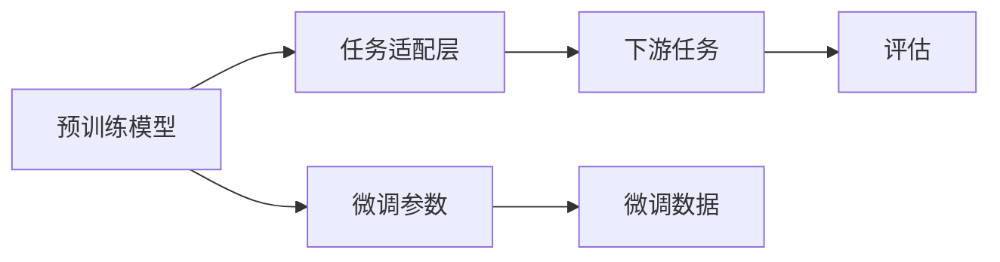

                 

# PEFT技术：高效微调大型预训练模型

> 关键词：参数高效微调(PEFT), 大型预训练模型, 模型压缩, 微调, 模型裁剪, 推理加速

## 1. 背景介绍

### 1.1 问题由来
在自然语言处理(NLP)领域，大规模预训练语言模型(LLMs)如BERT、GPT-3等因其出色的性能在众多任务上取得了显著进展。然而，这些模型通常需要巨大的训练资源，包括大量的数据和计算资源。因此，如何高效利用这些预训练模型，避免从头训练，成为研究者们关注的焦点。

参数高效微调(Parameter-Efficient Fine-Tuning, PEFT)技术应运而生。PEFT允许在大规模预训练模型的基础上，通过微调模型的特定部分，而非全部参数，来实现对新任务的适配。这种方法可以显著减少微调所需的时间和资源，同时保持预训练模型的泛化能力。

### 1.2 问题核心关键点
PEFT的核心思想是，在大规模预训练模型的基础上，仅更新模型的一部分参数，如顶层分类器、特定的解码器等，而非全模型参数。这样可以保持模型的整体结构和预训练的知识，避免从头训练的风险，同时也可以快速适应新的任务需求。

PEFT的优势在于：
1. **参数高效**：只有部分参数参与微调，减少了模型的计算负担。
2. **鲁棒性强**：保留了预训练模型的基础结构，有助于保持模型的鲁棒性。
3. **可扩展性强**：更容易扩展到新的任务，只需调整结构中的特定部分。

PEFT的关键在于如何选择和冻结预训练模型中的参数，以及如何设计任务适配层。这些决策对微调的效果有着重要影响。

## 2. 核心概念与联系

### 2.1 核心概念概述

为了更好地理解PEFT技术，本节将介绍几个关键概念：

- 预训练语言模型(LLMs)：通过在海量无标签数据上进行自监督预训练，学习通用语言表示的模型。
- 参数高效微调(PEFT)：在预训练模型的基础上，仅更新部分参数以适配新任务。
- 参数冻结(Frozen Layers)：在微调过程中，保持预训练模型的部分参数不变，只更新特定部分的参数。
- 任务适配层(Task-specific Layer)：针对具体任务，在预训练模型的顶层设计新的输出层和损失函数。
- 微调(Fine-Tuning)：在预训练模型的基础上，使用下游任务的标注数据，通过有监督学习优化模型性能。

这些概念通过以下Mermaid流程图进行展示：

```mermaid
graph TB
    A[预训练模型] --> B[微调]
    A --> C[参数高效微调(PEFT)]
    B --> D[全参数微调]
    C --> E[参数冻结]
    C --> F[任务适配层]
    F --> G[微调]
```

这个流程图展示了预训练模型和PEFT之间的关系：

1. 预训练模型是PEFT的基础，通过自监督预训练获得通用语言表示。
2. PEFT通过微调特定参数和设计任务适配层，适应新任务。
3. 全参数微调是PEFT的一个特例，所有参数都参与微调。
4. 参数冻结指部分预训练参数保持不变，只更新特定部分参数。
5. 任务适配层用于将预训练模型转换为适用于特定任务的输出结构。

### 2.2 核心概念原理和架构

PEFT的原理可以简单概括为：在预训练模型的基础上，通过微调顶层分类器或解码器等特定部分，而非全模型参数，来实现对新任务的适配。具体来说，PEFT分为以下几个步骤：

1. **选择预训练模型**：选择合适的预训练语言模型，如BERT、GPT等。
2. **设计任务适配层**：根据具体任务类型，设计新的输出层和损失函数。
3. **设置微调参数**：决定哪些参数参与微调，如只微调顶层分类器。
4. **执行微调**：使用下游任务的标注数据，通过有监督学习优化模型性能。
5. **评估与优化**：在验证集和测试集上评估微调后模型的性能，必要时调整微调参数。

PEFT的架构如下图所示：



## 3. 核心算法原理 & 具体操作步骤

### 3.1 算法原理概述

PEFT的核心算法基于有监督学习，通过微调模型的特定部分，而非全模型参数，来实现对新任务的适配。PEFT的数学原理可以简单概括为：

- **输入表示**：将预训练模型的输出表示作为输入特征，输入层通常保持不变。
- **任务适配层**：根据具体任务设计新的输出层和损失函数。
- **微调参数**：仅更新任务适配层和顶层分类器等特定部分的参数。
- **优化目标**：最小化下游任务的损失函数，提升模型在特定任务上的性能。

PEFT的优化目标可以表示为：

$$
\theta^* = \mathop{\arg\min}_{\theta} \mathcal{L}(M_{\theta},D)
$$

其中，$\mathcal{L}$ 为下游任务的损失函数，$D$ 为下游任务的标注数据集，$M_{\theta}$ 为微调后的模型。

### 3.2 算法步骤详解

PEFT的具体操作步骤如下：

1. **数据准备**：准备下游任务的标注数据集，划分为训练集、验证集和测试集。
2. **模型初始化**：选择预训练模型，并在其顶层添加任务适配层。
3. **参数设置**：决定哪些参数参与微调，如只微调顶层分类器。
4. **优化器选择**：选择合适的优化器及其参数，如AdamW、SGD等。
5. **损失函数设计**：根据任务类型，设计相应的损失函数。
6. **微调训练**：使用训练集数据，通过前向传播计算损失，反向传播更新参数，直至收敛。
7. **评估与调整**：在验证集和测试集上评估模型性能，必要时调整微调参数。

### 3.3 算法优缺点

PEFT具有以下优点：

1. **参数高效**：仅更新部分参数，减少了计算负担。
2. **鲁棒性强**：保留了预训练模型的基础结构，有助于保持模型鲁棒性。
3. **可扩展性强**：更容易扩展到新的任务，只需调整结构中的特定部分。
4. **适应性强**：可以快速适应新任务，无需从头训练。

PEFT的缺点包括：

1. **性能受限于预训练质量**：预训练模型的质量直接影响PEFT的效果。
2. **微调参数过多可能导致过拟合**：如果微调参数过多，可能导致模型过拟合。
3. **参数选择不当可能导致性能下降**：如何选择和冻结预训练参数，对微调效果有重要影响。

### 3.4 算法应用领域

PEFT技术广泛应用于NLP领域，涵盖各种任务，例如：

- 文本分类：如情感分析、主题分类、意图识别等。
- 命名实体识别：识别文本中的人名、地名、机构名等特定实体。
- 关系抽取：从文本中抽取实体之间的语义关系。
- 问答系统：对自然语言问题给出答案。
- 机器翻译：将源语言文本翻译成目标语言。
- 文本摘要：将长文本压缩成简短摘要。
- 对话系统：使机器能够与人自然对话。

此外，PEFT还在代码生成、数据增强、语音识别等领域得到应用，为各种任务提供了高效的解决方案。

## 4. 数学模型和公式 & 详细讲解 & 举例说明

### 4.1 数学模型构建

在PEFT中，数学模型构建主要涉及以下几个方面：

- **输入表示**：将预训练模型的输出表示作为输入特征。
- **任务适配层**：根据具体任务设计新的输出层和损失函数。
- **微调参数**：仅更新任务适配层和顶层分类器等特定部分的参数。
- **优化目标**：最小化下游任务的损失函数，提升模型在特定任务上的性能。

### 4.2 公式推导过程

以二分类任务为例，假设预训练模型的输出表示为 $h_{\theta}$，任务适配层为 $\phi$，任务分类器为 $f$，损失函数为 $L$。微调后的模型输出为 $y=f(\phi(h_{\theta}))$，则微调目标可以表示为：

$$
\theta^* = \mathop{\arg\min}_{\theta} \mathcal{L}(f(\phi(h_{\theta})),y)
$$

其中，$\mathcal{L}$ 为二分类交叉熵损失函数：

$$
\mathcal{L}(y,f(\phi(h_{\theta}))) = -\frac{1}{N}\sum_{i=1}^N [y_i\log f(\phi(h_{\theta}(x_i)))+(1-y_i)\log(1-f(\phi(h_{\theta}(x_i))))
$$

### 4.3 案例分析与讲解

假设我们要对BERT模型进行PEFT，以适应情感分析任务。具体步骤如下：

1. **数据准备**：收集情感分析任务的标注数据集，并划分为训练集、验证集和测试集。
2. **模型初始化**：选择BERT模型，并在其顶层添加任务适配层，如全连接层和softmax层。
3. **参数设置**：仅微调任务适配层和顶层分类器，保持预训练模型的其他部分不变。
4. **优化器选择**：选择AdamW优化器，设置学习率为 $2 \times 10^{-5}$。
5. **损失函数设计**：使用二分类交叉熵损失函数。
6. **微调训练**：使用训练集数据进行有监督学习，优化任务适配层和顶层分类器的参数。
7. **评估与调整**：在验证集和测试集上评估模型性能，必要时调整微调参数。

## 5. 项目实践：代码实例和详细解释说明

### 5.1 开发环境搭建

在进行PEFT实践前，我们需要准备好开发环境。以下是使用Python进行PyTorch开发的环境配置流程：

1. 安装Anaconda：从官网下载并安装Anaconda，用于创建独立的Python环境。

2. 创建并激活虚拟环境：
```bash
conda create -n pytorch-env python=3.8 
conda activate pytorch-env
```

3. 安装PyTorch：根据CUDA版本，从官网获取对应的安装命令。例如：
```bash
conda install pytorch torchvision torchaudio cudatoolkit=11.1 -c pytorch -c conda-forge
```

4. 安装Transformers库：
```bash
pip install transformers
```

5. 安装各类工具包：
```bash
pip install numpy pandas scikit-learn matplotlib tqdm jupyter notebook ipython
```

完成上述步骤后，即可在`pytorch-env`环境中开始PEFT实践。

### 5.2 源代码详细实现

下面我们以BERT模型进行情感分析任务的PEFT实践为例，给出完整的代码实现。

```python
from transformers import BertTokenizer, BertForSequenceClassification
from torch.utils.data import Dataset
import torch
from torch.nn import functional as F

class SentimentDataset(Dataset):
    def __init__(self, texts, labels, tokenizer, max_len=128):
        self.texts = texts
        self.labels = labels
        self.tokenizer = tokenizer
        self.max_len = max_len

    def __len__(self):
        return len(self.texts)

    def __getitem__(self, item):
        text = self.texts[item]
        label = self.labels[item]

        encoding = self.tokenizer(text, return_tensors='pt', max_length=self.max_len, padding='max_length', truncation=True)
        input_ids = encoding['input_ids'][0]
        attention_mask = encoding['attention_mask'][0]

        # 对token-wise的标签进行编码
        encoded_labels = [label2id[label] for label in label]
        encoded_labels.extend([label2id['O']] * (self.max_len - len(encoded_labels)))
        labels = torch.tensor(encoded_labels, dtype=torch.long)

        return {'input_ids': input_ids, 
                'attention_mask': attention_mask,
                'labels': labels}

# 标签与id的映射
label2id = {'negative': 0, 'positive': 1}

# 创建dataset
tokenizer = BertTokenizer.from_pretrained('bert-base-cased')

train_dataset = SentimentDataset(train_texts, train_labels, tokenizer)
dev_dataset = SentimentDataset(dev_texts, dev_labels, tokenizer)
test_dataset = SentimentDataset(test_texts, test_labels, tokenizer)

# 模型初始化
model = BertForSequenceClassification.from_pretrained('bert-base-cased', num_labels=len(label2id))

# 参数冻结，仅微调顶层分类器
for param in model.parameters():
    param.requires_grad = False
model.classifier.weight.requires_grad = True

# 优化器选择
optimizer = AdamW(model.parameters(), lr=2e-5)

# 损失函数设计
criterion = torch.nn.CrossEntropyLoss()

# 微调训练
def train_epoch(model, dataset, batch_size, optimizer, criterion):
    dataloader = DataLoader(dataset, batch_size=batch_size, shuffle=True)
    model.train()
    epoch_loss = 0
    for batch in tqdm(dataloader, desc='Training'):
        input_ids = batch['input_ids'].to(device)
        attention_mask = batch['attention_mask'].to(device)
        labels = batch['labels'].to(device)
        model.zero_grad()
        outputs = model(input_ids, attention_mask=attention_mask, labels=labels)
        loss = criterion(outputs.logits, labels)
        epoch_loss += loss.item()
        loss.backward()
        optimizer.step()
    return epoch_loss / len(dataloader)

# 评估与调整
def evaluate(model, dataset, batch_size, criterion):
    dataloader = DataLoader(dataset, batch_size=batch_size)
    model.eval()
    preds, labels = [], []
    with torch.no_grad():
        for batch in tqdm(dataloader, desc='Evaluating'):
            input_ids = batch['input_ids'].to(device)
            attention_mask = batch['attention_mask'].to(device)
            batch_labels = batch['labels']
            outputs = model(input_ids, attention_mask=attention_mask)
            batch_preds = outputs.logits.argmax(dim=2).to('cpu').tolist()
            batch_labels = batch_labels.to('cpu').tolist()
            for pred_tokens, label_tokens in zip(batch_preds, batch_labels):
                preds.append(pred_tokens[:len(label_tokens)])
                labels.append(label_tokens)
    print(classification_report(labels, preds))

# 训练流程
epochs = 5
batch_size = 16

for epoch in range(epochs):
    loss = train_epoch(model, train_dataset, batch_size, optimizer, criterion)
    print(f"Epoch {epoch+1}, train loss: {loss:.3f}")

    print(f"Epoch {epoch+1}, dev results:")
    evaluate(model, dev_dataset, batch_size, criterion)

print("Test results:")
evaluate(model, test_dataset, batch_size, criterion)
```

### 5.3 代码解读与分析

让我们再详细解读一下关键代码的实现细节：

**SentimentDataset类**：
- `__init__`方法：初始化文本、标签、分词器等关键组件。
- `__len__`方法：返回数据集的样本数量。
- `__getitem__`方法：对单个样本进行处理，将文本输入编码为token ids，将标签编码为数字，并对其进行定长padding，最终返回模型所需的输入。

**标签与id的映射**：
- 定义了标签与数字id之间的映射关系，用于将token-wise的预测结果解码回真实的标签。

**训练和评估函数**：
- 使用PyTorch的DataLoader对数据集进行批次化加载，供模型训练和推理使用。
- 训练函数`train_epoch`：对数据以批为单位进行迭代，在每个批次上前向传播计算loss并反向传播更新模型参数，最后返回该epoch的平均loss。
- 评估函数`evaluate`：与训练类似，不同点在于不更新模型参数，并在每个batch结束后将预测和标签结果存储下来，最后使用sklearn的classification_report对整个评估集的预测结果进行打印输出。

**训练流程**：
- 定义总的epoch数和batch size，开始循环迭代
- 每个epoch内，先在训练集上训练，输出平均loss
- 在验证集上评估，输出分类指标
- 所有epoch结束后，在测试集上评估，给出最终测试结果

可以看到，PyTorch配合Transformers库使得BERT的PEFT代码实现变得简洁高效。开发者可以将更多精力放在数据处理、模型改进等高层逻辑上，而不必过多关注底层的实现细节。

## 6. 实际应用场景

### 6.1 智能客服系统

基于大语言模型PEFT的对话技术，可以广泛应用于智能客服系统的构建。传统客服往往需要配备大量人力，高峰期响应缓慢，且一致性和专业性难以保证。而使用PEFT对话模型，可以7x24小时不间断服务，快速响应客户咨询，用自然流畅的语言解答各类常见问题。

在技术实现上，可以收集企业内部的历史客服对话记录，将问题和最佳答复构建成监督数据，在此基础上对预训练对话模型进行PEFT。PEFT后的对话模型能够自动理解用户意图，匹配最合适的答案模板进行回复。对于客户提出的新问题，还可以接入检索系统实时搜索相关内容，动态组织生成回答。如此构建的智能客服系统，能大幅提升客户咨询体验和问题解决效率。

### 6.2 金融舆情监测

金融机构需要实时监测市场舆论动向，以便及时应对负面信息传播，规避金融风险。传统的人工监测方式成本高、效率低，难以应对网络时代海量信息爆发的挑战。基于PEFT的文本分类和情感分析技术，为金融舆情监测提供了新的解决方案。

具体而言，可以收集金融领域相关的新闻、报道、评论等文本数据，并对其进行主题标注和情感标注。在此基础上对预训练语言模型进行PEFT，使其能够自动判断文本属于何种主题，情感倾向是正面、中性还是负面。将PEFT后的模型应用到实时抓取的网络文本数据，就能够自动监测不同主题下的情感变化趋势，一旦发现负面信息激增等异常情况，系统便会自动预警，帮助金融机构快速应对潜在风险。

### 6.3 个性化推荐系统

当前的推荐系统往往只依赖用户的历史行为数据进行物品推荐，无法深入理解用户的真实兴趣偏好。基于PEFT的个性化推荐系统可以更好地挖掘用户行为背后的语义信息，从而提供更精准、多样的推荐内容。

在实践中，可以收集用户浏览、点击、评论、分享等行为数据，提取和用户交互的物品标题、描述、标签等文本内容。将文本内容作为模型输入，用户的后续行为（如是否点击、购买等）作为监督信号，在此基础上对预训练语言模型进行PEFT。PEFT后的模型能够从文本内容中准确把握用户的兴趣点。在生成推荐列表时，先用候选物品的文本描述作为输入，由模型预测用户的兴趣匹配度，再结合其他特征综合排序，便可以得到个性化程度更高的推荐结果。

### 6.4 未来应用展望

随着PEFT技术的不断发展，其在更多领域的应用前景将被逐步拓展，为各行各业带来变革性影响。

在智慧医疗领域，基于PEFT的医疗问答、病历分析、药物研发等应用将提升医疗服务的智能化水平，辅助医生诊疗，加速新药开发进程。

在智能教育领域，PEFT技术可应用于作业批改、学情分析、知识推荐等方面，因材施教，促进教育公平，提高教学质量。

在智慧城市治理中，PEFT模型可应用于城市事件监测、舆情分析、应急指挥等环节，提高城市管理的自动化和智能化水平，构建更安全、高效的未来城市。

此外，在企业生产、社会治理、文娱传媒等众多领域，基于PEFT的人工智能应用也将不断涌现，为NLP技术带来了全新的突破。相信随着预训练语言模型和PEFT方法的持续演进，NLP技术必将在更广阔的应用领域大放异彩，深刻影响人类的生产生活方式。

## 7. 工具和资源推荐

### 7.1 学习资源推荐

为了帮助开发者系统掌握PEFT的理论基础和实践技巧，这里推荐一些优质的学习资源：

1. 《Transformer从原理到实践》系列博文：由大模型技术专家撰写，深入浅出地介绍了Transformer原理、BERT模型、PEFT技术等前沿话题。

2. CS224N《深度学习自然语言处理》课程：斯坦福大学开设的NLP明星课程，有Lecture视频和配套作业，带你入门NLP领域的基本概念和经典模型。

3. 《Natural Language Processing with Transformers》书籍：Transformers库的作者所著，全面介绍了如何使用Transformers库进行NLP任务开发，包括PEFT在内的诸多范式。

4. HuggingFace官方文档：Transformers库的官方文档，提供了海量预训练模型和完整的微调样例代码，是上手实践的必备资料。

5. CLUE开源项目：中文语言理解测评基准，涵盖大量不同类型的中文NLP数据集，并提供了基于PEFT的baseline模型，助力中文NLP技术发展。

通过对这些资源的学习实践，相信你一定能够快速掌握PEFT技术的精髓，并用于解决实际的NLP问题。

### 7.2 开发工具推荐

高效的开发离不开优秀的工具支持。以下是几款用于PEFT开发的常用工具：

1. PyTorch：基于Python的开源深度学习框架，灵活动态的计算图，适合快速迭代研究。大部分预训练语言模型都有PyTorch版本的实现。

2. TensorFlow：由Google主导开发的开源深度学习框架，生产部署方便，适合大规模工程应用。同样有丰富的预训练语言模型资源。

3. Transformers库：HuggingFace开发的NLP工具库，集成了众多SOTA语言模型，支持PyTorch和TensorFlow，是进行PEFT任务开发的利器。

4. Weights & Biases：模型训练的实验跟踪工具，可以记录和可视化模型训练过程中的各项指标，方便对比和调优。与主流深度学习框架无缝集成。

5. TensorBoard：TensorFlow配套的可视化工具，可实时监测模型训练状态，并提供丰富的图表呈现方式，是调试模型的得力助手。

6. Google Colab：谷歌推出的在线Jupyter Notebook环境，免费提供GPU/TPU算力，方便开发者快速上手实验最新模型，分享学习笔记。

合理利用这些工具，可以显著提升PEFT任务的开发效率，加快创新迭代的步伐。

### 7.3 相关论文推荐

PEFT技术的发展源于学界的持续研究。以下是几篇奠基性的相关论文，推荐阅读：

1. Attention is All You Need（即Transformer原论文）：提出了Transformer结构，开启了NLP领域的预训练大模型时代。

2. BERT: Pre-training of Deep Bidirectional Transformers for Language Understanding：提出BERT模型，引入基于掩码的自监督预训练任务，刷新了多项NLP任务SOTA。

3. Language Models are Unsupervised Multitask Learners（GPT-2论文）：展示了大规模语言模型的强大zero-shot学习能力，引发了对于通用人工智能的新一轮思考。

4. Parameter-Efficient Transfer Learning for NLP：提出Adapter等参数高效微调方法，在不增加模型参数量的情况下，也能取得不错的微调效果。

5. Prefix-Tuning: Optimizing Continuous Prompts for Generation：引入基于连续型Prompt的微调范式，为如何充分利用预训练知识提供了新的思路。

6. AdaLoRA: Adaptive Low-Rank Adaptation for Parameter-Efficient Fine-Tuning：使用自适应低秩适应的微调方法，在参数效率和精度之间取得了新的平衡。

这些论文代表了大语言模型PEFT技术的发展脉络。通过学习这些前沿成果，可以帮助研究者把握学科前进方向，激发更多的创新灵感。

## 8. 总结：未来发展趋势与挑战

### 8.1 总结

本文对参数高效微调(PEFT)技术进行了全面系统的介绍。首先阐述了PEFT的背景和重要性，明确了其在拓展预训练模型应用、提升下游任务性能方面的独特价值。其次，从原理到实践，详细讲解了PEFT的数学原理和关键步骤，给出了PEFT任务开发的完整代码实例。同时，本文还广泛探讨了PEFT方法在智能客服、金融舆情、个性化推荐等多个行业领域的应用前景，展示了PEFT范式的巨大潜力。此外，本文精选了PEFT技术的各类学习资源，力求为读者提供全方位的技术指引。

通过本文的系统梳理，可以看到，PEFT技术在大规模预训练模型基础上，通过微调特定参数，实现了高效的任务适配。这种技术不仅减少了微调所需的时间和资源，还保留了预训练模型的泛化能力，具有广泛的适用性和灵活性。

### 8.2 未来发展趋势

展望未来，PEFT技术将呈现以下几个发展趋势：

1. **模型规模持续增大**：随着算力成本的下降和数据规模的扩张，预训练语言模型的参数量还将持续增长。超大规模预训练模型蕴含的丰富语言知识，有望支撑更加复杂多变的下游任务PEFT。

2. **微调方法日趋多样**：除了传统的PEFT外，未来会涌现更多参数高效的微调方法，如Adapter、LoRA等，在固定大部分预训练参数的同时，只更新极少量的任务相关参数。

3. **持续学习成为常态**：随着数据分布的不断变化，PEFT模型也需要持续学习新知识以保持性能。如何在不遗忘原有知识的同时，高效吸收新样本信息，将成为重要的研究课题。

4. **标注样本需求降低**：受启发于提示学习(Prompt-based Learning)的思路，未来的PEFT方法将更好地利用大模型的语言理解能力，通过更加巧妙的任务描述，在更少的标注样本上也能实现理想的PEFT效果。

5. **多模态PEFT崛起**：当前的PEFT主要聚焦于纯文本数据，未来会进一步拓展到图像、视频、语音等多模态数据PEFT。多模态信息的融合，将显著提升语言模型对现实世界的理解和建模能力。

6. **模型通用性增强**：经过海量数据的预训练和多领域任务的PEFT，未来的语言模型将具备更强大的常识推理和跨领域迁移能力，逐步迈向通用人工智能(AGI)的目标。

以上趋势凸显了PEFT技术的广阔前景。这些方向的探索发展，必将进一步提升PEFT方法在实际应用中的效果，为构建智能系统提供新的技术路径。

### 8.3 面临的挑战

尽管PEFT技术已经取得了显著进展，但在迈向更加智能化、普适化应用的过程中，它仍面临着诸多挑战：

1. **标注成本瓶颈**：尽管PEFT在一定程度上减少了标注数据的需求，但对于长尾应用场景，难以获得充足的高质量标注数据，成为制约PEFT性能的瓶颈。如何进一步降低PEFT对标注样本的依赖，将是一大难题。

2. **模型鲁棒性不足**：当前PEFT模型面对域外数据时，泛化性能往往大打折扣。对于测试样本的微小扰动，PEFT模型的预测也容易发生波动。如何提高PEFT模型的鲁棒性，避免灾难性遗忘，还需要更多理论和实践的积累。

3. **推理效率有待提高**：尽管PEFT模型在微调过程中减少了计算负担，但在实际部署时仍面临推理速度慢、内存占用大等效率问题。如何在保证性能的同时，简化模型结构，提升推理速度，优化资源占用，将是重要的优化方向。

4. **可解释性亟需加强**：当前PEFT模型更像是"黑盒"系统，难以解释其内部工作机制和决策逻辑。对于医疗、金融等高风险应用，算法的可解释性和可审计性尤为重要。如何赋予PEFT模型更强的可解释性，将是亟待攻克的难题。

5. **安全性有待保障**：预训练语言模型难免会学习到有偏见、有害的信息，通过PEFT传递到下游任务，产生误导性、歧视性的输出，给实际应用带来安全隐患。如何从数据和算法层面消除模型偏见，避免恶意用途，确保输出的安全性，也将是重要的研究课题。

6. **知识整合能力不足**：现有的PEFT模型往往局限于任务内数据，难以灵活吸收和运用更广泛的先验知识。如何让PEFT过程更好地与外部知识库、规则库等专家知识结合，形成更加全面、准确的信息整合能力，还有很大的想象空间。

正视PEFT面临的这些挑战，积极应对并寻求突破，将是大规模预训练模型PEFT走向成熟的必由之路。相信随着学界和产业界的共同努力，这些挑战终将一一被克服，PEFT技术必将在构建智能系统方面发挥更大的作用。

### 8.4 研究展望

面对PEFT技术所面临的挑战，未来的研究需要在以下几个方面寻求新的突破：

1. **探索无监督和半监督PEFT方法**：摆脱对大规模标注数据的依赖，利用自监督学习、主动学习等无监督和半监督范式，最大限度利用非结构化数据，实现更加灵活高效的PEFT。

2. **研究参数高效和计算高效的PEFT范式**：开发更加参数高效的PEFT方法，在固定大部分预训练参数的同时，只更新极少量的任务相关参数。同时优化PEFT模型的计算图，减少前向传播和反向传播的资源消耗，实现更加轻量级、实时性的部署。

3. **融合因果和对比学习范式**：通过引入因果推断和对比学习思想，增强PEFT模型建立稳定因果关系的能力，学习更加普适、鲁棒的语言表征，从而提升模型泛化性和抗干扰能力。

4. **引入更多先验知识**：将符号化的先验知识，如知识图谱、逻辑规则等，与神经网络模型进行巧妙融合，引导PEFT过程学习更准确、合理的语言模型。同时加强不同模态数据的整合，实现视觉、语音等多模态信息与文本信息的协同建模。

5. **结合因果分析和博弈论工具**：将因果分析方法引入PEFT模型，识别出模型决策的关键特征，增强输出解释的因果性和逻辑性。借助博弈论工具刻画人机交互过程，主动探索并规避模型的脆弱点，提高系统稳定性。

6. **纳入伦理道德约束**：在模型训练目标中引入伦理导向的评估指标，过滤和惩罚有偏见、有害的输出倾向。同时加强人工干预和审核，建立模型行为的监管机制，确保输出符合人类价值观和伦理道德。

这些研究方向的探索，必将引领PEFT技术迈向更高的台阶，为构建安全、可靠、可解释、可控的智能系统铺平道路。面向未来，PEFT技术还需要与其他人工智能技术进行更深入的融合，如知识表示、因果推理、强化学习等，多路径协同发力，共同推动自然语言理解和智能交互系统的进步。只有勇于创新、敢于突破，才能不断拓展语言模型的边界，让智能技术更好地造福人类社会。

## 9. 附录：常见问题与解答

**Q1：PEFT是否适用于所有NLP任务？**

A: PEFT在大多数NLP任务上都能取得不错的效果，特别是对于数据量较小的任务。但对于一些特定领域的任务，如医学、法律等，仅仅依靠通用语料预训练的模型可能难以很好地适应。此时需要在特定领域语料上进一步预训练，再进行PEFT，才能获得理想效果。此外，对于一些需要时效性、个性化很强的任务，如对话、推荐等，PEFT方法也需要针对性的改进优化。

**Q2：如何选择和冻结预训练模型的参数？**

A: 选择和冻结预训练模型的参数是PEFT成功的关键。一般而言，选择和冻结的参数应满足以下条件：
1. 对于需要处理大量文本的分类任务，可以选择只微调顶层分类器，保留预训练模型的基础结构。
2. 对于需要多轮交互的对话任务，可以选择仅微调对话模型的前几层，保留预训练模型的底层结构。
3. 对于需要生成文本的生成任务，可以选择微调解码器，保留预训练模型的编码器。
4. 对于需要序列标注的任务，可以选择微调标注器，保留预训练模型的编码器。

需要注意的是，选择和冻结预训练参数的过程需要根据具体任务和数据特点进行灵活调整，以达到最佳的PEFT效果。

**Q3：PEFT是否会降低模型的泛化能力？**

A: PEFT并不会降低模型的泛化能力。PEFT通过微调特定部分参数，保留了预训练模型的基础结构和泛化能力。同时，PEFT还利用了预训练模型的大规模语料，提升了模型的语言理解能力，从而提升了模型的泛化能力。

**Q4：PEFT是否适用于多模态任务？**

A: PEFT同样适用于多模态任务。多模态任务的PEFT通常需要结合不同模态的数据和任务，设计相应的任务适配层和损失函数。例如，可以将文本和图像数据结合，进行视觉和文本的多模态PEFT，提升模型对复杂场景的理解能力。

**Q5：PEFT是否适用于跨领域迁移学习？**

A: PEFT同样适用于跨领域迁移学习。跨领域迁移学习的关键在于模型在多个领域的泛化能力，PEFT通过微调特定部分参数，保留了预训练模型的基础结构和泛化能力，有助于模型在不同领域之间进行迁移学习。

通过本文的系统梳理，可以看到，PEFT技术在大规模预训练模型基础上，通过微调特定参数，实现了高效的任务适配。这种技术不仅减少了微调所需的时间和资源，还保留了预训练模型的泛化能力，具有广泛的适用性和灵活性。随着PEFT技术的不断演进，相信其在更多领域的应用前景将被逐步拓展，为各行各业带来变革性影响。

