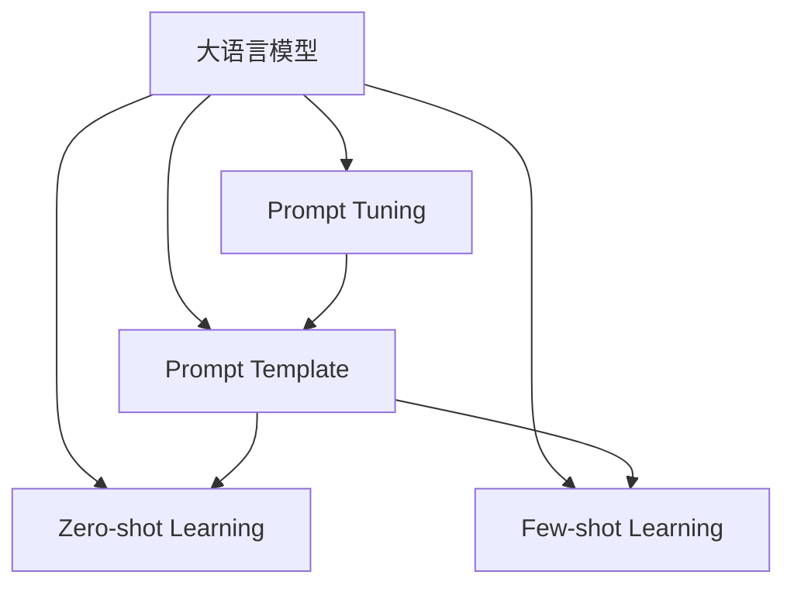

                 

# Prompt的设计与效果

## 1. 背景介绍

### 1.1 问题由来

近年来，深度学习在自然语言处理(NLP)领域取得了长足进步，特别是在预训练大模型如BERT、GPT等的基础上，微调技术大放异彩。然而，传统的微调方法存在一定的局限性，例如需要大量标注数据、微调效果受数据质量影响大等。为克服这些问题，研究者提出了一种更为灵活、高效的方法——Prompt Learning。

Prompt Learning 是一种通过精心设计的输入文本格式，引导大语言模型(LLMs)进行特定推理和生成的方法。它可以在不更新模型参数的情况下，实现零样本或少样本学习，显著降低了微调对数据的需求。Prompt设计的好坏直接影响到模型输出结果的质量，因此，如何设计有效、高效的Prompt，成为Prompt Learning研究的核心问题。

### 1.2 问题核心关键点

Prompt Learning的核心关键点包括以下几点：

1. **Prompt设计**：设计合理且能够有效引导模型输出的Prompt模板。
2. **Prompt优化**：通过自动优化技术，寻找最优Prompt模板，提升模型性能。
3. **Prompt应用**：将Prompt应用到不同类型的任务中，验证其效果。
4. **Prompt评估**：通过各种评估指标，衡量Prompt的设计效果和性能。

## 2. 核心概念与联系

### 2.1 核心概念概述

Prompt Learning的实现基于大语言模型，主要包括以下核心概念：

- **大语言模型(LLMs)**：以自回归或自编码模型为代表的大规模预训练语言模型，如BERT、GPT等。通过在大规模无标签文本语料上进行预训练，学习通用的语言表示。
- **Prompt Template**：用于引导模型进行推理和生成的输入文本格式，通常包含特定的问题或指令。
- **Zero-shot Learning**：无需任何训练样本，仅凭任务描述就能够执行新任务的能力。
- **Few-shot Learning**：使用少量标注样本进行微调，使其能够快速适应新任务。
- **Prompt Tuning**：通过自动优化技术，寻找最优的Prompt模板，提升模型性能。

这些核心概念之间的逻辑关系可以通过以下Mermaid流程图来展示：



这个流程图展示了大语言模型、Prompt Template以及Zero-shot、Few-shot Learning和Prompt Tuning之间的关系：

1. 大语言模型通过预训练获得基础能力。
2. Prompt Template用于引导模型进行推理和生成。
3. Zero-shot Learning和Few-shot Learning是Prompt Learning的应用形式，依赖Prompt Template进行。
4. Prompt Tuning通过优化Prompt Template，提升模型性能。

这些概念共同构成了Prompt Learning的基本框架，使其能够在不更新模型参数的情况下，实现高效的推理和生成。

## 3. 核心算法原理 & 具体操作步骤

### 3.1 算法原理概述

Prompt Learning的算法原理基于以下核心思想：

1. **任务定义**：将待解决的任务抽象为自然语言描述，并设计相应的Prompt Template。
2. **模型推理**：将Prompt Template输入模型，模型根据Prompt Template进行推理或生成。
3. **效果评估**：通过评估模型输出与真实结果的差距，衡量Prompt Template的设计效果。

在具体实现上，Prompt Learning通常包括以下步骤：

1. **Prompt设计**：根据任务特点设计Prompt Template。
2. **Prompt优化**：通过自动优化技术，寻找最优Prompt Template。
3. **Prompt应用**：将优化后的Prompt Template应用到模型推理或生成中。
4. **结果评估**：通过评估指标（如BLEU、F1等）衡量Prompt Template的性能。

### 3.2 算法步骤详解

Prompt Learning的算法步骤分为以下几步：

1. **任务描述**：根据具体任务定义Prompt Template，包含任务的关键信息。
2. **模型输入**：将Prompt Template作为模型的输入，进行推理或生成。
3. **结果输出**：模型根据Prompt Template生成输出结果。
4. **评估对比**：将模型输出与真实结果进行对比，通过评估指标衡量Prompt Template的效果。

具体步骤可参考以下示例：

```python
from transformers import GPT2Tokenizer, GPT2ForSequenceClassification
import torch

# 初始化模型和分词器
tokenizer = GPT2Tokenizer.from_pretrained('gpt2')
model = GPT2ForSequenceClassification.from_pretrained('gpt2')

# 定义Prompt Template
prompt = "请回答关于气候变化的问题："

# 将Prompt Template转换为模型可接受的格式
encoded_prompt = tokenizer.encode(prompt, return_tensors='pt')

# 输入Prompt Template，进行推理或生成
outputs = model(encoded_prompt)

# 输出结果
print(tokenizer.decode(outputs))
```

### 3.3 算法优缺点

Prompt Learning具有以下优点：

1. **高效性**：可以在不更新模型参数的情况下，实现推理和生成。
2. **灵活性**：可以根据不同任务设计不同的Prompt Template，适应性强。
3. **低成本**：无需大量标注数据，显著降低了微调的成本。

同时，它也存在一些缺点：

1. **依赖Prompt设计**：Prompt设计的好坏直接影响模型输出，需要大量试错。
2. **泛化能力有限**：不同Prompt Template的效果可能不稳定，难以在多种任务间通用。
3. **对抗攻击风险**：精心设计的Prompt Template可能被对抗样本攻击，导致模型失效。

### 3.4 算法应用领域

Prompt Learning在NLP领域得到了广泛应用，特别是在以下几个方面：

1. **文本分类**：通过设计特定的Prompt Template，模型能够快速分类文本。
2. **命名实体识别**：使用Prompt Template引导模型识别文本中的命名实体。
3. **情感分析**：根据Prompt Template分析文本的情感倾向。
4. **问答系统**：使用Prompt Template引导模型进行问答。
5. **对话系统**：使用Prompt Template引导模型生成对话回应。

## 4. 数学模型和公式 & 详细讲解 & 举例说明

### 4.1 数学模型构建

Prompt Learning的数学模型构建主要基于以下假设：

1. **Prompt Template**：设计一个包含任务信息的Prompt Template，记为$p$。
2. **模型推理**：模型根据Prompt Template进行推理，输出结果记为$o$。
3. **评估指标**：使用评估指标$E(o, t)$衡量模型输出的质量，其中$t$为真实结果。

数学模型可以表示为：

$$
o = f(p, \theta)
$$

其中，$f$为模型的推理函数，$\theta$为模型参数。

### 4.2 公式推导过程

Prompt Template的设计是Prompt Learning的核心。我们可以将Prompt Template视为一个特殊的输入，其效果可以通过以下步骤推导：

1. **任务定义**：根据任务定义Prompt Template，包含任务的关键信息。
2. **模型推理**：将Prompt Template输入模型，模型根据Prompt Template进行推理或生成。
3. **结果输出**：模型根据Prompt Template生成输出结果。
4. **效果评估**：将模型输出与真实结果进行对比，通过评估指标衡量Prompt Template的效果。

### 4.3 案例分析与讲解

以文本分类为例，我们可以设计如下Prompt Template：

```
"这是一篇关于[类别]的文章，请回答以下问题：

问题1：该文章主要讨论了哪些内容？

问题2：文章的主要论点是什么？"

```

这个Prompt Template包含两个问题，用于引导模型进行分类。我们将其输入到模型中，通过推理或生成得到模型输出。最后，使用BLEU等评估指标衡量Prompt Template的效果。

## 5. 项目实践：代码实例和详细解释说明

### 5.1 开发环境搭建

在进行Prompt Learning实践前，我们需要准备好开发环境。以下是使用Python进行PyTorch开发的环境配置流程：

1. 安装Anaconda：从官网下载并安装Anaconda，用于创建独立的Python环境。

2. 创建并激活虚拟环境：
```bash
conda create -n pytorch-env python=3.8 
conda activate pytorch-env
```

3. 安装PyTorch：根据CUDA版本，从官网获取对应的安装命令。例如：
```bash
conda install pytorch torchvision torchaudio cudatoolkit=11.1 -c pytorch -c conda-forge
```

4. 安装Transformers库：
```bash
pip install transformers
```

5. 安装各类工具包：
```bash
pip install numpy pandas scikit-learn matplotlib tqdm jupyter notebook ipython
```

完成上述步骤后，即可在`pytorch-env`环境中开始Prompt Learning实践。

### 5.2 源代码详细实现

这里我们以文本分类为例，给出使用Transformers库进行Prompt Learning的PyTorch代码实现。

首先，定义文本分类任务的数据处理函数：

```python
from transformers import GPT2Tokenizer
from torch.utils.data import Dataset
import torch

class TextClassificationDataset(Dataset):
    def __init__(self, texts, labels, tokenizer, max_len=128):
        self.texts = texts
        self.labels = labels
        self.tokenizer = tokenizer
        self.max_len = max_len
        
    def __len__(self):
        return len(self.texts)
    
    def __getitem__(self, item):
        text = self.texts[item]
        label = self.labels[item]
        
        encoding = self.tokenizer(text, return_tensors='pt', max_length=self.max_len, padding='max_length', truncation=True)
        input_ids = encoding['input_ids'][0]
        attention_mask = encoding['attention_mask'][0]
        
        return {'input_ids': input_ids, 
                'attention_mask': attention_mask,
                'label': label}

# 标签与id的映射
label2id = {'neg': 0, 'pos': 1}

# 创建dataset
tokenizer = GPT2Tokenizer.from_pretrained('gpt2')

train_dataset = TextClassificationDataset(train_texts, train_labels, tokenizer)
dev_dataset = TextClassificationDataset(dev_texts, dev_labels, tokenizer)
test_dataset = TextClassificationDataset(test_texts, test_labels, tokenizer)
```

然后，定义模型和优化器：

```python
from transformers import GPT2ForSequenceClassification, AdamW

model = GPT2ForSequenceClassification.from_pretrained('gpt2', num_labels=len(label2id))

optimizer = AdamW(model.parameters(), lr=2e-5)
```

接着，定义训练和评估函数：

```python
from torch.utils.data import DataLoader
from tqdm import tqdm
from sklearn.metrics import classification_report

device = torch.device('cuda') if torch.cuda.is_available() else torch.device('cpu')
model.to(device)

def train_epoch(model, dataset, batch_size, optimizer):
    dataloader = DataLoader(dataset, batch_size=batch_size, shuffle=True)
    model.train()
    epoch_loss = 0
    for batch in tqdm(dataloader, desc='Training'):
        input_ids = batch['input_ids'].to(device)
        attention_mask = batch['attention_mask'].to(device)
        labels = batch['label'].to(device)
        model.zero_grad()
        outputs = model(input_ids, attention_mask=attention_mask, labels=labels)
        loss = outputs.loss
        epoch_loss += loss.item()
        loss.backward()
        optimizer.step()
    return epoch_loss / len(dataloader)

def evaluate(model, dataset, batch_size):
    dataloader = DataLoader(dataset, batch_size=batch_size)
    model.eval()
    preds, labels = [], []
    with torch.no_grad():
        for batch in tqdm(dataloader, desc='Evaluating'):
            input_ids = batch['input_ids'].to(device)
            attention_mask = batch['attention_mask'].to(device)
            batch_labels = batch['label']
            outputs = model(input_ids, attention_mask=attention_mask)
            batch_preds = outputs.logits.argmax(dim=1).to('cpu').tolist()
            batch_labels = batch_labels.to('cpu').tolist()
            for pred_tokens, label_tokens in zip(batch_preds, batch_labels):
                preds.append(pred_tokens)
                labels.append(label_tokens)
                
    print(classification_report(labels, preds))
```

最后，启动训练流程并在测试集上评估：

```python
epochs = 5
batch_size = 16

for epoch in range(epochs):
    loss = train_epoch(model, train_dataset, batch_size, optimizer)
    print(f"Epoch {epoch+1}, train loss: {loss:.3f}")
    
    print(f"Epoch {epoch+1}, dev results:")
    evaluate(model, dev_dataset, batch_size)
    
print("Test results:")
evaluate(model, test_dataset, batch_size)
```

以上就是使用PyTorch对GPT2进行文本分类任务Prompt Learning的完整代码实现。可以看到，得益于Transformers库的强大封装，我们可以用相对简洁的代码完成Prompt Learning的开发。

### 5.3 代码解读与分析

让我们再详细解读一下关键代码的实现细节：

**TextClassificationDataset类**：
- `__init__`方法：初始化文本、标签、分词器等关键组件。
- `__len__`方法：返回数据集的样本数量。
- `__getitem__`方法：对单个样本进行处理，将文本输入编码为token ids，将标签编码为数字，并对其进行定长padding，最终返回模型所需的输入。

**label2id字典**：
- 定义了标签与数字id之间的映射关系，用于将token-wise的预测结果解码回真实的标签。

**训练和评估函数**：
- 使用PyTorch的DataLoader对数据集进行批次化加载，供模型训练和推理使用。
- 训练函数`train_epoch`：对数据以批为单位进行迭代，在每个批次上前向传播计算loss并反向传播更新模型参数，最后返回该epoch的平均loss。
- 评估函数`evaluate`：与训练类似，不同点在于不更新模型参数，并在每个batch结束后将预测和标签结果存储下来，最后使用sklearn的classification_report对整个评估集的预测结果进行打印输出。

**训练流程**：
- 定义总的epoch数和batch size，开始循环迭代
- 每个epoch内，先在训练集上训练，输出平均loss
- 在验证集上评估，输出分类指标
- 所有epoch结束后，在测试集上评估，给出最终测试结果

可以看到，PyTorch配合Transformers库使得Prompt Learning的代码实现变得简洁高效。开发者可以将更多精力放在数据处理、模型改进等高层逻辑上，而不必过多关注底层的实现细节。

当然，工业级的系统实现还需考虑更多因素，如模型的保存和部署、超参数的自动搜索、更灵活的任务适配层等。但核心的Prompt Learning范式基本与此类似。

## 6. 实际应用场景

### 6.1 智能客服系统

Prompt Learning在大语言模型的智能客服系统中有着广泛的应用。智能客服系统通常需要处理大量的客户咨询，而使用Prompt Learning，可以大大提高系统对客户咨询的理解能力和响应速度。

在技术实现上，可以收集企业内部的历史客服对话记录，将问题和最佳答复构建成监督数据，在此基础上对预训练模型进行微调。微调后的模型能够自动理解客户意图，匹配最合适的答案模板进行回复。对于客户提出的新问题，还可以接入检索系统实时搜索相关内容，动态组织生成回答。如此构建的智能客服系统，能大幅提升客户咨询体验和问题解决效率。

### 6.2 金融舆情监测

Prompt Learning在金融舆情监测中也有着重要的应用。金融机构需要实时监测市场舆论动向，以便及时应对负面信息传播，规避金融风险。

具体而言，可以收集金融领域相关的新闻、报道、评论等文本数据，并对其进行主题标注和情感标注。在此基础上对预训练语言模型进行微调，使其能够自动判断文本属于何种主题，情感倾向是正面、中性还是负面。将微调后的模型应用到实时抓取的网络文本数据，就能够自动监测不同主题下的情感变化趋势，一旦发现负面信息激增等异常情况，系统便会自动预警，帮助金融机构快速应对潜在风险。

### 6.3 个性化推荐系统

Prompt Learning在个性化推荐系统中也有着广泛的应用。当前的推荐系统往往只依赖用户的历史行为数据进行物品推荐，无法深入理解用户的真实兴趣偏好。

在实践中，可以收集用户浏览、点击、评论、分享等行为数据，提取和用户交互的物品标题、描述、标签等文本内容。将文本内容作为模型输入，用户的后续行为（如是否点击、购买等）作为监督信号，在此基础上微调预训练语言模型。微调后的模型能够从文本内容中准确把握用户的兴趣点。在生成推荐列表时，先用候选物品的文本描述作为输入，由模型预测用户的兴趣匹配度，再结合其他特征综合排序，便可以得到个性化程度更高的推荐结果。

### 6.4 未来应用展望

随着Prompt Learning和大语言模型微调技术的不断发展，其应用领域将不断拓展，为更多行业带来变革性影响。

在智慧医疗领域，Prompt Learning可应用于医疗问答、病历分析、药物研发等应用，提升医疗服务的智能化水平，辅助医生诊疗，加速新药开发进程。

在智能教育领域，Prompt Learning可应用于作业批改、学情分析、知识推荐等方面，因材施教，促进教育公平，提高教学质量。

在智慧城市治理中，Prompt Learning可应用于城市事件监测、舆情分析、应急指挥等环节，提高城市管理的自动化和智能化水平，构建更安全、高效的未来城市。

此外，在企业生产、社会治理、文娱传媒等众多领域，Prompt Learning也将不断涌现，为经济社会发展注入新的动力。相信随着技术的日益成熟，Prompt Learning技术将成为人工智能落地应用的重要范式，推动人工智能技术在垂直行业的规模化落地。

## 7. 工具和资源推荐

### 7.1 学习资源推荐

为了帮助开发者系统掌握Prompt Learning的理论基础和实践技巧，这里推荐一些优质的学习资源：

1. 《Prompt Engineering: A Survey and Taxonomy》：一篇综述性文章，介绍了Prompt Learning的主要概念、应用和研究方向。
2. 《Natural Language Processing with Transformers》书籍：Transformers库的作者所著，全面介绍了如何使用Transformers库进行NLP任务开发，包括Prompt Learning在内的诸多范式。
3. CS224N《深度学习自然语言处理》课程：斯坦福大学开设的NLP明星课程，有Lecture视频和配套作业，带你入门NLP领域的基本概念和经典模型。
4. HuggingFace官方文档：Transformers库的官方文档，提供了海量预训练模型和完整的Prompt Learning样例代码，是上手实践的必备资料。
5. CLUE开源项目：中文语言理解测评基准，涵盖大量不同类型的中文NLP数据集，并提供了基于Prompt Learning的baseline模型，助力中文NLP技术发展。

通过对这些资源的学习实践，相信你一定能够快速掌握Prompt Learning的精髓，并用于解决实际的NLP问题。

### 7.2 开发工具推荐

高效的开发离不开优秀的工具支持。以下是几款用于Prompt Learning开发的常用工具：

1. PyTorch：基于Python的开源深度学习框架，灵活动态的计算图，适合快速迭代研究。大部分预训练语言模型都有PyTorch版本的实现。
2. TensorFlow：由Google主导开发的开源深度学习框架，生产部署方便，适合大规模工程应用。同样有丰富的预训练语言模型资源。
3. Transformers库：HuggingFace开发的NLP工具库，集成了众多SOTA语言模型，支持PyTorch和TensorFlow，是进行Prompt Learning开发的利器。
4. Weights & Biases：模型训练的实验跟踪工具，可以记录和可视化模型训练过程中的各项指标，方便对比和调优。与主流深度学习框架无缝集成。
5. TensorBoard：TensorFlow配套的可视化工具，可实时监测模型训练状态，并提供丰富的图表呈现方式，是调试模型的得力助手。
6. Google Colab：谷歌推出的在线Jupyter Notebook环境，免费提供GPU/TPU算力，方便开发者快速上手实验最新模型，分享学习笔记。

合理利用这些工具，可以显著提升Prompt Learning任务的开发效率，加快创新迭代的步伐。

### 7.3 相关论文推荐

Prompt Learning的研究源于学界的持续研究。以下是几篇奠基性的相关论文，推荐阅读：

1. Few-Shot Learning of Similar Meaning Representations for Unsupervised Zero-Shot Question Answering（2020）：提出了Prompt Tuning方法，通过调整Prompt Template的参数，提升模型在零样本和少样本学习中的性能。
2. A Survey on Improving Few-shot Learning with Prompts and Pre-trained Models（2022）：综述了各种Prompt Tuning方法，包括自监督、对抗样本等，提供了丰富的技术参考。
3. Reducing Zero-shot Prompts for Pre-trained Models（2021）：提出了一种基于对抗样本的Prompt Tuning方法，通过生成对抗样本，提升模型在零样本学习中的效果。
4. Leveraging Pre-trained Models for Conversational AI through Free-form Prompt Engineering（2020）：介绍了Prompt Engineering在对话系统中的应用，展示了通过自由形式Prompt设计，提升对话系统效果的方法。

这些论文代表了大语言模型微调技术的发展脉络。通过学习这些前沿成果，可以帮助研究者把握学科前进方向，激发更多的创新灵感。

## 8. 总结：未来发展趋势与挑战

### 8.1 总结

本文对Prompt Learning方法进行了全面系统的介绍。首先阐述了Prompt Learning的研究背景和意义，明确了Prompt Learning在降低微调成本、提升模型性能方面的独特价值。其次，从原理到实践，详细讲解了Prompt Learning的数学原理和关键步骤，给出了Prompt Learning任务开发的完整代码实例。同时，本文还广泛探讨了Prompt Learning方法在智能客服、金融舆情、个性化推荐等多个行业领域的应用前景，展示了Prompt Learning范式的巨大潜力。此外，本文精选了Prompt Learning技术的各类学习资源，力求为读者提供全方位的技术指引。

通过本文的系统梳理，可以看到，Prompt Learning方法在大语言模型微调中的应用前景广阔，特别适用于需要高效、低成本微调的场景。Prompt Learning的优势在于其灵活性、高效性和低成本，而面临的挑战在于Prompt设计的好坏直接影响到模型输出效果，需要大量试错和优化。

### 8.2 未来发展趋势

展望未来，Prompt Learning技术将呈现以下几个发展趋势：

1. **高效性**：随着优化算法的发展，Prompt Tuning方法将更加高效，能够在更少的Prompt Template上实现最佳性能。
2. **多样性**：不同类型的Prompt Template将广泛应用于各种任务中，提升模型的适应性和泛化能力。
3. **自动化**：自动化Prompt Tuning方法将逐渐普及，降低人工设计和调优的复杂度。
4. **迁移性**：Prompt Learning技术将在跨领域迁移中发挥更大作用，通过跨领域数据微调，提升模型的通用性和泛化能力。
5. **安全性**：Prompt Learning技术将更加注重安全性，避免有害Prompt导致的模型误导性输出。

以上趋势凸显了Prompt Learning技术的广阔前景。这些方向的探索发展，必将进一步提升Prompt Learning在NLP任务中的性能和应用范围，为人工智能技术落地应用提供新的突破。

### 8.3 面临的挑战

尽管Prompt Learning技术已经取得了长足进步，但在迈向更加智能化、普适化应用的过程中，它仍面临着诸多挑战：

1. **Prompt设计复杂性**：设计合适的Prompt Template是一项复杂的工作，需要大量试错和优化。
2. **泛化能力不足**：不同类型的Prompt Template效果不稳定，难以在多种任务间通用。
3. **对抗攻击风险**：精心设计的Prompt Template可能被对抗样本攻击，导致模型失效。
4. **安全性风险**：有害Prompt可能导致模型输出误导性信息，带来安全隐患。
5. **模型鲁棒性不足**：Prompt Template的效果受输入文本的影响，模型鲁棒性有待提高。

正视Prompt Learning面临的这些挑战，积极应对并寻求突破，将是Prompt Learning技术迈向成熟的必由之路。相信随着学界和产业界的共同努力，这些挑战终将一一被克服，Prompt Learning技术必将在构建人机协同的智能时代中扮演越来越重要的角色。

### 8.4 研究展望

面对Prompt Learning技术面临的挑战，未来的研究需要在以下几个方面寻求新的突破：

1. **自动化Prompt设计**：开发更加智能的Prompt Tuning方法，减少人工干预，提升设计效率。
2. **迁移性增强**：通过跨领域数据微调，提升Prompt Template的迁移能力，增强模型的泛化性。
3. **安全性保障**：设计更为安全的Prompt Template，避免有害Prompt导致的模型误导性输出。
4. **鲁棒性提升**：提升Prompt Template对输入文本的鲁棒性，增强模型在不同文本上的表现。

这些研究方向的探索，必将引领Prompt Learning技术迈向更高的台阶，为构建安全、可靠、可解释、可控的智能系统铺平道路。面向未来，Prompt Learning技术还需要与其他人工智能技术进行更深入的融合，如知识表示、因果推理、强化学习等，多路径协同发力，共同推动自然语言理解和智能交互系统的进步。只有勇于创新、敢于突破，才能不断拓展Prompt Learning的边界，让智能技术更好地造福人类社会。

## 9. 附录：常见问题与解答

**Q1：Prompt Learning和微调方法有什么区别？**

A: Prompt Learning和微调方法的区别在于，Prompt Learning不需要更新模型参数，而是通过设计合理的Prompt Template，直接对模型进行推理或生成。而微调方法需要更新模型参数，通过有监督学习优化模型在特定任务上的性能。Prompt Learning更适用于低成本、高灵活性的场景，而微调方法则适用于需要更精确性能的高级任务。

**Q2：如何设计有效的Prompt Template？**

A: 设计有效的Prompt Template需要考虑以下几点：
1. **任务相关性**：Prompt Template应包含任务的关键信息，引导模型理解任务。
2. **信息冗余**：避免信息过载，确保模型能够有效处理。
3. **形式多样**：设计多样化的Prompt Template，选择最佳效果。
4. **测试验证**：通过测试和验证，评估Prompt Template的效果。

**Q3：如何衡量Prompt Template的效果？**

A: 衡量Prompt Template的效果可以使用多种评估指标，如BLEU、F1、ROUGE等。具体选择哪种指标，取决于任务的特点和评估需求。

**Q4：Prompt Learning是否适用于所有NLP任务？**

A: Prompt Learning在大多数NLP任务上都能取得不错的效果，特别是对于数据量较小的任务。但对于一些特定领域的任务，如医学、法律等，仅依靠通用语料预训练的模型可能难以很好地适应。此时需要在特定领域语料上进一步预训练，再进行Prompt Learning，才能获得理想效果。

**Q5：Prompt Learning是否需要大量的标注数据？**

A: Prompt Learning的优势在于其低成本、高效性，无需大量标注数据。只需通过精心设计的Prompt Template，即可实现高效的推理和生成。

综上所述，Prompt Learning是一种灵活、高效的大语言模型微调方法，具有广泛的应用前景。通过对Prompt Template的设计和优化，可以显著提升模型的性能和泛化能力，带来全新的应用场景。未来，Prompt Learning技术将继续引领NLP技术的发展方向，为人工智能技术的落地应用提供新的突破。

