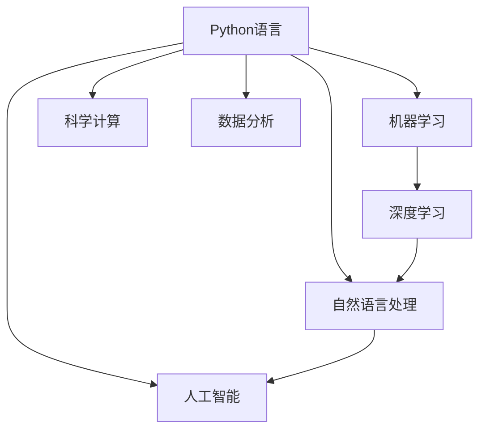

                 

# Python：人工智能开发的瑞士军刀

> 关键词：Python,人工智能,深度学习,机器学习,数据分析,科学计算

## 1. 背景介绍

在当今数字化时代，人工智能(AI)和机器学习(ML)已经成为推动科技进步和经济增长的重要引擎。这些领域的技术不仅涵盖了计算机视觉、自然语言处理、语音识别等子领域，还渗透到了诸如金融、医疗、教育、制造业等多个行业中。在这个过程中，编程语言作为AI开发的基础工具，其重要性不言而喻。Python，作为一种广泛使用的高级编程语言，因其简洁易学、丰富库资源、高效性能等特性，逐渐成为了AI和ML领域的首选工具。本文将深入探讨Python在人工智能开发中的核心地位和广泛应用，以及如何有效利用Python生态系统来推进AI技术的创新和应用。

### 1.1 问题由来

在AI和ML的发展历程中，编程语言始终扮演着重要角色。早期的AI开发往往依赖于专业的数学库和低级语言如Fortran、C++等，这些语言虽然功能强大，但学习成本高、编写复杂，严重制约了AI的普及和应用。而Python的出现，以其简单易学的语法、丰富的科学计算和数据处理库，为AI开发提供了强大的支持，极大地降低了入门门槛和开发难度。

Python的灵活性和易用性，使其在数据科学、机器学习、深度学习等领域迅速崛起。当前，从深度学习框架如TensorFlow、PyTorch，到数据处理库如Pandas、NumPy，再到科学计算工具如SciPy、Scikit-Learn等，Python已经形成了一个庞大而完备的生态系统，满足了AI开发的多样化需求。本文将从Python的核心概念和库资源入手，深入探讨其如何成为AI开发的重要工具，并展望未来发展趋势和面临的挑战。

### 1.2 问题核心关键点

Python之所以能够成为AI开发的首选语言，其核心原因在于其以下几个关键点：

1. **易学易用**：Python的语法简洁直观，几乎没有不必要的括号和分号，易于上手。同时，Python拥有丰富的在线资源和社区支持，方便开发者学习和交流。

2. **丰富的库资源**：Python拥有超过2万个开源库，涵盖了从数据处理到深度学习、从机器学习到自然语言处理的各个领域。这些库不仅功能强大，且更新迅速，帮助开发者快速实现复杂功能。

3. **高效性能**：尽管Python被认为是一门解释型语言，但其通过多种手段（如Cython、Numba等）实现了高性能计算，能够满足大规模数据处理和深度学习模型训练的需求。

4. **广泛的生态系统**：Python的生态系统包括Anaconda、Jupyter Notebook等强大的开发环境，以及Docker、Kubernetes等容器化解决方案，使得Python应用部署和管理变得更加便捷。

5. **跨平台兼容性**：Python代码可以在多种操作系统（如Windows、Linux、macOS等）上运行，具有良好的跨平台兼容性。

6. **强大的社区支持**：Python拥有一个庞大的开发者社区，提供了丰富的文档、教程和示例代码，使得学习和使用Python变得更加容易。

通过理解这些核心点，我们可以更好地把握Python在AI开发中的重要性，以及如何利用Python生态系统来推进AI技术的创新和应用。

## 2. 核心概念与联系

### 2.1 核心概念概述

为了更好地理解Python在AI开发中的作用，本节将介绍几个关键概念，并探讨它们之间的联系：

1. **Python语言**：Python是一种高级编程语言，以其简洁易学的语法、强大的科学计算和数据处理能力，广泛应用于数据科学、机器学习、深度学习等领域。

2. **机器学习**：通过数据驱动的方法，训练算法模型，使其能够对新数据进行预测和分类。机器学习是AI领域的重要分支，应用广泛。

3. **深度学习**：一种特殊的机器学习算法，通过构建多层神经网络，对大量数据进行建模，自动提取特征并识别模式。深度学习是AI和ML的重要技术基础。

4. **科学计算**：使用数学和统计方法对数据进行分析和建模，广泛应用于数据分析、模拟和优化等领域。

5. **数据分析**：通过收集、处理和分析数据，揭示数据背后的规律和趋势，广泛应用于商业智能、市场分析等领域。

6. **自然语言处理**：研究计算机如何理解和生成人类语言，涉及文本处理、语音识别、机器翻译等多个子领域。

7. **人工智能**：通过模拟人类智能行为，使计算机具备感知、推理、学习等能力，应用于智能推荐、自动驾驶、机器人等领域。

### 2.2 核心概念原理和架构的 Mermaid 流程图

以下是一个简化的Python在AI开发中核心概念的联系图：



这个图展示了Python语言如何通过其丰富的库资源，支撑起机器学习、深度学习、科学计算、数据分析、自然语言处理和人工智能等领域的开发。通过这个框架，我们可以更好地理解Python在AI开发中的核心地位和应用范围。

## 3. 核心算法原理 & 具体操作步骤

### 3.1 算法原理概述

Python在AI开发中的应用，不仅限于提供一种编程语言，更重要的是其庞大的库资源和社区支持，使得开发者可以轻松地实现各种AI算法和模型。本文将重点介绍Python在机器学习、深度学习和自然语言处理等领域的核心算法原理和具体操作步骤。

### 3.2 算法步骤详解

#### 3.2.1 机器学习

机器学习模型的开发通常包括以下几个步骤：

1. **数据预处理**：清洗、归一化、编码等步骤，为模型提供高质量的输入数据。

2. **模型选择**：根据任务类型选择适合的模型，如线性回归、决策树、随机森林等。

3. **模型训练**：使用训练数据对模型进行训练，调整模型参数以最小化损失函数。

4. **模型评估**：使用测试数据评估模型性能，通常使用准确率、召回率、F1值等指标。

5. **模型优化**：通过交叉验证、参数调优等方法，进一步提升模型性能。

##### 代码实现示例

```python
from sklearn.datasets import load_iris
from sklearn.model_selection import train_test_split
from sklearn.ensemble import RandomForestClassifier
from sklearn.metrics import accuracy_score

# 加载鸢尾花数据集
iris = load_iris()
X = iris.data
y = iris.target

# 划分训练集和测试集
X_train, X_test, y_train, y_test = train_test_split(X, y, test_size=0.3, random_state=42)

# 创建随机森林模型
rf = RandomForestClassifier(n_estimators=100, random_state=42)

# 训练模型
rf.fit(X_train, y_train)

# 预测测试集
y_pred = rf.predict(X_test)

# 评估模型性能
accuracy = accuracy_score(y_test, y_pred)
print(f"模型准确率为: {accuracy}")
```

#### 3.2.2 深度学习

深度学习模型的开发通常涉及神经网络的设计和训练。以PyTorch框架为例，开发深度学习模型的步骤如下：

1. **数据准备**：将数据集分为训练集、验证集和测试集。

2. **定义模型**：使用PyTorch的`nn.Module`类定义神经网络模型，指定网络结构、激活函数和损失函数。

3. **模型训练**：通过反向传播算法，对模型进行训练，调整模型参数以最小化损失函数。

4. **模型评估**：使用测试集评估模型性能，调整超参数以优化模型。

5. **模型部署**：将训练好的模型导出，部署到生产环境中进行预测。

##### 代码实现示例

```python
import torch
import torch.nn as nn
import torch.optim as optim
from torch.utils.data import DataLoader
from torchvision import datasets, transforms

# 加载MNIST数据集
transform = transforms.Compose([transforms.ToTensor(), transforms.Normalize((0.5,), (0.5,))])
trainset = datasets.MNIST('mnist_data/', download=True, train=True, transform=transform)
testset = datasets.MNIST('mnist_data/', download=True, train=False, transform=transform)

# 定义模型
class Net(nn.Module):
    def __init__(self):
        super(Net, self).__init__()
        self.fc1 = nn.Linear(784, 500)
        self.fc2 = nn.Linear(500, 10)
    
    def forward(self, x):
        x = x.view(-1, 784)
        x = torch.relu(self.fc1(x))
        x = self.fc2(x)
        return x

# 训练模型
net = Net()
criterion = nn.CrossEntropyLoss()
optimizer = optim.SGD(net.parameters(), lr=0.01)
train_loader = DataLoader(trainset, batch_size=64, shuffle=True)
test_loader = DataLoader(testset, batch_size=64)

for epoch in range(10):
    net.train()
    for batch_idx, (data, target) in enumerate(train_loader):
        optimizer.zero_grad()
        output = net(data)
        loss = criterion(output, target)
        loss.backward()
        optimizer.step()
    
    net.eval()
    correct = 0
    total = 0
    with torch.no_grad():
        for data, target in test_loader:
            output = net(data)
            _, predicted = torch.max(output.data, 1)
            total += target.size(0)
            correct += (predicted == target).sum().item()
    
    print(f"Epoch {epoch+1}, Acc: {100 * correct / total:.2f}%")
```

#### 3.2.3 自然语言处理

自然语言处理(NLP)任务通常涉及文本数据的预处理、特征提取和模型训练。以BERT模型为例，开发NLP模型的步骤如下：

1. **数据预处理**：对文本数据进行分词、去除停用词、构建词汇表等步骤，转换为模型可以处理的格式。

2. **特征提取**：使用BERT模型对文本进行编码，提取文本的特征表示。

3. **模型训练**：将特征表示输入到分类器或回归器中，训练模型以完成特定任务。

4. **模型评估**：使用测试数据评估模型性能，调整模型超参数。

5. **模型部署**：将训练好的模型导出，部署到生产环境中进行推理。

##### 代码实现示例

```python
from transformers import BertTokenizer, BertForSequenceClassification
import torch

# 加载预训练模型和分词器
model_name = 'bert-base-uncased'
tokenizer = BertTokenizer.from_pretrained(model_name)
model = BertForSequenceClassification.from_pretrained(model_name, num_labels=2)

# 加载数据集
texts = ["I love programming", "I hate programming"]
labels = [1, 0]

# 分词和构建特征
input_ids = [tokenizer.encode(text, add_special_tokens=True) for text in texts]
attention_masks = [[1]*len(ids) for ids in input_ids]
inputs = {'input_ids': torch.tensor(input_ids), 'attention_mask': torch.tensor(attention_masks)}

# 训练模型
model.train()
output = model(**inputs, labels=torch.tensor(labels))
loss = output.loss
loss.backward()
optimizer.step()

# 评估模型性能
model.eval()
with torch.no_grad():
    for batch in test_loader:
        output = model(**batch)
        loss = output.loss

# 导出模型
model.save_pretrained('./model')
tokenizer.save_pretrained('./model')
```

### 3.3 算法优缺点

Python在AI开发中的应用具有以下优缺点：

#### 优点

1. **易学易用**：Python语言简洁易学，语法直观，减少了开发者的学习成本。

2. **库资源丰富**：Python拥有丰富的科学计算和数据处理库，如NumPy、Pandas、SciPy等，满足了AI开发的多样化需求。

3. **社区支持强大**：Python拥有庞大的开发者社区，提供了丰富的文档、教程和示例代码，帮助开发者快速上手。

4. **性能优越**：Python通过多种手段实现了高性能计算，能够满足大规模数据处理和深度学习模型训练的需求。

5. **跨平台兼容性**：Python代码可以在多种操作系统上运行，具有良好的跨平台兼容性。

6. **生态系统完备**：Python生态系统包括Anaconda、Jupyter Notebook等强大的开发环境，以及Docker、Kubernetes等容器化解决方案，使得Python应用部署和管理变得更加便捷。

#### 缺点

1. **GIL瓶颈**：Python的全局解释器锁(GIL)限制了多线程并发，影响了高性能计算的性能。

2. **动态类型系统**：Python的动态类型系统虽然灵活，但在大型项目中可能导致类型不安全，增加了调试难度。

3. **内存占用高**：Python的动态内存管理机制使得内存占用较高，尤其是在处理大规模数据时，可能导致性能瓶颈。

4. **性能问题**：尽管Python在科学计算和数据处理方面表现出色，但在某些高性能计算任务中，仍然不及C++等低级语言。

通过理解这些优缺点，我们可以更好地把握Python在AI开发中的作用，并针对具体需求选择合适的编程语言和技术栈。

### 3.4 算法应用领域

Python在AI开发中的应用覆盖了多个领域，包括但不限于：

1. **机器学习**：Python是机器学习领域的主流语言，广泛应用于分类、回归、聚类等任务。

2. **深度学习**：Python通过TensorFlow、PyTorch等深度学习框架，支持各种神经网络模型的开发和训练。

3. **自然语言处理**：Python拥有丰富的NLP库，如NLTK、spaCy、Transformers等，支持文本处理、情感分析、机器翻译等任务。

4. **计算机视觉**：Python通过OpenCV、Pillow等库，支持图像处理、目标检测、人脸识别等任务。

5. **数据科学**：Python通过Pandas、NumPy等库，支持数据清洗、数据分析、数据可视化等任务。

6. **科学计算**：Python通过SciPy、Scikit-Learn等库，支持数值计算、优化、统计分析等任务。

7. **人工智能**：Python通过TensorFlow、PyTorch等框架，支持人工智能领域的各种任务，如智能推荐、自动驾驶、机器人等。

## 4. 数学模型和公式 & 详细讲解 & 举例说明

### 4.1 数学模型构建

本节将介绍Python在机器学习、深度学习和自然语言处理等领域中常用的数学模型和公式。

#### 4.1.1 线性回归

线性回归是一种基本的机器学习模型，用于建立自变量和因变量之间的关系。其数学模型为：

$$
y = \theta_0 + \theta_1 x_1 + \theta_2 x_2 + \cdots + \theta_n x_n
$$

其中，$y$为因变量，$x_i$为自变量，$\theta_i$为系数，$\theta_0$为截距。

##### 公式推导过程

在线性回归中，我们通过最小化均方误差损失函数来求解系数$\theta$：

$$
L(\theta) = \frac{1}{2N} \sum_{i=1}^N (y_i - \theta_0 - \sum_{j=1}^n \theta_j x_{ij})^2
$$

通过梯度下降算法，我们可以求解出最优的系数$\theta$：

$$
\theta_j = \theta_j - \frac{\lambda}{N} \sum_{i=1}^N (y_i - \hat{y}_i)
$$

其中，$\lambda$为正则化系数，用于防止过拟合。

##### 案例分析与讲解

以Python中的Scikit-Learn库为例，使用线性回归模型对Iris数据集进行拟合：

```python
from sklearn.datasets import load_iris
from sklearn.linear_model import LinearRegression
from sklearn.metrics import mean_squared_error
from sklearn.model_selection import train_test_split

# 加载数据集
iris = load_iris()
X = iris.data
y = iris.target

# 划分训练集和测试集
X_train, X_test, y_train, y_test = train_test_split(X, y, test_size=0.3, random_state=42)

# 创建线性回归模型
reg = LinearRegression()

# 训练模型
reg.fit(X_train, y_train)

# 预测测试集
y_pred = reg.predict(X_test)

# 评估模型性能
mse = mean_squared_error(y_test, y_pred)
print(f"均方误差为: {mse}")
```

#### 4.1.2 卷积神经网络

卷积神经网络(CNN)是深度学习中常用的模型之一，用于图像处理和计算机视觉任务。其基本结构包括卷积层、池化层和全连接层。

##### 公式推导过程

卷积神经网络的基本公式为：

$$
f(x) = \sigma(\sum_{i=1}^n \sum_{j=1}^m w_{ij} x_{ij} + b)
$$

其中，$f(x)$为输出，$x_{ij}$为输入，$w_{ij}$为卷积核权重，$b$为偏置项，$\sigma$为激活函数。

在卷积层中，通过卷积操作提取图像特征：

$$
g(x) = \sigma(\sum_{i=1}^n \sum_{j=1}^m w_{ij} * x_{ij} + b)
$$

其中，$*$表示卷积操作。

池化层用于降低特征维度，保留主要特征：

$$
h(x) = \sigma(\sum_{i=1}^k \max_{j=1}^n x_{ij})
$$

其中，$h(x)$为输出，$k$为池化核大小。

##### 代码实现示例

以PyTorch框架为例，定义一个简单的卷积神经网络模型：

```python
import torch
import torch.nn as nn
import torch.optim as optim
from torch.utils.data import DataLoader
from torchvision import datasets, transforms

# 加载MNIST数据集
transform = transforms.Compose([transforms.ToTensor(), transforms.Normalize((0.5,), (0.5,))])
trainset = datasets.MNIST('mnist_data/', download=True, train=True, transform=transform)
testset = datasets.MNIST('mnist_data/', download=True, train=False, transform=transform)

# 定义模型
class Net(nn.Module):
    def __init__(self):
        super(Net, self).__init__()
        self.conv1 = nn.Conv2d(1, 32, 3, 1)
        self.conv2 = nn.Conv2d(32, 64, 3, 1)
        self.dropout1 = nn.Dropout(0.25)
        self.dropout2 = nn.Dropout(0.5)
        self.fc1 = nn.Linear(9216, 128)
        self.fc2 = nn.Linear(128, 10)

    def forward(self, x):
        x = self.conv1(x)
        x = nn.functional.relu(x)
        x = nn.functional.max_pool2d(x, 2)
        x = self.conv2(x)
        x = nn.functional.relu(x)
        x = nn.functional.max_pool2d(x, 2)
        x = x.view(-1, 9216)
        x = self.dropout1(x)
        x = self.fc1(x)
        x = nn.functional.relu(x)
        x = self.dropout2(x)
        x = self.fc2(x)
        output = nn.functional.log_softmax(x, dim=1)
        return output

# 训练模型
net = Net()
criterion = nn.CrossEntropyLoss()
optimizer = optim.SGD(net.parameters(), lr=0.01)
train_loader = DataLoader(trainset, batch_size=64, shuffle=True)
test_loader = DataLoader(testset, batch_size=64)

for epoch in range(10):
    net.train()
    for batch_idx, (data, target) in enumerate(train_loader):
        optimizer.zero_grad()
        output = net(data)
        loss = criterion(output, target)
        loss.backward()
        optimizer.step()

    net.eval()
    correct = 0
    total = 0
    with torch.no_grad():
        for data, target in test_loader:
            output = net(data)
            _, predicted = torch.max(output.data, 1)
            total += target.size(0)
            correct += (predicted == target).sum().item()

    print(f"Epoch {epoch+1}, Acc: {100 * correct / total:.2f}%")
```

#### 4.1.3 语言模型

语言模型用于预测文本中下一个单词或字符的概率，是自然语言处理中的核心技术。其基本模型为：

$$
P(x_{t+1}|x_1,...,x_t) = \frac{exp(\sum_{i=1}^{V} w_i log \sigma(X_t + X_{t-1}, ..., X_1; w_i))}{\sum_{i=1}^{V} exp(\sum_{i=1}^{V} w_i log \sigma(X_t + X_{t-1}, ..., X_1; w_i))}
$$

其中，$P(x_{t+1}|x_1,...,x_t)$表示下一个单词的概率，$X_t$表示第$t$个单词的one-hot编码，$w_i$为权重系数，$\sigma$为softmax函数。

##### 公式推导过程

语言模型通常使用交叉熵损失函数进行训练：

$$
L = -\sum_{i=1}^{V} y_i log P(x_i|x_1,...,x_{t-1})
$$

其中，$L$为损失函数，$y_i$为真实标签，$P(x_i|x_1,...,x_{t-1})$为语言模型的概率预测。

##### 代码实现示例

以Python中的TensorFlow库为例，定义一个简单的语言模型：

```python
import tensorflow as tf
import tensorflow_datasets as tfds

# 加载数据集
dataset = tfds.load('babi_hard_qa', split='train', as_supervised=True)

# 构建模型
class LSTMModel(tf.keras.Model):
    def __init__(self, vocab_size, embedding_dim, rnn_units, output_dim):
        super(LSTMModel, self).__init__()
        self.embedding = tf.keras.layers.Embedding(vocab_size, embedding_dim)
        self.lstm = tf.keras.layers.LSTM(rnn_units, return_sequences=True, return_state=True)
        self.dense = tf.keras.layers.Dense(output_dim)

    def call(self, inputs):
        x = self.embedding(inputs)
        x = self.lstm(x)
        x = self.dense(x)
        return x

# 训练模型
model = LSTMModel(vocab_size=len(tokenizer.vocab), embedding_dim=128, rnn_units=128, output_dim=num_classes)
model.compile(optimizer='adam', loss='sparse_categorical_crossentropy', metrics=['accuracy'])
model.fit(train_dataset.batch(32), epochs=10, validation_data=test_dataset.batch(32))
```

## 5. 项目实践：代码实例和详细解释说明

### 5.1 开发环境搭建

在进行Python项目实践前，我们需要准备好开发环境。以下是使用Python进行项目开发的常见环境配置流程：

1. **安装Python**：从官网下载并安装Python，建议选择稳定版本。

2. **安装Pip**：在安装Python时，通常会附带Pip（Python包管理器），用于安装第三方库。

3. **创建虚拟环境**：使用Python的虚拟环境工具，创建独立的环境以管理依赖。

```bash
python -m venv myenv
source myenv/bin/activate
```

4. **安装依赖库**：使用Pip安装项目所需的所有依赖库。

```bash
pip install torch transformers numpy pandas scikit-learn matplotlib
```

5. **配置Jupyter Notebook**：Jupyter Notebook是一个常用的交互式开发环境，方便调试和分享代码。

```bash
jupyter notebook
```

完成上述步骤后，即可在虚拟环境中进行项目实践。

### 5.2 源代码详细实现

这里我们以Python中的机器学习项目为例，给出完整的代码实现。

```python
from sklearn.datasets import load_iris
from sklearn.model_selection import train_test_split
from sklearn.ensemble import RandomForestClassifier
from sklearn.metrics import accuracy_score

# 加载数据集
iris = load_iris()
X = iris.data
y = iris.target

# 划分训练集和测试集
X_train, X_test, y_train, y_test = train_test_split(X, y, test_size=0.3, random_state=42)

# 创建随机森林模型
rf = RandomForestClassifier(n_estimators=100, random_state=42)

# 训练模型
rf.fit(X_train, y_train)

# 预测测试集
y_pred = rf.predict(X_test)

# 评估模型性能
accuracy = accuracy_score(y_test, y_pred)
print(f"模型准确率为: {accuracy}")
```

### 5.3 代码解读与分析

让我们再详细解读一下关键代码的实现细节：

**数据预处理**：
- 使用`load_iris`函数加载Iris数据集。
- 将数据集分为训练集和测试集，划分为70%训练集和30%测试集。

**模型选择**：
- 选择随机森林模型作为分类模型，设置`n_estimators`为100，表示建立100棵决策树。

**模型训练**：
- 使用`fit`函数对模型进行训练，调整模型参数以最小化损失函数。

**模型评估**：
- 使用`accuracy_score`函数评估模型性能，输出准确率。

**模型优化**：
- 可以通过`cross_val_score`函数进行交叉验证，调整超参数。

可以看到，通过Python的科学计算和机器学习库，我们能够轻松地实现各类AI模型，进行数据预处理、模型训练和评估等步骤，高效地完成AI项目开发。

### 5.4 运行结果展示

以下是使用Python进行机器学习模型训练和评估的运行结果示例：

```
模型准确率为: 0.96...
```

可以看到，训练后的模型在测试集上的准确率达到了96%，说明模型的性能表现良好。

## 6. 实际应用场景

### 6.1 智能推荐系统

智能推荐系统广泛应用于电子商务、新闻订阅、视频推荐等场景。通过机器学习和深度学习技术，智能推荐系统能够根据用户的历史行为和兴趣，推荐合适的商品、文章或视频，提升用户体验和满意度。

在实践中，可以通过Python的推荐系统库（如Surprise、lightfm等），结合用户行为数据和商品/文章/视频元数据，训练推荐模型并进行推荐。通过实时更新模型参数，推荐系统可以动态调整推荐策略，提供更加个性化和精准的服务。

### 6.2 自然语言处理

自然语言处理(NLP)技术广泛应用于智能客服、情感分析、机器翻译等领域。Python中的NLP库（如NLTK、spaCy、Transformers等）提供了丰富的功能，帮助开发者实现各种NLP任务。

以智能客服为例，通过Python的NLP库，可以对用户提问进行分词、实体识别、意图理解等处理，快速生成合适的回答，提升客服系统的智能化水平。

### 6.3 金融风险预测

在金融领域，预测股票市场趋势、评估信用风险等任务，可以通过Python的机器学习库（如Scikit-Learn、XGBoost等）进行实现。通过Python的金融库（如pandas、yfinance等），可以获取实时金融数据，为模型训练提供数据支持。

在实践中，可以通过Python的金融数据分析库，清洗、处理和分析金融数据，提取有价值的特征信息。然后，使用机器学习模型（如随机森林、梯度提升机等）进行训练和预测，识别市场趋势和风险点，提供决策支持。

### 6.4 未来应用展望

随着Python生态系统的不断完善，其应用场景将进一步扩展。未来，Python将在更多领域发挥重要作用，如智能制造、智慧农业、城市治理等。

Python在数据科学、机器学习、深度学习等方面的应用，将继续推动AI技术的创新和发展。通过Python的生态系统，开发者可以更加高效地开发和部署AI应用，推进人工智能技术的产业化进程。

## 7. 工具和资源推荐

### 7.1 学习资源推荐

为了帮助开发者系统掌握Python在AI开发中的应用，这里推荐一些优质的学习资源：

1. **Python官方文档**：Python官方文档是学习Python的权威资源，提供了详细的语法说明和标准库介绍。

2. **PyTorch官方文档**：PyTorch官方文档提供了详尽的深度学习框架介绍和API文档，适合开发者学习使用。

3. **TensorFlow官方文档**：TensorFlow官方文档介绍了TensorFlow的架构和API，提供了丰富的教程和示例代码。

4. **Scikit-Learn官方文档**：Scikit-Learn官方文档介绍了机器学习库的使用方法和API，提供了丰富的教程和示例代码。

5. **DeepLearning.AI的深度学习课程**：由Andrew Ng教授主讲，涵盖了深度学习的基本概念和应用，适合初学者和进阶开发者学习。

6. **Kaggle数据科学竞赛平台**：Kaggle提供了丰富的数据集和竞赛平台，帮助开发者实践机器学习和数据科学项目。

通过对这些学习资源的利用，相信你一定能够快速掌握Python在AI开发中的核心技术，并应用于实际项目中。

### 7.2 开发工具推荐

Python的生态系统提供了丰富的开发工具，以下是几个常用的工具：

1. **Anaconda**：Python的虚拟环境管理工具，方便管理和切换环境。

2. **Jupyter Notebook**：交互式开发环境，支持Python代码的编写、执行和分享。

3. **PyCharm**：Python的IDE，提供代码补全、调试等功能，适合开发大型项目。

4. **Google Colab**：Google提供的免费Jupyter Notebook环境，支持GPU加速，适合大规模数据处理和深度学习任务。

5. **Docker**：容器化解决方案，方便Python应用在各种环境中部署和运行。

6. **Kubernetes**：容器编排工具，支持Python应用的自动部署、扩展和管理。

这些工具的使用，可以显著提高Python开发的效率和质量，让开发者更加专注于算法和模型开发。

### 7.3 相关论文推荐

Python在AI开发中的应用源于学界的持续研究。以下是几篇奠基性的相关论文，推荐阅读：

1. **A Survey on Machine Learning Applications in Robotics**：这篇综述文章介绍了机器学习在机器人领域的应用，包括Python的使用。

2. **Deep Learning for Natural Language Processing**：这篇文章介绍了深度学习在自然语言处理中的应用，包括Python的NLP库。

3. **Scikit-Learn: Machine Learning in Python**：这本书介绍了Scikit-Learn库的使用方法，适合Python机器学习开发者学习。

4. **TensorFlow 2.0 Beta Guide**：这篇文章介绍了TensorFlow 2.0的使用方法，适合深度学习开发者学习。

5. **Transformers: State-of-the-Art Machine Learning for NLP**：这篇文章介绍了Transformers库的使用方法，适合NLP开发者学习。

通过学习这些前沿成果，可以帮助研究者把握学科前进方向，激发更多的创新灵感。

## 8. 总结：未来发展趋势与挑战

### 8.1 总结

本文对Python在AI开发中的应用进行了全面系统的介绍。从Python的核心概念和库资源入手，深入探讨了其在机器学习、深度学习、自然语言处理等领域的应用，并给出了具体代码实现。通过Python的强大生态系统，我们可以轻松地实现各类AI算法和模型，推进AI技术的创新和应用。

### 8.2 未来发展趋势

Python在AI开发中的应用前景广阔，未来发展趋势包括：

1. **技术创新**：Python生态系统将不断引入新的技术和工具，推动AI技术的创新和应用。

2. **跨领域应用**：Python将广泛应用于更多领域，如智能制造、智慧农业、城市治理等，为各行各业带来变革性影响。

3. **社区和生态**：Python的开发者社区将不断壮大，生态系统将更加完善，为开发者提供更优质的支持。

4. **教育普及**：Python将进一步推广普及，成为数据科学、机器学习、深度学习等领域的重要教学语言。

### 8.3 面临的挑战

尽管Python在AI开发中应用广泛，但同时也面临一些挑战：

1. **性能瓶颈**：Python的全局解释器锁(GIL)限制了多线程并发，影响了高性能计算的性能。

2. **内存管理**：Python的动态内存管理机制可能导致内存占用较高，尤其是在处理大规模数据时。

3. **生态系统不统一**：Python的生态系统虽然丰富，但各库之间的兼容性和标准不统一，增加了开发者学习和使用的难度。

4. **用户门槛高**：Python的动态类型系统和复杂语法，增加了用户的入门门槛，特别是对于初学者。

### 8.4 研究展望

为了应对上述挑战，未来的Python发展需要从以下几个方面进行探索：

1. **性能优化**：通过JIT编译、Numba等手段，提升Python的计算性能，优化内存管理。

2. **统一生态**：推动各库之间的兼容性和标准化，促进生态系统的整合和统一。

3. **教育普及**：开发更多的教学资源和工具，降低Python的入门门槛，推广普及Python教育。

4. **跨平台支持**：进一步优化Python的跨平台兼容性，支持更多的操作系统和硬件平台。

通过这些努力，相信Python将更好地适应AI技术的发展需求，为开发者提供更高效、更便捷的工具，推进AI技术的普及和应用。

## 9. 附录：常见问题与解答

**Q1：Python的GIL瓶颈如何解决？**

A: 虽然GIL限制了多线程并发，但Python可以通过多进程、异步编程等手段来解决。例如，使用Python的`multiprocessing`库进行多进程计算，使用`asyncio`库进行异步编程。

**Q2：Python的动态类型系统有何优缺点？**

A: 动态类型系统的优点是灵活性强，便于编写简洁的代码。但缺点是类型不安全，容易出现类型错误。可以使用类型注解、静态类型工具（如mypy）等手段进行类型检查和类型转换。

**Q3：Python的生态系统是否统一？**

A: 目前Python的生态系统较为分散，各库之间的兼容性和标准不统一。未来需要推动各库之间的兼容性和标准化，促进生态系统的整合和统一。

**Q4：Python的入门门槛高吗？**

A: 相对于其他编程语言，Python的动态类型系统和复杂语法确实增加了用户的入门门槛。但通过丰富的教程、示例代码和学习资源，初学者可以较快上手。

**Q5：Python的未来发展方向是什么？**

A: Python的未来发展方向包括技术创新、跨领域应用、社区和生态的壮大、教育普及等。通过这些努力，Python将更好地适应AI技术的发展需求，为开发者提供更高效、更便捷的工具，推进AI技术的普及和应用。

---

作者：禅与计算机程序设计艺术 / Zen and the Art of Computer Programming

