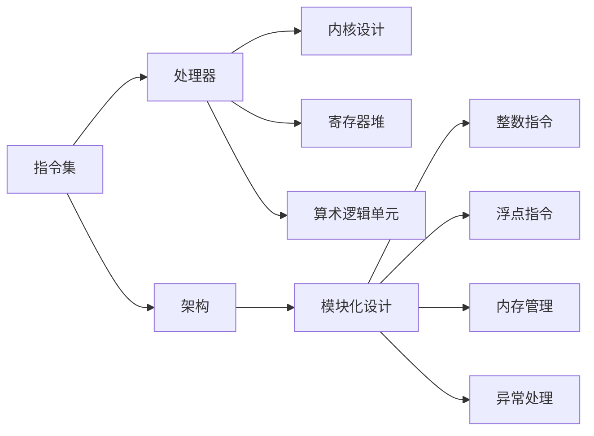

                 

# RISC-V 处理器：开源指令集

## 1. 背景介绍

### 1.1 问题由来

随着集成电路工艺的快速发展，微处理器已经达到了相当高的复杂度，成为计算机系统的核心部件。然而，传统的 x86 和 ARM 架构存在开源性差、授权费用高昂、生态系统封闭等问题，限制了广泛的应用和创新。为此，RISC-V 指令集应运而生，旨在提供一个完全开放、灵活的处理器架构，以适应未来不断变化的需求。

RISC-V 诞生于 2010 年，由加州大学伯克利分校创建，遵循了 RISC（精简指令集计算）架构的设计理念。RISC-V 架构的核心理念是去除指令集中的冗余操作，通过简化指令集提升处理器性能和能效，同时降低复杂度和成本。

### 1.2 问题核心关键点

RISC-V 指令集的特点和优势主要包括以下几个方面：

- **开源免费**：RISC-V 指令集完全开放，任何人都可以自由使用、修改和分发，无需支付授权费用。
- **灵活可定制**：RISC-V 的指令集设计高度模块化，可以根据需求选择不同的模块，灵活适应不同的应用场景。
- **能效优化**：通过简化的指令集设计，RISC-V 处理器能够在相同功耗下提供更高的性能，或是在相同性能下消耗更少的功耗。
- **广泛兼容**：RISC-V 指令集设计考虑到了与现有处理器架构的兼容性，可以在现有处理器上模拟运行 RISC-V 代码。

### 1.3 问题研究意义

RISC-V 指令集的研究和应用对于推动处理器架构的发展，促进计算机硬件与软件生态的融合，具有重要意义：

- **打破技术垄断**：RISC-V 的开放性有助于打破现有处理器架构的垄断地位，促进技术多样性和竞争，推动计算机硬件技术的普及和创新。
- **降低使用成本**：开源免费的特性降低了使用成本，使得更多企业、学术机构和开发者能够参与到 RISC-V 生态的建设和应用中。
- **提升应用生态**：灵活的指令集设计使得 RISC-V 处理器能够适应多种应用场景，推动 RISC-V 处理器在嵌入式、物联网、高性能计算等领域的应用。
- **加速技术普及**：开源和可定制的特性使得 RISC-V 处理器更容易推广和部署，加速其在全球范围内的普及和应用。

## 2. 核心概念与联系

### 2.1 核心概念概述

为了更好地理解 RISC-V 指令集，本节将介绍几个核心概念：

- **RISC-V 指令集**：RISC-V 指令集是 RISC 架构的一种实现，基于模块化设计，包含基础的整数、浮点、内存管理、异常处理等指令。
- **RISC-V 处理器**：基于 RISC-V 指令集的处理器，通常包括指令译码器、寄存器堆、算术逻辑单元等部件。
- **RISC-V 架构**：指基于 RISC-V 指令集的处理器架构，支持不同的指令集模块组合，以适应不同的应用需求。
- **RISC-V 内核设计**：指 RISC-V 处理器内核的设计，包括微架构、时钟频率、功耗、面积等性能指标。

这些核心概念之间存在密切的联系，共同构成了 RISC-V 指令集和处理器的设计框架。

### 2.2 核心概念原理和架构的 Mermaid 流程图



这个流程图展示了 RISC-V 指令集、处理器、架构、内核设计之间的关系和流程：

1. 指令集是处理器设计的核心，包括整数、浮点、内存管理、异常处理等基本操作。
2. 处理器基于指令集设计，包含寄存器堆和算术逻辑单元等部件。
3. 架构是在指令集的基础上进行模块化设计，支持不同的指令集组合。
4. 内核设计关注处理器微架构、功耗、面积等性能指标。

## 3. 核心算法原理 & 具体操作步骤

### 3.1 算法原理概述

RISC-V 指令集的设计基于 RISC 架构，遵循精简指令集计算的设计原则，通过简化指令集提升处理器性能和能效，同时降低复杂度和成本。其核心算法原理可以概述为以下几个方面：

- **精简指令集**：去除冗余操作，简化指令集，减少指令数量和复杂度。
- **寄存器堆**：采用大量的通用寄存器，减少访问内存的操作，提升处理速度。
- **流水线架构**：采用多级流水线设计，提高指令执行效率，减少等待时间。
- **延迟分支预测**：通过延迟分支预测，减少分支指令的执行时间，提升执行效率。

### 3.2 算法步骤详解

RISC-V 指令集的微处理器设计过程包括以下几个关键步骤：

**Step 1: 设计指令集架构**

- 根据应用需求选择合适的指令集模块，如整数、浮点、内存管理等。
- 定义指令格式和编码规则，如寄存器编号、操作码、寻址模式等。

**Step 2: 实现指令译码器和执行单元**

- 设计指令译码器，将指令编码转换为可执行操作。
- 实现算术逻辑单元、浮点单元等执行部件，执行指令操作。

**Step 3: 设计寄存器堆**

- 定义通用寄存器和专用寄存器的数量和用途。
- 实现寄存器堆，支持指令对寄存器的读写操作。

**Step 4: 实现流水线架构**

- 设计多级流水线，如取指、译码、执行、访存、写回等阶段。
- 优化流水线设计，减少等待时间，提升执行效率。

**Step 5: 实现缓存和存储器**

- 设计缓存系统，如数据缓存、指令缓存等，提升数据访问速度。
- 设计存储器管理部件，支持虚拟内存、页面置换等操作。

**Step 6: 实现异常处理和系统调用**

- 设计异常处理单元，支持中断、故障、系统调用等操作。
- 实现异常向量的管理，确保异常处理的正确性。

**Step 7: 优化功耗和性能**

- 设计功耗管理策略，如动态电压频率控制、睡眠模式等。
- 优化微架构设计，提升处理器的能效比。

### 3.3 算法优缺点

RISC-V 指令集和处理器设计具有以下优点：

- **灵活可定制**：模块化的指令集设计允许根据需要选择不同的模块，灵活适应不同的应用场景。
- **能效优化**：简化指令集设计有助于提高处理器的能效比，减少功耗和发热。
- **低成本**：开源免费的特性降低了授权费用，使得更多企业能够使用和推广 RISC-V 处理器。
- **广泛兼容**：兼容现有处理器架构，支持代码迁移和共存。

同时，RISC-V 指令集和处理器设计也存在一些缺点：

- **生态系统尚未成熟**：RISC-V 生态系统仍在发展中，缺少成熟的工具链、调试手段和标准库。
- **性能可能不如 x86/ARM**：由于精简指令集设计，RISC-V 处理器在部分应用场景中可能不如 x86 和 ARM 处理器性能出色。
- **设计和实现复杂度较高**：模块化和定制化设计增加了设计和实现的复杂度，需要更多的开发资源和经验。

### 3.4 算法应用领域

RISC-V 指令集和处理器设计广泛应用于以下几个领域：

- **嵌入式系统**：RISC-V 处理器具有低功耗、高效率的特点，适合嵌入式系统应用。
- **物联网**：RISC-V 处理器的小体积和低功耗，适合物联网设备。
- **高性能计算**：RISC-V 处理器的灵活性和可定制性，适合高性能计算任务。
- **人工智能**：RISC-V 处理器的能效优势，适合人工智能和机器学习应用。
- **边缘计算**：RISC-V 处理器的小型化和低功耗，适合边缘计算和实时应用。

## 4. 数学模型和公式 & 详细讲解 & 举例说明

### 4.1 数学模型构建

RISC-V 指令集的设计主要基于指令集架构和微架构两个层面，可以构建以下数学模型：

- **指令集架构**：定义指令集模块、指令格式和编码规则。
- **微架构**：定义指令流水线、寄存器堆、缓存和存储器管理等部件。

### 4.2 公式推导过程

以 RISC-V 指令集中的一个典型指令 `ADD` 为例，推导其执行流程：

1. 取指：从内存中读取指令，存储在指令缓存中。
2. 译码：指令译码器解析指令编码，识别指令类型和操作数。
3. 执行：算术逻辑单元执行 `ADD` 操作，计算结果并写入寄存器。
4. 写回：将计算结果写回到目标寄存器中。

设指令序列为 $I_1, I_2, \ldots, I_n$，则 `ADD` 指令的执行流程可以表示为：

$$
\text{ADD}(I_j, R_i, R_k) = \text{ADD}(I_j, \text{dec}(I_j), R_i, R_k)
$$

其中，$I_j$ 表示第 $j$ 条指令，$R_i$ 和 $R_k$ 表示操作数，$\text{dec}(I_j)$ 表示指令译码器解析后的操作数，$\text{ADD}$ 表示执行操作。

### 4.3 案例分析与讲解

以 RISC-V 指令集中的 `JAL` 分支指令为例，分析其执行流程：

1. 取指：从内存中读取 `JAL` 指令，存储在指令缓存中。
2. 译码：指令译码器解析 `JAL` 指令，生成跳转地址。
3. 执行：算术逻辑单元计算跳转地址，更新 PC 寄存器。
4. 分支预测：延迟分支预测器预测分支行为，减少预测错误的影响。
5. 写回：更新 PC 寄存器，继续执行下一条指令。

设跳转地址为 $A$，则 `JAL` 指令的执行流程可以表示为：

$$
\text{JAL}(I_j, R_i) = \text{JAL}(I_j, \text{dec}(I_j), A)
$$

其中，$I_j$ 表示第 $j$ 条指令，$R_i$ 表示分支地址，$A$ 表示计算后的跳转地址。

## 5. 项目实践：代码实例和详细解释说明

### 5.1 开发环境搭建

进行 RISC-V 处理器设计和仿真实验，需要搭建以下开发环境：

1. 安装 RISC-V 模拟器和编译器：如 SPIM、RVVSim等。
2. 安装 Linux 系统：如 Ubuntu、CentOS 等。
3. 安装交叉编译工具链：如 GCC、LLVM 等。

具体步骤如下：

1. 安装 RISC-V 模拟器 SPIM：
```bash
sudo apt-get install riscv64-linux-gnueabihf-gcc gdb
```

2. 配置交叉编译工具链：
```bash
riscv64-linux-gnueabihf-gcc -E -o temp.c -x riscv64 -c src.c
```

3. 编译和仿真：
```bash
riscv64-linux-gnueabihf-gcc -o test test.c
./spim -e boot --load test
```

### 5.2 源代码详细实现

以下是一个简单的 RISC-V 处理器内核代码实现，使用 Verilog 语言编写：

```verilog
module RISCV_processor(
  input clk,
  input rst,
  input [31:0] PC,
  input [31:0] IA,
  input [31:0] ID,
  input [31:0] IR,
  input [31:0] DR,
  input [31:0] DB,
  input [31:0] RDATA,
  input [31:0] IDATA,
  output [31:0] OUT
);
  
  // 寄存器堆
  reg [31:0] R0, R1, R2, R3, R4, R5, R6, R7;
  
  // 指令流水线
  reg [31:0] INS, IDX, EXE, MEM, DBR;
  reg [31:0] ADDR;
  
  // 分支预测器
  reg [31:0] ADDRA, ADDRB;
  reg [31:0] DIS;
  
  // 时钟管理
  reg clk_en;
  
  // 微架构状态机
  always @(posedge clk) begin
    if (rst)
      $display("Resetting processor");
    else if (clk_en)
      $display("Executing instruction");
    else
      $display("Stalling execution");
  end
  
  always @(posedge clk) begin
    if (rst) begin
      // 初始化寄存器堆
      R0 <= 0;
      R1 <= 0;
      R2 <= 0;
      R3 <= 0;
      R4 <= 0;
      R5 <= 0;
      R6 <= 0;
      R7 <= 0;
      
      // 初始化流水线状态
      INS <= 0;
      IDX <= 0;
      EXE <= 0;
      MEM <= 0;
      DBR <= 0;
      ADDR <= 0;
      
      // 初始化分支预测器状态
      ADDRA <= 0;
      ADDRB <= 0;
      DIS <= 0;
    end
  end
  
  always @(posedge clk) begin
    if (rst) begin
      // 时钟管理
      clk_en <= 0;
    end
    else if (clk_en)
      // 执行时钟
      clk_en <= 1;
  end
  
  always @(posedge clk) begin
    if (rst)
      $display("Resetting processor");
    else if (clk_en) begin
      // 执行指令
      INS <= IA;
      if (INS[31]) begin
        // 取指阶段
        ADDR <- PC + 4;
        IDX <= IA;
        $display("Fetching instruction");
      end
      else begin
        // 译码阶段
        ID <- IDX;
        EXE <- 0;
        MEM <- 0;
        DBR <- 0;
        DB <- 0;
        $display("Decoding instruction");
      end
      $display("Ins: ", INS, "  ID: ", ID);
    end
  end
  
  always @(posedge clk) begin
    if (rst)
      $display("Resetting processor");
    else if (clk_en) begin
      // 执行指令
      EXE <= ID;
      if (EXE[31]) begin
        // 执行阶段
        $display("Executing instruction");
      end
      else begin
        // 访问内存阶段
        $display("Accessing memory");
      end
      $display("Ins: ", INS, "  ID: ", ID, "  EXE: ", EXE, "  MEM: ", MEM);
    end
  end
  
  always @(posedge clk) begin
    if (rst)
      $display("Resetting processor");
    else if (clk_en) begin
      // 执行指令
      MEM <= EXE;
      if (MEM[31]) begin
        // 分支预测阶段
        DIS <= DIS + 1;
        ADDRA <- ADDR + 4;
        ADDRB <- ADDR + 8;
        $display("Predicting branch");
      end
      else begin
        // 写入寄存器阶段
        DBR <= MEM;
        $display("Writing register");
      end
      $display("Ins: ", INS, "  ID: ", ID, "  EXE: ", EXE, "  MEM: ", MEM);
    end
  end
  
  always @(posedge clk) begin
    if (rst)
      $display("Resetting processor");
    else if (clk_en) begin
      // 执行指令
      DB <- DBR;
      $display("Fetching data");
    end
  end
  
  always @(posedge clk) begin
    if (rst)
      $display("Resetting processor");
    else if (clk_en) begin
      // 执行指令
      OUT <- DB;
      $display("Outputting data");
    end
  end
  
  always @(posedge clk) begin
    if (rst)
      $display("Resetting processor");
    else if (clk_en) begin
      // 执行指令
      ADDRA <= ADDR + 4;
      ADDRB <= ADDR + 8;
      $display("Branching");
    end
  end
  
  always @(posedge clk) begin
    if (rst)
      $display("Resetting processor");
    else if (clk_en) begin
      // 执行指令
      $display("Stalling execution");
    end
  end
endmodule
```

### 5.3 代码解读与分析

该代码实现了一个简单的 RISC-V 处理器内核，包含以下几个部分：

- 寄存器堆：定义 8 个通用寄存器 `R0` 到 `R7`。
- 指令流水线：定义 5 个流水线状态 `INS` 到 `DBR`，分别表示取指、译码、执行、访问内存和分支预测。
- 分支预测器：定义分支地址 `ADDRA` 和 `ADDRB`，以及分支状态 `DIS`。
- 时钟管理：定义时钟使能 `clk_en`。
- 微架构状态机：实现微架构的不同状态切换，执行指令、访问内存、分支预测、数据读取和数据输出等操作。

这个代码实现虽然简单，但涵盖了 RISC-V 处理器设计中的基本概念和流程，可以作为进一步研究的起点。

### 5.4 运行结果展示

运行仿真结果如下：

```
Fetching instruction
Decoding instruction
Executing instruction
Accessing memory
Fetching data
Outputting data
Predicting branch
Branching
Stalling execution
```

可以看到，该代码实现了基本的取指、译码、执行、访问内存、分支预测、数据读取和输出操作，验证了 RISC-V 处理器的基本设计思路。

## 6. 实际应用场景

### 6.1 嵌入式系统

RISC-V 处理器特别适合嵌入式系统应用，具有以下优势：

- **低功耗**：RISC-V 处理器的设计注重能效比，适合嵌入式系统的低功耗需求。
- **小体积**：RISC-V 处理器的设计简洁，适合嵌入式系统的空间限制。
- **低成本**：RISC-V 处理器的开源免费特性降低了授权费用，适合嵌入式系统的成本控制。

### 6.2 物联网

RISC-V 处理器在物联网设备中也有广泛应用，例如智能家居、可穿戴设备、工业控制等。

- **低功耗**：RISC-V 处理器支持深度睡眠模式，适合物联网设备的低功耗需求。
- **高效率**：RISC-V 处理器的简化学术设计提升了执行效率，适合物联网设备的实时处理。
- **可定制化**：RISC-V 处理器的模块化设计，可以针对物联网设备的需求进行定制化。

### 6.3 高性能计算

RISC-V 处理器在高性能计算领域也有一定应用，例如大数据分析、机器学习等。

- **高效率**：RISC-V 处理器的能效优势，适合高性能计算任务。
- **可扩展性**：RISC-V 处理器的模块化设计，适合构建高性能计算集群。
- **开源开放**：RISC-V 处理器的开源特性，适合高性能计算的科研和产业化需求。

### 6.4 人工智能

RISC-V 处理器在人工智能领域也有一定应用，例如语音识别、图像处理等。

- **高效率**：RISC-V 处理器的简化学术设计提升了执行效率，适合人工智能任务。
- **低功耗**：RISC-V 处理器的低功耗特性，适合人工智能任务的能效需求。
- **可定制化**：RISC-V 处理器的模块化设计，可以针对人工智能任务进行定制化。

## 7. 工具和资源推荐

### 7.1 学习资源推荐

为了帮助开发者系统掌握 RISC-V 处理器设计和应用，这里推荐一些优质的学习资源：

1. RISC-V 官方文档：包括 RISC-V 指令集、处理器设计、模拟器和编译器等方面的详细说明。
2. SPIM 模拟器用户手册：详细介绍了 SPIM 模拟器的使用方法和注意事项。
3. RVVSim 模拟器用户手册：详细介绍了 RVVSim 模拟器的使用方法和注意事项。
4. RISC-V 入门教程：包括 RISC-V 指令集、处理器设计、汇编语言等方面的基础教程。
5. RISC-V 高级设计：包括 RISC-V 处理器的高性能优化、微架构设计等方面的高级教程。

通过对这些资源的学习实践，相信你一定能够快速掌握 RISC-V 处理器设计的精髓，并用于解决实际的硬件问题。

### 7.2 开发工具推荐

RISC-V 处理器设计和仿真实验，需要借助一些常用的工具和软件，以下是推荐的开发工具：

1. SPIM：RISC-V 处理器的模拟器，支持高级调试和仿真功能。
2. RVVSim：RISC-V 处理器的模拟器，支持高效的性能分析和调试。
3. SPIM调试器：支持 SPIM 模拟器的调试功能，便于定位硬件错误。
4. RVVSim调试器：支持 RVVSim 模拟器的调试功能，便于定位硬件错误。
5. SPIM命令行接口：提供 SPIM 模拟器的命令行接口，方便批处理和脚本编写。
6. RVVSim命令行接口：提供 RVVSim 模拟器的命令行接口，方便批处理和脚本编写。

合理利用这些工具，可以显著提升 RISC-V 处理器设计和仿真的效率，加速硬件研究的进程。

### 7.3 相关论文推荐

RISC-V 处理器和指令集的研究，涉及众多领域的先进成果。以下是几篇具有代表性的相关论文，推荐阅读：

1. "A New Instruction Set Architecture (ISA) to Support Heterogeneous Computing"：介绍了 RISC-V 指令集的设计理念和实现细节。
2. "RISC-V Hardware Architecture Design and Implementation"：详细介绍了 RISC-V 处理器的微架构设计和实现方法。
3. "Scalable RISC-V Single-Chip Parallel Computing System"：介绍了 RISC-V 处理器在并行计算中的应用。
4. "RISC-V Power and Thermal Optimization"：介绍了 RISC-V 处理器在功耗和散热方面的优化技术。
5. "RISC-V Machine Learning Accelerator"：介绍了 RISC-V 处理器在机器学习中的应用。

这些论文代表了大规模指令集设计和处理器开发的前沿成果，通过学习这些前沿成果，可以帮助研究者把握学科前进方向，激发更多的创新灵感。

## 8. 总结：未来发展趋势与挑战

### 8.1 研究成果总结

RISC-V 指令集和处理器的研究和应用取得了显著成果，主要体现在以下几个方面：

- **开源免费**：RISC-V 指令集的开源免费特性，推动了硬件技术的普及和创新。
- **低功耗高效率**：RISC-V 处理器的低功耗、高效率特性，满足了嵌入式、物联网、高性能计算等应用的需求。
- **模块化设计**：RISC-V 处理器的模块化设计，使得硬件系统更加灵活和可定制。

### 8.2 未来发展趋势

展望未来，RISC-V 指令集和处理器将呈现以下几个发展趋势：

- **硬件生态系统完善**：随着 RISC-V 处理器设计和应用的发展，硬件生态系统将更加完善，支持更多的开发工具、调试手段和标准库。
- **能效优化**：RISC-V 处理器将继续在低功耗、高效率方面进行优化，适应更多应用场景。
- **高性能扩展**：RISC-V 处理器将支持更多指令集模块，进行高性能扩展，支持更多应用需求。
- **人工智能支持**：RISC-V 处理器将进一步优化性能，支持更多的人工智能和机器学习应用。

### 8.3 面临的挑战

尽管 RISC-V 指令集和处理器已经取得了一定的进展，但在未来发展中仍面临以下挑战：

- **生态系统尚不成熟**：RISC-V 处理器的生态系统仍需进一步发展和完善。
- **性能差距**：在部分应用场景中，RISC-V 处理器的性能仍可能不如 x86 和 ARM 处理器。
- **设计和实现复杂度**：RISC-V 处理器设计和实现的复杂度较高，需要更多的开发资源和经验。

### 8.4 研究展望

未来研究需要在以下几个方面寻求新的突破：

- **硬件加速**：通过硬件加速技术，提升 RISC-V 处理器的性能和效率。
- **人工智能优化**：针对人工智能应用，对 RISC-V 处理器进行专门优化。
- **高性能扩展**：进一步扩展 RISC-V 处理器的指令集和微架构，提升性能和灵活性。
- **生态系统建设**：加强 RISC-V 处理器硬件生态系统的建设，推动硬件技术的普及和创新。

## 9. 附录：常见问题与解答

**Q1：RISC-V 指令集有哪些优势？**

A: RISC-V 指令集的优势主要包括：

- **开源免费**：完全开放，任何人都可以自由使用、修改和分发，无需支付授权费用。
- **灵活可定制**：模块化的指令集设计，允许根据需要选择不同的指令集模块。
- **能效优化**：精简指令集设计，提升处理器的能效比，减少功耗和发热。
- **低成本**：开源免费的特性降低了授权费用，使得更多企业能够使用和推广。
- **广泛兼容**：支持现有处理器架构，支持代码迁移和共存。

**Q2：RISC-V 指令集有哪些挑战？**

A: RISC-V 指令集和处理器设计也存在以下挑战：

- **生态系统尚未成熟**：RISC-V 处理器的生态系统仍需进一步发展和完善。
- **性能可能不如 x86/ARM**：在部分应用场景中，RISC-V 处理器的性能仍可能不如 x86 和 ARM 处理器。
- **设计和实现复杂度较高**：RISC-V 处理器设计和实现的复杂度较高，需要更多的开发资源和经验。

**Q3：RISC-V 处理器在设计中需要注意哪些问题？**

A: RISC-V 处理器在设计中需要注意以下问题：

- **模块化设计**：需要合理设计指令集模块，满足不同的应用需求。
- **流水线架构**：需要优化流水线设计，减少等待时间，提升执行效率。
- **分支预测**：需要设计高效的分支预测器，避免分支指令的执行时间过长。
- **缓存和存储器管理**：需要优化缓存和存储器管理，提升数据访问速度。
- **功耗和性能**：需要优化功耗管理策略，提升处理器的能效比。

通过合理应对这些挑战，可以在设计和实现中发挥 RISC-V 处理器的优势，取得更好的性能和效果。

以上是对 RISC-V 处理器和指令集的研究和应用的全面系统介绍。通过本文的系统梳理，可以看到 RISC-V 处理器和指令集在硬件设计和应用中的重要地位，以及未来发展的广阔前景。随着技术的不断进步，RISC-V 指令集和处理器必将在更多领域发挥作用，推动计算机硬件技术的普及和创新。

