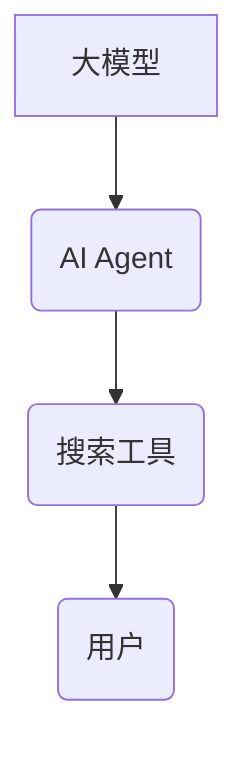

> 大模型、AI Agent、搜索工具、自然语言处理、信息检索、知识图谱、深度学习、Transformer

## 1. 背景介绍

在信息爆炸的时代，海量数据和信息涌现，传统的搜索引擎已经难以满足人们对信息获取的个性化需求。大模型的出现为搜索工具的革新带来了新的机遇。大模型，特别是基于Transformer架构的语言模型，拥有强大的文本理解和生成能力，能够理解用户意图，精准匹配信息需求，并提供更智能、更人性化的搜索体验。

## 2. 核心概念与联系

**2.1  大模型**

大模型是指参数规模庞大、训练数据海量的人工智能模型。它们通过学习海量文本数据，掌握了语言的语法、语义和上下文关系，能够进行复杂的文本理解和生成任务。

**2.2  AI Agent**

AI Agent是指能够感知环境、做出决策并与环境交互的智能体。它可以根据用户指令或自身目标，在搜索引擎中进行信息检索、数据分析、知识推理等操作，最终提供用户所需的结果。

**2.3  搜索工具**

搜索工具是帮助用户查找特定信息的一种软件工具。传统的搜索引擎主要依靠关键词匹配和网页排名算法，而基于大模型的搜索工具则能够理解用户意图，提供更精准、更相关的搜索结果。

**2.4  核心概念关系**

大模型为AI Agent提供了强大的文本理解和生成能力，使其能够更精准地理解用户需求。AI Agent则将大模型的强大能力应用于搜索工具，实现更智能、更人性化的搜索体验。



## 3. 核心算法原理 & 具体操作步骤

**3.1  算法原理概述**

基于大模型的搜索工具主要采用以下核心算法：

* **自然语言处理 (NLP)**：用于理解用户搜索的自然语言查询，提取关键词、实体和意图。
* **信息检索 (IR)**：用于从海量数据中检索与用户查询相关的文档或信息。
* **知识图谱 (KG)**：用于构建和管理知识，帮助搜索工具理解用户查询背后的语义关系。
* **深度学习 (DL)**：用于训练大模型，提升其文本理解和生成能力。

**3.2  算法步骤详解**

1. **用户查询输入**: 用户输入自然语言查询。
2. **自然语言处理**: 使用NLP算法对用户查询进行分析，提取关键词、实体和意图。
3. **知识图谱查询**: 根据提取的关键词和实体，查询知识图谱，获取相关知识和关系。
4. **信息检索**: 使用IR算法从海量数据中检索与用户查询相关的文档或信息。
5. **结果排序**: 根据检索结果的 relevance、authority 和 freshness 等因素进行排序。
6. **结果呈现**: 将排序后的结果以文本、列表、卡片等形式呈现给用户。

**3.3  算法优缺点**

**优点**:

* 能够理解用户意图，提供更精准的搜索结果。
* 支持自然语言查询，提高用户体验。
* 可以利用知识图谱，提供更丰富的搜索结果。

**缺点**:

* 需要大量的训练数据和计算资源。
* 算法复杂度高，需要专业的技术人员进行开发和维护。
* 存在潜在的偏见和误差问题。

**3.4  算法应用领域**

* 搜索引擎
* 智能问答系统
* 个性化推荐系统
* 聊天机器人
* 内容创作辅助工具

## 4. 数学模型和公式 & 详细讲解 & 举例说明

**4.1  数学模型构建**

基于大模型的搜索工具通常采用基于Transformer的深度学习模型，其数学模型可以概括为以下公式：

$$
\mathbf{h}_t = \text{MultiHeadAttention}(\mathbf{h}_{t-1}, \mathbf{X}) + \mathbf{h}_{t-1}
$$

其中：

* $\mathbf{h}_t$：时间步t的隐藏状态向量。
* $\text{MultiHeadAttention}$：多头注意力机制。
* $\mathbf{h}_{t-1}$：时间步t-1的隐藏状态向量。
* $\mathbf{X}$：输入序列。

**4.2  公式推导过程**

多头注意力机制通过多个注意力头并行计算，捕捉不同层级的语义信息。每个注意力头计算一个权重矩阵，用于加权输入序列的不同部分，最终将所有注意力头的输出进行融合，得到最终的隐藏状态向量。

**4.3  案例分析与讲解**

例如，在搜索“苹果公司”时，多头注意力机制可以捕捉到“苹果”和“公司”之间的关系，理解用户查询的意图，并检索出与苹果公司相关的文档或信息。

## 5. 项目实践：代码实例和详细解释说明

**5.1  开发环境搭建**

* Python 3.7+
* PyTorch 或 TensorFlow
* CUDA 和 cuDNN

**5.2  源代码详细实现**

```python
import torch
import torch.nn as nn

class Transformer(nn.Module):
    def __init__(self, vocab_size, embedding_dim, num_heads, num_layers):
        super(Transformer, self).__init__()
        self.embedding = nn.Embedding(vocab_size, embedding_dim)
        self.transformer_encoder = nn.TransformerEncoder(nn.TransformerEncoderLayer(embedding_dim, num_heads), num_layers)

    def forward(self, x):
        x = self.embedding(x)
        x = self.transformer_encoder(x)
        return x
```

**5.3  代码解读与分析**

* `Transformer`类定义了一个基于Transformer架构的模型。
* `embedding`层将输入的词语转换为向量表示。
* `transformer_encoder`层是一个多层Transformer编码器，用于学习文本的语义信息。

**5.4  运行结果展示**

通过训练和测试，可以评估模型的性能，例如准确率、召回率等。

## 6. 实际应用场景

**6.1  搜索引擎**

基于大模型的搜索引擎可以理解用户更复杂的查询，提供更精准、更相关的搜索结果。例如，可以理解用户对某个主题的深入查询，并提供更专业的知识和信息。

**6.2  智能问答系统**

大模型可以训练出能够理解自然语言问题并提供准确答案的智能问答系统。例如，可以用于问答网站、客服机器人等场景。

**6.3  个性化推荐系统**

大模型可以分析用户的兴趣和偏好，提供个性化的商品、内容或服务推荐。例如，电商平台可以利用大模型推荐用户可能感兴趣的商品。

**6.4  未来应用展望**

随着大模型技术的不断发展，其在搜索工具领域的应用将更加广泛和深入。例如，可以实现更个性化的搜索体验、更智能的知识发现、更丰富的交互方式等。

## 7. 工具和资源推荐

**7.1  学习资源推荐**

* **书籍**:
    * 《深度学习》
    * 《自然语言处理》
    * 《Transformer模型详解》
* **在线课程**:
    * Coursera: 深度学习
    * Udacity: 自然语言处理
    * fast.ai: 深度学习

**7.2  开发工具推荐**

* **框架**: PyTorch, TensorFlow
* **库**: HuggingFace Transformers, SpaCy
* **平台**: Google Colab, AWS SageMaker

**7.3  相关论文推荐**

* 《Attention Is All You Need》
* 《BERT: Pre-training of Deep Bidirectional Transformers for Language Understanding》
* 《GPT-3: Language Models are Few-Shot Learners》

## 8. 总结：未来发展趋势与挑战

**8.1  研究成果总结**

基于大模型的搜索工具取得了显著的进展，能够理解用户意图，提供更精准、更相关的搜索结果。

**8.2  未来发展趋势**

* **模型规模和能力的提升**: 随着计算资源的不断发展，大模型的规模和能力将进一步提升，能够理解更复杂的语言和知识。
* **多模态搜索**: 将文本、图像、音频等多模态信息融合到搜索工具中，提供更丰富的搜索体验。
* **个性化搜索**: 基于用户的历史行为和偏好，提供更个性化的搜索结果。

**8.3  面临的挑战**

* **数据获取和标注**: 大模型需要海量数据进行训练，数据获取和标注成本较高。
* **模型训练和部署**: 大模型的训练和部署需要大量的计算资源，成本较高。
* **公平性和可解释性**: 大模型存在潜在的偏见和误差问题，需要提高模型的公平性和可解释性。

**8.4  研究展望**

未来，研究人员将继续探索大模型在搜索工具领域的应用，开发更智能、更人性化的搜索体验。


## 9. 附录：常见问题与解答

**9.1  Q: 如何选择合适的搜索模型？**

**A:** 选择合适的搜索模型需要根据具体应用场景和需求进行考虑。例如，对于需要理解复杂语义关系的场景，可以选择基于Transformer架构的模型；对于需要快速检索大量数据的场景，可以选择基于BM25算法的模型。

**9.2  Q: 如何评估搜索模型的性能？**

**A:** 搜索模型的性能通常通过准确率、召回率、F1-score等指标进行评估。

**9.3  Q: 如何解决大模型训练和部署的成本问题？**

**A:** 可以利用云计算平台进行大模型训练和部署，降低成本。


作者：禅与计算机程序设计艺术 / Zen and the Art of Computer Programming 
<end_of_turn>