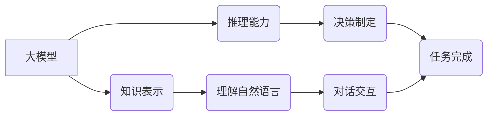

> 大模型、AI Agent、应用开发、自然语言处理、机器学习、深度学习、对话系统

## 1. 背景介绍

近年来，大模型技术取得了飞速发展，其强大的泛化能力和知识表示能力为人工智能领域带来了革命性的变革。大模型的出现，使得构建智能化应用变得更加容易，也为我们打开了通往通用人工智能的新大门。

然而，仅仅拥有强大的模型能力还不够，将大模型应用于实际场景，构建出真正有价值的AI Agent，需要我们深入理解大模型的特性，并将其与具体的应用场景相结合。

本篇文章将以“动手做AI Agent”为主题，深入探讨大模型应用开发的实践方法，帮助读者理解大模型的应用原理，并通过具体的案例，学习如何构建自己的AI Agent。

## 2. 核心概念与联系

### 2.1 大模型

大模型是指参数量达到数亿甚至数千亿的深度学习模型。由于其庞大的规模，大模型能够学习到更丰富的知识和模式，从而表现出更强的泛化能力和适应性。

### 2.2 AI Agent

AI Agent是指能够感知环境、做出决策并与环境交互的智能体。AI Agent可以是软件程序、机器人或其他智能系统。

### 2.3 联系

大模型为构建AI Agent提供了强大的基础。我们可以利用大模型的知识表示能力和推理能力，构建出能够理解自然语言、进行对话、解决问题和完成任务的AI Agent。

**大模型与AI Agent的联系**



## 3. 核心算法原理 & 具体操作步骤

### 3.1 算法原理概述

构建AI Agent的核心算法通常是基于深度学习的，例如Transformer模型、Recurrent Neural Network (RNN)等。这些模型能够学习到语言的语义和语法结构，从而实现对自然语言的理解和生成。

### 3.2 算法步骤详解

1. **数据预处理:** 收集和预处理训练数据，例如文本数据、对话数据等。
2. **模型训练:** 使用深度学习算法训练模型，例如Transformer模型，使其能够理解和生成自然语言。
3. **模型评估:** 使用测试数据评估模型的性能，例如准确率、召回率等。
4. **模型部署:** 将训练好的模型部署到实际应用场景中，例如聊天机器人、问答系统等。

### 3.3 算法优缺点

**优点:**

* 强大的泛化能力和适应性
* 可以学习到复杂的语言模式
* 可以实现自然语言的理解和生成

**缺点:**

* 训练成本高
* 需要大量的训练数据
* 难以解释模型的决策过程

### 3.4 算法应用领域

* 聊天机器人
* 问答系统
* 语音识别
* 机器翻译
* 文本摘要

## 4. 数学模型和公式 & 详细讲解 & 举例说明

### 4.1 数学模型构建

大模型的训练通常基于概率模型，例如语言模型。语言模型的目标是预测下一个词出现的概率，基于训练数据学习语言的统计规律。

**例子:**

一个简单的语言模型可以基于n-gram模型，预测下一个词的概率，例如：

```
P(w_t | w_{t-1}, w_{t-2}, ..., w_{t-n})
```

其中：

* $w_t$ 是当前词
* $w_{t-1}, w_{t-2}, ..., w_{t-n}$ 是前n个词

### 4.2 公式推导过程

n-gram模型的概率可以根据训练数据统计得到，例如：

```
P(w_t | w_{t-1}, w_{t-2}, ..., w_{t-n}) = \frac{C(w_{t-n+1}, w_{t-n+2}, ..., w_t)}{C(w_{t-n+1}, w_{t-n+2}, ..., w_{t-1})}
```

其中：

* $C(w_{t-n+1}, w_{t-n+2}, ..., w_t)$ 是词序列 $w_{t-n+1}, w_{t-n+2}, ..., w_t$ 出现的次数
* $C(w_{t-n+1}, w_{t-n+2}, ..., w_{t-1})$ 是词序列 $w_{t-n+1}, w_{t-n+2}, ..., w_{t-1}$ 出现的次数

### 4.3 案例分析与讲解

例如，训练一个简单的英语语言模型，预测下一个词是“the”的概率。

如果训练数据中，词序列“the cat”出现了10次，那么：

```
P("the" | "cat") = \frac{10}{10} = 1
```

这意味着，在训练数据中，如果前一个词是“cat”，那么下一个词是“the”的概率为1。

## 5. 项目实践：代码实例和详细解释说明

### 5.1 开发环境搭建

* Python 3.x
* TensorFlow 或 PyTorch
* 其他必要的库，例如NLTK、spaCy等

### 5.2 源代码详细实现

```python
import tensorflow as tf

# 定义模型结构
model = tf.keras.Sequential([
    tf.keras.layers.Embedding(input_dim=vocab_size, output_dim=embedding_dim),
    tf.keras.layers.LSTM(units=128),
    tf.keras.layers.Dense(units=vocab_size, activation='softmax')
])

# 编译模型
model.compile(optimizer='adam', loss='sparse_categorical_crossentropy', metrics=['accuracy'])

# 训练模型
model.fit(x_train, y_train, epochs=10)

# 评估模型
loss, accuracy = model.evaluate(x_test, y_test)
print('Loss:', loss)
print('Accuracy:', accuracy)

# 使用模型预测
predictions = model.predict(x_new)
```

### 5.3 代码解读与分析

* **模型结构:** 使用了Embedding层将词向量化，LSTM层捕捉文本序列的上下文信息，Dense层输出每个词的概率分布。
* **模型编译:** 使用Adam优化器，交叉熵损失函数，并使用准确率作为评估指标。
* **模型训练:** 使用训练数据训练模型，设置训练轮数为10。
* **模型评估:** 使用测试数据评估模型的性能。
* **模型预测:** 使用训练好的模型预测新的文本序列。

### 5.4 运行结果展示

训练完成后，可以查看模型的损失值和准确率，以及模型预测的文本序列。

## 6. 实际应用场景

### 6.1 聊天机器人

大模型可以用于构建能够进行自然对话的聊天机器人，例如客服机器人、陪伴机器人等。

### 6.2 问答系统

大模型可以用于构建能够回答用户问题的问答系统，例如搜索引擎、知识问答系统等。

### 6.3 文本生成

大模型可以用于生成各种文本内容，例如文章、故事、诗歌等。

### 6.4 其他应用场景

* 机器翻译
* 语音识别
* 文本摘要
* 代码生成

## 7. 工具和资源推荐

### 7.1 学习资源推荐

* **书籍:**
    * 《深度学习》
    * 《自然语言处理》
    * 《Transformer模型》
* **在线课程:**
    * Coursera
    * edX
    * Udacity

### 7.2 开发工具推荐

* **TensorFlow:** 开源深度学习框架
* **PyTorch:** 开源深度学习框架
* **Hugging Face:** 提供预训练大模型和开发工具

### 7.3 相关论文推荐

* 《Attention Is All You Need》
* 《BERT: Pre-training of Deep Bidirectional Transformers for Language Understanding》
* 《GPT-3: Language Models are Few-Shot Learners》

## 8. 总结：未来发展趋势与挑战

### 8.1 研究成果总结

大模型技术取得了显著进展，为人工智能领域带来了革命性的变革。

### 8.2 未来发展趋势

* 模型规模进一步扩大
* 模型训练效率提升
* 模型解释性和可控性增强
* 多模态大模型发展

### 8.3 面临的挑战

* 训练成本高
* 数据安全和隐私问题
* 模型偏见和歧视问题
* 模型安全性问题

### 8.4 研究展望

未来，大模型技术将继续发展，并应用于更广泛的领域，为人类社会带来更多福祉。

## 9. 附录：常见问题与解答

### 9.1 什么是大模型？

大模型是指参数量达到数亿甚至数千亿的深度学习模型。

### 9.2 如何训练大模型？

训练大模型需要大量的计算资源和训练数据。常用的训练方法包括监督学习、自监督学习和无监督学习。

### 9.3 大模型有哪些应用场景？

大模型的应用场景非常广泛，例如聊天机器人、问答系统、文本生成、机器翻译等。

### 9.4 大模型有哪些挑战？

大模型面临着训练成本高、数据安全和隐私问题、模型偏见和歧视问题、模型安全性问题等挑战。

作者：禅与计算机程序设计艺术 / Zen and the Art of Computer Programming


<end_of_turn>