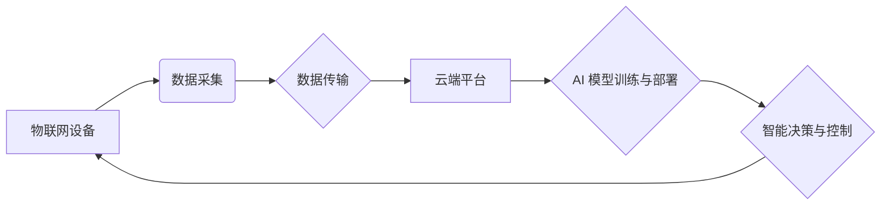

> 物联网 (IoT)、人工智能 (AI)、机器学习 (ML)、深度学习 (DL)、数据分析、预测模型、智能决策、安全与隐私

## 1. 背景介绍

物联网 (IoT) 正以惊人的速度发展，连接着越来越多的设备、传感器和系统，产生了海量的数据。这些数据蕴藏着丰富的价值，但如何有效地提取、分析和利用这些数据成为了一个关键挑战。人工智能 (AI) 作为一种强大的技术，为物联网的发展提供了新的机遇和可能性。

AI 能够通过学习和分析数据，识别模式、做出预测和自动化决策，从而赋予物联网设备智能化能力。例如，AI 可以帮助智能家居设备根据用户的习惯自动调节温度和灯光，帮助医疗设备进行疾病诊断和预测，帮助工业设备进行故障预测和预防维护。

## 2. 核心概念与联系

**2.1 物联网 (IoT)**

物联网是指通过互联网连接各种物理设备、传感器、软件和数据，形成一个互联互通的网络系统。物联网设备可以收集、交换和分析数据，实现远程控制、自动化管理和智能化服务。

**2.2 人工智能 (AI)**

人工智能是指模拟人类智能行为的计算机系统。AI 的核心技术包括机器学习 (ML)、深度学习 (DL)、自然语言处理 (NLP) 和计算机视觉等。

**2.3 AI 在 IoT 中的角色**

AI 在物联网中扮演着至关重要的角色，主要体现在以下几个方面：

* **数据分析和洞察:** AI 能够从海量物联网数据中提取有价值的洞察，帮助用户了解设备运行状况、用户行为模式和市场趋势。
* **智能决策和自动化:** AI 可以根据数据分析结果，自动做出决策和执行操作，提高效率和降低成本。
* **预测和预警:** AI 可以通过分析历史数据和实时数据，预测未来事件的发生，例如设备故障、用户需求变化等，帮助用户提前做好准备。
* **个性化服务:** AI 可以根据用户的个人喜好和需求，提供个性化的服务和体验。

**2.4 AI 在 IoT 中的架构**

AI 在物联网中的应用通常采用以下架构：



**2.5 核心概念原理和架构**

物联网设备通过传感器收集数据，并通过网络传输到云端平台。云端平台利用 AI 模型对数据进行分析和处理，并根据分析结果做出智能决策，最终控制物联网设备。

## 3. 核心算法原理 & 具体操作步骤

**3.1 算法原理概述**

在 AI 驱动的物联网中，常用的算法包括：

* **机器学习 (ML):** 通过训练模型，从数据中学习规律，进行预测和分类。
* **深度学习 (DL):** 基于多层神经网络，能够学习更复杂的模式和特征。
* **强化学习 (RL):** 通过奖励机制，训练智能体在环境中做出最优决策。

**3.2 算法步骤详解**

以机器学习为例，其基本步骤如下：

1. **数据收集和预处理:** 收集相关数据，并进行清洗、转换和特征工程等预处理操作。
2. **模型选择:** 根据任务需求选择合适的机器学习模型，例如线性回归、逻辑回归、决策树、支持向量机等。
3. **模型训练:** 使用训练数据训练模型，调整模型参数，使其能够准确地预测或分类。
4. **模型评估:** 使用测试数据评估模型的性能，例如准确率、召回率、F1-score等。
5. **模型部署:** 将训练好的模型部署到云端平台或物联网设备上，用于实时数据处理和预测。

**3.3 算法优缺点**

不同的机器学习算法具有不同的优缺点，需要根据具体任务选择合适的算法。例如，线性回归算法简单易实现，但对非线性关系的拟合能力较弱；决策树算法能够处理非线性关系，但容易过拟合；支持向量机算法能够处理高维数据，但训练时间较长。

**3.4 算法应用领域**

机器学习算法在物联网领域有着广泛的应用，例如：

* **设备故障预测:** 通过分析设备运行数据，预测设备故障的发生时间和类型。
* **用户行为分析:** 通过分析用户行为数据，了解用户的需求和偏好，提供个性化服务。
* **环境监测:** 通过分析环境传感器数据，监测空气质量、水质等环境指标。
* **智能交通:** 通过分析交通流量数据，优化交通信号灯控制，缓解交通拥堵。

## 4. 数学模型和公式 & 详细讲解 & 举例说明

**4.1 数学模型构建**

在 AI 驱动的物联网中，常用的数学模型包括线性回归模型、逻辑回归模型、支持向量机模型等。

**4.2 公式推导过程**

例如，线性回归模型的目标是找到一条直线，使得预测值与真实值之间的误差最小。

线性回归模型的公式如下：

$$y = w_0 + w_1x_1 + w_2x_2 + ... + w_nx_n$$

其中：

* $y$ 是预测值
* $w_0, w_1, w_2, ..., w_n$ 是模型参数
* $x_1, x_2, ..., x_n$ 是输入特征

模型参数可以通过最小二乘法进行估计。

**4.3 案例分析与讲解**

例如，假设我们想要预测房屋价格，输入特征包括房屋面积、房间数量、地理位置等。我们可以使用线性回归模型训练一个预测模型，并根据模型预测，估算不同房屋的价格。

## 5. 项目实践：代码实例和详细解释说明

**5.1 开发环境搭建**

* Python 3.x
* TensorFlow 或 PyTorch
* Jupyter Notebook

**5.2 源代码详细实现**

```python
import tensorflow as tf

# 定义模型
model = tf.keras.models.Sequential([
    tf.keras.layers.Dense(64, activation='relu', input_shape=(4,)),
    tf.keras.layers.Dense(1)
])

# 编译模型
model.compile(optimizer='adam', loss='mse')

# 训练模型
model.fit(X_train, y_train, epochs=10)

# 评估模型
loss = model.evaluate(X_test, y_test)
print('Loss:', loss)

# 预测
predictions = model.predict(X_new)
print('Predictions:', predictions)
```

**5.3 代码解读与分析**

这段代码定义了一个简单的线性回归模型，并使用 TensorFlow 库进行训练和预测。

* `tf.keras.models.Sequential` 创建了一个顺序模型，即层级结构的模型。
* `tf.keras.layers.Dense` 定义了一个全连接层，每个神经元都连接到上一层的每个神经元。
* `activation='relu'` 使用 ReLU 激活函数，引入非线性关系。
* `optimizer='adam'` 使用 Adam 优化器，更新模型参数。
* `loss='mse'` 使用均方误差作为损失函数，衡量预测值与真实值之间的误差。
* `model.fit()` 训练模型，使用训练数据进行迭代训练。
* `model.evaluate()` 评估模型，使用测试数据计算损失值。
* `model.predict()` 使用训练好的模型进行预测。

**5.4 运行结果展示**

训练完成后，模型会输出损失值和预测结果。损失值越小，模型性能越好。预测结果可以与真实值进行比较，评估模型的准确性。

## 6. 实际应用场景

**6.1 智能家居**

AI 可以帮助智能家居设备根据用户的习惯自动调节温度、灯光、窗帘等，提供舒适的居住环境。

**6.2 智能医疗**

AI 可以帮助医疗设备进行疾病诊断、预测患者风险、辅助医生进行手术等，提高医疗效率和质量。

**6.3 智能制造**

AI 可以帮助工业设备进行故障预测、优化生产流程、提高生产效率等，实现智能化制造。

**6.4 智能交通**

AI 可以帮助交通信号灯进行智能控制、优化交通流量、缓解交通拥堵等，提高交通效率和安全性。

**6.5 未来应用展望**

随着物联网和人工智能技术的不断发展，AI 在物联网中的应用场景将更加广泛和深入，例如：

* **个性化服务:** AI 可以根据用户的个人喜好和需求，提供个性化的产品和服务。
* **城市智能化:** AI 可以帮助城市管理者优化城市资源配置、提高城市安全性和可持续性。
* **工业互联网:** AI 可以帮助企业实现数字化转型，提高生产效率和竞争力。

## 7. 工具和资源推荐

**7.1 学习资源推荐**

* **在线课程:** Coursera、edX、Udacity 等平台提供丰富的 AI 和物联网课程。
* **书籍:** 《深度学习》、《机器学习实战》、《物联网编程》等书籍。
* **博客和论坛:** TensorFlow、PyTorch 等框架的官方博客和论坛，以及 AI 和物联网相关的技术博客和论坛。

**7.2 开发工具推荐**

* **Python:** 广泛用于 AI 和物联网开发。
* **TensorFlow:** 开源深度学习框架。
* **PyTorch:** 开源深度学习框架。
* **AWS IoT Core:** 亚马逊云平台的物联网服务。
* **Azure IoT Hub:** 微软云平台的物联网服务。

**7.3 相关论文推荐**

* **《Attention Is All You Need》:** 提出 Transformer 架构，用于自然语言处理任务。
* **《Deep Residual Learning for Image Recognition》:** 提出 ResNet 架构，用于图像识别任务。
* **《A Survey on Machine Learning for Internet of Things》:** 对物联网中的机器学习应用进行综述。

## 8. 总结：未来发展趋势与挑战

**8.1 研究成果总结**

AI 在物联网领域的应用取得了显著的进展，例如：

* **数据分析和洞察:** AI 能够从物联网数据中提取有价值的洞察，帮助用户了解设备运行状况、用户行为模式和市场趋势。
* **智能决策和自动化:** AI 可以根据数据分析结果，自动做出决策和执行操作，提高效率和降低成本。
* **预测和预警:** AI 可以通过分析历史数据和实时数据，预测未来事件的发生，例如设备故障、用户需求变化等，帮助用户提前做好准备。

**8.2 未来发展趋势**

* **边缘计算:** 将 AI 模型部署到物联网设备边缘，降低延迟和网络带宽需求。
* **联邦学习:** 在不共享原始数据的情况下，训练共享 AI 模型。
* ** Explainable AI (XAI):** 使 AI 模型的决策过程更加透明和可解释。

**8.3 面临的挑战**

* **数据安全和隐私:** 物联网设备收集大量敏感数据，需要确保数据安全和隐私。
* **模型可解释性和信任:** AI 模型的决策过程往往是复杂的，需要提高模型的可解释性和信任度。
* **算法公平性和偏见:** AI 模型可能存在算法公平性和偏见问题，需要进行公平性和偏见检测和缓解。

**8.4 研究展望**

未来，AI 在物联网领域的应用将更加广泛和深入，需要进一步研究以下问题：

* 如何提高 AI 模型的效率和鲁棒性？
* 如何解决数据安全和隐私问题？
* 如何提高 AI 模型的可解释性和信任度？
* 如何确保 AI 模型的公平性和无偏性？


## 9. 附录：常见问题与解答

**9.1 如何选择合适的 AI 算法？**

选择合适的 AI 算法需要根据具体任务需求和数据特点进行选择。例如，对于分类任务，可以使用逻辑回归、支持向量机或决策树等算法；对于回归任务，可以使用线性回归、支持向量机或神经网络等算法。

**9.2 如何处理物联网数据中的噪声和缺失值？**

物联网数据中