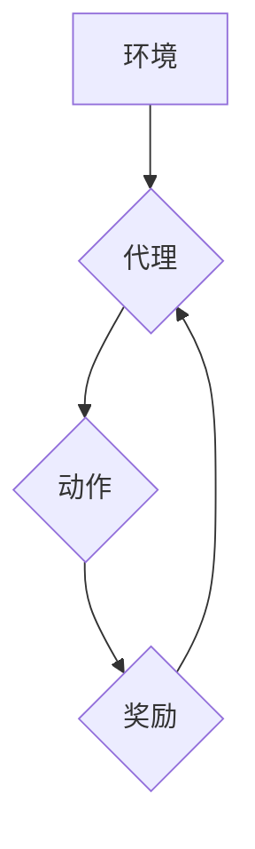

> 深度强化学习 (Deep Reinforcement Learning, DRL)
> 
> 代理智能体 (Agent)
> 
> 奖励函数 (Reward Function)
> 
> 深度Q网络 (Deep Q-Network, DQN)
> 
> 安全防御
> 
> 智能检测与响应 (Security Detection and Response, SDR)

## 1. 背景介绍

在当今数字时代，网络安全面临着前所未有的挑战。传统安全防御方法往往依赖于预先定义的规则和签名，难以应对不断演变的攻击手段。随着人工智能技术的快速发展，深度强化学习 (Deep Reinforcement Learning, DRL) 作为一种新兴的机器学习方法，为安全防御领域带来了新的希望。

DRL 能够训练智能代理，使其能够在复杂环境中学习最佳的策略，并自主做出决策。在安全防御领域，DRL 代理可以学习识别恶意行为，并采取相应的防御措施。

## 2. 核心概念与联系

### 2.1 深度强化学习 (DRL)

DRL 是一种机器学习方法，它结合了深度学习和强化学习的思想。

* **深度学习:** 使用深度神经网络学习复杂的特征表示。
* **强化学习:** 通过奖励机制训练代理，使其在环境中学习最佳策略。

DRL 代理通过与环境交互，获得奖励或惩罚，并根据这些反馈调整其策略，最终达到最大化奖励的目标。

### 2.2 安全防御场景

在安全防御场景中，DRL 代理可以被视为一个智能安全分析师，它需要不断学习和适应新的威胁。

* **环境:** 网络环境，包括网络流量、系统日志等数据。
* **代理:** 智能安全分析师，负责分析环境数据并做出决策。
* **动作:** 安全防御措施，例如封锁恶意IP地址、隔离受感染主机等。
* **奖励:** 正确识别和防御攻击的行为获得奖励，错误的行为获得惩罚。

### 2.3 DQN在安全防御中的应用

DQN 是一种经典的深度强化学习算法，它可以用于训练智能代理，使其能够在安全防御场景中学习最佳策略。

**Mermaid 流程图:**



## 3. 核心算法原理 & 具体操作步骤

### 3.1 算法原理概述

DQN 算法的核心思想是利用深度神经网络来估计状态-动作值函数 (Q-value)，即在给定状态下采取特定动作的期望回报。

DQN 算法通过以下步骤训练代理：

1. **经验回放 (Experience Replay):** 将代理与环境交互产生的经验 (状态、动作、奖励、下一个状态) 存储在经验回放缓冲池中。
2. **样本采样:** 从经验回放缓冲池中随机采样一批经验。
3. **Q-value 更新:** 使用深度神经网络估计每个样本的 Q-value，并根据目标 Q-value 更新神经网络权重。
4. **目标 Q-value:** 目标 Q-value 是使用当前网络权重估计的未来奖励，它可以帮助稳定训练过程。

### 3.2 算法步骤详解

1. **初始化:** 初始化深度神经网络，并设置学习率、折扣因子等超参数。
2. **环境交互:** 代理与环境交互，收集经验。
3. **经验回放:** 将收集到的经验存储在经验回放缓冲池中。
4. **样本采样:** 从经验回放缓冲池中随机采样一批经验。
5. **Q-value 估计:** 使用深度神经网络估计每个样本的 Q-value。
6. **目标 Q-value 计算:** 使用目标网络 (与主网络参数不同的网络) 计算目标 Q-value。
7. **Q-value 更新:** 使用梯度下降算法更新主网络的权重，使 Q-value 估计与目标 Q-value 尽量接近。
8. **重复步骤 2-7:** 直到代理达到预设的性能指标。

### 3.3 算法优缺点

**优点:**

* 可以学习复杂的策略。
* 能够处理高维状态空间。
* 经验回放机制可以提高训练效率。

**缺点:**

* 训练过程可能比较慢。
* 需要大量的训练数据。
* 容易出现过拟合问题。

### 3.4 算法应用领域

DQN 算法在安全防御领域具有广泛的应用前景，例如：

* **恶意行为检测:** 训练 DQN 代理识别恶意行为，例如网络攻击、数据泄露等。
* **安全策略优化:** 训练 DQN 代理优化安全策略，例如防火墙规则、入侵检测系统配置等。
* **安全漏洞修复:** 训练 DQN 代理自动修复安全漏洞。

## 4. 数学模型和公式 & 详细讲解 & 举例说明

### 4.1 数学模型构建

DQN 算法的核心是状态-动作值函数 (Q-value)，它表示在给定状态下采取特定动作的期望回报。

数学模型：

$$Q(s, a) = E[\sum_{t=0}^{\infty} \gamma^t r_{t+1}|s_t = s, a_t = a]$$

其中：

* $s$ 表示状态。
* $a$ 表示动作。
* $r_{t+1}$ 表示在时间步 $t+1$ 获得的奖励。
* $\gamma$ 表示折扣因子，控制未来奖励的权重。

### 4.2 公式推导过程

DQN 算法使用深度神经网络来估计 Q-value。

神经网络的输出是一个 Q-value 向量，每个元素对应一个动作。

目标是通过训练神经网络，使 Q-value 估计与真实 Q-value 尽量接近。

损失函数：

$$L = \frac{1}{N} \sum_{i=1}^{N} (y_i - Q(s_i, a_i))^2$$

其中：

* $N$ 表示样本数量。
* $y_i$ 表示目标 Q-value。
* $Q(s_i, a_i)$ 表示神经网络估计的 Q-value。

### 4.3 案例分析与讲解

假设一个代理在玩游戏，状态是游戏画面，动作是控制游戏角色移动。

DQN 算法可以训练代理学习最佳的移动策略，使其能够获得更高的分数。

例如，如果代理在某个状态下采取移动右边的动作，可以获得更高的奖励，那么 DQN 算法会更新神经网络权重，使移动右边的动作在该状态下获得更高的 Q-value。

## 5. 项目实践：代码实例和详细解释说明

### 5.1 开发环境搭建

* Python 3.x
* TensorFlow 或 PyTorch
* 其他必要的库，例如 NumPy、Pandas 等

### 5.2 源代码详细实现

```python
import tensorflow as tf

# 定义 DQN 网络结构
class DQN(tf.keras.Model):
    def __init__(self, state_size, action_size):
        super(DQN, self).__init__()
        self.dense1 = tf.keras.layers.Dense(64, activation='relu')
        self.dense2 = tf.keras.layers.Dense(32, activation='relu')
        self.output = tf.keras.layers.Dense(action_size)

    def call(self, state):
        x = self.dense1(state)
        x = self.dense2(x)
        return self.output(x)

# 创建 DQN 实例
dqn = DQN(state_size=8, action_size=4)

# 定义损失函数和优化器
loss_fn = tf.keras.losses.MeanSquaredError()
optimizer = tf.keras.optimizers.Adam(learning_rate=0.001)

# 训练 DQN 模型
for epoch in range(100):
    # ... 训练循环 ...
```

### 5.3 代码解读与分析

* DQN 网络结构由两层全连接层和一层输出层组成。
* 损失函数使用均方误差，优化器使用 Adam 优化器。
* 训练循环中，需要从经验回放缓冲池中采样数据，并使用梯度下降算法更新神经网络权重。

### 5.4 运行结果展示

训练完成后，可以评估 DQN 模型的性能，例如在测试集上计算准确率或奖励值。

## 6. 实际应用场景

### 6.1 恶意行为检测

DQN 可以训练代理识别恶意行为，例如网络攻击、数据泄露等。

例如，可以训练 DQN 代理识别恶意流量，并采取相应的防御措施，例如封锁恶意IP地址。

### 6.2 安全策略优化

DQN 可以训练代理优化安全策略，例如防火墙规则、入侵检测系统配置等。

例如，可以训练 DQN 代理优化防火墙规则，使其能够更有效地阻止攻击。

### 6.3 安全漏洞修复

DQN 可以训练代理自动修复安全漏洞。

例如，可以训练 DQN 代理自动修复代码中的漏洞，使其能够更安全地运行。

### 6.4 未来应用展望

DQN 在安全防御领域具有广阔的应用前景，未来可能应用于：

* **自动化安全响应:** DQN 可以训练代理自动响应安全事件，例如隔离受感染主机、恢复数据等。
* **个性化安全防护:** DQN 可以根据用户的行为习惯和安全需求，提供个性化的安全防护方案。
* **跨域安全协作:** DQN 可以训练代理进行跨域安全协作，例如共享威胁情报、联合防御攻击等。

## 7. 工具和资源推荐

### 7.1 学习资源推荐

* **书籍:**
    * Deep Reinforcement Learning Hands-On
    * Reinforcement Learning: An Introduction
* **在线课程:**
    * Deep Reinforcement Learning Specialization (Coursera)
    * Reinforcement Learning (Udacity)

### 7.2 开发工具推荐

* **TensorFlow:** 开源深度学习框架。
* **PyTorch:** 开源深度学习框架。
* **OpenAI Gym:** 强化学习环境库。

### 7.3 相关论文推荐

* Deep Q-Network (DQN)
* Dueling Network Architectures for Deep Reinforcement Learning
* Prioritized Experience Replay

## 8. 总结：未来发展趋势与挑战

### 8.1 研究成果总结

DQN 算法在安全防御领域取得了显著的成果，例如恶意行为检测、安全策略优化、安全漏洞修复等。

### 8.2 未来发展趋势

未来，DQN 算法在安全防御领域将继续发展，主要趋势包括：

* **模型复杂度提升:** 使用更复杂的深度神经网络结构，例如 Transformer、Graph Neural Network 等，提高模型的学习能力。
* **数据增强:** 使用数据增强技术，例如对抗样本生成、迁移学习等，提高模型的鲁棒性和泛化能力。
* **多智能体协作:** 研究多智能体协作的 DQN 算法，提高安全防御的效率和效果。

### 8.3 面临的挑战

DQN 算法在安全防御领域也面临一些挑战，例如：

* **数据稀缺:** 安全数据往往稀缺，难以训练出高性能的 DQN 模型。
* **对抗攻击:** 攻击者可以设计对抗样本，攻击 DQN 模型的鲁棒性。
* **可解释性:** DQN 模型的决策过程难以解释，难以获得用户的信任。

### 8.4 研究展望

未来，需要进一步研究 DQN 算法在安全防御领域的应用，解决上述挑战，并探索新的应用场景。


## 9. 附录：常见问题与解答

### 9.1 Q: DQN 算法的训练过程需要多长时间？

A: DQN 算法的训练时间取决于多种因素，例如模型复杂度、数据量、硬件配置等。一般来说，训练一个简单的 DQN 模型可能只需要几天时间，而训练一个复杂的 DQN 模型可能需要几周甚至几个月。

### 9.2 Q: DQN 算法容易过拟合吗？

A: DQN 算法确实容易过拟合，因为其学习