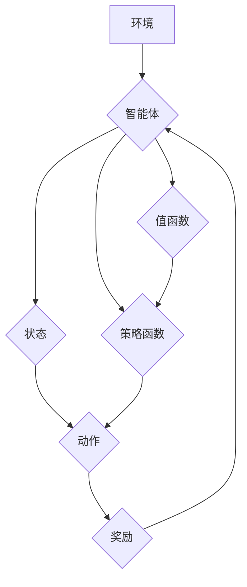

> 深度强化学习，值函数，策略函数，贝尔曼方程，Q学习，深度神经网络，强化学习算法

## 1. 背景介绍

深度强化学习 (Deep Reinforcement Learning, DRL) 近年来在人工智能领域取得了显著进展，并在游戏、机器人控制、自动驾驶等领域展现出强大的应用潜力。DRL的核心在于训练智能体在环境中采取最优行动，以最大化累积奖励。

传统的强化学习算法通常依赖于离散状态空间和有限动作空间，而深度强化学习则通过深度神经网络学习复杂的特征表示，能够处理连续状态空间和高维动作空间。

值函数和策略函数是DRL的核心概念，它们分别描述了智能体在特定状态下采取特定行动的价值和策略选择。理解这两个概念对于深入理解DRL的原理至关重要。

## 2. 核心概念与联系

**2.1 值函数**

值函数评估智能体在特定状态下采取特定行动的长期价值。它可以分为两种类型：

* **状态值函数 (State-Value Function)**：评估智能体在特定状态下采取任何行动的期望累积奖励。
* **动作值函数 (Action-Value Function)**：评估智能体在特定状态下采取特定行动的期望累积奖励。

**2.2 策略函数**

策略函数决定智能体在特定状态下采取哪个行动。它可以看作是一个映射函数，将状态映射到动作的概率分布。

**2.3 值函数与策略函数的关系**

值函数和策略函数相互关联，它们共同构成了DRL的核心框架。

* 策略函数根据值函数选择最优行动。
* 值函数通过策略函数的行动轨迹进行更新。

**2.4 Mermaid 流程图**



## 3. 核心算法原理 & 具体操作步骤

**3.1 算法原理概述**

DRL的核心算法通常基于动态规划和蒙特卡罗方法，通过迭代更新值函数和策略函数来学习最优策略。

* **动态规划**：通过贝尔曼方程递归地更新值函数，求解最优策略。
* **蒙特卡罗方法**：通过采样智能体在环境中的轨迹，估计值函数和策略函数。

**3.2 算法步骤详解**

1. **初始化值函数和策略函数**：随机初始化值函数和策略函数的参数。
2. **环境交互**：智能体与环境交互，获取状态、奖励和下一个状态。
3. **更新值函数**：根据贝尔曼方程或蒙特卡罗方法更新值函数。
4. **更新策略函数**：根据更新后的值函数，更新策略函数，选择最优行动。
5. **重复步骤2-4**：重复以上步骤，直到值函数和策略函数收敛。

**3.3 算法优缺点**

* **优点**：能够学习复杂的策略，适用于高维状态空间和动作空间。
* **缺点**：训练过程可能很慢，容易陷入局部最优解。

**3.4 算法应用领域**

* **游戏**：AlphaGo、AlphaStar等游戏AI。
* **机器人控制**：机器人导航、抓取等任务。
* **自动驾驶**：车辆路径规划、决策控制等。

## 4. 数学模型和公式 & 详细讲解 & 举例说明

**4.1 数学模型构建**

DRL的数学模型通常由以下几个要素组成：

* **状态空间 S**：智能体所能感知到的环境状态集合。
* **动作空间 A**：智能体可以采取的行动集合。
* **奖励函数 R(s, a)**：描述智能体在状态 s 下采取行动 a 得到的奖励。
* **状态转移概率 P(s', r | s, a)**：描述智能体从状态 s 采取行动 a 后转移到状态 s' 并获得奖励 r 的概率。
* **值函数 V(s)**：评估智能体在状态 s 下采取任何行动的期望累积奖励。
* **策略函数 π(a | s)**：描述智能体在状态 s 下采取行动 a 的概率。

**4.2 公式推导过程**

* **贝尔曼方程**：描述值函数的更新规则。

$$
V(s) = \max_a \sum_{s', r} P(s', r | s, a) [R(s, a) + \gamma V(s')]
$$

其中，γ 是折扣因子，控制未来奖励的权重。

* **Q学习**：一种基于贝尔曼方程的算法，学习动作值函数。

$$
Q(s, a) = Q(s, a) + \alpha [R(s, a) + \gamma \max_{a'} Q(s', a') - Q(s, a)]
$$

其中，α 是学习率，控制学习速度。

**4.3 案例分析与讲解**

例如，在玩游戏时，智能体可以将当前游戏画面作为状态，可以采取“向上走”、“向下走”、“向左走”、“向右走”等动作。

奖励函数可以设计为：获得金币奖励，被敌人攻击惩罚。

通过贝尔曼方程和Q学习算法，智能体可以学习到在不同状态下采取不同行动的价值，最终找到通关游戏的最优策略。

## 5. 项目实践：代码实例和详细解释说明

**5.1 开发环境搭建**

* Python 3.x
* TensorFlow 或 PyTorch
* OpenAI Gym

**5.2 源代码详细实现**

```python
import gym
import tensorflow as tf

# 定义环境
env = gym.make('CartPole-v1')

# 定义神经网络模型
model = tf.keras.Sequential([
    tf.keras.layers.Dense(128, activation='relu'),
    tf.keras.layers.Dense(env.action_space.n)
])

# 定义损失函数和优化器
optimizer = tf.keras.optimizers.Adam()
loss_fn = tf.keras.losses.CategoricalCrossentropy()

# 训练循环
for episode in range(1000):
    state = env.reset()
    done = False
    total_reward = 0

    while not done:
        # 选择动作
        action_probs = model(state)
        action = tf.random.categorical(tf.math.log(action_probs), num_samples=1)[0, 0]

        # 执行动作
        next_state, reward, done, _ = env.step(action)

        # 更新值函数
        with tf.GradientTape() as tape:
            target = reward if done else reward + 0.99 * tf.reduce_max(model(next_state))
            loss = loss_fn(tf.one_hot(action, depth=env.action_space.n), target)

        # 反向传播
        gradients = tape.gradient(loss, model.trainable_variables)
        optimizer.apply_gradients(zip(gradients, model.trainable_variables))

        # 更新状态
        state = next_state
        total_reward += reward

    print(f"Episode {episode+1}, Total Reward: {total_reward}")

# 保存模型
model.save('cartpole_model.h5')
```

**5.3 代码解读与分析**

* 代码首先定义了环境和神经网络模型。
* 然后，使用训练循环迭代更新模型参数。
* 在每个时间步，智能体根据当前状态选择动作，执行动作并获得奖励和下一个状态。
* 使用贝尔曼方程计算目标值，并使用损失函数和优化器更新模型参数。
* 最后，保存训练好的模型。

**5.4 运行结果展示**

训练完成后，模型可以用来控制智能体在环境中进行操作。

## 6. 实际应用场景

**6.1 游戏AI**

DRL在游戏领域取得了显著成果，例如AlphaGo、AlphaStar等游戏AI。

**6.2 机器人控制**

DRL可以用于训练机器人进行导航、抓取、运动控制等任务。

**6.3 自动驾驶**

DRL可以用于训练自动驾驶车辆进行路径规划、决策控制等任务。

**6.4 其他应用场景**

* 金融投资
* 电力系统优化
* 医疗诊断

**6.5 未来应用展望**

DRL在未来将有更广泛的应用，例如：

* 人机交互
* 个性化推荐
* 科学发现

## 7. 工具和资源推荐

**7.1 学习资源推荐**

* **书籍**：
    * Reinforcement Learning: An Introduction by Sutton and Barto
    * Deep Reinforcement Learning Hands-On by Maxim Lapan
* **课程**：
    * Deep Reinforcement Learning Specialization by DeepLearning.AI
    * Reinforcement Learning by David Silver

**7.2 开发工具推荐**

* **TensorFlow**
* **PyTorch**
* **OpenAI Gym**

**7.3 相关论文推荐**

* Deep Q-Network (DQN)
* Proximal Policy Optimization (PPO)
* Trust Region Policy Optimization (TRPO)

## 8. 总结：未来发展趋势与挑战

**8.1 研究成果总结**

DRL在过去几年取得了显著进展，在游戏、机器人控制、自动驾驶等领域取得了突破性成果。

**8.2 未来发展趋势**

* **更强大的模型架构**：探索更深、更广的深度神经网络架构，提高学习能力。
* **更有效的训练算法**：开发更快速、更稳定的训练算法，降低训练成本。
* **更广泛的应用场景**：将DRL应用于更多领域，例如医疗、金融、教育等。

**8.3 面临的挑战**

* **样本效率**：DRL算法通常需要大量的训练数据，这在现实世界中可能难以获得。
* **可解释性**：DRL模型的决策过程难以解释，这限制了其在安全关键应用中的应用。
* **鲁棒性**：DRL模型容易受到环境变化的影响，缺乏鲁棒性。

**8.4 研究展望**

未来DRL研究将继续探索更强大的模型、更有效的算法和更广泛的应用场景，以解决上述挑战，推动人工智能技术的发展。

## 9. 附录：常见问题与解答

**9.1 什么是强化学习？**

强化学习是一种机器学习方法，其中智能体通过与环境交互，学习最优策略以最大化累积奖励。

**9.2 值函数和策略函数有什么区别？**

值函数评估智能体在特定状态下采取特定行动的价值，而策略函数决定智能体在特定状态下采取哪个行动。

**9.3 贝尔曼方程是什么？**

贝尔曼方程描述了值函数的更新规则，用于计算智能体在特定状态下采取特定行动的期望累积奖励。

**9.4 Q学习算法是什么？**

Q学习是一种基于贝尔曼方程的算法，用于学习动作值函数，并选择最优行动。


作者：禅与计算机程序设计艺术 / Zen and the Art of Computer Programming 
<end_of_turn>