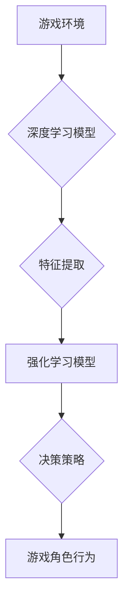

> 深度学习，游戏AI，强化学习，神经网络，迁移学习，游戏开发

## 1. 背景介绍

游戏行业作为数字娱乐领域的重要支柱，近年来呈现出蓬勃发展的态势。随着游戏技术的不断进步，玩家对游戏体验的要求也越来越高。其中，人工智能（AI）技术在游戏开发中的应用，成为推动游戏行业发展的重要驱动力。

游戏AI是指在游戏中模拟智能行为的计算机程序。传统的游戏AI通常基于规则和脚本，难以实现复杂、灵活的行为。而深度学习作为机器学习领域的一项重要突破，为游戏AI的发展带来了新的机遇。

深度学习算法能够从海量数据中学习，并自动提取特征，从而实现更逼真的游戏AI。例如，深度学习可以用于训练游戏角色的对话系统、路径规划算法、决策机制等，使游戏角色更加智能、人性化。

## 2. 核心概念与联系

### 2.1 深度学习

深度学习是一种基于人工神经网络的机器学习算法。它由多层神经元组成，能够学习复杂的数据模式。深度学习算法在图像识别、语音识别、自然语言处理等领域取得了显著的成果。

### 2.2 强化学习

强化学习是一种机器学习算法，它通过奖励和惩罚机制来训练智能体，使其在特定环境中学习最优策略。在游戏中，强化学习可以用于训练游戏角色的决策机制，使其能够做出最有利于自身利益的行动。

### 2.3 游戏AI与深度学习的结合

深度学习和强化学习的结合，为游戏AI的发展带来了新的突破。深度学习可以用于提取游戏环境和角色状态的特征，而强化学习可以用于训练游戏角色的决策机制。

**Mermaid 流程图**



## 3. 核心算法原理 & 具体操作步骤

### 3.1 算法原理概述

深度学习与强化学习结合的算法原理，主要包括以下几个方面：

* **深度神经网络:** 用于提取游戏环境和角色状态的特征。
* **强化学习算法:** 用于训练游戏角色的决策机制。
* **奖励机制:** 用于引导游戏角色的行为，使其朝着目标方向发展。

### 3.2 算法步骤详解

1. **环境建模:** 建立游戏环境的数学模型，包括游戏规则、角色状态、游戏目标等。
2. **特征提取:** 使用深度神经网络从游戏环境和角色状态中提取特征。
3. **策略网络训练:** 使用强化学习算法训练策略网络，使其能够根据提取的特征做出最优决策。
4. **游戏角色行为:** 根据策略网络的输出，控制游戏角色的行为。
5. **奖励反馈:** 根据游戏角色的行为结果，给予相应的奖励或惩罚。
6. **模型更新:** 使用奖励反馈信息更新策略网络的参数，使其不断改进决策能力。

### 3.3 算法优缺点

**优点:**

* **学习能力强:** 深度学习算法能够从海量数据中学习，并自动提取特征，从而实现更逼真的游戏AI。
* **适应性强:** 强化学习算法能够根据环境变化不断调整策略，使游戏AI更加灵活。
* **可扩展性强:** 深度学习模型可以很容易地扩展到更复杂的场景。

**缺点:**

* **训练时间长:** 深度学习模型的训练需要大量的计算资源和时间。
* **数据依赖性强:** 深度学习算法需要大量的训练数据，否则难以达到理想的效果。
* **可解释性差:** 深度学习模型的决策过程难以解释，这可能会导致模型的不可信赖性。

### 3.4 算法应用领域

深度学习与强化学习结合的算法，在游戏AI领域有着广泛的应用，例如：

* **游戏角色行为:** 训练游戏角色的对话系统、路径规划算法、决策机制等。
* **游戏难度调节:** 根据玩家的技能水平自动调节游戏难度。
* **游戏剧情生成:** 基于玩家的行为和选择，自动生成游戏剧情。
* **游戏辅助工具:** 开发游戏辅助工具，例如自动战斗、自动寻路等。

## 4. 数学模型和公式 & 详细讲解 & 举例说明

### 4.1 数学模型构建

在深度学习与强化学习的结合中，常用的数学模型包括：

* **状态空间:** 表示游戏环境的所有可能状态。
* **动作空间:** 表示游戏角色可以执行的所有动作。
* **奖励函数:** 用于评估游戏角色的行为结果。
* **价值函数:** 用于评估游戏角色在特定状态下的预期奖励。
* **策略函数:** 用于决定游戏角色在特定状态下执行的动作。

### 4.2 公式推导过程

强化学习算法的核心是价值函数的估计和策略函数的优化。常用的价值函数估计方法包括：

* **蒙特卡罗方法:** 通过模拟游戏进行多次试验，并根据试验结果估计价值函数。
* **时间差分学习:** 通过不断更新价值函数，使其逼近真实价值函数。

策略函数的优化可以使用梯度下降算法，例如：

$$
\theta = \theta - \alpha \nabla J(\theta)
$$

其中：

* $\theta$ 是策略网络的参数。
* $\alpha$ 是学习率。
* $J(\theta)$ 是策略网络的损失函数。

### 4.3 案例分析与讲解

例如，在游戏中训练一个角色的路径规划算法，可以使用深度学习提取地图特征，并使用强化学习训练策略网络。

* **状态空间:** 地图上的所有位置。
* **动作空间:** 角色可以移动的方向。
* **奖励函数:** 当角色到达目标位置时给予奖励，否则不给予奖励。
* **价值函数:** 估计角色在特定位置的预期奖励。
* **策略函数:** 决定角色在特定位置移动的方向。

通过训练策略网络，角色能够学习最优的路径，从而到达目标位置。

## 5. 项目实践：代码实例和详细解释说明

### 5.1 开发环境搭建

* **操作系统:** Ubuntu 18.04
* **编程语言:** Python 3.6
* **深度学习框架:** TensorFlow 2.0
* **强化学习库:** OpenAI Gym

### 5.2 源代码详细实现

```python
import tensorflow as tf
import gym

# 定义游戏环境
env = gym.make('CartPole-v1')

# 定义深度神经网络模型
model = tf.keras.models.Sequential([
    tf.keras.layers.Dense(128, activation='relu', input_shape=(4,)),
    tf.keras.layers.Dense(64, activation='relu'),
    tf.keras.layers.Dense(2, activation='softmax')
])

# 定义强化学习算法
optimizer = tf.keras.optimizers.Adam(learning_rate=0.001)

# 训练循环
for episode in range(1000):
    state = env.reset()
    done = False
    total_reward = 0

    while not done:
        # 选择动作
        action = tf.argmax(model(tf.expand_dims(state, 0))).numpy()[0]

        # 执行动作
        next_state, reward, done, _ = env.step(action)

        # 更新状态
        state = next_state

        # 计算损失
        with tf.GradientTape() as tape:
            prediction = model(tf.expand_dims(state, 0))
            loss = tf.keras.losses.CategoricalCrossentropy()(tf.one_hot(action, depth=2), prediction)

        # 反向传播
        gradients = tape.gradient(loss, model.trainable_variables)
        optimizer.apply_gradients(zip(gradients, model.trainable_variables))

        # 更新总奖励
        total_reward += reward

    print(f'Episode {episode+1}, Total Reward: {total_reward}')

# 保存模型
model.save('cartpole_model.h5')
```

### 5.3 代码解读与分析

* 代码首先定义了游戏环境和深度神经网络模型。
* 然后定义了强化学习算法，并使用Adam优化器进行训练。
* 训练循环中，首先根据当前状态选择动作，然后执行动作并更新状态。
* 计算损失函数并反向传播，更新模型参数。
* 最后保存训练好的模型。

### 5.4 运行结果展示

训练完成后，模型能够控制游戏角色在CartPole环境中保持平衡，并获得较高的奖励。

## 6. 实际应用场景

### 6.1 游戏角色行为

* **对话系统:** 使用深度学习训练游戏角色的对话系统，使其能够与玩家进行自然流畅的对话。
* **路径规划:** 使用强化学习训练游戏角色的路径规划算法，使其能够在复杂环境中找到最优路径。
* **决策机制:** 使用深度学习训练游戏角色的决策机制，使其能够做出更智能、更人性化的决策。

### 6.2 游戏难度调节

根据玩家的技能水平，自动调节游戏难度，使游戏更加具有挑战性和趣味性。

### 6.3 游戏剧情生成

基于玩家的行为和选择，自动生成游戏剧情，使游戏更加具有可玩性和沉浸感。

### 6.4 未来应用展望

* **更逼真的游戏AI:** 深度学习和强化学习技术的不断发展，将使游戏AI更加逼真、智能。
* **个性化游戏体验:** 基于玩家的行为数据，深度学习可以为玩家提供个性化的游戏体验。
* **游戏辅助工具:** 深度学习可以用于开发更智能的游戏辅助工具，例如自动战斗、自动寻路等。

## 7. 工具和资源推荐

### 7.1 学习资源推荐

* **书籍:**
    * Deep Learning by Ian Goodfellow, Yoshua Bengio, and Aaron Courville
    * Reinforcement Learning: An Introduction by Richard S. Sutton and Andrew G. Barto
* **在线课程:**
    * Deep Learning Specialization by Andrew Ng (Coursera)
    * Reinforcement Learning by David Silver (DeepMind)

### 7.2 开发工具推荐

* **深度学习框架:** TensorFlow, PyTorch, Keras
* **强化学习库:** OpenAI Gym, Stable Baselines3

### 7.3 相关论文推荐

* **Deep Reinforcement Learning with Double Q-learning**
* **Proximal Policy Optimization Algorithms**
* **Asynchronous Methods for Deep Reinforcement Learning**

## 8. 总结：未来发展趋势与挑战

### 8.1 研究成果总结

深度学习与强化学习的结合，为游戏AI的发展带来了新的突破，使游戏AI更加逼真、智能。

### 8.2 未来发展趋势

* **更强大的模型:** 深度学习模型的规模和复杂度将不断提高，从而实现更逼真的游戏AI。
* **更有效的算法:** 强化学习算法将不断改进，使其能够更快、更有效地训练游戏AI。
* **更广泛的应用:** 深度学习与强化学习将应用于更多类型的游戏，例如策略游戏、角色扮演游戏等。

### 8.3 面临的挑战

* **数据获取和标注:** 深度学习算法需要大量的训练数据，而游戏数据获取和标注成本较高。
* **模型解释性:** 深度学习模型的决策过程难以解释，这可能会导致模型的不可信赖性。
* **计算资源:** 训练深度学习模型需要大量的计算资源，这可能会限制模型的规模和复杂度。

### 8.4 研究展望

未来，研究人员将继续探索深度学习与强化学习在游戏AI领域的应用，并致力于解决上述挑战，推动游戏AI技术的发展。

## 9. 附录：常见问题与解答

* **Q1: 深度学习与强化学习的区别是什么？**

* **A1:** 深度学习是一种机器学习算法，它能够从数据中学习特征，而强化学习是一种机器学习算法，它通过奖励和惩罚机制来训练智能体，使其在特定环境中学习最优策略。

* **Q2: 如何训练深度学习模型？**

* **A2:** 训练深度学习模型需要大量的训练数据和计算资源。常用的训练方法包括监督学习、无监督学习和强化学习。

* **Q