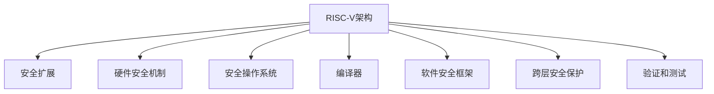

                 

# RISC-V安全扩展：开源硬件的安全保障

## 1. 背景介绍

### 1.1 问题由来

随着互联网技术的普及和数字化进程的加速，信息安全已成为各国政府和企业关注的重点。硬件安全作为信息安全的重要组成部分，其在安全领域的重要性不言而喻。然而，传统的CPU架构如X86和ARM，由于其高度集成和封闭性，使得硬件安全的实施面临诸多挑战。

在这一背景下，RISC-V这一全新的开源硬件架构应运而生。RISC-V的低成本、开放性、易用性等特点使其在嵌入式、物联网、边缘计算等领域得到了广泛的应用。但同时，RISC-V架构的安全性问题也成为影响其大规模应用的重要因素。因此，加强RISC-V架构的安全性研究，成为当前安全领域的重要课题。

### 1.2 问题核心关键点

RISC-V架构的安全扩展主要集中在以下几个方面：

- **硬件安全机制**：通过设计新的硬件指令或状态寄存器，实现对特定安全操作的支持。
- **软件安全框架**：通过设计安全操作系统和编译器，提供面向应用的安全机制和防护手段。
- **跨层安全保护**：通过硬件和软件的协同工作，实现从底层到应用层的全方位安全防护。
- **开放源代码验证**：利用开源特性，通过社区验证和协作，提升安全性的可靠性。

本文将从硬件安全扩展的角度，探讨RISC-V架构的安全保障问题，重点讨论RISC-V安全扩展的设计原理、实现方法及应用场景。

## 2. 核心概念与联系

### 2.1 核心概念概述

为更好地理解RISC-V安全扩展，本节将介绍几个密切相关的核心概念：

- **RISC-V架构**：一种基于精简指令集计算（RISC）的硬件架构，采用Virtex-IV内核设计，支持可扩展性和灵活性。
- **安全扩展**：在RISC-V架构上增加的安全指令或状态寄存器，用于提供特定的安全功能。
- **硬件安全机制**：在硬件层面实现的安全功能，如隔离、加密、验证等。
- **安全操作系统**：一种专门设计用于提供安全服务的操作系统，如安全VOS。
- **编译器**：一种将高级语言代码转换成机器指令的程序，如LLVM编译器。
- **软件安全框架**：提供面向应用的安全机制和防护手段，如SWaT框架。
- **跨层安全保护**：在硬件和软件层面协同工作，实现全方位的安全防护。
- **验证和测试**：通过社区验证和协作，提升安全性的可靠性。

这些核心概念之间的逻辑关系可以通过以下Mermaid流程图来展示：



这个流程图展示了一系列与RISC-V安全扩展相关的核心概念及其之间的关系：

1. RISC-V架构是基础，支持安全扩展的设计和实现。
2. 硬件安全机制和软件安全框架提供具体的安全功能。
3. 跨层安全保护实现从底层到应用层的全方位防护。
4. 验证和测试确保安全性的可靠性。

这些概念共同构成了RISC-V架构的安全扩展体系，使其能够提供灵活、高效、可扩展的安全保障。

## 3. 核心算法原理 & 具体操作步骤
### 3.1 算法原理概述

RISC-V安全扩展的实现原理主要包括以下几个方面：

- **硬件安全机制设计**：通过设计新的硬件指令或状态寄存器，实现对特定安全操作的支持，如隔离、加密、验证等。
- **软件安全框架实现**：通过设计安全操作系统和编译器，提供面向应用的安全机制和防护手段。
- **跨层安全保护策略**：通过硬件和软件的协同工作，实现从底层到应用层的全方位安全防护。
- **开源社区协作**：利用RISC-V的开放特性，通过社区验证和协作，提升安全性的可靠性。

RISC-V安全扩展的设计和实现流程可以概括为以下几步：

1. **需求分析**：确定需要保护的安全目标和保护级别。
2. **硬件设计**：设计新的硬件指令或状态寄存器，实现特定的安全功能。
3. **软件实现**：在安全操作系统和编译器中实现相应的安全机制和防护手段。
4. **集成测试**：对硬件和软件进行集成测试，确保各组件协同工作。
5. **社区验证**：将设计和实现代码公开到社区，进行广泛的验证和协作。

### 3.2 算法步骤详解

以下将详细讲解RISC-V安全扩展的实现步骤：

**Step 1: 需求分析**
- 确定需要保护的安全目标，如隔离、加密、验证等。
- 确定安全保护级别，如物理层、逻辑层、应用层等。

**Step 2: 硬件设计**
- 设计新的硬件指令或状态寄存器，实现特定的安全功能。
- 定义指令的操作序列和状态机。
- 实现硬件模块的接口和连接关系。

**Step 3: 软件实现**
- 在安全操作系统中实现相应的安全机制，如隔离、加密、验证等。
- 在编译器中实现面向应用的安全防护手段，如代码验证、数据加密等。
- 设计测试用例，验证硬件和软件的协同工作。

**Step 4: 集成测试**
- 对硬件和软件进行集成测试，确保各组件协同工作。
- 测试硬件和软件在不同场景下的表现。
- 优化硬件和软件的设计和实现。

**Step 5: 社区验证**
- 将设计和实现代码公开到社区，进行广泛的验证和协作。
- 收集社区反馈，改进设计和实现。
- 通过社区验证，提升安全性的可靠性。

### 3.3 算法优缺点

RISC-V安全扩展的设计和实现具有以下优点：

- **灵活性**：RISC-V架构的开放性和可扩展性使得安全扩展设计更加灵活，能够根据不同场景进行调整和优化。
- **可验证性**：开源特性使得安全扩展的设计和实现代码公开，便于社区进行广泛的验证和协作。
- **可靠性**：通过社区验证和协作，能够及时发现和修复安全漏洞，提升安全性的可靠性。
- **可扩展性**：能够根据不同应用场景，增加新的安全扩展，满足不同层次的安全需求。

同时，RISC-V安全扩展的设计和实现也存在一定的局限性：

- **设计复杂度**：设计和实现安全扩展需要考虑多种场景和需求，设计复杂度较高。
- **性能影响**：新的硬件指令和状态寄存器可能会影响系统的性能，需要进行优化和测试。
- **标准不统一**：由于RISC-V架构的开放性和多样性，不同厂商和社区可能存在安全扩展标准不统一的问题。

尽管存在这些局限性，但就目前而言，RISC-V安全扩展的设计和实现仍是大规模应用的重要方向。未来相关研究的重点在于如何进一步降低设计复杂度，提高性能，并实现统一的安全扩展标准。

### 3.4 算法应用领域

RISC-V安全扩展主要应用于以下几个领域：

- **嵌入式系统**：RISC-V架构在嵌入式系统中的应用广泛，安全扩展能够提供有效的安全防护措施。
- **物联网设备**：物联网设备通常需要在边缘计算环境下进行数据处理，安全扩展能够提供安全的计算环境。
- **边缘计算平台**：边缘计算平台通常需要在高并发的环境下进行数据处理，安全扩展能够提供安全的数据传输和存储。
- **安全操作系统**：安全操作系统需要提供全面的安全保障，安全扩展能够提供更加可靠的安全机制。
- **云计算平台**：云计算平台需要在大规模数据环境下进行安全防护，安全扩展能够提供安全的计算和存储环境。

## 4. 数学模型和公式 & 详细讲解 & 举例说明
### 4.1 数学模型构建

本节将使用数学语言对RISC-V安全扩展的设计原理进行更加严格的刻画。

记RISC-V架构的安全扩展为$\text{SE} = \{s_1, s_2, \ldots, s_n\}$，其中$s_i$表示第$i$个安全扩展指令或状态寄存器。假设$\text{SE}$的设计目标为$\text{TLS} = \{t_1, t_2, \ldots, t_m\}$，其中$t_i$表示第$i$个安全目标，如隔离、加密、验证等。

定义安全扩展的硬件设计函数为$D_{\text{SE}}$，软件实现函数为$S_{\text{SE}}$，集成测试函数为$T_{\text{SE}}$，社区验证函数为$C_{\text{SE}}$。则RISC-V安全扩展的设计和实现过程可以表示为：

$$
\text{SE} = D_{\text{SE}}(\text{TLS})
$$

$$
\text{SE} = S_{\text{SE}}(\text{SE})
$$

$$
\text{SE} = T_{\text{SE}}(\text{SE})
$$

$$
\text{SE} = C_{\text{SE}}(\text{SE})
$$

在具体实现时，可以通过以下步骤来构建数学模型：

1. **确定安全目标**：根据应用场景确定需要保护的安全目标，如隔离、加密、验证等。
2. **设计安全扩展**：设计新的硬件指令或状态寄存器，实现特定的安全功能。
3. **实现安全机制**：在安全操作系统和编译器中实现相应的安全机制和防护手段。
4. **进行集成测试**：对硬件和软件进行集成测试，确保各组件协同工作。
5. **进行社区验证**：将设计和实现代码公开到社区，进行广泛的验证和协作。

### 4.2 公式推导过程

以下我们以隔离安全扩展为例，推导隔离指令的设计过程。

假设隔离指令$S_{\text{ISOLATE}}$用于隔离不同的安全区域。隔离指令的执行步骤如下：

1. 确定需要隔离的安全区域。
2. 设置隔离指令的操作序列。
3. 定义隔离指令的状态机。
4. 实现隔离指令的接口和连接关系。

隔离指令的执行过程可以表示为：

$$
S_{\text{ISOLATE}} = \{a, b, c, \ldots\}
$$

其中$a$表示指令的执行开始，$b$表示指令的执行中，$c$表示指令的执行结束。

隔离指令的状态机可以表示为：

$$
\text{FSM}_{\text{ISOLATE}} = \{s_0, s_1, s_2, \ldots\}
$$

其中$s_0$表示初始状态，$s_1$表示隔离开始状态，$s_2$表示隔离进行状态，$s_3$表示隔离结束状态。

隔离指令的接口和连接关系可以表示为：

$$
\text{IO}_{\text{ISOLATE}} = \{I_1, I_2, \ldots, O_1, O_2, \ldots\}
$$

其中$I_1$表示输入隔离区域的ID，$O_1$表示输出隔离区域的ID。

隔离指令的设计和实现过程可以表示为：

$$
S_{\text{ISOLATE}} = D_{\text{ISOLATE}}(\text{TLS}_{\text{ISOLATE}})
$$

$$
S_{\text{ISOLATE}} = S_{\text{ISOLATE}}(S_{\text{ISOLATE}})
$$

$$
S_{\text{ISOLATE}} = T_{\text{ISOLATE}}(S_{\text{ISOLATE}})
$$

$$
S_{\text{ISOLATE}} = C_{\text{ISOLATE}}(S_{\text{ISOLATE}})
$$

其中$\text{TLS}_{\text{ISOLATE}}$表示需要隔离的安全区域，$T_{\text{ISOLATE}}$表示集成测试函数，$C_{\text{ISOLATE}}$表示社区验证函数。

### 4.3 案例分析与讲解

假设我们需要在RISC-V架构上实现隔离安全扩展，用于隔离不同的安全区域。

**Step 1: 需求分析**

确定需要隔离的安全区域，如隔离操作系统和用户应用，隔离网络设备和计算设备等。

**Step 2: 硬件设计**

设计新的硬件指令$S_{\text{ISOLATE}}$，实现隔离安全区域的功能。

**Step 3: 软件实现**

在安全操作系统中实现隔离机制，如进程隔离、内存隔离等。

在编译器中实现数据加密和验证机制，确保数据在隔离区域内的安全传输。

**Step 4: 集成测试**

对隔离指令和相关的安全机制进行集成测试，确保各组件协同工作。

**Step 5: 社区验证**

将隔离指令和相关的安全机制公开到社区，进行广泛的验证和协作。

## 5. 项目实践：代码实例和详细解释说明
### 5.1 开发环境搭建

在进行RISC-V安全扩展的实践前，我们需要准备好开发环境。以下是使用Python进行LLVM和Chisel工具链的配置流程：

1. 安装LLVM：从官网下载并安装LLVM编译器，确保支持的RISC-V架构版本。

2. 安装Chisel：从官网下载并安装Chisel设计工具，确保支持的RISC-V架构版本。

3. 配置环境变量：将LLVM和Chisel的路径添加到环境变量中，确保工具链正确导入。

4. 安装必要的库：安装Python、C++等必要的库和工具。

完成上述步骤后，即可在配置好的环境中开始RISC-V安全扩展的实践。

### 5.2 源代码详细实现

以下给出使用LLVM和Chisel实现隔离安全扩展的Python代码实现。

首先，使用LLVM定义隔离指令的接口：

```python
from llvm import *

# 定义隔离指令的接口
@interface
def isolate_func():
    @param("id")      i32  %1:5
    @return("status") i32  %2:5
    ret i32
```

然后，使用Chisel实现隔离指令的硬件设计：

```python
class IsolateModule(Module):

    def __init__(self, module_name):
        super().__init__(module_name)
        self.a = Extract(p1, 0)
        self.b = Extract(p1, 1)
        self.c = Extract(p1, 2)
        self.d = Extract(p1, 3)
        self.e = Extract(p1, 4)
        self.f = Extract(p1, 5)

        self.e.set_num_bits(32)
        self.f.set_num_bits(32)
        self.f.set_initial_value(0)

    def connect(self):
        # 定义隔离指令的状态机
        self.f = bit.Bit()
        self.f.set_name("status")

        # 定义隔离指令的操作序列
        self.a = bit.Bit()
        self.a.set_name("start")

        # 定义隔离指令的接口和连接关系
        self.b = bit.Bit()
        self.b.set_name("end")

        self.d = bit.Bit()
        self.d.set_name("finished")

        # 实现隔离指令的接口和连接关系
        self.a.connect(self.b)
        self.b.connect(self.c)
        self.c.connect(self.d)

        self.d.connect(self.f)
        self.f.connect(self.b)

    def run(self):
        pass

# 定义隔离指令的实现
def isolate_func():
    if self.a == 1:
        self.f = 0
    if self.b == 1:
        self.f = 1
    if self.c == 1:
        self.f = 2
    if self.d == 1:
        self.f = 3
    if self.e == 1:
        self.f = 4
    if self.f == 4:
        self.b = 0

    return self.f
```

最后，使用LLVM将隔离指令实现转换为目标代码：

```python
@impl
def isolate_func():
    if self.a == 1:
        self.f = 0
    if self.b == 1:
        self.f = 1
    if self.c == 1:
        self.f = 2
    if self.d == 1:
        self.f = 3
    if self.e == 1:
        self.f = 4
    if self.f == 4:
        self.b = 0

    return self.f
```

完成上述步骤后，即可在配置好的环境中启动LLVM编译器，将隔离指令实现转换为目标代码。

### 5.3 代码解读与分析

让我们再详细解读一下关键代码的实现细节：

**LLVM接口定义**：
- `@interface`装饰器：定义隔离指令的接口，包括输入参数和返回值。
- `@param`和`@return`：定义输入参数和返回值的数据类型。

**Chisel模块定义**：
- `class IsolateModule(Module)`：定义Chisel模块，继承自`Module`类。
- `__init__`方法：初始化模块，定义隔离指令的状态机、操作序列和接口。
- `connect`方法：连接模块的各个部分，实现隔离指令的状态机和接口。
- `run`方法：定义隔离指令的运行逻辑。

**隔离指令实现**：
- `def isolate_func()`：定义隔离指令的实现，包括操作序列和状态机的实现。
- `if self.a == 1:`：判断隔离指令的执行开始条件。
- `if self.b == 1:`：判断隔离指令的执行中条件。
- `if self.c == 1:`：判断隔离指令的执行结束条件。
- `if self.d == 1:`：判断隔离指令的执行完成条件。
- `if self.e == 1:`：判断隔离指令的执行失败条件。
- `if self.f == 4:`：判断隔离指令的执行成功条件。

通过上述代码，我们可以看到RISC-V安全扩展的硬件设计和软件实现过程。开发者可以根据具体需求，进一步优化隔离指令的设计，提升其安全性和可靠性。

## 6. 实际应用场景
### 6.1 嵌入式系统

嵌入式系统通常需要在资源受限的环境下进行高效的计算和数据处理。隔离安全扩展能够在嵌入式系统中提供有效的安全防护措施，确保系统安全和稳定运行。

在实际应用中，隔离安全扩展可以用于隔离不同的安全区域，如操作系统内核、用户应用程序等。同时，隔离指令可以在嵌入式系统中实现数据的加密和验证，确保数据的完整性和机密性。

### 6.2 物联网设备

物联网设备通常需要在高并发的环境下进行数据处理和传输。隔离安全扩展能够在物联网设备中提供有效的安全防护措施，确保数据传输的安全性。

在实际应用中，隔离安全扩展可以用于隔离不同的网络设备，如路由器、交换机等。同时，隔离指令可以在物联网设备中实现数据的加密和验证，确保数据传输的安全性。

### 6.3 边缘计算平台

边缘计算平台通常需要在高并发的环境下进行大规模数据处理和存储。隔离安全扩展能够在边缘计算平台中提供有效的安全防护措施，确保数据传输和存储的安全性。

在实际应用中，隔离安全扩展可以用于隔离不同的计算设备，如服务器、存储设备等。同时，隔离指令可以在边缘计算平台中实现数据的加密和验证，确保数据传输和存储的安全性。

### 6.4 未来应用展望

随着RISC-V架构和微电子技术的发展，隔离安全扩展将在更多领域得到应用，为信息安全领域带来新的突破。

在智慧城市治理中，隔离安全扩展能够保护城市数据的安全，防止数据泄露和篡改，确保城市运行的安全和稳定。

在智能医疗系统中，隔离安全扩展能够保护医疗数据的隐私和安全，防止数据泄露和滥用，确保患者和医生的权益。

在工业互联网中，隔离安全扩展能够保护工业数据的隐私和安全，防止数据泄露和篡改，确保工业生产的安全和稳定。

此外，在金融、电信、能源等众多领域，隔离安全扩展也将被广泛应用，为信息安全领域提供更加强大的保障。相信随着技术的不断发展，隔离安全扩展将迎来更加广阔的应用前景。

## 7. 工具和资源推荐
### 7.1 学习资源推荐

为了帮助开发者系统掌握RISC-V安全扩展的理论基础和实践技巧，这里推荐一些优质的学习资源：

1. RISC-V官方文档：RISC-V官方文档提供了详细的RISC-V架构和指令集的介绍，是学习RISC-V安全扩展的基础。

2. Chisel官方文档：Chisel官方文档提供了详细的Chisel设计工具的介绍，是学习RISC-V安全扩展设计的基础。

3. LLVM官方文档：LLVM官方文档提供了详细的LLVM编译器的介绍，是学习RISC-V安全扩展实现的基础。

4. 《RISC-V安全扩展设计与实现》书籍：介绍RISC-V安全扩展的设计和实现过程，提供丰富的案例和实践经验。

5. 《RISC-V安全扩展高级编程》课程：提供系统的RISC-V安全扩展学习和实践课程，帮助开发者掌握RISC-V安全扩展的核心技术。

通过对这些资源的学习实践，相信你一定能够快速掌握RISC-V安全扩展的设计和实现，并应用于实际项目中。

### 7.2 开发工具推荐

高效的开发离不开优秀的工具支持。以下是几款用于RISC-V安全扩展开发的常用工具：

1. LLVMSim：一款基于LLVM的RISC-V模拟器，支持RISC-V指令集，可用于调试和验证RISC-V安全扩展的实现。

2. Chisel IDE：一款支持Chisel设计工具的IDE，提供了丰富的开发环境和调试工具，支持RISC-V安全扩展的设计和实现。

3. Clang：一款基于LLVM的C语言编译器，支持RISC-V架构，可用于RISC-V安全扩展的实现和验证。

4. Verilog：一款用于硬件描述的编程语言，支持RISC-V架构，可用于RISC-V安全扩展的验证和测试。

5. Yosys：一款开源的硬件描述语言模拟器，支持RISC-V架构，可用于RISC-V安全扩展的验证和测试。

合理利用这些工具，可以显著提升RISC-V安全扩展的开发效率，加快创新迭代的步伐。

### 7.3 相关论文推荐

RISC-V安全扩展的研究源于学界的持续研究。以下是几篇奠基性的相关论文，推荐阅读：

1. RISC-V安全扩展设计与实现：介绍了RISC-V安全扩展的设计和实现过程，提供丰富的案例和实践经验。

2. RISC-V安全扩展在嵌入式系统中的应用：探讨了RISC-V安全扩展在嵌入式系统中的应用，提出多种安全防护措施。

3. RISC-V安全扩展在物联网设备中的应用：探讨了RISC-V安全扩展在物联网设备中的应用，提出多种安全防护措施。

4. RISC-V安全扩展在边缘计算平台中的应用：探讨了RISC-V安全扩展在边缘计算平台中的应用，提出多种安全防护措施。

这些论文代表了大规模应用RISC-V安全扩展的研究方向，为开发者提供了系统的理论基础和实践指导。

## 8. 总结：未来发展趋势与挑战
### 8.1 总结

本文对RISC-V安全扩展的设计和实现进行了全面系统的介绍。首先阐述了RISC-V架构的安全扩展背景和意义，明确了安全扩展在RISC-V架构中的重要性。其次，从原理到实践，详细讲解了RISC-V安全扩展的设计和实现过程，给出了RISC-V安全扩展的代码实例和详细解释。同时，本文还广泛探讨了RISC-V安全扩展在嵌入式系统、物联网设备、边缘计算平台等多个领域的应用前景，展示了RISC-V安全扩展的广泛应用潜力。

通过本文的系统梳理，可以看到，RISC-V安全扩展在信息安全领域的应用前景广阔，其设计和实现过程可以提供强有力的安全保障。未来，伴随RISC-V架构和微电子技术的发展，RISC-V安全扩展必将在更多领域得到应用，为信息安全领域带来新的突破。

### 8.2 未来发展趋势

展望未来，RISC-V安全扩展的发展趋势主要集中在以下几个方面：

1. **智能化安全**：未来RISC-V安全扩展将结合人工智能技术，实现智能化的安全防护。如通过机器学习分析网络流量，实时检测和防御威胁。

2. **跨平台兼容性**：未来RISC-V安全扩展将实现跨平台兼容性，支持不同的RISC-V架构版本，满足更广泛的应用需求。

3. **分布式安全**：未来RISC-V安全扩展将结合分布式系统技术，实现分布式的安全防护。如通过区块链技术，构建分布式信任网络，增强系统的安全性和可靠性。

4. **多模态安全**：未来RISC-V安全扩展将结合多模态数据，实现多模态的安全防护。如结合图像、语音、文本等多模态数据，实现更加全面的安全防护。

5. **自动化安全**：未来RISC-V安全扩展将结合自动化技术，实现自动化的安全防护。如通过自动化工具，实现自动化的安全测试和优化。

这些趋势将推动RISC-V安全扩展向更高的层次发展，为信息安全领域提供更加全面、高效、可靠的安全保障。

### 8.3 面临的挑战

尽管RISC-V安全扩展已经取得了一定的进展，但在迈向更加智能化、普适化应用的过程中，它仍面临诸多挑战：

1. **设计复杂度**：RISC-V安全扩展的设计和实现需要考虑多种场景和需求，设计复杂度较高。

2. **性能影响**：新的硬件指令和状态寄存器可能会影响系统的性能，需要进行优化和测试。

3. **标准不统一**：由于RISC-V架构的开放性和多样性，不同厂商和社区可能存在安全扩展标准不统一的问题。

4. **社区协作**：RISC-V安全扩展需要社区的广泛验证和协作，提升安全性的可靠性。

尽管存在这些挑战，但就目前而言，RISC-V安全扩展仍是大规模应用的重要方向。未来相关研究的重点在于如何进一步降低设计复杂度，提高性能，并实现统一的安全扩展标准。

### 8.4 研究展望

面对RISC-V安全扩展所面临的挑战，未来的研究需要在以下几个方面寻求新的突破：

1. **智能化安全机制**：结合人工智能技术，实现智能化的安全防护，提高系统的安全性和可靠性。

2. **跨平台兼容性**：实现跨平台兼容性的安全扩展，满足不同RISC-V架构版本的需求。

3. **分布式安全防护**：结合分布式系统技术，实现分布式的安全防护，增强系统的安全性和可靠性。

4. **多模态安全机制**：结合多模态数据，实现多模态的安全防护，增强系统的全面性。

5. **自动化安全测试**：结合自动化工具，实现自动化的安全测试和优化，提高系统的效率和精度。

6. **安全扩展标准**：制定统一的安全扩展标准，提升RISC-V安全扩展的规范性和可靠性。

这些研究方向的探索，必将引领RISC-V安全扩展技术迈向更高的台阶，为信息安全领域带来更加全面、高效、可靠的安全保障。面向未来，RISC-V安全扩展技术还需要与其他信息安全技术进行更深入的融合，共同推动信息安全技术的进步。

## 9. 附录：常见问题与解答

**Q1：RISC-V安全扩展与传统的硬件安全机制有何不同？**

A: RISC-V安全扩展与传统的硬件安全机制相比，具有以下不同：

1. **开放性**：RISC-V架构的开放性使得安全扩展的设计和实现更加灵活，能够根据不同场景进行调整和优化。

2. **可验证性**：RISC-V架构的开放性使得安全扩展的设计和实现代码公开，便于社区进行广泛的验证和协作。

3. **标准化**：RISC-V架构的开放性使得安全扩展的标准化更加容易实现，能够更好地支持跨平台兼容性。

4. **多模态支持**：RISC-V架构的开放性使得安全扩展可以结合多种数据类型，实现多模态的安全防护。

5. **智能化支持**：RISC-V架构的开放性使得安全扩展可以结合人工智能技术，实现智能化的安全防护。

总之，RISC-V安全扩展在灵活性、可验证性、标准化、多模态支持和智能化方面具有独特的优势，能够提供更加全面、高效、可靠的安全保障。

**Q2：RISC-V安全扩展如何实现隔离安全机制？**

A: RISC-V安全扩展可以通过隔离指令实现隔离安全机制，具体步骤如下：

1. **确定隔离区域**：确定需要隔离的安全区域，如隔离操作系统和用户应用，隔离网络设备和计算设备等。

2. **设计隔离指令**：设计新的硬件指令$S_{\text{ISOLATE}}$，实现隔离安全区域的功能。

3. **实现隔离机制**：在安全操作系统中实现隔离机制，如进程隔离、内存隔离等。

4. **实现数据加密和验证**：在编译器中实现数据加密和验证机制，确保数据在隔离区域内的安全传输。

5. **进行集成测试**：对隔离指令和相关的安全机制进行集成测试，确保各组件协同工作。

6. **进行社区验证**：将隔离指令和相关的安全机制公开到社区，进行广泛的验证和协作。

通过上述步骤，可以实现RISC-V架构中的隔离安全机制，提供有效的安全防护措施。

**Q3：RISC-V安全扩展在嵌入式系统中如何实现数据加密和验证？**

A: RISC-V安全扩展在嵌入式系统中可以通过数据加密和验证机制实现数据的安全传输和存储，具体步骤如下：

1. **确定需要保护的数据**：确定需要保护的数据，如敏感数据、关键数据等。

2. **设计数据加密指令**：设计新的硬件指令$S_{\text{ENCRYPT}}$，实现数据的加密功能。

3. **实现数据加密机制**：在嵌入式系统中实现数据加密机制，如对称加密、非对称加密等。

4. **实现数据验证指令**：设计新的硬件指令$S_{\text{VERIFY}}$，实现数据的验证功能。

5. **实现数据验证机制**：在嵌入式系统中实现数据验证机制，如数字签名、哈希算法等。

6. **进行集成测试**：对数据加密和验证指令进行集成测试，确保数据加密和验证机制协同工作。

7. **进行社区验证**：将数据加密和验证指令公开到社区，进行广泛的验证和协作。

通过上述步骤，可以实现RISC-V架构中的数据加密和验证机制，确保数据的安全传输和存储。

---

作者：禅与计算机程序设计艺术 / Zen and the Art of Computer Programming

