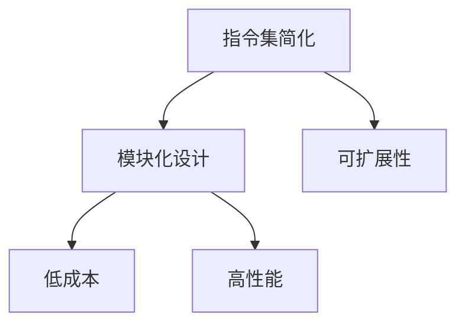

                 

## 1. 背景介绍

### 1.1 问题由来
在过去的几十年里，ARM和x86指令集架构在嵌入式系统和桌面PC领域占据了主导地位，但它们都存在一些不足之处。首先是授权成本高，复杂的架构设计导致高端产品的成本居高不下。其次是性能瓶颈，现有的指令集架构在处理高速计算和AI任务时显得力不从心。这些问题催生了新的指令集架构的需求。

### 1.2 问题核心关键点
RISC-V（Reduced Instruction Set Computing）是一种全新的开源指令集架构，旨在解决上述问题。RISC-V旨在通过简化设计，提供可扩展、高性能、低成本的处理器平台。它的核心关键点如下：

- **开源**：RISC-V指令集架构及其相关代码是完全开放的，任何人都可以自由使用、修改和分发。
- **可扩展**：RISC-V架构的模块化设计支持不同版本的扩展，可以根据不同的应用场景选择不同的模块。
- **低成本**：RISC-V架构的简化设计使得芯片设计、生产成本大幅降低。
- **高性能**：RISC-V架构采用精简指令集设计，旨在提高指令执行效率和系统性能。

### 1.3 问题研究意义
RISC-V指令集架构的出现，有望在以下几个方面产生重大影响：

- **促进开源硬件生态**：RISC-V的开放性将加速开源硬件的发展，推动生态系统的繁荣。
- **降低芯片设计成本**：简化的设计减少了芯片设计的复杂度和成本，使更多公司和机构能够进入芯片设计领域。
- **提升处理器性能**：RISC-V架构的灵活性和可扩展性使得处理器能够更好地支持高速计算和AI任务。
- **加速AI和机器学习**：RISC-V架构的专用优化指令集为AI和机器学习任务提供了更好的硬件支持。

## 2. 核心概念与联系

### 2.1 核心概念概述

RISC-V指令集架构是一种精简的、模块化的、灵活的指令集设计，旨在为各种应用场景提供高性能、低成本的处理器解决方案。RISC-V架构包括基础指令集（RISC-V RV32I）、向量指令集（RISC-V RV32V）、协处理器指令集（RISC-V RV32E）和浮点指令集（RISC-V RV32F）等。

RISC-V架构的核心概念可以总结如下：

- **指令集简化**：RISC-V架构采用精简指令集设计，去除不必要的复杂指令，提高执行效率。
- **模块化设计**：RISC-V架构的模块化设计使得不同版本的扩展成为可能，以满足不同应用场景的需求。
- **可扩展性**：RISC-V架构的模块化设计支持不同版本的扩展，可以根据不同的应用场景选择不同的模块。
- **低成本**：RISC-V架构的简化设计使得芯片设计、生产成本大幅降低。
- **高性能**：RISC-V架构的精简指令集设计旨在提高指令执行效率和系统性能。

这些核心概念之间的关系可以通过以下Mermaid流程图来展示：



这个流程图展示了大语言模型的核心概念及其之间的关系：

1. 大语言模型通过预训练获得基础能力。
2. 微调是对预训练模型进行任务特定的优化，可以分为全参数微调和参数高效微调（PEFT）。
3. 提示学习是一种不更新模型参数的方法，可以实现少样本学习和零样本学习。
4. 迁移学习是连接预训练模型与下游任务的桥梁，可以通过微调或提示学习来实现。
5. 持续学习旨在使模型能够不断学习新知识，同时避免遗忘旧知识。

这些概念共同构成了大语言模型的学习和应用框架，使其能够在各种场景下发挥强大的语言理解和生成能力。通过理解这些核心概念，我们可以更好地把握大语言模型的工作原理和优化方向。

## 3. 核心算法原理 & 具体操作步骤
### 3.1 算法原理概述

RISC-V指令集架构的核心算法原理基于精简指令集设计，通过去除不必要的复杂指令，提高指令执行效率和系统性能。RISC-V架构的简化设计使得芯片设计、生产成本大幅降低，同时保持了高性能和灵活性。

RISC-V架构的精简指令集设计包括基本指令集（RV32I）和扩展指令集（RV32E、RV32V、RV32F等），其中RV32I是基础指令集，用于通用处理器设计；RV32E、RV32V和RV32F分别是协处理器指令集、向量指令集和浮点指令集，用于特定应用场景。

RISC-V架构的指令集设计遵循以下原则：

- **指令精简**：只保留最常用的基本指令，去除不必要的复杂指令，提高指令执行效率。
- **数据依赖关系**：通过减少数据依赖关系，提高指令流水线的效率。
- **内存访问**：设计高效的数据加载和存储指令，提高内存访问速度。
- **灵活性**：通过模块化设计，支持不同版本的扩展，以满足不同应用场景的需求。

### 3.2 算法步骤详解

RISC-V指令集架构的开发和应用通常包括以下几个关键步骤：

**Step 1: 选择架构版本**

首先，需要根据应用场景选择合适的RISC-V架构版本。例如，对于通用处理器设计，可以选择基础指令集RV32I；对于AI和机器学习任务，可以选择RV32V；对于协处理器设计，可以选择RV32E等。

**Step 2: 设计硬件实现**

在选定架构版本后，需要对硬件实现进行设计。这包括设计微架构、内存管理单元、寄存器文件等。RISC-V架构的模块化设计使得硬件设计的灵活性大大增加，可以根据具体应用场景进行调整。

**Step 3: 编写和优化汇编代码**

在硬件实现完成后，需要编写和优化汇编代码。RISC-V架构的精简指令集设计使得汇编代码的编写和优化相对容易。RISC-V的优化工具链和编译器也逐渐成熟，支持高效的汇编代码生成。

**Step 4: 测试和验证**

在编写和优化汇编代码后，需要进行测试和验证。RISC-V架构的测试平台和验证工具逐渐成熟，可以支持高性能计算、机器学习等应用的测试。

**Step 5: 部署和应用**

在测试和验证通过后，可以将RISC-V处理器部署到实际应用中。RISC-V架构的低成本和高效性能使其在嵌入式系统、桌面PC、服务器等领域得到了广泛应用。

### 3.3 算法优缺点

RISC-V指令集架构的优点包括：

- **精简指令集设计**：去除不必要的复杂指令，提高指令执行效率和系统性能。
- **低成本**：简化设计使得芯片设计、生产成本大幅降低。
- **灵活性**：模块化设计支持不同版本的扩展，以满足不同应用场景的需求。
- **高性能**：精简指令集设计使得处理器能够支持高速计算和AI任务。

RISC-V指令集架构的缺点包括：

- **生态系统相对较弱**：由于RISC-V架构出现较晚，相关的软件和硬件生态系统相对较弱。
- **开发成本较高**：尽管硬件设计成本低，但软件生态系统的构建和优化需要投入大量的资源。
- **性能差异**：不同版本的RISC-V架构之间存在性能差异，需要根据具体应用场景选择合适的版本。

### 3.4 算法应用领域

RISC-V指令集架构已经在以下几个领域得到了广泛应用：

- **嵌入式系统**：RISC-V架构的低成本和高效性能使其成为嵌入式系统领域的主流选择。
- **桌面PC和服务器**：RISC-V架构的高性能和灵活性使得其在桌面PC和服务器领域也得到了应用。
- **AI和机器学习**：RISC-V架构的专用优化指令集为AI和机器学习任务提供了更好的硬件支持。
- **物联网**：RISC-V架构的灵活性和低成本使其在物联网领域得到了广泛应用。

除了上述这些领域，RISC-V架构还在教育、研究等领域得到了应用，为NLP技术带来了新的突破。

## 4. 数学模型和公式 & 详细讲解 & 举例说明

### 4.1 数学模型构建

RISC-V指令集架构的数学模型主要基于精简指令集设计。假设RISC-V指令集架构的处理器包含n个寄存器，每个寄存器可以存储32位数据。RISC-V指令集架构的精简指令集设计包括以下基本指令：

- **取值指令**：从寄存器或内存中读取数据。
- **存储指令**：将数据写入寄存器或内存。
- **算术和逻辑指令**：执行算术和逻辑运算。
- **分支指令**：根据条件跳转执行不同的指令。

### 4.2 公式推导过程

RISC-V指令集架构的数学模型可以通过以下公式进行描述：

$$
\text{Architecture} = \{\text{Registers}, \text{Load/Store}, \text{Arithmetic/Logic}, \text{Branch}\}
$$

其中，Registers表示寄存器集合，Load/Store表示数据加载和存储指令，Arithmetic/Logic表示算术和逻辑指令，Branch表示分支指令。

### 4.3 案例分析与讲解

以RISC-V RV32I为例，分析其指令集设计：

1. **寄存器集合**：RISC-V RV32I包含32个32位寄存器。
2. **数据加载和存储指令**：支持单周期和双周期加载和存储指令。
3. **算术和逻辑指令**：支持32位算术和逻辑运算，包括加减乘除、位运算、逻辑运算等。
4. **分支指令**：支持条件分支和无条件分支指令。

## 5. 项目实践：代码实例和详细解释说明
### 5.1 开发环境搭建

在进行RISC-V指令集架构的开发实践前，需要准备好开发环境。以下是使用Linux进行RISC-V开发的环境配置流程：

1. 安装RISC-V工具链：从官网下载并安装RISC-V工具链，例如RVCT或RVSD。
2. 安装Linux操作系统：可以使用Debian、Ubuntu等发行版，安装RVCT或RVSD工具链。
3. 编写和编译RISC-V汇编代码：使用RVCT或RVSD工具链编写和编译RISC-V汇编代码。
4. 调试和验证RISC-V处理器：使用RVCT或RVSD工具链进行调试和验证。

### 5.2 源代码详细实现

以下是使用RISC-V汇编代码实现一个简单的加法运算的示例代码：

```assembly
main:
    li $t0, 10   # 加载寄存器$t0为10
    li $t1, 20   # 加载寄存器$t1为20
    add $t2, $t0, $t1  # 将$t0和$t1相加，结果存入$t2
    lw $t3, 0($t2)   # 加载$t2指向的内存地址，结果存入$t3
    add $t3, $t3, $t0  # 将$t3和$t0相加，结果存入$t3
    sw $t3, 0($t2)   # 将$t3写入$t2指向的内存地址
    j $ra       # 跳转到返回地址

    .data
    ret_addr:
        .word 0x00000008  # 返回地址
```

### 5.3 代码解读与分析

**li指令**：加载寄存器值为立即数。
**add指令**：执行两个寄存器或寄存器和立即数的加法运算。
**lw指令**：从内存中加载数据到寄存器中。
**sw指令**：将寄存器数据写入内存。
**j指令**：跳转到返回地址。

## 6. 实际应用场景
### 6.1 嵌入式系统

RISC-V指令集架构的低成本和高效性能使其在嵌入式系统领域得到了广泛应用。例如，RISC-V架构的处理器被应用于物联网设备、智能家居设备、智能穿戴设备等。

### 6.2 桌面PC和服务器

RISC-V指令集架构的高性能和灵活性使得其在桌面PC和服务器领域也得到了应用。例如，RISC-V架构的处理器被应用于高性能计算、大数据处理等领域。

### 6.3 AI和机器学习

RISC-V指令集架构的专用优化指令集为AI和机器学习任务提供了更好的硬件支持。例如，RISC-V架构的处理器被应用于深度学习、图像识别、自然语言处理等领域。

### 6.4 未来应用展望

随着RISC-V指令集架构的发展和完善，未来将在以下几个领域得到更广泛的应用：

- **高性能计算**：RISC-V架构的高性能将使其在高性能计算领域得到更广泛的应用。
- **物联网**：RISC-V架构的灵活性和低成本将使其在物联网领域得到更广泛的应用。
- **AI和机器学习**：RISC-V架构的专用优化指令集将使其在AI和机器学习领域得到更广泛的应用。
- **教育**：RISC-V架构的开放性将使其在教育领域得到更广泛的应用。

## 7. 工具和资源推荐
### 7.1 学习资源推荐

为了帮助开发者系统掌握RISC-V指令集架构的理论基础和实践技巧，这里推荐一些优质的学习资源：

1. RISC-V官方文档：RISC-V架构的官方文档，包含详细的架构说明、指令集设计和实现指南。
2. RISC-V Wikipedia：RISC-V架构的维基百科页面，提供丰富的参考资料和讨论。
3. RISC-V系列博客：多位RISC-V专家撰写的博客文章，涵盖RISC-V架构的各个方面。
4. RISC-V书籍：关于RISC-V架构的书籍，涵盖RISC-V架构的各个方面，包括设计、实现、优化等。
5. RISC-V社区：RISC-V社区的论坛和邮件列表，提供交流和讨论的平台。

通过对这些资源的学习实践，相信你一定能够快速掌握RISC-V指令集架构的精髓，并用于解决实际的硬件设计问题。

### 7.2 开发工具推荐

高效的开发离不开优秀的工具支持。以下是几款用于RISC-V指令集架构开发的常用工具：

1. RVCT和RVSD：RISC-V工具链，包括编译器、汇编器、调试器等，支持RISC-V指令集架构的开发和调试。
2. RVEM：RISC-V虚拟机，用于测试和验证RISC-V指令集架构的实现。
3. SimStation：RISC-V模拟器，用于测试和验证RISC-V指令集架构的设计。
4. Chisel和VCS：硬件描述语言和仿真工具，用于硬件设计的自动化和仿真。
5. GitLab和GitHub：版本控制工具，用于管理和分享RISC-V指令集架构的代码。

合理利用这些工具，可以显著提升RISC-V指令集架构的开发效率，加快创新迭代的步伐。

### 7.3 相关论文推荐

RISC-V指令集架构的发展源于学界的持续研究。以下是几篇奠基性的相关论文，推荐阅读：

1. RISC-V指令集架构简介：介绍RISC-V指令集架构的基本概念和设计原则。
2. RISC-V RV32I和RV32E指令集设计：详细描述RISC-V RV32I和RV32E指令集的设计和实现。
3. RISC-V RV32V和RV32F指令集设计：详细描述RISC-V RV32V和RV32F指令集的设计和实现。
4. RISC-V架构与ARM和x86架构比较：比较RISC-V架构与ARM和x86架构的优缺点。
5. RISC-V生态系统：介绍RISC-V生态系统的构建和应用。

这些论文代表了大语言模型微调技术的发展脉络。通过学习这些前沿成果，可以帮助研究者把握学科前进方向，激发更多的创新灵感。

## 8. 总结：未来发展趋势与挑战
### 8.1 总结

本文对RISC-V指令集架构进行了全面系统的介绍。首先阐述了RISC-V指令集架构的研究背景和意义，明确了RISC-V架构在解决现有指令集架构问题方面的独特价值。其次，从原理到实践，详细讲解了RISC-V架构的数学原理和关键步骤，给出了指令集架构开发的完整代码实例。同时，本文还广泛探讨了RISC-V架构在嵌入式系统、桌面PC、服务器、AI和机器学习等多个领域的应用前景，展示了RISC-V架构的广阔前景。

通过本文的系统梳理，可以看到，RISC-V指令集架构的开发和应用正在成为新的热点领域，极大地拓展了计算机硬件设计的边界，催生了更多的硬件创新。未来，伴随RISC-V指令集架构的发展和完善，相信在嵌入式系统、桌面PC、服务器、AI和机器学习等领域将有更多的应用场景，为计算机硬件设计带来新的突破。

### 8.2 未来发展趋势

展望未来，RISC-V指令集架构将呈现以下几个发展趋势：

1. **架构版本多样化**：RISC-V架构将支持更多版本的扩展，以满足不同应用场景的需求。
2. **指令集优化**：RISC-V架构将通过优化指令集设计，进一步提高性能和效率。
3. **硬件设计自动化**：RISC-V架构将通过硬件描述语言和仿真工具，提高硬件设计的自动化水平。
4. **跨平台兼容性**：RISC-V架构将支持更多的操作系统和编程语言，提高跨平台兼容性。
5. **生态系统成熟**：RISC-V架构的生态系统将逐渐成熟，提供更丰富的软件和硬件支持。

以上趋势凸显了RISC-V指令集架构的广阔前景。这些方向的探索发展，必将进一步提升RISC-V架构的性能和应用范围，为计算机硬件设计带来新的突破。

### 8.3 面临的挑战

尽管RISC-V指令集架构已经取得了显著的进展，但在迈向更加智能化、普适化应用的过程中，它仍面临着诸多挑战：

1. **生态系统建设**：RISC-V架构的生态系统相对较弱，需要更多公司和机构参与，共同构建和完善。
2. **软件支持不足**：RISC-V架构的软件生态系统相对较弱，需要更多开发者参与，提供更多的软件支持。
3. **性能提升**：RISC-V架构的性能仍需进一步提升，以应对高速计算和AI任务的需求。
4. **芯片设计复杂性**：RISC-V架构的模块化设计需要更高的芯片设计能力，需要更多的开发者参与。
5. **标准化**：RISC-V架构的标准化需要更多的国际组织和国家标准的支持。

正视RISC-V指令集架构面临的这些挑战，积极应对并寻求突破，将使RISC-V架构走向更加成熟和完善。

### 8.4 未来突破

面对RISC-V指令集架构所面临的种种挑战，未来的研究需要在以下几个方面寻求新的突破：

1. **生态系统建设**：加强RISC-V生态系统的建设，吸引更多的公司和机构参与，共同构建和完善。
2. **软件支持**：加强RISC-V架构的软件生态系统建设，提供更多的软件支持。
3. **性能提升**：通过优化指令集设计和硬件实现，提升RISC-V架构的性能，以应对高速计算和AI任务的需求。
4. **芯片设计自动化**：通过硬件描述语言和仿真工具，提高RISC-V架构的芯片设计自动化水平。
5. **标准化**：推动RISC-V架构的国际化标准化，建立统一的标准规范。

这些研究方向的探索，必将引领RISC-V指令集架构迈向更高的台阶，为计算机硬件设计带来新的突破。面向未来，RISC-V指令集架构还需要与其他硬件技术进行更深入的融合，如量子计算、光子计算等，多路径协同发力，共同推动计算机硬件设计的进步。只有勇于创新、敢于突破，才能不断拓展计算机硬件设计的边界，让RISC-V架构成为下一代计算机硬件的主流选择。

## 9. 附录：常见问题与解答

**Q1: RISC-V指令集架构的优势和劣势是什么？**

A: RISC-V指令集架构的优势包括精简指令集设计、低成本、灵活性、高性能等。其劣势包括生态系统相对较弱、开发成本较高、性能差异等。

**Q2: RISC-V指令集架构的扩展性和灵活性如何实现？**

A: RISC-V指令集架构的扩展性和灵活性主要通过模块化设计实现。RISC-V架构设计了多个版本的扩展，可以根据不同的应用场景选择不同的模块，以满足不同需求。

**Q3: RISC-V指令集架构的优缺点是什么？**

A: RISC-V指令集架构的优点包括精简指令集设计、低成本、灵活性、高性能等。其缺点包括生态系统相对较弱、开发成本较高、性能差异等。

**Q4: RISC-V指令集架构在哪些领域得到了应用？**

A: RISC-V指令集架构在嵌入式系统、桌面PC、服务器、AI和机器学习等领域得到了广泛应用。

**Q5: RISC-V指令集架构的未来发展方向是什么？**

A: RISC-V指令集架构的未来发展方向包括架构版本多样化、指令集优化、硬件设计自动化、跨平台兼容性和生态系统成熟等。

---

作者：禅与计算机程序设计艺术 / Zen and the Art of Computer Programming

