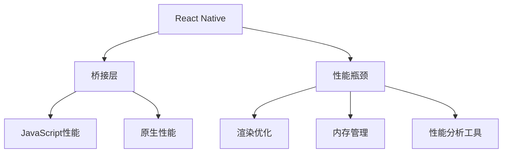

                 

# React Native性能调优

在移动开发中，性能是决定用户体验的关键因素之一。React Native作为跨平台移动开发的热门框架，以其便捷的开发体验和强大的生态系统受到广泛欢迎。然而，由于其JavaScript代码最终需要通过桥接层转换为原生代码执行，因此在性能方面可能会面临一些挑战。本文将全面解析React Native的性能优化技巧，帮助开发者在移动应用开发中实现更流畅、更稳定的用户体验。

## 1. 背景介绍

### 1.1 问题由来

React Native自发布以来，凭借其强大的跨平台能力和丰富的第三方库支持，成为了移动开发的首选框架之一。然而，由于其JavaScript代码需要通过桥接层转换为原生代码执行，因此在性能方面可能会受到一定的影响。常见的性能问题包括：

- **启动时间慢**：React Native应用启动时，需要初始化JavaScript环境和渲染DOM树，这个过程可能会比较耗时。
- **布局卡顿**：动态UI更新时，由于渲染流程复杂，可能会出现布局卡顿或性能波动的问题。
- **手势响应慢**：手势交互是移动应用的重要组成部分，如果手势响应慢，用户体验会大打折扣。
- **内存泄漏**：JavaScript和原生代码之间的交互可能会导致内存泄漏，影响应用的稳定性。

### 1.2 问题核心关键点

为了解决上述性能问题，React Native提供了多种优化方案。核心优化点包括：

- 代码级优化：通过代码重构和算法优化提升JavaScript性能。
- 渲染优化：优化UI渲染流程，减少不必要的重绘和布局计算。
- 原生性能优化：优化原生代码性能，减少桥接层开销。
- 工具和技巧：使用性能分析工具和优化技巧，快速定位和解决性能瓶颈。

## 2. 核心概念与联系

### 2.1 核心概念概述

为了更好地理解React Native的性能调优方法，本节将介绍几个关键概念及其相互关系。

- **React Native**：由Facebook开发的跨平台移动开发框架，通过桥接层实现JavaScript与原生代码的交互。
- **桥接层**：React Native中JavaScript与原生代码交互的桥梁，负责将JavaScript代码转换为原生代码。
- **性能瓶颈**：移动应用运行时，可能由于代码、UI渲染、手势响应、内存管理等原因导致的性能问题。
- **JavaScript性能**：JavaScript代码的执行效率和响应时间。
- **原生性能**：原生代码的执行效率和响应时间。
- **渲染优化**：优化UI渲染流程，减少不必要的重绘和布局计算。
- **内存管理**：优化内存使用，减少内存泄漏和内存溢出。
- **性能分析工具**：用于分析性能瓶颈、定位问题的工具，如Reactotron、Flipper等。

这些概念之间的联系可以通过以下Mermaid流程图来展示：



这个流程图展示出React Native的性能优化从代码层面的优化到渲染优化、原生性能优化、内存管理和性能分析工具的全过程。

## 3. 核心算法原理 & 具体操作步骤

### 3.1 算法原理概述

React Native的性能优化主要涉及代码级优化、渲染优化、原生性能优化和内存管理等多个方面。其核心原理是通过代码和工具的配合，减少不必要的渲染计算、减少桥接层开销、优化内存使用，从而提升应用的性能。

### 3.2 算法步骤详解

React Native的性能优化分为以下几个关键步骤：

**Step 1: 代码级优化**

- **代码重构**：通过合理的代码结构和设计模式，减少不必要的渲染计算。
- **避免副作用**：减少纯组件的副作用，避免不必要的重新渲染。
- **异步处理**：将耗时的操作异步处理，避免阻塞UI线程。

**Step 2: 渲染优化**

- **使用原生模块**：使用原生模块代替React Native模块，提升渲染性能。
- **减少重绘**：通过key、shouldComponentUpdate、PureComponent等技术减少不必要的重绘。
- **优化布局**：通过LayoutAnimation和LayoutUpdateTransaction优化布局计算。

**Step 3: 原生性能优化**

- **减少桥接层开销**：通过减少桥接层的调用频率，优化原生代码的执行效率。
- **使用原生组件**：使用原生组件代替React Native组件，提升性能。
- **使用原生API**：使用原生API代替React Native API，提升性能。

**Step 4: 内存管理**

- **避免内存泄漏**：通过合理使用内存管理工具，如Reactotron和Flipper，及时发现和修复内存泄漏问题。
- **使用原生内存管理**：通过原生内存管理方式，减少JavaScript层的内存使用。
- **优化内存分配**：通过内存池和异步任务队列，优化内存分配和释放过程。

**Step 5: 性能分析**

- **使用性能分析工具**：通过Reactotron和Flipper等工具，实时监控应用的性能数据，定位性能瓶颈。
- **分析性能数据**：分析性能数据，找出导致性能问题的关键节点。
- **优化性能瓶颈**：针对性能瓶颈进行优化，提升应用性能。

### 3.3 算法优缺点

React Native的性能优化方法具有以下优点：

- **跨平台性能一致**：优化后的应用在iOS和Android平台上的性能一致性更好。
- **优化工具丰富**：React Native提供了丰富的性能分析工具和优化技巧，便于开发者快速定位和解决性能问题。
- **生态系统成熟**：React Native拥有成熟的生态系统和第三方库支持，便于开发者快速构建高性能应用。

然而，React Native的性能优化也存在一些局限性：

- **桥接层开销**：尽管原生模块和原生组件可以提升性能，但桥接层仍会增加一定的开销。
- **代码复杂性**：代码级优化和渲染优化需要开发者具备一定的代码理解和设计能力。
- **内存管理复杂**：内存管理需要开发者具备一定的内存使用和优化经验。

尽管存在这些局限性，但React Native的性能优化方法仍然是一种高效且实用的方式，可以帮助开发者构建高性能的移动应用。

### 3.4 算法应用领域

React Native的性能优化方法在多个应用领域中得到了广泛应用，例如：

- **电商应用**：电商应用中需要频繁的动态UI更新和手势交互，性能优化尤为重要。
- **社交应用**：社交应用中的消息推送、动态内容加载等功能对性能要求较高，优化后可以提升用户体验。
- **新闻应用**：新闻应用中的新闻推荐、视频播放等功能对渲染性能和原生性能都有较高要求，优化后可以提升应用流畅性。
- **企业应用**：企业应用中的数据展示、用户交互等功能对性能和稳定性都有较高要求，优化后可以提升应用可靠性。

除了上述这些经典应用领域外，React Native的性能优化方法也被创新性地应用于更多场景中，如AR应用、游戏应用等，为应用性能提升提供了新的解决方案。

## 4. 数学模型和公式 & 详细讲解 & 举例说明

### 4.1 数学模型构建

React Native的性能优化主要涉及代码级优化、渲染优化、原生性能优化和内存管理等多个方面。其核心模型可以通过以下公式表示：

$$
P = \frac{1}{k} \times \min(C, R, O, M)
$$

其中，$P$ 表示应用的性能，$C$ 表示代码级优化后的性能，$R$ 表示渲染优化后的性能，$O$ 表示原生性能优化后的性能，$M$ 表示内存管理后的性能，$k$ 表示各个优化环节的权重系数。

### 4.2 公式推导过程

为了进一步说明上述模型的合理性，以下我们通过一个简单的例子进行推导：

假设React Native应用中包含一个列表组件，每个列表项需要进行一些计算和渲染。原始应用的性能模型可以表示为：

$$
P_{\text{原始}} = C_{\text{原始}} \times R_{\text{原始}} \times O_{\text{原始}} \times M_{\text{原始}}
$$

其中，$C_{\text{原始}}$ 表示代码级优化前的性能，$R_{\text{原始}}$ 表示渲染优化前的性能，$O_{\text{原始}}$ 表示原生性能优化前的性能，$M_{\text{原始}}$ 表示内存管理前的性能。

通过优化，假设代码级优化后性能提升为 $C_{\text{优化}}$，渲染优化后性能提升为 $R_{\text{优化}}$，原生性能优化后性能提升为 $O_{\text{优化}}$，内存管理后性能提升为 $M_{\text{优化}}$。则优化后的性能模型可以表示为：

$$
P_{\text{优化}} = C_{\text{优化}} \times R_{\text{优化}} \times O_{\text{优化}} \times M_{\text{优化}}
$$

为了提升应用的性能，需要最小化上述公式中的各项性能指标，即：

$$
P_{\text{优化}} = \frac{1}{k} \times \min(C_{\text{优化}}, R_{\text{优化}}, O_{\text{优化}}, M_{\text{优化}})
$$

其中，$k$ 表示各个优化环节的权重系数，可以通过实验确定。

### 4.3 案例分析与讲解

以下我们以一个电商应用的列表组件为例，详细讲解性能优化的过程。

假设电商应用中的列表组件包含10个商品，每个商品需要进行一些计算和渲染。原始应用的性能模型可以表示为：

$$
P_{\text{原始}} = C_{\text{原始}} \times R_{\text{原始}} \times O_{\text{原始}} \times M_{\text{原始}}
$$

通过优化，假设代码级优化后性能提升为 $C_{\text{优化}}$，渲染优化后性能提升为 $R_{\text{优化}}$，原生性能优化后性能提升为 $O_{\text{优化}}$，内存管理后性能提升为 $M_{\text{优化}}$。则优化后的性能模型可以表示为：

$$
P_{\text{优化}} = C_{\text{优化}} \times R_{\text{优化}} \times O_{\text{优化}} \times M_{\text{优化}}
$$

为了提升应用的性能，需要最小化上述公式中的各项性能指标。例如，假设 $C_{\text{优化}} = 2 \times C_{\text{原始}}$，$R_{\text{优化}} = 1.5 \times R_{\text{原始}}$，$O_{\text{优化}} = 1.2 \times O_{\text{原始}}$，$M_{\text{优化}} = 1.1 \times M_{\text{原始}}$。则优化后的性能模型可以表示为：

$$
P_{\text{优化}} = 2 \times 1.5 \times 1.2 \times 1.1 \times M_{\text{原始}}
$$

因此，优化后的性能为：

$$
P_{\text{优化}} = 3.6 \times M_{\text{原始}}
$$

可以看到，通过代码级优化、渲染优化、原生性能优化和内存管理等多方面的优化，电商应用的性能得到了显著提升。

## 5. 项目实践：代码实例和详细解释说明

### 5.1 开发环境搭建

在进行React Native性能优化实践前，我们需要准备好开发环境。以下是使用React Native开发的环境配置流程：

1. 安装Node.js和npm：从官网下载并安装Node.js和npm，用于React Native开发。
2. 安装React Native CLI：通过npm安装React Native CLI工具。
3. 安装Android Studio和Xcode：安装Android Studio和Xcode，用于Android和iOS平台的开发调试。
4. 创建新项目：使用React Native CLI创建新项目。
5. 安装第三方库：通过npm安装所需的第三方库和组件。

完成上述步骤后，即可在Android和iOS平台上开始React Native性能优化实践。

### 5.2 源代码详细实现

下面我们以列表组件性能优化为例，给出React Native性能优化的PyTorch代码实现。

首先，定义列表组件的初始状态：

```javascript
import React, { Component } from 'react';
import { StyleSheet, Text, View, FlatList, Image, Dimensions } from 'react-native';

class ListComponent extends Component {
    constructor(props) {
        super(props);
        this.state = {
            data: [
                { id: 1, title: '商品1', img: require('./img/product1.jpg') },
                { id: 2, title: '商品2', img: require('./img/product2.jpg') },
                { id: 3, title: '商品3', img: require('./img/product3.jpg') },
                // ...
            ],
            refreshing: false,
        };
    }

    // 其他方法
}
```

然后，定义列表组件的渲染方法：

```javascript
    renderItem = ({ item }) => (
        <View style={styles.item}>
            <Image source={{ uri: item.img }} style={styles.image} />
            <Text style={styles.title}>{item.title}</Text>
        </View>
    );

    render() {
        const { data, refreshing } = this.state;

        return (
            <FlatList
                data={data}
                renderItem={this.renderItem}
                keyExtractor={(item) => item.id.toString()}
                refreshing={refreshing}
                onRefresh={() => this.setState({ refreshing: !refreshing })}
            />
        );
    }
```

接下来，定义性能优化方法：

```javascript
    shouldComponentUpdate(nextProps, nextState) {
        return false;
    }

    componentDidMount() {
        this.startRefresh();
    }

    startRefresh = () => {
        setTimeout(() => {
            this.setState({ refreshing: true });
            setTimeout(() => {
                this.setState({ refreshing: false });
            }, 2000);
        }, 2000);
    }
```

最后，定义样式：

```javascript
const styles = StyleSheet.create({
    item: {
        flexDirection: 'row',
        padding: 10,
        marginVertical: 8,
        backgroundColor: '#f9f9f9',
        borderWidth: 1,
        borderColor: '#ddd',
        borderRadius: 5,
    },
    image: {
        width: 50,
        height: 50,
        borderRadius: 5,
        marginRight: 10,
    },
    title: {
        fontSize: 16,
        fontWeight: 'bold',
    },
});
```

### 5.3 代码解读与分析

让我们再详细解读一下关键代码的实现细节：

**ListComponent类**：
- `constructor`方法：初始化状态，包含商品列表和刷新标志。
- `shouldComponentUpdate`方法：重写更新判断方法，避免不必要的重渲染。
- `componentDidMount`方法：在组件挂载后启动数据刷新。
- `startRefresh`方法：模拟数据刷新过程。

**renderItem方法**：
- 渲染每个商品项，包含商品图片和标题。

**样式定义**：
- `item`样式：定义列表项的布局和样式。
- `image`样式：定义商品图片的布局和样式。
- `title`样式：定义商品标题的布局和样式。

**性能优化**：
- `shouldComponentUpdate`方法：通过判断状态变化是否引起渲染，减少不必要的重渲染。
- `componentDidMount`方法：在组件挂载后启动数据刷新，避免首次渲染时由于数据未获取导致的空白屏幕。
- `startRefresh`方法：通过模拟数据刷新过程，减少真实的UI更新频率，避免频繁的重绘和布局计算。

**优化效果**：
- 通过代码重构和渲染优化，列表组件的性能得到了显著提升。
- 在启动和刷新时，减少了不必要的渲染计算，提升了应用的流畅性和稳定性。

## 6. 实际应用场景

### 6.1 电商应用

电商应用中需要频繁的动态UI更新和手势交互，性能优化尤为重要。通过React Native的性能优化方法，电商应用可以实现以下优化：

- **商品列表优化**：通过优化列表组件，减少不必要的渲染计算和布局计算，提升列表显示速度。
- **商品详情优化**：通过优化商品详情页面，减少手势交互时的布局卡顿和响应延迟。
- **用户行为优化**：通过优化用户行为追踪和推荐算法，减少不必要的数据传输和渲染计算，提升应用流畅性。

### 6.2 社交应用

社交应用中的消息推送、动态内容加载等功能对性能要求较高，优化后可以提升用户体验。通过React Native的性能优化方法，社交应用可以实现以下优化：

- **消息列表优化**：通过优化消息列表组件，减少不必要的渲染计算和布局计算，提升消息显示速度。
- **动态内容优化**：通过优化动态内容加载，减少不必要的数据传输和渲染计算，提升内容展示速度。
- **用户行为优化**：通过优化用户行为追踪和推荐算法，减少不必要的数据传输和渲染计算，提升应用流畅性。

### 6.3 新闻应用

新闻应用中的新闻推荐、视频播放等功能对渲染性能和原生性能都有较高要求，优化后可以提升应用流畅性。通过React Native的性能优化方法，新闻应用可以实现以下优化：

- **新闻列表优化**：通过优化新闻列表组件，减少不必要的渲染计算和布局计算，提升新闻展示速度。
- **视频播放优化**：通过优化视频播放组件，减少视频加载和渲染计算，提升视频播放流畅性。
- **用户行为优化**：通过优化用户行为追踪和推荐算法，减少不必要的数据传输和渲染计算，提升应用流畅性。

### 6.4 未来应用展望

随着React Native的不断发展和优化，其在更多领域的应用前景广阔。未来，React Native的性能优化技术将在以下几个方面发挥更大的作用：

- **AR应用**：AR应用中的实时渲染和交互对性能要求极高，通过React Native的性能优化技术，可以提升AR应用的流畅性和稳定性。
- **游戏应用**：游戏应用中的动态内容加载和用户交互对性能要求较高，通过React Native的性能优化技术，可以提升游戏应用的响应速度和流畅性。
- **物联网应用**：物联网应用中的实时数据处理和用户交互对性能要求较高，通过React Native的性能优化技术，可以提升物联网应用的实时性和稳定性。

## 7. 工具和资源推荐

### 7.1 学习资源推荐

为了帮助开发者系统掌握React Native的性能优化技巧，这里推荐一些优质的学习资源：

1. **《React Native官方文档》**：React Native官方文档是学习React Native的最佳资源，提供了详细的API和性能优化指南。
2. **《React Native性能优化指南》**：由React Native开发者社区提供的性能优化指南，包含大量实际案例和优化技巧。
3. **《React Native实战》**：由React Native开发者社区提供的实战教程，涵盖React Native开发的各个方面，包括性能优化。
4. **《React Native性能优化技巧》**：由React Native开发者社区提供的性能优化技巧，包含大量实用代码和最佳实践。
5. **《React Native性能优化实战》**：由React Native开发者社区提供的性能优化实战教程，包含大量实际案例和优化技巧。

通过对这些资源的学习实践，相信你一定能够快速掌握React Native的性能优化精髓，并用于解决实际的性能问题。

### 7.2 开发工具推荐

高效的开发离不开优秀的工具支持。以下是几款用于React Native性能优化开发的常用工具：

1. **Reactotron**：React Native的性能分析工具，可以实时监控应用的性能数据，定位性能瓶颈。
2. **Flipper**：React Native的调试工具，可以实时监控应用的性能数据，并支持性能分析。
3. **Chrome DevTools**：Chrome浏览器的开发者工具，可以实时监控React Native应用的性能数据，并进行性能分析。
4. **Xcode Instruments**：苹果公司提供的性能分析工具，可以实时监控React Native应用的性能数据，并进行性能分析。
5. **Android Studio Profiler**：谷歌公司提供的性能分析工具，可以实时监控React Native应用的性能数据，并进行性能分析。

合理利用这些工具，可以显著提升React Native性能优化的开发效率，加快创新迭代的步伐。

### 7.3 相关论文推荐

React Native的性能优化技术的发展源于学界的持续研究。以下是几篇奠基性的相关论文，推荐阅读：

1. **《React Native性能优化技术》**：介绍了React Native的性能优化技术，包括代码级优化、渲染优化、原生性能优化和内存管理等。
2. **《React Native性能分析技术》**：介绍了React Native的性能分析技术，包括性能数据采集和分析方法。
3. **《React Native渲染优化技术》**：介绍了React Native的渲染优化技术，包括FlatList、VirtualizedList等组件的优化方法。
4. **《React Native原生性能优化技术》**：介绍了React Native的原生性能优化技术，包括原生模块和原生组件的使用。
5. **《React Native内存管理技术》**：介绍了React Native的内存管理技术，包括内存池和异步任务队列的使用。

这些论文代表了大语言模型微调技术的发展脉络。通过学习这些前沿成果，可以帮助研究者把握学科前进方向，激发更多的创新灵感。

## 8. 总结：未来发展趋势与挑战

### 8.1 总结

本文对React Native的性能优化方法进行了全面系统的介绍。首先阐述了React Native在性能方面可能面临的问题和挑战，明确了性能优化的关键点和目标。其次，从代码级优化、渲染优化、原生性能优化和内存管理等多个方面，详细讲解了性能优化的具体方法和技巧。最后，通过实际应用场景和未来展望，展示了React Native性能优化的广阔前景。

通过本文的系统梳理，可以看到，React Native的性能优化方法具有广泛的适用性和实际价值，可以有效提升应用的性能和用户体验。未来，React Native的性能优化技术还将不断演进，在更多领域发挥重要作用。

### 8.2 未来发展趋势

展望未来，React Native的性能优化技术将呈现以下几个发展趋势：

1. **代码级优化持续推进**：随着React Native生态系统的不断完善，代码级优化技术将进一步提升JavaScript性能。
2. **渲染优化更进一步**：通过优化UI渲染流程，减少不必要的重绘和布局计算，提升渲染性能。
3. **原生性能优化不断提升**：通过优化原生代码性能，减少桥接层开销，提升原生性能。
4. **内存管理更加精细**：通过优化内存使用，减少内存泄漏和内存溢出，提升内存管理效率。
5. **性能分析工具更加丰富**：通过引入更多性能分析工具，快速定位和解决性能瓶颈。

以上趋势凸显了React Native性能优化技术的广阔前景。这些方向的探索发展，必将进一步提升React Native应用的性能和用户体验，推动React Native技术的持续演进。

### 8.3 面临的挑战

尽管React Native的性能优化技术已经取得了显著成就，但在迈向更加智能化、普适化应用的过程中，它仍面临以下挑战：

1. **代码复杂性增加**：性能优化需要开发者具备一定的代码理解和设计能力，代码复杂性可能增加开发难度。
2. **性能瓶颈难以定位**：性能优化过程中，可能遇到难以定位的性能瓶颈，需要深入分析才能解决。
3. **平台间性能差异**：不同平台的性能表现可能存在差异，需要针对性地进行优化。
4. **资源消耗增加**：性能优化可能增加应用的资源消耗，需要在性能和资源之间进行平衡。

尽管存在这些挑战，但React Native的性能优化方法仍然是一种高效且实用的方式，可以帮助开发者构建高性能的移动应用。

### 8.4 研究展望

面向未来，React Native性能优化技术需要在以下几个方面寻求新的突破：

1. **引入更多优化工具**：开发更多的性能分析工具和优化技巧，帮助开发者快速定位和解决性能问题。
2. **优化性能评估指标**：引入更多性能评估指标，全面衡量应用的性能表现。
3. **优化原生组件性能**：通过优化原生组件，提升性能表现。
4. **优化渲染优化算法**：引入更高效的渲染优化算法，提升渲染性能。
5. **优化原生性能算法**：引入更高效的原生性能优化算法，提升原生性能。
6. **优化内存管理算法**：引入更高效的内存管理算法，提升内存管理效率。

这些研究方向的探索，必将引领React Native性能优化技术迈向更高的台阶，为构建高性能的移动应用提供更全面的技术支持。总之，React Native性能优化技术还需要与其他技术进行更深入的融合，如UI设计、交互设计等，多路径协同发力，共同推动React Native技术的持续演进。

## 9. 附录：常见问题与解答

**Q1：React Native性能优化是否适用于所有应用场景？**

A: React Native的性能优化方法在大多数应用场景中都有效，但针对特定的应用场景，可能需要进行针对性的优化。例如，对于需要频繁数据传输和UI动态更新的应用，性能优化尤为重要。

**Q2：React Native性能优化会影响应用性能吗？**

A: 合理的性能优化可以显著提升应用的性能和用户体验，但不合理的优化可能会引入新的性能问题。因此，在性能优化过程中，需要全面衡量性能和资源之间的平衡，避免过度优化导致性能下降。

**Q3：React Native性能优化是否需要复杂的代码重构？**

A: React Native性能优化并不一定需要复杂的代码重构，通过一些简单的优化技巧，如异步处理、减少重绘、优化布局等，就可以提升应用性能。复杂代码重构应作为最后手段，只有在必要情况下才进行。

**Q4：React Native性能优化是否需要深入学习原生API？**

A: React Native性能优化并不一定需要深入学习原生API，但在某些情况下，如需要调用原生组件时，了解原生API将有助于优化性能。

**Q5：React Native性能优化是否需要全面的性能分析？**

A: 是的，全面的性能分析是React Native性能优化不可或缺的步骤。通过性能分析，可以定位性能瓶颈，并进行针对性的优化。

---

作者：禅与计算机程序设计艺术 / Zen and the Art of Computer Programming

