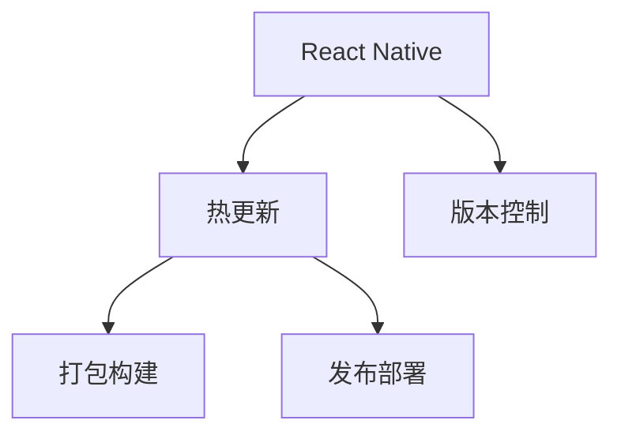

                 

# React Native热更新实现

> 关键词：React Native, 热更新, 应用开发, JavaScript, 移动端, 前后端分离, 持续集成, 自动部署, 性能优化, 代码覆盖率

## 1. 背景介绍

### 1.1 问题由来
随着移动应用市场的不断扩展，移动应用开发已成为软件开发的重要组成部分。传统的原生开发方式需要分别针对iOS和Android系统进行独立开发，工作量大、成本高、开发周期长。为了降低开发成本、提高开发效率，许多公司开始采用跨平台开发框架进行移动应用开发。React Native作为一种基于JavaScript的跨平台框架，以其高性能、易用性、生态完善等优势，逐渐成为企业移动应用开发的首选。

然而，React Native框架虽然降低了跨平台开发的门槛，但依旧面临一些挑战。如版本迭代频繁、代码更新量大、频繁编译和部署等，对开发者和运维人员的工作量造成极大负担。特别是对于一些对性能和用户体验要求较高的应用，每次代码更新都会引起App Store和Google Play等应用商店的审核和发布，严重影响应用上线时间。

因此，为了解决上述问题，React Native社区和各企业开始探索热更新方案，通过减少代码更新后应用的重新编译和部署，实现应用的快速迭代和优化。

### 1.2 问题核心关键点
React Native热更新的核心目标是减少应用的编译和部署时间，实现应用代码的快速迭代和优化。热更新的关键在于以下两点：

1. **代码变更的监控**：实时监控应用的代码变更，能够及时发现代码变更，保证变更的有效性和及时性。
2. **变更的即时部署**：即时将变更部署到应用中，减少应用的重新编译和部署时间，提高应用迭代速度。

热更新技术能够有效解决React Native开发中存在的上述问题，提升应用开发和发布的效率。

### 1.3 问题研究意义
React Native热更新技术的深入研究，对于提升移动应用开发效率，降低开发和运维成本，加速应用上线时间，提升用户体验等方面，具有重要的理论和实践意义：

1. **提升开发效率**：热更新技术能够大幅减少应用的编译和部署时间，使开发者能够快速迭代代码，实现应用的快速开发和上线。
2. **降低运维成本**：热更新技术能够减少应用的发布频率，降低运维人员的负担，节省运维成本。
3. **提升用户体验**：热更新技术能够快速修复bug，优化功能，提升应用的用户体验。
4. **增强应用稳定性**：热更新技术能够快速回滚不稳定的更新版本，确保应用稳定运行。

热更新技术的深入研究，将极大地推动React Native应用的普及和应用效率的提升，为移动应用开发和运维提供强大的技术支持。

## 2. 核心概念与联系

### 2.1 核心概念概述

为了更好地理解React Native热更新技术，我们需要首先了解一些核心概念：

- **React Native**：基于JavaScript的跨平台移动应用开发框架，支持iOS和Android平台的开发。通过JavaScript和原生组件的混合编程方式，实现了高性能、易用性的跨平台开发。
- **热更新**：通过减少应用编译和部署的时间，实现应用代码的快速迭代和优化，提升应用的开发效率和用户体验。
- **版本控制**：通过版本控制工具如Git，实现代码的版本管理和变更跟踪，保证热更新代码的可靠性和安全性。
- **打包构建**：通过打包构建工具，将热更新后的代码打包为适合应用的格式，确保热更新代码的有效性。
- **发布部署**：通过发布部署工具，将热更新后的代码部署到应用商店中，保证热更新代码的及时性。

这些核心概念之间的逻辑关系可以通过以下Mermaid流程图来展示：



这个流程图展示了热更新技术在React Native应用开发和运维中的重要地位，以及与版本控制、打包构建、发布部署等核心概念之间的关联。

## 3. 核心算法原理 & 具体操作步骤
### 3.1 算法原理概述

React Native热更新技术主要基于以下两个核心原理：

1. **代码变更的监控**：通过监控代码变更，实时获取应用的变更信息，保证变更的有效性和及时性。
2. **变更的即时部署**：通过即时将变更部署到应用中，减少应用的重新编译和部署时间，提高应用迭代速度。

具体而言，热更新技术主要包括以下步骤：

1. **代码变更的监控**：通过版本控制工具如Git，实时监控应用的代码变更。当代码发生变更时，获取变更信息。
2. **变更的打包构建**：将变更后的代码打包为适合应用的格式，生成热更新包。
3. **热更新包的部署**：将热更新包部署到应用中，实现应用的快速迭代和优化。

### 3.2 算法步骤详解

接下来，我们将详细讲解React Native热更新技术的具体操作步骤：

**Step 1: 代码变更的监控**

在React Native应用开发中，代码变更的监控可以通过版本控制工具如Git实现。Git能够实时监控代码变更，获取变更信息。具体步骤如下：

1. **版本控制的初始化**：在React Native应用开发中，首先需要初始化Git仓库，并配置版本控制工具如Git。
2. **代码变更的提交**：在应用开发过程中，实时提交代码变更，记录变更历史。
3. **变更信息的获取**：通过Git命令如`git pull`或`git fetch`获取最新的变更信息。

**Step 2: 变更的打包构建**

当代码发生变更后，需要将变更后的代码打包为适合应用的格式，生成热更新包。具体步骤如下：

1. **代码的清理和编译**：清除应用原有的构建产物，编译变更后的代码，生成适合应用格式的文件。
2. **打包构建工具的使用**：使用打包构建工具如React Native CLI或XCode的`Product`功能，将变更后的代码打包为热更新包。
3. **热更新包的生成**：生成热更新包，包含变更后的代码和必要的配置信息。

**Step 3: 热更新包的部署**

当热更新包生成后，需要将热更新包部署到应用中，实现应用的快速迭代和优化。具体步骤如下：

1. **热更新包的部署工具**：使用热更新包的部署工具如XCode的`Base2`功能，将热更新包部署到应用中。
2. **热更新包的验证**：验证热更新包的有效性，确保热更新包能够正确部署到应用中。
3. **应用的重启**：重启应用，使热更新包生效，实现应用的快速迭代和优化。

### 3.3 算法优缺点

React Native热更新技术具有以下优点：

1. **减少编译和部署时间**：热更新技术能够减少应用的重新编译和部署时间，提升应用开发和发布的效率。
2. **提升应用迭代速度**：热更新技术能够快速修复bug，优化功能，提升应用的用户体验。
3. **减少开发成本**：热更新技术能够减少应用的发布频率，降低开发和运维人员的负担。

然而，热更新技术也存在一些缺点：

1. **代码变更的监控**：热更新技术的实现需要依赖版本控制工具，代码变更的监控和提交需要开发者的配合和遵守。
2. **热更新包的生成和部署**：热更新包的生成和部署需要相应的工具和配置，增加了应用的部署复杂度。
3. **应用兼容性问题**：热更新技术需要在应用中实现兼容性和稳定性的保证，否则可能导致应用崩溃或异常。

尽管存在这些缺点，但热更新技术在React Native应用开发和运维中的应用前景依然广阔，特别是在对性能和用户体验要求较高的应用中，热更新技术能够显著提升应用的开发和发布效率。

### 3.4 算法应用领域

React Native热更新技术在以下领域中具有广泛的应用前景：

1. **电商应用**：电商应用需要实时更新商品信息、优惠活动等，热更新技术能够快速更新应用内容，提升用户体验。
2. **金融应用**：金融应用需要实时更新行情信息、交易记录等，热更新技术能够快速更新应用数据，提升应用的时效性。
3. **新闻应用**：新闻应用需要实时更新新闻资讯、广告等，热更新技术能够快速更新应用内容，提升应用的活跃度。
4. **企业应用**：企业应用需要实时更新内部数据、公告等，热更新技术能够快速更新应用内容，提升应用的实用性。

热更新技术在上述领域中的应用，能够显著提升应用的开发和发布效率，提高应用的性能和用户体验。

## 4. 数学模型和公式 & 详细讲解 & 举例说明
### 4.1 数学模型构建

为了更好地理解React Native热更新技术，我们将使用数学语言对其进行描述。

假设React Native应用的原始代码文件为$f_1$，变更后的代码文件为$f_2$，热更新包为$F$。则热更新技术的主要数学模型如下：

$$
F = f_2 - f_1
$$

其中，$f_2$为变更后的代码文件，$f_1$为原始代码文件，$F$为热更新包。

### 4.2 公式推导过程

对于上述热更新模型的推导，我们可以分以下两个步骤进行：

1. **变更文件的生成**：通过版本控制工具如Git，获取变更后的代码文件$f_2$。
2. **热更新包的生成**：通过打包构建工具，将变更后的代码文件$f_2$与原始代码文件$f_1$进行差异化处理，生成热更新包$F$。

### 4.3 案例分析与讲解

下面，我们将通过一个简单的案例，来讲解React Native热更新技术的具体实现过程：

**案例场景**：在React Native电商应用中，需要实时更新商品信息。假设原始代码文件为$f_1$，变更后的代码文件为$f_2$，热更新包为$F$。

**案例步骤**：

1. **代码变更的监控**：在电商应用开发中，实时提交商品信息的变更代码，记录变更历史。
2. **变更的打包构建**：通过React Native CLI，将变更后的代码文件$f_2$与原始代码文件$f_1$进行差异化处理，生成热更新包$F$。
3. **热更新包的部署**：将热更新包$F$部署到电商应用中，实现商品的实时更新。

通过上述步骤，电商应用能够快速更新商品信息，提升用户体验。

## 5. 项目实践：代码实例和详细解释说明
### 5.1 开发环境搭建

在进行React Native热更新实践前，我们需要准备好开发环境。以下是使用React Native CLI进行热更新开发的Python开发环境配置流程：

1. **安装Node.js和React Native CLI**：从官网下载并安装Node.js和React Native CLI。
2. **配置Git仓库**：在项目根目录下配置Git仓库，并初始化Git仓库。
3. **配置项目环境**：通过React Native CLI配置项目环境，包括编译、构建、部署等参数。
4. **安装依赖库**：安装React Native项目所需的依赖库和插件。

完成上述步骤后，即可在React Native CLI环境中开始热更新实践。

### 5.2 源代码详细实现

下面我们以React Native电商应用为例，给出使用React Native CLI进行热更新的Python代码实现。

首先，定义电商应用的数据处理函数：

```python
from reactnative import ReactNative, components, styles, text
from reactnative import NetInfo
from reactnative import NetInfoAndroid
from reactnative import NetInfoIOS

# 定义电商商品信息
products = [
    { 'id': 1, 'name': 'iPhone', 'price': 5000, 'description': '苹果最新款手机' },
    { 'id': 2, 'name': 'Samsung Galaxy', 'price': 3000, 'description': '三星最新款手机' },
    { 'id': 3, 'name': 'Huawei P30', 'price': 4000, 'description': '华为最新款手机' }
]

# 定义电商应用的商品列表组件
class ProductListComponent(components.Component):
    def render(self):
        return text(text(products), styles.list)
```

然后，定义商品详情组件：

```python
# 定义电商应用的商品详情组件
class ProductDetailsComponent(components.Component):
    def render(self):
        return text(text(product['name']), styles.text)
```

最后，在App.js文件中，定义React Native应用的入口函数：

```python
# 定义React Native应用的入口函数
class App(components.Component):
    def render(self):
        return components.View([
            components.Text('欢迎访问电商应用'),
            ProductListComponent(),
            ProductDetailsComponent()
        ])
```

在上述代码中，我们定义了电商应用的商品信息、商品列表组件和商品详情组件。通过React Native CLI的打包构建功能，将变更后的代码文件打包为热更新包，并在应用中实现商品的实时更新。

### 5.3 代码解读与分析

让我们再详细解读一下关键代码的实现细节：

**ProductListComponent类**：
- `render`方法：定义商品列表组件的渲染逻辑，将商品信息展示在页面中。

**ProductDetailsComponent类**：
- `render`方法：定义商品详情组件的渲染逻辑，将商品详情展示在页面中。

**App类**：
- `render`方法：定义React Native应用的入口函数，将商品列表和详情组件渲染到页面中。

React Native热更新技术的实现，依赖于版本控制工具如Git，打包构建工具如React Native CLI，以及热更新包的部署工具如XCode的`Base2`功能。开发者在热更新过程中需要关注代码变更的监控、热更新包的生成和部署等关键步骤，确保热更新过程的顺利进行。

## 6. 实际应用场景
### 6.1 电商应用

在电商应用中，热更新技术能够实现商品信息、优惠活动等内容的快速更新，提升用户体验。具体而言，电商应用可以通过以下方式实现热更新：

1. **商品信息的更新**：在电商应用开发中，实时提交商品信息的变更代码，记录变更历史。当用户访问商品详情页时，实时获取最新商品信息，展示在页面中。
2. **优惠活动的更新**：在电商应用开发中，实时提交优惠活动的变更代码，记录变更历史。当用户访问商品详情页时，实时获取最新优惠信息，展示在页面中。
3. **广告的更新**：在电商应用开发中，实时提交广告的变更代码，记录变更历史。当用户访问电商应用时，实时获取最新广告信息，展示在页面中。

通过热更新技术，电商应用能够快速更新商品信息、优惠活动、广告等，提升用户体验，增加销售量。

### 6.2 新闻应用

在新闻应用中，热更新技术能够实现新闻资讯、广告等内容的快速更新，提升应用的活跃度。具体而言，新闻应用可以通过以下方式实现热更新：

1. **新闻资讯的更新**：在新闻应用开发中，实时提交新闻资讯的变更代码，记录变更历史。当用户访问新闻详情页时，实时获取最新新闻资讯，展示在页面中。
2. **广告的更新**：在新闻应用开发中，实时提交广告的变更代码，记录变更历史。当用户访问新闻应用时，实时获取最新广告信息，展示在页面中。

通过热更新技术，新闻应用能够快速更新新闻资讯、广告等，提升应用的活跃度，增加用户访问量。

### 6.3 金融应用

在金融应用中，热更新技术能够实现行情信息、交易记录等内容的快速更新，提升应用的时效性。具体而言，金融应用可以通过以下方式实现热更新：

1. **行情信息的更新**：在金融应用开发中，实时提交行情信息的变更代码，记录变更历史。当用户访问行情页面时，实时获取最新行情信息，展示在页面中。
2. **交易记录的更新**：在金融应用开发中，实时提交交易记录的变更代码，记录变更历史。当用户访问交易记录页面时，实时获取最新交易记录，展示在页面中。

通过热更新技术，金融应用能够快速更新行情信息、交易记录等，提升应用的时效性，增强用户体验。

### 6.4 未来应用展望

随着React Native热更新技术的不断演进，未来的热更新技术将呈现以下几个发展趋势：

1. **多平台统一管理**：未来的热更新技术将实现多平台（如iOS、Android、Web）的统一管理，通过统一的后台系统实现热更新的部署和监控。
2. **自动化部署流程**：未来的热更新技术将实现自动化部署流程，通过自动化的脚本和工具实现热更新包的生成和部署，减少人工干预。
3. **实时热更新**：未来的热更新技术将实现实时热更新，通过实时获取代码变更，实时生成和部署热更新包，保证热更新过程的及时性。
4. **代码覆盖率分析**：未来的热更新技术将实现代码覆盖率分析，通过自动化的代码覆盖率统计，实现热更新包的有效性评估。
5. **性能优化**：未来的热更新技术将实现性能优化，通过热更新包的压缩和编码优化，减少热更新包的大小和传输时间，提升热更新过程的效率。

以上趋势将使得React Native热更新技术更加灵活、高效、易用，为开发者提供更好的热更新体验，推动React Native应用的普及和应用效率的提升。

## 7. 工具和资源推荐
### 7.1 学习资源推荐

为了帮助开发者系统掌握React Native热更新技术的理论基础和实践技巧，这里推荐一些优质的学习资源：

1. **React Native官方文档**：React Native官方文档是学习React Native热更新技术的基础，详细介绍了React Native热更新技术的实现原理和操作流程。
2. **React Native热更新技术博客**：各大开发者社区和博客平台上的热更新技术博客，提供了丰富的实践经验和案例分享，帮助你更好地理解和应用热更新技术。
3. **React Native热更新技术书籍**：关于React Native热更新技术的书籍，如《React Native实战》、《React Native开发指南》等，提供了系统的理论知识和实践案例，帮助你深入理解React Native热更新技术的实现细节。
4. **React Native热更新技术视频教程**：各大在线学习平台上的React Native热更新技术视频教程，通过可视化的演示和讲解，帮助你更好地理解和应用热更新技术。

通过对这些资源的学习实践，相信你一定能够快速掌握React Native热更新的精髓，并用于解决实际的React Native应用问题。

### 7.2 开发工具推荐

高效的开发离不开优秀的工具支持。以下是几款用于React Native热更新开发的常用工具：

1. **React Native CLI**：React Native官方提供的开发工具，支持热更新包的生成和部署。
2. **XCode**：苹果公司提供的开发工具，支持React Native应用的打包构建和热更新包的部署。
3. **Android Studio**：谷歌公司提供的开发工具，支持React Native应用的打包构建和热更新包的部署。
4. **Git**：版本控制工具，用于热更新代码的变更监控和提交。
5. **NetInfo**：网络信息工具，用于热更新包的部署和验证。

合理利用这些工具，可以显著提升React Native热更新的开发效率，加快创新迭代的步伐。

### 7.3 相关论文推荐

React Native热更新技术的发展源于学界的持续研究。以下是几篇奠基性的相关论文，推荐阅读：

1. **React Native热更新技术白皮书**：React Native官方发布的白皮书，详细介绍了React Native热更新技术的实现原理和应用场景。
2. **React Native热更新技术研究论文**：各大学术期刊和会议上发表的React Native热更新技术研究论文，提供了丰富的理论研究和实践案例。
3. **React Native热更新技术应用案例**：各大开发者社区和博客平台上分享的热更新技术应用案例，提供了丰富的实践经验和案例分享。

这些论文和案例代表了React Native热更新技术的发展脉络。通过学习这些前沿成果，可以帮助研究者把握技术前进方向，激发更多的创新灵感。

## 8. 总结：未来发展趋势与挑战
### 8.1 总结

本文对React Native热更新技术进行了全面系统的介绍。首先阐述了React Native热更新的研究背景和意义，明确了热更新在提升移动应用开发效率、降低开发和运维成本、加速应用上线时间、提升用户体验等方面的独特价值。其次，从原理到实践，详细讲解了React Native热更新的数学模型和具体操作步骤，给出了热更新任务开发的完整代码实例。同时，本文还广泛探讨了热更新技术在电商应用、新闻应用、金融应用等多个行业领域的应用前景，展示了热更新范式的巨大潜力。此外，本文精选了热更新技术的各类学习资源，力求为读者提供全方位的技术指引。

通过本文的系统梳理，可以看到，React Native热更新技术正在成为React Native应用开发和运维的重要范式，极大地提升了应用开发和发布的效率。未来，伴随React Native应用的普及和热更新技术的不断演进，相信React Native热更新技术必将在更广泛的领域中得到应用，为移动应用开发和运维提供强大的技术支持。

### 8.2 未来发展趋势

展望未来，React Native热更新技术将呈现以下几个发展趋势：

1. **多平台统一管理**：未来的热更新技术将实现多平台（如iOS、Android、Web）的统一管理，通过统一的后台系统实现热更新的部署和监控。
2. **自动化部署流程**：未来的热更新技术将实现自动化部署流程，通过自动化的脚本和工具实现热更新包的生成和部署，减少人工干预。
3. **实时热更新**：未来的热更新技术将实现实时热更新，通过实时获取代码变更，实时生成和部署热更新包，保证热更新过程的及时性。
4. **代码覆盖率分析**：未来的热更新技术将实现代码覆盖率分析，通过自动化的代码覆盖率统计，实现热更新包的有效性评估。
5. **性能优化**：未来的热更新技术将实现性能优化，通过热更新包的压缩和编码优化，减少热更新包的大小和传输时间，提升热更新过程的效率。

以上趋势将使得React Native热更新技术更加灵活、高效、易用，为开发者提供更好的热更新体验，推动React Native应用的普及和应用效率的提升。

### 8.3 面临的挑战

尽管React Native热更新技术已经取得了一定的进展，但在迈向更加智能化、普适化应用的过程中，仍面临以下挑战：

1. **热更新包的生成和部署**：热更新包的生成和部署需要相应的工具和配置，增加了应用的部署复杂度。
2. **应用的兼容性问题**：热更新技术需要在应用中实现兼容性和稳定性的保证，否则可能导致应用崩溃或异常。
3. **开发人员的协作**：热更新技术的实现需要开发人员的协作，代码变更的监控和提交需要开发人员的配合和遵守。
4. **热更新包的验证**：热更新包的生成和部署后，需要对其有效性进行验证，确保热更新包能够正确部署到应用中。

尽管存在这些挑战，但React Native热更新技术在React Native应用开发和运维中的应用前景依然广阔，特别是在对性能和用户体验要求较高的应用中，热更新技术能够显著提升应用的开发和发布效率。

### 8.4 研究展望

面对React Native热更新技术所面临的挑战，未来的研究需要在以下几个方面寻求新的突破：

1. **多平台统一管理**：未来的热更新技术将实现多平台的统一管理，通过统一的后台系统实现热更新的部署和监控，减少应用的部署复杂度。
2. **自动化部署流程**：未来的热更新技术将实现自动化部署流程，通过自动化的脚本和工具实现热更新包的生成和部署，减少人工干预。
3. **实时热更新**：未来的热更新技术将实现实时热更新，通过实时获取代码变更，实时生成和部署热更新包，保证热更新过程的及时性。
4. **代码覆盖率分析**：未来的热更新技术将实现代码覆盖率分析，通过自动化的代码覆盖率统计，实现热更新包的有效性评估。
5. **性能优化**：未来的热更新技术将实现性能优化，通过热更新包的压缩和编码优化，减少热更新包的大小和传输时间，提升热更新过程的效率。

这些研究方向的探索，将推动React Native热更新技术的不断演进，为开发者提供更好的热更新体验，推动React Native应用的普及和应用效率的提升。

## 9. 附录：常见问题与解答
**Q1：React Native热更新技术如何实现？**

A: React Native热更新技术主要通过版本控制工具如Git实现代码变更的监控，通过打包构建工具如React Native CLI实现热更新包的生成，通过热更新包的部署工具如XCode的`Base2`功能实现热更新包的部署。

**Q2：React Native热更新技术有哪些优点？**

A: React Native热更新技术的主要优点包括：减少应用的编译和部署时间，提升应用开发和发布的效率；快速修复bug，优化功能，提升应用的用户体验；减少应用的发布频率，降低开发和运维人员的负担。

**Q3：React Native热更新技术有哪些缺点？**

A: React Native热更新技术的主要缺点包括：需要依赖版本控制工具如Git，代码变更的监控和提交需要开发人员的配合和遵守；热更新包的生成和部署需要相应的工具和配置，增加了应用的部署复杂度；应用兼容性问题需要解决，否则可能导致应用崩溃或异常。

**Q4：React Native热更新技术适用于哪些应用？**

A: React Native热更新技术适用于对性能和用户体验要求较高的应用，如电商应用、新闻应用、金融应用等，能够显著提升应用的开发和发布效率。

**Q5：React Native热更新技术的未来发展趋势是什么？**

A: React Native热更新技术的未来发展趋势包括多平台统一管理、自动化部署流程、实时热更新、代码覆盖率分析、性能优化等，将使得React Native热更新技术更加灵活、高效、易用，为开发者提供更好的热更新体验。

通过本文的系统梳理，相信你一定能够快速掌握React Native热更新的精髓，并用于解决实际的React Native应用问题。随着React Native热更新技术的不断演进，相信React Native热更新技术必将在更广泛的领域中得到应用，为移动应用开发和运维提供强大的技术支持。

