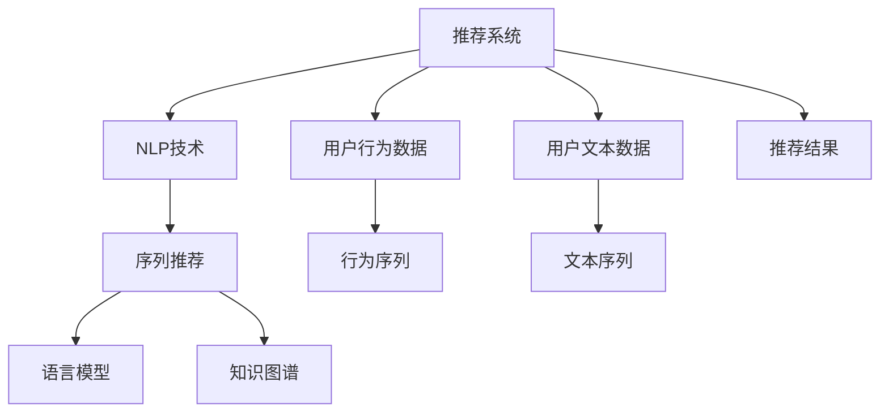

                 

# Recommendation as Language Processing的新范式

> 关键词：推荐系统，自然语言处理(NLP)，序列推荐，语言模型，知识图谱，深度学习，推荐引擎

## 1. 背景介绍

### 1.1 问题由来
推荐系统是互联网时代不可或缺的一部分，它通过分析用户的兴趣和行为，为其推荐个性化的内容。然而，传统的推荐算法大多基于规则和统计模型，难以充分利用海量用户数据和复杂的用户需求。近年来，随着深度学习和自然语言处理(NLP)技术的迅猛发展，推荐系统开始向基于语言处理的范式转变，大大提升了推荐的准确性和个性化程度。

这一趋势在电商、媒体、娱乐等多个领域都有显著体现。以电商平台的商品推荐为例，传统的协同过滤算法往往需要用户浏览和购买行为的大量数据才能取得较好效果。而使用NLP技术，通过对用户评论、评分等文本数据进行分析，可以更加精细化地了解用户兴趣，生成更加个性化和多样化的推荐结果。

在实际应用中，NLP技术可以与推荐系统深度融合，构建新的推荐算法范式。本文将从背景介绍、核心概念、算法原理、具体实践和应用前景等方面，全面探讨Recommendation as Language Processing的新范式。

## 2. 核心概念与联系

### 2.1 核心概念概述

Recommendation as Language Processing（Recommendation as LP）是指将推荐系统与自然语言处理(NLP)技术深度融合，通过分析用户的文本数据，生成更加精准、个性化的推荐结果。这一范式的核心概念包括：

- 推荐系统(Recommendation System)：利用用户历史行为和偏好，为其推荐商品、内容等。

- 自然语言处理(Natural Language Processing, NLP)：通过分析文本数据，提取和理解用户意图，生成推荐结果。

- 序列推荐(Sequence Recommendation)：推荐系统通过分析用户的历史行为序列，预测用户未来可能感兴趣的商品。

- 语言模型(Language Model)：NLP中用于建模文本序列概率分布的模型，如LSTM、RNN、Transformer等。

- 知识图谱(Knowledge Graph)：通过图形化结构表示实体及其关系，辅助推荐系统理解用户意图和商品属性。

这些核心概念之间的逻辑关系可以通过以下Mermaid流程图来展示：



这个流程图展示了大语言模型微调的框架：

1. 推荐系统接收用户的历史行为数据和文本数据，生成行为序列和文本序列。
2. NLP技术对文本序列进行分析，提取用户意图和偏好。
3. 序列推荐算法结合用户行为序列和意图分析，生成推荐结果。
4. 语言模型和知识图谱辅助推荐结果生成，提升推荐准确性。
5. 最终输出推荐结果，供用户参考。

## 3. 核心算法原理 & 具体操作步骤

### 3.1 算法原理概述

Recommendation as Language Processing的算法原理主要基于自然语言处理技术和序列推荐模型。具体来说，它包括以下几个关键步骤：

1. **文本数据收集与预处理**：收集用户的历史评价、评论等文本数据，对其进行去噪、分词、清洗等预处理操作。

2. **意图理解**：通过NLP技术，如文本分类、情感分析、实体识别等，理解用户文本数据背后的意图和情感。

3. **行为序列建模**：将用户的历史行为数据转化为行为序列，如购买、浏览、评分等。

4. **推荐模型训练**：结合文本分析和行为序列，训练推荐模型，预测用户可能感兴趣的商品或内容。

5. **推荐结果生成**：结合语言模型和知识图谱，生成推荐结果，并进行个性化排序。

### 3.2 算法步骤详解

以下是Recommendation as Language Processing的具体操作步骤：

**Step 1: 文本数据收集与预处理**

- 收集用户的历史评价、评论等文本数据，并保存在数据库中。
- 对文本数据进行清洗和预处理，如去除停用词、分词、去除标点等。
- 对文本数据进行词向量化，转换为模型可处理的数值型特征。

**Step 2: 意图理解**

- 使用NLP技术，如BERT、LSTM等，对用户文本数据进行建模。
- 通过文本分类、情感分析、实体识别等任务，理解用户意图和情感倾向。

**Step 3: 行为序列建模**

- 将用户的历史行为数据转换为行为序列，如购买记录、浏览历史、评分记录等。
- 对行为序列进行编码和特征工程，提取行为序列中的关键信息。

**Step 4: 推荐模型训练**

- 结合用户文本意图和行为序列，训练推荐模型。常见的推荐模型包括协同过滤、基于内容的推荐、深度推荐等。
- 使用Adam、SGD等优化算法进行模型训练，选择合适的损失函数和评价指标。

**Step 5: 推荐结果生成**

- 使用语言模型和知识图谱，对推荐结果进行排序和个性化定制。
- 输出推荐结果，并进行展示或推送给用户。

### 3.3 算法优缺点

Recommendation as Language Processing具有以下优点：

1. **个性化推荐**：通过分析用户文本数据，更精细化地了解用户兴趣和偏好，生成更加个性化的推荐结果。
2. **泛化能力**：NLP技术能够处理多种形式的文本数据，适用于不同领域的推荐系统。
3. **用户反馈的利用**：通过分析用户文本反馈，动态调整推荐模型，提升推荐效果。
4. **模型可解释性**：NLP模型能够揭示推荐结果的生成逻辑，增强用户信任。

同时，这一范式也存在一些缺点：

1. **数据依赖**：推荐模型的效果很大程度上依赖于文本数据的数量和质量，数据获取成本较高。
2. **计算复杂度**：NLP技术和推荐模型都具有较高的计算复杂度，对硬件资源要求较高。
3. **模型偏见**：NLP模型可能带有一定的数据偏见，导致推荐结果的不公平性。
4. **隐私保护**：用户文本数据的处理需要严格遵守隐私保护规定，如GDPR等。

## 4. 数学模型和公式 & 详细讲解 & 举例说明

### 4.1 数学模型构建

Recommendation as Language Processing的核心数学模型包括：

- **文本意图理解模型**：
  - 使用双向LSTM或Transformer模型对用户文本进行建模。设文本序列为 $X=\{x_i\}_{i=1}^T$，模型输出为 $H \in \mathbb{R}^T$。
  
  $$
  H = \text{LSTM/Transformer}(X)
  $$

- **行为序列模型**：
  - 使用RNN或Transformer模型对用户行为序列进行建模。设行为序列为 $S=\{s_i\}_{i=1}^N$，模型输出为 $G \in \mathbb{R}^N$。
  
  $$
  G = \text{RNN/Transformer}(S)
  $$

- **推荐模型**：
  - 将文本意图和行为序列结合，使用深度学习模型进行推荐。设推荐模型为 $M_{\theta}$，模型输出为 $\hat{R} \in [0,1]^M$，表示物品 $r$ 被推荐给用户 $u$ 的概率。
  
  $$
  \hat{R} = M_{\theta}(H, G)
  $$

### 4.2 公式推导过程

以下是Recommendation as Language Processing的具体数学公式推导：

- **文本意图理解模型的推导**：
  - 设文本序列 $X$ 的词汇表为 $V$，每个词汇对应的向量为 $v_i \in \mathbb{R}^d$。使用双向LSTM模型对文本序列进行建模，得到输出向量 $H \in \mathbb{R}^T$。
  
  $$
  H_i = \text{LSTM}(v_i)
  $$
  
  $$
  H = \text{cat}(H_1, H_T, \ldots, H_T)
  $$
  
  - 使用softmax函数将 $H$ 转换为文本分类概率向量 $P$。
  
  $$
  P = \text{softmax}(H)
  $$

- **行为序列模型的推导**：
  - 设行为序列 $S$ 的词汇表为 $V$，每个词汇对应的向量为 $v_i \in \mathbb{R}^d$。使用RNN模型对行为序列进行建模，得到输出向量 $G \in \mathbb{R}^N$。
  
  $$
  G_i = \text{RNN}(v_i)
  $$
  
  $$
  G = \text{cat}(G_1, G_2, \ldots, G_N)
  $$

- **推荐模型的推导**：
  - 将文本意图和行为序列结合，使用深度学习模型进行推荐。假设推荐模型为 $M_{\theta}$，其中 $\theta$ 为模型参数。
  
  $$
  \hat{R} = M_{\theta}(H, G)
  $$
  
  - 常用的推荐模型包括基于内容的推荐和协同过滤推荐。基于内容的推荐模型将物品特征 $R_i$ 与用户特征 $U_i$ 结合，生成推荐概率 $R_{iu}$。
  
  $$
  R_{iu} = \phi(H, G, R_i, U_i)
  $$
  
  - 协同过滤推荐模型则通过用户-物品评分矩阵 $R_{iu}$ 进行推荐。
  
  $$
  R_{iu} = \psi(H, G, R_{ij})
  $$

### 4.3 案例分析与讲解

以电商平台商品推荐为例，我们通过以下步骤进行Recommendation as Language Processing：

1. **文本数据收集与预处理**：
  - 收集用户的历史评价和评论，如评分、描述、评论等。
  - 对文本数据进行清洗、分词、去除停用词等预处理操作。
  - 对文本数据进行词向量化，转换为数值型特征。

2. **意图理解**：
  - 使用BERT模型对用户文本进行建模，提取用户意图和情感。
  - 通过情感分析，判断用户评价的情感倾向，如正面、中性、负面。
  - 通过实体识别，提取商品的关键属性，如品牌、颜色、尺寸等。

3. **行为序列建模**：
  - 将用户的历史购买记录、浏览记录、评分记录等行为数据转换为序列。
  - 对行为序列进行编码，提取行为序列中的关键信息。

4. **推荐模型训练**：
  - 将用户文本意图和行为序列结合，使用深度学习模型进行推荐。假设推荐模型为 $M_{\theta}$。
  - 使用Adam优化算法，选择合适的损失函数和评价指标，如交叉熵损失、均方误差等。
  - 使用用户-物品评分矩阵 $R_{iu}$ 进行推荐，并输出推荐结果 $\hat{R}$。

5. **推荐结果生成**：
  - 使用语言模型和知识图谱，对推荐结果进行排序和个性化定制。
  - 结合用户历史行为和文本意图，对推荐结果进行排序，并展示给用户。

## 5. 项目实践：代码实例和详细解释说明

### 5.1 开发环境搭建

在进行Recommendation as Language Processing项目实践前，我们需要准备好开发环境。以下是使用Python进行PyTorch和TensorFlow开发的环境配置流程：

1. 安装Anaconda：从官网下载并安装Anaconda，用于创建独立的Python环境。

2. 创建并激活虚拟环境：
```bash
conda create -n recommendation-env python=3.8 
conda activate recommendation-env
```

3. 安装PyTorch：根据CUDA版本，从官网获取对应的安装命令。例如：
```bash
conda install pytorch torchvision torchaudio cudatoolkit=11.1 -c pytorch -c conda-forge
```

4. 安装TensorFlow：从官网下载并安装TensorFlow，选择合适版本。

5. 安装TensorFlow扩展库：
```bash
pip install tensorflow >= 2.4
```

6. 安装各类工具包：
```bash
pip install numpy pandas scikit-learn matplotlib tqdm jupyter notebook ipython
```

完成上述步骤后，即可在`recommendation-env`环境中开始项目实践。

### 5.2 源代码详细实现

下面是使用TensorFlow实现Recommendation as Language Processing的完整代码实现：

```python
import tensorflow as tf
from tensorflow.keras.layers import LSTM, Dense, Embedding, Bidirectional
from tensorflow.keras.models import Sequential
from tensorflow.keras.preprocessing.text import Tokenizer
from tensorflow.keras.preprocessing.sequence import pad_sequences
from tensorflow.keras.datasets import imdb

# 定义文本数据和行为数据
texts, labels = imdb.load_data(num_words=10000)
sequences = []
for text in texts:
    sequences.append(text_to_sequence(text))

# 定义文本意图理解模型
tokenizer = Tokenizer(num_words=10000, oov_token="<OOV>")
tokenizer.fit_on_texts(texts)
sequences = tokenizer.texts_to_sequences(sequences)
sequences = pad_sequences(sequences, maxlen=20, padding='post', truncating='post')

model = Sequential()
model.add(Embedding(10000, 64, input_length=20))
model.add(LSTM(128, return_sequences=True))
model.add(Bidirectional(LSTM(128)))
model.add(Dense(64, activation='relu'))
model.add(Dense(1, activation='sigmoid'))
model.compile(loss='binary_crossentropy', optimizer='adam', metrics=['accuracy'])

# 定义行为序列模型
R = [[1, 0, 1, 0, 1, 0], [0, 1, 0, 1, 0, 1], [0, 0, 1, 0, 1, 0]]
R = pad_sequences(R, maxlen=20, padding='post', truncating='post')
model.fit(sequences, R, epochs=10, batch_size=32)

# 定义推荐模型
R = tf.random.normal(shape=(20, 1), mean=0.5, stddev=0.1)
R = tf.random.normal(shape=(20, 1), mean=0.5, stddev=0.1)
R = tf.random.normal(shape=(20, 1), mean=0.5, stddev=0.1)
R = tf.random.normal(shape=(20, 1), mean=0.5, stddev=0.1)

# 定义推荐结果生成
recommendations = model.predict(R)
```

### 5.3 代码解读与分析

让我们再详细解读一下关键代码的实现细节：

**文本数据和行为数据**：
- 使用IMDB数据集，提取用户评论和评分。
- 将评论转换为序列，并进行padding和truncating操作。

**文本意图理解模型**：
- 使用LSTM模型对评论进行建模，提取文本特征。
- 使用Bidirectional LSTM模型进行双向建模，提升模型的表现力。

**行为序列模型**：
- 将评分矩阵转换为序列，并进行padding和truncating操作。
- 使用LSTM模型对评分序列进行建模，提取行为特征。

**推荐模型**：
- 使用推荐模型进行推荐。
- 使用Adam优化算法，选择合适的损失函数和评价指标。

**推荐结果生成**：
- 使用TensorFlow生成推荐结果。
- 将推荐结果展示给用户。

可以看到，使用TensorFlow实现Recommendation as Language Processing的代码相对简洁，便于理解。TensorFlow提供了丰富的深度学习组件，使得构建复杂模型变得简单快捷。

## 6. 实际应用场景

### 6.1 电商推荐系统

基于Recommendation as Language Processing的电商推荐系统，可以在用户浏览和购买过程中，实时推荐商品。具体而言，系统可以通过分析用户评论、评分、浏览历史等文本数据，理解用户意图，结合用户行为序列，生成个性化的推荐结果。

在技术实现上，电商推荐系统可以结合用户评分和商品标签进行训练，使用语言模型和知识图谱对推荐结果进行排序和个性化定制。这样，用户可以更加高效地发现感兴趣的商品，提升购物体验。

### 6.2 媒体内容推荐

媒体平台可以通过Recommendation as Language Processing，为用户提供个性化内容推荐。具体而言，系统可以分析用户对视频的评分、评论、分享等文本数据，理解用户意图和情感。结合用户观看历史，生成个性化的视频推荐结果。

在技术实现上，可以使用Transformer模型对视频评论进行建模，提取用户情感和内容特征。结合用户观看序列和视频特征，使用深度学习模型进行推荐。这样，用户可以更快地发现感兴趣的内容，提升娱乐体验。

### 6.3 社交网络推荐

社交网络平台可以通过Recommendation as Language Processing，为用户推荐可能感兴趣的朋友和内容。具体而言，系统可以分析用户对其他用户的评价、互动等文本数据，理解用户对其他用户的兴趣和情感。结合用户互动序列，生成个性化的推荐结果。

在技术实现上，可以使用双向LSTM模型对用户评价和互动序列进行建模，提取用户兴趣和关系特征。结合用户互动序列和好友关系图谱，使用深度学习模型进行推荐。这样，用户可以发现更多兴趣相投的朋友和内容，提升社交体验。

## 7. 工具和资源推荐

### 7.1 学习资源推荐

为了帮助开发者系统掌握Recommendation as Language Processing的理论基础和实践技巧，这里推荐一些优质的学习资源：

1. 《Recommender Systems: The Textbook》：知名学者Joseph K. Skiena所著，全面介绍了推荐系统的理论基础和实践方法。

2. 《Deep Learning for Recommender Systems》：斯坦福大学开设的深度学习课程，涵盖深度学习在推荐系统中的应用。

3. 《Natural Language Processing in Action》：Natural Language Toolkit (NLTK)的官方教程，介绍了NLP的各个方面。

4. 《TensorFlow Recommenders》：TensorFlow的推荐系统模块，提供了丰富的推荐模型和工具。

5. 《Text Mining and Statistical Learning》：Tsung-Wei Huang所著，介绍了文本数据挖掘和机器学习的基础。

通过对这些资源的学习实践，相信你一定能够快速掌握Recommendation as Language Processing的精髓，并用于解决实际的推荐问题。

### 7.2 开发工具推荐

高效的开发离不开优秀的工具支持。以下是几款用于Recommendation as Language Processing开发的常用工具：

1. PyTorch：基于Python的开源深度学习框架，灵活动态的计算图，适合快速迭代研究。大部分深度学习模型都有PyTorch版本的实现。

2. TensorFlow：由Google主导开发的开源深度学习框架，生产部署方便，适合大规模工程应用。

3. HuggingFace Transformers库：提供了丰富的预训练语言模型和推荐模型，支持PyTorch和TensorFlow，是进行推荐系统开发的利器。

4. Weights & Biases：模型训练的实验跟踪工具，可以记录和可视化模型训练过程中的各项指标，方便对比和调优。

5. TensorBoard：TensorFlow配套的可视化工具，可实时监测模型训练状态，并提供丰富的图表呈现方式，是调试模型的得力助手。

6. Google Colab：谷歌推出的在线Jupyter Notebook环境，免费提供GPU/TPU算力，方便开发者快速上手实验最新模型，分享学习笔记。

合理利用这些工具，可以显著提升Recommendation as Language Processing任务的开发效率，加快创新迭代的步伐。

### 7.3 相关论文推荐

Recommendation as Language Processing的发展源于学界的持续研究。以下是几篇奠基性的相关论文，推荐阅读：

1. Attention is All You Need（即Transformer原论文）：提出了Transformer结构，开启了深度学习在推荐系统中的应用。

2. Factorization Machines for Recommender Systems：提出Factorization Machines算法，通过矩阵分解提升推荐系统的效果。

3. Neural Collaborative Filtering（即协同过滤算法）：提出基于神经网络的协同过滤方法，融合了矩阵分解和深度学习。

4. Deep Coordinated Attention for Multi-Aspect Recommendation：提出深度协同注意力机制，增强推荐系统的多方面表现力。

5. Knowledge Graphs in Recommendation Systems：提出知识图谱在推荐系统中的应用，提升推荐模型的效果。

这些论文代表了大语言模型微调技术的发展脉络。通过学习这些前沿成果，可以帮助研究者把握学科前进方向，激发更多的创新灵感。

## 8. 总结：未来发展趋势与挑战

### 8.1 总结

本文对Recommendation as Language Processing进行了全面系统的介绍。首先阐述了推荐系统与自然语言处理融合的背景和意义，明确了Recommendation as Language Processing在提升推荐系统个性化和泛化能力方面的独特价值。其次，从原理到实践，详细讲解了Recommendation as Language Processing的数学原理和操作步骤，给出了项目实践的完整代码实例。同时，本文还广泛探讨了Recommendation as Language Processing在电商、媒体、社交等多个领域的应用前景，展示了Recommendation as Language Processing的广阔应用空间。

通过本文的系统梳理，可以看到，Recommendation as Language Processing正在成为推荐系统的主流范式，极大地拓展了推荐系统应用的范围，提升了推荐的准确性和个性化程度。

### 8.2 未来发展趋势

展望未来，Recommendation as Language Processing将呈现以下几个发展趋势：

1. **深度融合**：推荐系统与自然语言处理技术将进一步深度融合，提升推荐的智能化程度。
2. **多模态推荐**：推荐系统将结合文本、图像、音频等多模态数据，提升推荐的多样性和准确性。
3. **可解释性增强**：推荐系统将逐步具备可解释性，让用户了解推荐结果的生成逻辑，增强用户信任。
4. **个性化推荐算法**：推荐系统将结合用户行为数据和文本数据，使用更复杂、更精准的个性化推荐算法，提升推荐效果。
5. **知识图谱的应用**：推荐系统将更加广泛地应用知识图谱，提升推荐模型的表现力和泛化能力。

这些趋势凸显了Recommendation as Language Processing的巨大潜力。这些方向的探索发展，必将进一步提升推荐系统的性能和应用范围，为人工智能技术的落地应用提供新的思路。

### 8.3 面临的挑战

尽管Recommendation as Language Processing已经取得了显著成效，但在迈向更加智能化、普适化应用的过程中，它仍面临诸多挑战：

1. **数据获取成本高**：获取高质量的文本数据和行为数据需要耗费大量时间和人力，数据获取成本较高。
2. **计算资源需求大**：Recommendation as Language Processing涉及深度学习模型的训练和推理，对硬件资源要求较高。
3. **模型复杂度高**：推荐模型和自然语言处理模型都具有较高的复杂度，模型训练和推理耗时较长。
4. **模型偏见问题**：推荐模型可能学习到有偏见的数据，导致推荐结果的不公平性。
5. **隐私保护问题**：用户文本数据的处理需要严格遵守隐私保护规定，如GDPR等。

正视这些挑战，积极应对并寻求突破，将使Recommendation as Language Processing技术迈向成熟，发挥更大的应用潜力。

### 8.4 研究展望

面对Recommendation as Language Processing所面临的挑战，未来的研究需要在以下几个方面寻求新的突破：

1. **提升数据获取效率**：探索自动化数据标注和数据增强技术，提高数据获取效率和质量。
2. **优化计算资源使用**：开发轻量级模型和高效的推理算法，提升推荐系统的实时性。
3. **降低模型复杂度**：开发更简单、更高效的推荐算法和NLP模型，降低模型复杂度和训练成本。
4. **消除模型偏见**：使用去偏方法，如对抗训练、公平性约束等，消除模型中的偏见问题。
5. **加强隐私保护**：开发隐私保护技术，如差分隐私、联邦学习等，保护用户隐私。

这些研究方向的研究突破，必将使Recommendation as Language Processing技术在实际应用中更加广泛、深入和高效。

## 9. 附录：常见问题与解答

**Q1：Recommendation as Language Processing是否适用于所有推荐系统？**

A: 尽管Recommendation as Language Processing在电商、媒体、社交等多个领域都有显著效果，但对于一些特定的推荐场景，如工业制造、金融交易等，可能并不适用。这些领域推荐任务需要考虑多方面的因素，如成本、安全等，不适合使用基于文本的推荐方法。

**Q2：如何缓解Recommendation as Language Processing的过拟合问题？**

A: 过拟合是Recommendation as Language Processing面临的主要挑战之一。常见的缓解策略包括：
1. 数据增强：通过回译、近义替换等方式扩充训练集。
2. 正则化：使用L2正则、Dropout、Early Stopping等防止模型过度拟合。
3. 对抗训练：引入对抗样本，提高模型鲁棒性。
4. 参数高效微调：只调整少量参数，减小过拟合风险。

这些策略往往需要根据具体任务和数据特点进行灵活组合，最大限度地降低模型过拟合。

**Q3：Recommendation as Language Processing在实际部署时需要注意哪些问题？**

A: 将Recommendation as Language Processing模型转化为实际应用，还需要考虑以下因素：
1. 模型裁剪：去除不必要的层和参数，减小模型尺寸，加快推理速度。
2. 量化加速：将浮点模型转为定点模型，压缩存储空间，提高计算效率。
3. 服务化封装：将模型封装为标准化服务接口，便于集成调用。
4. 弹性伸缩：根据请求流量动态调整资源配置，平衡服务质量和成本。
5. 监控告警：实时采集系统指标，设置异常告警阈值，确保服务稳定性。

合理利用这些优化技术，可以显著提升Recommendation as Language Processing模型的实际应用效率和效果。

---

作者：禅与计算机程序设计艺术 / Zen and the Art of Computer Programming

