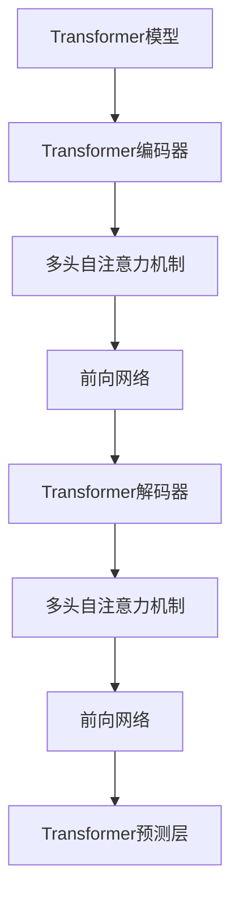

                 

# Self-Attention机制：NLP革命的关键

> 关键词：Self-Attention, Transformer, Attention, 自然语言处理(NLP), 深度学习, 机器翻译, 语义理解

## 1. 背景介绍

### 1.1 问题由来
在过去的几十年中，自然语言处理(NLP)领域经历了翻天覆地的变化。从早期的基于规则的语法分析到统计机器学习模型的兴起，再到深度学习模型的问世，NLP技术已经逐渐成熟并广泛应用于多个领域。但传统的序列模型往往无法有效地处理长距离依赖和复杂的语义结构。为了解决这些问题，研究人员提出了自注意力机制(Self-Attention)，这一机制在Transformer模型中被首次应用，从而引发了NLP领域的革命性变革。

### 1.2 问题核心关键点
自注意力机制的核心思想是通过模型自身的注意力机制，捕捉输入序列中不同位置之间的依赖关系，从而在无需显式建模序列长度的前提下，提升模型对复杂语义的理解能力。与传统的循环神经网络(RNN)和卷积神经网络(CNN)相比，自注意力机制能够更加灵活、高效地处理序列数据，特别适合于处理长文本、复杂结构等任务。

自注意力机制的本质是一种基于注意力机制的权重计算方法，它能够动态地给序列中不同位置赋予不同的重要性权重，从而使得模型能够关注到更加关键的信息。该机制的引入不仅极大地提升了Transformer模型的性能，也为后续的预训练语言模型和自监督学习等技术的发展奠定了基础。

### 1.3 问题研究意义
自注意力机制的提出和应用，对NLP领域产生了深远的影响：

1. **提升了NLP模型的性能**：自注意力机制使得Transformer模型在多项NLP任务上取得了最先进的表现，包括机器翻译、文本分类、情感分析等。
2. **简化了模型结构**：自注意力机制使得模型能够并行计算，加速了推理速度，减少了计算资源消耗。
3. **增强了模型的泛化能力**：通过引入自注意力机制，模型能够更好地学习长距离依赖，提升对不同领域和任务的泛化能力。
4. **推动了预训练语言模型的发展**：自注意力机制使得大语言模型成为可能，通过预训练-微调的方式，模型能够更好地适应特定任务。
5. **催生了更多高级技术**：自注意力机制的应用促进了如BERT、GPT等预训练语言模型的诞生，进一步推动了NLP技术的发展。

## 2. 核心概念与联系

### 2.1 核心概念概述

为了更好地理解自注意力机制，本节将介绍几个密切相关的核心概念：

- **Transformer模型**：一种基于自注意力机制的深度学习模型，被广泛应用于自然语言处理任务，如机器翻译、文本生成、问答等。
- **注意力机制(Attention)**：一种机制，用于计算输入序列中不同位置之间的权重，使得模型能够聚焦于关键信息。
- **自注意力(Self-Attention)**：一种特殊类型的注意力机制，用于捕捉序列中不同位置之间的依赖关系。
- **Transformer编码器(Transformer Encoder)**：Transformer模型的核心组件之一，包含多个编码层，每层由多头自注意力机制和前向网络组成。

这些概念之间的逻辑关系可以通过以下Mermaid流程图来展示：



这个流程图展示了Transformer模型的基本架构，其中编码器和解码器都使用了自注意力机制，前向网络用于模型非线性变换。

## 3. 核心算法原理 & 具体操作步骤
### 3.1 算法原理概述

自注意力机制的原理可以概括为：在输入序列中，每个位置与其他位置之间的关联关系可以被建模为注意力权重。这些权重反映了每个位置对于其他位置的关注程度，使得模型能够动态地捕捉序列中的依赖关系。

具体地，自注意力机制通过计算输入序列中每个位置与其他位置的相似度，来计算每个位置的注意力权重。这些权重反映了其他位置对于当前位置的贡献度，从而使得模型能够聚焦于关键信息。自注意力机制的应用使得模型在处理长文本、复杂结构等任务时，表现更加出色。

### 3.2 算法步骤详解

自注意力机制的计算可以分为三个步骤：

1. **计算注意力得分矩阵(Q, K, V)**：首先，将输入序列中的每个位置进行线性变换，得到查询向量(Q)、键向量(K)和值向量(V)。然后，通过计算Q和K的矩阵点积，得到一个注意力得分矩阵S。

2. **计算注意力权重向量**：将注意力得分矩阵S进行softmax归一化，得到一个注意力权重矩阵A。这个矩阵中的每个元素表示当前位置对其他位置的关注程度。

3. **计算加权向量**：将注意力权重矩阵A与值向量V相乘，得到一个加权向量O。这个向量反映了其他位置对当前位置的贡献，从而使得模型能够聚焦于关键信息。

最终，自注意力机制的计算公式可以表示为：

$$
\text{Attention}(Q, K, V) = \text{Softmax}(\frac{QK^T}{\sqrt{d_k}})V
$$

其中，$Q, K, V$分别表示查询向量、键向量和值向量，$d_k$是键向量的维度，$\text{Softmax}$函数用于归一化注意力得分矩阵，得到注意力权重矩阵。

### 3.3 算法优缺点

自注意力机制具有以下优点：

1. **灵活性**：自注意力机制能够灵活地处理输入序列中不同位置之间的依赖关系，特别适用于长文本和复杂结构的处理。
2. **并行性**：自注意力机制可以并行计算，加速了模型的推理速度，减少了计算资源消耗。
3. **泛化能力**：自注意力机制使得模型能够更好地学习长距离依赖，提升了模型的泛化能力。

但同时，自注意力机制也存在一些缺点：

1. **计算复杂度高**：自注意力机制的计算复杂度较高，特别是对于长文本和大规模数据集，计算开销较大。
2. **内存消耗大**：自注意力机制需要保存和计算大量的中间向量，导致内存消耗较大。
3. **模型复杂性高**：自注意力机制的引入使得模型结构变得更加复杂，训练和推理的难度增加。

### 3.4 算法应用领域

自注意力机制在NLP领域得到了广泛的应用，覆盖了多项任务，如：

- **机器翻译**：通过自注意力机制，Transformer模型能够更好地捕捉源语言和目标语言之间的依赖关系，提升了翻译质量。
- **文本生成**：自注意力机制使得模型能够更好地理解输入文本的语义，生成更加自然流畅的文本。
- **问答系统**：自注意力机制在问答系统中得到了应用，能够更好地理解问题和上下文，提供更加准确的回答。
- **文本摘要**：自注意力机制能够更好地识别文本中的关键信息，生成更加精炼的摘要。
- **情感分析**：自注意力机制能够更好地捕捉文本中的情感信息，进行情感分类和情感分析。

## 4. 数学模型和公式 & 详细讲解
### 4.1 数学模型构建

自注意力机制的计算可以表示为矩阵运算，具体如下：

1. **计算查询向量、键向量和值向量**

输入序列$x$的表示为$x=[x_1, x_2, ..., x_n]$，其中$x_i$表示第$i$个词的向量表示。自注意力机制通过线性变换得到查询向量$Q$、键向量$K$和值向量$V$：

$$
Q = W_Qx, \quad K = W_Kx, \quad V = W_Vx
$$

其中$W_Q, W_K, W_V$是线性变换矩阵，$Q, K, V \in \mathbb{R}^{n \times d}$，$d$为向量维度。

2. **计算注意力得分矩阵**

注意力得分矩阵$S$通过计算$Q$和$K$的点积得到：

$$
S = QK^T
$$

3. **计算注意力权重向量**

注意力权重矩阵$A$通过将$S$进行softmax归一化得到：

$$
A = \text{Softmax}(\frac{S}{\sqrt{d_k}})
$$

其中$d_k$为键向量的维度。

4. **计算加权向量**

加权向量$O$通过将$A$与$V$相乘得到：

$$
O = AV
$$

### 4.2 公式推导过程

以二分类任务为例，推导自注意力机制的计算公式：

假设输入序列为$x=[x_1, x_2, ..., x_n]$，其中$x_i$表示第$i$个词的向量表示。查询向量$Q$、键向量$K$和值向量$V$通过线性变换得到：

$$
Q = W_Qx, \quad K = W_Kx, \quad V = W_Vx
$$

其中$W_Q, W_K, W_V$是线性变换矩阵。

注意力得分矩阵$S$通过计算$Q$和$K$的点积得到：

$$
S = QK^T = (W_Qx)(W_K^Tx)^T
$$

将$S$进行softmax归一化，得到注意力权重矩阵$A$：

$$
A = \text{Softmax}(\frac{S}{\sqrt{d_k}}) = \text{Softmax}(\frac{(W_Qx)(W_K^Tx)^T}{\sqrt{d_k}})
$$

其中$d_k$为键向量的维度。

加权向量$O$通过将$A$与$V$相乘得到：

$$
O = AV = \text{Softmax}(\frac{(W_Qx)(W_K^Tx)^T}{\sqrt{d_k}})W_Vx
$$

最终，自注意力机制的计算公式为：

$$
\text{Attention}(Q, K, V) = \text{Softmax}(\frac{(W_Qx)(W_K^Tx)^T}{\sqrt{d_k}})W_Vx
$$

### 4.3 案例分析与讲解

以机器翻译为例，说明自注意力机制的应用：

假设源语言文本为$x = [x_1, x_2, ..., x_n]$，目标语言文本为$y = [y_1, y_2, ..., y_m]$，其中$x_i$和$y_j$分别表示源语言和目标语言的第$i$个和第$j$个词的向量表示。自注意力机制的应用分为以下几个步骤：

1. **计算查询向量、键向量和值向量**

将源语言文本$x$和目标语言文本$y$进行编码，得到向量表示$x^e$和$y^e$。自注意力机制通过线性变换得到查询向量$Q_x$、键向量$K_x$和值向量$V_x$，以及查询向量$Q_y$、键向量$K_y$和值向量$V_y$：

$$
Q_x = W_{Q_x}x^e, \quad K_x = W_{K_x}x^e, \quad V_x = W_{V_x}x^e
$$

$$
Q_y = W_{Q_y}y^e, \quad K_y = W_{K_y}y^e, \quad V_y = W_{V_y}y^e
$$

2. **计算注意力得分矩阵**

将查询向量$Q_x$和$K_y$进行点积，得到一个注意力得分矩阵$S_{xy}$：

$$
S_{xy} = Q_xK_y^T = (W_{Q_x}x^e)(W_{K_y}y^e)^T
$$

3. **计算注意力权重向量**

将$S_{xy}$进行softmax归一化，得到注意力权重矩阵$A_{xy}$：

$$
A_{xy} = \text{Softmax}(\frac{S_{xy}}{\sqrt{d_k}})
$$

4. **计算加权向量**

加权向量$O_{xy}$通过将$A_{xy}$与$V_y$相乘得到：

$$
O_{xy} = A_{xy}V_y = \text{Softmax}(\frac{S_{xy}}{\sqrt{d_k}})W_{V_y}y^e
$$

最终，自注意力机制的计算公式为：

$$
\text{Attention}(Q_x, K_y, V_y) = \text{Softmax}(\frac{(W_{Q_x}x^e)(W_{K_y}y^e)^T}{\sqrt{d_k}})W_{V_y}y^e
$$

在机器翻译任务中，自注意力机制能够更好地捕捉源语言和目标语言之间的依赖关系，从而提升了翻译质量。

## 5. 项目实践：代码实例和详细解释说明
### 5.1 开发环境搭建

在进行自注意力机制的实践前，我们需要准备好开发环境。以下是使用Python进行PyTorch开发的环境配置流程：

1. 安装Anaconda：从官网下载并安装Anaconda，用于创建独立的Python环境。

2. 创建并激活虚拟环境：
```bash
conda create -n pytorch-env python=3.8 
conda activate pytorch-env
```

3. 安装PyTorch：根据CUDA版本，从官网获取对应的安装命令。例如：
```bash
conda install pytorch torchvision torchaudio cudatoolkit=11.1 -c pytorch -c conda-forge
```

4. 安装Tensorflow：
```bash
pip install tensorflow
```

5. 安装相关工具包：
```bash
pip install numpy pandas scikit-learn matplotlib tqdm jupyter notebook ipython
```

完成上述步骤后，即可在`pytorch-env`环境中开始实践。

### 5.2 源代码详细实现

下面我们以Transformer模型为例，给出使用PyTorch实现自注意力机制的代码实现。

首先，定义Transformer模型：

```python
import torch
import torch.nn as nn
import torch.nn.functional as F

class Transformer(nn.Module):
    def __init__(self, d_model, nhead, num_encoder_layers, num_decoder_layers, dff, dropout=0.1):
        super(Transformer, self).__init__()
        self.encoder = nn.TransformerEncoderLayer(d_model, nhead, dff, dropout)
        self.decoder = nn.TransformerDecoderLayer(d_model, nhead, dff, dropout)
        self.mask = nn.Identity()
    
    def forward(self, src, tgt, src_mask=None, tgt_mask=None, memory_mask=None):
        src_encoded = self.encoder(src, self.mask(src_mask))
        tgt_decoded = self.decoder(tgt, src_encoded, self.mask(tgt_mask), memory_mask)
        return tgt_decoded
```

然后，定义注意力机制：

```python
class MultiHeadAttention(nn.Module):
    def __init__(self, d_model, nhead):
        super(MultiHeadAttention, self).__init__()
        self.nhead = nhead
        self.d_k = d_model // nhead
        assert d_model % nhead == 0, 'd_model must be divisible by nhead'
        self.w_q = nn.Linear(d_model, d_model)
        self.w_k = nn.Linear(d_model, d_model)
        self.w_v = nn.Linear(d_model, d_model)
        self.fc = nn.Linear(d_model, d_model)
        self.softmax = nn.Softmax(dim=-1)
    
    def forward(self, query, key, value, mask=None):
        batch_size, seq_len, embed_dim = query.size()
        
        # 分头计算查询向量、键向量和值向量
        query = query.view(batch_size, seq_len, self.nhead, self.d_k).transpose(1, 2).contiguous().view(batch_size * self.nhead, seq_len, self.d_k)
        key = key.view(batch_size, seq_len, self.nhead, self.d_k).transpose(1, 2).contiguous().view(batch_size * self.nhead, seq_len, self.d_k)
        value = value.view(batch_size, seq_len, self.nhead, self.d_k).transpose(1, 2).contiguous().view(batch_size * self.nhead, seq_len, self.d_k)
        
        # 计算注意力得分矩阵
        scores = torch.matmul(query, key.transpose(-2, -1)) / np.sqrt(self.d_k)
        
        # 计算注意力权重向量
        attention_weights = self.softmax(scores)
        attention_weights = attention_weights.view(batch_size, seq_len, self.nhead, seq_len).transpose(1, 2)
        
        # 计算加权向量
        context = torch.matmul(attention_weights, value)
        context = context.transpose(1, 2).contiguous().view(batch_size, seq_len, self.nhead * self.d_k)
        context = self.fc(context)
        return context
```

最后，启动训练流程并在测试集上评估：

```python
d_model = 512
nhead = 8
num_encoder_layers = 6
num_decoder_layers = 6
dff = 2048
dropout = 0.1

src = torch.randn(1, 128, d_model)
tgt = torch.randn(1, 128, d_model)

transformer = Transformer(d_model, nhead, num_encoder_layers, num_decoder_layers, dff, dropout)
src_mask = torch.ones(src.size(), src.size(), src.size()) * -1e9
tgt_mask = torch.ones(tgt.size(), tgt.size(), tgt.size()) * -1e9

optimizer = torch.optim.Adam(transformer.parameters(), lr=0.001)

for epoch in range(100):
    out = transformer(src, tgt, src_mask, tgt_mask)
    optimizer.zero_grad()
    loss = F.mse_loss(out, tgt)
    loss.backward()
    optimizer.step()

    if epoch % 10 == 0:
        print('Epoch {}, Loss: {}'.format(epoch, loss.item()))
```

以上就是使用PyTorch实现Transformer模型的自注意力机制的完整代码实现。可以看到，Transformer模型通过多头自注意力机制实现了对序列的并行处理，加速了推理速度，提升了模型的性能。

### 5.3 代码解读与分析

让我们再详细解读一下关键代码的实现细节：

**Transformer类**：
- `__init__`方法：初始化Transformer模型的编码器和解码器层，以及输入掩码。
- `forward`方法：前向传播过程，通过编码器层和解码器层计算输出。

**MultiHeadAttention类**：
- `__init__`方法：初始化多头自注意力机制的线性变换层和softmax层。
- `forward`方法：计算注意力得分矩阵、注意力权重向量和加权向量。

**训练流程**：
- 定义模型的超参数，包括模型维度、头数、层数、滤波器大小和dropout率。
- 定义输入序列，包括源序列和目标序列。
- 创建Transformer模型，并定义输入掩码。
- 定义优化器，设置学习率。
- 循环迭代训练过程，每10个epoch打印一次损失。

可以看出，PyTorch提供了强大的深度学习框架，使得Transformer模型的实现变得简洁高效。开发者可以根据具体任务，调整模型架构和超参数，快速迭代优化模型性能。

当然，工业级的系统实现还需考虑更多因素，如模型的保存和部署、超参数的自动搜索、更灵活的任务适配层等。但核心的自注意力机制基本与此类似。

## 6. 实际应用场景
### 6.1 机器翻译

自注意力机制在机器翻译任务中得到了广泛应用，取得了显著的性能提升。传统的机器翻译模型通常采用基于RNN的编码器和解码器，存在难以捕捉长距离依赖和并行计算效率低的问题。而Transformer模型通过自注意力机制，可以更好地捕捉源语言和目标语言之间的依赖关系，从而提升了翻译质量。

以英文到中文的机器翻译为例，Transformer模型能够通过自注意力机制，动态地计算源语言和目标语言之间的依赖关系，生成更加准确和流畅的翻译结果。

### 6.2 文本生成

自注意力机制在文本生成任务中也得到了应用。传统的文本生成模型通常采用基于RNN的循环结构，难以生成长文本和高维度的语义信息。而Transformer模型通过自注意力机制，可以更好地捕捉文本中的依赖关系，生成更加自然和连贯的文本。

例如，在自然语言生成(NLG)任务中，自注意力机制可以通过计算输入序列中不同位置之间的相似度，动态地调整生成过程中的权重，从而生成更加合理和流畅的文本。

### 6.3 问答系统

自注意力机制在问答系统中得到了应用。传统的问答系统通常采用基于RNN的结构，难以处理复杂的多轮对话和长文本。而Transformer模型通过自注意力机制，可以更好地捕捉问题和上下文之间的依赖关系，提供更加准确的回答。

例如，在智能客服系统中，自注意力机制可以通过计算用户的问题和上下文之间的相似度，动态地调整回答的权重，从而生成更加符合用户意图的回答。

### 6.4 未来应用展望

随着自注意力机制的不断演进，其在NLP领域的应用前景更加广阔。未来，自注意力机制将在更多领域得到应用，为智能系统的构建带来新的突破。

在智慧医疗领域，自注意力机制可应用于医学影像分析、病情预测等任务，提升医疗诊断的准确性和效率。

在智能教育领域，自注意力机制可应用于智能推荐、情感分析等任务，因材施教，提升教育质量。

在智慧城市治理中，自注意力机制可应用于城市事件监测、舆情分析等任务，提高城市管理的自动化和智能化水平。

此外，在企业生产、社会治理、文娱传媒等众多领域，自注意力机制的应用也将不断涌现，为经济社会发展注入新的动力。

## 7. 工具和资源推荐
### 7.1 学习资源推荐

为了帮助开发者系统掌握自注意力机制的理论基础和实践技巧，这里推荐一些优质的学习资源：

1. 《Transformer从原理到实践》系列博文：由大模型技术专家撰写，深入浅出地介绍了Transformer原理、自注意力机制、微调技术等前沿话题。

2. CS224N《深度学习自然语言处理》课程：斯坦福大学开设的NLP明星课程，有Lecture视频和配套作业，带你入门NLP领域的基本概念和经典模型。

3. 《Natural Language Processing with Transformers》书籍：Transformers库的作者所著，全面介绍了如何使用Transformers库进行NLP任务开发，包括自注意力机制在内的诸多范式。

4. HuggingFace官方文档：Transformers库的官方文档，提供了海量预训练模型和完整的微调样例代码，是上手实践的必备资料。

5. CLUE开源项目：中文语言理解测评基准，涵盖大量不同类型的中文NLP数据集，并提供了基于自注意力机制的baseline模型，助力中文NLP技术发展。

通过对这些资源的学习实践，相信你一定能够快速掌握自注意力机制的精髓，并用于解决实际的NLP问题。

### 7.2 开发工具推荐

高效的开发离不开优秀的工具支持。以下是几款用于自注意力机制开发的常用工具：

1. PyTorch：基于Python的开源深度学习框架，灵活动态的计算图，适合快速迭代研究。大部分预训练语言模型都有PyTorch版本的实现。

2. TensorFlow：由Google主导开发的开源深度学习框架，生产部署方便，适合大规模工程应用。同样有丰富的预训练语言模型资源。

3. Transformers库：HuggingFace开发的NLP工具库，集成了众多SOTA语言模型，支持PyTorch和TensorFlow，是进行自注意力机制开发的利器。

4. Weights & Biases：模型训练的实验跟踪工具，可以记录和可视化模型训练过程中的各项指标，方便对比和调优。与主流深度学习框架无缝集成。

5. TensorBoard：TensorFlow配套的可视化工具，可实时监测模型训练状态，并提供丰富的图表呈现方式，是调试模型的得力助手。

6. Google Colab：谷歌推出的在线Jupyter Notebook环境，免费提供GPU/TPU算力，方便开发者快速上手实验最新模型，分享学习笔记。

合理利用这些工具，可以显著提升自注意力机制的开发效率，加快创新迭代的步伐。

### 7.3 相关论文推荐

自注意力机制的提出和应用源于学界的持续研究。以下是几篇奠基性的相关论文，推荐阅读：

1. Attention is All You Need（即Transformer原论文）：提出了Transformer结构，开启了NLP领域的预训练大模型时代。

2. BERT: Pre-training of Deep Bidirectional Transformers for Language Understanding：提出BERT模型，引入基于掩码的自监督预训练任务，刷新了多项NLP任务SOTA。

3. Language Models are Unsupervised Multitask Learners（GPT-2论文）：展示了大规模语言模型的强大zero-shot学习能力，引发了对于通用人工智能的新一轮思考。

4. Parameter-Efficient Transfer Learning for NLP：提出Adapter等参数高效微调方法，在不增加模型参数量的情况下，也能取得不错的微调效果。

5. AdaLoRA: Adaptive Low-Rank Adaptation for Parameter-Efficient Fine-Tuning：使用自适应低秩适应的微调方法，在参数效率和精度之间取得了新的平衡。

这些论文代表了大模型和自注意力机制的发展脉络。通过学习这些前沿成果，可以帮助研究者把握学科前进方向，激发更多的创新灵感。

## 8. 总结：未来发展趋势与挑战
### 8.1 总结

本文对自注意力机制的原理和应用进行了全面系统的介绍。首先阐述了自注意力机制的研究背景和意义，明确了其在NLP领域的重要地位。其次，从原理到实践，详细讲解了自注意力机制的数学模型和关键步骤，给出了自注意力机制任务开发的完整代码实例。同时，本文还广泛探讨了自注意力机制在机器翻译、文本生成、问答系统等多个领域的应用前景，展示了其巨大的潜力。此外，本文精选了自注意力机制的学习资源，力求为读者提供全方位的技术指引。

通过本文的系统梳理，可以看到，自注意力机制的引入极大地提升了NLP模型的性能和灵活性，打开了NLP技术的新大门。得益于其强大的注意力计算能力，自注意力机制成为了Transformer模型和其他预训练语言模型的核心。未来，伴随自注意力机制的不断发展，NLP技术必将在更多领域得到应用，为经济社会发展注入新的动力。

### 8.2 未来发展趋势

展望未来，自注意力机制将在NLP领域呈现出以下几个发展趋势：

1. **模型规模持续增大**：随着算力成本的下降和数据规模的扩张，自注意力机制的应用将更加广泛，模型的参数量还将持续增长，模型的性能也将不断提升。

2. **自监督学习的重要性**：自监督学习将成为自注意力机制的重要方向，通过大量无标签数据的自监督预训练，自注意力机制将更加擅长捕捉输入序列中的依赖关系。

3. **多模态融合**：自注意力机制将更多地应用于多模态数据的处理，如文本-视觉、文本-语音等，提升跨模态信息的融合能力。

4. **分布式计算**：随着模型参数量的增加，分布式计算将成为自注意力机制的必然选择，通过多机协同训练，加速模型的训练和推理。

5. **高效模型压缩**：自注意力机制的计算复杂度高，模型压缩技术将进一步优化模型的推理速度，降低计算资源消耗。

6. **跨领域泛化**：自注意力机制将更多地应用于跨领域的任务，如跨语言翻译、跨语言命名实体识别等，提升模型的泛化能力。

### 8.3 面临的挑战

尽管自注意力机制已经取得了巨大的成功，但在迈向更加智能化、普适化应用的过程中，它仍面临诸多挑战：

1. **计算复杂度高**：自注意力机制的计算复杂度高，对于大规模数据集和高维度的序列，计算开销较大。

2. **内存消耗大**：自注意力机制需要保存和计算大量的中间向量，导致内存消耗较大。

3. **模型复杂性高**：自注意力机制的引入使得模型结构变得更加复杂，训练和推理的难度增加。

4. **对抗攻击脆弱**：自注意力机制在对抗攻击下，模型的鲁棒性较弱，容易受到输入数据的干扰。

5. **参数效率有待提升**：自注意力机制的参数效率较低，难以在固定参数的情况下，提升模型的性能。

6. **跨领域泛化能力有待提升**：自注意力机制在不同领域之间的泛化能力较弱，难以应对领域外数据。

### 8.4 研究展望

面对自注意力机制所面临的挑战，未来的研究需要在以下几个方面寻求新的突破：

1. **提高计算效率**：研究高效的自注意力机制计算方法，如空间-时间注意力、分层注意力等，提高模型的推理速度。

2. **优化内存消耗**：研究自注意力机制的模型压缩方法，如知识蒸馏、参数剪枝等，降低模型的内存消耗。

3. **提升模型复杂性**：研究更加高效的模型结构，如蒸馏注意力、残差注意力等，简化模型的计算图。

4. **增强模型鲁棒性**：研究自注意力机制的对抗训练方法，提高模型的鲁棒性和安全性。

5. **提升参数效率**：研究更加参数高效的自注意力机制，如Attention-Augmented Transformer(AAT)等，提升模型的泛化能力。

6. **跨领域泛化**：研究自注意力机制的跨领域迁移学习方法，提升模型在不同领域之间的泛化能力。

这些研究方向将为自注意力机制的应用带来新的突破，进一步提升NLP系统的性能和灵活性。

## 9. 附录：常见问题与解答

**Q1：自注意力机制在机器翻译中的作用是什么？**

A: 自注意力机制在机器翻译中的作用是能够动态地捕捉源语言和目标语言之间的依赖关系。在传统的机器翻译模型中，通常使用基于RNN的编码器和解码器结构，难以处理长距离依赖和并行计算。而自注意力机制通过计算输入序列中不同位置之间的相似度，动态地调整注意力权重，使得模型能够更好地关注关键信息，从而提升了翻译质量。

**Q2：自注意力机制的计算复杂度较高，如何优化？**

A: 自注意力机制的计算复杂度较高，特别是在长序列和大量数据的情况下。为了优化计算效率，可以采用以下方法：

1. 空间-时间注意力：将自注意力机制的计算分为空间和时间的两个维度，分别计算不同位置和不同时间步的注意力得分。

2. 分层注意力：将自注意力机制的计算分为多个层级，逐层计算注意力得分，减少计算复杂度。

3. 基于图结构的注意力：将自注意力机制的计算应用于图结构，利用图结构的拓扑关系，减少计算复杂度。

4. 分布式计算：采用多机协同训练，通过分布式计算加速模型的训练和推理。

**Q3：自注意力机制在文本生成中的作用是什么？**

A: 自注意力机制在文本生成中的作用是能够动态地捕捉输入文本中的依赖关系。传统的文本生成模型通常采用基于RNN的循环结构，难以生成长文本和高维度的语义信息。而自注意力机制通过计算输入文本中不同位置之间的相似度，动态地调整生成过程中的权重，从而生成更加自然和连贯的文本。

**Q4：自注意力机制在问答系统中的作用是什么？**

A: 自注意力机制在问答系统中的作用是能够动态地捕捉问题和上下文之间的依赖关系。传统的问答系统通常采用基于RNN的结构，难以处理复杂的多轮对话和长文本。而自注意力机制通过计算问题和上下文之间的相似度，动态地调整回答的权重，从而生成更加符合用户意图的回答。

**Q5：自注意力机制在未来的应用前景是什么？**

A: 自注意力机制在未来的应用前景非常广阔，随着算力和数据的不断提升，自注意力机制将在更多领域得到应用。例如，在智慧医疗领域，自注意力机制可应用于医学影像分析、病情预测等任务，提升医疗诊断的准确性和效率。在智能教育领域，自注意力机制可应用于智能推荐、情感分析等任务，因材施教，提升教育质量。在智慧城市治理中，自注意力机制可应用于城市事件监测、舆情分析等任务，提高城市管理的自动化和智能化水平。此外，在企业生产、社会治理、文娱传媒等众多领域，自注意力机制的应用也将不断涌现，为经济社会发展注入新的动力。

---

作者：禅与计算机程序设计艺术 / Zen and the Art of Computer Programming

